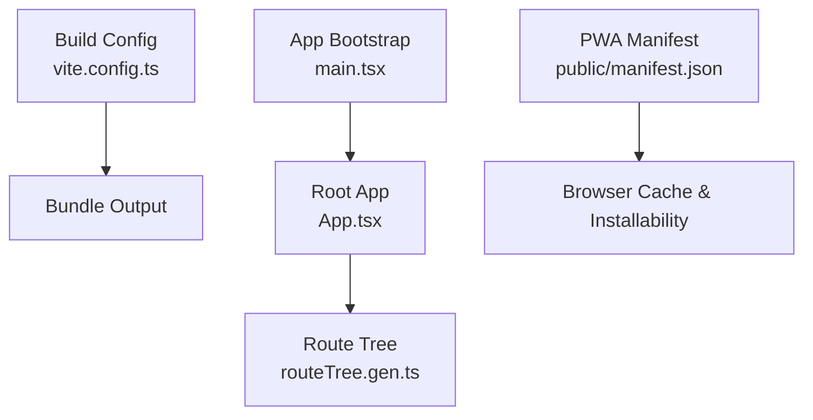
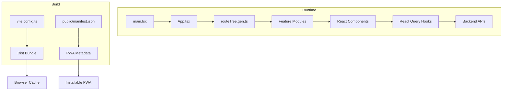
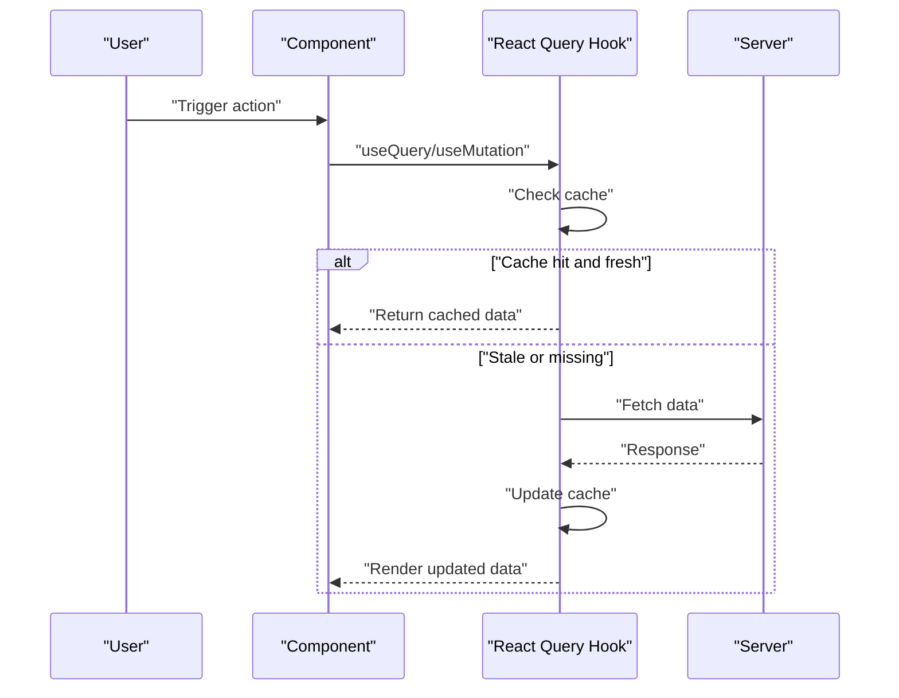
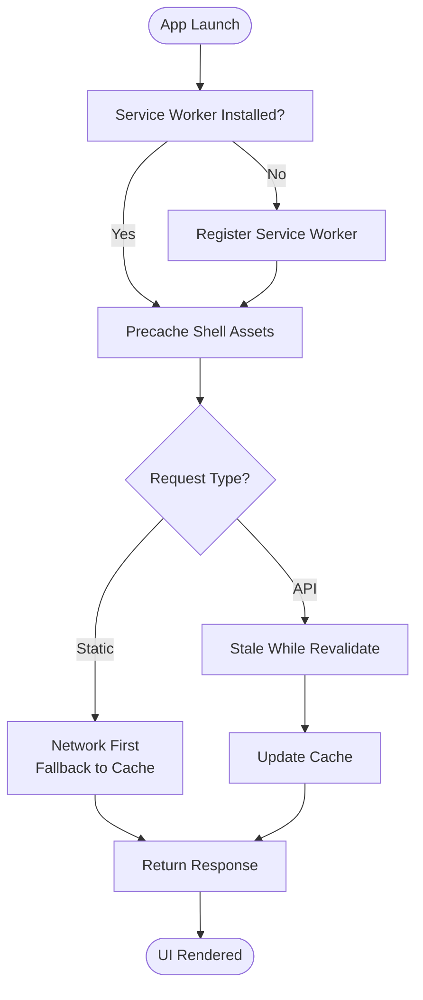
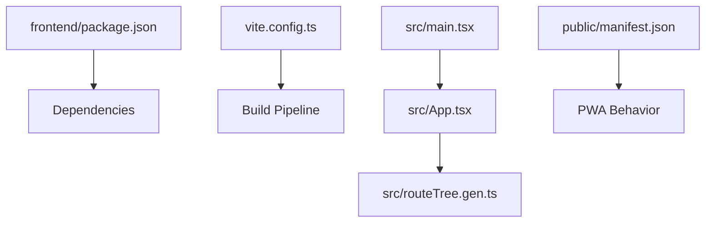

# Frontend Performance Optimization

<cite>
**Referenced Files in This Document**
- [frontend/package.json](file://frontend/package.json)
- [frontend/vite.config.ts](file://frontend/vite.config.ts)
- [frontend/src/main.tsx](file://frontend/src/main.tsx)
- [frontend/src/App.tsx](file://frontend/src/App.tsx)
- [frontend/src/routeTree.gen.ts](file://frontend/src/routeTree.gen.ts)
- [frontend/public/manifest.json](file://frontend/public/manifest.json)
</cite>

## Table of Contents
1. [Introduction](#introduction)
2. [Project Structure](#project-structure)
3. [Core Components](#core-components)
4. [Architecture Overview](#architecture-overview)
5. [Detailed Component Analysis](#detailed-component-analysis)
6. [Dependency Analysis](#dependency-analysis)
7. [Performance Considerations](#performance-considerations)
8. [Troubleshooting Guide](#troubleshooting-guide)
9. [Conclusion](#conclusion)
10. [Appendices](#appendices)

## Introduction
This document provides a comprehensive guide to optimizing the eLISAschool frontend for performance. It covers React component optimization (memoization, lazy loading, code splitting), data fetching with React Query (caching, background updates, optimistic updates), bundle size reduction (tree shaking, asset optimization), rendering improvements (virtual scrolling, memory leak prevention), mobile and PWA considerations, and browser caching strategies including service workers and offline capabilities. The guidance is tailored to the existing Vite-based React application structure and tooling.

## Project Structure
The frontend is a Vite + React application organized by features and routes. Key areas relevant to performance include:
- Build configuration (Vite) for bundling, code splitting, and asset handling
- Application bootstrap and root setup
- Generated route tree for TanStack Router code-splitting
- PWA manifest for progressive web app behavior

**Diagram sources**
- [frontend/vite.config.ts](file://frontend/vite.config.ts)
- [frontend/src/main.tsx](file://frontend/src/main.tsx)
- [frontend/src/App.tsx](file://frontend/src/App.tsx)
- [frontend/src/routeTree.gen.ts](file://frontend/src/routeTree.gen.ts)
- [frontend/public/manifest.json](file://frontend/public/manifest.json)

**Section sources**
- [frontend/vite.config.ts](file://frontend/vite.config.ts)
- [frontend/src/main.tsx](file://frontend/src/main.tsx)
- [frontend/src/App.tsx](file://frontend/src/App.tsx)
- [frontend/src/routeTree.gen.ts](file://frontend/src/routeTree.gen.ts)
- [frontend/public/manifest.json](file://frontend/public/manifest.json)

## Core Components
- Build system: Vite config controls bundling, chunking, and asset processing.
- App entry: main.tsx initializes the React app and providers.
- Root component: App.tsx composes global layout and routing.
- Routing: routeTree.gen.ts enables route-level code splitting via TanStack Router.
- PWA: public/manifest.json defines installable app metadata.

Practical implications:
- Use dynamic imports and route-level splits to reduce initial payload.
- Configure Vite plugins for image optimization and asset hashing.
- Ensure providers are lightweight and avoid heavy initialization at startup.

**Section sources**
- [frontend/vite.config.ts](file://frontend/vite.config.ts)
- [frontend/src/main.tsx](file://frontend/src/main.tsx)
- [frontend/src/App.tsx](file://frontend/src/App.tsx)
- [frontend/src/routeTree.gen.ts](file://frontend/src/routeTree.gen.ts)
- [frontend/public/manifest.json](file://frontend/public/manifest.json)

## Architecture Overview
The frontend follows a feature-driven architecture with TanStack Router enabling automatic code splitting per route. Data fetching is centralized through hooks that integrate with React Query for caching and background updates. Assets are optimized via Vite’s pipeline and optional plugins.

**Diagram sources**
- [frontend/src/main.tsx](file://frontend/src/main.tsx)
- [frontend/src/App.tsx](file://frontend/src/App.tsx)
- [frontend/src/routeTree.gen.ts](file://frontend/src/routeTree.gen.ts)
- [frontend/vite.config.ts](file://frontend/vite.config.ts)
- [frontend/public/manifest.json](file://frontend/public/manifest.json)

## Detailed Component Analysis

### React Component Optimization
- Memoization:
  - Use memoized selectors or derived state to prevent unnecessary re-renders.
  - Apply React.memo to pure presentational components receiving stable props.
  - Stabilize callbacks with useCallback where they are passed to memoized children.
- Lazy Loading:
  - Prefer React.lazy with Suspense for heavy components not needed on initial render.
  - Combine with route-level code splitting to defer non-critical UI.
- Code Splitting:
  - Leverage TanStack Router’s generated route tree to split by route automatically.
  - Avoid large third-party libraries in critical paths; import them lazily when needed.
- Rendering Improvements:
  - Minimize deep object creation inside render; lift computations out or memoize results.
  - Keep component trees shallow; extract reusable pieces to reduce diff work.
- Virtual Scrolling:
  - For large lists, use virtualization libraries to render only visible items.
  - Set fixed row heights or implement dynamic height strategies carefully.
- Memory Leak Prevention:
  - Clean up event listeners, timers, and subscriptions in useEffect cleanup functions.
  - Abort in-flight requests on unmount using AbortController.
  - Avoid retaining references to DOM nodes or large objects in closures.

[No sources needed since this section provides general guidance]

### Data Fetching Optimization with React Query
- Caching Strategies:
  - Configure queryKey uniqueness per resource and context (e.g., tenant, filters).
  - Tune staleTime and gcTime to balance freshness and network usage.
  - Deduplicate identical queries across components to avoid redundant requests.
- Background Updates:
  - Enable refetchOnWindowFocus and refetchInterval for periodic refreshes.
  - Use placeholderData to show optimistic views while fetching.
- Optimistic Updates:
  - Update cache immediately with setQueryData, then invalidate or refetch to reconcile.
  - Handle errors by rolling back cached state and notifying users.
- Error Handling:
  - Provide user-friendly error states and retry logic.
  - Surface network failures gracefully with fallback UI.

[No sources needed since this diagram shows conceptual workflow, not actual code structure]

### Bundle Size Optimization
- Tree Shaking:
  - Import only what you need from libraries.
  - Avoid default imports of entire packages when named exports exist.
- Asset Optimization:
  - Compress images and use modern formats (WebP/AVIF) where supported.
  - Inline small assets (icons) and lazy-load larger ones.
- Vendor Chunking:
  - Let Vite split vendor code into separate chunks for better caching.
  - Pin dependency versions to stabilize hashes.
- Analyze Bundles:
  - Use build analysis tools to identify oversized dependencies and remove unused code.

[No sources needed since this section provides general guidance]

### Mobile Performance and Touch Interactions
- Reduce layout thrashing by batching DOM reads/writes.
- Prefer CSS transforms and opacity for animations to leverage GPU acceleration.
- Optimize touch interactions:
  - Debounce frequent events (scroll, resize).
  - Use passive event listeners for scroll and touchmove where appropriate.
- Minimize repaints by avoiding expensive style recalculations.

[No sources needed since this section provides general guidance]

### Progressive Web App Features
- Service Worker:
  - Implement caching strategies for static assets and API responses.
  - Use precaching for shell assets and runtime caching for dynamic content.
- Offline Capability:
  - Cache essential pages and data for offline access.
  - Provide clear feedback when offline and queue actions for later sync.
- Manifest and Icons:
  - Define app metadata, icons, and display modes for installability.

[No sources needed since this diagram shows conceptual workflow, not actual code structure]

### Browser Caching Strategies
- Versioned Assets:
  - Use content hashing for filenames to enable long-term caching.
- HTTP Headers:
  - Configure immutable caching for hashed assets.
  - Use short TTLs for HTML and dynamic endpoints.
- CDN Integration:
  - Serve static assets via CDN with proper cache-control headers.

[No sources needed since this section provides general guidance]

## Dependency Analysis
The frontend depends on Vite for building and TanStack Router for routing and code splitting. The package manifest declares core dependencies and scripts used during development and production builds.

**Diagram sources**
- [frontend/package.json](file://frontend/package.json)
- [frontend/vite.config.ts](file://frontend/vite.config.ts)
- [frontend/src/main.tsx](file://frontend/src/main.tsx)
- [frontend/src/App.tsx](file://frontend/src/App.tsx)
- [frontend/src/routeTree.gen.ts](file://frontend/src/routeTree.gen.ts)
- [frontend/public/manifest.json](file://frontend/public/manifest.json)

**Section sources**
- [frontend/package.json](file://frontend/package.json)
- [frontend/vite.config.ts](file://frontend/vite.config.ts)
- [frontend/src/main.tsx](file://frontend/src/main.tsx)
- [frontend/src/App.tsx](file://frontend/src/App.tsx)
- [frontend/src/routeTree.gen.ts](file://frontend/src/routeTree.gen.ts)
- [frontend/public/manifest.json](file://frontend/public/manifest.json)

## Performance Considerations
- Measure before optimizing:
  - Use Lighthouse, WebPageTest, and browser profiling to identify bottlenecks.
- Prioritize critical path:
  - Defer non-essential scripts and styles.
  - Preload key resources and fonts.
- Monitor runtime performance:
  - Track FPS, long tasks, and memory snapshots.
- Optimize images and media:
  - Use responsive images and lazy loading.
- Reduce JavaScript execution time:
  - Profile heavy computations and move to Web Workers if necessary.

[No sources needed since this section provides general guidance]

## Troubleshooting Guide
- Slow initial load:
  - Inspect bundle sizes and split routes/components.
  - Verify lazy loading is applied to heavy modules.
- Excessive re-renders:
  - Identify components with frequent updates and apply memoization.
  - Stabilize prop references and callbacks.
- Memory leaks:
  - Review useEffect cleanup functions and abort controllers.
  - Check for lingering event listeners and intervals.
- Poor mobile performance:
  - Profile on real devices; optimize animations and layout shifts.
- Offline issues:
  - Validate service worker caching strategies and fallbacks.
  - Test network throttling and offline scenarios.

[No sources needed since this section provides general guidance]

## Conclusion
By combining efficient React patterns, robust data fetching with React Query, strategic code splitting, and strong caching strategies, eLISAschool can achieve fast, responsive experiences across devices. Continuous measurement and targeted optimizations will sustain performance as the application grows.

[No sources needed since this section summarizes without analyzing specific files]

## Appendices
- Recommended tools:
  - Bundle analyzers, Lighthouse, Chrome DevTools Profiler, React DevTools.
- Checklist:
  - Audit dependencies, enable route-level splitting, configure caching, test offline behavior, profile on mobile devices.

[No sources needed since this section provides general guidance]