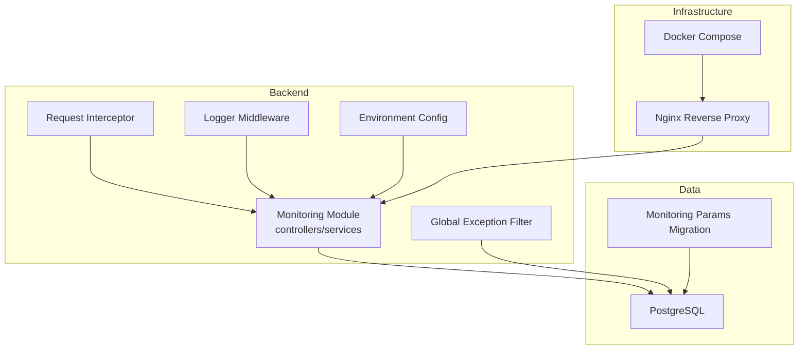
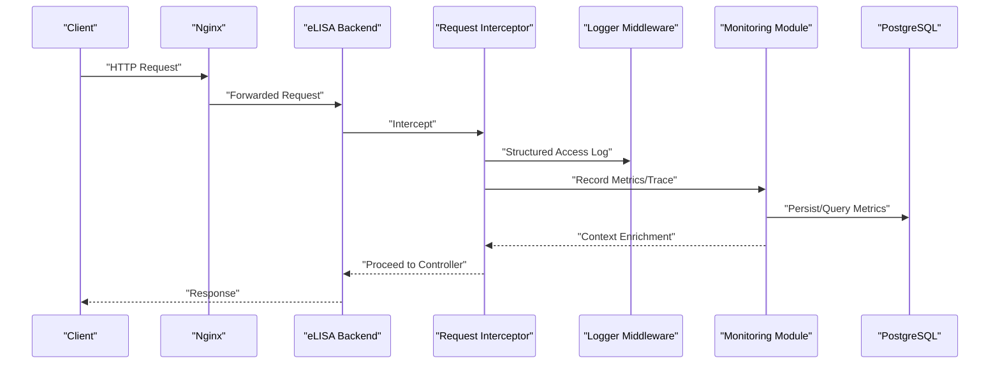
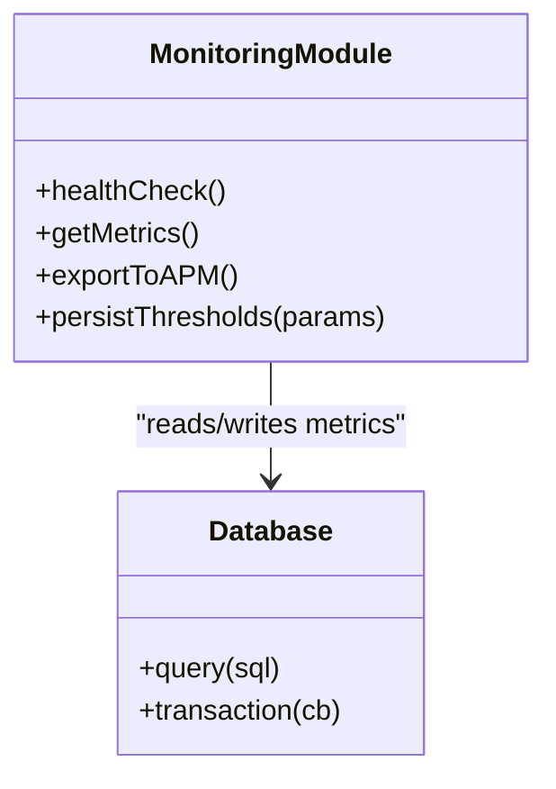
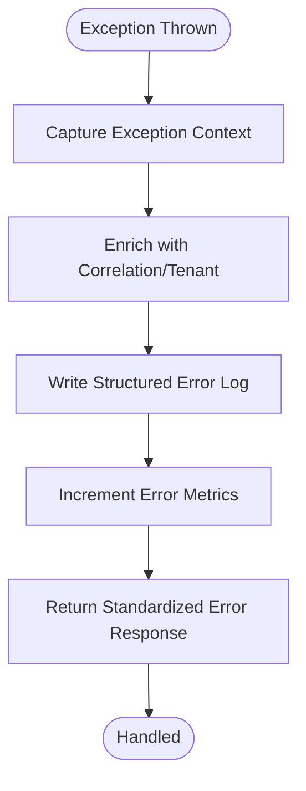
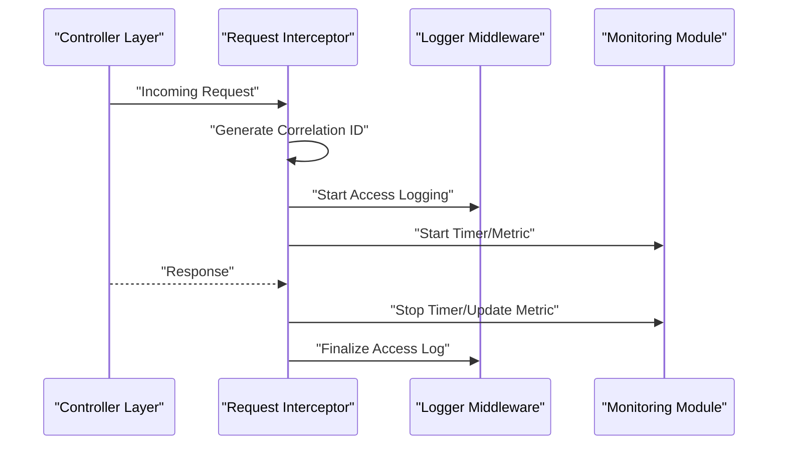
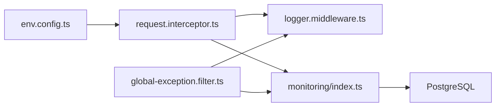

# Monitoring & Diagnostics

<cite>
**Referenced Files in This Document**
- [backend/src/modules/monitoring/index.ts](file://backend/src/modules/monitoring/index.ts)
- [backend/src/common/filters/global-exception.filter.ts](file://backend/src/common/filters/global-exception.filter.ts)
- [backend/src/common/interceptors/request.interceptor.ts](file://backend/src/common/interceptors/request.interceptor.ts)
- [backend/src/common/middlewares/logger.middleware.ts](file://backend/src/common/middlewares/logger.middleware.ts)
- [backend/src/config/env.config.ts](file://backend/src/config/env.config.ts)
- [backend/database/migrations/099-add-monitoring-params.sql](file://backend/database/migrations/099-add-monitoring-params.sql)
- [backend/scripts/load-test-pagination.ts](file://backend/scripts/load-test-pagination.ts)
- [docker/docker-compose.yml](file://docker/docker-compose.yml)
- [docker/nginx.conf](file://docker/nginx.conf)
- [backend/docs/GUIDE-MONITORING-PERFORMANCE-RBAC.md](file://backend/docs/GUIDE-MONITORING-PERFORMANCE-RBAC.md)
</cite>

## Table of Contents
1. [Introduction](#introduction)
2. [Project Structure](#project-structure)
3. [Core Components](#core-components)
4. [Architecture Overview](#architecture-overview)
5. [Detailed Component Analysis](#detailed-component-analysis)
6. [Dependency Analysis](#dependency-analysis)
7. [Performance Considerations](#performance-considerations)
8. [Troubleshooting Guide](#troubleshooting-guide)
9. [Conclusion](#conclusion)
10. [Appendices](#appendices)

## Introduction
This document provides comprehensive monitoring and diagnostics guidance for eLISAschool, focusing on system health checks, application metrics collection, performance dashboards, structured logging, log aggregation, error tracking, exception handling, debugging workflows, APM integration, distributed tracing, bottleneck identification, alerting, incident response, security monitoring, audit trail analysis, and compliance reporting. It maps these practices to the existing backend modules and configuration artifacts present in the repository.

## Project Structure
The monitoring and observability features are primarily implemented under the backend module structure:
- Monitoring module entrypoint and controllers/services
- Global exception filter for centralized error handling
- Request interceptor for request lifecycle instrumentation
- Logger middleware for structured HTTP access logs
- Environment configuration for runtime toggles and thresholds
- Database migration for monitoring parameters storage
- Docker Compose and Nginx for infrastructure-level exposure and reverse proxy logging
- Documentation guide for performance monitoring with RBAC

**Diagram sources**
- [backend/src/modules/monitoring/index.ts](file://backend/src/modules/monitoring/index.ts)
- [backend/src/common/filters/global-exception.filter.ts](file://backend/src/common/filters/global-exception.filter.ts)
- [backend/src/common/interceptors/request.interceptor.ts](file://backend/src/common/interceptors/request.interceptor.ts)
- [backend/src/common/middlewares/logger.middleware.ts](file://backend/src/common/middlewares/logger.middleware.ts)
- [backend/src/config/env.config.ts](file://backend/src/config/env.config.ts)
- [backend/database/migrations/099-add-monitoring-params.sql](file://backend/database/migrations/099-add-monitoring-params.sql)
- [docker/docker-compose.yml](file://docker/docker-compose.yml)
- [docker/nginx.conf](file://docker/nginx.conf)

**Section sources**
- [backend/src/modules/monitoring/index.ts](file://backend/src/modules/monitoring/index.ts)
- [backend/src/common/filters/global-exception.filter.ts](file://backend/src/common/filters/global-exception.filter.ts)
- [backend/src/common/interceptors/request.interceptor.ts](file://backend/src/common/interceptors/request.interceptor.ts)
- [backend/src/common/middlewares/logger.middleware.ts](file://backend/src/common/middlewares/logger.middleware.ts)
- [backend/src/config/env.config.ts](file://backend/src/config/env.config.ts)
- [backend/database/migrations/099-add-monitoring-params.sql](file://backend/database/migrations/099-add-monitoring-params.sql)
- [docker/docker-compose.yml](file://docker/docker-compose.yml)
- [docker/nginx.conf](file://docker/nginx.conf)

## Core Components
- Monitoring module: Centralizes health endpoints, metrics collection, and dashboard data providers.
- Global exception filter: Captures unhandled exceptions, enriches context, and standardizes error responses.
- Request interceptor: Measures latency, records request metadata, and correlates traces across layers.
- Logger middleware: Emits structured HTTP access logs (method, path, status, duration, tenant).
- Environment config: Provides feature flags, sampling rates, and threshold values for alerts.
- Monitoring params migration: Persists tuning parameters (e.g., retention windows, thresholds) into the database.

Key responsibilities:
- Health checks: Readiness/liveness probes and dependency checks (DB, cache).
- Metrics: HTTP latency percentiles, error rates, throughput, and business KPIs.
- Structured logging: Consistent JSON format with correlation IDs and tenant scoping.
- Error tracking: Centralized capture and enrichment for downstream systems.
- Performance dashboards: Aggregated metrics exposed for visualization tools.

**Section sources**
- [backend/src/modules/monitoring/index.ts](file://backend/src/modules/monitoring/index.ts)
- [backend/src/common/filters/global-exception.filter.ts](file://backend/src/common/filters/global-exception.filter.ts)
- [backend/src/common/interceptors/request.interceptor.ts](file://backend/src/common/interceptors/request.interceptor.ts)
- [backend/src/common/middlewares/logger.middleware.ts](file://backend/src/common/middlewares/logger.middleware.ts)
- [backend/src/config/env.config.ts](file://backend/src/config/env.config.ts)
- [backend/database/migrations/099-add-monitoring-params.sql](file://backend/database/migrations/099-add-monitoring-params.sql)

## Architecture Overview
End-to-end flow from client to persistence with observability hooks:

**Diagram sources**
- [docker/nginx.conf](file://docker/nginx.conf)
- [backend/src/common/interceptors/request.interceptor.ts](file://backend/src/common/interceptors/request.interceptor.ts)
- [backend/src/common/middlewares/logger.middleware.ts](file://backend/src/common/middlewares/logger.middleware.ts)
- [backend/src/modules/monitoring/index.ts](file://backend/src/modules/monitoring/index.ts)
- [backend/database/migrations/099-add-monitoring-params.sql](file://backend/database/migrations/099-add-monitoring-params.sql)

## Detailed Component Analysis

### Monitoring Module
Responsibilities:
- Exposes health endpoints (readiness, liveness, dependency status).
- Collects and aggregates metrics (latency, errors, throughput).
- Provides dashboard-ready datasets and supports external APM exporters.

Operational notes:
- Use environment variables to enable/disable collectors and set sampling rates.
- Persist critical thresholds via the monitoring parameters table.

**Diagram sources**
- [backend/src/modules/monitoring/index.ts](file://backend/src/modules/monitoring/index.ts)
- [backend/database/migrations/099-add-monitoring-params.sql](file://backend/database/migrations/099-add-monitoring-params.sql)

**Section sources**
- [backend/src/modules/monitoring/index.ts](file://backend/src/modules/monitoring/index.ts)
- [backend/database/migrations/099-add-monitoring-params.sql](file://backend/database/migrations/099-add-monitoring-params.sql)

### Global Exception Filter
Responsibilities:
- Catches unhandled exceptions globally.
- Enriches error payloads with correlation ID, tenant, and stack traces (sanitized).
- Ensures consistent error responses for clients and observability backends.

Integration points:
- Emits structured error logs.
- Publishes error metrics (status codes, categories).

**Diagram sources**
- [backend/src/common/filters/global-exception.filter.ts](file://backend/src/common/filters/global-exception.filter.ts)

**Section sources**
- [backend/src/common/filters/global-exception.filter.ts](file://backend/src/common/filters/global-exception.filter.ts)

### Request Interceptor
Responsibilities:
- Wraps request processing to measure latency and attach trace context.
- Injects correlation IDs and tenant identifiers into logs and metrics.
- Coordinates with logger middleware and monitoring module.

**Diagram sources**
- [backend/src/common/interceptors/request.interceptor.ts](file://backend/src/common/interceptors/request.interceptor.ts)
- [backend/src/common/middlewares/logger.middleware.ts](file://backend/src/common/middlewares/logger.middleware.ts)
- [backend/src/modules/monitoring/index.ts](file://backend/src/modules/monitoring/index.ts)

**Section sources**
- [backend/src/common/interceptors/request.interceptor.ts](file://backend/src/common/interceptors/request.interceptor.ts)
- [backend/src/common/middlewares/logger.middleware.ts](file://backend/src/common/middlewares/logger.middleware.ts)
- [backend/src/modules/monitoring/index.ts](file://backend/src/modules/monitoring/index.ts)

### Logger Middleware
Responsibilities:
- Produces structured JSON access logs with method, path, status, duration, and tenant.
- Supports sampling and redaction policies for sensitive fields.

Configuration:
- Controlled by environment variables (format, sampling rate, redaction rules).

**Section sources**
- [backend/src/common/middlewares/logger.middleware.ts](file://backend/src/common/middlewares/logger.middleware.ts)
- [backend/src/config/env.config.ts](file://backend/src/config/env.config.ts)

### Environment Configuration
Responsibilities:
- Centralizes runtime toggles for monitoring, logging, and alerting.
- Defines thresholds for latency, error rates, and sampling rates.

Usage:
- Imported by monitoring module, interceptor, and middleware to adapt behavior per environment.

**Section sources**
- [backend/src/config/env.config.ts](file://backend/src/config/env.config.ts)

### Monitoring Parameters Migration
Purpose:
- Adds a schema for storing monitoring parameters such as retention windows, thresholds, and feature flags.

Operational impact:
- Enables dynamic tuning without redeployments.
- Supports compliance reporting by persisting policy configurations.

**Section sources**
- [backend/database/migrations/099-add-monitoring-params.sql](file://backend/database/migrations/099-add-monitoring-params.sql)

### Infrastructure Exposure and Reverse Proxy Logging
- Docker Compose orchestrates services and exposes ports for monitoring endpoints.
- Nginx reverse proxy forwards requests and can emit its own access/error logs for upstream visibility.

**Section sources**
- [docker/docker-compose.yml](file://docker/docker-compose.yml)
- [docker/nginx.conf](file://docker/nginx.conf)

## Dependency Analysis
Observability components interact through well-defined boundaries:
- Interceptor depends on environment config and calls monitoring module.
- Logger middleware is invoked by interceptor and writes to stdout/filesystem.
- Global exception filter integrates at the framework level to capture all unhandled errors.
- Monitoring module persists metrics and thresholds to PostgreSQL.

**Diagram sources**
- [backend/src/config/env.config.ts](file://backend/src/config/env.config.ts)
- [backend/src/common/interceptors/request.interceptor.ts](file://backend/src/common/interceptors/request.interceptor.ts)
- [backend/src/common/middlewares/logger.middleware.ts](file://backend/src/common/middlewares/logger.middleware.ts)
- [backend/src/common/filters/global-exception.filter.ts](file://backend/src/common/filters/global-exception.filter.ts)
- [backend/src/modules/monitoring/index.ts](file://backend/src/modules/monitoring/index.ts)

**Section sources**
- [backend/src/config/env.config.ts](file://backend/src/config/env.config.ts)
- [backend/src/common/interceptors/request.interceptor.ts](file://backend/src/common/interceptors/request.interceptor.ts)
- [backend/src/common/middlewares/logger.middleware.ts](file://backend/src/common/middlewares/logger.middleware.ts)
- [backend/src/common/filters/global-exception.filter.ts](file://backend/src/common/filters/global-exception.filter.ts)
- [backend/src/modules/monitoring/index.ts](file://backend/src/modules/monitoring/index.ts)

## Performance Considerations
- Sampling: Configure sampling rates for high-throughput paths to reduce overhead.
- Batching: Batch metric emissions and log flushes where applicable.
- Indexing: Ensure database queries used by monitoring endpoints are indexed; refer to performance-related migrations and scripts.
- Load testing: Use provided load test scripts to validate thresholds and capacity.

Recommendations:
- Set p95/p99 latency thresholds based on SLOs.
- Monitor DB query times and slow queries.
- Avoid synchronous heavy operations in interceptors or filters.

[No sources needed since this section provides general guidance]

## Troubleshooting Guide
Common issues and resolutions:
- High error rates: Inspect global exception filter logs and error metrics; correlate using correlation IDs.
- Slow endpoints: Review interceptor timing and monitor module latency histograms; check DB indexes and query plans.
- Missing logs: Verify logger middleware configuration and environment flags; ensure correct log levels.
- Threshold drift: Check persisted monitoring parameters and recent migrations.

Debugging workflow:
- Reproduce with correlation ID propagation enabled.
- Aggregate logs and metrics around the correlation ID.
- Identify bottlenecks via latency breakdowns and error categorization.

**Section sources**
- [backend/src/common/filters/global-exception.filter.ts](file://backend/src/common/filters/global-exception.filter.ts)
- [backend/src/common/interceptors/request.interceptor.ts](file://backend/src/common/interceptors/request.interceptor.ts)
- [backend/src/common/middlewares/logger.middleware.ts](file://backend/src/common/middlewares/logger.middleware.ts)
- [backend/database/migrations/099-add-monitoring-params.sql](file://backend/database/migrations/099-add-monitoring-params.sql)

## Conclusion
eLISAschool’s monitoring and diagnostics stack centers on a cohesive set of components: a dedicated monitoring module, a global exception filter, a request interceptor, and structured logging middleware. Together with environment-driven configuration and persistent monitoring parameters, they provide robust health checks, metrics collection, and error tracking. With Docker and Nginx exposing services and logs, teams can integrate APM, distributed tracing, alerting, and compliance reporting effectively.

[No sources needed since this section summarizes without analyzing specific files]

## Appendices

### Health Checks and Dashboards
- Implement readiness/liveness endpoints in the monitoring module.
- Expose metrics endpoints for Prometheus/OpenTelemetry collectors.
- Build dashboards for latency percentiles, error rates, and business KPIs.

### Structured Logging and Aggregation
- Use JSON logs with correlation IDs and tenant context.
- Ship logs to a central aggregator (e.g., file-based or cloud-native pipelines).
- Apply redaction policies for sensitive fields.

### Error Tracking and Alerting
- Route enriched errors to an error tracking service.
- Define alert rules on error rates, latency thresholds, and dependency failures.
- Automate runbooks for common incidents.

### APM and Distributed Tracing
- Propagate trace context across requests.
- Export spans to an APM backend.
- Visualize end-to-end flows and identify hotspots.

### Security Monitoring and Audit Trails
- Monitor authentication failures and suspicious activity.
- Leverage audit trail capabilities for compliance reporting.
- Retain logs per policy and support secure export.

**Section sources**
- [backend/docs/GUIDE-MONITORING-PERFORMANCE-RBAC.md](file://backend/docs/GUIDE-MONITORING-PERFORMANCE-RBAC.md)
- [backend/scripts/load-test-pagination.ts](file://backend/scripts/load-test-pagination.ts)