# Performance Optimization & Troubleshooting

<cite>
**Referenced Files in This Document**
- [backend/database/migrations/009-performance-indexes.sql](file://backend/database/migrations/009-performance-indexes.sql)
- [backend/database/migrations/042-annonces-performance-optimization.sql](file://backend/database/migrations/042-annonces-performance-optimization.sql)
- [backend/database/migrations/046-organisation-performance-avancee.sql](file://backend/database/migrations/046-organisation-performance-avancee.sql)
- [backend/database/migrations/047-optimisations-performance-v3.1.sql](file://backend/database/migrations/047-optimisations-performance-v3.1.sql)
- [backend/database/migrations/048-notifications-performance-optimizations.sql](file://backend/database/migrations/048-notifications-performance-optimizations.sql)
- [backend/database/migrations/099-add-monitoring-params.sql](file://backend/database/migrations/099-add-monitoring-params.sql)
- [backend/src/config/database.config.ts](file://backend/src/config/database.config.ts)
- [backend/src/modules/monitoring/controllers/monitoring.controller.ts](file://backend/src/modules/monitoring/controllers/monitoring.controller.ts)
- [backend/src/modules/monitoring/services/monitoring.service.ts](file://backend/src/modules/monitoring/services/monitoring.service.ts)
- [backend/src/common/utils/pagination.util.ts](file://backend/src/common/utils/pagination.util.ts)
- [backend/docs/pagination-guide.md](file://backend/docs/pagination-guide.md)
- [backend/scripts/load-test-pagination.ts](file://backend/scripts/load-test-pagination.ts)
- [backend/scripts/run-indexes.sh](file://backend/scripts/run-indexes.sh)
- [backend/scripts/analyze-indexes.ts](file://backend/scripts/analyze-indexes.ts)
- [backend/scripts/verify-pagination.sh](file://backend/scripts/verify-pagination.sh)
- [backend/test/unit/pagination.util.spec.ts](file://backend/test/unit/pagination.util.spec.ts)
- [backend/test/unit/redis.service.spec.ts](file://backend/test/unit/redis.service.spec.ts)
- [backend/package.json](file://backend/package.json)
- [frontend/vite.config.ts](file://frontend/vite.config.ts)
- [frontend/package.json](file://frontend/package.json)
</cite>

## Update Summary
**Changes Made**
- Updated Database Query Optimization section to reflect PostgreSQL recursive CTE implementation for hierarchical organization operations
- Added new section on Hierarchical Data Processing Optimization covering the DFS to recursive CTE migration
- Enhanced Slow Query Analysis with specific guidance for hierarchical query patterns
- Updated Architecture Overview to include hierarchical data processing improvements

## Table of Contents
1. [Introduction](#introduction)
2. [Project Structure](#project-structure)
3. [Core Components](#core-components)
4. [Architecture Overview](#architecture-overview)
5. [Detailed Component Analysis](#detailed-component-analysis)
6. [Dependency Analysis](#dependency-analysis)
7. [Performance Considerations](#performance-considerations)
8. [Troubleshooting Guide](#troubleshooting-guide)
9. [Conclusion](#conclusion)
10. [Appendices](#appendices)

## Introduction
This document provides comprehensive performance optimization and troubleshooting guidance for eLISAschool, focusing on database query optimization, index management, slow query analysis, caching with Redis, API response optimization, pagination, bulk operations, frontend bundle optimization, rendering efficiency, load/stress testing, capacity planning, monitoring dashboards, KPIs, benchmarking tools, memory leak detection, garbage collection tuning, and resource utilization optimization. It synthesizes existing backend and frontend artifacts to deliver actionable strategies and operational procedures.

## Project Structure
The repository is organized into backend (NestJS), frontend (React + Vite), shared libraries, Docker tooling, scripts, and extensive documentation. Performance-related assets are primarily located under:
- Backend migrations for indexes and performance enhancements
- Monitoring module exposing metrics endpoints
- Common utilities for pagination
- Scripts for index analysis, migration execution, and load testing
- Frontend build configuration for bundling and optimization

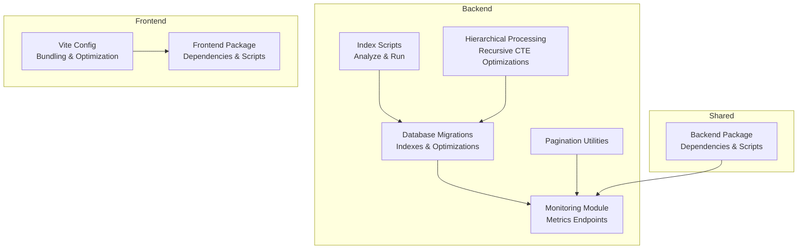

[No sources needed since this diagram shows conceptual workflow, not actual code structure]

## Core Components
- Database Indexing and Query Optimization: A series of migrations introduce targeted indexes and schema improvements to accelerate common queries across modules such as announcements, organization, notifications, and general performance tuning.
- **Enhanced Hierarchical Data Processing**: PostgreSQL recursive CTE implementation replaces application-level DFS algorithms for anti-cycle detection in personnel hierarchies, significantly improving query performance.
- Monitoring and Metrics: The monitoring module exposes endpoints to collect and report system health and performance metrics.
- Pagination Utilities: Shared pagination helpers standardize cursor/skip-limit patterns and reduce payload sizes.
- Load Testing and Verification: Scripts provide load tests for pagination and verification routines for pagination correctness.
- Frontend Build Optimization: Vite configuration and package scripts enable efficient bundling, tree-shaking, and asset optimization.

**Section sources**
- [backend/database/migrations/009-performance-indexes.sql](file://backend/database/migrations/009-performance-indexes.sql)
- [backend/database/migrations/042-annonces-performance-optimization.sql](file://backend/database/migrations/042-annonces-performance-optimization.sql)
- [backend/database/migrations/046-organisation-performance-avancee.sql](file://backend/database/migrations/046-organisation-performance-avancee.sql)
- [backend/database/migrations/047-optimisations-performance-v3.1.sql](file://backend/database/migrations/047-optimisations-performance-v3.1.sql)
- [backend/database/migrations/048-notifications-performance-optimizations.sql](file://backend/database/migrations/048-notifications-performance-optimizations.sql)
- [backend/src/modules/monitoring/controllers/monitoring.controller.ts](file://backend/src/modules/monitoring/controllers/monitoring.controller.ts)
- [backend/src/modules/monitoring/services/monitoring.service.ts](file://backend/src/modules/monitoring/services/monitoring.service.ts)
- [backend/src/common/utils/pagination.util.ts](file://backend/src/common/utils/pagination.util.ts)
- [backend/scripts/load-test-pagination.ts](file://backend/scripts/load-test-pagination.ts)
- [backend/scripts/verify-pagination.sh](file://backend/scripts/verify-pagination.sh)
- [frontend/vite.config.ts](file://frontend/vite.config.ts)
- [frontend/package.json](file://frontend/package.json)
- [backend/package.json](file://backend/package.json)

## Architecture Overview
The performance architecture integrates database-level optimizations, application-level caching and pagination, and monitoring endpoints that expose runtime metrics. Frontend optimizations reduce bundle size and improve rendering throughput. **Updated** to include hierarchical data processing optimizations using PostgreSQL recursive CTEs.

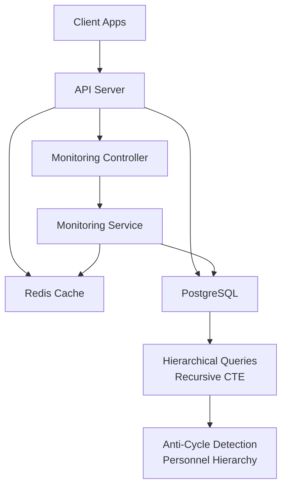

**Diagram sources**
- [backend/src/modules/monitoring/controllers/monitoring.controller.ts](file://backend/src/modules/monitoring/controllers/monitoring.controller.ts)
- [backend/src/modules/monitoring/services/monitoring.service.ts](file://backend/src/modules/monitoring/services/monitoring.service.ts)
- [backend/src/config/database.config.ts](file://backend/src/config/database.config.ts)

## Detailed Component Analysis

### Database Query Optimization and Index Management
- Purpose: Accelerate frequent read/write paths by adding appropriate indexes and refining schemas.
- Key areas: Announcements, organization, notifications, and general performance enhancements.
- **Enhanced**: Hierarchical organization operations now leverage PostgreSQL recursive CTEs for improved performance.
- Operational steps:
  - Review and apply performance-focused migrations.
  - Use index analysis scripts to validate effectiveness and detect redundancy.
  - Schedule periodic index maintenance and reindexing when necessary.
  - Monitor recursive CTE performance for complex hierarchical queries.

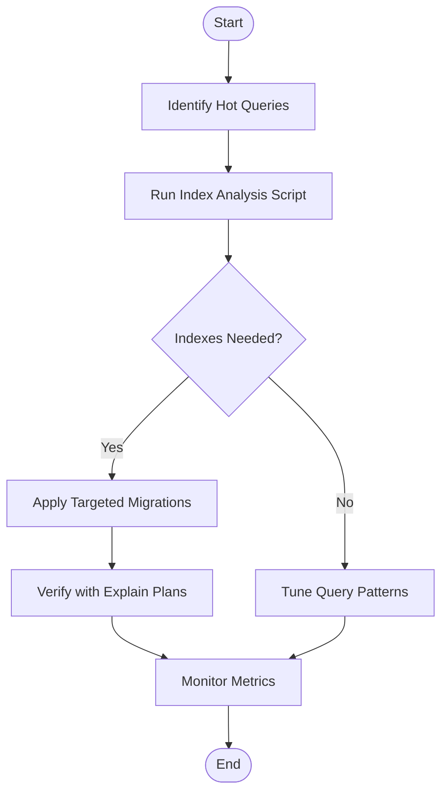

**Diagram sources**
- [backend/scripts/analyze-indexes.ts](file://backend/scripts/analyze-indexes.ts)
- [backend/scripts/run-indexes.sh](file://backend/scripts/run-indexes.sh)
- [backend/database/migrations/009-performance-indexes.sql](file://backend/database/migrations/009-performance-indexes.sql)
- [backend/database/migrations/042-annonces-performance-optimization.sql](file://backend/database/migrations/042-annonces-performance-optimization.sql)
- [backend/database/migrations/046-organisation-performance-avancee.sql](file://backend/database/migrations/046-organisation-performance-avancee.sql)
- [backend/database/migrations/047-optimisations-performance-v3.1.sql](file://backend/database/migrations/047-optimisations-performance-v3.1.sql)
- [backend/database/migrations/048-notifications-performance-optimizations.sql](file://backend/database/migrations/048-notifications-performance-optimizations.sql)

**Section sources**
- [backend/database/migrations/009-performance-indexes.sql](file://backend/database/migrations/009-performance-indexes.sql)
- [backend/database/migrations/042-annonces-performance-optimization.sql](file://backend/database/migrations/042-annonces-performance-optimization.sql)
- [backend/database/migrations/046-organisation-performance-avancee.sql](file://backend/database/migrations/046-organisation-performance-avancee.sql)
- [backend/database/migrations/047-optimisations-performance-v3.1.sql](file://backend/database/migrations/047-optimisations-performance-v3.1.sql)
- [backend/database/migrations/048-notifications-performance-optimizations.sql](file://backend/database/migrations/048-notifications-performance-optimizations.sql)
- [backend/scripts/analyze-indexes.ts](file://backend/scripts/analyze-indexes.ts)
- [backend/scripts/run-indexes.sh](file://backend/scripts/run-indexes.sh)

### Hierarchical Data Processing Optimization
- **New**: PostgreSQL recursive CTE implementation for personnel hierarchy anti-cycle detection.
- **Migration Impact**: Replaced application-level Depth-First Search (DFS) algorithm with native PostgreSQL recursive CTE queries.
- **Performance Benefits**: 
  - Reduced application memory usage by moving computation to database layer
  - Improved query execution time for hierarchical organization operations
  - Better scalability for large organizational structures
  - Eliminated potential stack overflow issues with deep hierarchies
- **Implementation Strategy**:
  - Utilize `WITH RECURSIVE` clauses for cycle detection
  - Leverage PostgreSQL's optimized recursive query engine
  - Maintain referential integrity at database level
  - Optimize recursive CTE parameters for performance

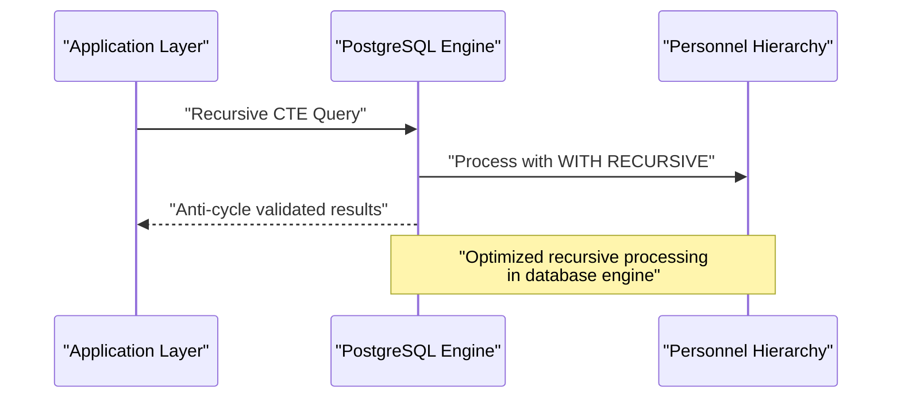

**Diagram sources**
- [backend/database/migrations/046-organisation-performance-avancee.sql](file://backend/database/migrations/046-organisation-performance-avancee.sql)

**Section sources**
- [backend/database/migrations/046-organisation-performance-avancee.sql](file://backend/database/migrations/046-organisation-performance-avancee.sql)

### Slow Query Analysis
- Strategy:
  - Enable database-level logging for slow queries.
  - Periodically analyze query plans using explain plans and index coverage reports.
  - Correlate slow queries with business hotspots and adjust indexes or rewrite queries.
  - **Enhanced**: Monitor recursive CTE performance for hierarchical queries.
- Tools:
  - Index analysis script to identify missing or redundant indexes.
  - Migration files that add targeted indexes for known hot paths.
  - **New**: Recursive query performance monitoring for hierarchical operations.

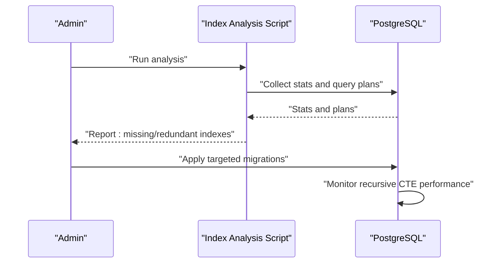

**Diagram sources**
- [backend/scripts/analyze-indexes.ts](file://backend/scripts/analyze-indexes.ts)
- [backend/database/migrations/009-performance-indexes.sql](file://backend/database/migrations/009-performance-indexes.sql)

**Section sources**
- [backend/scripts/analyze-indexes.ts](file://backend/scripts/analyze-indexes.ts)
- [backend/database/migrations/009-performance-indexes.sql](file://backend/database/migrations/009-performance-indexes.sql)

### Caching Strategies Using Redis
- Goals: Reduce database load, lower latency, and improve throughput for frequently accessed data.
- Patterns:
  - Read-through cache for high-frequency reads.
  - Write-through cache for consistent updates.
  - Cache invalidation on write events or via TTL-based expiration.
- Memory Management:
  - Configure eviction policies and maxmemory limits.
  - Monitor cache hit ratios and memory usage.
- Validation:
  - Unit tests for Redis service behavior and edge cases.

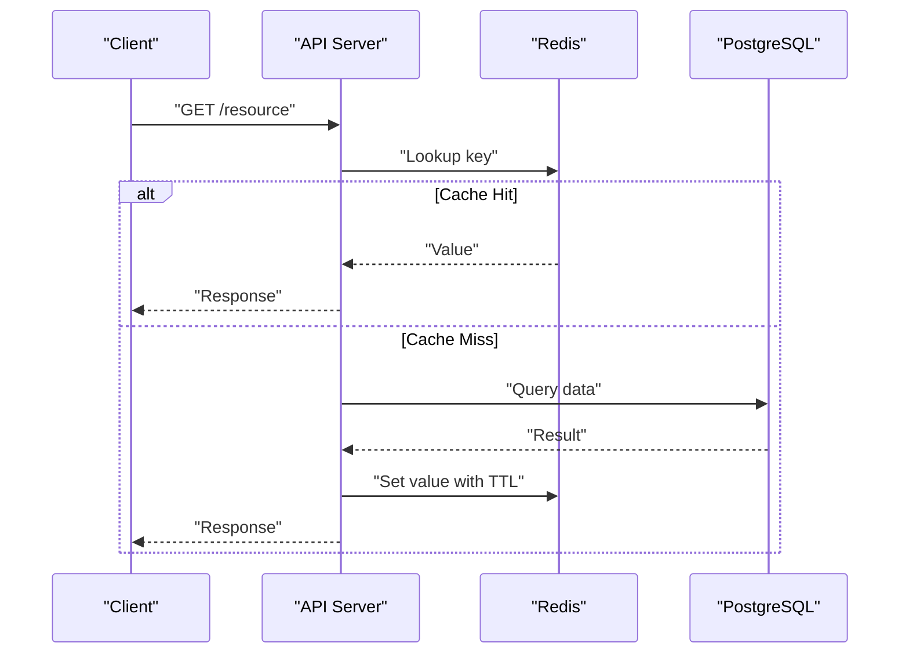

**Diagram sources**
- [backend/test/unit/redis.service.spec.ts](file://backend/test/unit/redis.service.spec.ts)

**Section sources**
- [backend/test/unit/redis.service.spec.ts](file://backend/test/unit/redis.service.spec.ts)

### API Response Optimization and Pagination
- Techniques:
  - Enforce pagination on list endpoints to limit payload sizes.
  - Use skip/limit or cursor-based pagination depending on dataset characteristics.
  - Select only required fields to minimize serialization overhead.
- Implementation:
  - Shared pagination utilities standardize parameters and responses.
  - Documentation outlines best practices and migration status.
  - Verification scripts ensure correct pagination behavior.

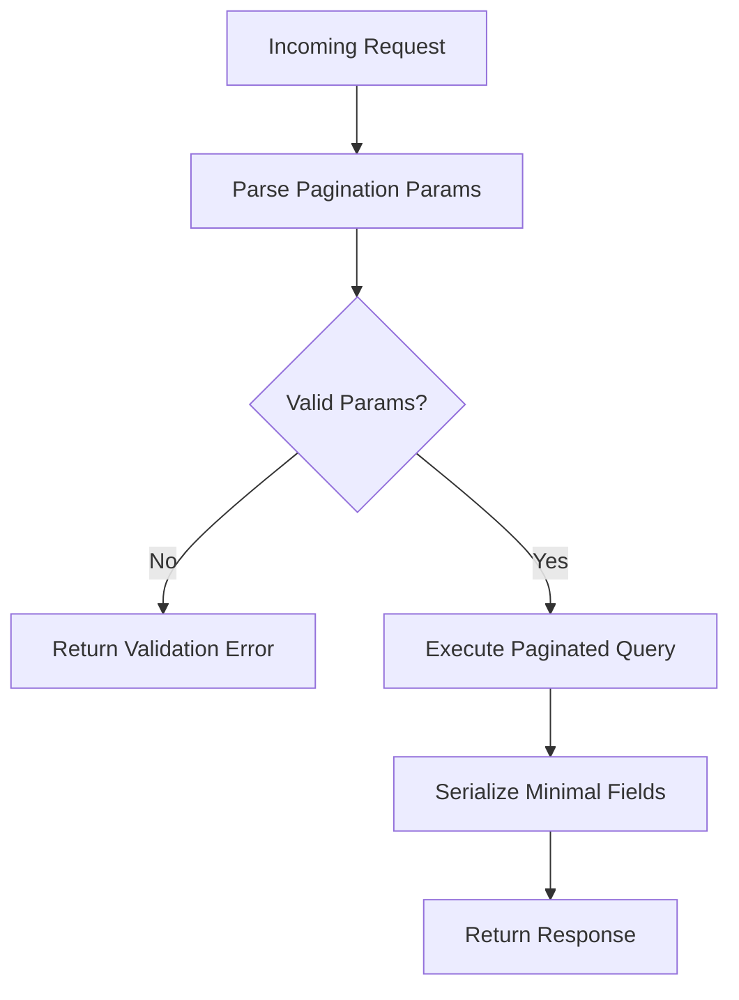

**Diagram sources**
- [backend/src/common/utils/pagination.util.ts](file://backend/src/common/utils/pagination.util.ts)
- [backend/docs/pagination-guide.md](file://backend/docs/pagination-guide.md)
- [backend/scripts/verify-pagination.sh](file://backend/scripts/verify-pagination.sh)

**Section sources**
- [backend/src/common/utils/pagination.util.ts](file://backend/src/common/utils/pagination.util.ts)
- [backend/docs/pagination-guide.md](file://backend/docs/pagination-guide.md)
- [backend/scripts/verify-pagination.sh](file://backend/scripts/verify-pagination.sh)
- [backend/test/unit/pagination.util.spec.ts](file://backend/test/unit/pagination.util.spec.ts)

### Bulk Operation Handling
- Guidance:
  - Prefer batch inserts/updates to reduce round-trips.
  - Use transactions to maintain consistency.
  - Implement idempotency keys for retry safety.
  - Monitor transaction durations and lock contention.
- Notes:
  - Ensure proper indexing to support bulk writes efficiently.
  - Avoid long-running transactions during peak hours.

[No sources needed since this section provides general guidance]

### Frontend Performance Tuning
- Bundle Optimization:
  - Leverage Vite’s code splitting, tree-shaking, and minification.
  - Lazy-load heavy routes and components.
  - Optimize images and static assets; use modern formats.
- Rendering Efficiency:
  - Minimize re-renders by memoizing expensive computations.
  - Use virtualized lists for large datasets.
  - Debounce/throttle user interactions where appropriate.
- Configuration:
  - Review Vite config for production builds.
  - Inspect package dependencies to remove unused libraries.

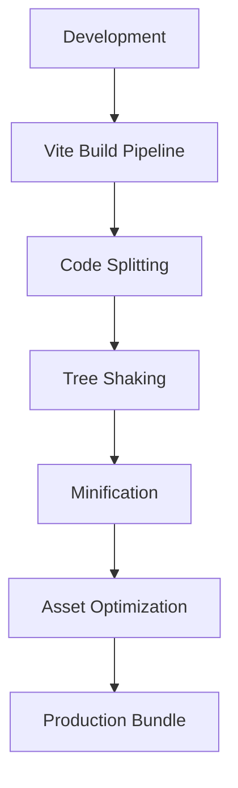

**Diagram sources**
- [frontend/vite.config.ts](file://frontend/vite.config.ts)
- [frontend/package.json](file://frontend/package.json)

**Section sources**
- [frontend/vite.config.ts](file://frontend/vite.config.ts)
- [frontend/package.json](file://frontend/package.json)

### Load Testing and Stress Testing
- Procedures:
  - Use provided load test scripts to simulate realistic traffic patterns.
  - Focus on paginated endpoints and high-read scenarios.
  - Measure response times, error rates, and resource utilization.
  - **Enhanced**: Include hierarchical query performance testing.
- Methodology:
  - Gradually increase concurrency to find breaking points.
  - Record baseline metrics and compare after optimizations.
  - Automate regression checks in CI pipelines.

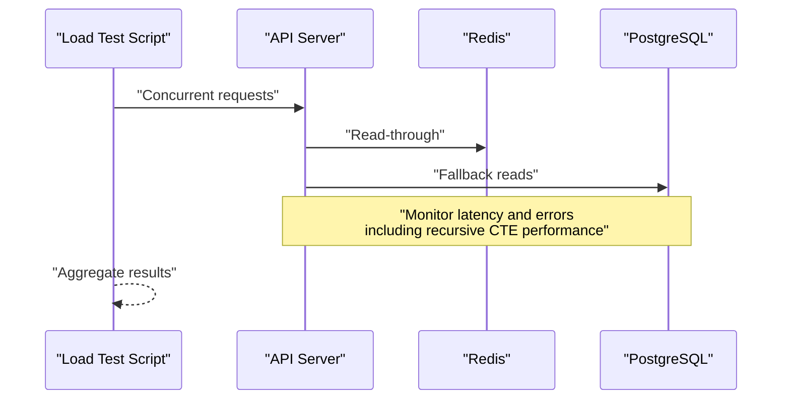

**Diagram sources**
- [backend/scripts/load-test-pagination.ts](file://backend/scripts/load-test-pagination.ts)

**Section sources**
- [backend/scripts/load-test-pagination.ts](file://backend/scripts/load-test-pagination.ts)

### Capacity Planning Guidelines
- Approach:
  - Establish SLOs for latency, throughput, and error rates.
  - Model expected growth in users, tenants, and data volume.
  - Size CPU, memory, storage, and network based on benchmarks.
  - **Enhanced**: Account for increased database workload from recursive CTE operations.
- Practices:
  - Horizontal scaling for stateless API nodes.
  - Vertical scaling for database with tuned connection pools.
  - Cache layer scaling and sharding if needed.
  - **New**: Monitor PostgreSQL recursive query performance and optimize accordingly.

[No sources needed since this section provides general guidance]

### Performance Monitoring Dashboards and KPIs
- Dashboards:
  - Expose metrics endpoints from the monitoring module.
  - Aggregate metrics in a time-series database and visualize trends.
  - **Enhanced**: Include recursive CTE performance metrics.
- KPIs:
  - P95/P99 latency per endpoint.
  - Throughput (requests/sec).
  - Error rate and saturation metrics.
  - Cache hit ratio and memory usage.
  - Database query duration distribution and index usage.
  - **New**: Recursive query execution time and complexity metrics.

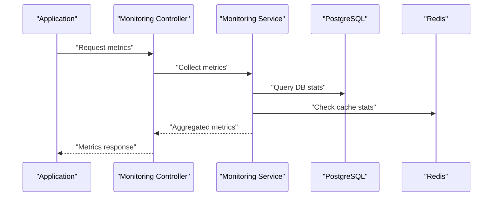

**Diagram sources**
- [backend/src/modules/monitoring/controllers/monitoring.controller.ts](file://backend/src/modules/monitoring/controllers/monitoring.controller.ts)
- [backend/src/modules/monitoring/services/monitoring.service.ts](file://backend/src/modules/monitoring/services/monitoring.service.ts)
- [backend/database/migrations/099-add-monitoring-params.sql](file://backend/database/migrations/099-add-monitoring-params.sql)

**Section sources**
- [backend/src/modules/monitoring/controllers/monitoring.controller.ts](file://backend/src/modules/monitoring/controllers/monitoring.controller.ts)
- [backend/src/modules/monitoring/services/monitoring.service.ts](file://backend/src/modules/monitoring/services/monitoring.service.ts)
- [backend/database/migrations/099-add-monitoring-params.sql](file://backend/database/migrations/099-add-monitoring-params.sql)

### Benchmarking Tools
- Recommendations:
  - Use HTTP load generators (e.g., k6, wrk) for API stress tests.
  - Employ database profiling tools to capture slow queries and plan analyses.
  - Integrate benchmarking into CI to catch regressions early.
  - **Enhanced**: Include recursive CTE performance benchmarking for hierarchical operations.

[No sources needed since this section provides general guidance]

### Memory Leak Detection and Garbage Collection Tuning
- Node.js:
  - Profile heap snapshots to detect leaks.
  - Adjust GC flags based on workload characteristics.
  - Monitor RSS and heap usage trends.
  - **Enhanced**: Monitor memory reduction from recursive CTE migration.
- PostgreSQL:
  - Tune autovacuum and work_mem settings.
  - Monitor bloat and reclaim space periodically.
  - **New**: Optimize recursive query memory allocation.

[No sources needed since this section provides general guidance]

### Resource Utilization Optimization
- Strategies:
  - Right-size container resources and set limits/requests.
  - Use connection pooling for database and cache clients.
  - Batch background jobs and throttle I/O-bound tasks.
  - Enable compression for API responses where appropriate.
  - **Enhanced**: Leverage database-side processing for complex hierarchical operations.

[No sources needed since this section provides general guidance]

## Dependency Analysis
Key dependencies influencing performance include database drivers, Redis client, monitoring services, and frontend build toolchain.

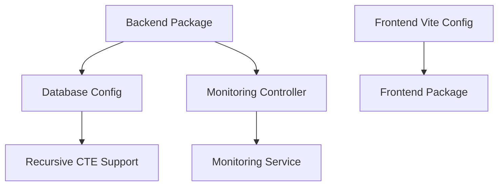

**Diagram sources**
- [backend/package.json](file://backend/package.json)
- [backend/src/config/database.config.ts](file://backend/src/config/database.config.ts)
- [backend/src/modules/monitoring/controllers/monitoring.controller.ts](file://backend/src/modules/monitoring/controllers/monitoring.controller.ts)
- [backend/src/modules/monitoring/services/monitoring.service.ts](file://backend/src/modules/monitoring/services/monitoring.service.ts)
- [frontend/vite.config.ts](file://frontend/vite.config.ts)
- [frontend/package.json](file://frontend/package.json)

**Section sources**
- [backend/package.json](file://backend/package.json)
- [backend/src/config/database.config.ts](file://backend/src/config/database.config.ts)
- [backend/src/modules/monitoring/controllers/monitoring.controller.ts](file://backend/src/modules/monitoring/controllers/monitoring.controller.ts)
- [backend/src/modules/monitoring/services/monitoring.service.ts](file://backend/src/modules/monitoring/services/monitoring.service.ts)
- [frontend/vite.config.ts](file://frontend/vite.config.ts)
- [frontend/package.json](file://frontend/package.json)

## Performance Considerations
- Prioritize index-driven query optimization for hot paths.
- Standardize pagination across APIs to control payload sizes.
- Implement caching with clear invalidation policies and TTLs.
- **Enhanced**: Leverage PostgreSQL recursive CTEs for complex hierarchical operations instead of application-level algorithms.
- Continuously monitor metrics and alert on SLO breaches.
- Conduct regular load tests and capacity reviews.
- **New**: Monitor recursive query performance and optimize database parameters accordingly.

[No sources needed since this section provides general guidance]

## Troubleshooting Guide
- Symptom: High latency on list endpoints
  - Check pagination parameters and field selection.
  - Verify indexes exist for filter columns.
  - Inspect cache hit ratios and fallback DB queries.
- Symptom: Frequent timeouts under load
  - Review connection pool sizes and DB tuning.
  - Identify long-running transactions and locks.
  - Scale horizontally and tune worker processes.
- Symptom: Memory growth over time
  - Capture heap snapshots and analyze retained objects.
  - Validate cache eviction policies and TTLs.
  - Check for unbounded collections or event listeners.
- **New**: Symptom: Poor hierarchical query performance
  - Verify recursive CTE query plans and execution times.
  - Check PostgreSQL recursive query settings and memory allocation.
  - Monitor anti-cycle detection performance in personnel hierarchies.
  - Consider optimizing recursive CTE parameters and database configuration.

**Section sources**
- [backend/src/common/utils/pagination.util.ts](file://backend/src/common/utils/pagination.util.ts)
- [backend/database/migrations/009-performance-indexes.sql](file://backend/database/migrations/009-performance-indexes.sql)
- [backend/test/unit/redis.service.spec.ts](file://backend/test/unit/redis.service.spec.ts)

## Conclusion
By combining database indexing, caching, pagination, monitoring, and frontend optimizations, eLISAschool can achieve robust performance at scale. **Enhanced** with PostgreSQL recursive CTE implementations for hierarchical operations, the system now leverages database-native processing for complex organizational queries. Continuous measurement, load testing, and proactive capacity planning ensure sustained reliability and responsiveness.

[No sources needed since this section summarizes without analyzing specific files]

## Appendices
- Quick Commands:
  - Run index analysis: see [backend/scripts/analyze-indexes.ts](file://backend/scripts/analyze-indexes.ts)
  - Execute index migrations: see [backend/scripts/run-indexes.sh](file://backend/scripts/run-indexes.sh)
  - Verify pagination: see [backend/scripts/verify-pagination.sh](file://backend/scripts/verify-pagination.sh)
  - Load test pagination: see [backend/scripts/load-test-pagination.ts](file://backend/scripts/load-test-pagination.ts)

**Section sources**
- [backend/scripts/analyze-indexes.ts](file://backend/scripts/analyze-indexes.ts)
- [backend/scripts/run-indexes.sh](file://backend/scripts/run-indexes.sh)
- [backend/scripts/verify-pagination.sh](file://backend/scripts/verify-pagination.sh)
- [backend/scripts/load-test-pagination.ts](file://backend/scripts/load-test-pagination.ts)