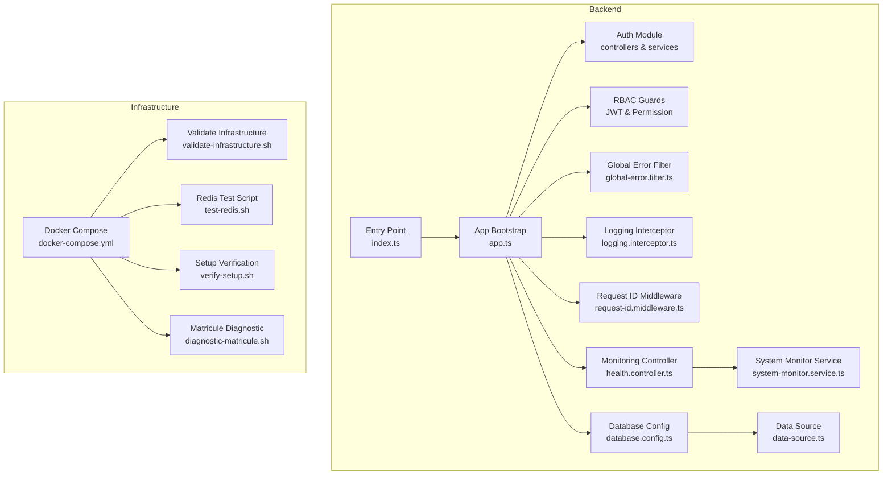
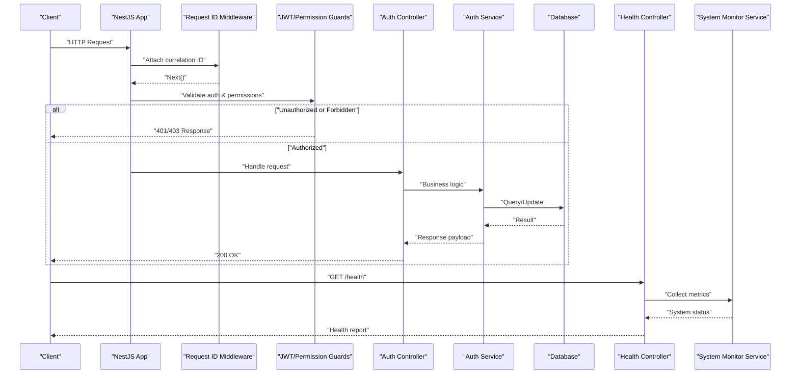
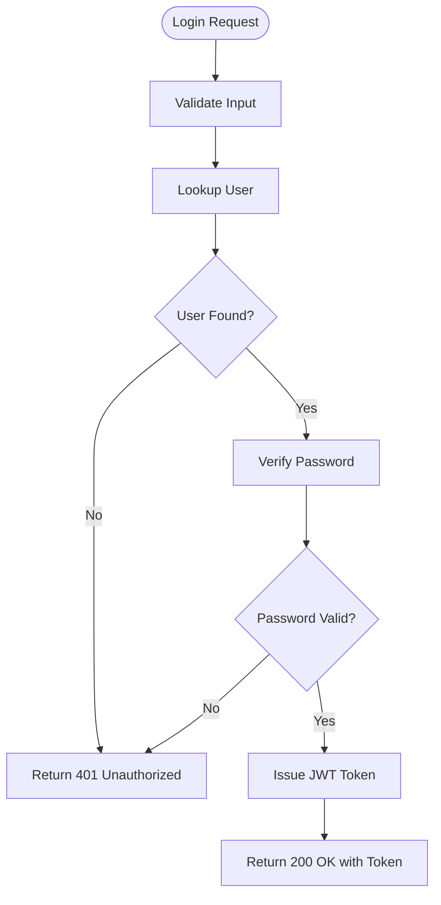
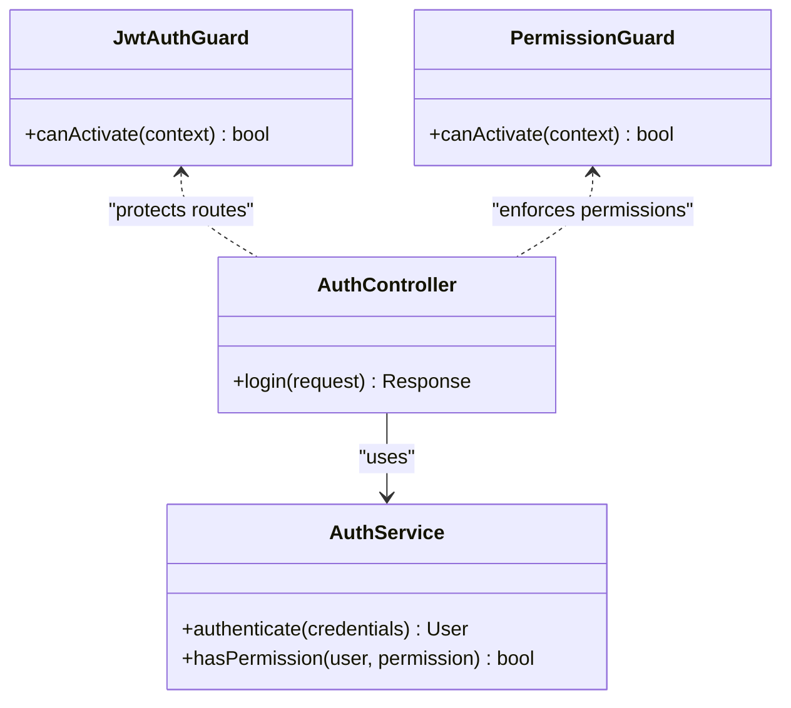
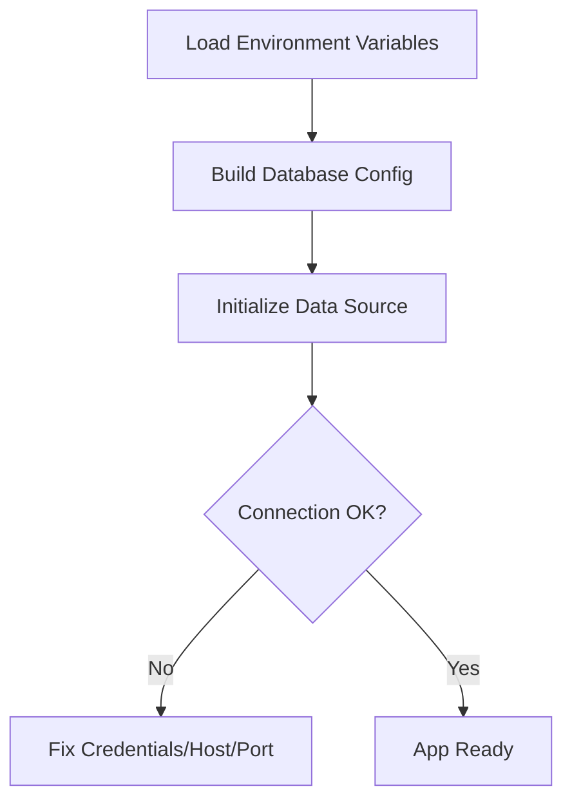
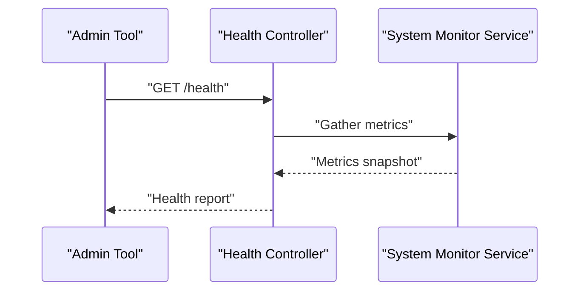
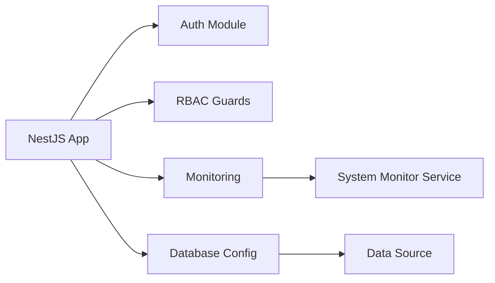

# Troubleshooting Guide

<cite>
**Referenced Files in This Document**
- [backend/src/app.ts](file://backend/src/app.ts)
- [backend/src/index.ts](file://backend/src/index.ts)
- [backend/src/config/database.config.ts](file://backend/src/config/database.config.ts)
- [backend/src/config/env.config.ts](file://backend/src/config/env.config.ts)
- [backend/src/modules/auth/controllers/auth.controller.ts](file://backend/src/modules/auth/controllers/auth.controller.ts)
- [backend/src/modules/auth/services/auth.service.ts](file://backend/src/modules/auth/services/auth.service.ts)
- [backend/src/common/filters/global-error.filter.ts](file://backend/src/common/filters/global-error.filter.ts)
- [backend/src/common/interceptors/logging.interceptor.ts](file://backend/src/common/interceptors/logging.interceptor.ts)
- [backend/src/common/middlewares/request-id.middleware.ts](file://backend/src/common/middlewares/request-id.middleware.ts)
- [backend/src/modules/monitoring/controllers/health.controller.ts](file://backend/src/modules/monitoring/controllers/health.controller.ts)
- [backend/src/modules/monitoring/services/system-monitor.service.ts](file://backend/src/modules/monitoring/services/system-monitor.service.ts)
- [docker/docker-compose.yml](file://docker/docker-compose.yml)
- [docker/scripts/validate-infrastructure.sh](file://docker/scripts/validate-infrastructure.sh)
- [scripts/test-redis.sh](file://scripts/test-redis.sh)
- [scripts/verify-setup.sh](file://scripts/verify-setup.sh)
- [scripts/diagnostic-matricule.sh](file://scripts/diagnostic-matricule.sh)
- [backend/src/database/data-source.ts](file://backend/src/database/data-source.ts)
- [backend/src/modules/auth/guards/jwt-auth.guard.ts](file://backend/src/modules/auth/guards/jwt-auth.guard.ts)
- [backend/src/modules/rbac/guards/permission.guard.ts](file://backend/src/modules/rbac/guards/permission.guard.ts)
</cite>

## Table of Contents
1. [Introduction](#introduction)
2. [Project Structure](#project-structure)
3. [Core Components](#core-components)
4. [Architecture Overview](#architecture-overview)
5. [Detailed Component Analysis](#detailed-component-analysis)
6. [Dependency Analysis](#dependency-analysis)
7. [Performance Considerations](#performance-considerations)
8. [Troubleshooting Guide](#troubleshooting-guide)
9. [Conclusion](#conclusion)
10. [Appendices](#appendices)

## Introduction
This guide provides a comprehensive troubleshooting approach for eLISAschool, focusing on authentication errors, permission problems, database connectivity issues, performance diagnosis, and deployment/environment configuration problems. It explains diagnostic tools and utilities available in the repository, log analysis techniques, error pattern recognition, systematic debugging approaches, and step-by-step resolution procedures. It also includes escalation guidance for complex issues.

## Project Structure
The backend is a NestJS application with modular architecture. Key areas relevant to troubleshooting include:
- Application bootstrap and global filters/interceptors/middlewares
- Authentication and authorization modules
- Monitoring endpoints and system monitoring service
- Database configuration and data source setup
- Docker Compose and validation scripts for infrastructure checks
- Utility scripts for Redis, setup verification, and diagnostics

**Diagram sources**
- [backend/src/app.ts](file://backend/src/app.ts)
- [backend/src/index.ts](file://backend/src/index.ts)
- [backend/src/modules/auth/controllers/auth.controller.ts](file://backend/src/modules/auth/controllers/auth.controller.ts)
- [backend/src/modules/auth/services/auth.service.ts](file://backend/src/modules/auth/services/auth.service.ts)
- [backend/src/modules/auth/guards/jwt-auth.guard.ts](file://backend/src/modules/auth/guards/jwt-auth.guard.ts)
- [backend/src/modules/rbac/guards/permission.guard.ts](file://backend/src/modules/rbac/guards/permission.guard.ts)
- [backend/src/common/filters/global-error.filter.ts](file://backend/src/common/filters/global-error.filter.ts)
- [backend/src/common/interceptors/logging.interceptor.ts](file://backend/src/common/interceptors/logging.interceptor.ts)
- [backend/src/common/middlewares/request-id.middleware.ts](file://backend/src/common/middlewares/request-id.middleware.ts)
- [backend/src/modules/monitoring/controllers/health.controller.ts](file://backend/src/modules/monitoring/controllers/health.controller.ts)
- [backend/src/modules/monitoring/services/system-monitor.service.ts](file://backend/src/modules/monitoring/services/system-monitor.service.ts)
- [backend/src/config/database.config.ts](file://backend/src/config/database.config.ts)
- [backend/src/database/data-source.ts](file://backend/src/database/data-source.ts)
- [docker/docker-compose.yml](file://docker/docker-compose.yml)
- [docker/scripts/validate-infrastructure.sh](file://docker/scripts/validate-infrastructure.sh)
- [scripts/test-redis.sh](file://scripts/test-redis.sh)
- [scripts/verify-setup.sh](file://scripts/verify-setup.sh)
- [scripts/diagnostic-matricule.sh](file://scripts/diagnostic-matricule.sh)

**Section sources**
- [backend/src/app.ts](file://backend/src/app.ts)
- [backend/src/index.ts](file://backend/src/index.ts)
- [backend/src/config/database.config.ts](file://backend/src/config/database.config.ts)
- [backend/src/database/data-source.ts](file://backend/src/database/data-source.ts)
- [docker/docker-compose.yml](file://docker/docker-compose.yml)

## Core Components
- Global error filter: Centralizes exception handling and response formatting across all routes.
- Logging interceptor: Adds structured logging around request processing.
- Request ID middleware: Injects correlation IDs into requests for traceability.
- Auth controller/service: Handles login, token issuance, and session management.
- JWT guard and permission guard: Enforce authentication and RBAC permissions.
- Health controller and system monitor service: Provide health checks and runtime metrics.
- Database configuration and data source: Configure connection parameters and manage connections.
- Validation scripts: Validate environment variables, ports, and infrastructure readiness.

**Section sources**
- [backend/src/common/filters/global-error.filter.ts](file://backend/src/common/filters/global-error.filter.ts)
- [backend/src/common/interceptors/logging.interceptor.ts](file://backend/src/common/interceptors/logging.interceptor.ts)
- [backend/src/common/middlewares/request-id.middleware.ts](file://backend/src/common/middlewares/request-id.middleware.ts)
- [backend/src/modules/auth/controllers/auth.controller.ts](file://backend/src/modules/auth/controllers/auth.controller.ts)
- [backend/src/modules/auth/services/auth.service.ts](file://backend/src/modules/auth/services/auth.service.ts)
- [backend/src/modules/auth/guards/jwt-auth.guard.ts](file://backend/src/modules/auth/guards/jwt-auth.guard.ts)
- [backend/src/modules/rbac/guards/permission.guard.ts](file://backend/src/modules/rbac/guards/permission.guard.ts)
- [backend/src/modules/monitoring/controllers/health.controller.ts](file://backend/src/modules/monitoring/controllers/health.controller.ts)
- [backend/src/modules/monitoring/services/system-monitor.service.ts](file://backend/src/modules/monitoring/services/system-monitor.service.ts)
- [backend/src/config/database.config.ts](file://backend/src/config/database.config.ts)
- [backend/src/database/data-source.ts](file://backend/src/database/data-source.ts)

## Architecture Overview
The application follows a layered architecture:
- HTTP layer (controllers) delegates to services.
- Guards enforce security at route level.
- Global filter captures unhandled exceptions.
- Interceptors add cross-cutting concerns like logging.
- Middleware adds request context (e.g., correlation IDs).
- Monitoring endpoints expose health and system metrics.
- Database configuration centralizes connection settings.

**Diagram sources**
- [backend/src/common/middlewares/request-id.middleware.ts](file://backend/src/common/middlewares/request-id.middleware.ts)
- [backend/src/modules/auth/guards/jwt-auth.guard.ts](file://backend/src/modules/auth/guards/jwt-auth.guard.ts)
- [backend/src/modules/rbac/guards/permission.guard.ts](file://backend/src/modules/rbac/guards/permission.guard.ts)
- [backend/src/modules/auth/controllers/auth.controller.ts](file://backend/src/modules/auth/controllers/auth.controller.ts)
- [backend/src/modules/auth/services/auth.service.ts](file://backend/src/modules/auth/services/auth.service.ts)
- [backend/src/modules/monitoring/controllers/health.controller.ts](file://backend/src/modules/monitoring/controllers/health.controller.ts)
- [backend/src/modules/monitoring/services/system-monitor.service.ts](file://backend/src/modules/monitoring/services/system-monitor.service.ts)

## Detailed Component Analysis

### Authentication Flow and Common Errors
- Typical flow: client sends credentials; controller validates input; service authenticates user and issues tokens; guards protect subsequent requests.
- Common errors:
  - Invalid credentials or expired tokens leading to 401 Unauthorized.
  - Insufficient permissions leading to 403 Forbidden.
  - Token format or secret misconfiguration causing signature validation failures.

**Diagram sources**
- [backend/src/modules/auth/controllers/auth.controller.ts](file://backend/src/modules/auth/controllers/auth.controller.ts)
- [backend/src/modules/auth/services/auth.service.ts](file://backend/src/modules/auth/services/auth.service.ts)

**Section sources**
- [backend/src/modules/auth/controllers/auth.controller.ts](file://backend/src/modules/auth/controllers/auth.controller.ts)
- [backend/src/modules/auth/services/auth.service.ts](file://backend/src/modules/auth/services/auth.service.ts)
- [backend/src/modules/auth/guards/jwt-auth.guard.ts](file://backend/src/modules/auth/guards/jwt-auth.guard.ts)

### Authorization and Permission Issues
- Guards enforce role-based access control (RBAC).
- Permission mismatches often arise from missing roles, incorrect group assignments, or stale seeds.
- Resolution steps include verifying user roles, checking permission mappings, and ensuring migrations/seeds are applied.

**Diagram sources**
- [backend/src/modules/auth/guards/jwt-auth.guard.ts](file://backend/src/modules/auth/guards/jwt-auth.guard.ts)
- [backend/src/modules/rbac/guards/permission.guard.ts](file://backend/src/modules/rbac/guards/permission.guard.ts)
- [backend/src/modules/auth/controllers/auth.controller.ts](file://backend/src/modules/auth/controllers/auth.controller.ts)
- [backend/src/modules/auth/services/auth.service.ts](file://backend/src/modules/auth/services/auth.service.ts)

**Section sources**
- [backend/src/modules/rbac/guards/permission.guard.ts](file://backend/src/modules/rbac/guards/permission.guard.ts)
- [backend/src/modules/auth/guards/jwt-auth.guard.ts](file://backend/src/modules/auth/guards/jwt-auth.guard.ts)

### Database Connectivity Diagnostics
- Configuration is centralized; ensure environment variables match the running environment.
- Data source initialization should succeed before starting the app.
- Use validation scripts to confirm connectivity and schema readiness.

**Diagram sources**
- [backend/src/config/database.config.ts](file://backend/src/config/database.config.ts)
- [backend/src/database/data-source.ts](file://backend/src/database/data-source.ts)

**Section sources**
- [backend/src/config/database.config.ts](file://backend/src/config/database.config.ts)
- [backend/src/database/data-source.ts](file://backend/src/database/data-source.ts)

### Monitoring and Health Checks
- Health controller exposes system status and dependency checks.
- System monitor service collects runtime metrics (CPU, memory, uptime).
- Use these endpoints to validate service health during deployments and incidents.

**Diagram sources**
- [backend/src/modules/monitoring/controllers/health.controller.ts](file://backend/src/modules/monitoring/controllers/health.controller.ts)
- [backend/src/modules/monitoring/services/system-monitor.service.ts](file://backend/src/modules/monitoring/services/system-monitor.service.ts)

**Section sources**
- [backend/src/modules/monitoring/controllers/health.controller.ts](file://backend/src/modules/monitoring/controllers/health.controller.ts)
- [backend/src/modules/monitoring/services/system-monitor.service.ts](file://backend/src/modules/monitoring/services/system-monitor.service.ts)

## Dependency Analysis
Key dependencies and their roles:
- NestJS core orchestrates controllers, guards, interceptors, and filters.
- Database driver depends on configured credentials and network reachability.
- Monitoring endpoints depend on OS-level metrics availability.
- Docker Compose defines service topology and environment variables.

**Diagram sources**
- [backend/src/app.ts](file://backend/src/app.ts)
- [backend/src/modules/auth/controllers/auth.controller.ts](file://backend/src/modules/auth/controllers/auth.controller.ts)
- [backend/src/modules/rbac/guards/permission.guard.ts](file://backend/src/modules/rbac/guards/permission.guard.ts)
- [backend/src/modules/monitoring/controllers/health.controller.ts](file://backend/src/modules/monitoring/controllers/health.controller.ts)
- [backend/src/modules/monitoring/services/system-monitor.service.ts](file://backend/src/modules/monitoring/services/system-monitor.service.ts)
- [backend/src/config/database.config.ts](file://backend/src/config/database.config.ts)
- [backend/src/database/data-source.ts](file://backend/src/database/data-source.ts)

**Section sources**
- [backend/src/app.ts](file://backend/src/app.ts)
- [backend/src/config/database.config.ts](file://backend/src/config/database.config.ts)
- [backend/src/database/data-source.ts](file://backend/src/database/data-source.ts)

## Performance Considerations
- Enable structured logging via the logging interceptor to identify slow endpoints.
- Use health and system monitor endpoints to track CPU, memory, and uptime trends.
- Investigate long-running queries and lock contention using database logs and indexes.
- For memory leaks:
  - Capture heap snapshots under load and compare over time.
  - Review object retention patterns in services and caches.
- For resource contention:
  - Tune database connection pool sizes.
  - Adjust worker processes and instance counts based on CPU/memory profiles.

[No sources needed since this section provides general guidance]

## Troubleshooting Guide

### Authentication Errors
Symptoms:
- 401 Unauthorized responses on protected routes.
- Login failures despite correct credentials.
- Token expiration or invalid signature errors.

Diagnostic steps:
- Verify environment variables for JWT secret and issuer.
- Confirm user existence and password hashing correctness.
- Check CORS and proxy configurations if frontend cannot send headers.
- Use health endpoint to ensure backend is reachable.

Resolution steps:
- Align JWT secret between services and clients.
- Reset user passwords if hash mismatch suspected.
- Ensure token refresh flows are implemented and invoked.
- Validate middleware order so that request ID and logging run before guards.

**Section sources**
- [backend/src/modules/auth/controllers/auth.controller.ts](file://backend/src/modules/auth/controllers/auth.controller.ts)
- [backend/src/modules/auth/services/auth.service.ts](file://backend/src/modules/auth/services/auth.service.ts)
- [backend/src/modules/auth/guards/jwt-auth.guard.ts](file://backend/src/modules/auth/guards/jwt-auth.guard.ts)
- [backend/src/common/middlewares/request-id.middleware.ts](file://backend/src/common/middlewares/request-id.middleware.ts)

### Permission Problems
Symptoms:
- 403 Forbidden on valid authenticated requests.
- Missing menu items or features due to insufficient permissions.

Diagnostic steps:
- Inspect user roles and group memberships.
- Verify permission mappings and RBAC seed data.
- Check guard implementation for required permissions.

Resolution steps:
- Apply RBAC migrations and seeds.
- Update user roles through admin interfaces or scripts.
- Audit route decorators and guard requirements.

**Section sources**
- [backend/src/modules/rbac/guards/permission.guard.ts](file://backend/src/modules/rbac/guards/permission.guard.ts)
- [backend/src/modules/auth/services/auth.service.ts](file://backend/src/modules/auth/services/auth.service.ts)

### Database Connectivity Issues
Symptoms:
- Application fails to start due to connection errors.
- Intermittent query timeouts or deadlocks.

Diagnostic steps:
- Validate environment variables for host, port, username, password, and database name.
- Run infrastructure validation script to check reachability.
- Inspect database logs for connection limits and locks.

Resolution steps:
- Correct credentials and network rules.
- Increase connection pool size if necessary.
- Optimize slow queries and add appropriate indexes.

**Section sources**
- [backend/src/config/database.config.ts](file://backend/src/config/database.config.ts)
- [backend/src/database/data-source.ts](file://backend/src/database/data-source.ts)
- [docker/scripts/validate-infrastructure.sh](file://docker/scripts/validate-infrastructure.sh)

### Log Analysis Techniques
- Use the logging interceptor to capture request/response payloads and durations.
- Correlate logs using the request ID injected by middleware.
- Aggregate logs centrally and search by correlation ID for full request traces.

Best practices:
- Include contextual metadata (tenant, user ID, module).
- Avoid logging sensitive data (passwords, tokens).
- Set appropriate log levels per environment.

**Section sources**
- [backend/src/common/interceptors/logging.interceptor.ts](file://backend/src/common/interceptors/logging.interceptor.ts)
- [backend/src/common/middlewares/request-id.middleware.ts](file://backend/src/common/middlewares/request-id.middleware.ts)

### Error Pattern Recognition
- 401 Unauthorized: authentication failure or token issues.
- 403 Forbidden: insufficient permissions.
- 500 Internal Server Error: unhandled exceptions captured by global error filter.

Actionable steps:
- Search logs by correlation ID to reconstruct request flow.
- Inspect global error filter output for stack traces and context.
- Reproduce with minimal inputs and isolate failing components.

**Section sources**
- [backend/src/common/filters/global-error.filter.ts](file://backend/src/common/filters/global-error.filter.ts)

### Systematic Debugging Approach
- Step 1: Confirm service health via monitoring endpoints.
- Step 2: Validate environment variables and infrastructure readiness.
- Step 3: Reproduce issue with known-good credentials and inputs.
- Step 4: Trace request using correlation ID across middleware, guards, controllers, services.
- Step 5: Isolate component failures (auth, RBAC, DB, external APIs).
- Step 6: Apply targeted fixes and retest.

**Section sources**
- [backend/src/modules/monitoring/controllers/health.controller.ts](file://backend/src/modules/monitoring/controllers/health.controller.ts)
- [docker/scripts/validate-infrastructure.sh](file://docker/scripts/validate-infrastructure.sh)

### Performance Issue Diagnosis
- Identify slow endpoints via logging interceptor durations.
- Profile CPU and memory using system monitor service and OS tools.
- Analyze database query plans and index usage.
- Reduce payload sizes and enable pagination where applicable.

**Section sources**
- [backend/src/common/interceptors/logging.interceptor.ts](file://backend/src/common/interceptors/logging.interceptor.ts)
- [backend/src/modules/monitoring/services/system-monitor.service.ts](file://backend/src/modules/monitoring/services/system-monitor.service.ts)

### Memory Leak Detection
- Capture heap dumps under sustained load.
- Compare snapshots to detect retained objects.
- Review service lifecycle and cache eviction policies.
- Validate event listeners and timers are properly cleaned up.

[No sources needed since this section provides general guidance]

### Resource Contention Resolution
- Tune database connection pools and timeouts.
- Scale horizontally behind a reverse proxy if CPU-bound.
- Offload heavy tasks to background workers.
- Review locking strategies and transaction scopes.

[No sources needed since this section provides general guidance]

### Deployment-Related Problems
- Validate container networking and port exposure.
- Ensure environment variables are injected correctly.
- Confirm migrations and seeds have been applied.
- Use validation scripts to preflight infrastructure.

Resolution steps:
- Rebuild containers and redeploy with updated configs.
- Roll back to last known good state if regressions occur.
- Verify DNS and firewall rules for inter-service communication.

**Section sources**
- [docker/docker-compose.yml](file://docker/docker-compose.yml)
- [docker/scripts/validate-infrastructure.sh](file://docker/scripts/validate-infrastructure.sh)

### Environment Configuration Issues
- Check required variables for database, JWT, Redis, and feature flags.
- Validate values against expected formats and ranges.
- Use setup verification script to catch common misconfigurations.

**Section sources**
- [backend/src/config/env.config.ts](file://backend/src/config/env.config.ts)
- [scripts/verify-setup.sh](file://scripts/verify-setup.sh)

### Infrastructure Troubleshooting
- Network reachability: use validation script to test ports and services.
- Redis connectivity: run dedicated test script to verify caching layer.
- Matricule-related issues: use diagnostic script to inspect identifiers and mappings.

**Section sources**
- [docker/scripts/validate-infrastructure.sh](file://docker/scripts/validate-infrastructure.sh)
- [scripts/test-redis.sh](file://scripts/test-redis.sh)
- [scripts/diagnostic-matricule.sh](file://scripts/diagnostic-matricule.sh)

### Step-by-Step Resolution Guides

#### Authentication Failure
1. Confirm backend health endpoint responds.
2. Verify JWT secret and issuer in environment variables.
3. Test login with known-good credentials.
4. Inspect logs for 401 responses and correlation IDs.
5. If token invalid, regenerate secrets and refresh clients.

**Section sources**
- [backend/src/modules/monitoring/controllers/health.controller.ts](file://backend/src/modules/monitoring/controllers/health.controller.ts)
- [backend/src/modules/auth/controllers/auth.controller.ts](file://backend/src/modules/auth/controllers/auth.controller.ts)
- [backend/src/modules/auth/guards/jwt-auth.guard.ts](file://backend/src/modules/auth/guards/jwt-auth.guard.ts)

#### Permission Denied
1. Authenticate successfully and obtain token.
2. Call protected endpoint and observe 403.
3. Check user roles and permission mappings.
4. Apply RBAC migrations/seeds if missing.
5. Retry with corrected roles.

**Section sources**
- [backend/src/modules/rbac/guards/permission.guard.ts](file://backend/src/modules/rbac/guards/permission.guard.ts)
- [backend/src/modules/auth/services/auth.service.ts](file://backend/src/modules/auth/services/auth.service.ts)

#### Database Connection Error
1. Validate environment variables for database connection.
2. Run infrastructure validation script.
3. Check database logs for connection limits.
4. Adjust pool size and retry.

**Section sources**
- [backend/src/config/database.config.ts](file://backend/src/config/database.config.ts)
- [docker/scripts/validate-infrastructure.sh](file://docker/scripts/validate-infrastructure.sh)

### Escalation Procedures
- Collect correlation IDs, timestamps, and request payloads.
- Gather health reports and system metrics.
- Document environment variables (redacted), container versions, and recent changes.
- Engage platform team for infra/network issues.
- Engage DBA for database performance and locking issues.
- Engage security team for authentication/authorization anomalies.

[No sources needed since this section provides general guidance]

## Conclusion
This guide consolidates eLISAschool’s troubleshooting capabilities, emphasizing structured logging, correlation IDs, health checks, and validation scripts. By following the systematic approach outlined here, teams can quickly diagnose and resolve authentication, permission, database, performance, and deployment issues, and escalate effectively when needed.

## Appendices

### Quick Reference: Useful Scripts and Endpoints
- Health endpoint: GET /health
- Validate infrastructure: docker/scripts/validate-infrastructure.sh
- Redis connectivity test: scripts/test-redis.sh
- Setup verification: scripts/verify-setup.sh
- Matricule diagnostics: scripts/diagnostic-matricule.sh

**Section sources**
- [backend/src/modules/monitoring/controllers/health.controller.ts](file://backend/src/modules/monitoring/controllers/health.controller.ts)
- [docker/scripts/validate-infrastructure.sh](file://docker/scripts/validate-infrastructure.sh)
- [scripts/test-redis.sh](file://scripts/test-redis.sh)
- [scripts/verify-setup.sh](file://scripts/verify-setup.sh)
- [scripts/diagnostic-matricule.sh](file://scripts/diagnostic-matricule.sh)