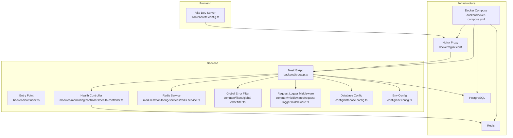
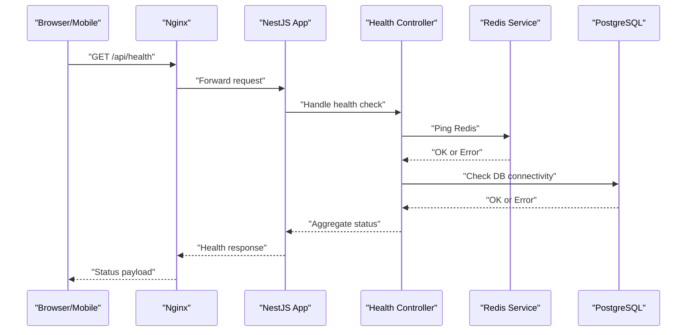
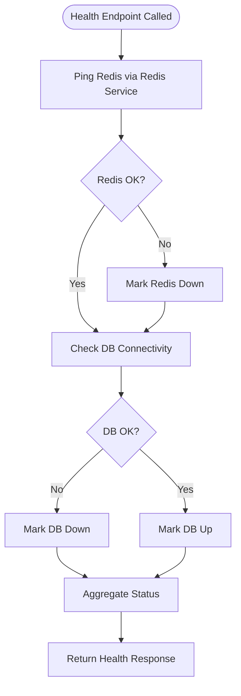
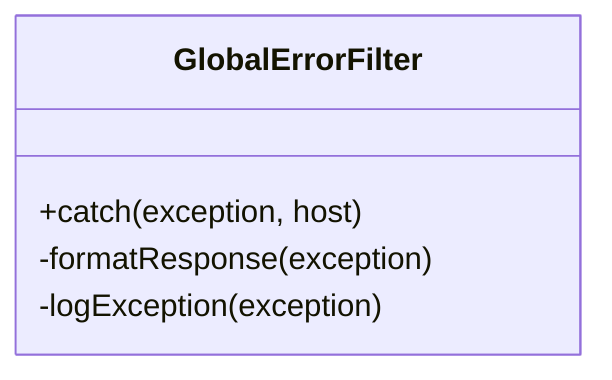
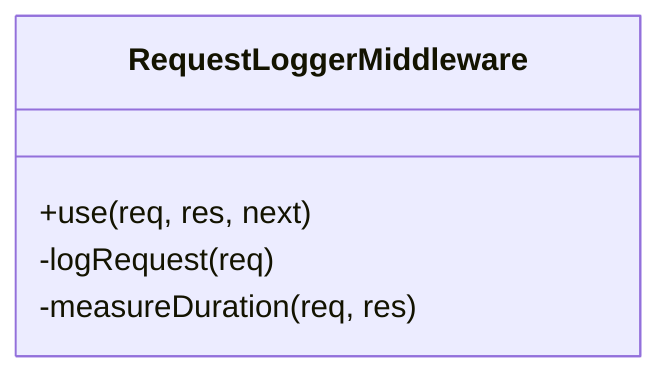
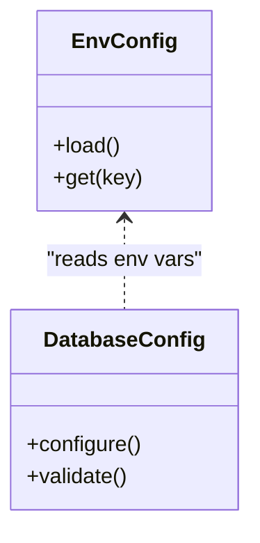
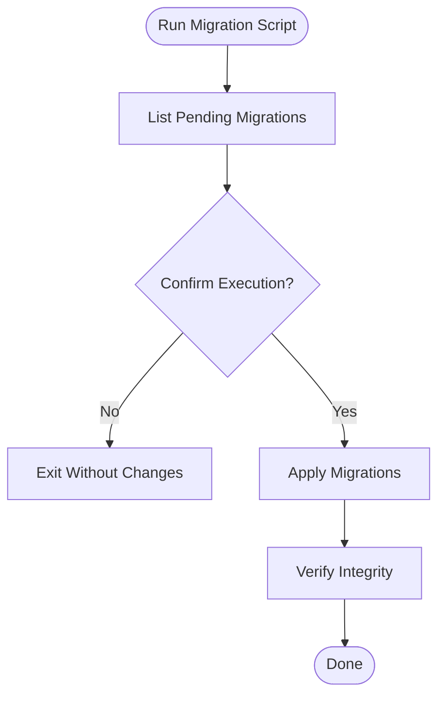
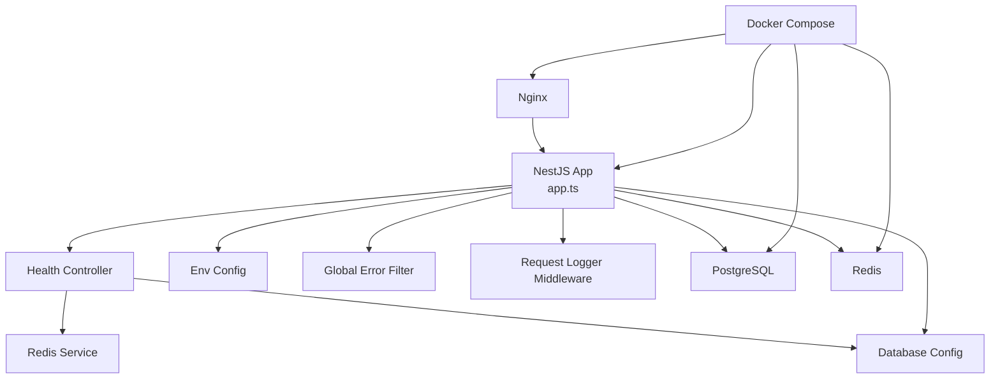

# Troubleshooting & FAQ

<cite>
**Referenced Files in This Document**
- [backend/src/app.ts](file://backend/src/app.ts)
- [backend/src/index.ts](file://backend/src/index.ts)
- [backend/src/config/database.config.ts](file://backend/src/config/database.config.ts)
- [backend/src/config/env.config.ts](file://backend/src/config/env.config.ts)
- [backend/src/modules/monitoring/controllers/health.controller.ts](file://backend/src/modules/monitoring/controllers/health.controller.ts)
- [backend/src/modules/monitoring/services/redis.service.ts](file://backend/src/modules/monitoring/services/redis.service.ts)
- [backend/src/common/filters/global-error.filter.ts](file://backend/src/common/filters/global-error.filter.ts)
- [backend/src/common/middlewares/request-logger.middleware.ts](file://backend/src/common/middlewares/request-logger.middleware.ts)
- [backend/src/database/diagnose-enum.ts](file://backend/src/database/diagnose-enum.ts)
- [backend/src/database/fix-index.ts](file://backend/src/database/fix-index.ts)
- [backend/scripts/run-migration.ts](file://backend/scripts/run-migration.ts)
- [backend/scripts/run-pending-migrations.ts](file://backend/scripts/run-pending-migrations.ts)
- [backend/scripts/verify-configuration-integrity.ts](file://backend/scripts/verify-configuration-integrity.ts)
- [docker/docker-compose.yml](file://docker/docker-compose.yml)
- [docker/nginx.conf](file://docker/nginx.conf)
- [frontend/vite.config.ts](file://frontend/vite.config.ts)
- [scripts/verify-setup.sh](file://scripts/verify-setup.sh)
- [scripts/test-redis.sh](file://scripts/test-redis.sh)
- [scripts/force-restart-frontend.sh](file://scripts/force-restart-frontend.sh)
- [scripts/rebuild-docker.sh](file://scripts/rebuild-docker.sh)
</cite>

## Table of Contents
1. Introduction
2. Project Structure
3. Core Components
4. Architecture Overview
5. Detailed Component Analysis
6. Dependency Analysis
7. Performance Considerations
8. Troubleshooting Guide
9. Conclusion
10. Appendices

## Introduction
This document provides a comprehensive troubleshooting and FAQ guide for eLISAschool. It focuses on diagnosing and resolving common issues such as installation problems, database connectivity errors, authentication failures, performance bottlenecks, network connectivity, browser compatibility, and mobile app concerns. It also outlines systematic diagnostic approaches using built-in monitoring tools, log analysis, and debugging utilities, along with performance optimization tips, memory leak detection strategies, and system health monitoring procedures.

## Project Structure
eLISAschool is organized into backend (NestJS), frontend (React + Vite), shared libraries, Docker orchestration, scripts, and documentation. The backend exposes health and monitoring endpoints, error filters, logging middleware, and migration utilities. The frontend uses Vite for development and production builds. Docker Compose orchestrates services including the application server, database, Redis, and Nginx.

**Diagram sources**
- [backend/src/app.ts](file://backend/src/app.ts)
- [backend/src/index.ts](file://backend/src/index.ts)
- [backend/src/config/database.config.ts](file://backend/src/config/database.config.ts)
- [backend/src/config/env.config.ts](file://backend/src/config/env.config.ts)
- [backend/src/modules/monitoring/controllers/health.controller.ts](file://backend/src/modules/monitoring/controllers/health.controller.ts)
- [backend/src/modules/monitoring/services/redis.service.ts](file://backend/src/modules/monitoring/services/redis.service.ts)
- [backend/src/common/filters/global-error.filter.ts](file://backend/src/common/filters/global-error.filter.ts)
- [backend/src/common/middlewares/request-logger.middleware.ts](file://backend/src/common/middlewares/request-logger.middleware.ts)
- [docker/docker-compose.yml](file://docker/docker-compose.yml)
- [docker/nginx.conf](file://docker/nginx.conf)
- [frontend/vite.config.ts](file://frontend/vite.config.ts)

**Section sources**
- [backend/src/app.ts](file://backend/src/app.ts)
- [backend/src/index.ts](file://backend/src/index.ts)
- [backend/src/config/database.config.ts](file://backend/src/config/database.config.ts)
- [backend/src/config/env.config.ts](file://backend/src/config/env.config.ts)
- [backend/src/modules/monitoring/controllers/health.controller.ts](file://backend/src/modules/monitoring/controllers/health.controller.ts)
- [backend/src/modules/monitoring/services/redis.service.ts](file://backend/src/modules/monitoring/services/redis.service.ts)
- [backend/src/common/filters/global-error.filter.ts](file://backend/src/common/filters/global-error.filter.ts)
- [backend/src/common/middlewares/request-logger.middleware.ts](file://backend/src/common/middlewares/request-logger.middleware.ts)
- [docker/docker-compose.yml](file://docker/docker-compose.yml)
- [docker/nginx.conf](file://docker/nginx.conf)
- [frontend/vite.config.ts](file://frontend/vite.config.ts)

## Core Components
- Health and Monitoring: Exposes health checks and Redis connectivity diagnostics to validate service readiness and cache availability.
- Global Error Handling: Centralized error filter ensures consistent error responses and logs for easier diagnosis.
- Request Logging: Middleware captures request metadata for tracing and performance analysis.
- Configuration: Environment variables and database configuration are centralized for consistency across environments.
- Migration Utilities: Scripts to run migrations and verify pending changes, aiding installation and upgrade troubleshooting.

Key responsibilities:
- Validate infrastructure components (DB, Redis).
- Provide standardized error payloads.
- Log requests and errors for observability.
- Ensure environment and database settings are correct.

**Section sources**
- [backend/src/modules/monitoring/controllers/health.controller.ts](file://backend/src/modules/monitoring/controllers/health.controller.ts)
- [backend/src/modules/monitoring/services/redis.service.ts](file://backend/src/modules/monitoring/services/redis.service.ts)
- [backend/src/common/filters/global-error.filter.ts](file://backend/src/common/filters/global-error.filter.ts)
- [backend/src/common/middlewares/request-logger.middleware.ts](file://backend/src/common/middlewares/request-logger.middleware.ts)
- [backend/src/config/database.config.ts](file://backend/src/config/database.config.ts)
- [backend/src/config/env.config.ts](file://backend/src/config/env.config.ts)
- [backend/scripts/run-migration.ts](file://backend/scripts/run-migration.ts)
- [backend/scripts/run-pending-migrations.ts](file://backend/scripts/run-pending-migrations.ts)

## Architecture Overview
The system follows a layered architecture:
- Frontend communicates via HTTP(S) through Nginx.
- Backend runs as a NestJS application with controllers, services, filters, and middlewares.
- Data layer includes PostgreSQL and Redis for caching.
- Docker Compose manages container lifecycle and networking.

**Diagram sources**
- [backend/src/modules/monitoring/controllers/health.controller.ts](file://backend/src/modules/monitoring/controllers/health.controller.ts)
- [backend/src/modules/monitoring/services/redis.service.ts](file://backend/src/modules/monitoring/services/redis.service.ts)
- [backend/src/config/database.config.ts](file://backend/src/config/database.config.ts)
- [docker/nginx.conf](file://docker/nginx.conf)
- [docker/docker-compose.yml](file://docker/docker-compose.yml)

## Detailed Component Analysis

### Health Check Flow
The health controller aggregates component statuses (Redis, Database) and returns a unified health payload. This is essential for quick validation during deployment and ongoing monitoring.

**Diagram sources**
- [backend/src/modules/monitoring/controllers/health.controller.ts](file://backend/src/modules/monitoring/controllers/health.controller.ts)
- [backend/src/modules/monitoring/services/redis.service.ts](file://backend/src/modules/monitoring/services/redis.service.ts)
- [backend/src/config/database.config.ts](file://backend/src/config/database.config.ts)

**Section sources**
- [backend/src/modules/monitoring/controllers/health.controller.ts](file://backend/src/modules/monitoring/controllers/health.controller.ts)
- [backend/src/modules/monitoring/services/redis.service.ts](file://backend/src/modules/monitoring/services/redis.service.ts)
- [backend/src/config/database.config.ts](file://backend/src/config/database.config.ts)

### Global Error Filter
The global error filter standardizes error responses and logs exceptions consistently. Use it to capture stack traces and contextual information when diagnosing runtime errors.

**Diagram sources**
- [backend/src/common/filters/global-error.filter.ts](file://backend/src/common/filters/global-error.filter.ts)

**Section sources**
- [backend/src/common/filters/global-error.filter.ts](file://backend/src/common/filters/global-error.filter.ts)

### Request Logger Middleware
Captures request metadata (method, path, timestamp, duration) to aid in performance profiling and issue reproduction.

**Diagram sources**
- [backend/src/common/middlewares/request-logger.middleware.ts](file://backend/src/common/middlewares/request-logger.middleware.ts)

**Section sources**
- [backend/src/common/middlewares/request-logger.middleware.ts](file://backend/src/common/middlewares/request-logger.middleware.ts)

### Configuration Management
Environment variables and database configuration are centralized to ensure consistent behavior across environments. Misconfiguration here commonly leads to connection failures and startup errors.

**Diagram sources**
- [backend/src/config/env.config.ts](file://backend/src/config/env.config.ts)
- [backend/src/config/database.config.ts](file://backend/src/config/database.config.ts)

**Section sources**
- [backend/src/config/env.config.ts](file://backend/src/config/env.config.ts)
- [backend/src/config/database.config.ts](file://backend/src/config/database.config.ts)

### Migration Utilities
Migration scripts help diagnose and resolve schema-related issues during installation and upgrades. They can list pending migrations and execute them safely.

**Diagram sources**
- [backend/scripts/run-migration.ts](file://backend/scripts/run-migration.ts)
- [backend/scripts/run-pending-migrations.ts](file://backend/scripts/run-pending-migrations.ts)

**Section sources**
- [backend/scripts/run-migration.ts](file://backend/scripts/run-migration.ts)
- [backend/scripts/run-pending-migrations.ts](file://backend/scripts/run-pending-migrations.ts)

## Dependency Analysis
The following diagram shows key dependencies among core components and infrastructure services.

**Diagram sources**
- [backend/src/app.ts](file://backend/src/app.ts)
- [backend/src/modules/monitoring/controllers/health.controller.ts](file://backend/src/modules/monitoring/controllers/health.controller.ts)
- [backend/src/modules/monitoring/services/redis.service.ts](file://backend/src/modules/monitoring/services/redis.service.ts)
- [backend/src/config/database.config.ts](file://backend/src/config/database.config.ts)
- [backend/src/config/env.config.ts](file://backend/src/config/env.config.ts)
- [backend/src/common/filters/global-error.filter.ts](file://backend/src/common/filters/global-error.filter.ts)
- [backend/src/common/middlewares/request-logger.middleware.ts](file://backend/src/common/middlewares/request-logger.middleware.ts)
- [docker/docker-compose.yml](file://docker/docker-compose.yml)
- [docker/nginx.conf](file://docker/nginx.conf)

**Section sources**
- [backend/src/app.ts](file://backend/src/app.ts)
- [backend/src/modules/monitoring/controllers/health.controller.ts](file://backend/src/modules/monitoring/controllers/health.controller.ts)
- [backend/src/modules/monitoring/services/redis.service.ts](file://backend/src/modules/monitoring/services/redis.service.ts)
- [backend/src/config/database.config.ts](file://backend/src/config/database.config.ts)
- [backend/src/config/env.config.ts](file://backend/src/config/env.config.ts)
- [backend/src/common/filters/global-error.filter.ts](file://backend/src/common/filters/global-error.filter.ts)
- [backend/src/common/middlewares/request-logger.middleware.ts](file://backend/src/common/middlewares/request-logger.middleware.ts)
- [docker/docker-compose.yml](file://docker/docker-compose.yml)
- [docker/nginx.conf](file://docker/nginx.conf)

## Performance Considerations
- Enable request logging to measure latency and identify slow endpoints.
- Monitor Redis connectivity and cache hit rates; use health checks to detect degradation early.
- Review database indexes and query plans for hot paths; use provided index diagnostics and fix scripts.
- Profile Node.js heap usage and GC events to detect memory leaks; consider enabling heap snapshots under load.
- Tune Docker resource limits and Nginx worker processes based on workload.
- Use pagination and selective field retrieval to reduce payload sizes.

[No sources needed since this section provides general guidance]

## Troubleshooting Guide

### Installation Problems
Symptoms:
- Application fails to start or crashes immediately.
- Database initialization errors or missing tables.
- Redis not reachable from the backend.

Diagnostic steps:
- Run setup verification script to validate environment and ports.
- Inspect Docker Compose status and logs for each service.
- Execute migration utilities to ensure schema is up-to-date.
- Verify environment variables for database and Redis connectivity.

Resolution procedures:
- Fix incorrect ports or credentials in environment configuration.
- Re-run migrations if schema version mismatch is detected.
- Rebuild containers if dependency or image issues are suspected.

**Section sources**
- [scripts/verify-setup.sh](file://scripts/verify-setup.sh)
- [docker/docker-compose.yml](file://docker/docker-compose.yml)
- [backend/scripts/run-migration.ts](file://backend/scripts/run-migration.ts)
- [backend/scripts/run-pending-migrations.ts](file://backend/scripts/run-pending-migrations.ts)
- [backend/src/config/env.config.ts](file://backend/src/config/env.config.ts)

### Database Connection Issues
Symptoms:
- Errors indicating connection refused, authentication failure, or invalid credentials.
- Health endpoint reports DB down.

Diagnostic steps:
- Check database configuration and environment variables.
- Test connectivity from the backend container to the database.
- Use enum and index diagnostics to detect schema inconsistencies.

Resolution procedures:
- Correct connection string, username, password, and database name.
- Ensure firewall rules allow traffic between containers.
- Run index fixes and schema validations if corruption is suspected.

**Section sources**
- [backend/src/config/database.config.ts](file://backend/src/config/database.config.ts)
- [backend/src/database/diagnose-enum.ts](file://backend/src/database/diagnose-enum.ts)
- [backend/src/database/fix-index.ts](file://backend/src/database/fix-index.ts)
- [backend/src/modules/monitoring/controllers/health.controller.ts](file://backend/src/modules/monitoring/controllers/health.controller.ts)

### Authentication Errors
Symptoms:
- 401 Unauthorized or token invalid responses.
- Login loops or session expiration issues.

Diagnostic steps:
- Review global error filter logs for detailed exception context.
- Verify JWT secret and token expiration settings in environment configuration.
- Check CORS and proxy settings in Nginx and Vite dev config.

Resolution procedures:
- Align JWT secrets across services and ensure they are set correctly.
- Adjust token expiry policies and refresh flows.
- Update CORS origins and allowed methods to match frontend domains.

**Section sources**
- [backend/src/common/filters/global-error.filter.ts](file://backend/src/common/filters/global-error.filter.ts)
- [backend/src/config/env.config.ts](file://backend/src/config/env.config.ts)
- [docker/nginx.conf](file://docker/nginx.conf)
- [frontend/vite.config.ts](file://frontend/vite.config.ts)

### Performance Bottlenecks
Symptoms:
- Slow API responses, high CPU/memory usage, or frequent timeouts.

Diagnostic steps:
- Analyze request logger middleware outputs for latency patterns.
- Use health checks to monitor Redis and DB health under load.
- Identify heavy queries and missing indexes using diagnostics.

Resolution procedures:
- Optimize queries and add appropriate indexes.
- Enable caching where applicable and tune Redis TTLs.
- Scale horizontally by adding more backend instances behind Nginx.

**Section sources**
- [backend/src/common/middlewares/request-logger.middleware.ts](file://backend/src/common/middlewares/request-logger.middleware.ts)
- [backend/src/modules/monitoring/controllers/health.controller.ts](file://backend/src/modules/monitoring/controllers/health.controller.ts)
- [backend/src/database/diagnose-enum.ts](file://backend/src/database/diagnose-enum.ts)
- [backend/src/database/fix-index.ts](file://backend/src/database/fix-index.ts)

### Network Connectivity Issues
Symptoms:
- Frontend cannot reach backend APIs.
- Cross-origin errors or blocked requests.

Diagnostic steps:
- Verify Nginx routing and upstream configuration.
- Check Vite proxy configuration for local development.
- Confirm Docker networking and port mappings.

Resolution procedures:
- Update Nginx upstream to point to correct backend service.
- Configure Vite proxy to forward API calls to backend during development.
- Ensure proper DNS resolution and container network aliases.

**Section sources**
- [docker/nginx.conf](file://docker/nginx.conf)
- [frontend/vite.config.ts](file://frontend/vite.config.ts)
- [docker/docker-compose.yml](file://docker/docker-compose.yml)

### Browser Compatibility Problems
Symptoms:
- Features not working in older browsers or specific devices.
- Polyfills or transpilation issues.

Diagnostic steps:
- Review build targets and polyfills in frontend configuration.
- Test across multiple browsers and devices.

Resolution procedures:
- Adjust target environments and enable required polyfills.
- Use feature detection and graceful degradation in UI logic.

**Section sources**
- [frontend/vite.config.ts](file://frontend/vite.config.ts)

### Mobile App Troubleshooting
Symptoms:
- API calls failing from mobile clients.
- Token storage or refresh issues.

Diagnostic steps:
- Validate CORS and base URL configurations.
- Inspect request logs for failed authentication attempts.

Resolution procedures:
- Ensure mobile app uses correct base URLs and headers.
- Implement robust token refresh and retry logic.

**Section sources**
- [backend/src/common/middlewares/request-logger.middleware.ts](file://backend/src/common/middlewares/request-logger.middleware.ts)
- [docker/nginx.conf](file://docker/nginx.conf)

### Built-in Monitoring Tools and Logs
- Health endpoint: Validates Redis and DB connectivity.
- Request logger: Captures per-request metrics.
- Global error filter: Standardizes error responses and logs exceptions.

Usage:
- Call health endpoint periodically to assert service readiness.
- Correlate request IDs and timestamps from logs with user-reported issues.
- Use error filter payloads to pinpoint root causes quickly.

**Section sources**
- [backend/src/modules/monitoring/controllers/health.controller.ts](file://backend/src/modules/monitoring/controllers/health.controller.ts)
- [backend/src/common/middlewares/request-logger.middleware.ts](file://backend/src/common/middlewares/request-logger.middleware.ts)
- [backend/src/common/filters/global-error.filter.ts](file://backend/src/common/filters/global-error.filter.ts)

### System Health Monitoring Procedures
- Periodically check health endpoint and Redis ping results.
- Monitor container resource usage and restart unhealthy services.
- Use verification scripts to validate environment integrity after updates.

**Section sources**
- [backend/src/modules/monitoring/controllers/health.controller.ts](file://backend/src/modules/monitoring/controllers/health.controller.ts)
- [backend/src/modules/monitoring/services/redis.service.ts](file://backend/src/modules/monitoring/services/redis.service.ts)
- [scripts/verify-setup.sh](file://scripts/verify-setup.sh)

### Memory Leak Detection
- Capture heap snapshots under load and analyze growth trends.
- Watch for unbounded caches or event listeners that do not release references.
- Use Node.js profiling tools to identify hot paths and excessive allocations.

[No sources needed since this section provides general guidance]

### Frequently Asked Questions (FAQ)
Q: How do I verify my environment setup?
A: Run the setup verification script to check ports, dependencies, and basic connectivity.

Q: What should I do if migrations fail?
A: List pending migrations, review error logs, and re-run the migration utility after fixing configuration issues.

Q: Why is Redis reporting as down in health checks?
A: Verify Redis service status, credentials, and network access from the backend container.

Q: How can I debug slow API responses?
A: Use request logger middleware outputs to identify slow endpoints and correlate with database query performance.

Q: How do I rebuild containers after code changes?
A: Use the rebuild script to force rebuild images and restart services.

Q: How do I restart the frontend dev server forcefully?
A: Use the force restart script to clear caches and restart the dev server.

**Section sources**
- [scripts/verify-setup.sh](file://scripts/verify-setup.sh)
- [backend/scripts/run-pending-migrations.ts](file://backend/scripts/run-pending-migrations.ts)
- [backend/src/modules/monitoring/controllers/health.controller.ts](file://backend/src/modules/monitoring/controllers/health.controller.ts)
- [backend/src/common/middlewares/request-logger.middleware.ts](file://backend/src/common/middlewares/request-logger.middleware.ts)
- [scripts/rebuild-docker.sh](file://scripts/rebuild-docker.sh)
- [scripts/force-restart-frontend.sh](file://scripts/force-restart-frontend.sh)

## Conclusion
By leveraging health checks, request logging, global error handling, and migration utilities, you can systematically diagnose and resolve most operational issues in eLISAschool. Combine these tools with Docker and Nginx configuration reviews to address installation, connectivity, authentication, and performance challenges effectively.

[No sources needed since this section summarizes without analyzing specific files]

## Appendices

### Quick Diagnostic Commands
- Verify setup: run setup verification script.
- Test Redis connectivity: use Redis test script.
- Force restart frontend: use force restart script.
- Rebuild Docker: use rebuild script.

**Section sources**
- [scripts/verify-setup.sh](file://scripts/verify-setup.sh)
- [scripts/test-redis.sh](file://scripts/test-redis.sh)
- [scripts/force-restart-frontend.sh](file://scripts/force-restart-frontend.sh)
- [scripts/rebuild-docker.sh](file://scripts/rebuild-docker.sh)