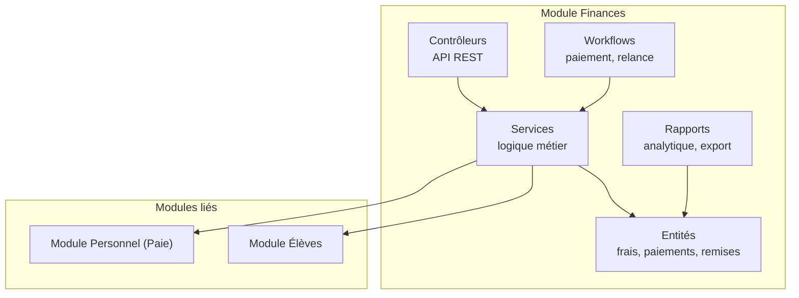
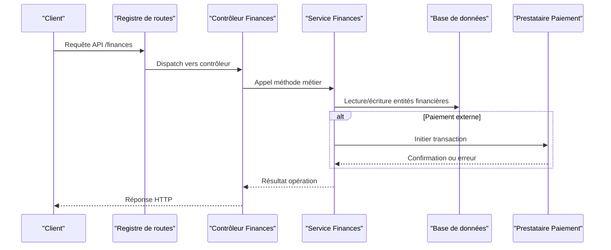
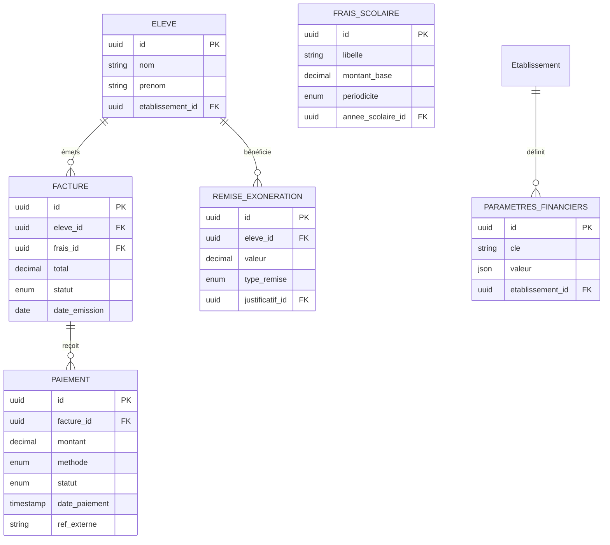
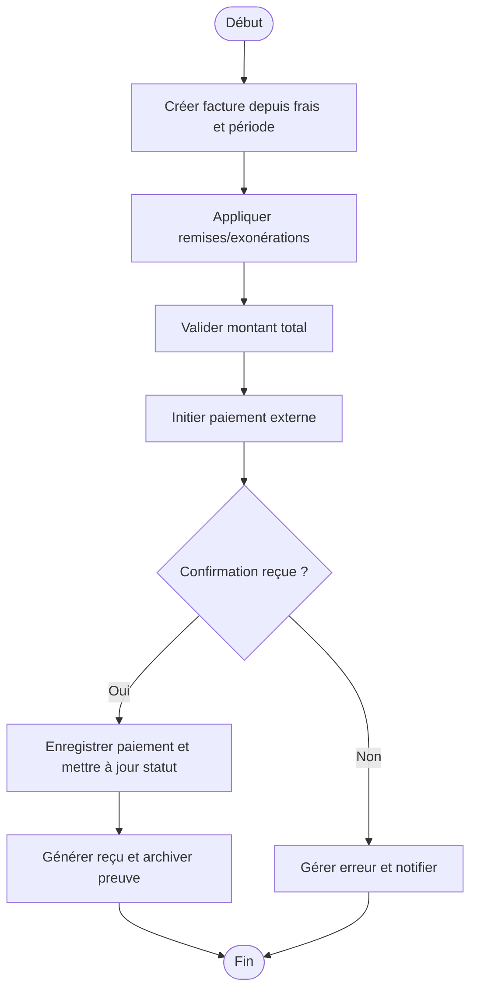
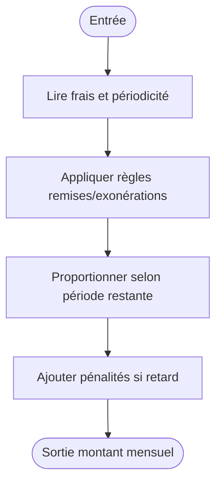
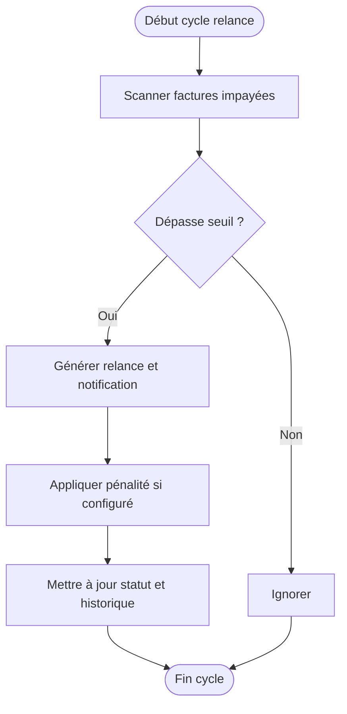
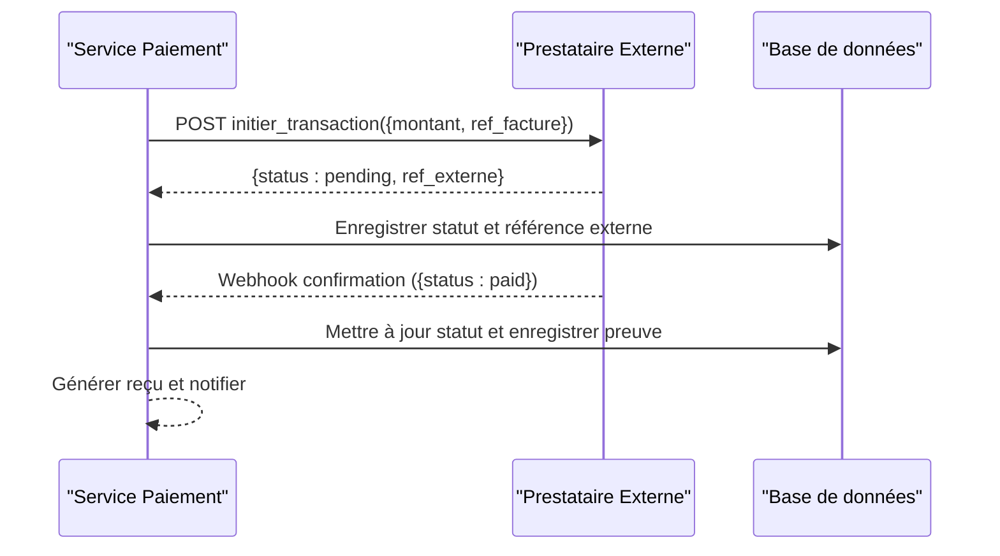
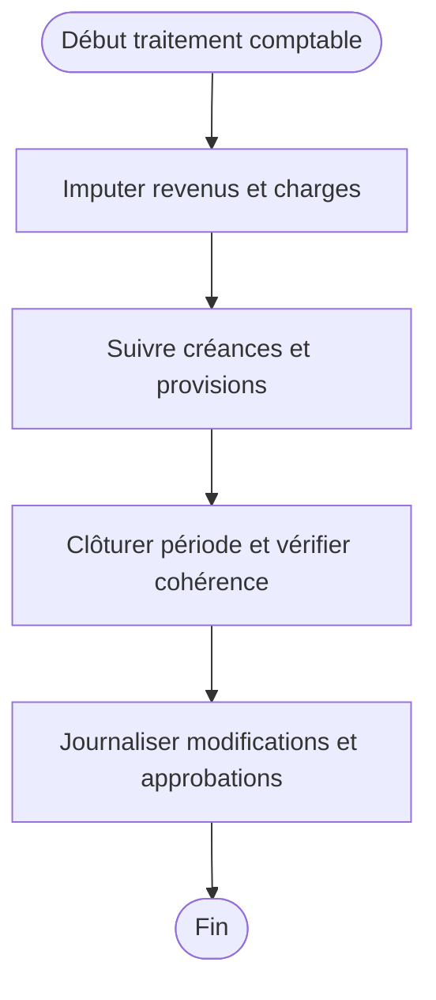
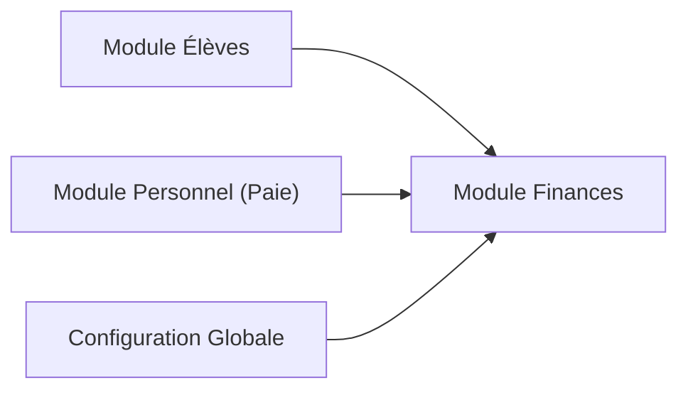
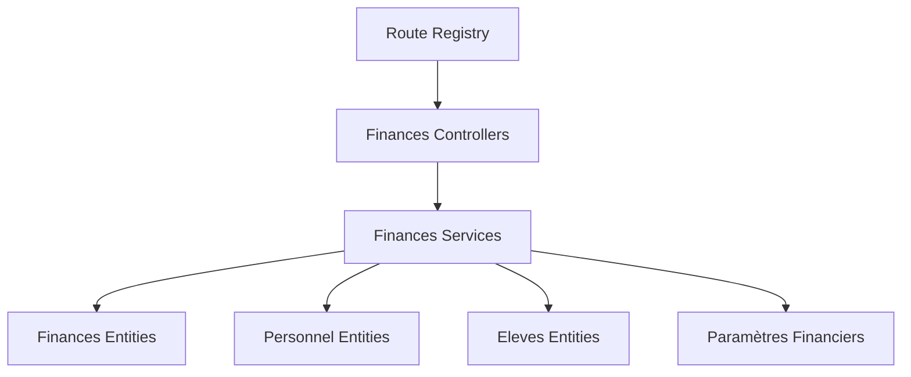

# Administration Financière

<cite>
**Fichiers référencés dans ce document**
- [backend/database/migrations/010-module-finances.sql](file://backend/database/migrations/010-module-finances.sql)
- [backend/database/migrations/011-module-finances-part2.sql](file://backend/database/migrations/011-module-finances-part2.sql)
- [backend/database/migrations/012-module-finances-part3-parametres.sql](file://backend/database/migrations/012-module-finances-part3-parametres.sql)
- [backend/database/migrations/013-module-finances-phase1-granularite.sql](file://backend/database/migrations/013-module-finances-phase1-granularite.sql)
- [backend/database/migrations/014-module-finances-phase2-section.sql](file://backend/database/migrations/014-module-finances-phase2-section.sql)
- [backend/src/modules/finances/index.ts](file://backend/src/modules/finances/index.ts)
- [backend/src/modules/finances/entities](file://backend/src/modules/finances/entities)
- [backend/src/modules/finances/controllers](file://backend/src/modules/finances/controllers)
- [backend/src/modules/finances/services](file://backend/src/modules/finances/services)
- [backend/src/modules/finances/dto](file://backend/src/modules/finances/dto)
- [backend/src/modules/finances/workflows](file://backend/src/modules/finances/workflows)
- [backend/src/modules/finances/reports](file://backend/src/modules/finances/reports)
- [backend/src/modules/personnel/index.ts](file://backend/src/modules/personnel/index.ts)
- [backend/src/modules/eleves/index.ts](file://backend/src/modules/eleves/index.ts)
- [backend/src/routes/route-registry.ts](file://backend/src/routes/route-registry.ts)
- [docs/ANALYSE-GESTION-FINANCIERE.md](file://docs/ANALYSE-GESTION-FINANCIERE.md)
- [docs/IMPLEMENTATION-COMPLETE-FINANCES.md](file://docs/IMPLEMENTATION-COMPLETE-FINANCES.md)
- [docs/IMPLEMENTATION-PHASE1-FRAIS-REMISES.md](file://docs/IMPLEMENTATION-PHASE1-FRAIS-REMISES.md)
- [docs/API-FINANCES.md](file://docs/API-FINANCES.md)
</cite>

## Table des matières
1. [Introduction](#introduction)
2. [Structure du projet](#structure-du-projet)
3. [Composants clés](#composants-clés)
4. [Vue d’ensemble de l’architecture](#vue-densemble-de-larchitecture)
5. [Analyse détaillée des composants](#analyse-detaillee-des-composants)
6. [Analyse des dépendances](#analyse-des-dependances)
7. [Considérations de performance](#considerations-de-performance)
8. [Guide de dépannage](#guide-de-depannage)
9. [Conclusion](#conclusion)
10. [Annexes](#annexes)

## Introduction
Ce document présente le module d’administration financière d’eLISAschool, couvrant la gestion des frais scolaires, le système de paiements intégré, les relances automatiques, les rapports financiers, et la gestion des remises et exonérations. Il détaille les entités financières, les workflows de paiement, les calculs de mensualités, les interfaces avec les systèmes de paiement externes, ainsi que les règles comptables et les relations avec les modules élèves et personnel (paie). Des schémas de base de données, des diagrammes de flux et des recommandations de configuration sont fournis pour faciliter la compréhension et l’exploitation du module par les équipes techniques et fonctionnelles.

## Structure du projet
Le module finances est organisé selon une architecture modulaire :
- Entités et modèles de données définis via des migrations SQL et des fichiers TypeScript.
- Contrôleurs exposant les endpoints REST.
- Services implémentant la logique métier (calculs, validations, intégrations).
- Workflows orchestrant les processus (paiements, relances, cloture).
- Rapports générant des vues analytiques et exportables.
- Intégration avec les modules élèves et personnel pour la paie.

**Sources de section**
- [backend/src/modules/finances/index.ts](file://backend/src/modules/finances/index.ts)
- [backend/src/routes/route-registry.ts](file://backend/src/routes/route-registry.ts)

## Composants clés
- Gestion des frais scolaires : définition des frais, échelles, périodes, et imputation.
- Système de paiements : enregistrement, validation, réconciliation, et suivi des statuts.
- Relances automatiques : déclenchement basé sur échéances et seuils d’impayés.
- Remises et exonérations : règles applicatives, plafonds, et traçabilité.
- Rapports financiers : soldes, recouvrement, prévisions, et conformité.
- Trésorerie et budget : suivi des flux, plans de trésorerie, et écarts budgétaires.
- Conformité financière : règles comptables, audit trail, et contrôles.

**Sources de section**
- [docs/ANALYSE-GESTION-FINANCIERE.md](file://docs/ANALYSE-GESTION-FINANCIERE.md)
- [docs/IMPLEMENTATION-COMPLETE-FINANCES.md](file://docs/IMPLEMENTATION-COMPLETE-FINANCES.md)

## Vue d’ensemble de l’architecture
Le module finances s’intègre au sein de l’application eLISAschool via un registre de routes et expose des services et contrôleurs dédiés. Les entités financières sont persistées dans la base de données à travers des migrations structurées. Les workflows orchestrent les étapes critiques (création de facture, paiement, relance, clôture). Les rapports exploitent des requêtes optimisées et des vues matérialisées pour fournir des indicateurs financiers fiables.

**Sources de diagramme**
- [backend/src/routes/route-registry.ts](file://backend/src/routes/route-registry.ts)
- [backend/src/modules/finances/controllers](file://backend/src/modules/finances/controllers)
- [backend/src/modules/finances/services](file://backend/src/modules/finances/services)

**Sources de section**
- [backend/src/modules/finances/index.ts](file://backend/src/modules/finances/index.ts)
- [backend/src/routes/route-registry.ts](file://backend/src/routes/route-registry.ts)

## Analyse détaillée des composants

### Schéma de base de données financier
Les migrations définissent les tables et relations essentielles :
- Frais scolaires : types, montants, périodicités, conditions.
- Factures et lignes de facturation : référence aux élèves et périodes.
- Paiements : méthodes, statuts, références externes, réconciliations.
- Remises et exonérations : règles, plafonds, approbations.
- Paramètres financiers : monnaie, taux, politiques de relance.

**Sources de diagramme**
- [backend/database/migrations/010-module-finances.sql](file://backend/database/migrations/010-module-finances.sql)
- [backend/database/migrations/011-module-finances-part2.sql](file://backend/database/migrations/011-module-finances-part2.sql)
- [backend/database/migrations/012-module-finances-part3-parametres.sql](file://backend/database/migrations/012-module-finances-part3-parametres.sql)
- [backend/database/migrations/013-module-finances-phase1-granularite.sql](file://backend/database/migrations/013-module-finances-phase1-granularite.sql)
- [backend/database/migrations/014-module-finances-phase2-section.sql](file://backend/database/migrations/014-module-finances-phase2-section.sql)

**Sources de section**
- [backend/database/migrations/010-module-finances.sql](file://backend/database/migrations/010-module-finances.sql)
- [backend/database/migrations/011-module-finances-part2.sql](file://backend/database/migrations/011-module-finances-part2.sql)
- [backend/database/migrations/012-module-finances-part3-parametres.sql](file://backend/database/migrations/012-module-finances-part3-parametres.sql)
- [backend/database/migrations/013-module-finances-phase1-granularite.sql](file://backend/database/migrations/013-module-finances-phase1-granularite.sql)
- [backend/database/migrations/014-module-finances-phase2-section.sql](file://backend/database/migrations/014-module-finances-phase2-section.sql)

### Workflow de paiement
Le processus de paiement suit un flux structuré :
- Création de facture à partir des frais et de la période.
- Validation des montants et application des remises/exonérations.
- Enregistrement du paiement et mise à jour du statut de la facture.
- Réconciliation avec le prestataire de paiement externe.
- Génération de reçus et archivage des preuves.

**Sources de diagramme**
- [backend/src/modules/finances/workflows](file://backend/src/modules/finances/workflows)
- [backend/src/modules/finances/services](file://backend/src/modules/finances/services)

**Sources de section**
- [backend/src/modules/finances/workflows](file://backend/src/modules/finances/workflows)
- [backend/src/modules/finances/services](file://backend/src/modules/finances/services)

### Calculs de mensualités
Les calculs de mensualités prennent en compte :
- La périodicité des frais (mensuel, trimestriel, annuel).
- Les ajustements dus aux remises et exonérations.
- Les proratisations pour inscriptions en cours de période.
- Les pénalités de retard configurables.

**Sources de diagramme**
- [backend/src/modules/finances/services](file://backend/src/modules/finances/services)
- [backend/database/migrations/012-module-finances-part3-parametres.sql](file://backend/database/migrations/012-module-finances-part3-parametres.sql)

**Sources de section**
- [backend/src/modules/finances/services](file://backend/src/modules/finances/services)
- [backend/database/migrations/012-module-finances-part3-parametres.sql](file://backend/database/migrations/012-module-finances-part3-parametres.sql)

### Relances automatiques
Le moteur de relances :
- Scanne les factures impayées selon les seuils configurés.
- Génère des notifications et messages personnalisés.
- Applique des pénalités selon la politique définie.
- Met à jour les états et alerte les responsables.

**Sources de diagramme**
- [backend/src/modules/finances/workflows](file://backend/src/modules/finances/workflows)
- [backend/database/migrations/012-module-finances-part3-parametres.sql](file://backend/database/migrations/012-module-finances-part3-parametres.sql)

**Sources de section**
- [backend/src/modules/finances/workflows](file://backend/src/modules/finances/workflows)
- [backend/database/migrations/012-module-finances-part3-parametres.sql](file://backend/database/migrations/012-module-finances-part3-parametres.sql)

### Interfaces avec les systèmes de paiement externes
L’intégration avec les prestataires de paiement :
- Authentification sécurisée et gestion des tokens.
- Envoi de transactions et réception de confirmations.
- Gestion des erreurs et tentatives de retry.
- Journalisation complète pour audit et réconciliation.

**Sources de diagramme**
- [backend/src/modules/finances/services](file://backend/src/modules/finances/services)
- [backend/src/modules/finances/workflows](file://backend/src/modules/finances/workflows)

**Sources de section**
- [backend/src/modules/finances/services](file://backend/src/modules/finances/services)
- [backend/src/modules/finances/workflows](file://backend/src/modules/finances/workflows)

### Règles comptables et conformité
Les règles comptables incluent :
- Imputation des revenus par nature de frais.
- Suivi des créances et provisions.
- Clôture de période et vérifications de cohérence.
- Traçabilité des modifications et approbations.

**Sources de diagramme**
- [backend/src/modules/finances/services](file://backend/src/modules/finances/services)
- [backend/database/migrations/012-module-finances-part3-parametres.sql](file://backend/database/migrations/012-module-finances-part3-parametres.sql)

**Sources de section**
- [backend/src/modules/finances/services](file://backend/src/modules/finances/services)
- [backend/database/migrations/012-module-finances-part3-parametres.sql](file://backend/database/migrations/012-module-finances-part3-parametres.sql)

### Relations avec les autres modules
- Module Élèves : lien entre élèves et factures, gestion des situations familiales et responsabilités.
- Module Personnel (Paie) : rapprochement des dépenses de personnel et coûts pédagogiques.
- Configuration globale : paramètres multi-tenant et préférences par établissement.

**Sources de diagramme**
- [backend/src/modules/eleves/index.ts](file://backend/src/modules/eleves/index.ts)
- [backend/src/modules/personnel/index.ts](file://backend/src/modules/personnel/index.ts)
- [backend/src/modules/finances/index.ts](file://backend/src/modules/finances/index.ts)

**Sources de section**
- [backend/src/modules/eleves/index.ts](file://backend/src/modules/eleves/index.ts)
- [backend/src/modules/personnel/index.ts](file://backend/src/modules/personnel/index.ts)
- [backend/src/modules/finances/index.ts](file://backend/src/modules/finances/index.ts)

### Options de configuration financière
Les paramètres financiers permettent de configurer :
- Monnaie, taux de change, arrondis.
- Politiques de relance et pénalités.
- Modes de paiement acceptés et prestataires.
- Règles d’imputation et comptes comptables.

**Sources de section**
- [backend/database/migrations/012-module-finances-part3-parametres.sql](file://backend/database/migrations/012-module-finances-part3-parametres.sql)
- [docs/API-FINANCES.md](file://docs/API-FINANCES.md)

### Rapports générables
Les rapports financiers disponibles incluent :
- État des créances et recouvrement.
- Prévisions de trésorerie et écarts budgétaires.
- Détail des paiements et réconciliations.
- Analyses par élève, classe, année scolaire.

**Sources de section**
- [backend/src/modules/finances/reports](file://backend/src/modules/finances/reports)
- [docs/IMPLEMENTATION-COMPLETE-FINANCES.md](file://docs/IMPLEMENTATION-COMPLETE-FINANCES.md)

### Trésorerie et budget
La gestion de trésorerie et budget couvre :
- Planification des flux entrants et sortants.
- Suivi des soldes et limites de crédit.
- Alertes de dépassement et actions correctives.
- Indicateurs de performance financière.

**Sources de section**
- [backend/src/modules/finances/reports](file://backend/src/modules/finances/reports)
- [docs/ANALYSE-GESTION-FINANCIERE.md](file://docs/ANALYSE-GESTION-FINANCIERE.md)

## Analyse des dépendances
Le module finances dépend des entités et configurations globales, tout en interagissant avec les modules élèves et personnel. Les routes sont centralisées dans le registre principal.

**Sources de diagramme**
- [backend/src/routes/route-registry.ts](file://backend/src/routes/route-registry.ts)
- [backend/src/modules/finances/controllers](file://backend/src/modules/finances/controllers)
- [backend/src/modules/finances/services](file://backend/src/modules/finances/services)
- [backend/src/modules/eleves/index.ts](file://backend/src/modules/eleves/index.ts)
- [backend/src/modules/personnel/index.ts](file://backend/src/modules/personnel/index.ts)

**Sources de section**
- [backend/src/routes/route-registry.ts](file://backend/src/routes/route-registry.ts)
- [backend/src/modules/finances/index.ts](file://backend/src/modules/finances/index.ts)

## Considérations de performance
- Indexation des tables financières pour accélérer les requêtes de recherche et agrégation.
- Utilisation de vues matérialisées pour les rapports fréquents.
- Mise en cache des paramètres financiers et des tarifs.
- Optimisation des appels aux prestataires de paiement (retry, timeout).

[Section sans sources spécifiques]

## Guide de dépannage
- Vérifier les logs de paiement et les webhooks du prestataire externe.
- Examiner les états de facturation et les historiques de modification.
- Contrôler les paramètres de relance et les seuils configurés.
- Auditer les permissions et les rôles d’accès aux opérations financières.

**Sources de section**
- [backend/src/modules/finances/services](file://backend/src/modules/finances/services)
- [backend/src/modules/finances/workflows](file://backend/src/modules/finances/workflows)
- [docs/API-FINANCES.md](file://docs/API-FINANCES.md)

## Conclusion
Le module d’administration financière d’eLISAschool offre une solution complète et flexible pour la gestion des frais scolaires, des paiements, des relances, et des rapports financiers. Grâce à une architecture modulaire, des workflows robustes et une intégration soignée avec les autres modules, il permet de répondre aux exigences opérationnelles et de conformité des établissements scolaires.

[Section sans sources spécifiques]

## Annexes
- Documentation technique et guides d’implémentation :
  - [ANALYSE-GESTION-FINANCIERE.md](file://docs/ANALYSE-GESTION-FINANCIERE.md)
  - [IMPLEMENTATION-COMPLETE-FINANCES.md](file://docs/IMPLEMENTATION-COMPLETE-FINANCES.md)
  - [IMPLEMENTATION-PHASE1-FRAIS-REMISES.md](file://docs/IMPLEMENTATION-PHASE1-FRAIS-REMISES.md)
  - [API-FINANCES.md](file://docs/API-FINANCES.md)

[Section sans sources spécifiques]