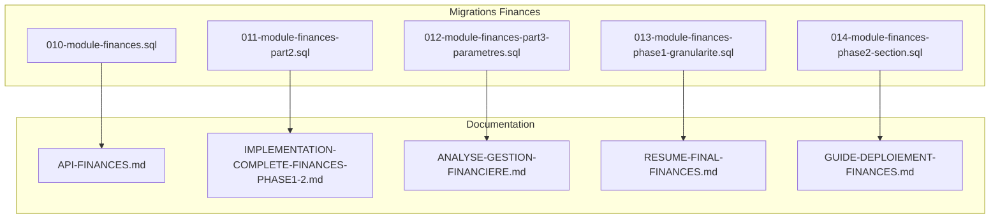
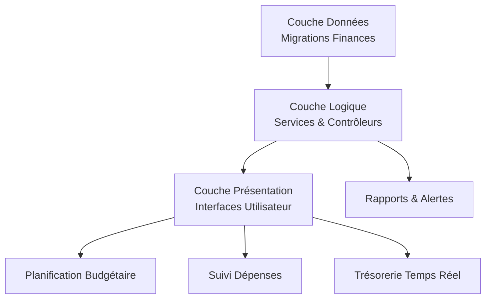
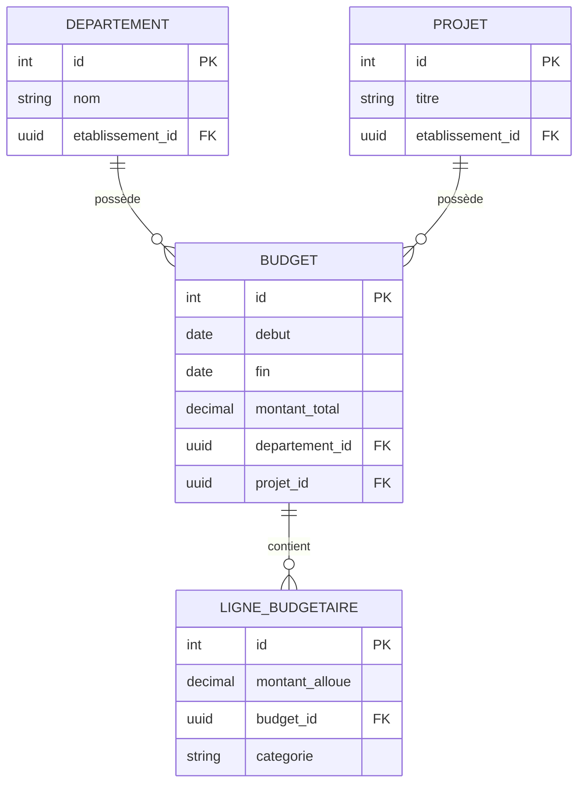
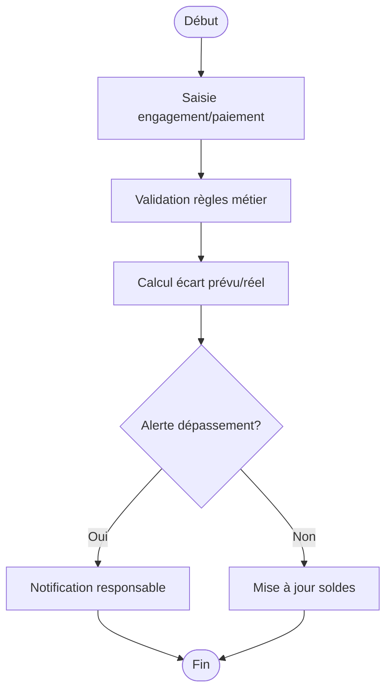
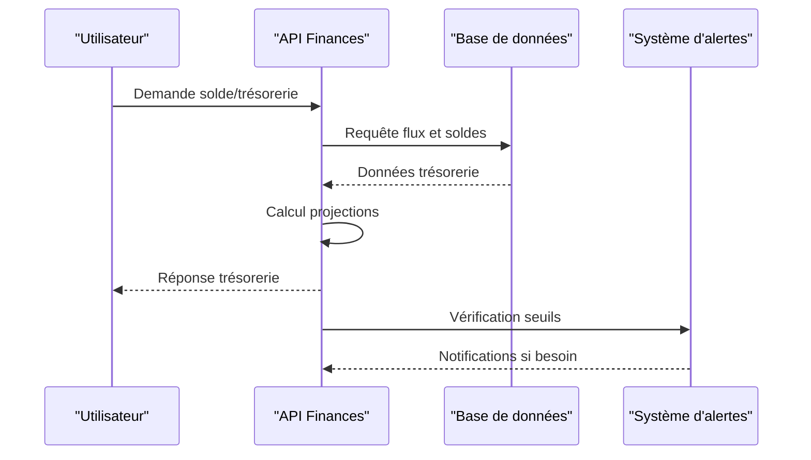
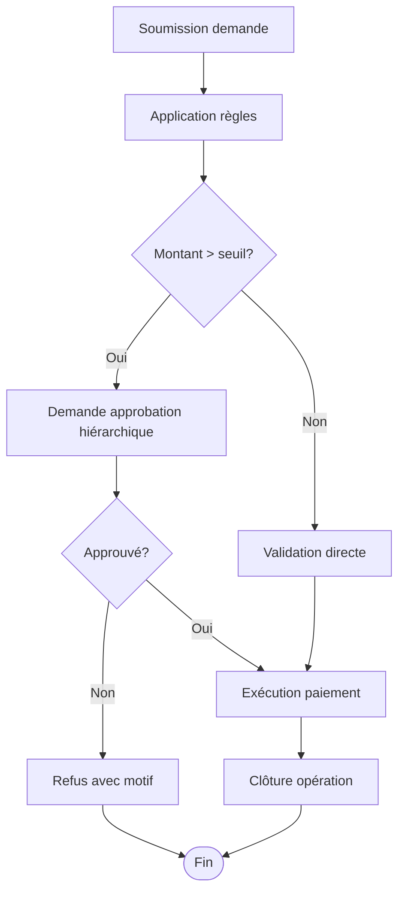
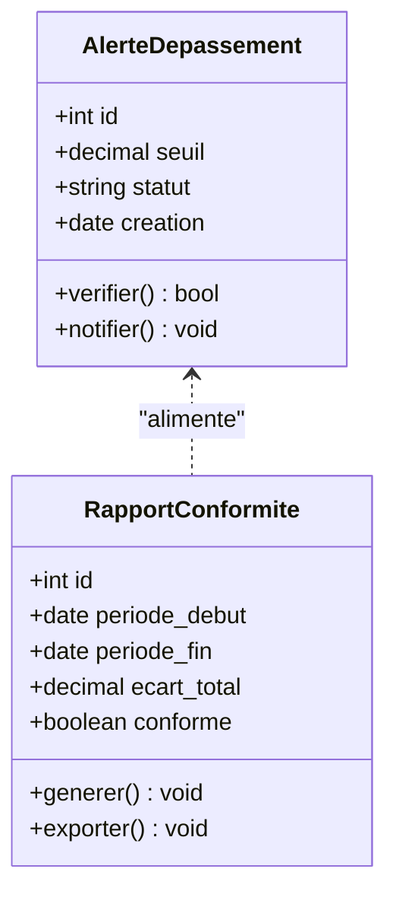
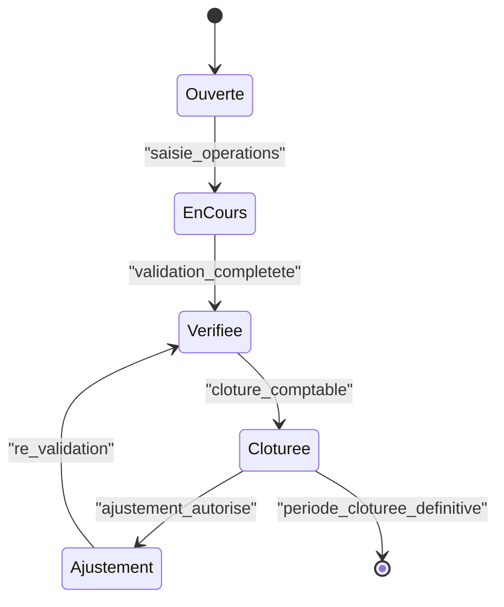
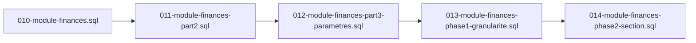

# Budget et Trésorerie

<cite>
**Fichiers référencés dans ce document**
- [010-module-finances.sql](file://backend/database/migrations/010-module-finances.sql)
- [011-module-finances-part2.sql](file://backend/database/migrations/011-module-finances-part2.sql)
- [012-module-finances-part3-parametres.sql](file://backend/database/migrations/012-module-finances-part3-parametres.sql)
- [013-module-finances-phase1-granularite.sql](file://backend/database/migrations/013-module-finances-phase1-granularite.sql)
- [014-module-finances-phase2-section.sql](file://backend/database/migrations/014-module-finances-phase2-section.sql)
- [API-FINANCES.md](file://docs/API-FINANCES.md)
- [IMPLEMENTATION-COMPLETE-FINANCES-PHASE1-2.md](file://docs/implementations/IMPLEMENTATION-COMPLETE-FINANCES-PHASE1-2.md)
- [ANALYSE-GESTION-FINANCIERE.md](file://docs/analyses/ANALYSE-GESTION-FINANCIERE.md)
- [RESUME-FINAL-FINANCES.md](file://docs/resumes/RESUME-FINAL-FINANCES.md)
- [GUIDE-DEPLOIEMENT-FINANCES.md](file://docs/GUIDE-DEPLOIEMENT-FINANCES.md)
- [test-finance-module.sh](file://scripts/test-finance-module.sh)
</cite>

## Table des matières
1. [Introduction](#introduction)
2. [Structure du projet](#structure-du-projet)
3. [Composants clés](#composants-clés)
4. [Vue d’ensemble de l’architecture](#vue-densemble-de-larchitecture)
5. [Analyse détaillée des composants](#analyse-detaillee-des-composants)
6. [Analyse des dépendances](#analyse-des-dependances)
7. [Considérations de performance](#considerations-de-performance)
8. [Guide de dépannage](#guide-de-depannage)
9. [Conclusion](#conclusion)
10. [Annexes](#annexes)

## Introduction
Ce document présente la documentation complète des modules de budget et trésorerie d’eLISAschool. Il couvre la planification budgétaire par département ou projet, le suivi des dépenses réelles vs prévues, la gestion de la trésorerie en temps réel, les entités budgétaires, les validations de dépenses, les approbations hiérarchiques, les alertes de dépassement, les exemples de budgets type, les flux de trésorerie prévisionnels, les outils d’aide à la décision financière, la clôture comptable, les ajustements budgétaires et les rapports de conformité financière.

## Structure du projet
Le module Finances est implémenté via des migrations SQL qui définissent les tables, relations et contraintes nécessaires au pilotage budgétaire et à la trésorerie. Les fichiers de migration suivants constituent le socle technique :
- Définition initiale du module finances
- Extensions de fonctionnalités (parties 2 et 3)
- Granularité budgétaire et sections financières
- Paramètres spécifiques au module

**Sources de diagramme**
- [010-module-finances.sql](file://backend/database/migrations/010-module-finances.sql)
- [011-module-finances-part2.sql](file://backend/database/migrations/011-module-finances-part2.sql)
- [012-module-finances-part3-parametres.sql](file://backend/database/migrations/012-module-finances-part3-parametres.sql)
- [013-module-finances-phase1-granularite.sql](file://backend/database/migrations/013-module-finances-phase1-granularite.sql)
- [014-module-finances-phase2-section.sql](file://backend/database/migrations/014-module-finances-phase2-section.sql)
- [API-FINANCES.md](file://docs/API-FINANCES.md)
- [IMPLEMENTATION-COMPLETE-FINANCES-PHASE1-2.md](file://docs/implementations/IMPLEMENTATION-COMPLETE-FINANCES-PHASE1-2.md)
- [ANALYSE-GESTION-FINANCIERE.md](file://docs/analyses/ANALYSE-GESTION-FINANCIERE.md)
- [RESUME-FINAL-FINANCES.md](file://docs/resumes/RESUME-FINAL-FINANCES.md)
- [GUIDE-DEPLOIEMENT-FINANCES.md](file://docs/GUIDE-DEPLOIEMENT-FINANCES.md)

**Sources de section**
- [010-module-finances.sql](file://backend/database/migrations/010-module-finances.sql)
- [011-module-finances-part2.sql](file://backend/database/migrations/011-module-finances-part2.sql)
- [012-module-finances-part3-parametres.sql](file://backend/database/migrations/012-module-finances-part3-parametres.sql)
- [013-module-finances-phase1-granularite.sql](file://backend/database/migrations/013-module-finances-phase1-granularite.sql)
- [014-module-finances-phase2-section.sql](file://backend/database/migrations/014-module-finances-phase2-section.sql)

## Composants clés
Les composants clés du module Finances incluent :
- Entités budgétaires : budgets, lignes budgétaires, départements/projets, sections financières
- Suivi des dépenses : engagements, paiements, dépenses réelles
- Trésorerie : soldes, flux prévisionnels, alertes de dépassement
- Approbations hiérarchiques : workflows de validation
- Clôture comptable : verrouillage de périodes, ajustements budgétaires
- Rapports de conformité : indicateurs financiers, écarts, alertes

Ces composants sont définis et enrichis progressivement via les migrations SQL du module.

**Sources de section**
- [010-module-finances.sql](file://backend/database/migrations/010-module-finances.sql)
- [011-module-finances-part2.sql](file://backend/database/migrations/011-module-finances-part2.sql)
- [012-module-finances-part3-parametres.sql](file://backend/database/migrations/012-module-finances-part3-parametres.sql)
- [013-module-finances-phase1-granularite.sql](file://backend/database/migrations/013-module-finances-phase1-granularite.sql)
- [014-module-finances-phase2-section.sql](file://backend/database/migrations/014-module-finances-phase2-section.sql)

## Vue d’ensemble de l’architecture
L’architecture du module Finances repose sur une base de données relationnelle structurée par migrations. Les principales couches sont :
- Couche données : tables et relations définies par les migrations
- Couche logique : services et contrôleurs exposant les API financières
- Couche présentation : interfaces utilisateur pour saisie, suivi et reporting

[Ce diagramme est conceptuel et ne mape pas directement des fichiers sources]

## Analyse détaillée des composants

### Planification budgétaire par département ou projet
La planification budgétaire permet de définir des budgets par département ou projet, avec des lignes budgétaires détaillées et des limites d’engagement. Les migrations introduisent les structures nécessaires pour modéliser ces entités et leurs relations.

**Sources de diagramme**
- [010-module-finances.sql](file://backend/database/migrations/010-module-finances.sql)
- [013-module-finances-phase1-granularite.sql](file://backend/database/migrations/013-module-finances-phase1-granularite.sql)

**Sources de section**
- [010-module-finances.sql](file://backend/database/migrations/010-module-finances.sql)
- [013-module-finances-phase1-granularite.sql](file://backend/database/migrations/013-module-finances-phase1-granularite.sql)

### Suivi des dépenses réelles vs prévues
Le suivi des dépenses compare les engagements et paiements aux montants alloués par ligne budgétaire. Des indicateurs d’écart permettent d’alerter en cas de dépassement.

**Sources de diagramme**
- [011-module-finances-part2.sql](file://backend/database/migrations/011-module-finances-part2.sql)
- [014-module-finances-phase2-section.sql](file://backend/database/migrations/014-module-finances-phase2-section.sql)

**Sources de section**
- [011-module-finances-part2.sql](file://backend/database/migrations/011-module-finances-part2.sql)
- [014-module-finances-phase2-section.sql]

### Gestion de la trésorerie en temps réel
La trésorerie en temps réel agrège les soldes par compte bancaire, suit les flux entrants/sortants et projette les positions futures.

**Sources de diagramme**
- [012-module-finances-part3-parametres.sql](file://backend/database/migrations/012-module-finances-part3-parametres.sql)
- [API-FINANCES.md](file://docs/API-FINANCES.md)

**Sources de section**
- [012-module-finances-part3-parametres.sql](file://backend/database/migrations/012-module-finances-part3-parametres.sql)
- [API-FINANCES.md](file://docs/API-FINANCES.md)

### Validations de dépenses et approbations hiérarchiques
Les dépenses sont soumises à des règles de validation et peuvent nécessiter des approbations hiérarchiques selon leur montant ou catégorie.

**Sources de diagramme**
- [011-module-finances-part2.sql](file://backend/database/migrations/011-module-finances-part2.sql)
- [IMPLEMENTATION-COMPLETE-FINANCES-PHASE1-2.md](file://docs/implementations/IMPLEMENTATION-COMPLETE-FINANCES-PHASE1-2.md)

**Sources de section**
- [011-module-finances-part2.sql](file://backend/database/migrations/011-module-finances-part2.sql)
- [IMPLEMENTATION-COMPLETE-FINANCES-PHASE1-2.md](file://docs/implementations/IMPLEMENTATION-COMPLETE-FINANCES-PHASE1-2.md)

### Alertes de dépassement et rapports de conformité
Des alertes automatiques sont déclenchées lorsque les dépenses dépassent les seuils prédéfinis. Des rapports de conformité vérifient la cohérence budgétaire et réglementaire.

**Sources de diagramme**
- [012-module-finances-part3-parametres.sql](file://backend/database/migrations/012-module-finances-part3-parametres.sql)
- [ANALYSE-GESTION-FINANCIERE.md](file://docs/analyses/ANALYSE-GESTION-FINANCIERE.md)

**Sources de section**
- [012-module-finances-part3-parametres.sql](file://backend/database/migrations/012-module-finances-part3-parametres.sql)
- [ANALYSE-GESTION-FINANCIERE.md](file://docs/analyses/ANALYSE-GESTION-FINANCIERE.md)

### Clôture comptable et ajustements budgétaires
La clôture comptable verrouille les périodes financières et permet des ajustements budgétaires contrôlés.

**Sources de diagramme**
- [014-module-finances-phase2-section.sql](file://backend/database/migrations/014-module-finances-phase2-section.sql)
- [RESUME-FINAL-FINANCES.md](file://docs/resumes/RESUME-FINAL-FINANCES.md)

**Sources de section**
- [014-module-finances-phase2-section.sql](file://backend/database/migrations/014-module-finances-phase2-section.sql)
- [RESUME-FINAL-FINANCES.md](file://docs/resumes/RESUME-FINAL-FINANCES.md)

## Analyse des dépendances
Les migrations du module Finances créent des dépendances entre entités budgétaires, transactions et paramètres système.

**Sources de diagramme**
- [010-module-finances.sql](file://backend/database/migrations/010-module-finances.sql)
- [011-module-finances-part2.sql](file://backend/database/migrations/011-module-finances-part2.sql)
- [012-module-finances-part3-parametres.sql](file://backend/database/migrations/012-module-finances-part3-parametres.sql)
- [013-module-finances-phase1-granularite.sql](file://backend/database/migrations/013-module-finances-phase1-granularite.sql)
- [014-module-finances-phase2-section.sql](file://backend/database/migrations/014-module-finances-phase2-section.sql)

**Sources de section**
- [010-module-finances.sql](file://backend/database/migrations/010-module-finances.sql)
- [011-module-finances-part2.sql](file://backend/database/migrations/011-module-finances-part2.sql)
- [012-module-finances-part3-parametres.sql](file://backend/database/migrations/012-module-finances-part3-parametres.sql)
- [013-module-finances-phase1-granularite.sql](file://backend/database/migrations/013-module-finances-phase1-granularite.sql)
- [014-module-finances-phase2-section.sql](file://backend/database/migrations/014-module-finances-phase2-section.sql)

## Considérations de performance
- Indexation des colonnes fréquentes dans les requêtes de suivi budgétaire
- Agrégations optimisées pour les rapports de trésorerie
- Partitionnement des données historiques pour améliorer les performances
- Cache des soldes temps réel pour réduire la charge base de données

## Guide de dépannage
Problèmes courants et solutions :
- Erreurs de migration : vérifier l’ordre d’exécution des scripts
- Incohérences budgétaires : exécuter les vérifications de cohérence
- Alertes erronées : valider les seuils et paramètres
- Performances dégradées : analyser les index et requêtes lentes

Outils disponibles :
- Scripts de test du module finances
- Documentation de déploiement spécifique
- Analyses techniques détaillées

**Sources de section**
- [test-finance-module.sh](file://scripts/test-finance-module.sh)
- [GUIDE-DEPLOIEMENT-FINANCES.md](file://docs/GUIDE-DEPLOIEMENT-FINANCES.md)
- [ANALYSE-GESTION-FINANCIERE.md](file://docs/analyses/ANALYSE-GESTION-FINANCIERE.md)

## Conclusion
Le module Finances d’eLISAschool offre une solution complète pour la gestion budgétaire et la trésorerie. Grâce à une architecture basée sur des migrations SQL bien structurées, il permet un pilotage financier précis, des alertes proactives et des rapports de conformité fiables. La documentation fournie facilite l’implémentation, le déploiement et la maintenance du système.

## Annexes

### Exemples de budgets type
- Budget départemental annuel avec lignes par fonction
- Budget projet avec phases et jalons financiers
- Budget opérationnel mensuel avec provisions

### Flux de trésorerie prévisionnels
- Prévisions basées sur les engagements et paiements planifiés
- Scénarios de sensibilité pour les variations de recettes
- Projections de trésorerie à court et moyen terme

### Outils d’aide à la décision financière
- Tableaux de bord interactifs
- Indicateurs de performance financière
- Simulateurs de scénarios budgétaires

**Sources de section**
- [IMPLEMENTATION-COMPLETE-FINANCES-PHASE1-2.md](file://docs/implementations/IMPLEMENTATION-COMPLETE-FINANCES-PHASE1-2.md)
- [RESUME-FINAL-FINANCES.md](file://docs/resumes/RESUME-FINAL-FINANCES.md)