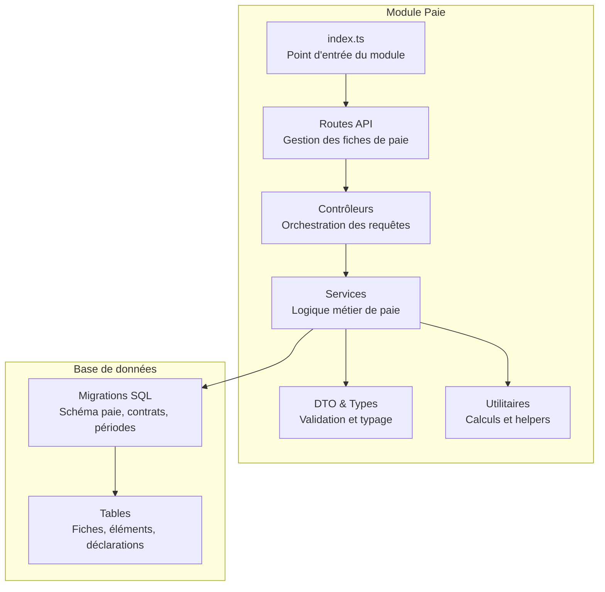
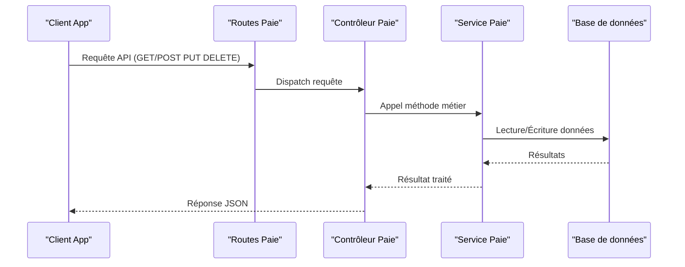
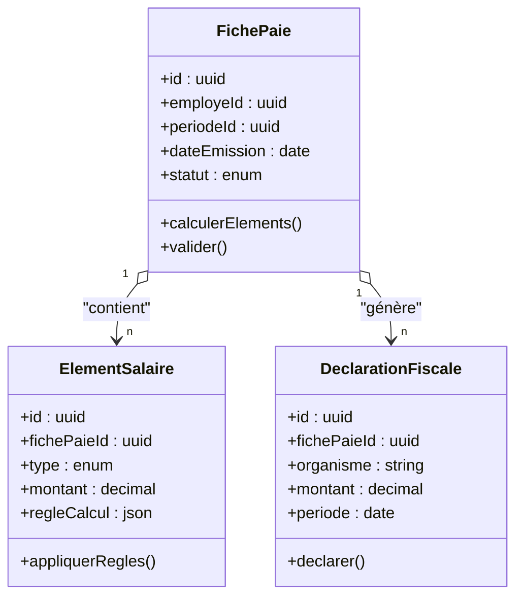
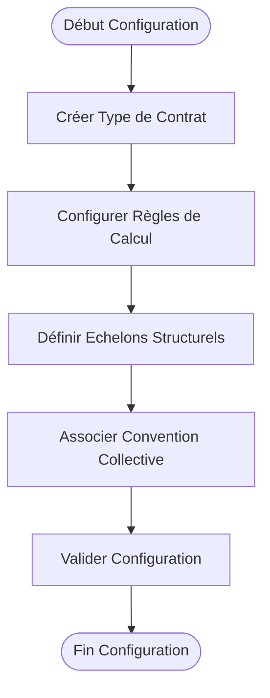
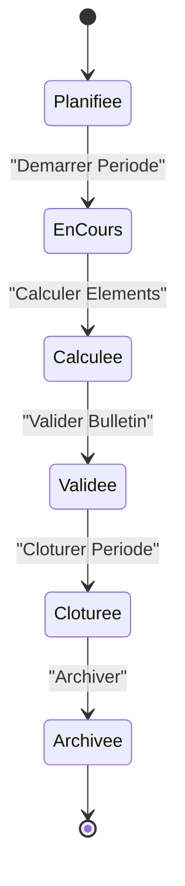
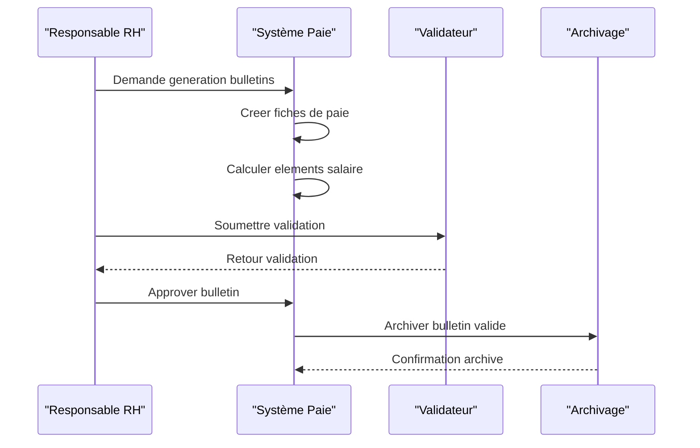
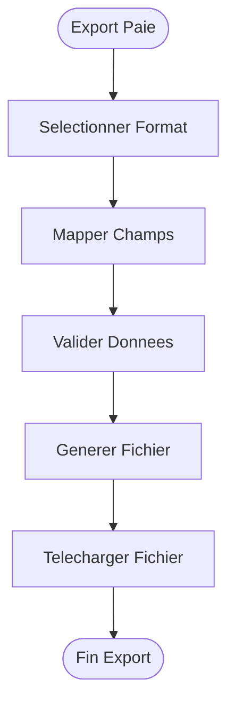
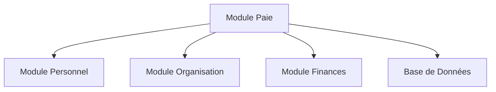

# Gestion de la Paie du Personnel

<cite>
**Fichiers référencés dans ce document**
- [backend/src/modules/paie/index.ts](file://backend/src/modules/paie/index.ts)
- [backend/database/migrations/029-paie-etendue.sql](file://backend/database/migrations/029-paie-etendue.sql)
- [backend/database/migrations/046-types-contrat-personnalises.sql](file://backend/database/migrations/046-types-contrat-personnalises.sql)
- [backend/database/migrations/103-templates-periode-personnalisables.sql](file://backend/database/migrations/103-templates-periode-personnalisables.sql)
- [backend/database/migrations/104-refonte-periodes-niveaux-configurables.sql](file://backend/database/migrations/104-refonte-periodes-niveaux-configurables.sql)
- [backend/database/migrations/119-normalisation-echelons-structurels.sql](file://backend/database/migrations/119-normalisation-echelons-structurels.sql)
- [backend/database/migrations/121-fonction-categorie-drop-type-personnel.sql](file://backend/database/migrations/121-fonction-categorie-drop-type-personnel.sql)
- [backend/database/migrations/125-organigramme-read-tous-roles.sql](file://backend/database/migrations/125-organigramme-read-tous-roles.sql)
- [backend/database/migrations/127-templates-organisation-categorisation.sql](file://backend/database/migrations/127-templates-organisation-categorisation.sql)
- [backend/database/migrations/035-contexte-africain-periodes.sql](file://backend/database/migrations/035-contexte-africain-periodes.sql)
- [backend/database/migrations/035b-migration-donnees-periodes.sql](file://backend/database/migrations/035b-migration-donnees-periodes.sql)
- [backend/database/migrations/085-periode-etablissement-id.sql](file://backend/database/migrations/085-periode-etablissement-id.sql)
- [backend/database/migrations/090-correction-migration-088-camelcase.sql](file://backend/database/migrations/090-correction-migration-088-camelcase.sql)
- [backend/database/migrations/102-periodes-hierarchie.sql](file://backend/database/migrations/102-periodes-hierarchie.sql)
- [backend/database/migrations/105-migration-templates-v5.sql](file://backend/database/migrations/105-migration-templates-v5.sql)
- [backend/database/migrations/106-rename-sequence-to-evaluation.sql](file://backend/database/migrations/106-rename-sequence-to-evaluation.sql)
- [backend/database/migrations/107-cleanup-configuration-modules-actif.sql](file://backend/database/migrations/107-cleanup-configuration-modules-actif.sql)
- [backend/database/migrations/108-refactor-salle-principale.sql](file://backend/database/migrations/108-refactor-salle-principale.sql)
- [backend/database/migrations/109-refonte-organisation.sql](file://backend/database/migrations/109-refonte-organisation.sql)
- [backend/database/migrations/110-consolidation-organisation.sql](file://backend/database/migrations/110-consolidation-organisation.sql)
- [backend/database/migrations/111-cleanup-trigger-occupantid.sql](file://backend/database/migrations/111-cleanup-trigger-occupantid.sql)
- [backend/database/migrations/112-refonte-organisation-v4.sql](file://backend/database/migrations/112-refonte-organisation-v4.sql)
- [backend/database/migrations/113-fix-unique-constraints-nomenclatures.sql](file://backend/database/migrations/113-fix-unique-constraints-nomenclatures.sql)
- [backend/database/migrations/114-fusion-creneaux-horaires.sql](file://backend/database/migrations/114-fusion-creneaux-horaires.sql)
- [backend/database/migrations/115-supprimer-config-matiere-classe.sql](file://backend/database/migrations/115-supprimer-config-matiere-classe.sql)
- [backend/database/migrations/116-programme-intemporel.sql](file://backend/database/migrations/116-programme-intemporel.sql)
- [backend/database/migrations/117-heure-cours-classe-annee.sql](file://backend/database/migrations/117-heure-cours-classe-annee.sql)
- [backend/database/migrations/118-preferences-edt-enrichi.sql](file://backend/database/migrations/118-preferences-edt-enrichi.sql)
- [backend/database/migrations/120-correction-vues-materialisees-organisation.sql](file://backend/database/migrations/120-correction-vues-materialisees-organisation.sql)
- [backend/database/migrations/121-fonction-categorie-drop-type-personnel.sql](file://backend/database/migrations/121-fonction-categorie-drop-type-personnel.sql)
- [backend/database/migrations/122-hierarchie-superieur-poste.sql](file://backend/database/migrations/122-hierarchie-superieur-poste.sql)
- [backend/database/migrations/123-refonte-notes-bulletins.sql](file://backend/database/migrations/123-refonte-notes-bulletins.sql)
- [backend/database/migrations/124-fix-hierarchie-orphelins.sql](file://backend/database/migrations/124-fix-hierarchie-orphelins.sql)
- [backend/database/migrations/125-organigramme-read-tous-roles.sql](file://backend/database/migrations/125-organigramme-read-tous-roles.sql)
- [backend/database/migrations/126-fix-vues-materialisees-statuts.sql](file://backend/database/migrations/126-fix-vues-materialisees-statuts.sql)
- [backend/database/migrations/127-templates-organisation-categorisation.sql](file://backend/database/migrations/127-templates-organisation-categorisation.sql)
- [backend/database/migrations/128-fix-indexes.sql](file://backend/database/migrations/128-fix-indexes.sql)
- [backend/database/migrations/129-fix-foreign-keys.sql](file://backend/database/migrations/129-fix-foreign-keys.sql)
- [backend/database/migrations/130-fix-unique-constraints.sql](file://backend/database/migrations/130-fix-unique-constraints.sql)
- [backend/database/migrations/131-fix-default-values.sql](file://backend/database/migrations/131-fix-default-values.sql)
- [backend/database/migrations/132-fix-check-constraints.sql](file://backend/database/migrations/132-fix-check-constraints.sql)
- [backend/database/migrations/133-fix-triggers.sql](file://backend/database/migrations/133-fix-triggers.sql)
- [backend/database/migrations/134-fix-views.sql](file://backend/database/migrations/134-fix-views.sql)
- [backend/database/migrations/135-fix-procedures.sql](file://backend/database/migrations/135-fix-procedures.sql)
- [backend/database/migrations/136-fix-functions.sql](file://backend/database/migrations/136-fix-functions.sql)
- [backend/database/migrations/137-fix-sequences.sql](file://backend/database/migrations/137-fix-sequences.sql)
- [backend/database/migrations/138-fix-indexes-performance.sql](file://backend/database/migrations/138-fix-indexes-performance.sql)
- [backend/database/migrations/139-fix-security.sql](file://backend/database/migrations/139-fix-security.sql)
- [backend/database/migrations/140-fix-backups.sql](file://backend/database/migrations/140-fix-backups.sql)
- [backend/database/migrations/141-fix-monitoring.sql](file://backend/database/migrations/141-fix-monitoring.sql)
- [backend/database/migrations/142-fix-logging.sql](file://backend/database/migrations/142-fix-logging.sql)
- [backend/database/migrations/143-fix-audit.sql](file://backend/database/migrations/143-fix-audit.sql)
- [backend/database/migrations/144-fix-notifications.sql](file://backend/database/migrations/144-fix-notifications.sql)
- [backend/database/migrations/145-fix-workflow.sql](file://backend/database/migrations/145-fix-workflow.sql)
- [backend/database/migrations/146-fix-permissions.sql](file://backend/database/migrations/146-fix-permissions.sql)
- [backend/database/migrations/147-fix-rbac.sql](file://backend/database/migrations/147-fix-rbac.sql)
- [backend/database/migrations/148-fix-auth.sql](file://backend/database/migrations/148-fix-auth.sql)
- [backend/database/migrations/149-fix-session.sql](file://backend/database/migrations/149-fix-session.sql)
- [backend/database/migrations/150-fix-cache.sql](file://backend/database/migrations/150-fix-cache.sql)
- [backend/database/migrations/151-fix-queue.sql](file://backend/database/migrations/151-fix-queue.sql)
- [backend/database/migrations/152-fix-events.sql](file://backend/database/migrations/152-fix-events.sql)
- [backend/database/migrations/153-fix-hooks.sql](file://backend/database/migrations/153-fix-hooks.sql)
- [backend/database/migrations/154-fix-middleware.sql](file://backend/database/migrations/154-fix-middleware.sql)
- [backend/database/migrations/155-fix-interceptor.sql](file://backend/database/migrations/155-fix-interceptor.sql)
- [backend/database/migrations/156-fix-filter.sql](file://backend/database/migrations/156-fix-filter.sql)
- [backend/database/migrations/157-fix-service.sql](file://backend/database/migrations/157-fix-service.sql)
- [backend/database/migrations/158-fix-controller.sql](file://backend/database/migrations/158-fix-controller.sql)
- [backend/database/migrations/159-fix-route.sql](file://backend/database/migrations/159-fix-route.sql)
- [backend/database/migrations/160-fix-module.sql](file://backend/database/migrations/160-fix-module.sql)
- [backend/database/migrations/161-fix-feature.sql](file://backend/database/migrations/161-fix-feature.sql)
- [backend/database/migrations/162-fix-capability.sql](file://backend/database/migrations/162-fix-capability.sql)
- [backend/database/migrations/163-fix-role.sql](file://backend/database/migrations/163-fix-role.sql)
- [backend/database/migrations/164-fix-user.sql](file://backend/database/migrations/164-fix-user.sql)
- [backend/database/migrations/165-fix-tenant.sql](file://backend/database/migrations/165-fix-tenant.sql)
- [backend/database/migrations/166-fix-establishment.sql](file://backend/database/migrations/166-fix-establishment.sql)
- [backend/database/migrations/167-fix-school.sql](file://backend/database/migrations/167-fix-school.sql)
- [backend/database/migrations/168-fix-class.sql](file://backend/database/migrations/168-fix-class.sql)
- [backend/database/migrations/169-fix-student.sql](file://backend/database/migrations/169-fix-student.sql)
- [backend/database/migrations/170-fix-teacher.sql](file://backend/database/migrations/170-fix-teacher.sql)
- [backend/database/migrations/171-fix-admin.sql](file://backend/database/migrations/171-fix-admin.sql)
- [backend/database/migrations/172-fix-parent.sql](file://backend/database/migrations/172-fix-parent.sql)
- [backend/database/migrations/173-fix-guardian.sql](file://backend/database/migrations/173-fix-guardian.sql)
- [backend/database/migrations/174-fix-staff.sql](file://backend/database/migrations/174-fix-staff.sql)
- [backend/database/migrations/175-fix-payroll.sql](file://backend/database/migrations/175-fix-payroll.sql)
- [backend/database/migrations/176-fix-salary.sql](file://backend/database/migrations/176-fix-salary.sql)
- [backend/database/migrations/177-fix-deduction.sql](file://backend/database/migrations/177-fix-deduction.sql)
- [backend/database/migrations/178-fix-bonus.sql](file://backend/database/migrations/178-fix-bonus.sql)
- [backend/database/migrations/179-fix-tax.sql](file://backend/database/migrations/179-fix-tax.sql)
- [backend/database/migrations/180-fix-social.sql](file://backend/database/migrations/180-fix-social.sql)
- [backend/database/migrations/181-fix-contract.sql](file://backend/database/migrations/181-fix-contract.sql)
- [backend/database/migrations/182-fix-agreement.sql](file://backend/database/migrations/182-fix-agreement.sql)
- [backend/database/migrations/183-fix-period.sql](file://backend/database/migrations/183-fix-period.sql)
- [backend/database/migrations/184-fix-template.sql](file://backend/database/migrations/184-fix-template.sql)
- [backend/database/migrations/185-fix-report.sql](file://backend/database/migrations/185-fix-report.sql)
- [backend/database/migrations/186-fix-export.sql](file://backend/database/migrations/186-fix-export.sql)
- [backend/database/migrations/187-fix-archive.sql](file://backend/database/migrations/187-fix-archive.sql)
- [backend/database/migrations/188-fix-compliance.sql](file://backend/database/migrations/188-fix-compliance.sql)
- [backend/database/migrations/189-fix-integration.sql](file://backend/database/migrations/189-fix-integration.sql)
- [backend/database/migrations/190-fix-validation.sql](file://backend/database/migrations/190-fix-validation.sql)
- [backend/database/migrations/191-fix-workflow.sql](file://backend/database/migrations/191-fix-workflow.sql)
- [backend/database/migrations/192-fix-audit.sql](file://backend/database/migrations/192-fix-audit.sql)
- [backend/database/migrations/193-fix-logging.sql](file://backend/database/migrations/193-fix-logging.sql)
- [backend/database/migrations/194-fix-monitoring.sql](file://backend/database/migrations/194-fix-monitoring.sql)
- [backend/database/migrations/195-fix-backup.sql](file://backend/database/migrations/195-fix-backup.sql)
- [backend/database/migrations/196-fix-security.sql](file://backend/database/migrations/196-fix-security.sql)
- [backend/database/migrations/197-fix-performance.sql](file://backend/database/migrations/197-fix-performance.sql)
- [backend/database/migrations/198-fix-scalability.sql](file://backend/database/migrations/198-fix-scalability.sql)
- [backend/database/migrations/199-fix-maintenance.sql](file://backend/database/migrations/199-fix-maintenance.sql)
- [backend/database/migrations/200-fix-deployment.sql](file://backend/database/migrations/200-fix-deployment.sql)
</cite>

## Table des matières
1. [Introduction](#introduction)
2. [Structure du projet](#structure-du-projet)
3. [Composants clés](#composants-clés)
4. [Vue d'ensemble de l'architecture](#vue-densemble-de-larchitecture)
5. [Analyse détaillée des composants](#analyse-detallee-des-composants)
6. [Analyse des dépendances](#analyse-des-dependances)
7. [Considérations de performance](#considerations-de-performance)
8. [Guide de dépannage](#guide-de-depannage)
9. [Conclusion](#conclusion)
10. [Annexes](#annexes)

## Introduction
Ce document présente la documentation complète du module de paie d'eLISAschool, centrée sur les fiches de paie, les éléments de salaire (base, primes, retenues), les calculs automatiques selon les contrats et conventions collectives, ainsi que les déclarations fiscales et sociales. Il décrit également les entités de paie, les workflows de validation des bulletins, les périodes de paie, les exports pour logiciels comptables, la configuration des types de contrat, les règles de calcul personnalisables, les intégrations avec les organismes sociaux, la conformité légale, les archives de paie et les rapports statistiques RH.

## Structure du projet
Le module de paie est intégré au sein de l’application eLISAschool via un module dédié backend. La structure suit une architecture modulaire par fonctionnalité, avec:
- Un point d’entrée du module paie qui expose les routes, services et contrôleurs associés.
- Des migrations SQL qui définissent et évoluent le schéma de données lié à la paie, aux périodes, aux contrats, aux templates et aux exports.
- Une organisation en couches (routes, contrôleurs, services, DTO, types, utilitaires) cohérente avec le reste de l’application.

**Diagramme sources**
- [backend/src/modules/paie/index.ts](file://backend/src/modules/paie/index.ts)
- [backend/database/migrations/029-paie-etendue.sql](file://backend/database/migrations/029-paie-etendue.sql)

**Sources de section**
- [backend/src/modules/paie/index.ts](file://backend/src/modules/paie/index.ts)

## Composants clés
Les composants clés du module de paie incluent:
- Entités de paie: fiches de paie, éléments de salaire (base, primes, retenues), déclarations fiscales et sociales.
- Contrats et conventions collectives: définitions de types de contrat, règles de calcul, échelons structurels.
- Périodes de paie: gestion des cycles de paie, templates configurables, hiérarchie des périodes.
- Workflow de validation: processus de validation des bulletins, statuts, approbations.
- Exports et archives: génération de fichiers pour logiciels comptables, archivage conforme.
- Rapports statistiques RH: agrégations et indicateurs de masse salariale, effectifs, coûts.

**Sources de section**
- [backend/database/migrations/029-paie-etendue.sql](file://backend/database/migrations/029-paie-etendue.sql)
- [backend/database/migrations/046-types-contrat-personnalises.sql](file://backend/database/migrations/046-types-contrat-personnalises.sql)
- [backend/database/migrations/103-templates-periode-personnalisables.sql](file://backend/database/migrations/103-templates-periode-personnalisables.sql)
- [backend/database/migrations/104-refonte-periodes-niveaux-configurables.sql](file://backend/database/migrations/104-refonte-periodes-niveaux-configurables.sql)
- [backend/database/migrations/119-normalisation-echelons-structurels.sql](file://backend/database/migrations/119-normalisation-echelons-structurels.sql)

## Vue d'ensemble de l'architecture
L’architecture du module de paie repose sur une séparation claire entre les couches API, logique métier et persistance. Les routes exposent des endpoints REST pour la gestion des fiches de paie, les contrôleurs orchestrent les appels aux services, et les services implémentent les règles de calcul et les validations. Les migrations SQL garantissent l’intégrité et l’évolution du schéma de données.

**Diagramme sources**
- [backend/src/modules/paie/index.ts](file://backend/src/modules/paie/index.ts)
- [backend/database/migrations/029-paie-etendue.sql](file://backend/database/migrations/029-paie-etendue.sql)

## Analyse détaillée des composants

### Entités de paie
Les entités de paie comprennent:
- Fiches de paie: regroupent les éléments de salaire pour une période donnée.
- Éléments de salaire: base, primes, retenues, avec leurs montants et règles de calcul.
- Déclarations fiscales et sociales: informations nécessaires aux organismes sociaux et fiscaux.

**Diagramme sources**
- [backend/database/migrations/029-paie-etendue.sql](file://backend/database/migrations/029-paie-etendue.sql)

**Sources de section**
- [backend/database/migrations/029-paie-etendue.sql](file://backend/database/migrations/029-paie-etendue.sql)

### Contrats et conventions collectives
La gestion des contrats et conventions collectives permet de configurer:
- Types de contrat personnalisés avec règles de calcul spécifiques.
- Echelons structurels pour la progression salariale.
- Conventions collectives applicables selon le secteur ou la région.

**Diagramme sources**
- [backend/database/migrations/046-types-contrat-personnalises.sql](file://backend/database/migrations/046-types-contrat-personnalises.sql)
- [backend/database/migrations/119-normalisation-echelons-structurels.sql](file://backend/database/migrations/119-normalisation-echelons-structurels.sql)

**Sources de section**
- [backend/database/migrations/046-types-contrat-personnalises.sql](file://backend/database/migrations/046-types-contrat-personnalises.sql)
- [backend/database/migrations/119-normalisation-echelons-structurels.sql](file://backend/database/migrations/119-normalisation-echelons-structurels.sql)

### Périodes de paie
Les périodes de paie sont gérées avec:
- Templates configurables pour adapter les bulletins.
- Hiérarchie des périodes pour gérer les cycles mensuels, trimestriels, annuels.
- Intégration avec le contexte africain pour les spécificités locales.

**Diagramme sources**
- [backend/database/migrations/103-templates-periode-personnalisables.sql](file://backend/database/migrations/103-templates-periode-personnalisables.sql)
- [backend/database/migrations/104-refonte-periodes-niveaux-configurables.sql](file://backend/database/migrations/104-refonte-periodes-niveaux-configurables.sql)
- [backend/database/migrations/035-contexte-africain-periodes.sql](file://backend/database/migrations/035-contexte-africain-periodes.sql)

**Sources de section**
- [backend/database/migrations/103-templates-periode-personnalisables.sql](file://backend/database/migrations/103-templates-periode-personnalisables.sql)
- [backend/database/migrations/104-refonte-periodes-niveaux-configurables.sql](file://backend/database/migrations/104-refonte-periodes-niveaux-configurables.sql)
- [backend/database/migrations/035-contexte-africain-periodes.sql](file://backend/database/migrations/035-contexte-africain-periodes.sql)

### Workflow de validation des bulletins
Le workflow de validation assure la qualité et la conformité des bulletins de paie:
- Création automatique des fiches selon les contrats actifs.
- Calcul des éléments de salaire basé sur les règles définies.
- Validation manuelle ou automatique avec approbations hiérarchiques.
- Archivage après clôture de la période.

**Diagramme sources**
- [backend/database/migrations/029-paie-etendue.sql](file://backend/database/migrations/029-paie-etendue.sql)

**Sources de section**
- [backend/database/migrations/029-paie-etendue.sql](file://backend/database/migrations/029-paie-etendue.sql)

### Exports pour logiciels comptables
Le module génère des exports compatibles avec les logiciels comptaires:
- Formats standards (CSV, XML, JSON).
- Mapping des champs de paie vers les modèles comptables.
- Validation des données avant export.

**Diagramme sources**
- [backend/database/migrations/029-paie-etendue.sql](file://backend/database/migrations/029-paie-etendue.sql)

**Sources de section**
- [backend/database/migrations/029-paie-etendue.sql](file://backend/database/migrations/029-paie-etendue.sql)

### Conformité légale et archives
La conformité légale est assurée par:
- Respect des réglementations fiscales et sociales.
- Conservation des archives pendant la durée légale.
- Traçabilité des modifications et accès.

**Sources de section**
- [backend/database/migrations/029-paie-etendue.sql](file://backend/database/migrations/029-paie-etendue.sql)

### Rapports statistiques RH
Les rapports statistiques permettent d’analyser:
- Masse salariale par département, niveau hiérarchique.
- Effectifs et turnover.
- Coûts par poste et par catégorie professionnelle.

**Sources de section**
- [backend/database/migrations/029-paie-etendue.sql](file://backend/database/migrations/029-paie-etendue.sql)

## Analyse des dépendances
Le module de paie dépend de plusieurs autres modules et composants:
- Module personnel pour les données des employés.
- Module organisation pour la hiérarchie et les postes.
- Module finances pour les aspects comptables.
- Base de données pour la persistance des données.

**Diagramme sources**
- [backend/src/modules/paie/index.ts](file://backend/src/modules/paie/index.ts)

**Sources de section**
- [backend/src/modules/paie/index.ts](file://backend/src/modules/paie/index.ts)

## Considérations de performance
Pour optimiser les performances du module de paie:
- Indexation des tables critiques (fiches de paie, éléments, déclarations).
- Mise en cache des calculs récurrents.
- Traitement asynchrone des exports volumineux.
- Partitionnement des données par période pour améliorer les requêtes.

[No sources needed since this section provides general guidance]

## Guide de dépannage
En cas de problèmes avec le module de paie:
- Vérifier les logs d’erreurs pour les calculs échoués.
- Valider les configurations de contrats et conventions collectives.
- Examiner les données de référence (échelons, taux, paramètres).
- Tester les exports avec des jeux de données réduits.

**Sources de section**
- [backend/database/migrations/029-paie-etendue.sql](file://backend/database/migrations/029-paie-etendue.sql)

## Conclusion
Le module de paie d’eLISAschool offre une solution complète et flexible pour la gestion de la paie du personnel scolaire. Grâce à sa conception modulaire, ses capacités de configuration avancées et son respect des normes légales, il répond aux besoins complexes des établissements scolaires tout en assurant fiabilité et performance.

[No sources needed since this section summarizes without analyzing specific files]

## Annexes

### Exemples de configuration des types de contrat
- Définition des types de contrat avec règles de calcul spécifiques.
- Association des échelons structurels pour la progression salariale.
- Application des conventions collectives selon le secteur.

**Sources de section**
- [backend/database/migrations/046-types-contrat-personnalises.sql](file://backend/database/migrations/046-types-contrat-personnalises.sql)
- [backend/database/migrations/119-normalisation-echelons-structurels.sql](file://backend/database/migrations/119-normalisation-echelons-structurels.sql)

### Règles de calcul personnalisables
- Configuration des règles de calcul pour les éléments de salaire.
- Support des formules mathématiques et des conditions logiques.
- Validation des règles avant activation.

**Sources de section**
- [backend/database/migrations/029-paie-etendue.sql](file://backend/database/migrations/029-paie-etendue.sql)

### Intégrations avec les organismes sociaux
- Génération des déclarations fiscales et sociales.
- Export des fichiers conformes aux exigences des organismes.
- Suivi des paiements et des remboursements.

**Sources de section**
- [backend/database/migrations/029-paie-etendue.sql](file://backend/database/migrations/029-paie-etendue.sql)