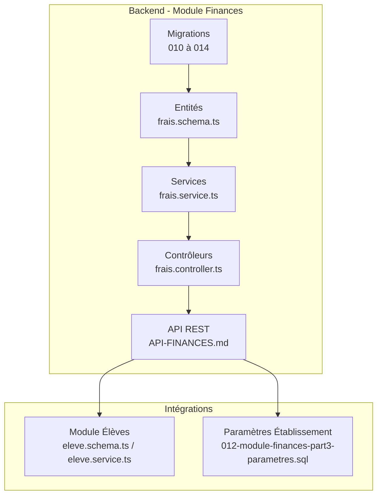
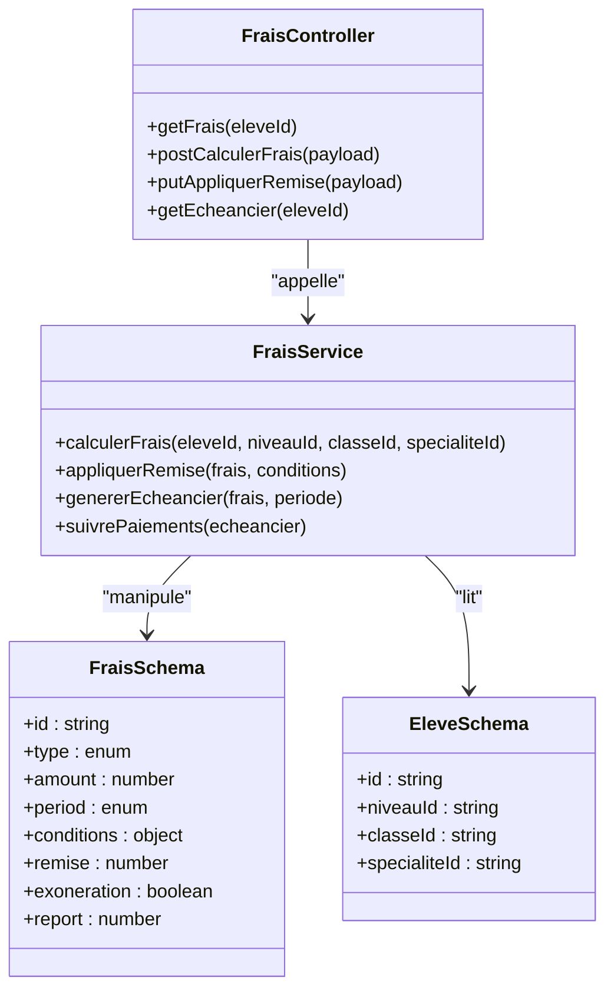
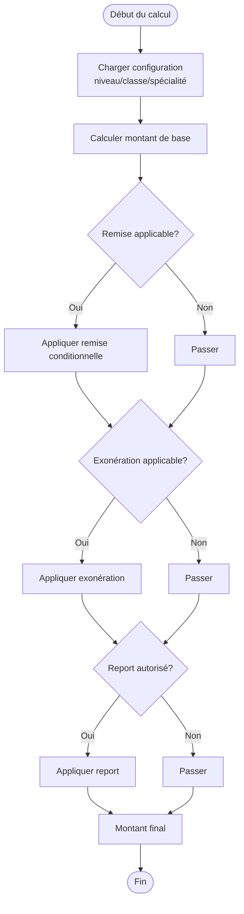
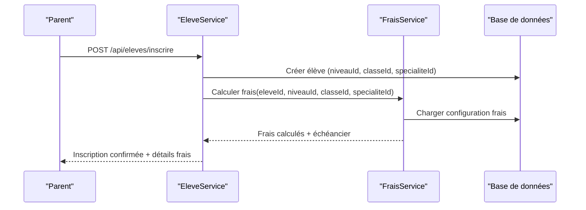
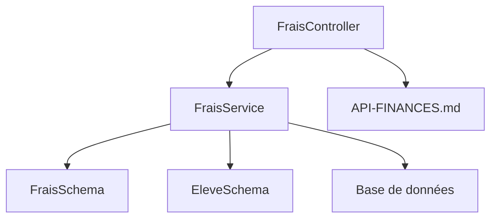

# Gestion des Frais Scolaires

<cite>
**Fichiers référencés dans ce document**
- [010-module-finances.sql](file://backend/database/migrations/010-module-finances.sql)
- [011-module-finances-part2.sql](file://backend/database/migrations/011-module-finances-part2.sql)
- [012-module-finances-part3-parametres.sql](file://backend/database/migrations/012-module-finances-part3-parametres.sql)
- [013-module-finances-phase1-granularite.sql](file://backend/database/migrations/013-module-finances-phase1-granularite.sql)
- [014-module-finances-phase2-section.sql](file://backend/database/migrations/014-module-finances-phase2-section.sql)
- [049-ameliorations-inscription-finances.sql](file://backend/database/migrations/049-ameliorations-inscription-finances.sql)
- [50-ameliorations-inscription-relances.sql](file://backend/database/migrations/050-ameliorations-inscription-relances.sql)
- [IMPLEMENTATION-COMPLETE-FINANCES.md](file://docs/implementations/IMPLEMENTATION-COMPLETE-FINANCES.md)
- [ANALYSE-FRAIS-REMISES-COHERENCE.md](file://docs/analyses/ANALYSE-FRAIS-REMISES-COHERENCE.md)
- [GUIDE-DEPLOIEMENT-FINANCES.md](file://docs/guides/GUIDE-DEPLOIEMENT-FINANCES.md)
- [API-FINANCES.md](file://docs/API-FINANCES.md)
- [src/modules/finances/index.ts](file://backend/src/modules/finances/index.ts)
- [src/modules/finances/entities/frais.schema.ts](file://backend/src/modules/finances/entities/frais.schema.ts)
- [src/modules/finances/services/frais.service.ts](file://backend/src/modules/finances/services/frais.service.ts)
- [src/modules/finances/controllers/frais.controller.ts](file://backend/src/modules/finances/controllers/frais.controller.ts)
- [src/modules/eleves/entities/eleve.schema.ts](file://backend/src/modules/eleves/entities/eleve.schema.ts)
- [src/modules/eleves/services/eleve.service.ts](file://backend/src/modules/eleves/services/eleve.service.ts)
</cite>

## Table des matières
1. [Introduction](#introduction)
2. [Structure du projet](#structure-du-projet)
3. [Composants clés](#composants-clés)
4. [Vue d’architecture](#vue-darchitecture)
5. [Analyse détaillée des composants](#analyse-detaillee-des-composants)
6. [Analyse des dépendances](#analyse-des-dependances)
7. [Considérations de performance](#considerations-de-performance)
8. [Guide de dépannage](#guide-de-depannage)
9. [Conclusion](#conclusion)
10. [Annexes](#annexes)

## Introduction
Ce document présente le système de gestion des frais scolaires d’eLISAschool. Il couvre la configuration des frais par niveau, classe et spécialité, les modalités de paiement (mensuel, trimestriel, annuel), les règles de calcul automatiques, les entités financières, les workflows d’inscription avec calcul automatique, les options de personnalisation par établissement, ainsi que les fonctionnalités avancées telles que les remises conditionnelles, les exonérations et les reports de frais. L’objectif est de fournir une vue complète et accessible aux utilisateurs techniques et non techniques.

## Structure du projet
Le module Finances est organisé en plusieurs phases via des migrations SQL et des fichiers TypeScript dans le backend. Les migrations définissent les tables et relations, tandis que les fichiers TypeScript implémentent les entités, services et contrôleurs pour exposer l’API et orchestrer les traitements métier.

**Sources de diagramme**
- [010-module-finances.sql](file://backend/database/migrations/010-module-finances.sql)
- [011-module-finances-part2.sql](file://backend/database/migrations/011-module-finances-part2.sql)
- [012-module-finances-part3-parametres.sql](file://backend/database/migrations/012-module-finances-part3-parametres.sql)
- [013-module-finances-phase1-granularite.sql](file://backend/database/migrations/013-module-finances-phase1-granularite.sql)
- [014-module-finances-phase2-section.sql](file://backend/database/migrations/014-module-finances-phase2-section.sql)
- [src/modules/finances/entities/frais.schema.ts](file://backend/src/modules/finances/entities/frais.schema.ts)
- [src/modules/finances/services/frais.service.ts](file://backend/src/modules/finances/services/frais.service.ts)
- [src/modules/finances/controllers/frais.controller.ts](file://backend/src/modules/finances/controllers/frais.controller.ts)
- [API-FINANCES.md](file://docs/API-FINANCES.md)

**Sources de section**
- [010-module-finances.sql](file://backend/database/migrations/010-module-finances.sql)
- [011-module-finances-part2.sql](file://backend/database/migrations/011-module-finances-part2.sql)
- [012-module-finances-part3-parametres.sql](file://backend/database/migrations/012-module-finances-part3-parametres.sql)
- [013-module-finances-phase1-granularite.sql](file://backend/database/migrations/013-module-finances-phase1-granularite.sql)
- [014-module-finances-phase2-section.sql](file://backend/database/migrations/014/module-finances-phase2-section.sql)
- [src/modules/finances/index.ts](file://backend/src/modules/finances/index.ts)

## Composants clés
- Entités financières : définitions des types de frais, grilles tarifaires, périodes de paiement, remises, exonérations et reports.
- Services : logique de calcul des frais, application de remises conditionnelles, génération de échéanciers, suivi des paiements.
- Contrôleurs : exposition des endpoints REST pour la gestion des frais et intégration avec le module Élèves.
- Migrations : schémas de base de données pour les tables de frais, paramètres d’établissement, et améliorations liées à l’inscription.

**Sources de section**
- [src/modules/finances/entities/frais.schema.ts](file://backend/src/modules/finances/entities/frais.schema.ts)
- [src/modules/finances/services/frais.service.ts](file://backend/src/modules/finances/services/frais.service.ts)
- [src/modules/finances/controllers/frais.controller.ts](file://backend/src/modules/finances/controllers/frais.controller.ts)
- [010-module-finances.sql](file://backend/database/migrations/010-module-finances.sql)
- [011-module-finances-part2.sql](file://backend/database/migrations/011-module-finances-part2.sql)
- [012-module-finances-part3-parametres.sql](file://backend/database/migrations/012-module-finances-part3-parametres.sql)
- [013-module-finances-phase1-granularite.sql](file://backend/database/migrations/013-module-finances-phase1-granularite.sql)
- [014-module-finances-phase2-section.sql](file://backend/database/migrations/014-module-finances-phase2-section.sql)

## Vue d’architecture
Le système suit un modèle MVC avec des entités fortement typées, des services encapsulant la logique métier, et des contrôleurs exposant une API REST cohérente. Les migrations assurent l’évolution du schéma de base de données, tandis que les paramètres d’établissement permettent la personnalisation fine des frais.

**Sources de diagramme**
- [src/modules/finances/entities/frais.schema.ts](file://backend/src/modules/finances/entities/frais.schema.ts)
- [src/modules/finances/services/frais.service.ts](file://backend/src/modules/finances/services/frais.service.ts)
- [src/modules/finances/controllers/frais.controller.ts](file://backend/src/modules/finances/controllers/frais.controller.ts)
- [src/modules/eleves/entities/eleve.schema.ts](file://backend/src/modules/eleves/entities/eleve.schema.ts)

## Analyse détaillée des composants

### Configuration des frais par niveau, classe et spécialité
Les frais sont configurables selon le niveau scolaire, la classe et la spécialité. La granularité permet d’appliquer des tarifs spécifiques et des conditions personnalisées. Les paramètres d’établissement offrent des options globales (unités monétaires, taux de change, règles de remises).

- Tables de configuration : définies dans les migrations 010 à 014.
- Paramètres d’établissement : définis dans la migration 012.
- Règles de calcul : implémentées dans le service FraisService.

**Sources de section**
- [010-module-finances.sql](file://backend/database/migrations/010-module-finances.sql)
- [011-module-finances-part2.sql](file://backend/database/migrations/011-module-finances-part2.sql)
- [012-module-finances-part3-parametres.sql](file://backend/database/migrations/012-module-finances-part3-parametres.sql)
- [013-module-finances-phase1-granularite.sql](file://backend/database/migrations/013-module-finances-phase1-granularite.sql)
- [014-module-finances-phase2-section.sql](file://backend/database/migrations/014/module-finances-phase2-section.sql)
- [src/modules/finances/services/frais.service.ts](file://backend/src/modules/finances/services/frais.service.ts)

### Modalités de paiement (mensuel, trimestriel, annuel)
Le système supporte plusieurs périodes de paiement. Le service génère un échéancier basé sur la période choisie, en respectant les règles de calendrier scolaire.

- Périodes : mensuel, trimestriel, annuel.
- Génération d’échéancier : méthode dédiée dans FraisService.
- Suivi des paiements : intégration avec le module de suivi financier.

**Sources de section**
- [src/modules/finances/services/frais.service.ts](file://backend/src/modules/finances/services/frais.service.ts)
- [013-module-finances-phase1-granularite.sql](file://backend/database/migrations/013-module-finances-phase1-granularite.sql)

### Règles de calcul automatiques
Les calculs incluent :
- Base tarifaire selon niveau/classe/spécialité.
- Application de remises conditionnelles (basées sur des critères comme le nombre d’enfants, statut socio-économique).
- Exonérations partielles ou totales.
- Reports de frais (report d’une partie du montant à la période suivante).

**Sources de diagramme**
- [src/modules/finances/services/frais.service.ts](file://backend/src/modules/finances/services/frais.service.ts)
- [ANALYSE-FRAIS-REMISES-COHERENCE.md](file://docs/analyses/ANALYSE-FRAIS-REMISES-COHERENCE.md)

**Sources de section**
- [src/modules/finances/services/frais.service.ts](file://backend/src/modules/finances/services/frais.service.ts)
- [ANALYSE-FRAIS-REMISES-COHERENCE.md](file://docs/analyses/ANALYSE-FRAIS-REMISES-COHERENCE.md)

### Workflow d’inscription avec calcul automatique des frais
Lors de l’inscription d’un élève, le système calcule automatiquement les frais en fonction de son profil académique (niveau, classe, spécialité) et applique les règles de remises/exonérations/report.

**Sources de diagramme**
- [src/modules/eleves/services/eleve.service.ts](file://backend/src/modules/eleves/services/eleve.service.ts)
- [src/modules/finances/services/frais.service.ts](file://backend/src/modules/finances/services/frais.service.ts)
- [049-ameliorations-inscription-finances.sql](file://backend/database/migrations/049-ameliorations-inscription-finances.sql)
- [50-ameliorations-inscription-relances.sql](file://backend/database/migrations/050-ameliorations-inscription-relances.sql)

**Sources de section**
- [src/modules/eleves/services/eleve.service.ts](file://backend/src/modules/eleves/services/eleve.service.ts)
- [src/modules/finances/services/frais.service.ts](file://backend/src/modules/finances/services/frais.service.ts)
- [049-ameliorations-inscription-finances.sql](file://backend/database/migrations/049-ameliorations-inscription-finances.sql)
- [50-ameliorations-inscription-relances.sql](file://backend/database/migrations/050-ameliorations-inscription-relances.sql)

### Options de personnalisation par établissement
Les établissements peuvent configurer :
- Unités monétaires et formats de prix.
- Règles de remises globales.
- Modèles de facturation et relances.
- Paramètres spécifiques aux périodes scolaires.

Ces options sont stockées dans les paramètres d’établissement et appliquées lors du calcul des frais.

**Sources de section**
- [012-module-finances-part3-parametres.sql](file://backend/database/migrations/012-module-finances-part3-parametres.sql)
- [IMPLEMENTATION-COMPLETE-FINANCES.md](file://docs/implementations/IMPLEMENTATION-COMPLETE-FINANCES.md)

### Fonctionnalités avancées : remises conditionnelles, exonérations, reports
- Remises conditionnelles : basées sur des critères multiples (nombre d’enfants, bourses, etc.).
- Exonérations : totales ou partielles, selon des politiques d’établissement.
- Reports : possibilité de reporter une fraction du montant à la période suivante, avec validation et traçabilité.

**Sources de section**
- [ANALYSE-FRAIS-REMISES-COHERENCE.md](file://docs/analyses/ANALYSE-FRAIS-REMISES-COHERENCE.md)
- [src/modules/finances/services/frais.service.ts](file://backend/src/modules/finances/services/frais.service.ts)

## Analyse des dépendances
Le module Finances dépend des modules Élèves et des paramètres d’établissement. Les contrôleurs appellent les services, qui interagissent avec les entités et la base de données.

**Sources de diagramme**
- [src/modules/finances/controllers/frais.controller.ts](file://backend/src/modules/finances/controllers/frais.controller.ts)
- [src/modules/finances/services/frais.service.ts](file://backend/src/modules/finances/services/frais.service.ts)
- [src/modules/finances/entities/frais.schema.ts](file://backend/src/modules/finances/entities/frais.schema.ts)
- [src/modules/eleves/entities/eleve.schema.ts](file://backend/src/modules/eleves/entities/eleve.schema.ts)
- [API-FINANCES.md](file://docs/API-FINANCES.md)

**Sources de section**
- [src/modules/finances/controllers/frais.controller.ts](file://backend/src/modules/finances/controllers/frais.controller.ts)
- [src/modules/finances/services/frais.service.ts](file://backend/src/modules/finances/services/frais.service.ts)
- [src/modules/finances/entities/frais.schema.ts](file://backend/src/modules/finances/entities/frais.schema.ts)
- [src/modules/eleves/entities/eleve.schema.ts](file://backend/src/modules/eleves/entities/eleve.schema.ts)
- [API-FINANCES.md](file://docs/API-FINANCES.md)

## Considérations de performance
- Indexation des tables de frais pour les requêtes fréquentes (par élève, niveau, classe).
- Mise en cache des configurations de frais par établissement.
- Optimisation des calculs de remises et exonérations via des règles précompilées.
- Utilisation de transactions pour garantir la cohérence lors de l’inscription et du calcul des frais.

[Pas de sources nécessaires car cette section fournit des conseils généraux]

## Guide de dépannage
Problèmes courants et solutions :
- Erreur de calcul des frais : vérifier la configuration niveau/classe/spécialité et les règles de remises.
- Échéancier non généré : s’assurer que la période de paiement est valide et que les paramètres d’établissement sont corrects.
- Relances non envoyées : vérifier les scripts de relance et les logs du module Finances.

**Sources de section**
- [GUIDE-DEPLOIEMENT-FINANCES.md](file://docs/guides/GUIDE-DEPLOIEMENT-FINANCES.md)
- [049-ameliorations-inscription-finances.sql](file://backend/database/migrations/049-ameliorations-inscription-finances.sql)
- [50-ameliorations-inscription-relances.sql](file://backend/database/migrations/050-ameliorations-inscription-relances.sql)

## Conclusion
Le système de gestion des frais scolaires d’eLISAschool offre une configuration flexible et puissante, adaptée aux besoins variés des établissements. Grâce à une architecture modulaire, des calculs automatisés et des fonctionnalités avancées, il permet une gestion financière précise et personnalisée.

[Pas de sources nécessaires car cette section résume sans analyser de fichiers spécifiques]

## Annexes
- Schémas de base de données : consultez les migrations 010 à 014 pour les structures de tables.
- API REST : référez-vous à API-FINANCES.md pour les endpoints et les payloads.
- Implémentation complète : consultez IMPLEMENTATION-COMPLETE-FINANCES.md pour les détails d’intégration.

**Sources de section**
- [010-module-finances.sql](file://backend/database/migrations/010-module-finances.sql)
- [011-module-finances-part2.sql](file://backend/database/migrations/011-module-finances-part2.sql)
- [012-module-finances-part3-parametres.sql](file://backend/database/migrations/012-module-finances-part3-parametres.sql)
- [013-module-finances-phase1-granularite.sql](file://backend/database/migrations/013-module-finances-phase1-granularite.sql)
- [014-module-finances-phase2-section.sql](file://backend/database/migrations/014/module-finances-phase2-section.sql)
- [API-FINANCES.md](file://docs/API-FINANCES.md)
- [IMPLEMENTATION-COMPLETE-FINANCES.md](file://docs/implementations/IMPLEMENTATION-COMPLETE-FINANCES.md)