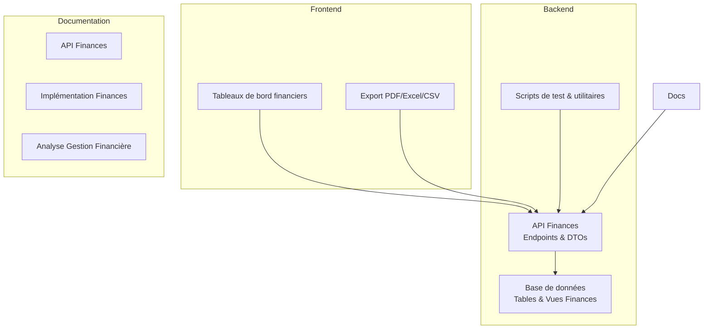
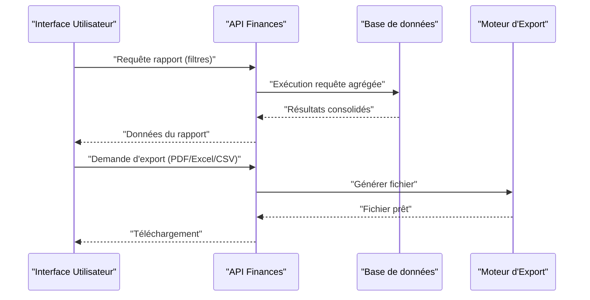
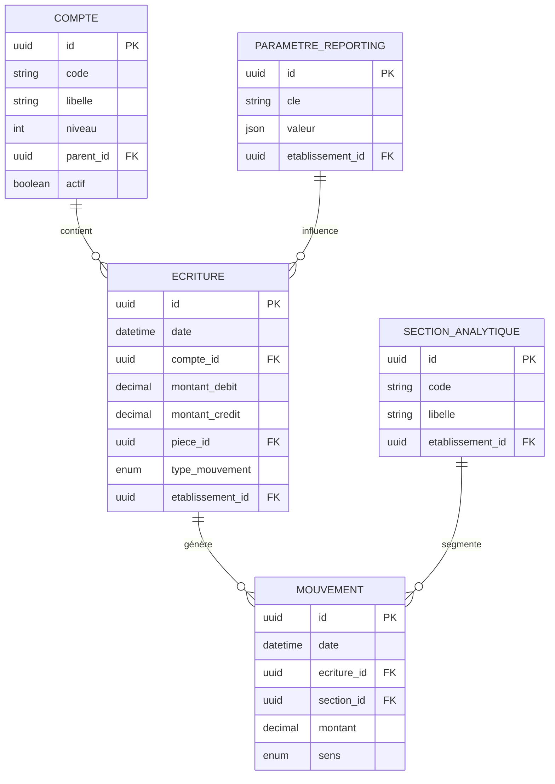
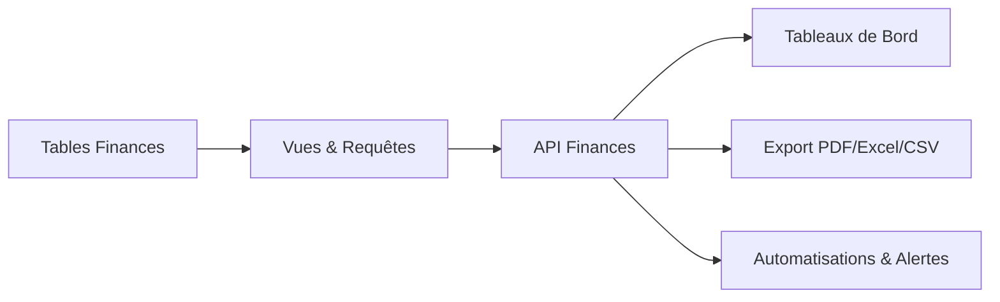

# Rapports et Analyses Financières

<cite>
**Fichiers référencés dans ce document**
- [010-module-finances.sql](file://backend/database/migrations/010-module-finances.sql)
- [011-module-finances-part2.sql](file://backend/database/migrations/011-module-finances-part2.sql)
- [012-module-finances-part3-parametres.sql](file://backend/database/migrations/012-module-finances-part3-parametres.sql)
- [013-module-finances-phase1-granularite.sql](file://backend/database/migrations/013-module-finances-phase1-granularite.sql)
- [014-module-finances-phase2-section.sql](file://backend/database/migrations/014-module-finances-phase2-section.sql)
- [API-FINANCES.md](file://docs/API-FINANCES.md)
- [IMPLEMENTATION-COMPLETE-FINANCES.md](file://docs/implementations/IMPLEMENTATION-COMPLETE-FINANCES.md)
- [ANALYSE-GESTION-FINANCIERE.md](file://docs/analyses/ANALYSE-GESTION-FINANCIERE.md)
- [AMÉLIORATIONS-FINANCES-FINAL.md](file://docs/ameliorations/AMÉLIORATIONS-FINANCES-FINAL.md)
- [RESUME-FINAL-FINANCES.md](file://docs/resumes/RESUME-FINAL-FINANCES.md)
- [test-finance-module.sh](file://scripts/test-finance-module.sh)
</cite>

## Table des matières
1. [Introduction](#introduction)
2. [Structure du projet](#structure-du-projet)
3. [Composants clés](#composants-clés)
4. [Vue d’ensemble de l’architecture](#vue-densemble-de-larchitecture)
5. [Analyse détaillée des composants](#analyse-detallee-des-composants)
6. [Analyse des dépendances](#analyse-des-dependances)
7. [Considérations de performance](#considerations-de-performance)
8. [Guide de dépannage](#guide-de-depannage)
9. [Conclusion](#conclusion)
10. [Annexes](#annexes)

## Introduction
Ce document présente le système de rapports financiers d’eLISAschool : les types de rapports (bilan financier, compte de résultat, trésorerie, recouvrement), les indicateurs clés de performance financière (KPI), les tableaux de bord interactifs, les algorithmes de calcul, les filtres et segments, les formats d’export (PDF, Excel, CSV), les automatisations de génération, les alertes financières configurables, la consolidation multi-établissements, les comparaisons temporelles et les prévisions budgétaires. Il s’appuie sur les migrations de base de données du module finances, la documentation API et les notes d’implémentation disponibles dans le dépôt.

## Structure du projet
Le module finances est principalement défini par un ensemble de migrations SQL qui créent les tables, vues et index nécessaires aux états financiers et au suivi des flux. La documentation API décrit les endpoints exposés pour la lecture et la génération de rapports. Les scripts de test permettent de valider le bon fonctionnement des fonctionnalités financières.

[No sources needed since this diagram shows conceptual workflow, not actual code structure]

## Composants clés
- Modèles de données financiers : comptes, écritures, mouvements, paramètres de reporting, sections analytiques.
- Endpoints API : agrégation des soldes, calcul des indicateurs, export de rapports.
- Moteur de rapports : agrégations SQL, vues matérialisées ou requêtes optimisées, filtres dynamiques.
- Frontend : visualisations, filtres, segments, export.
- Automatisations : tâches planifiées pour la génération périodique de rapports et alertes.

**Section sources**
- [API-FINANCES.md](file://docs/API-FINANCES.md)
- [IMPLEMENTATION-COMPLETE-FINANCES.md](file://docs/implementations/IMPLEMENTATION-COMPLETE-FINANCES.md)
- [ANALYSE-GESTION-FINANCIERE.md](file://docs/analyses/ANALYSE-GESTION-FINANCIERE.md)

## Vue d’ensemble de l’architecture
L’architecture repose sur une couche de persistance structurée via des migrations SQL, une API REST qui expose les données agrégées et un frontend qui consomme ces données pour générer des tableaux de bord et des exports. Les rapports sont construits à partir de vues et d’agrégations sur les tables de comptes et d’écritures, avec des filtres par période, établissement, section analytique et type de mouvement.

[No sources needed since this diagram shows conceptual workflow, not actual code structure]

## Analyse détaillée des composants

### Schéma de données financier
Les migrations définissent les entités fondamentales pour le reporting financier :
- Comptes comptables et hiérarchie
- Écritures et mouvements (débiteur/créditeur)
- Paramètres de reporting et règles d’agrégation
- Sections analytiques et segments
- Index de performance pour les requêtes fréquentes

**Diagram sources**
- [010-module-finances.sql](file://backend/database/migrations/010-module-finances.sql)
- [011-module-finances-part2.sql](file://backend/database/migrations/011-module-finances-part2.sql)
- [012-module-finances-part3-parametres.sql](file://backend/database/migrations/012-module-finances-part3-parametres.sql)
- [013-module-finances-phase1-granularite.sql](file://backend/database/migrations/013-module-finances-phase1-granularite.sql)
- [014-module-finances-phase2-section.sql](file://backend/database/migrations/014-module-finances-phase2-section.sql)

**Section sources**
- [010-module-finances.sql](file://backend/database/migrations/010-module-finances.sql)
- [011-module-finances-part2.sql](file://backend/database/migrations/011-module-finances-part2.sql)
- [012-module-finances-part3-parametres.sql](file://backend/database/migrations/012-module-finances-part3-parametres.sql)
- [013-module-finances-phase1-granularite.sql](file://backend/database/migrations/013-module-finances-phase1-granularite.sql)
- [014-module-finances-phase2-section.sql](file://backend/database/migrations/014-module-finances-phase2-section.sql)

### Types de rapports et algorithmes de calcul
- Bilan financier : solde des comptes actifs à une date donnée, regroupement par classe de compte, vérification de l’équilibre (actif = passif + capitaux propres).
- Compte de résultat : différence entre produits et charges sur une période, calcul du résultat net, ventilation par nature.
- Trésorerie : flux nets de trésorerie (encaissements/décaissements), soldes bancaires et caisse, rapprochements.
- Recouvrement : taux de recouvrement, ancienneté des créances, prévisions de rentrée.

Algorithmes clés :
- Agrégation par compte et période avec sommes conditionnelles.
- Calcul de soldes cumulés et variations.
- Ratios financiers (marge nette, ratio de liquidité, taux de recouvrement).
- Segmentation par établissements, sections analytiques et types de mouvements.

**Section sources**
- [API-FINANCES.md](file://docs/API-FINANCES.md)
- [IMPLEMENTATION-COMPLETE-FINANCES.md](file://docs/implementations/IMPLEMENTATION-COMPLETE-FINANCES.md)
- [ANALYSE-GESTION-FINANCIERE.md](file://docs/analyses/ANALYSE-GESTION-FINANCIERE.md)

### Filtres et segments
Filtres disponibles :
- Période (mois, trimestre, année)
- Établissement (multi-tenant)
- Section analytique
- Type de mouvement (recette, dépense, transfert)
- Compte (code ou famille)
- Pièce comptable (numéro, date)

Segments :
- Par département/fonction
- Par programme/projet
- Par source de financement
- Par nature de transaction

**Section sources**
- [013-module-finances-phase1-granularite.sql](file://backend/database/migrations/013-module-finances-phase1-granularite.sql)
- [014-module-finances-phase2-section.sql](file://backend/database/migrations/014-module-finances-phase2-section.sql)
- [API-FINANCES.md](file://docs/API-FINANCES.md)

### Formats d’export
Formats supportés :
- PDF : rapports imprimables avec en-têtes personnalisés et graphiques intégrés.
- Excel : données tabulaires avec formules et mises en forme conditionnelle.
- CSV : données brutes pour analyses externes.

Processus :
- L’API reçoit la demande d’export avec les filtres.
- Le moteur d’export génère le fichier selon le format demandé.
- Retourne un lien de téléchargement ou un flux binaire.

**Section sources**
- [API-FINANCES.md](file://docs/API-FINANCES.md)
- [IMPLEMENTATION-COMPLETE-FINANCES.md](file://docs/implementations/IMPLEMENTATION-COMPLETE-FINANCES.md)

### Automatisation et alertes
Automatisations :
- Génération périodique de rapports (quotidien, hebdomadaire, mensuel).
- Diffusion par email ou stockage sécurisé.
- Mise à jour de tableaux de bord temps réel.

Alertes financières configurables :
- Dépassement de budget par poste.
- Taux de recouvrement sous seuil.
- Solde de trésorerie critique.
- Anomalies comptables (non-conformité débiteur/créditeur).

**Section sources**
- [IMPLEMENTATION-COMPLETE-FINANCES.md](file://docs/implementations/IMPLEMENTATION-COMPLETE-FINANCES.md)
- [AMÉLIORATIONS-FINANCES-FINAL.md](file://docs/ameliorations/AMÉLIORATIONS-FINANCES-FINAL.md)

### Consolidation multi-établissements
La consolidation permet d’agréger les données financières de plusieurs établissements :
- Regroupement par groupe d’établissements.
- Normalisation des comptes et hiérarchies.
- Suppression des transactions internes au groupe.
- Affichage consolidé et comparatif.

**Section sources**
- [ANALYSE-GESTION-FINANCIERE.md](file://docs/analyses/ANALYSE-GESTION-FINANCIERE.md)
- [IMPLEMENTATION-COMPLETE-FINANCES.md](file://docs/implementations/IMPLEMENTATION-COMPLETE-FINANCES.md)

### Comparaisons temporelles et prévisions budgétaires
Comparaisons :
- Variance entre périodes (mensuelle, annuelle).
- Évolution des soldes et ratios.
- Tendances par segment.

Prévisions :
- Projections basées sur historiques et tendances.
- Scénarios (optimiste, réaliste, pessimiste).
- Intégration avec les budgets votés.

**Section sources**
- [API-FINANCES.md](file://docs/API-FINANCES.md)
- [ANALYSE-GESTION-FINANCIERE.md](file://docs/analyses/ANALYSE-GESTION-FINANCIERE.md)

## Analyse des dépendances
Les rapports dépendent des tables de comptes, d’écritures et de mouvements, ainsi que des paramètres de reporting. L’API orchestre les requêtes et les transformations, tandis que le frontend gonne l’affichage et les exports.

[No sources needed since this diagram shows conceptual workflow, not actual code structure]

**Section sources**
- [010-module-finances.sql](file://backend/database/migrations/010-module-finances.sql)
- [011-module-finances-part2.sql](file://backend/database/migrations/011-module-finances-part2.sql)
- [API-FINANCES.md](file://docs/API-FINANCES.md)

## Considérations de performance
- Indexation des colonnes fréquemment filtrées (date, compte, établissement).
- Utilisation de vues matérialisées pour les agrégations lourdes.
- Pagination et filtrage côté serveur.
- Optimisation des requêtes SQL avec jointures minimales.
- Cache des résultats fréquemment demandés.

**Section sources**
- [013-module-finances-phase1-granularite.sql](file://backend/database/migrations/013-module-finances-phase1-granularite.sql)
- [ANALYSE-GESTION-FINANCIERE.md](file://docs/analyses/ANALYSE-GESTION-FINANCIERE.md)

## Guide de dépannage
Problèmes courants :
- Erreurs d’agrégation : vérifier la cohérence des écritures et la clôture des périodes.
- Performances dégradées : analyser les plans d’exécution et ajouter des index si nécessaire.
- Incohérences de consolidation : vérifier la normalisation des comptes et la suppression des transactions internes.
- Échecs d’export : valider les permissions et les templates d’export.

Outils de diagnostic :
- Scripts de test du module finances.
- Logs d’erreurs API.
- Outils de monitoring des requêtes SQL.

**Section sources**
- [test-finance-module.sh](file://scripts/test-finance-module.sh)
- [API-FINANCES.md](file://docs/API-FINANCES.md)

## Conclusion
Le système de rapports financiers d’eLISAschool offre une architecture robuste et évolutive, permettant de générer des états financiers fiables, des indicateurs pertinents et des tableaux de bord interactifs. Grâce à des filtres avancés, des exports multiples et des automatisations configurables, il répond aux besoins de contrôle de gestion et de pilotage stratégique, y compris la consolidation multi-établissements et les prévisions budgétaires.

## Annexes
- Exemples de rapports personnalisés : combinaisons de filtres et segments pour des analyses ciblées.
- Checklist de validation : vérification des soldes, équilibre comptable et cohérence des flux.
- Références techniques : schéma de base de données, endpoints API et modèles de données.

**Section sources**
- [RESUME-FINAL-FINANCES.md](file://docs/resumes/RESUME-FINAL-FINANCES.md)
- [AMÉLIORATIONS-FINANCES-FINAL.md](file://docs/ameliorations/AMÉLIORATIONS-FINANCES-FINAL.md)