# Système de Paiements

<cite>
**Fichiers référencés dans ce document**
- [backend/src/modules/finances/index.ts](file://backend/src/modules/finances/index.ts)
- [backend/database/migrations/010-module-finances.sql](file://backend/database/migrations/010-module-finances.sql)
- [backend/database/migrations/011-module-finances-part2.sql](file://backend/database/migrations/011-module-finances-part2.sql)
- [backend/database/migrations/012-module-finances-part3-parametres.sql](file://backend/database/migrations/012-module-finances-part3-parametres.sql)
- [backend/database/migrations/013-module-finances-phase1-granularite.sql](file://backend/database/migrations/013-module-finances-phase1-granularite.sql)
- [backend/database/migrations/014-module-finances-phase2-section.sql](file://backend/database/migrations/014-module-finances-phase2-section.sql)
- [backend/database/migrations/049-ameliorations-inscription-finances.sql](file://backend/database/migrations/049-ameliorations-inscription-finances.sql)
- [backend/database/migrations/050-ameliorations-inscription-relances.sql](file://backend/database/migrations/050-ameliorations-inscription-relances.sql)
- [backend/src/modules/finances/controllers/paiement.controller.ts](file://backend/src/modules/finances/controllers/paiement.controller.ts)
- [backend/src/modules/finances/services/paiement.service.ts](file://backend/src/modules/finances/services/paiement.service.ts)
- [backend/src/modules/finances/dto/paiement.dto.ts](file://backend/src/modules/finances/dto/paiement.dto.ts)
- [backend/src/modules/finances/entities/paiement.entity.ts](file://backend/src/modules/finances/entities/paiement.entity.ts)
- [backend/src/modules/finances/providers/mobile-money.provider.ts](file://backend/src/modules/finances/providers/mobile-money.provider.ts)
- [backend/src/modules/finances/providers/carte-bancaire.provider.ts](file://backend/src/modules/finances/providers/carte-bancaire.provider.ts)
- [backend/src/modules/finances/workflows/transaction.workflow.ts](file://backend/src/modules/finances/workflows/transaction.workflow.ts)
- [backend/src/modules/finances/workflows/reliquat.workflow.ts](file://backend/src/modules/finances/workflows/reliquat.workflow.ts)
- [backend/src/modules/finances/workflows/relance.workflow.ts](file://backend/src/modules/finances/workflows/relance.workflow.ts)
- [backend/src/modules/finances/workflows/remboursement.workflow.ts](file://backend/src/modules/finances/workflows/remboursement.workflow.ts)
- [backend/src/modules/finances/workflows/reception-especes.workflow.ts](file://backend/src/modules/finances/workflows/reception-especes.workflow.ts)
- [backend/src/modules/finances/workflows/virement.workflow.ts](file://backend/src/modules/finances/workflows/virement.workflow.ts)
- [backend/src/modules/finances/workflows/generique.workflow.ts](file://backend/src/modules/finances/workflows/generique.workflow.ts)
- [backend/src/modules/finances/utils/validation.ts](file://backend/src/modules/finances/utils/validation.ts)
- [backend/src/modules/finances/utils/securite.ts](file://backend/src/modules/finances/utils/securite.ts)
- [backend/src/modules/finances/reports/trail-comptable.ts](file://backend/src/modules/finances/reports/trail-comptable.ts)
- [backend/src/modules/finances/reports/tresorerie.ts](file://backend/src/modules/finances/reports/tresorerie.ts)
</cite>

## Table des matières
1. [Introduction](#introduction)
2. [Structure du projet](#structure-du-projet)
3. [Composants clés](#composants-clés)
4. [Vue d’ensemble de l’architecture](#vue-densemble-de-larchitecture)
5. [Analyse détaillée des composants](#analyse-detaillee-des-composants)
6. [Analyse des dépendances](#analyse-des-dependances)
7. [Considérations de performance](#considerations-de-performance)
8. [Guide de dépannage](#guide-de-depannage)
9. [Conclusion](#conclusion)
10. [Annexes](#annexes)

## Introduction
Ce document décrit le système de paiements d’eLISAschool : modes de paiement (espèces, virement, mobile money, carte bancaire), workflow complet de transaction, génération automatique des reçus, intégration avec les fournisseurs externes, entités et états de transaction, annulations et remboursements, relances automatiques pour les impayés, règles de validation, sécurité, traçabilité comptable et rapports de trésorerie. Il s’appuie sur le module finances et ses migrations associées.

## Structure du projet
Le système de paiements est implémenté dans le module finances du backend, organisé en couches classiques : contrôleurs, services, DTOs, entités, workflows, providers (fournisseurs de paiement), utilitaires (validation, sécurité) et rapports. Les schémas de base de données sont définis par des migrations SQL.

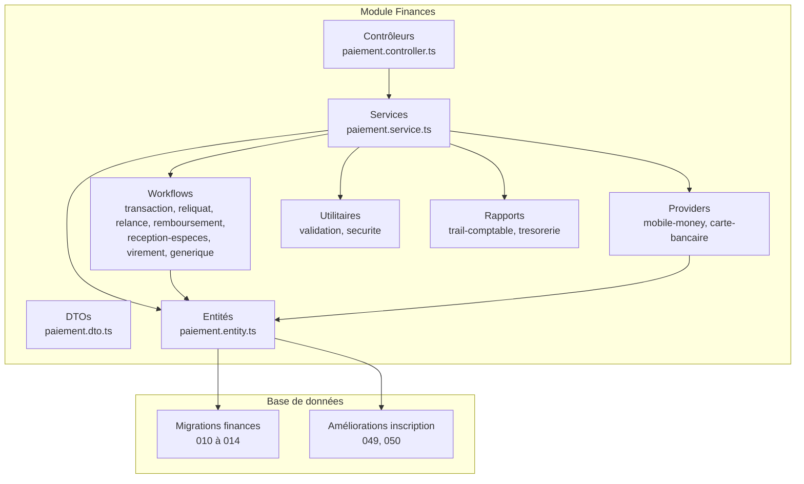

**Sources de diagramme**
- [backend/src/modules/finances/index.ts](file://backend/src/modules/finances/index.ts)
- [backend/database/migrations/010-module-finances.sql](file://backend/database/migrations/010-module-finances.sql)
- [backend/database/migrations/011-module-finances-part2.sql](file://backend/database/migrations/011-module-finances-part2.sql)
- [backend/database/migrations/012-module-finances-part3-parametres.sql](file://backend/database/migrations/012-module-finances-part3-parametres.sql)
- [backend/database/migrations/013-module-finances-phase1-granularite.sql](file://backend/database/migrations/013-module-finances-phase1-granularite.sql)
- [backend/database/migrations/014-module-finances-phase2-section.sql](file://backend/database/migrations/014-module-finances-phase2-section.sql)
- [backend/database/migrations/049-ameliorations-inscription-finances.sql](file://backend/database/migrations/049-ameliorations-inscription-finances.sql)
- [backend/database/migrations/050-ameliorations-inscription-relances.sql](file://backend/database/migrations/050-ameliorations-inscription-relances.sql)

**Sources de section**
- [backend/src/modules/finances/index.ts](file://backend/src/modules/finances/index.ts)

## Composants clés
- Contrôleurs : exposition des endpoints liés aux paiements et orchestration des appels vers les services.
- Services : logique métier des transactions, coordination des workflows et des providers.
- DTOs : contrats de validation et typage des requêtes/réponses.
- Entités : modèles persistés pour les paiements et opérations financières.
- Workflows : séquences d’étapes pour chaque mode de paiement et cas (annulation, remboursement, relance).
- Providers : interfaces d’intégration avec les prestataires (mobile money, cartes bancaires).
- Utilitaires : validation stricte des montants, signatures, horodatages ; sécurisation des flux sensibles.
- Rapports : traçabilité comptable et indicateurs de trésorerie.

**Sources de section**
- [backend/src/modules/finances/controllers/paiement.controller.ts](file://backend/src/modules/finances/controllers/paiement.controller.ts)
- [backend/src/modules/finances/services/paiement.service.ts](file://backend/src/modules/finances/services/paiement.service.ts)
- [backend/src/modules/finances/dto/paiement.dto.ts](file://backend/src/modules/finances/dto/paiement.dto.ts)
- [backend/src/modules/finances/entities/paiement.entity.ts](file://backend/src/modules/finances/entities/paiement.entity.ts)
- [backend/src/modules/finances/providers/mobile-money.provider.ts](file://backend/src/modules/finances/providers/mobile-money.provider.ts)
- [backend/src/modules/finances/providers/carte-bancaire.provider.ts](file://backend/src/modules/finances/providers/carte-bancaire.provider.ts)
- [backend/src/modules/finances/workflows/transaction.workflow.ts](file://backend/src/modules/finances/workflows/transaction.workflow.ts)
- [backend/src/modules/finances/workflows/reliquat.workflow.ts](file://backend/src/modules/finances/workflows/reliquat.workflow.ts)
- [backend/src/modules/finances/workflows/relance.workflow.ts](file://backend/src/modules/finances/workflows/relance.workflow.ts)
- [backend/src/modules/finances/workflows/remboursement.workflow.ts](file://backend/src/modules/finances/workflows/remboursement.workflow.ts)
- [backend/src/modules/finances/workflows/reception-especes.workflow.ts](file://backend/src/modules/finances/workflows/reception-especes.workflow.ts)
- [backend/src/modules/finances/workflows/virement.workflow.ts](file://backend/src/modules/finances/workflows/virement.workflow.ts)
- [backend/src/modules/finances/workflows/generique.workflow.ts](file://backend/src/modules/finances/workflows/generique.workflow.ts)
- [backend/src/modules/finances/utils/validation.ts](file://backend/src/modules/finances/utils/validation.ts)
- [backend/src/modules/finances/utils/securite.ts](file://backend/src/modules/finances/utils/securite.ts)
- [backend/src/modules/finances/reports/trail-comptable.ts](file://backend/src/modules/finances/reports/trail-comptable.ts)
- [backend/src/modules/finances/reports/tresorerie.ts](file://backend/src/modules/finances/reports/tresorerie.ts)

## Vue d’ensemble de l’architecture
Le système suit un pattern contrôleur-service-workflow-provider :
- Le contrôleur reçoit la demande, valide via DTOs et délègue au service.
- Le service choisit le workflow adapté au mode de paiement et coordonne les étapes.
- Les workflows interagissent avec les entités et les providers externes.
- Les utilitaires garantissent la validité et la sécurité des données.
- Les rapports produisent la traçabilité et les indicateurs financiers.

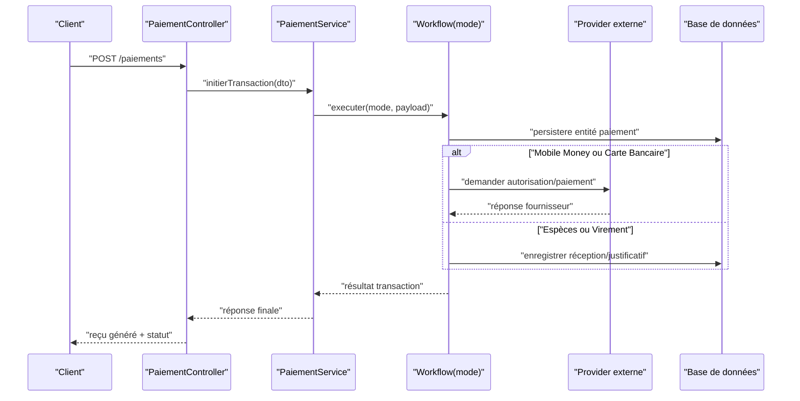

**Sources de diagramme**
- [backend/src/modules/finances/controllers/paiement.controller.ts](file://backend/src/modules/finances/controllers/paiement.controller.ts)
- [backend/src/modules/finances/services/paiement.service.ts](file://backend/src/modules/finances/services/paiement.service.ts)
- [backend/src/modules/finances/workflows/transaction.workflow.ts](file://backend/src/modules/finances/workflows/transaction.workflow.ts)
- [backend/src/modules/finances/providers/mobile-money.provider.ts](file://backend/src/modules/finances/providers/mobile-money.provider.ts)
- [backend/src/modules/finances/providers/carte-bancaire.provider.ts](file://backend/src/modules/finances/providers/carte-bancaire.provider.ts)

## Analyse détaillée des composants

### Entités et schémas financiers
Les entités de paiement modélisent les transactions, leurs détails, statuts, références externes et pièces justificatives. Les migrations définissent les tables, relations et contraintes assurant l’intégrité financière.

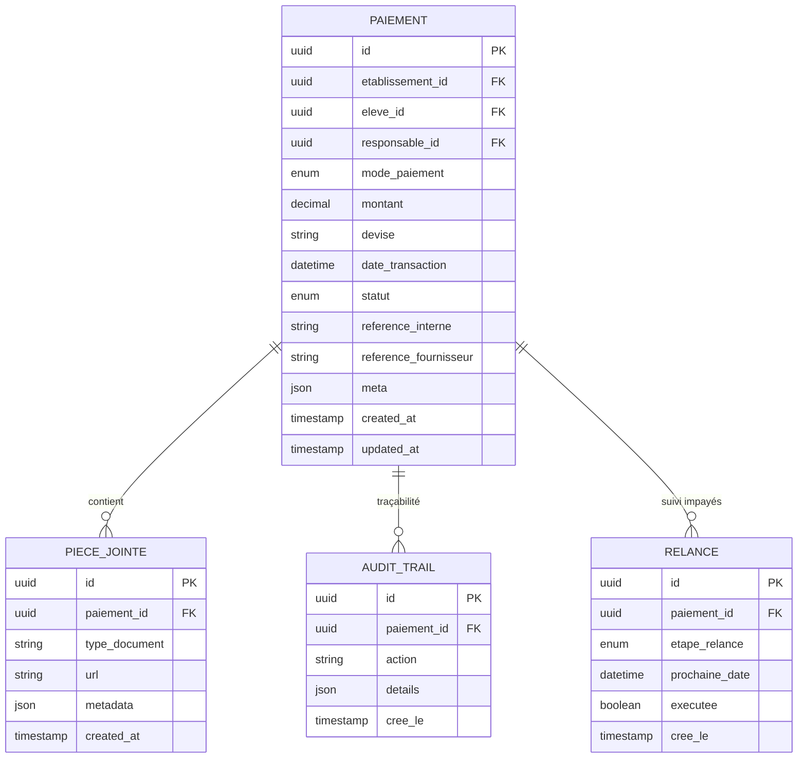

**Sources de diagramme**
- [backend/database/migrations/010-module-finances.sql](file://backend/database/migrations/010-module-finances.sql)
- [backend/database/migrations/011-module-finances-part2.sql](file://backend/database/migrations/011-module-finances-part2.sql)
- [backend/database/migrations/012-module-finances-part3-parametres.sql](file://backend/database/migrations/012-module-finances-part3-parametres.sql)
- [backend/database/migrations/013-module-finances-phase1-granularite.sql](file://backend/database/migrations/013-module-finances-phase1-granularite.sql)
- [backend/database/migrations/014-module-finances-phase2-section.sql](file://backend/database/migrations/014-module-finances-phase2-section.sql)
- [backend/database/migrations/049-ameliorations-inscription-finances.sql](file://backend/database/migrations/049-ameliorations-inscription-finances.sql)
- [backend/database/migrations/050-ameliorations-inscription-relances.sql](file://backend/database/migrations/050-ameliorations-inscription-relances.sql)

**Sources de section**
- [backend/src/modules/finances/entities/paiement.entity.ts](file://backend/src/modules/finances/entities/paiement.entity.ts)
- [backend/database/migrations/010-module-finances.sql](file://backend/database/migrations/010-module-finances.sql)
- [backend/database/migrations/011-module-finances-part2.sql](file://backend/database/migrations/011-module-finances-part2.sql)
- [backend/database/migrations/012-module-finances-part3-parametres.sql](file://backend/database/migrations/012-module-finances-part3-parametres.sql)
- [backend/database/migrations/013-module-finances-phase1-granularite.sql](file://backend/database/migrations/013-module-finances-phase1-granularite.sql)
- [backend/database/migrations/014-module-finances-phase2-section.sql](file://backend/database/migrations/014-module-finances-phase2-section.sql)
- [backend/database/migrations/049-ameliorations-inscription-finances.sql](file://backend/database/migrations/049-ameliorations-inscription-finances.sql)
- [backend/database/migrations/050-ameliorations-inscription-relances.sql](file://backend/database/migrations/050-ameliorations-inscription-relances.sql)

### Modes de paiement et workflows
Chaque mode de paiement possède un workflow dédié qui gère les étapes spécifiques, la persistance, la génération de reçu et les interactions avec les fournisseurs externes.

- Espèces : réception manuelle, enregistrement de pièce justificative, validation interne.
- Virement : enregistrement de référence bancaire, vérification de correspondance, confirmation après rapprochement.
- Mobile Money : initiation via provider, attente de callback, confirmation et émission de reçu.
- Carte bancaire : initiation via provider, gestion des erreurs réseau, confirmation et émission de reçu.

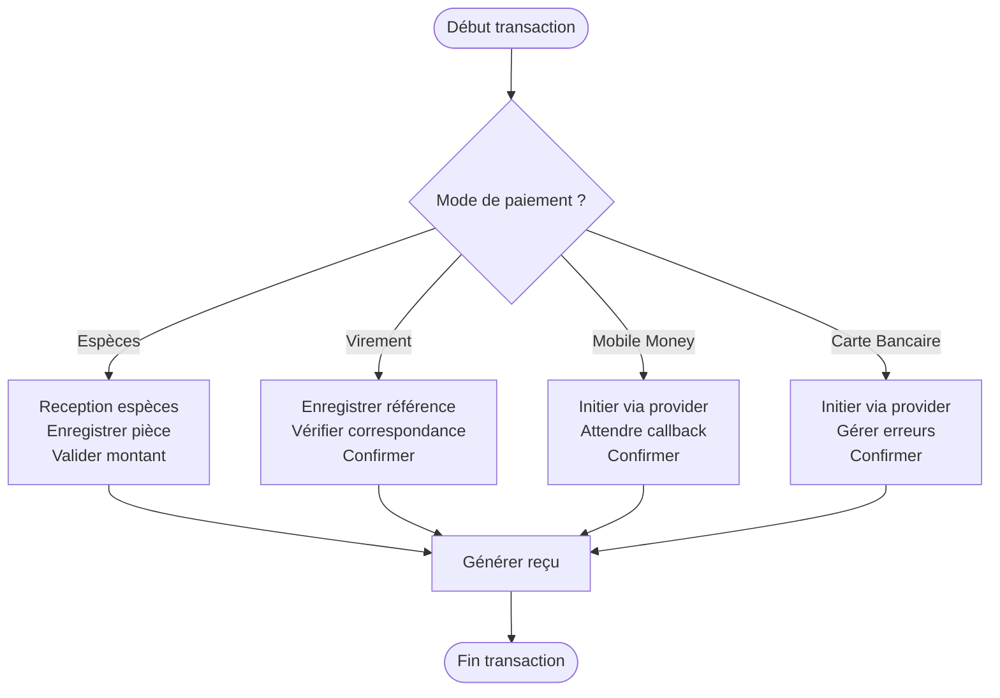

**Sources de diagramme**
- [backend/src/modules/finances/workflows/reception-especes.workflow.ts](file://backend/src/modules/finances/workflows/reception-especes.workflow.ts)
- [backend/src/modules/finances/workflows/virement.workflow.ts](file://backend/src/modules/finances/workflows/virement.workflow.ts)
- [backend/src/modules/finances/workflows/transaction.workflow.ts](file://backend/src/modules/finances/workflows/transaction.workflow.ts)
- [backend/src/modules/finances/providers/mobile-money.provider.ts](file://backend/src/modules/finances/providers/mobile-money.provider.ts)
- [backend/src/modules/finances/providers/carte-bancaire.provider.ts](file://backend/src/modules/finances/providers/carte-bancaire.provider.ts)

**Sources de section**
- [backend/src/modules/finances/workflows/reception-especes.workflow.ts](file://backend/src/modules/finances/workflows/reception-especes.workflow.ts)
- [backend/src/modules/finances/workflows/virement.workflow.ts](file://backend/src/modules/finances/workflows/virement.workflow.ts)
- [backend/src/modules/finances/workflows/transaction.workflow.ts](file://backend/src/modules/finances/workflows/transaction.workflow.ts)
- [backend/src/modules/finances/providers/mobile-money.provider.ts](file://backend/src/modules/finances/providers/mobile-money.provider.ts)
- [backend/src/modules/finances/providers/carte-bancaire.provider.ts](file://backend/src/modules/finances/providers/carte-bancaire.provider.ts)

### Annulations et remboursements
Les workflows d’annulation et remboursement assurent la cohérence comptable et la traçabilité complète.

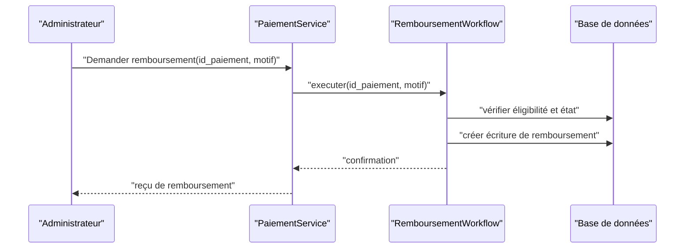

**Sources de diagramme**
- [backend/src/modules/finances/workflows/remboursement.workflow.ts](file://backend/src/modules/finances/workflows/remboursement.workflow.ts)
- [backend/src/modules/finances/services/paiement.service.ts](file://backend/src/modules/finances/services/paiement.service.ts)

**Sources de section**
- [backend/src/modules/finances/workflows/remboursement.workflow.ts](file://backend/src/modules/finances/workflows/remboursement.workflow.ts)
- [backend/src/modules/finances/services/paiement.service.ts](file://backend/src/modules/finances/services/paiement.service.ts)

### Relances automatiques pour impayés
Le système planifie et exécute des relances selon des règles configurables, avec suivi d’exécution et historique.

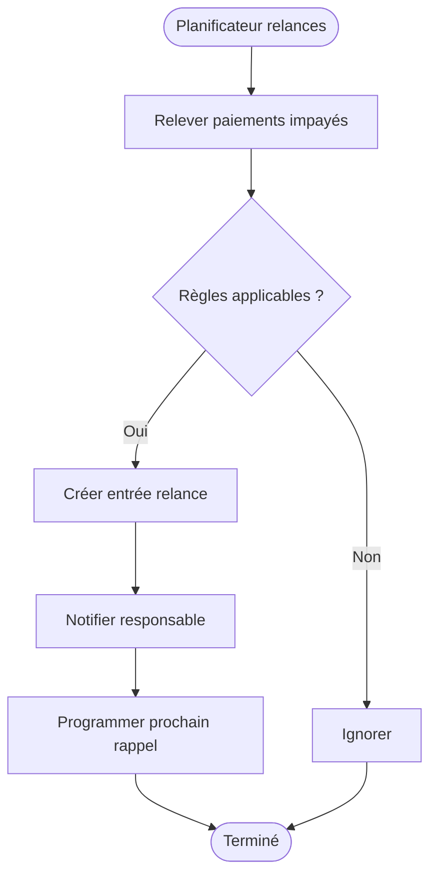

**Sources de diagramme**
- [backend/src/modules/finances/workflows/relance.workflow.ts](file://backend/src/modules/finances/workflows/relance.workflow.ts)
- [backend/database/migrations/050-ameliorations-inscription-relances.sql](file://backend/database/migrations/050-ameliorations-inscription-relances.sql)

**Sources de section**
- [backend/src/modules/finances/workflows/relance.workflow.ts](file://backend/src/modules/finances/workflows/relance.workflow.ts)
- [backend/database/migrations/050-ameliorations-inscription-relances.sql](file://backend/database/migrations/050-ameliorations-inscription-relances.sql)

### Génération automatique des reçus
La génération de reçus est intégrée aux workflows de paiement et de remboursement, incluant métadonnées, signature numérique et archivage.

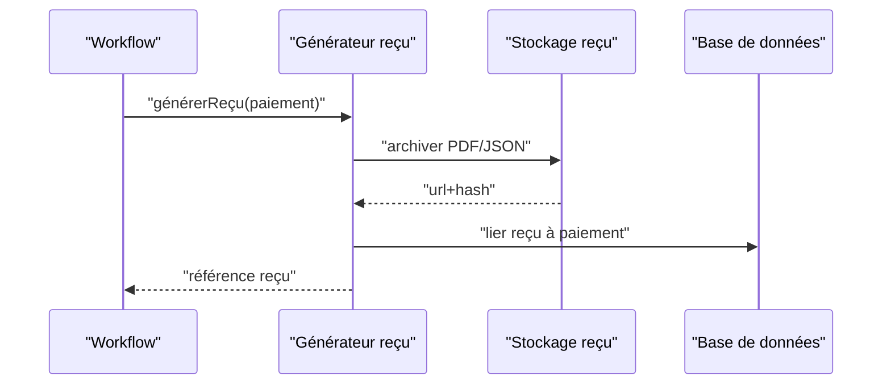

**Sources de diagramme**
- [backend/src/modules/finances/workflows/generique.workflow.ts](file://backend/src/modules/finances/workflows/generique.workflow.ts)
- [backend/src/modules/finances/workflows/transaction.workflow.ts](file://backend/src/modules/finances/workflows/transaction.workflow.ts)

**Sources de section**
- [backend/src/modules/finances/workflows/generique.workflow.ts](file://backend/src/modules/finances/workflows/generique.workflow.ts)
- [backend/src/modules/finances/workflows/transaction.workflow.ts](file://backend/src/modules/finances/workflows/transaction.workflow.ts)

### Intégration API avec fournisseurs
Les providers encapsulent les appels aux prestataires (mobile money, cartes bancaires), gèrent les erreurs, timeouts et callbacks.

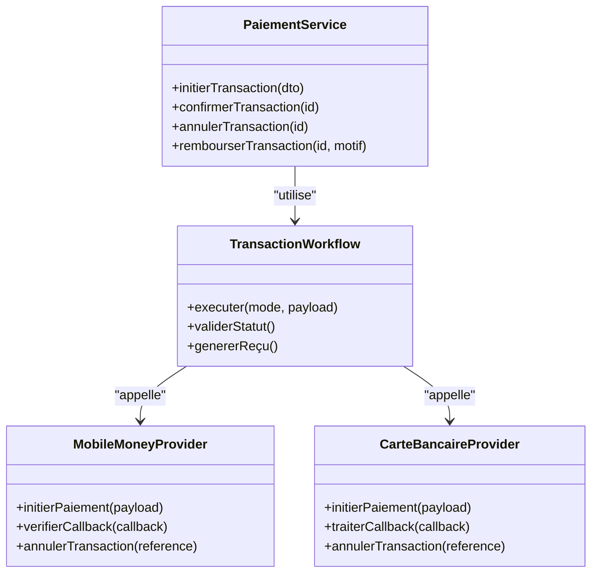

**Sources de diagramme**
- [backend/src/modules/finances/services/paiement.service.ts](file://backend/src/modules/finances/services/paiement.service.ts)
- [backend/src/modules/finances/workflows/transaction.workflow.ts](file://backend/src/modules/finances/workflows/transaction.workflow.ts)
- [backend/src/modules/finances/providers/mobile-money.provider.ts](file://backend/src/modules/finances/providers/mobile-money.provider.ts)
- [backend/src/modules/finances/providers/carte-bancaire.provider.ts](file://backend/src/modules/finances/providers/carte-bancaire.provider.ts)

**Sources de section**
- [backend/src/modules/finances/services/paiement.service.ts](file://backend/src/modules/finances/services/paiement.service.ts)
- [backend/src/modules/finances/workflows/transaction.workflow.ts](file://backend/src/modules/finances/workflows/transaction.workflow.ts)
- [backend/src/modules/finances/providers/mobile-money.provider.ts](file://backend/src/modules/finances/providers/mobile-money.provider.ts)
- [backend/src/modules/finances/providers/carte-bancaire.provider.ts](file://backend/src/modules/finances/providers/carte-bancaire.provider.ts)

### Règles de validation des transactions
Les validations portent sur les montants, devises, identifiants obligatoires, cohérence des statuts et signatures numériques.

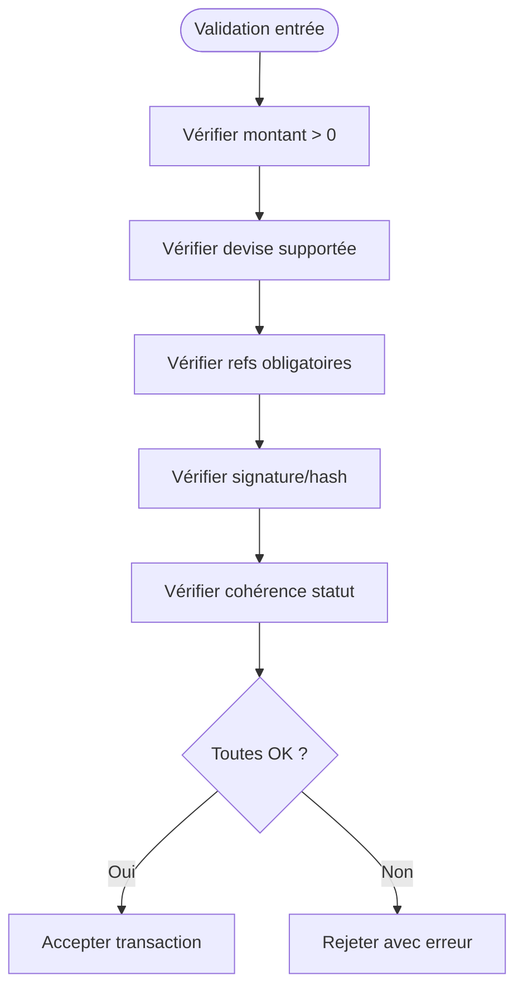

**Sources de diagramme**
- [backend/src/modules/finances/utils/validation.ts](file://backend/src/modules/finances/utils/validation.ts)
- [backend/src/modules/finances/dto/paiement.dto.ts](file://backend/src/modules/finances/dto/paiement.dto.ts)

**Sources de section**
- [backend/src/modules/finances/utils/validation.ts](file://backend/src/modules/finances/utils/validation.ts)
- [backend/src/modules/finances/dto/paiement.dto.ts](file://backend/src/modules/finances/dto/paiement.dto.ts)

### Sécurité des paiements
Sécurisation des flux sensibles, contrôle d’accès, journalisation d’audit et protection contre les attaques courantes.

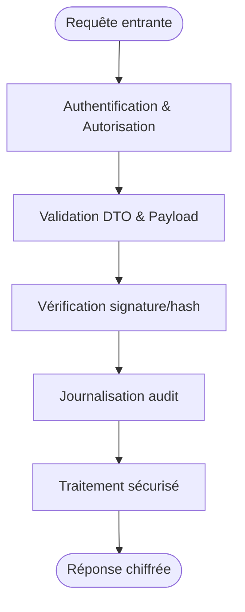

**Sources de diagramme**
- [backend/src/modules/finances/utils/securite.ts](file://backend/src/modules/finances/utils/securite.ts)
- [backend/src/modules/finances/controllers/paiement.controller.ts](file://backend/src/modules/finances/controllers/paiement.controller.ts)

**Sources de section**
- [backend/src/modules/finances/utils/securite.ts](file://backend/src/modules/finances/utils/securite.ts)
- [backend/src/modules/finances/controllers/paiement.controller.ts](file://backend/src/modules/finances/controllers/paiement.controller.ts)

### Traçabilité comptable et rapports de trésorerie
Le système produit un trail comptable complet et des rapports de trésorerie pour pilotage financier.

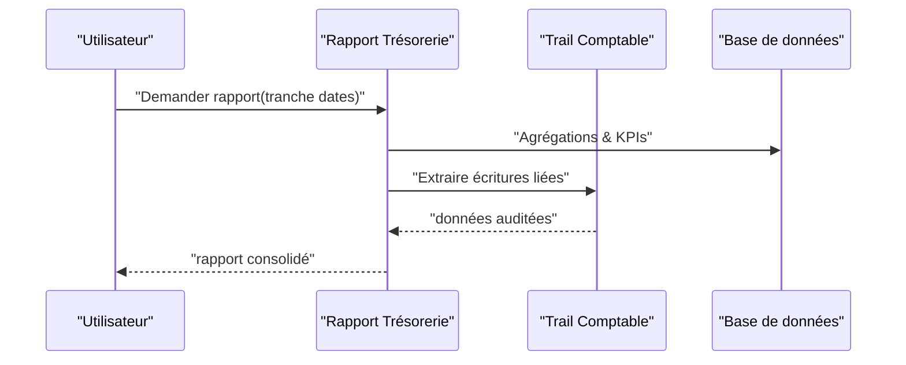

**Sources de diagramme**
- [backend/src/modules/finances/reports/tresorerie.ts](file://backend/src/modules/finances/reports/tresorerie.ts)
- [backend/src/modules/finances/reports/trail-comptable.ts](file://backend/src/modules/finances/reports/trail-comptable.ts)

**Sources de section**
- [backend/src/modules/finances/reports/tresorerie.ts](file://backend/src/modules/finances/reports/tresorerie.ts)
- [backend/src/modules/finances/reports/trail-comptable.ts](file://backend/src/modules/finances/reports/trail-comptable.ts)

## Analyse des dépendances
Le module finances dépend fortement des migrations SQL pour la structure de données, des DTOs pour la validation, des utilitaires pour la sécurité et de providers externes pour les paiements électroniques.

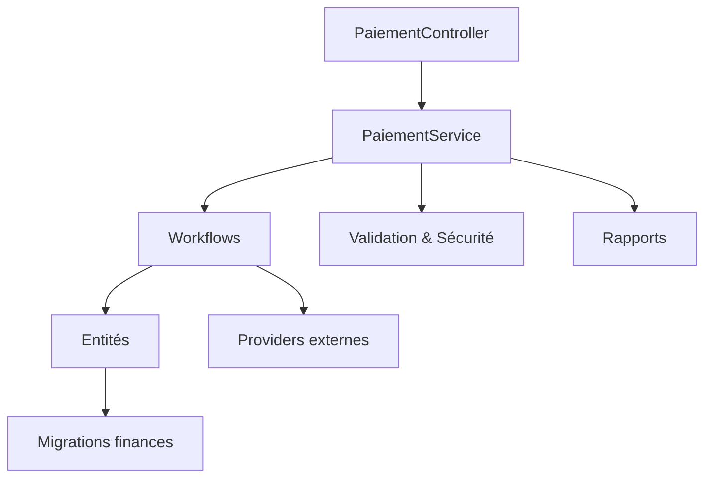

**Sources de diagramme**
- [backend/src/modules/finances/controllers/paiement.controller.ts](file://backend/src/modules/finances/controllers/paiement.controller.ts)
- [backend/src/modules/finances/services/paiement.service.ts](file://backend/src/modules/finances/services/paiement.service.ts)
- [backend/src/modules/finances/workflows/transaction.workflow.ts](file://backend/src/modules/finances/workflows/transaction.workflow.ts)
- [backend/src/modules/finances/entities/paiement.entity.ts](file://backend/src/modules/finances/entities/paiement.entity.ts)
- [backend/src/modules/finances/providers/mobile-money.provider.ts](file://backend/src/modules/finances/providers/mobile-money.provider.ts)
- [backend/src/modules/finances/providers/carte-bancaire.provider.ts](file://backend/src/modules/finances/providers/carte-bancaire.provider.ts)
- [backend/src/modules/finances/utils/validation.ts](file://backend/src/modules/finances/utils/validation.ts)
- [backend/src/modules/finances/utils/securite.ts](file://backend/src/modules/finances/utils/securite.ts)
- [backend/src/modules/finances/reports/tresorerie.ts](file://backend/src/modules/finances/reports/tresorerie.ts)
- [backend/src/modules/finances/reports/trail-comptable.ts](file://backend/src/modules/finances/reports/trail-comptable.ts)
- [backend/database/migrations/010-module-finances.sql](file://backend/database/migrations/010-module-finances.sql)

**Sources de section**
- [backend/src/modules/finances/index.ts](file://backend/src/modules/finances/index.ts)

## Considérations de performance
- Indexation des colonnes fréquentes (statut, date_transaction, reference_fournisseur).
- Mise en cache des configurations de providers et paramètres de relance.
- Traitement asynchrone des callbacks fournisseurs et envoi de notifications.
- Agrégations optimisées pour les rapports de trésorerie.

[Section sans sources spécifiques]

## Guide de dépannage
- Erreurs de validation : vérifier DTOs et règles de validation.
- Échecs fournisseurs : examiner logs de provider, timeouts et callbacks.
- Incohérences de statut : consulter trail comptable et audits.
- Problèmes de relances : vérifier planifications et règles applicables.

**Sources de section**
- [backend/src/modules/finances/utils/validation.ts](file://backend/src/modules/finances/utils/validation.ts)
- [backend/src/modules/finances/reports/trail-comptable.ts](file://backend/src/modules/finances/reports/trail-comptable.ts)
- [backend/src/modules/finances/workflows/relance.workflow.ts](file://backend/src/modules/finances/workflows/relance.workflow.ts)

## Conclusion
Le système de paiements d’eLISAschool offre une architecture modulaire et robuste, couvrant tous les modes de paiement, la génération de reçus, l’intégration avec des fournisseurs externes, la traçabilité comptable et les rapports de trésorerie. La modularité des workflows et la rigueur des validations et de la sécurité permettent une gestion fiable et évolutive des transactions financières.

[Section sans sources spécifiques]

## Annexes
- Exemples d’intégration API : utiliser les contrôleurs et DTOs comme points d’entrée.
- Schémas de base de données : se référer aux migrations 010 à 014 et améliorations 049, 050.
- Règles de validation : consulter utilitaires et DTOs dédiés.
- Sécurité : appliquer les bonnes pratiques des utilitaires de sécurité.

**Sources de section**
- [backend/database/migrations/010-module-finances.sql](file://backend/database/migrations/010-module-finances.sql)
- [backend/database/migrations/011-module-finances-part2.sql](file://backend/database/migrations/011-module-finances-part2.sql)
- [backend/database/migrations/012-module-finances-part3-parametres.sql](file://backend/database/migrations/012-module-finances-part3-parametres.sql)
- [backend/database/migrations/013-module-finances-phase1-granularite.sql](file://backend/database/migrations/013-module-finances-phase1-granularite.sql)
- [backend/database/migrations/014-module-finances-phase2-section.sql](file://backend/database/migrations/014-module-finances-phase2-section.sql)
- [backend/database/migrations/049-ameliorations-inscription-finances.sql](file://backend/database/migrations/049-ameliorations-inscription-finances.sql)
- [backend/database/migrations/050-ameliorations-inscription-relances.sql](file://backend/database/migrations/050-ameliorations-inscription-relances.sql)
- [backend/src/modules/finances/dto/paiement.dto.ts](file://backend/src/modules/finances/dto/paiement.dto.ts)
- [backend/src/modules/finances/utils/validation.ts](file://backend/src/modules/finances/utils/validation.ts)
- [backend/src/modules/finances/utils/securite.ts](file://backend/src/modules/finances/utils/securite.ts)