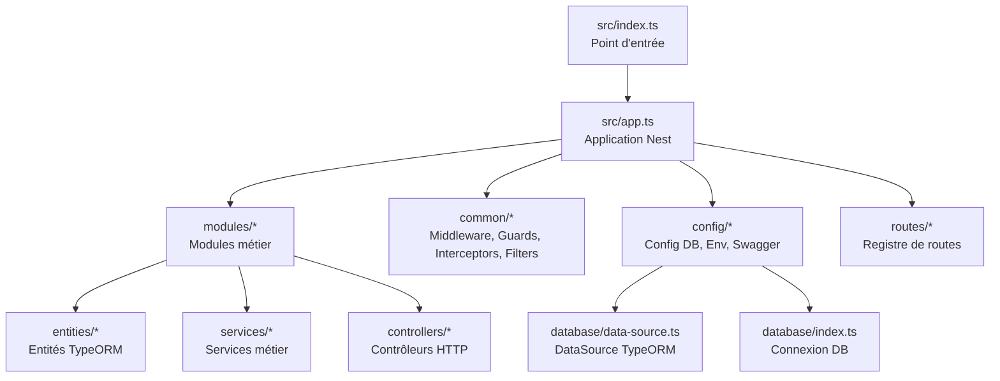
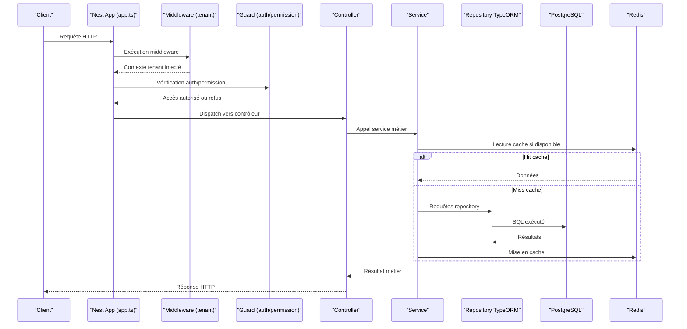
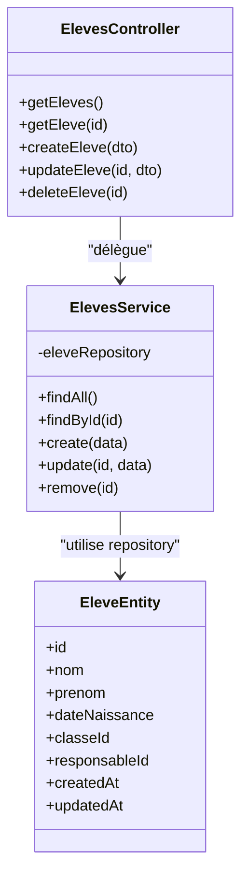
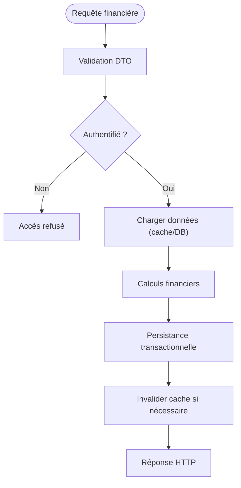
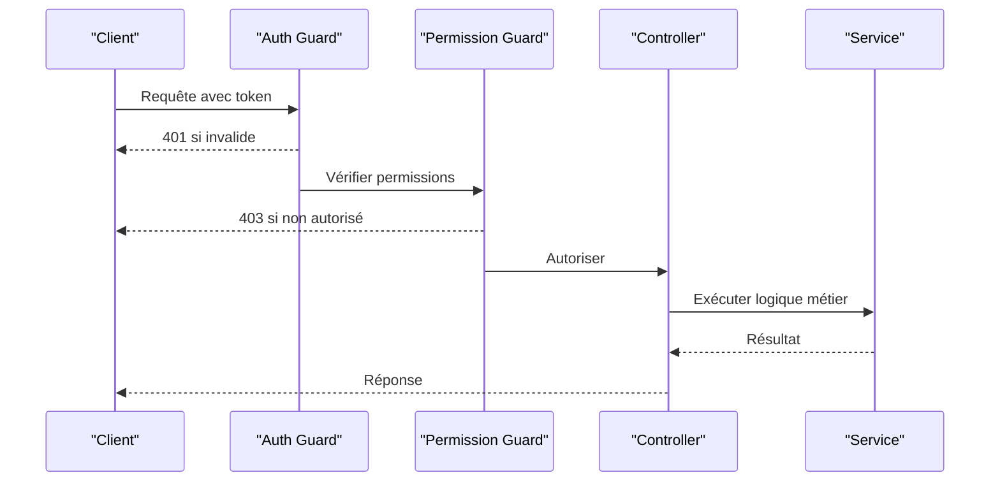
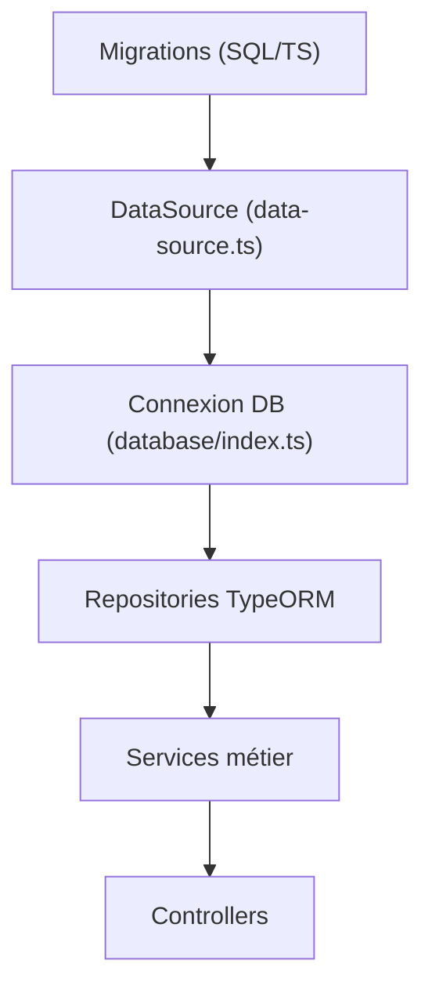
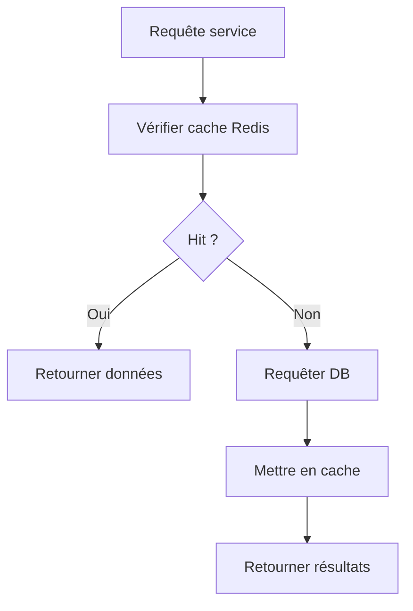
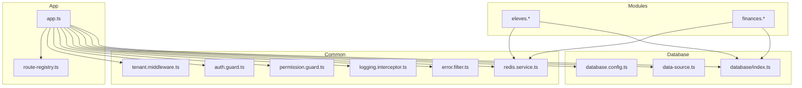

# Architecture Backend NestJS

<cite>
**Fichiers référencés dans ce document**
- [app.ts](file://backend/src/app.ts)
- [index.ts](file://backend/src/index.ts)
- [database.config.ts](file://backend/src/config/database.config.ts)
- [env.config.ts](file://backend/src/config/env.config.ts)
- [swagger.config.ts](file://backend/src/config/swagger.config.ts)
- [data-source.ts](file://backend/src/database/data-source.ts)
- [index.ts](file://backend/src/database/index.ts)
- [route-registry.ts](file://backend/src/routes/route-registry.ts)
- [eleves.module.ts](file://backend/src/modules/eleves/eleves.module.ts)
- [eleves.controller.ts](file://backend/src/modules/eleves/controllers/eleves.controller.ts)
- [eleves.service.ts](file://backend/src/modules/eleves/services/eleves.service.ts)
- [eleve.entity.ts](file://backend/src/modules/eleves/entities/eleve.entity.ts)
- [finances.module.ts](file://backend/src/modules/finances/finances.module.ts)
- [finances.controller.ts](file://backend/src/modules/finances/controllers/finances.controller.ts)
- [finances.service.ts](file://backend/src/modules/finances/services/finances.service.ts)
- [auth.guard.ts](file://backend/src/modules/auth/guards/auth.guard.ts)
- [tenant.middleware.ts](file://backend/src/common/middlewares/tenant.middleware.ts)
- [permission.guard.ts](file://backend/src/modules/rbac/guards/permission.guard.ts)
- [logging.interceptor.ts](file://backend/src/common/interceptors/logging.interceptor.ts)
- [error.filter.ts](file://backend/src/common/filters/error.filter.ts)
- [redis.service.ts](file://backend/src/common/services/redis.service.ts)
- [package.json](file://backend/package.json)
</cite>

## Table des matières
1. [Introduction](#introduction)
2. [Structure du projet](#structure-du-projet)
3. [Composants clés](#composants-clés)
4. [Vue d'ensemble de l'architecture](#vue-densemble-de-larchitecture)
5. [Analyse détaillée des composants](#analyse-detaillee-des-composants)
6. [Analyse des dépendances](#analyse-des-dependances)
7. [Considérations de performance](#considerations-de-performance)
8. [Guide de dépannage](#guide-de-depannage)
9. [Conclusion](#conclusion)
10. [Annexes](#annexes)

## Introduction
Ce document présente l’architecture backend NestJS d’eLISAschool, en mettant l’accent sur la modularité par domaines (eleves, finances, personnel, etc.), la structure MVC (controllers, services, entities), et les patterns de conception employés (Repository Pattern via TypeORM, Service Layer, DTOs). Il décrit le système de middleware (authentification, tenant, permissions), les intercepteurs, guards et filtres d’erreurs, ainsi que l’intégration TypeORM avec PostgreSQL, le système de migrations, et les stratégies de mise en cache Redis. Des exemples concrets illustrent la création de modules, de services réutilisables et d’entités avec relations. La configuration centralisée, le logging et les bonnes pratiques sont également abordés.

## Structure du projet
Le backend suit une architecture modulaire où chaque domaine métier est encapsulé dans un module NestJS contenant ses propres controllers, services, entités et DTOs. Les fonctionnalités transversales (middleware, intercepteurs, guards, filtres, utilitaires) sont regroupées dans common. La configuration (base de données, variables d’environnement, Swagger) est centralisée. Le registre de routes permet de regrouper les chemins API.

**Sources de diagramme**
- [index.ts](file://backend/src/index.ts)
- [app.ts](file://backend/src/app.ts)
- [data-source.ts](file://backend/src/database/data-source.ts)
- [index.ts](file://backend/src/database/index.ts)
- [route-registry.ts](file://backend/src/routes/route-registry.ts)

**Sources de section**
- [package.json](file://backend/package.json)

## Composants clés
- Modules métier: eleves, finances, personnel, rbac, notifications, etc., chacun avec son controller, service et entités.
- Couche de service: logique métier, accès aux données via repositories TypeORM, orchestration de transactions.
- Contrôleurs: exposition des endpoints REST, validation des entrées via DTOs.
- Entités: modèles de données avec décorateurs TypeORM, relations et index.
- Middleware: authentification, contexte multi-tenant, injection de requêtes spécifiques.
- Guards: autorisation basée sur RBAC/permissions.
- Intercepteurs: logging, métriques, transformation de réponses.
- Filtres d’erreurs: gestion globale des exceptions, formatage de réponses d’erreur.
- Configuration: base de données, variables d’environnement, documentation API.
- Cache: service Redis pour mises en cache de lectures fréquentes.

**Sources de section**
- [eleves.module.ts](file://backend/src/modules/eleves/eleves.module.ts)
- [finances.module.ts](file://backend/src/modules/finances/finances.module.ts)
- [auth.guard.ts](file://backend/src/modules/auth/guards/auth.guard.ts)
- [tenant.middleware.ts](file://backend/src/common/middlewares/tenant.middleware.ts)
- [permission.guard.ts](file://backend/src/modules/rbac/guards/permission.guard.ts)
- [logging.interceptor.ts](file://backend/src/common/interceptors/logging.interceptor.ts)
- [error.filter.ts](file://backend/src/common/filters/error.filter.ts)
- [redis.service.ts](file://backend/src/common/services/redis.service.ts)
- [database.config.ts](file://backend/src/config/database.config.ts)
- [env.config.ts](file://backend/src/config/env.config.ts)
- [swagger.config.ts](file://backend/src/config/swagger.config.ts)

## Vue d'ensemble de l'architecture
L’application NestJS démarre via index.ts, qui instancie l’application Nest dans app.ts. Ce dernier charge la configuration, enregistre les modules, applique les middlewares globaux, configure les guards, intercepteurs et filtres, puis expose les routes définies dans le registre. TypeORM se connecte via data-source.ts et index.ts, exposant des repositories à travers les services. Redis est utilisé comme cache global via un service dédié.

**Sources de diagramme**
- [app.ts](file://backend/src/app.ts)
- [tenant.middleware.ts](file://backend/src/common/middlewares/tenant.middleware.ts)
- [auth.guard.ts](file://backend/src/modules/auth/guards/auth.guard.ts)
- [permission.guard.ts](file://backend/src/modules/rbac/guards/permission.guard.ts)
- [eleves.controller.ts](file://backend/src/modules/eleves/controllers/eleves.controller.ts)
- [eleves.service.ts](file://backend/src/modules/eleves/services/eleves.service.ts)
- [data-source.ts](file://backend/src/database/data-source.ts)
- [redis.service.ts](file://backend/src/common/services/redis.service.ts)

## Analyse détaillée des composants

### Module Eleves (exemple de module métier)
- Controller: définit les endpoints CRUD pour les élèves, valide les DTOs, délègue au service.
- Service: implémente la logique métier, utilise le repository TypeORM, gère les transactions et la cohérence des données.
- Entity: modèle élève avec champs, relations (responsable, classe, suivi), index et contraintes.
- Module: enregistre controller, service, entités et providers nécessaires.

**Sources de diagramme**
- [eleves.controller.ts](file://backend/src/modules/eleves/controllers/eleves.controller.ts)
- [eleves.service.ts](file://backend/src/modules/eleves/services/eleves.service.ts)
- [eleve.entity.ts](file://backend/src/modules/eleves/entities/eleve.entity.ts)

**Sources de section**
- [eleves.module.ts](file://backend/src/modules/eleves/eleves.module.ts)
- [eleves.controller.ts](file://backend/src/modules/eleves/controllers/eleves.controller.ts)
- [eleves.service.ts](file://backend/src/modules/eleves/services/eleves.service.ts)
- [eleve.entity.ts](file://backend/src/modules/eleves/entities/eleve.entity.ts)

### Module Finances (exemple de module financier)
- Controller: expose les opérations de frais, paiements, remises.
- Service: orchestre les calculs financiers, validations, intégration avec le module eleves/responsables.
- Entités: tables liées aux transactions financières, états, périodes.

**Sources de diagramme**
- [finances.controller.ts](file://backend/src/modules/finances/controllers/finances.controller.ts)
- [finances.service.ts](file://backend/src/modules/finances/services/finances.service.ts)

**Sources de section**
- [finances.module.ts](file://backend/src/modules/finances/finances.module.ts)
- [finances.controller.ts](file://backend/src/modules/finances/controllers/finances.controller.ts)
- [finances.service.ts](file://backend/src/modules/finances/services/finances.service.ts)

### Système d’authentification et autorisation
- Guard d’authentification: vérifie le token JWT, extrait l’utilisateur et le contexte.
- Guard de permission: vérifie les permissions RBAC associées au rôle/utilisateur.
- Middleware tenant: injecte le contexte d’établissement pour le multi-tenant.

**Sources de diagramme**
- [auth.guard.ts](file://backend/src/modules/auth/guards/auth.guard.ts)
- [permission.guard.ts](file://backend/src/modules/rbac/guards/permission.guard.ts)

**Sources de section**
- [auth.guard.ts](file://backend/src/modules/auth/guards/auth.guard.ts)
- [permission.guard.ts](file://backend/src/modules/rbac/guards/permission.guard.ts)
- [tenant.middleware.ts](file://backend/src/common/middlewares/tenant.middleware.ts)

### Intégration TypeORM et PostgreSQL
- DataSource: configuration de la connexion, synchronisation, migrations.
- Index.ts: export des connexions et repositories.
- Migrations: scripts SQL/TS pour évolution du schéma.

**Sources de diagramme**
- [data-source.ts](file://backend/src/database/data-source.ts)
- [index.ts](file://backend/src/database/index.ts)

**Sources de section**
- [database.config.ts](file://backend/src/config/database.config.ts)
- [data-source.ts](file://backend/src/database/data-source.ts)
- [index.ts](file://backend/src/database/index.ts)

### Stratégies de caching Redis
- Service Redis: connexion, lecture/écriture, invalidation, TTL.
- Utilisation dans les services: cache-first, fallback DB, invalidation après écriture.

**Sources de diagramme**
- [redis.service.ts](file://backend/src/common/services/redis.service.ts)

**Sources de section**
- [redis.service.ts](file://backend/src/common/services/redis.service.ts)

### Configuration centralisée et documentation API
- Config DB: paramètres de connexion, pool, options.
- Env: chargement des variables d’environnement.
- Swagger: génération de la documentation API.

**Sources de section**
- [database.config.ts](file://backend/src/config/database.config.ts)
- [env.config.ts](file://backend/src/config/env.config.ts)
- [swagger.config.ts](file://backend/src/config/swagger.config.ts)

### Logging et monitoring
- Intercepteur logging: capture des requêtes, temps de réponse, erreurs.
- Filtre d’erreurs: normalisation des réponses d’erreur, traçabilité.

**Sources de section**
- [logging.interceptor.ts](file://backend/src/common/interceptors/logging.interceptor.ts)
- [error.filter.ts](file://backend/src/common/filters/error.filter.ts)

## Analyse des dépendances
Les modules dépendent des providers communs (guards, middlewares, services). Les controllers dépendent des services; les services dépendent des repositories TypeORM et du service Redis. La configuration est injectée via des providers globaux.

**Sources de diagramme**
- [app.ts](file://backend/src/app.ts)
- [route-registry.ts](file://backend/src/routes/route-registry.ts)
- [tenant.middleware.ts](file://backend/src/common/middlewares/tenant.middleware.ts)
- [auth.guard.ts](file://backend/src/modules/auth/guards/auth.guard.ts)
- [permission.guard.ts](file://backend/src/modules/rbac/guards/permission.guard.ts)
- [logging.interceptor.ts](file://backend/src/common/interceptors/logging.interceptor.ts)
- [error.filter.ts](file://backend/src/common/filters/error.filter.ts)
- [redis.service.ts](file://backend/src/common/services/redis.service.ts)
- [database.config.ts](file://backend/src/config/database.config.ts)
- [data-source.ts](file://backend/src/database/data-source.ts)
- [index.ts](file://backend/src/database/index.ts)

**Sources de section**
- [app.ts](file://backend/src/app.ts)
- [route-registry.ts](file://backend/src/routes/route-registry.ts)

## Considérations de performance
- Indexation et requêtes optimisées dans les migrations SQL.
- Mise en cache Redis pour réduire la charge DB.
- Pagination et filtrage côté serveur.
- Transactions courtes et commit rapide.
- Monitoring via intercepteurs et logs structurés.

[Pas de sources nécessaires car cette section fournit des conseils généraux]

## Guide de dépannage
- Erreurs d’authentification: vérifier le guard d’auth et le secret JWT.
- Permissions refusées: inspecter le guard de permission et les rôles/permissions.
- Problèmes de connexion DB: valider la config database et les migrations.
- Cache Redis: vérifier la disponibilité du service et les clés TTL.
- Logs: examiner l’intercepteur de logging et le filtre d’erreurs.

**Sources de section**
- [auth.guard.ts](file://backend/src/modules/auth/guards/auth.guard.ts)
- [permission.guard.ts](file://backend/src/modules/rbac/guards/permission.guard.ts)
- [database.config.ts](file://backend/src/config/database.config.ts)
- [redis.service.ts](file://backend/src/common/services/redis.service.ts)
- [logging.interceptor.ts](file://backend/src/common/interceptors/logging.interceptor.ts)
- [error.filter.ts](file://backend/src/common/filters/error.filter.ts)

## Conclusion
L’architecture backend eLISAschool repose sur une modularité forte, des patterns éprouvés (Repository, Service Layer, DTOs), et une gestion robuste de la sécurité (auth, RBAC, multi-tenant). L’intégration TypeORM/PostgreSQL et le caching Redis assurent performance et évolutivité. La configuration centralisée, le logging et les filtres d’erreurs facilitent le développement et la maintenance.

[Pas de sources nécessaires car cette section résume sans analyser de fichiers spécifiques]

## Annexes
- Exemple de création de module: suivre la structure eleves (module, controller, service, entity).
- Service réutilisable: extraire la logique commune dans common/services.
- Entité avec relations: utiliser les décorateurs TypeORM (@ManyToOne, @OneToMany, @Index).
- Bonnes pratiques: DTOs stricts, validation, tests unitaires/intégration, migrations versionnées.

[Pas de sources nécessaires car cette section propose des directives générales]