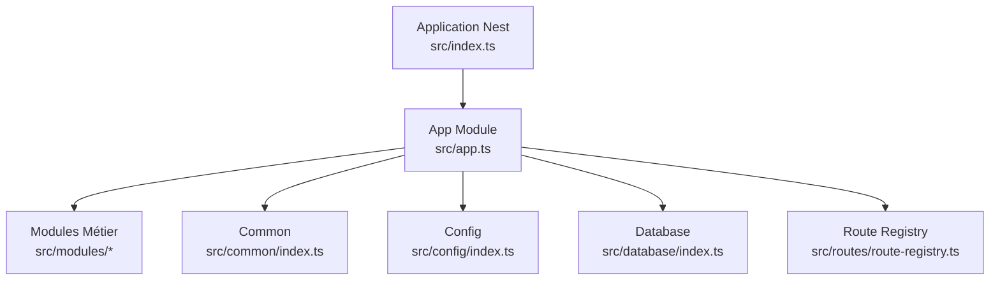
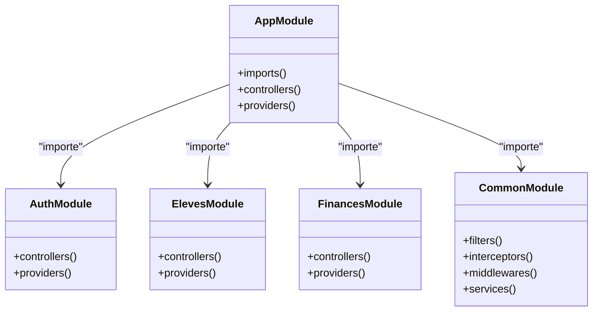
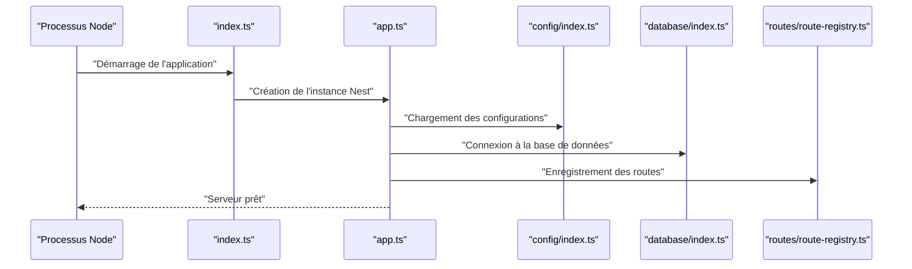
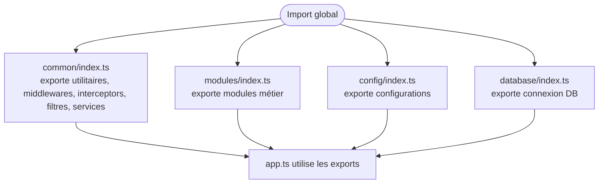
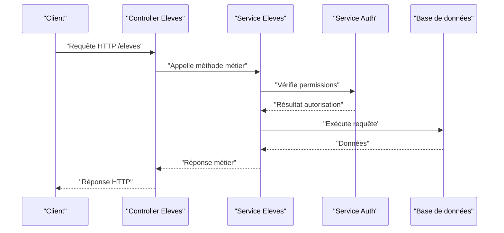
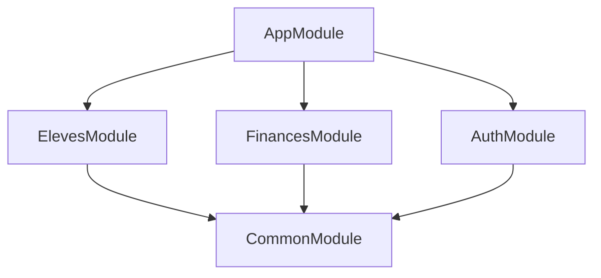

# Architecture Modulaire et Structure des Modules

<cite>
**Fichiers référencés dans ce document**
- [app.ts](file://backend/src/app.ts)
- [index.ts](file://backend/src/index.ts)
- [modules/index.ts](file://backend/src/modules/index.ts)
- [common/index.ts](file://backend/src/common/index.ts)
- [config/index.ts](file://backend/src/config/index.ts)
- [database/index.ts](file://backend/src/database/index.ts)
- [routes/route-registry.ts](file://backend/src/routes/route-registry.ts)
</cite>

## Table des matières
1. [Introduction](#introduction)
2. [Structure du projet](#structure-du-projet)
3. [Composants clés d'un module NestJS](#composants-clés-dun-module-nestjs)
4. [Architecture modulaire eLISAschool](#architecture-modulaire-elisaschool)
5. [Analyse détaillée des composants](#analyse-détaillée-des-composants)
6. [Analyse des dépendances](#analyse-des-dépendances)
7. [Considérations de performance](#considérations-de-performance)
8. [Guide de dépannage](#guide-de-dépannage)
9. [Conclusion](#conclusion)
10. [Annexes](#annexes)

## Introduction
Ce document explique l'architecture modulaire de NestJS au sein d'eLISAschool, en se concentrant sur la structure de base d'un module (controllers, services, entities, dto), le pattern barrel avec les fichiers index.ts, et la manière dont les modules communiquent entre eux via les imports. Il décrit également la hiérarchie des modules (modules métier vs modules communs), les bonnes pratiques pour éviter les dépendances circulaires, et fournit un exemple concret de création d'un nouveau module complet ainsi que son enregistrement dans l'application principale.

## Structure du projet
Le backend suit une architecture modulaire typique de NestJS :
- Un point d'entrée principal qui initialise l'application Nest et charge les modules.
- Un répertoire common regroupant des utilitaires, middlewares, interceptors, filtres et services partagés.
- Un répertoire modules contenant les fonctionnalités métiers (par exemple eleves, finances, personnel, etc.).
- Des configurations centralisées (base de données, environnement, Swagger).
- Un registre de routes qui expose les endpoints de l'API.

**Diagramme sources**
- [index.ts](file://backend/src/index.ts)
- [app.ts](file://backend/src/app.ts)
- [modules/index.ts](file://backend/src/modules/index.ts)
- [common/index.ts](file://backend/src/common/index.ts)
- [config/index.ts](file://backend/src/config/index.ts)
- [database/index.ts](file://backend/src/database/index.ts)
- [routes/route-registry.ts](file://backend/src/routes/route-registry.ts)

**Section sources**
- [index.ts](file://backend/src/index.ts)
- [app.ts](file://backend/src/app.ts)
- [modules/index.ts](file://backend/src/modules/index.ts)
- [common/index.ts](file://backend/src/common/index.ts)
- [config/index.ts](file://backend/src/config/index.ts)
- [database/index.ts](file://backend/src/database/index.ts)
- [routes/route-registry.ts](file://backend/src/routes/route-registry.ts)

## Composants clés d'un module NestJS
Un module NestJS est généralement composé de :
- Controller : définit les routes HTTP et les handlers de requêtes.
- Service : contient la logique métier et interagit avec les repositories ou la base de données.
- Entity : modèle de données (souvent lié à TypeORM/Prisma selon le cas).
- DTO : objets de transfert de données pour valider et typer les entrées/sorties API.
- Module : classe qui regroupe controller, service, entity, et exports nécessaires.

Dans eLISAschool, chaque module métier suit cette convention, facilitant la maintenance et la réutilisation.

**Section sources**
- [modules/index.ts](file://backend/src/modules/index.ts)
- [common/index.ts](file://backend/src/common/index.ts)

## Architecture modulaire eLISAschool
La hiérarchie distingue deux catégories principales :
- Modules métier : implémentent les fonctionnalités spécifiques (eleves, finances, personnel, notes, bulletins, etc.).
- Modules communs : fournissent des capacités transversales (auth, rbac, notifications, configuration, monitoring, audit, etc.).

Les modules communiquent via des imports explicites et des providers injectés par le conteneur DI de NestJS. Le registre de routes centralise l'exposition des endpoints.

**Diagramme sources**
- [app.ts](file://backend/src/app.ts)
- [modules/index.ts](file://backend/src/modules/index.ts)
- [common/index.ts](file://backend/src/common/index.ts)

**Section sources**
- [app.ts](file://backend/src/app.ts)
- [modules/index.ts](file://backend/src/modules/index.ts)
- [common/index.ts](file://backend/src/common/index.ts)

## Analyse détaillée des composants

### Point d'entrée et initialisation de l'application
Le fichier index.ts lance le serveur et crée l'instance Nest. Le fichier app.ts configure le module racine, importe les modules nécessaires et applique les middlewares/filtres globaux.

**Diagramme sources**
- [index.ts](file://backend/src/index.ts)
- [app.ts](file://backend/src/app.ts)
- [config/index.ts](file://backend/src/config/index.ts)
- [database/index.ts](file://backend/src/database/index.ts)
- [routes/route-registry.ts](file://backend/src/routes/route-registry.ts)

**Section sources**
- [index.ts](file://backend/src/index.ts)
- [app.ts](file://backend/src/app.ts)
- [config/index.ts](file://backend/src/config/index.ts)
- [database/index.ts](file://backend/src/database/index.ts)
- [routes/route-registry.ts](file://backend/src/routes/route-registry.ts)

### Pattern Barrel avec les fichiers index.ts
Le pattern barrel consiste à exporter depuis un fichier index.ts unique, simplifiant les imports et réduisant la complexité des chemins. Dans eLISAschool :
- common/index.ts exporte les utilitaires, middlewares, interceptors, filtres et services partagés.
- modules/index.ts exporte les modules métier pour un import centralisé.
- config/index.ts et database/index.ts centralisent les configurations et connexions.

**Diagramme sources**
- [common/index.ts](file://backend/src/common/index.ts)
- [modules/index.ts](file://backend/src/modules/index.ts)
- [config/index.ts](file://backend/src/config/index.ts)
- [database/index.ts](file://backend/src/database/index.ts)
- [app.ts](file://backend/src/app.ts)

**Section sources**
- [common/index.ts](file://backend/src/common/index.ts)
- [modules/index.ts](file://backend/src/modules/index.ts)
- [config/index.ts](file://backend/src/config/index.ts)
- [database/index.ts](file://backend/src/database/index.ts)
- [app.ts](file://backend/src/app.ts)

### Communication entre modules via imports
Les modules communiquent en s'important mutuellement via le conteneur DI de NestJS. Par exemple, un controller peut injecter un service d'un autre module si celui-ci est correctement exporté.

**Diagramme sources**
- [modules/index.ts](file://backend/src/modules/index.ts)
- [common/index.ts](file://backend/src/common/index.ts)

**Section sources**
- [modules/index.ts](file://backend/src/modules/index.ts)
- [common/index.ts](file://backend/src/common/index.ts)

### Hiérarchie des modules (métier vs communs)
- Modules métier : Eleves, Finances, Personnel, Notes, Bulletins, etc. Ils encapsulent la logique spécifique au domaine.
- Modules communs : Auth, RBAC, Notifications, Configuration, Monitoring, Audit. Ils offrent des capacités transversales.

Cette séparation améliore la cohésion et réduit le couplage.

**Section sources**
- [modules/index.ts](file://backend/src/modules/index.ts)
- [common/index.ts](file://backend/src/common/index.ts)

### Dépendances circulaires à éviter
Pour éviter les dépendances circulaires :
- Centralisez les interfaces et types dans common.
- Utilisez des événements ou des files d'attente pour découpler les modules.
- Limitez les imports directs entre modules métier ; privilégiez les services communs.

**Section sources**
- [common/index.ts](file://backend/src/common/index.ts)
- [modules/index.ts](file://backend/src/modules/index.ts)

### Bonnes pratiques pour organiser le code
- Chaque module doit avoir son propre dossier avec controllers, services, entities, dto, et un fichier index.ts barrel.
- Exportez uniquement ce qui est nécessaire depuis les barrels.
- Gardez les imports explicites et évitez les imports globaux non nécessaires.
- Documentez les contrats d'interface entre modules.

**Section sources**
- [modules/index.ts](file://backend/src/modules/index.ts)
- [common/index.ts](file://backend/src/common/index.ts)

### Exemple concret : Création d'un nouveau module complet
Voici les étapes pour créer un module "GestionDesAbsences" :
1. Créez le dossier src/modules/gestion-absences/.
2. Définissez l'entity Absence.ts.
3. Implémentez le service GestionAbsencesService.ts.
4. Créez le controller GestionAbsencesController.ts.
5. Ajoutez les DTOs createAbsence.dto.ts et updateAbsence.dto.ts.
6. Créez le module GestionAbsencesModule.ts qui importe/exporte les composants.
7. Exportez le module depuis modules/index.ts.
8. Importez-le dans app.ts via le registre de routes ou directement.

**Section sources**
- [modules/index.ts](file://backend/src/modules/index.ts)
- [app.ts](file://backend/src/app.ts)

### Enregistrement des modules dans l'application principale
Le fichier app.ts importe les modules nécessaires et les ajoute au tableau imports du module racine. Le registre de routes peut aussi être utilisé pour exposer dynamiquement les endpoints.

**Section sources**
- [app.ts](file://backend/src/app.ts)
- [routes/route-registry.ts](file://backend/src/routes/route-registry.ts)

## Analyse des dépendances
Les dépendances sont gérées par le conteneur DI de NestJS. Les modules métier dépendent souvent de modules communs comme auth et rbac.

**Diagramme sources**
- [app.ts](file://backend/src/app.ts)
- [modules/index.ts](file://backend/src/modules/index.ts)
- [common/index.ts](file://backend/src/common/index.ts)

**Section sources**
- [app.ts](file://backend/src/app.ts)
- [modules/index.ts](file://backend/src/modules/index.ts)
- [common/index.ts](file://backend/src/common/index.ts)

## Considérations de performance
- Évitez les imports lourds inutiles dans les barrels.
- Utilisez des lazy loading pour les modules volumineux.
- Optimisez les requêtes DB dans les services.
- Mettez en cache les données fréquentes via Redis ou autres solutions.

[No sources needed since this section provides general guidance]

## Guide de dépannage
Problèmes courants :
- Erreurs de dépendance circulaire : vérifiez les imports et utilisez des interfaces.
- Modules non enregistrés : assurez-vous que le module est importé dans app.ts ou le registre de routes.
- Problèmes de barrel : vérifiez les exports dans les fichiers index.ts.

**Section sources**
- [common/index.ts](file://backend/src/common/index.ts)
- [modules/index.ts](file://backend/src/modules/index.ts)
- [app.ts](file://backend/src/app.ts)

## Conclusion
L'architecture modulaire de NestJS dans eLISAschool repose sur une séparation claire entre modules métier et communs, un pattern barrel pour simplifier les imports, et une communication via le conteneur DI. Suivre les bonnes pratiques permet d'éviter les dépendances circulaires et d'améliorer la maintenabilité. La création de nouveaux modules suit une structure standardisée, facilitant l'extension du système.

[No sources needed since this section summarizes without analyzing specific files]

## Annexes
- Référence rapide des fichiers clés :
  - Point d'entrée : [index.ts](file://backend/src/index.ts)
  - Module racine : [app.ts](file://backend/src/app.ts)
  - Registre de modules : [modules/index.ts](file://backend/src/modules/index.ts)
  - Utilitaires communs : [common/index.ts](file://backend/src/common/index.ts)
  - Configurations : [config/index.ts](file://backend/src/config/index.ts)
  - Connexion DB : [database/index.ts](file://backend/src/database/index.ts)
  - Routes : [routes/route-registry.ts](file://backend/src/routes/route-registry.ts)

**Section sources**
- [index.ts](file://backend/src/index.ts)
- [app.ts](file://backend/src/app.ts)
- [modules/index.ts](file://backend/src/modules/index.ts)
- [common/index.ts](file://backend/src/common/index.ts)
- [config/index.ts](file://backend/src/config/index.ts)
- [database/index.ts](file://backend/src/database/index.ts)
- [routes/route-registry.ts](file://backend/src/routes/route-registry.ts)