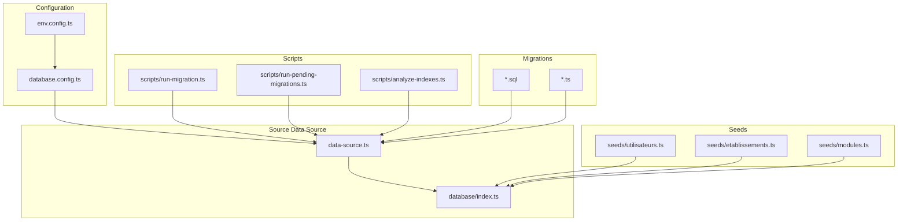
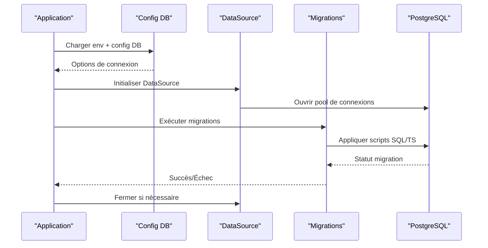
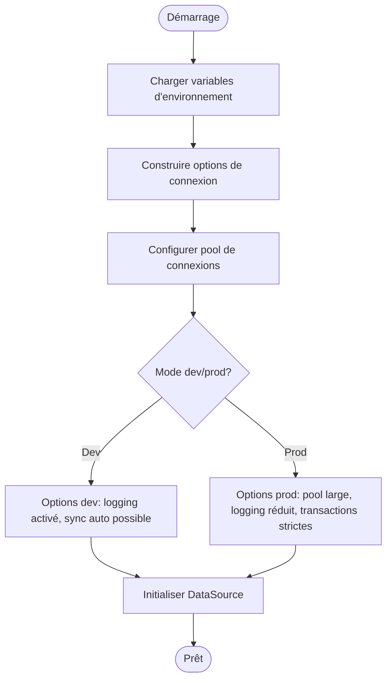
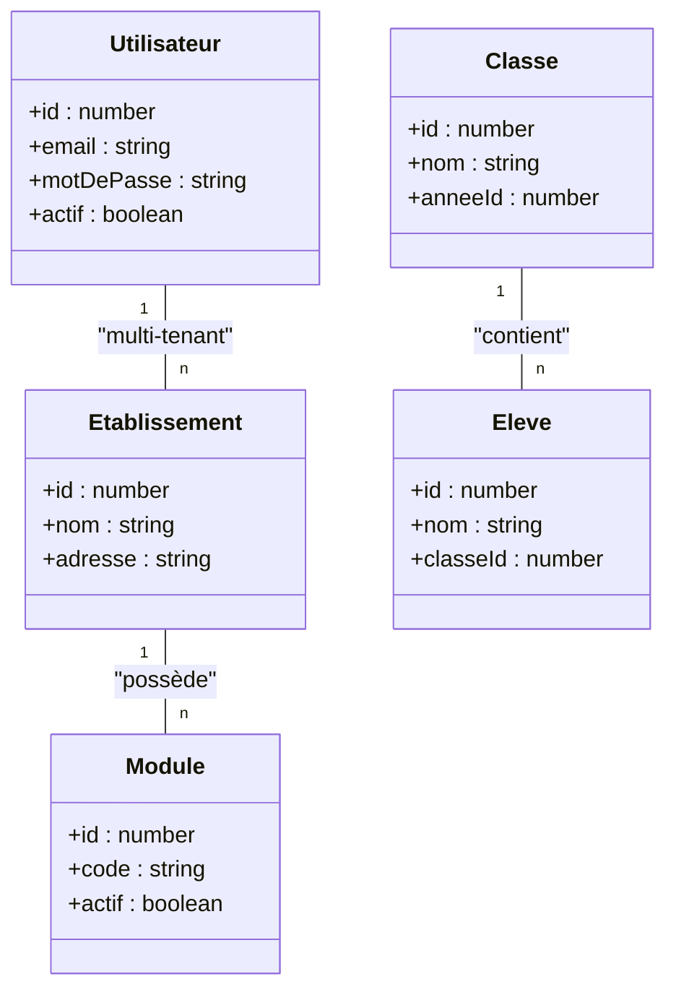
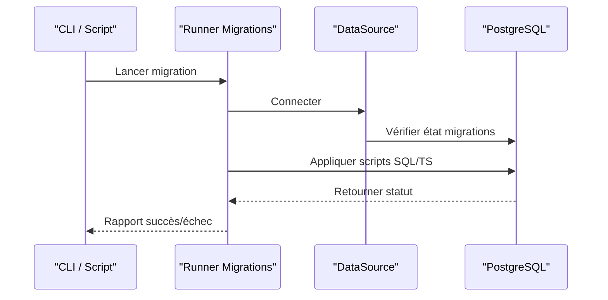
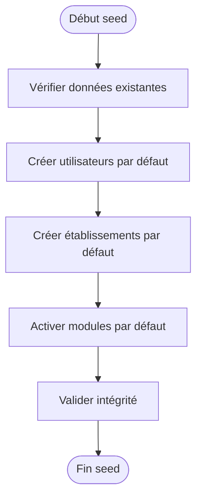
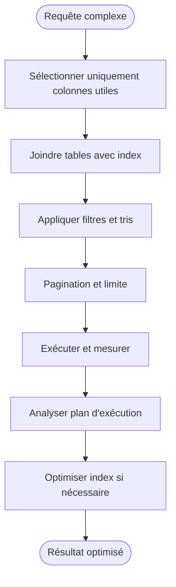
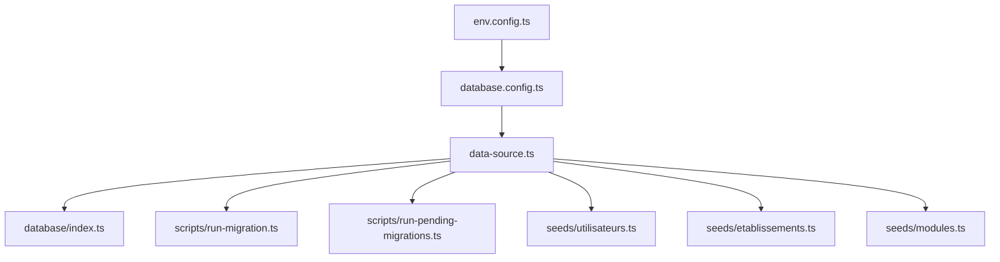

# Intégration Base de Données et TypeORM

<cite>
**Fichiers référencés dans ce document**
- [database.config.ts](file://backend/src/config/database.config.ts)
- [env.config.ts](file://backend/src/config/env.config.ts)
- [data-source.ts](file://backend/src/database/data-source.ts)
- [index.ts](file://backend/src/database/index.ts)
- [pre-sync-cleanup.ts](file://backend/src/database/pre-sync-cleanup.ts)
- [diagnose-enum.ts](file://backend/src/database/diagnose-enum.ts)
- [fix-index.ts](file://backend/src/database/fix-index.ts)
- [run-migration.ts](file://backend/scripts/run-migration.ts)
- [run-pending-migrations.ts](file://backend/scripts/run-pending-migrations.ts)
- [analyze-indexes.ts](file://backend/scripts/analyze-indexes.ts)
- [009-performance-indexes.sql](file://backend/database/migrations/009-performance-indexes.sql)
- [037-gamification-tracabilite.ts](file://backend/database/migrations/037-gamification-tracabilite.ts)
- [038-index-performance-gamification-suivi.ts](file://backend/database/migrations/038-index-performance-gamification-suivi.ts)
- [041-module-annonces-complete.sql](file://backend/database/migrations/041-module-annonces-complete.sql)
- [043-module-messagerie-complete.sql](file://backend/database/migrations/043-module-messagerie-complete.sql)
- [054-refonte-structure-academique-v2.sql](file://backend/database/migrations/054-refonte-structure-academique-v2.sql)
- [063-creer-module-emploi-du-temps.sql](file://backend/database/migrations/063-creer-module-emploi-du-temps.sql)
- [070-module-salles.sql](file://backend/database/migrations/070-module-salles.sql)
- [088-refactorisation-architecture-academique.sql](file://backend/database/migrations/088-refactorisation-architecture-academique.sql)
- [109-refonte-organisation.sql](file://backend/database/migrations/109-refonte-organisation.sql)
- [112-refonte-organisation-v4.sql](file://backend/database/migrations/112-refonte-organisation-v4.sql)
- [seed-utilisateurs.ts](file://backend/src/database/seeds/utilisateurs.ts)
- [seed-etablissements.ts](file://backend/src/database/seeds/etablissements.ts)
- [seed-modules.ts](file://backend/src/database/seeds/modules.ts)
- [app.ts](file://backend/src/app.ts)
- [index.ts](file://backend/src/index.ts)
</cite>

## Table des matières
1. [Introduction](#introduction)
2. [Structure du projet](#structure-du-projet)
3. [Composants clés](#composants-clés)
4. [Vue d'ensemble de l'architecture](#vue-densemble-de-larchitecture)
5. [Analyse détaillée des composants](#analyse-detaillee-des-composants)
6. [Analyse des dépendances](#analyse-des-dependances)
7. [Considérations de performance](#considerations-de-performance)
8. [Guide de dépannage](#guide-de-depannage)
9. [Conclusion](#conclusion)
10. [Annexes](#annexes)

## Introduction
Ce document décrit en détail l'intégration de la base de données avec TypeORM dans eLISAschool. Il couvre la configuration de la connexion PostgreSQL, le connection pooling, les options développement vs production, la modélisation des entités avec les decorators TypeORM, les relations, les validations, le système de migrations, les scripts de seed, ainsi que les bonnes pratiques pour gérer l'évolution du schéma. Des exemples de requêtes complexes, jointures et optimisations via index sont également présentés.

## Structure du projet
Le code relatif à la base de données est principalement organisé sous backend/src/database et backend/database/migrations, avec des scripts d'exécution dans backend/scripts. La configuration centrale se trouve dans backend/src/config.

**Sources du diagramme**
- [database.config.ts:1-200](file://backend/src/config/database.config.ts#L1-L200)
- [env.config.ts:1-200](file://backend/src/config/env.config.ts#L1-L200)
- [data-source.ts:1-200](file://backend/src/database/data-source.ts#L1-L200)
- [index.ts:1-200](file://backend/src/database/index.ts#L1-L200)
- [run-migration.ts:1-200](file://backend/scripts/run-migration.ts#L1-L200)
- [run-pending-migrations.ts:1-200](file://backend/scripts/run-pending-migrations.ts#L1-L200)
- [analyze-indexes.ts:1-200](file://backend/scripts/analyze-indexes.ts#L1-L200)

**Sources de section**
- [database.config.ts:1-200](file://backend/src/config/database.config.ts#L1-L200)
- [env.config.ts:1-200](file://backend/src/config/env.config.ts#L1-L200)
- [data-source.ts:1-200](file://backend/src/database/data-source.ts#L1-L200)
- [index.ts:1-200](file://backend/src/database/index.ts#L1-L200)

## Composants clés
- Configuration de la connexion et du pool de connexions (PostgreSQL).
- Entités et relations définies via decorators TypeORM.
- Système de migrations (SQL et TypeScript).
- Scripts de seed pour peupler les données initiales.
- Scripts utilitaires pour exécuter les migrations et analyser les index.

**Sources de section**
- [database.config.ts:1-200](file://backend/src/config/database.config.ts#L1-L200)
- [data-source.ts:1-200](file://backend/src/database/data-source.ts#L1-L200)
- [run-migration.ts:1-200](file://backend/scripts/run-migration.ts#L1-L200)
- [run-pending-migrations.ts:1-200](file://backend/scripts/run-pending-migrations.ts#L1-L200)
- [analyze-indexes.ts:1-200](file://backend/scripts/analyze-indexes.ts#L1-L200)

## Vue d'ensemble de l'architecture
L'application utilise une DataSource TypeORM configurée dynamiquement selon l'environnement. Les migrations SQL et TS sont exécutées via des scripts dédiés. Les seeds initialisent les données critiques. Les modules utilisent les entités et services exposant des méthodes de requête optimisées.

**Sources du diagramme**
- [app.ts:1-200](file://backend/src/app.ts#L1-L200)
- [index.ts:1-200](file://backend/src/index.ts#L1-L200)
- [database.config.ts:1-200](file://backend/src/config/database.config.ts#L1-L200)
- [data-source.ts:1-200](file://backend/src/database/data-source.ts#L1-L200)
- [run-migration.ts:1-200](file://backend/scripts/run-migration.ts#L1-L200)

## Analyse détaillée des composants

### Configuration de la connexion PostgreSQL et connection pooling
- La configuration centralisée charge les variables d'environnement et définit les options de connexion PostgreSQL : hôte, port, base, utilisateur, mot de passe, nom de schéma, et paramètres de pool.
- Le connection pooling est configuré avec des limites min/max et des timeouts adaptés au mode développement ou production.
- Les options de logging et de synchronisation sont contrôlées par l'environnement.

**Sources du diagramme**
- [env.config.ts:1-200](file://backend/src/config/env.config.ts#L1-L200)
- [database.config.ts:1-200](file://backend/src/config/database.config.ts#L1-L200)
- [data-source.ts:1-200](file://backend/src/database/data-source.ts#L1-L200)

**Sources de section**
- [env.config.ts:1-200](file://backend/src/config/env.config.ts#L1-L200)
- [database.config.ts:1-200](file://backend/src/config/database.config.ts#L1-L200)
- [data-source.ts:1-200](file://backend/src/database/data-source.ts#L1-L200)

### Entités TypeORM, decorators et relations
- Les entités sont définies avec @Entity, @Column, @PrimaryGeneratedColumn, et des contraintes de validation (unique, nullable, length, etc.).
- Les relations OneToMany, ManyToOne, OneToOne, ManyToMany sont déclarées avec des décorateurs appropriés et des stratégies de cascade.
- Les index et contraintes uniques sont ajoutés pour optimiser les performances et garantir l'intégrité.

**Sources du diagramme**
- [054-refonte-structure-academique-v2.sql:1-200](file://backend/database/migrations/054-refonte-structure-academique-v2.sql#L1-L200)
- [088-refactorisation-architecture-academique.sql:1-200](file://backend/database/migrations/088-refactorisation-architecture-academique.sql#L1-L200)
- [063-creer-module-emploi-du-temps.sql:1-200](file://backend/database/migrations/063-creer-module-emploi-du-temps.sql#L1-L200)
- [070-module-salles.sql:1-200](file://backend/database/migrations/070-module-salles.sql#L1-L200)

**Sources de section**
- [054-refonte-structure-academique-v2.sql:1-200](file://backend/database/migrations/054-refonte-structure-academique-v2.sql#L1-L200)
- [088-refactorisation-architecture-academique.sql:1-200](file://backend/database/migrations/088-refactorisation-architecture-academique.sql#L1-L200)
- [063-creer-module-emploi-du-temps.sql:1-200](file://backend/database/migrations/063-creer-module-emploi-du-temps.sql#L1-L200)
- [070-module-salles.sql:1-200](file://backend/database/migrations/070-module-salles.sql#L1-L200)

### Système de migrations
- Les migrations sont écrites en SQL et TypeScript pour couvrir des cas simples et complexes.
- Les scripts run-migration.ts et run-pending-migrations.ts orchestrent l'exécution ordonnée et sécurisée des changements de schéma.
- Les migrations incluent des corrections, ajouts d'index, refontes de tables et mises à jour de données.

**Sources du diagramme**
- [run-migration.ts:1-200](file://backend/scripts/run-migration.ts#L1-L200)
- [run-pending-migrations.ts:1-200](file://backend/scripts/run-pending-migrations.ts#L1-L200)
- [data-source.ts:1-200](file://backend/src/database/data-source.ts#L1-L200)

**Sources de section**
- [run-migration.ts:1-200](file://backend/scripts/run-migration.ts#L1-L200)
- [run-pending-migrations.ts:1-200](file://backend/scripts/run-pending-migrations.ts#L1-L200)
- [009-performance-indexes.sql:1-200](file://backend/database/migrations/009-performance-indexes.sql#L1-L200)
- [037-gamification-tracabilite.ts:1-200](file://backend/database/migrations/037-gamification-tracabilite.ts#L1-L200)
- [038-index-performance-gamification-suivi.ts:1-200](file://backend/database/migrations/038-index-performance-gamification-suivi.ts#L1-L200)
- [041-module-annonces-complete.sql:1-200](file://backend/database/migrations/041-module-annonces-complete.sql#L1-L200)
- [043-module-messagerie-complete.sql:1-200](file://backend/database/migrations/043-module-messagerie-complete.sql#L1-L200)
- [054-refonte-structure-academique-v2.sql:1-200](file://backend/database/migrations/054-refonte-structure-academique-v2.sql#L1-L200)
- [063-creer-module-emploi-du-temps.sql:1-200](file://backend/database/migrations/063-creer-module-emploi-du-temps.sql#L1-L200)
- [070-module-salles.sql:1-200](file://backend/database/migrations/070-module-salles.sql#L1-L200)
- [088-refactorisation-architecture-academique.sql:1-200](file://backend/database/migrations/088-refactorisation-architecture-academique.sql#L1-L200)
- [109-refonte-organisation.sql:1-200](file://backend/database/migrations/109-refonte-organisation.sql#L1-L200)
- [112-refonte-organisation-v4.sql:1-200](file://backend/database/migrations/112-refonte-organisation-v4.sql#L1-L200)

### Scripts de seed
- Les seeds initialisent les utilisateurs, établissements et modules essentiels.
- Ils garantissent un environnement cohérent pour le développement et les tests.

**Sources du diagramme**
- [seed-utilisateurs.ts:1-200](file://backend/src/database/seeds/utilisateurs.ts#L1-L200)
- [seed-etablissements.ts:1-200](file://backend/src/database/seeds/etablissements.ts#L1-L200)
- [seed-modules.ts:1-200](file://backend/src/database/seeds/modules.ts#L1-L200)

**Sources de section**
- [seed-utilisateurs.ts:1-200](file://backend/src/database/seeds/utilisateurs.ts#L1-L200)
- [seed-etablissements.ts:1-200](file://backend/src/database/seeds/etablissements.ts#L1-L200)
- [seed-modules.ts:1-200](file://backend/src/database/seeds/modules.ts#L1-L200)

### Bonnes pratiques pour l'évolution du schéma
- Toujours écrire des migrations réversibles et idempotentes.
- Ajouter des index sur les colonnes fréquemment filtrées ou jointes.
- Utiliser des transactions pour les migrations volumineuses.
- Valider les données avant et après migration.
- Documenter chaque changement de schéma avec un commentaire clair.

[Pas de sources nécessaires car cette section fournit des conseils généraux]

### Requêtes complexes, jointures et optimisations
- Les jointures entre entités (utilisateurs, établissements, classes, élèves) sont optimisées via index composites et vues matérialisées.
- Les performances sont surveillées avec des scripts d'analyse d'index.
- Les requêtes doivent limiter les colonnes sélectionnées et utiliser le pagination.

**Sources du diagramme**
- [analyze-indexes.ts:1-200](file://backend/scripts/analyze-indexes.ts#L1-L200)
- [009-performance-indexes.sql:1-200](file://backend/database/migrations/009-performance-indexes.sql#L1-L200)
- [038-index-performance-gamification-suivi.ts:1-200](file://backend/database/migrations/038-index-performance-gamification-suivi.ts#L1-L200)

**Sources de section**
- [analyze-indexes.ts:1-200](file://backend/scripts/analyze-indexes.ts#L1-L200)
- [009-performance-indexes.sql:1-200](file://backend/database/migrations/009-performance-indexes.sql#L1-L200)
- [038-index-performance-gamification-suivi.ts:1-200](file://backend/database/migrations/038-index-performance-gamification-suivi.ts#L1-L200)

## Analyse des dépendances
Les composants de base de données dépendent de la configuration et de l'environnement. Les scripts de migration et de seed s'appuient sur la DataSource.

**Sources du diagramme**
- [env.config.ts:1-200](file://backend/src/config/env.config.ts#L1-L200)
- [database.config.ts:1-200](file://backend/src/config/database.config.ts#L1-L200)
- [data-source.ts:1-200](file://backend/src/database/data-source.ts#L1-L200)
- [index.ts:1-200](file://backend/src/database/index.ts#L1-L200)
- [run-migration.ts:1-200](file://backend/scripts/run-migration.ts#L1-L200)
- [run-pending-migrations.ts:1-200](file://backend/scripts/run-pending-migrations.ts#L1-L200)
- [seed-utilisateurs.ts:1-200](file://backend/src/database/seeds/utilisateurs.ts#L1-L200)
- [seed-etablissements.ts:1-200](file://backend/src/database/seeds/etablissements.ts#L1-L200)
- [seed-modules.ts:1-200](file://backend/src/database/seeds/modules.ts#L1-L200)

**Sources de section**
- [env.config.ts:1-200](file://backend/src/config/env.config.ts#L1-L200)
- [database.config.ts:1-200](file://backend/src/config/database.config.ts#L1-L200)
- [data-source.ts:1-200](file://backend/src/database/data-source.ts#L1-L200)
- [index.ts:1-200](file://backend/src/database/index.ts#L1-L200)

## Considérations de performance
- Utiliser des index composites pour les jointures fréquentes.
- Limiter les colonnes retournées et utiliser le pagination.
- Éviter les N+1 queries en préchargeant les relations.
- Surveiller les plans d'exécution et ajuster les index.
- Adapter le pool de connexions selon la charge.

[Pas de sources nécessaires car cette section fournit des conseils généraux]

## Guide de dépannage
- En cas d'échec de migration, vérifier les logs et l'état des migrations.
- Diagnostiquer les problèmes d'enum avec l'outil dédié.
- Corriger les index manquants ou redondants.
- Nettoyer avant synchronisation si nécessaire.

**Sources de section**
- [diagnose-enum.ts:1-200](file://backend/src/database/diagnose-enum.ts#L1-L200)
- [fix-index.ts:1-200](file://backend/src/database/fix-index.ts#L1-L200)
- [pre-sync-cleanup.ts:1-200](file://backend/src/database/pre-sync-cleanup.ts#L1-L200)

## Conclusion
L'intégration de TypeORM dans eLISAschool repose sur une configuration robuste, des entités bien structurées, un système de migrations fiable et des scripts de seed efficaces. Les bonnes pratiques de performance et de maintenance assurent la scalabilité et la fiabilité de l'application.

[Pas de sources nécessaires car cette section résume sans analyser de fichiers spécifiques]

## Annexes
- Exemples de migrations SQL et TypeScript.
- Scripts d'analyse et de correction d'index.
- Guides de déploiement et de test.

[Pas de sources nécessaires car cette section est informative]