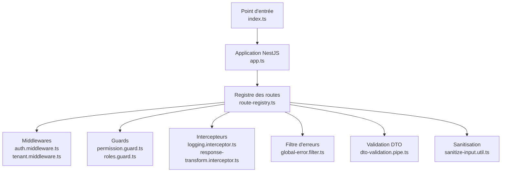
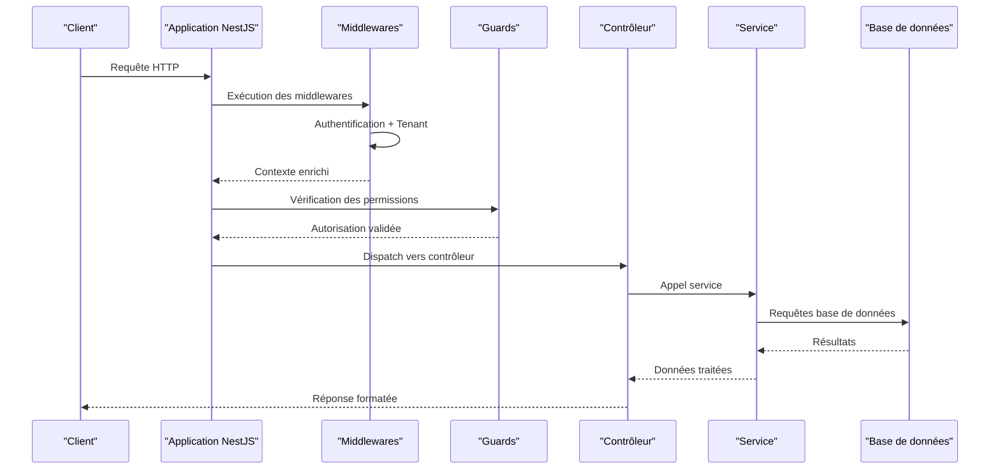
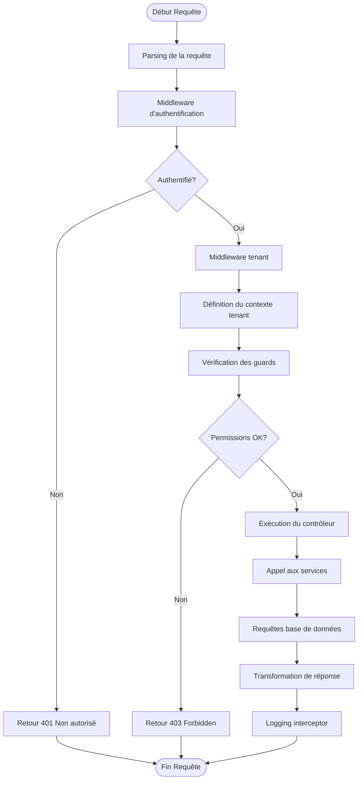
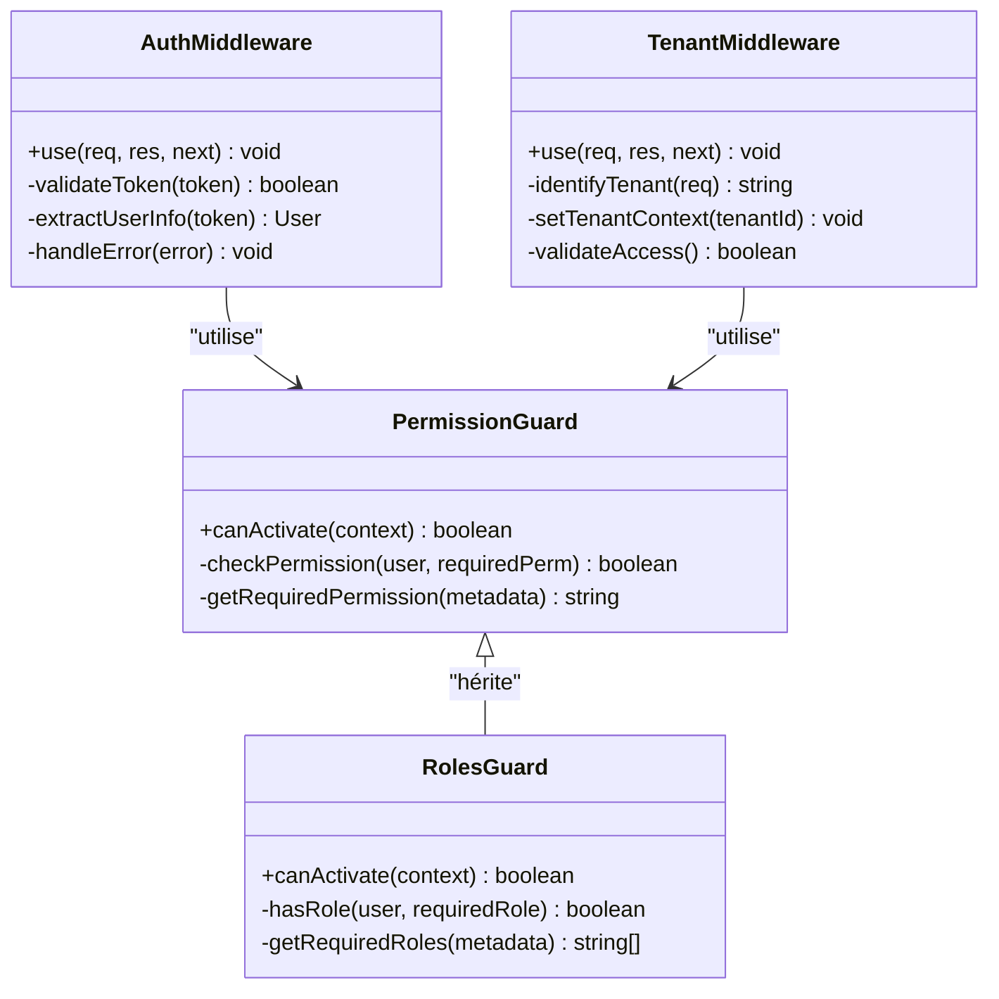
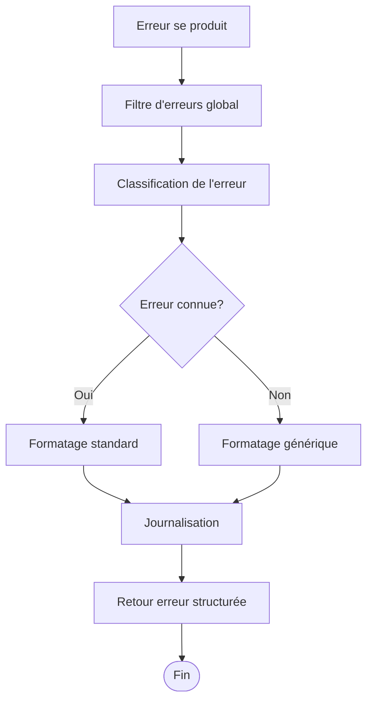
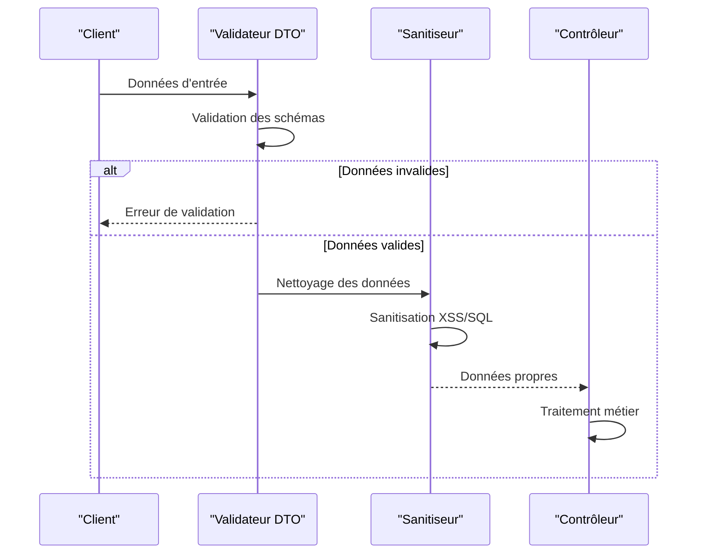
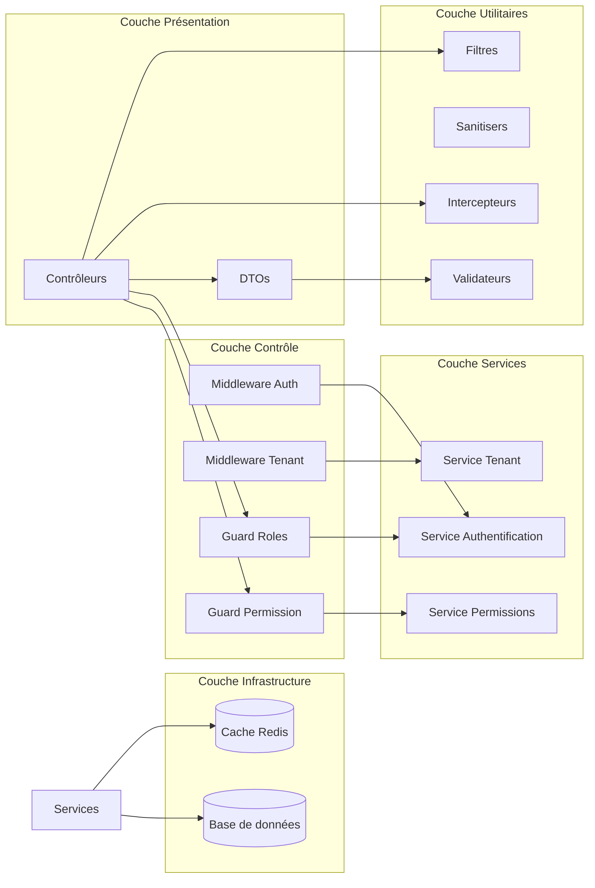

# Middleware, Guards et Sécurité

<cite>
**Fichiers référencés dans ce document**
- [app.ts](file://backend/src/app.ts)
- [index.ts](file://backend/src/index.ts)
- [route-registry.ts](file://backend/src/routes/route-registry.ts)
- [auth.middleware.ts](file://backend/src/common/middlewares/auth.middleware.ts)
- [tenant.middleware.ts](file://backend/src/common/middlewares/tenant.middleware.ts)
- [permission.guard.ts](file://backend/src/modules/auth/guards/permission.guard.ts)
- [roles.guard.ts](file://backend/src/modules/auth/guards/roles.guard.ts)
- [global-error.filter.ts](file://backend/src/common/filters/global-error.filter.ts)
- [logging.interceptor.ts](file://backend/src/common/interceptors/logging.interceptor.ts)
- [response-transform.interceptor.ts](file://backend/src/common/interceptors/response-transform.interceptor.ts)
- [dto-validation.pipe.ts](file://backend/src/common/utils/dto-validation.pipe.ts)
- [sanitize-input.util.ts](file://backend/src/common/utils/sanitize-input.util.ts)
- [env.config.ts](file://backend/src/config/env.config.ts)
- [database.config.ts](file://backend/src/config/database.config.ts)
- [rbac-system.md](file://docs/rbac-system.md)
- [CONVENTIONS-PERMISSIONS.md](file://docs/CONVENTIONS-PERMISSIONS.md)
- [GUIDE-TEST-SECURITE.md](file://docs/guides/GUIDE-TEST-SECURITE.md)
</cite>

## Table des matières
1. [Introduction](#introduction)
2. [Structure du projet](#structure-du-projet)
3. [Composants clés](#composants-clés)
4. [Vue d'ensemble de l'architecture](#vue-densemble-de-larchitecture)
5. [Analyse détaillée des composants](#analyse-detaillee-des-composants)
6. [Analyse des dépendances](#analyse-des-dependances)
7. [Considérations de performance](#considerations-de-performance)
8. [Guide de dépannage](#guide-de-depannage)
9. [Conclusion](#conclusion)
10. [Annexes](#annexes)

## Introduction
Ce document décrit en détail le système de middleware, guards et sécurité d'eLISAschool. Il explique le cycle de vie des requêtes HTTP et où s'insèrent les middlewares (authentification, tenant, permission), ainsi que la création de guards personnalisés pour le contrôle d'accès basé sur les rôles et permissions. Il couvre également le filtre d'erreurs global, les intercepteurs pour le logging et la transformation de réponses, et les stratégies de protection contre les attaques courantes. Des exemples concrets sont fournis pour créer un guard personnalisé, un middleware tenant-aware et un interceptor de logging. La validation des DTO et la sanitisation des entrées utilisateur sont également traitées.

## Structure du projet
Le backend est structuré autour de modules NestJS avec une séparation claire entre les middlewares, guards, interceptors, filtres et utilitaires. Les fichiers principaux incluent:
- Point d'entrée de l'application et configuration globale
- Registre des routes et orchestration des middlewares
- Middlewares pour l'authentification et le contexte multi-tenant
- Guards pour le contrôle d'accès basé sur les rôles et permissions
- Filtre d'erreurs global pour la gestion centralisée des exceptions
- Intercepteurs pour le logging et la transformation des réponses
- Utilitaires pour la validation des DTO et la sanitisation des entrées

**Diagramme sources**
- [index.ts](file://backend/src/index.ts)
- [app.ts](file://backend/src/app.ts)
- [route-registry.ts](file://backend/src/routes/route-registry.ts)

**Section sources**
- [index.ts](file://backend/src/index.ts)
- [app.ts](file://backend/src/app.ts)
- [route-registry.ts](file://backend/src/routes/route-registry.ts)

## Composants clés
Les composants essentiels du système de sécurité comprennent:

### Middlewares
- **Authentification**: Vérifie les tokens JWT et valide l'identité de l'utilisateur
- **Tenant**: Gère le contexte multi-tenant et isole les données par établissement

### Guards
- **Permission Guard**: Contrôle l'accès basé sur les permissions RBAC
- **Roles Guard**: Vérifie les rôles utilisateurs pour l'autorisation

### Intercepteurs
- **Logging Interceptor**: Enregistre les requêtes et réponses pour le monitoring
- **Response Transform Interceptor**: Formate les réponses API de manière cohérente

### Filtres
- **Global Error Filter**: Capture et formate toutes les erreurs non gérées

### Validation et Sanitisation
- **DTO Validation Pipe**: Valide les données d'entrée selon les schémas définis
- **Input Sanitizer**: Nettoie et sécurise les entrées utilisateur

**Section sources**
- [auth.middleware.ts](file://backend/src/common/middlewares/auth.middleware.ts)
- [tenant.middleware.ts](file://backend/src/common/middlewares/tenant.middleware.ts)
- [permission.guard.ts](file://backend/src/modules/auth/guards/permission.guard.ts)
- [roles.guard.ts](file://backend/src/modules/auth/guards/roles.guard.ts)
- [logging.interceptor.ts](file://backend/src/common/interceptors/logging.interceptor.ts)
- [response-transform.interceptor.ts](file://backend/src/common/interceptors/response-transform.interceptor.ts)
- [global-error.filter.ts](file://backend/src/common/filters/global-error.filter.ts)
- [dto-validation.pipe.ts](file://backend/src/common/utils/dto-validation.pipe.ts)
- [sanitize-input.util.ts](file://backend/src/common/utils/sanitize-input.util.ts)

## Vue d'ensemble de l'architecture
Le système suit une architecture en couches où chaque composant a une responsabilité spécifique dans le traitement des requêtes HTTP.

**Diagramme sources**
- [app.ts](file://backend/src/app.ts)
- [auth.middleware.ts](file://backend/src/common/middlewares/auth.middleware.ts)
- [permission.guard.ts](file://backend/src/modules/auth/guards/permission.guard.ts)

## Analyse détaillée des composants

### Cycle de vie des requêtes HTTP
Le cycle de vie suit une séquence précise où chaque composant intervient à un moment spécifique:

**Diagramme sources**
- [auth.middleware.ts](file://backend/src/common/middlewares/auth.middleware.ts)
- [tenant.middleware.ts](file://backend/src/common/middlewares/tenant.middleware.ts)
- [permission.guard.ts](file://backend/src/modules/auth/guards/permission.guard.ts)
- [logging.interceptor.ts](file://backend/src/common/interceptors/logging.interceptor.ts)

### Système d'authentification et middleware tenant
Le middleware d'authentification vérifie les tokens JWT et extrait les informations utilisateur. Le middleware tenant établit le contexte multi-tenant pour isoler les données par établissement.

**Diagramme sources**
- [auth.middleware.ts](file://backend/src/common/middlewares/auth.middleware.ts)
- [tenant.middleware.ts](file://backend/src/common/middlewares/tenant.middleware.ts)
- [permission.guard.ts](file://backend/src/modules/auth/guards/permission.guard.ts)
- [roles.guard.ts](file://backend/src/modules/auth/guards/roles.guard.ts)

### Gestion centralisée des erreurs
Le filtre d'erreurs global capture toutes les exceptions non gérées et les formate de manière cohérente.

**Diagramme sources**
- [global-error.filter.ts](file://backend/src/common/filters/global-error.filter.ts)

### Validation des DTO et sanitisation
La validation des DTO assure que les données d'entrée respectent les schémas définis, tandis que la sanitisation nettoie les entrées utilisateur.

**Diagramme sources**
- [dto-validation.pipe.ts](file://backend/src/common/utils/dto-validation.pipe.ts)
- [sanitize-input.util.ts](file://backend/src/common/utils/sanitize-input.util.ts)

### Stratégies de protection contre les attaques
Le système implémente plusieurs couches de sécurité:

#### Protection contre les injections SQL
- Utilisation de requêtes paramétrées
- Validation stricte des types de données
- Sanitisation des entrées utilisateur

#### Protection contre les attaques XSS
- Échappement automatique des sorties
- Content Security Policy (CSP)
- Validation et nettoyage des champs texte

#### Protection contre les attaques par force brute
- Limitation du nombre de tentatives de connexion
- Blocage temporaire après échecs multiples
- Surveillance des activités suspectes

#### Protection CSRF
- Tokens CSRF pour les formulaires
- Vérification de l'origine des requêtes
- Configuration CORS appropriée

**Section sources**
- [dto-validation.pipe.ts](file://backend/src/common/utils/dto-validation.pipe.ts)
- [sanitize-input.util.ts](file://backend/src/common/utils/sanitize-input.util.ts)
- [env.config.ts](file://backend/src/config/env.config.ts)

## Analyse des dépendances
Les composants sont interdépendants et suivent une hiérarchie claire:

**Diagramme sources**
- [auth.middleware.ts](file://backend/src/common/middlewares/auth.middleware.ts)
- [permission.guard.ts](file://backend/src/modules/auth/guards/permission.guard.ts)
- [dto-validation.pipe.ts](file://backend/src/common/utils/dto-validation.pipe.ts)

**Section sources**
- [auth.middleware.ts](file://backend/src/common/middlewares/auth.middleware.ts)
- [permission.guard.ts](file://backend/src/modules/auth/guards/permission.guard.ts)
- [dto-validation.pipe.ts](file://backend/src/common/utils/dto-validation.pipe.ts)

## Considérations de performance
Plusieurs optimisations sont implémentées pour garantir de bonnes performances:

### Optimisations des middlewares
- Chargement paresseux des middlewares non essentiels
- Mise en cache des vérifications d'authentification
- Déconnexion rapide des requêtes non autorisées

### Optimisations des guards
- Vérifications en cascade pour éviter les calculs inutiles
- Mise en cache des permissions utilisateur
- Optimisation des requêtes RBAC

### Optimisations de la validation
- Validation différentielle selon le contexte
- Mise en cache des schémas de validation
- Validation asynchrone pour les opérations coûteuses

### Monitoring et métriques
- Mesure du temps de réponse par endpoint
- Suivi des taux d'échec d'authentification
- Alerting sur les patterns d'attaque suspects

## Guide de dépannage
### Problèmes courants d'authentification
- **Erreur 401 Non autorisé**: Vérifier la présence et la validité du token JWT
- **Erreur 403 Forbidden**: Contrôler les permissions et rôles attribués
- **Timeout d'authentification**: Vérifier la configuration du serveur d'authentification

### Problèmes de contexte tenant
- **Données croisées entre tenants**: Vérifier la configuration du middleware tenant
- **Erreurs de connexion base de données**: Confirmer les paramètres de connexion par tenant

### Problèmes de validation
- **Erreurs de validation DTO**: Examiner les schémas de validation et les données d'entrée
- **Sanitisation trop agressive**: Ajuster les règles de sanitisation selon les besoins

### Logs et debugging
- Activer le mode debug pour plus de détails
- Consulter les logs des intercepteurs de logging
- Utiliser les outils de profiling intégrés

**Section sources**
- [global-error.filter.ts](file://backend/src/common/filters/global-error.filter.ts)
- [logging.interceptor.ts](file://backend/src/common/interceptors/logging.interceptor.ts)
- [GUIDE-TEST-SECURITE.md](file://docs/guides/GUIDE-TEST-SECURITE.md)

## Conclusion
Le système de middleware, guards et sécurité d'eLISAschool offre une approche robuste et évolutive pour la protection des applications. L'architecture en couches permet une maintenance facile et une extension simple des fonctionnalités de sécurité. La combinaison de middlewares, guards, intercepteurs et filtres crée un environnement sécurisé tout en maintenant de bonnes performances.

Les bonnes pratiques recommandées incluent:
- Toujours valider et sanitiser les entrées utilisateur
- Implémenter des guards spécifiques pour chaque endpoint sensible
- Utiliser le filtre d'erreurs global pour une gestion cohérente
- Monitorer activement les tentatives d'accès non autorisées
- Maintenir les configurations de sécurité à jour

## Annexes

### Exemple de création d'un guard personnalisé
Pour créer un guard personnalisé, suivre ces étapes:
1. Implémenter l'interface `CanActivate`
2. Injecter les services nécessaires
3. Implémenter la logique de décision d'autorisation
4. Appliquer le guard au niveau du contrôleur ou de la méthode

### Exemple de middleware tenant-aware
Un middleware tenant-aware doit:
1. Extraire l'identifiant du tenant de la requête
2. Configurer le contexte de base de données approprié
3. Valider l'accès de l'utilisateur au tenant
4. Passer le contrôle au prochain middleware

### Exemple d'interceptor de logging
Un interceptor de logging efficace:
1. Enregistrer le timestamp de début de requête
2. Capturer les métadonnées de la requête
3. Enregistrer le temps de traitement
4. Logger les erreurs et exceptions
5. Ne pas exposer les données sensibles dans les logs

**Section sources**
- [rbac-system.md](file://docs/rbac-system.md)
- [CONVENTIONS-PERMISSIONS.md](file://docs/CONVENTIONS-PERMISSIONS.md)
- [GUIDE-TEST-SECURITE.md](file://docs/guides/GUIDE-TEST-SECURITE.md)