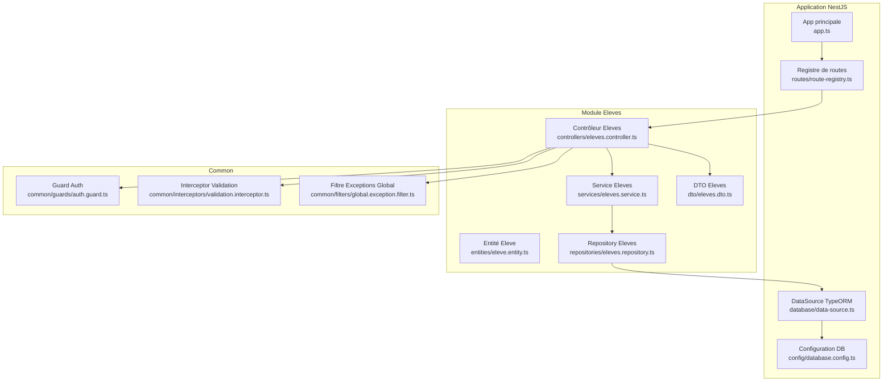
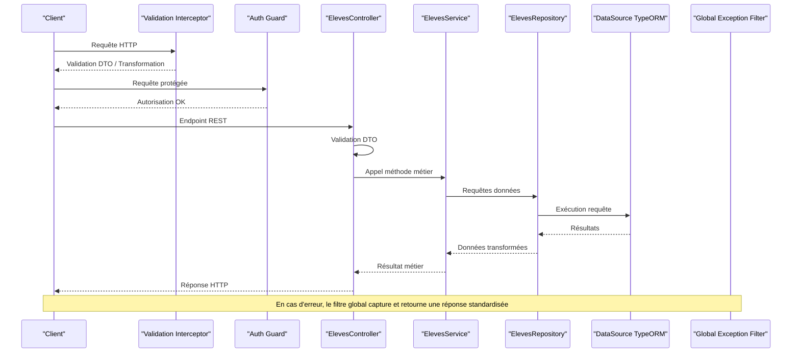
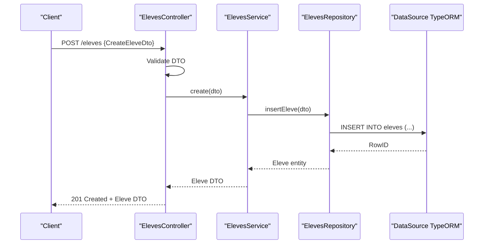
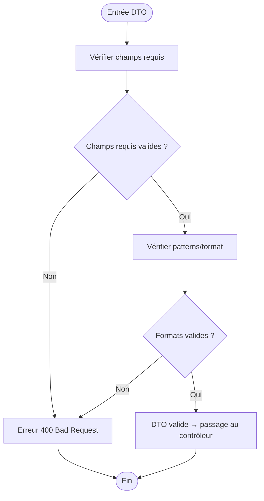
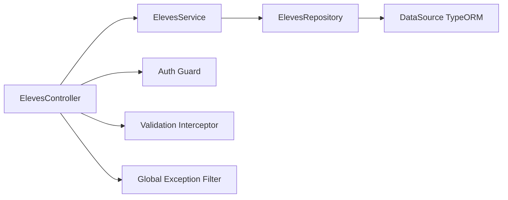

# Patterns MVC et Séparation des Responsabilités

<cite>
**Fichiers référencés dans ce document**
- [app.ts](file://backend/src/app.ts)
- [index.ts](file://backend/src/index.ts)
- [route-registry.ts](file://backend/src/routes/route-registry.ts)
- [data-source.ts](file://backend/src/database/data-source.ts)
- [database.config.ts](file://backend/src/config/database.config.ts)
- [eleves.controller.ts](file://backend/src/modules/eleves/controllers/eleves.controller.ts)
- [eleves.service.ts](file://backend/src/modules/eleves/services/eleves.service.ts)
- [eleve.entity.ts](file://backend/src/modules/eleves/entities/eleve.entity.ts)
- [eleves.dto.ts](file://backend/src/modules/eleves/dto/eleves.dto.ts)
- [eleves.repository.ts](file://backend/src/modules/eleves/repositories/eleves.repository.ts)
- [auth.guard.ts](file://backend/src/common/guards/auth.guard.ts)
- [validation.interceptor.ts](file://backend/src/common/interceptors/validation.interceptor.ts)
- [global.exception.filter.ts](file://backend/src/common/filters/global.exception.filter.ts)
</cite>

## Table des matières
1. [Introduction](#introduction)
2. [Structure du projet](#structure-du-projet)
3. [Composants clés](#composants-clés)
4. [Vue d'ensemble de l'architecture](#vue-densemble-de-larchitecture)
5. [Analyse détaillée des composants](#analyse-detaillee-des-composants)
6. [Analyse des dépendances](#analyse-des-dependances)
7. [Considérations de performance](#considerations-de-performance)
8. [Guide de dépannage](#guide-de-depannage)
9. [Conclusion](#conclusion)
10. [Annexes](#annexes)

## Introduction
Ce document explique comment eLISAschool implémente le pattern MVC (Modèle-Vue-Contrôleur) au sein du backend NestJS, en mettant l’accent sur la séparation des responsabilités entre les couches :
- Contrôleurs : gestion des requêtes HTTP, validation des DTO, orchestration bas niveau.
- Services : logique métier, orchestration des cas d’utilisation, règles de domaine.
- Entités TypeORM : modèles de données persistés.
- Repository : abstraction d’accès aux données, encapsulation des requêtes complexes.

Le document détaille le flux de données pour un endpoint REST typique, les responsabilités de chaque couche, ainsi que les mécanismes de validation, transformation et gestion d’erreurs. Il inclut également une vue d’ensemble des dépendances et des bonnes pratiques pour maintenir la cohérence architecturale.

## Structure du projet
Le backend est structuré par modules fonctionnels (par exemple eleves, finances, personnel), chacun contenant ses propres contrôleurs, services, entités, DTOs et repositories. La configuration de l’application NestJS centralise les routes, les guards, interceptors et filtres globaux.

**Sources du diagramme**
- [app.ts](file://backend/src/app.ts)
- [route-registry.ts](file://backend/src/routes/route-registry.ts)
- [database.config.ts](file://backend/src/config/database.config.ts)
- [data-source.ts](file://backend/src/database/data-source.ts)
- [eleves.controller.ts](file://backend/src/modules/eleves/controllers/eleves.controller.ts)
- [eleves.service.ts](file://backend/src/modules/eleves/services/eleves.service.ts)
- [eleve.entity.ts](file://backend/src/modules/eleves/entities/eleve.entity.ts)
- [eleves.repository.ts](file://backend/src/modules/eleves/repositories/eleves.repository.ts)
- [eleves.dto.ts](file://backend/src/modules/eleves/dto/eleves.dto.ts)
- [auth.guard.ts](file://backend/src/common/guards/auth.guard.ts)
- [validation.interceptor.ts](file://backend/src/common/interceptors/validation.interceptor.ts)
- [global.exception.filter.ts](file://backend/src/common/filters/global.exception.filter.ts)

**Sources de section**
- [app.ts](file://backend/src/app.ts)
- [index.ts](file://backend/src/index.ts)
- [route-registry.ts](file://backend/src/routes/route-registry.ts)

## Composants clés
- Contrôleurs : reçoivent les requêtes HTTP, appliquent les guards et interceptors, valident les DTOs, délèguent au service et retournent les réponses HTTP.
- Services : implémentent la logique métier, coordonnent les opérations, utilisent les repositories pour accéder aux données.
- Entités : définitions de schémas TypeORM avec décorateurs, relations et contraintes.
- DTOs : objets de transfert de données avec validation (class-validator).
- Repository : encapsule les requêtes SQL/TypeORM, expose des méthodes métier orientées données.
- Guards/Interceptors/Filtres : transversalité (authentification, validation, erreurs).

**Sources de section**
- [eleves.controller.ts](file://backend/src/modules/eleves/controllers/eleves.controller.ts)
- [eleves.service.ts](file://backend/src/modules/eleves/services/eleves.service.ts)
- [eleve.entity.ts](file://backend/src/modules/eleves/entities/eleve.entity.ts)
- [eleves.dto.ts](file://backend/src/modules/eleves/dto/eleves.dto.ts)
- [eleves.repository.ts](file://backend/src/modules/eleves/repositories/eleves.repository.ts)
- [auth.guard.ts](file://backend/src/common/guards/auth.guard.ts)
- [validation.interceptor.ts](file://backend/src/common/interceptors/validation.interceptor.ts)
- [global.exception.filter.ts](file://backend/src/common/filters/global.exception.filter.ts)

## Vue d'ensemble de l'architecture
Le flux d’une requête REST traverse successivement :
1. Interceptors (validation, transformation)
2. Guards (authentification, autorisation)
3. Contrôleur (validation DTO, orchestration légère)
4. Service (logique métier)
5. Repository (accès données)
6. DataSource TypeORM (connexion et exécution SQL)
7. Filtre global (gestion d’erreurs)

**Sources du diagramme**
- [validation.interceptor.ts](file://backend/src/common/interceptors/validation.interceptor.ts)
- [auth.guard.ts](file://backend/src/common/guards/auth.guard.ts)
- [eleves.controller.ts](file://backend/src/modules/eleves/controllers/eleves.controller.ts)
- [eleves.service.ts](file://backend/src/modules/eleves/services/eleves.service.ts)
- [eleves.repository.ts](file://backend/src/modules/eleves/repositories/eleves.repository.ts)
- [data-source.ts](file://backend/src/database/data-source.ts)
- [global.exception.filter.ts](file://backend/src/common/filters/global.exception.filter.ts)

## Analyse détaillée des composants

### Contrôleur Eleves
Responsabilités :
- Exposition des endpoints REST (GET, POST, PUT, DELETE).
- Application des guards et interceptors.
- Validation des DTOs (class-validator).
- Orchestration légère vers le service.
- Retour de réponses HTTP structurées.

Exemple de flux :
- Requête POST /eleves → validation DTO → appel service.create() → réponse 201 ou erreur 400/409.

**Sources de section**
- [eleves.controller.ts](file://backend/src/modules/eleves/controllers/eleves.controller.ts)
- [eleves.dto.ts](file://backend/src/modules/eleves/dto/eleves.dto.ts)
- [auth.guard.ts](file://backend/src/common/guards/auth.guard.ts)
- [validation.interceptor.ts](file://backend/src/common/interceptors/validation.interceptor.ts)

### Service Eleves
Responsabilités :
- Logique métier (création, mise à jour, suppression, calculs, règles).
- Orchestration des appels repository.
- Gestion des transactions si nécessaire.
- Conversion des entités en DTOs de réponse.

Exemple de flux :
- create(dto) → vérifie doublons → insère via repository → retourne entité transformée.

**Sources de section**
- [eleves.service.ts](file://backend/src/modules/eleves/services/eleves.service.ts)
- [eleves.repository.ts](file://backend/src/modules/eleves/repositories/eleves.repository.ts)

### Entité Eleve
Responsabilités :
- Définition du schéma de la table eleves.
- Relations (FK, N-N) avec autres entités.
- Contraintes et validations au niveau base de données.

Exemple :
- Champs nom, prenom, dateNaissance, classeId, etc.
- Relations avec Classe, EleveDossierMedical, etc.

**Sources de section**
- [eleve.entity.ts](file://backend/src/modules/eleves/entities/eleve.entity.ts)

### DTO Eleves
Responsabilités :
- Définition des payloads entrants/sortants.
- Validation avec class-validator (required, patterns, min/max).
- Typage TypeScript fort.

Exemple :
- CreateEleveDto avec champs obligatoires et messages d’erreur personnalisés.

**Sources de section**
- [eleves.dto.ts](file://backend/src/modules/eleves/dto/eleves.dto.ts)

### Repository Eleves
Responsabilités :
- Encapsulation des requêtes complexes.
- Méthodes métier orientées données (findByClasse, countByStatus, etc.).
- Abstraction de l’accès à la base de données.

Exemple :
- findByClasse(classeId) → retourne liste d’entités Eleve.

**Sources de section**
- [eleves.repository.ts](file://backend/src/modules/eleves/repositories/eleves.repository.ts)
- [data-source.ts](file://backend/src/database/data-source.ts)

### Guards, Interceptors et Filtres
- Guard Auth : vérifie le token JWT, extrait le contexte utilisateur, applique les permissions.
- Interceptor Validation : valide les DTOs, transforme les réponses, ajoute des métadonnées.
- Filtre Global : capture les exceptions, normalise les réponses d’erreur, logue les erreurs critiques.

**Sources de section**
- [auth.guard.ts](file://backend/src/common/guards/auth.guard.ts)
- [validation.interceptor.ts](file://backend/src/common/interceptors/validation.interceptor.ts)
- [global.exception.filter.ts](file://backend/src/common/filters/global.exception.filter.ts)

#### Diagramme de séquence : Création d’un élève

**Sources du diagramme**
- [eleves.controller.ts](file://backend/src/modules/eleves/controllers/eleves.controller.ts)
- [eleves.service.ts](file://backend/src/modules/eleves/services/eleves.service.ts)
- [eleves.repository.ts](file://backend/src/modules/eleves/repositories/eleves.repository.ts)
- [data-source.ts](file://backend/src/database/data-source.ts)

#### Diagramme de flux : Validation DTO

**Sources du diagramme**
- [eleves.dto.ts](file://backend/src/modules/eleves/dto/eleves.dto.ts)
- [validation.interceptor.ts](file://backend/src/common/interceptors/validation.interceptor.ts)

## Analyse des dépendances
Les dépendances sont faiblement couplées grâce à l’injection de dépendances NestJS :
- Le contrôleur dépend du service.
- Le service dépend du repository.
- Le repository dépend de la DataSource TypeORM.
- Les guards/interceptors/filtres sont injectés globalement.

**Sources du diagramme**
- [eleves.controller.ts](file://backend/src/modules/eleves/controllers/eleves.controller.ts)
- [eleves.service.ts](file://backend/src/modules/eleves/services/eleves.service.ts)
- [eleves.repository.ts](file://backend/src/modules/eleves/repositories/eleves.repository.ts)
- [data-source.ts](file://backend/src/database/data-source.ts)
- [auth.guard.ts](file://backend/src/common/guards/auth.guard.ts)
- [validation.interceptor.ts](file://backend/src/common/interceptors/validation.interceptor.ts)
- [global.exception.filter.ts](file://backend/src/common/filters/global.exception.filter.ts)

**Sources de section**
- [route-registry.ts](file://backend/src/routes/route-registry.ts)
- [app.ts](file://backend/src/app.ts)

## Considérations de performance
- Utiliser des repositories pour regrouper les requêtes complexes et éviter les N+1 queries.
- Limiter les transformations DTO lourdes dans les contrôleurs ; privilégier les services.
- Indexer les colonnes fréquemment filtrées dans les migrations.
- Utiliser des transactions pour les opérations atomiques.
- Mettre en cache les données statiques ou peu changeantes (cache Redis si nécessaire).

[Pas de sources nécessaires car cette section fournit des conseils généraux]

## Guide de dépannage
- Erreurs 400 : vérifier la validation des DTOs et les messages d’erreur retournés par l’interceptor.
- Erreurs 401/403 : vérifier le guard d’authentification et les permissions RBAC.
- Erreurs 500 : consulter le filtre global pour les logs et stack traces.
- Problèmes de connexion DB : vérifier data-source.ts et database.config.ts.

**Sources de section**
- [global.exception.filter.ts](file://backend/src/common/filters/global.exception.filter.ts)
- [auth.guard.ts](file://backend/src/common/guards/auth.guard.ts)
- [validation.interceptor.ts](file://backend/src/common/interceptors/validation.interceptor.ts)
- [data-source.ts](file://backend/src/database/data-source.ts)
- [database.config.ts](file://backend/src/config/database.config.ts)

## Conclusion
eLISAschool adopte une architecture MVC claire et modulaire, où chaque couche a des responsabilités bien définies :
- Contrôleurs : interface HTTP et validation DTO.
- Services : logique métier et orchestration.
- Entités : modèles de données TypeORM.
- Repository : accès aux données et requêtes complexes.
- Guards/Interceptors/Filtres : transversalité et robustesse.

Cette séparation facilite la maintenance, les tests unitaires/intégration, et l’évolution des fonctionnalités tout en garantissant la cohérence et la fiabilité du système.

[Pas de sources nécessaires car cette section résume sans analyser de fichiers spécifiques]

## Annexes
- Exemples de migration pour indexer les colonnes critiques.
- Guides de test pour controllers et services.
- Documentation Swagger pour explorer les endpoints.

[Pas de sources nécessaires car cette section est informative]