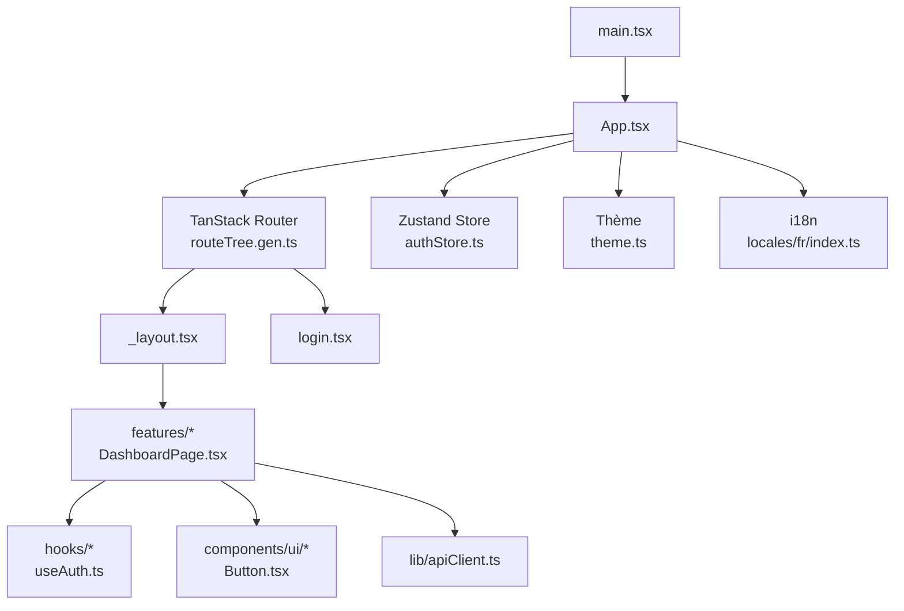
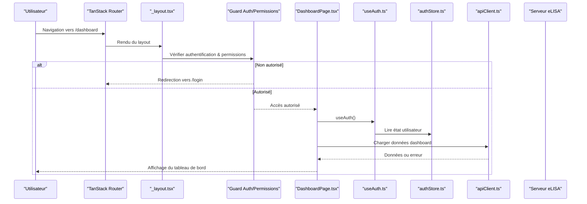
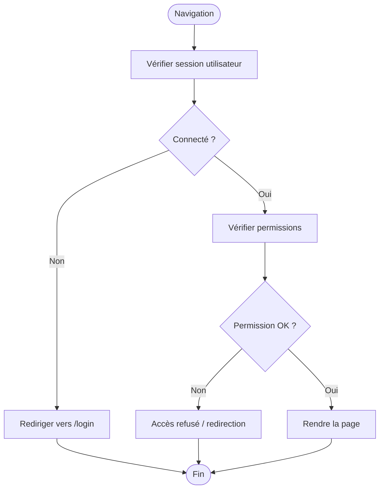
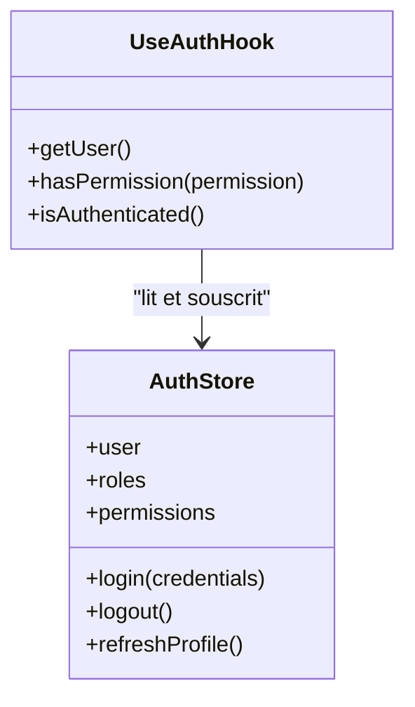
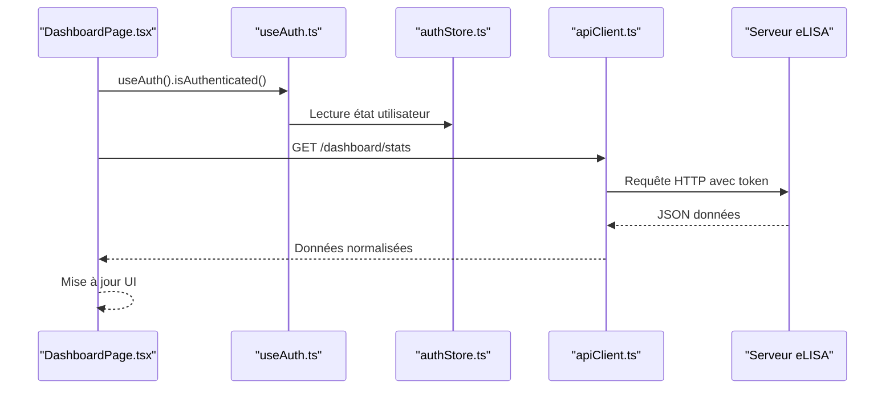
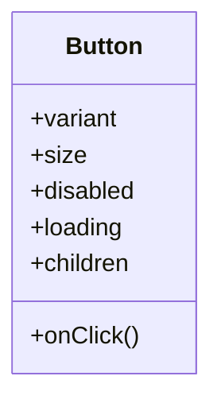
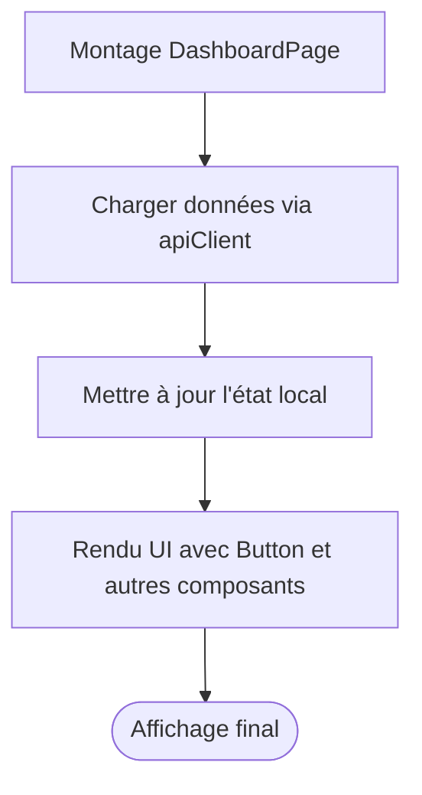
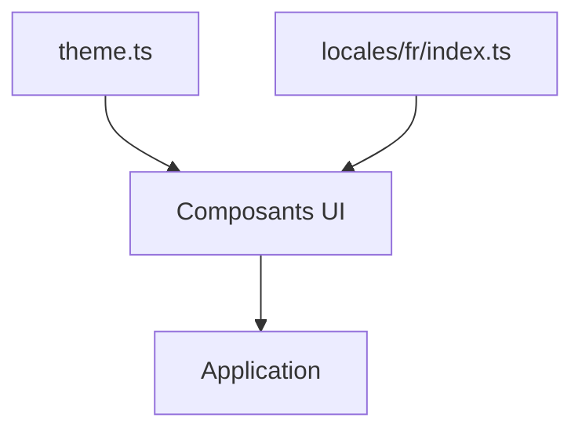
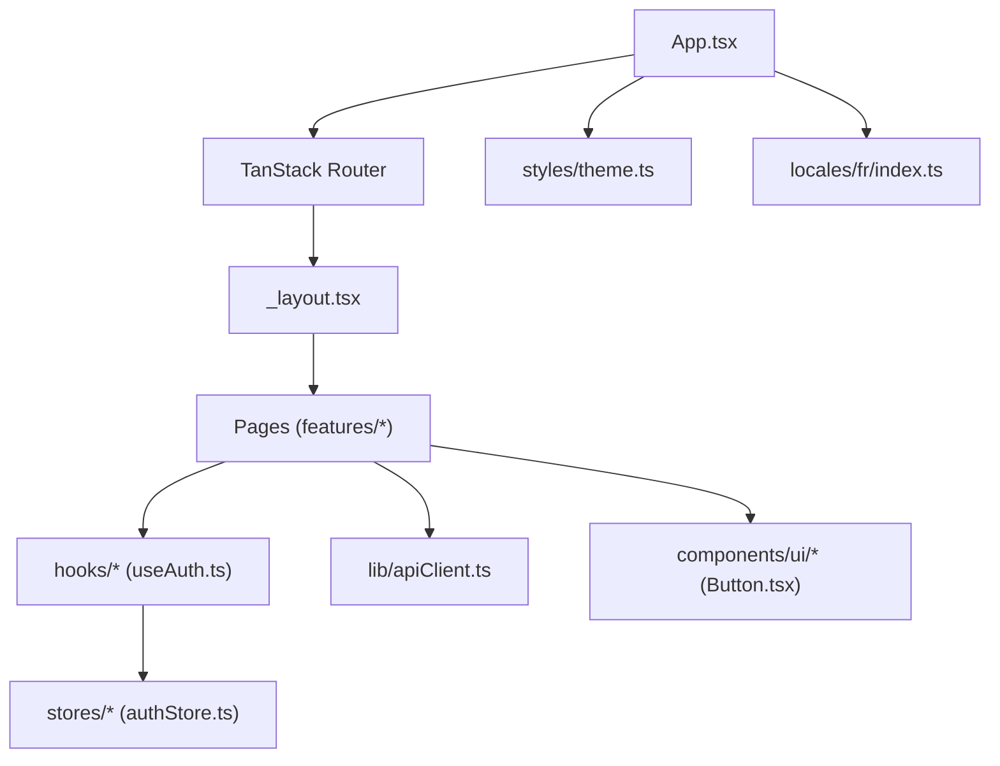

# Architecture Frontend React

<cite>
**Fichiers référencés dans ce document**
- [App.tsx](file://frontend/src/App.tsx)
- [main.tsx](file://frontend/src/main.tsx)
- [vite.config.ts](file://frontend/vite.config.ts)
- [routeTree.gen.ts](file://frontend/src/routeTree.gen.ts)
- [package.json](file://frontend/package.json)
- [stores/authStore.ts](file://frontend/src/stores/authStore.ts)
- [hooks/useAuth.ts](file://frontend/src/hooks/useAuth.ts)
- [components/ui/Button.tsx](file://frontend/src/components/ui/Button.tsx)
- [features/dashboard/DashboardPage.tsx](file://frontend/src/features/dashboard/DashboardPage.tsx)
- [routes/_layout.tsx](file://frontend/src/routes/_layout.tsx)
- [routes/login.tsx](file://frontend/src/routes/login.tsx)
- [lib/apiClient.ts](file://frontend/src/lib/apiClient.ts)
- [locales/fr/index.ts](file://frontend/src/locales/fr/index.ts)
- [styles/theme.ts](file://frontend/src/styles/theme.ts)
</cite>

## Table des matières
1. [Introduction](#introduction)
2. [Structure du projet](#structure-du-projet)
3. [Composants clés](#composants-clés)
4. [Vue d'ensemble de l'architecture](#vue-densemble-de-larchitecture)
5. [Analyse détaillée des composants](#analyse-détaillée-des-composants)
6. [Analyse des dépendances](#analyse-des-dépendances)
7. [Considérations de performance](#considérations-de-performance)
8. [Guide de dépannage](#guide-de-dépannage)
9. [Conclusion](#conclusion)
10. [Annexes](#annexes)

## Introduction
Ce document décrit l’architecture frontend React d’eLISAschool, centrée sur TanStack Router pour le routage, Zustand pour la gestion d’état global, et une organisation modulaire par fonctionnalités (features), composants UI réutilisables et hooks personnalisés. Il couvre les guards d’authentification et de permissions, l’intégration API avec un client centralisé, le système de thème et d’internationalisation (i18n), ainsi que les stratégies de performance telles que le chargement paresseux et le partage de code. Des exemples concrets illustrent la création d’une page, d’un hook personnalisé et d’un composant réutilisable. Les bonnes pratiques React, le responsive design et l’accessibilité sont également abordés.

## Structure du projet
Le frontend est organisé selon une architecture modulaire :
- Entrées et configuration : main.tsx, App.tsx, vite.config.ts, package.json
- Routage : routeTree.gen.ts généré par TanStack Router, fichiers de routes manuelles (_layout.tsx, login.tsx, etc.)
- État global : stores/ (Zustand)
- Hooks personnalisés : hooks/
- Fonctionnalités : features/ (regroupées par domaine métier)
- Composants UI : components/ui/ (briques réutilisables)
- Intégration API : lib/apiClient.ts
- Internationalisation : locales/
- Thème et styles : styles/theme.ts

**Sources des diagrammes**
- [main.tsx](file://frontend/src/main.tsx)
- [App.tsx](file://frontend/src/App.tsx)
- [routeTree.gen.ts](file://frontend/src/routeTree.gen.ts)
- [stores/authStore.ts](file://frontend/src/stores/authStore.ts)
- [hooks/useAuth.ts](file://frontend/src/hooks/useAuth.ts)
- [components/ui/Button.tsx](file://frontend/src/components/ui/Button.tsx)
- [features/dashboard/DashboardPage.tsx](file://frontend/src/features/dashboard/DashboardPage.tsx)
- [routes/_layout.tsx](file://frontend/src/routes/_layout.tsx)
- [routes/login.tsx](file://frontend/src/routes/login.tsx)
- [lib/apiClient.ts](file://frontend/src/lib/apiClient.ts)
- [locales/fr/index.ts](file://frontend/src/locales/fr/index.ts)
- [styles/theme.ts](file://frontend/src/styles/theme.ts)

**Sources de section**
- [package.json](file://frontend/package.json)
- [vite.config.ts](file://frontend/vite.config.ts)

## Composants clés
- Routage avec TanStack Router : définition des routes, layouts et guards via le routeTree généré et les fichiers de routes manuels.
- Gestion d’état avec Zustand : store authStore.ts expose l’état d’authentification et les actions associées.
- Hooks personnalisés : useAuth.ts encapsule la logique d’accès à l’état d’authentification et aux métadonnées utilisateur.
- Composants UI : Button.tsx comme exemple de brique réutilisable avec props typées et accessibilité intégrée.
- Fonctionnalités : DashboardPage.tsx montre la composition d’une page métier utilisant hooks, UI et API.
- Client API : apiClient.ts centralise les requêtes HTTP, erreurs et transformations de données.
- Thème et i18n : theme.ts définit les tokens visuels ; locales/fr/index.ts fournit les traductions.

**Sources de section**
- [routes/_layout.tsx](file://frontend/src/routes/_layout.tsx)
- [routes/login.tsx](file://frontend/src/routes/login.tsx)
- [stores/authStore.ts](file://frontend/src/stores/authStore.ts)
- [hooks/useAuth.ts](file://frontend/src/hooks/useAuth.ts)
- [components/ui/Button.tsx](file://frontend/src/components/ui/Button.tsx)
- [features/dashboard/DashboardPage.tsx](file://frontend/src/features/dashboard/DashboardPage.tsx)
- [lib/apiClient.ts](file://frontend/src/lib/apiClient.ts)
- [locales/fr/index.ts](file://frontend/src/locales/fr/index.ts)
- [styles/theme.ts](file://frontend/src/styles/theme.ts)

## Vue d'ensemble de l'architecture
L’application démarre via main.tsx qui monte App.tsx. Le router TanStack est configuré et alimenté par routeTree.gen.ts. Le layout _layout.tsx applique le thème et gère les guards d’authentification et de permissions. Les pages (features) utilisent des hooks (useAuth) et des composants UI (Button). Les appels backend passent par apiClient.ts. L’état global est partagé via Zustand (authStore.ts). L’i18n est activée via les fichiers de traduction.

**Sources des diagrammes**
- [routes/_layout.tsx](file://frontend/src/routes/_layout.tsx)
- [features/dashboard/DashboardPage.tsx](file://frontend/src/features/dashboard/DashboardPage.tsx)
- [hooks/useAuth.ts](file://frontend/src/hooks/useAuth.ts)
- [stores/authStore.ts](file://frontend/src/stores/authStore.ts)
- [lib/apiClient.ts](file://frontend/src/lib/apiClient.ts)

## Analyse détaillée des composants

### Système de routage et guards
- TanStack Router organise les routes via routeTree.gen.ts et les fichiers manuels (_layout.tsx, login.tsx).
- Le layout _layout.tsx intègre les guards d’authentification et de permissions avant le rendu des pages.
- Exemple de flux : navigation -> layout -> guard -> page autorisée ou redirection.

**Sources des diagrammes**
- [routes/_layout.tsx](file://frontend/src/routes/_layout.tsx)
- [routes/login.tsx](file://frontend/src/routes/login.tsx)

**Sources de section**
- [routeTree.gen.ts](file://frontend/src/routeTree.gen.ts)
- [routes/_layout.tsx](file://frontend/src/routes/_layout.tsx)
- [routes/login.tsx](file://frontend/src/routes/login.tsx)

### Gestion d’état avec Zustand
- authStore.ts expose l’état utilisateur, les rôles/permissions et les actions (connexion, déconnexion, mise à jour).
- useAuth.ts fournit un hook simple pour consommer l’état dans les composants/pages.

**Sources des diagrammes**
- [stores/authStore.ts](file://frontend/src/stores/authStore.ts)
- [hooks/useAuth.ts](file://frontend/src/hooks/useAuth.ts)

**Sources de section**
- [stores/authStore.ts](file://frontend/src/stores/authStore.ts)
- [hooks/useAuth.ts](file://frontend/src/hooks/useAuth.ts)

### Intégration API
- apiClient.ts centralise les requêtes HTTP, la gestion des erreurs, les en-têtes d’authentification et les transformations de réponses.
- Les pages (ex. DashboardPage.tsx) appellent apiClient pour charger les données métier.

**Sources des diagrammes**
- [features/dashboard/DashboardPage.tsx](file://frontend/src/features/dashboard/DashboardPage.tsx)
- [hooks/useAuth.ts](file://frontend/src/hooks/useAuth.ts)
- [stores/authStore.ts](file://frontend/src/stores/authStore.ts)
- [lib/apiClient.ts](file://frontend/src/lib/apiClient.ts)

**Sources de section**
- [lib/apiClient.ts](file://frontend/src/lib/apiClient.ts)
- [features/dashboard/DashboardPage.tsx](file://frontend/src/features/dashboard/DashboardPage.tsx)

### Composants UI réutilisables
- Button.tsx illustre un composant accessible avec props typées, gestion des états (disabled, loading) et support i18n.

**Sources des diagrammes**
- [components/ui/Button.tsx](file://frontend/src/components/ui/Button.tsx)

**Sources de section**
- [components/ui/Button.tsx](file://frontend/src/components/ui/Button.tsx)

### Pages et composition de fonctionnalités
- DashboardPage.tsx combine hooks, UI et API pour afficher des statistiques. Elle respecte la séparation des responsabilités et la composition modulaire.

**Sources des diagrammes**
- [features/dashboard/DashboardPage.tsx](file://frontend/src/features/dashboard/DashboardPage.tsx)

**Sources de section**
- [features/dashboard/DashboardPage.tsx](file://frontend/src/features/dashboard/DashboardPage.tsx)

### Thème et internationalisation
- theme.ts définit les tokens de couleur, typographie et espacement.
- locales/fr/index.ts contient les clés de traduction utilisées par les composants et pages.

**Sources des diagrammes**
- [styles/theme.ts](file://frontend/src/styles/theme.ts)
- [locales/fr/index.ts](file://frontend/src/locales/fr/index.ts)

**Sources de section**
- [styles/theme.ts](file://frontend/src/styles/theme.ts)
- [locales/fr/index.ts](file://frontend/src/locales/fr/index.ts)

## Analyse des dépendances
Les modules frontend interagissent selon les relations suivantes :
- App.tsx orchestre le montage de l’application et configure le router.
- Le router charge _layout.tsx qui applique les guards et rend les pages.
- Les pages consomment useAuth.ts et appellent apiClient.ts.
- Zustand (authStore.ts) est utilisé par useAuth.ts et les pages.
- Les composants UI (Button.tsx) sont utilisés par les pages.
- Le thème et l’i18n sont injectés au niveau de l’application.

**Sources des diagrammes**
- [App.tsx](file://frontend/src/App.tsx)
- [routes/_layout.tsx](file://frontend/src/routes/_layout.tsx)
- [features/dashboard/DashboardPage.tsx](file://frontend/src/features/dashboard/DashboardPage.tsx)
- [hooks/useAuth.ts](file://frontend/src/hooks/useAuth.ts)
- [stores/authStore.ts](file://frontend/src/stores/authStore.ts)
- [lib/apiClient.ts](file://frontend/src/lib/apiClient.ts)
- [components/ui/Button.tsx](file://frontend/src/components/ui/Button.tsx)
- [styles/theme.ts](file://frontend/src/styles/theme.ts)
- [locales/fr/index.ts](file://frontend/src/locales/fr/index.ts)

**Sources de section**
- [App.tsx](file://frontend/src/App.tsx)
- [routeTree.gen.ts](file://frontend/src/routeTree.gen.ts)

## Considérations de performance
- Chargement paresseux et partage de code : utiliser le lazy loading de TanStack Router pour les routes lourdes et configurer Vite (vite.config.ts) pour le code splitting.
- Optimisation des bundles : analyser les dépendances via le build Vite et externaliser les bibliothèques volumineuses si nécessaire.
- Cache des données : implémenter un cache côté client (par ex. SWR/React Query) autour d’apiClient.ts pour éviter les requêtes redondantes.
- Rendu efficace : mémoriser les composants coûteux avec React.memo et éviter les re-rendus inutiles dans les hooks.
- Images et assets : optimiser les images et utiliser des formats modernes (WebP) pour réduire le poids des ressources.

[Pas de sources nécessaires car cette section propose des recommandations générales]

## Guide de dépannage
- Problèmes d’authentification : vérifier le stockage du token, les appels de refresh et les guards dans _layout.tsx.
- Erreurs API : inspecter les réponses d’apiClient.ts et les logs d’erreurs ; valider les endpoints et les en-têtes.
- Permissions : s’assurer que les permissions sont bien synchronisées avec le backend et que les guards les vérifient correctement.
- Performance : utiliser les outils de profiling React et les métriques de bundle pour identifier les goulets d’étranglement.
- i18n : vérifier la présence des clés de traduction et leur chargement dynamique.

**Sources de section**
- [routes/_layout.tsx](file://frontend/src/routes/_layout.tsx)
- [lib/apiClient.ts](file://frontend/src/lib/apiClient.ts)
- [hooks/useAuth.ts](file://frontend/src/hooks/useAuth.ts)
- [stores/authStore.ts](file://frontend/src/stores/authStore.ts)

## Conclusion
L’architecture frontend d’eLISAschool repose sur une combinaison robuste de TanStack Router, Zustand et une organisation modulaire par fonctionnalités. Cette approche favorise la maintenabilité, la scalabilité et la lisibilité du code. Les guards d’authentification et de permissions assurent la sécurité, tandis que le client API centralisé simplifie l’intégration backend. Le thème et l’i18n permettent une expérience utilisateur cohérente et accessible. Les stratégies de performance (lazy loading, code splitting, caching) garantissent une application rapide et réactive.

[Pas de sources nécessaires car cette section résume sans analyser de fichiers spécifiques]

## Annexes
- Exemple de création d’une page : voir [features/dashboard/DashboardPage.tsx](file://frontend/src/features/dashboard/DashboardPage.tsx)
- Exemple de hook personnalisé : voir [hooks/useAuth.ts](file://frontend/src/hooks/useAuth.ts)
- Exemple de composant réutilisable : voir [components/ui/Button.tsx](file://frontend/src/components/ui/Button.tsx)
- Configuration du build et du proxy : voir [vite.config.ts](file://frontend/vite.config.ts) et [package.json](file://frontend/package.json)

**Sources de section**
- [features/dashboard/DashboardPage.tsx](file://frontend/src/features/dashboard/DashboardPage.tsx)
- [hooks/useAuth.ts](file://frontend/src/hooks/useAuth.ts)
- [components/ui/Button.tsx](file://frontend/src/components/ui/Button.tsx)
- [vite.config.ts](file://frontend/vite.config.ts)
- [package.json](file://frontend/package.json)