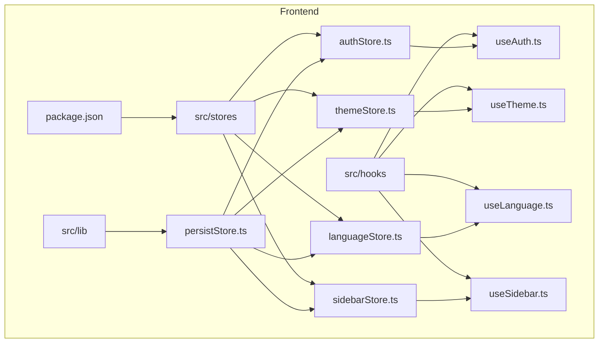
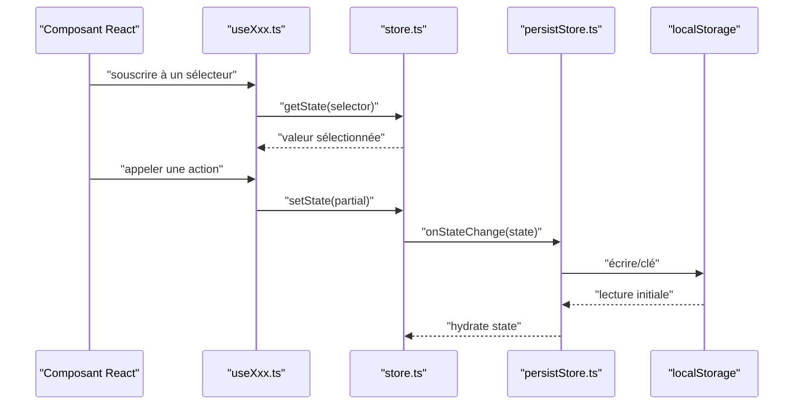
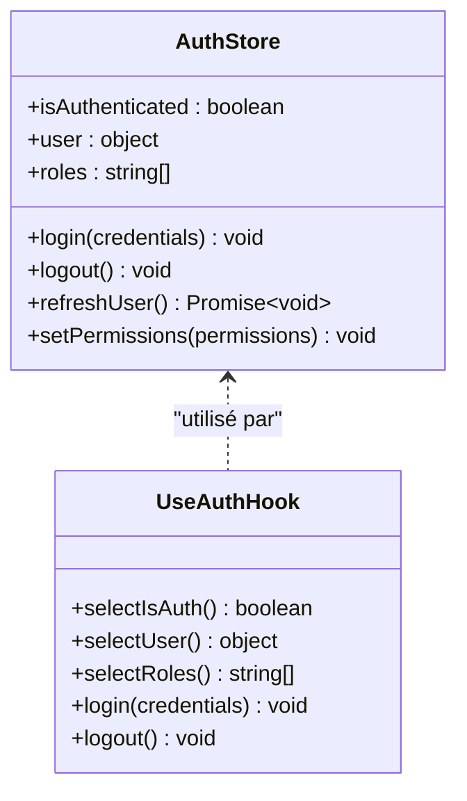
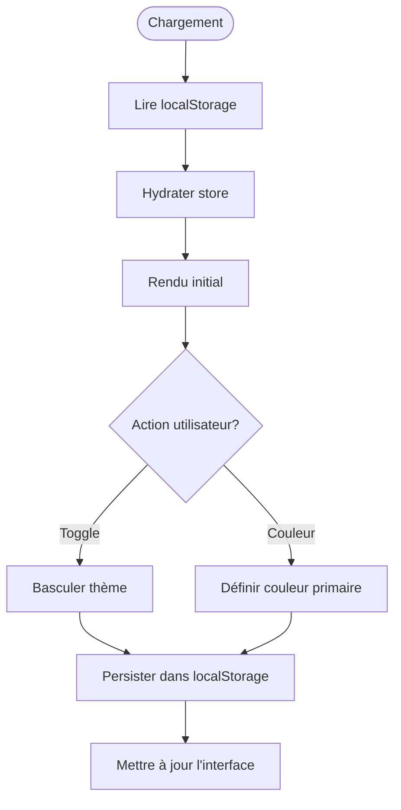
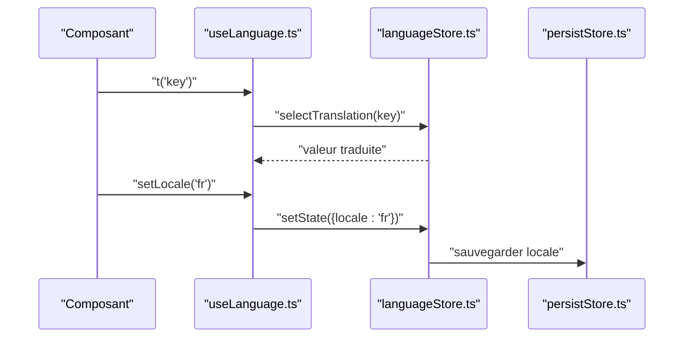
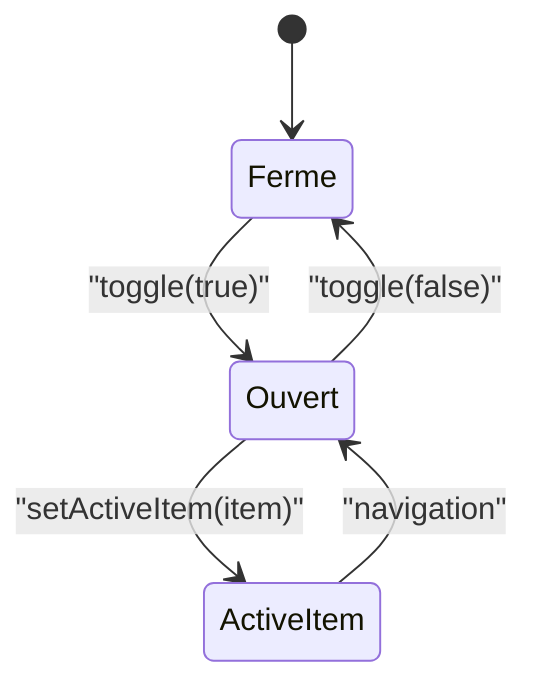
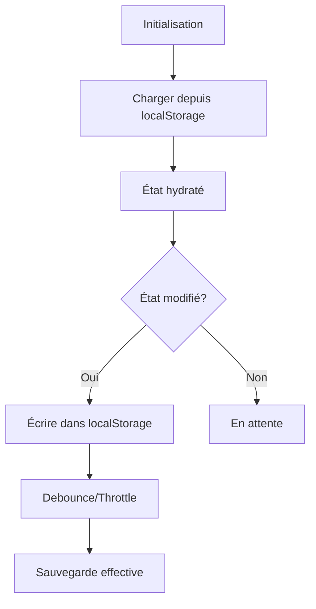
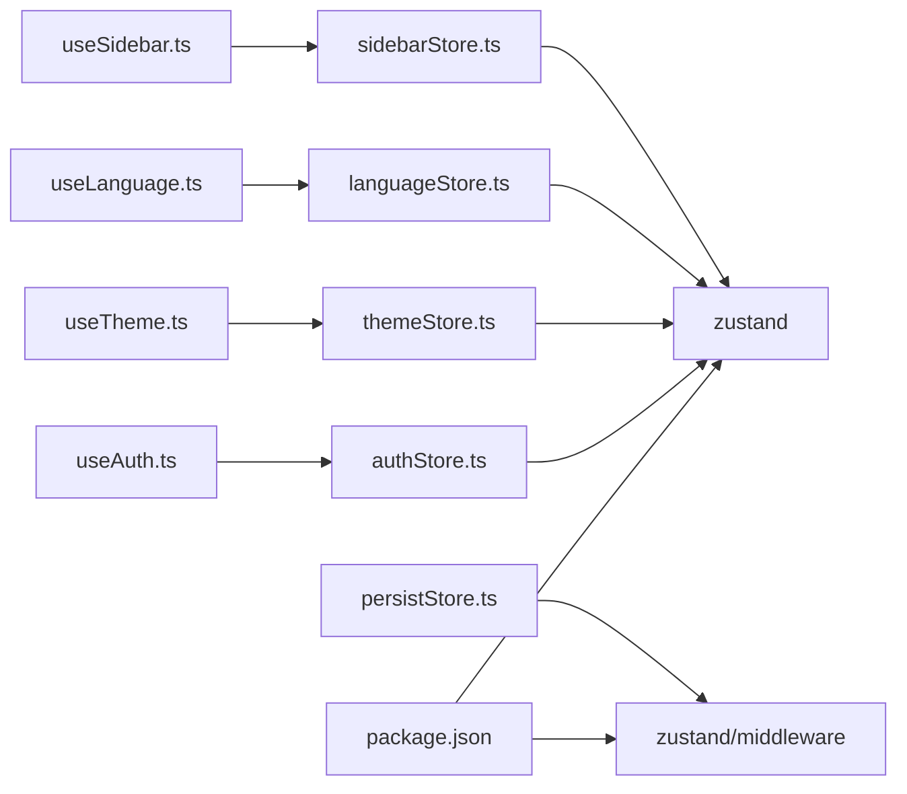

# Gestion d'État avec Zustand

<cite>
**Fichiers référencés dans ce document**
- [frontend/src/stores/authStore.ts](file://frontend/src/stores/authStore.ts)
- [frontend/src/stores/themeStore.ts](file://frontend/src/stores/themeStore.ts)
- [frontend/src/stores/languageStore.ts](file://frontend/src/stores/languageStore.ts)
- [frontend/src/stores/sidebarStore.ts](file://frontend/src/stores/sidebarStore.ts)
- [frontend/src/hooks/useAuth.ts](file://frontend/src/hooks/useAuth.ts)
- [frontend/src/hooks/useTheme.ts](file://frontend/src/hooks/useTheme.ts)
- [frontend/src/hooks/useLanguage.ts](file://frontend/src/hooks/useLanguage.ts)
- [frontend/src/hooks/useSidebar.ts](file://frontend/src/hooks/useSidebar.ts)
- [frontend/src/lib/persistStore.ts](file://frontend/src/lib/persistStore.ts)
- [frontend/package.json](file://frontend/package.json)
</cite>

## Table des matières
1. [Introduction](#introduction)
2. [Structure du projet](#structure-du-projet)
3. [Composants clés](#composants-clés)
4. [Vue d'ensemble de l'architecture](#vue-densemble-de-larchitecture)
5. [Analyse détaillée des composants](#analyse-detailee-des-composants)
6. [Analyse des dépendances](#analyse-des-dependances)
7. [Considérations de performance](#considerations-de-performance)
8. [Guide de dépannage](#guide-de-depannage)
9. [Conclusion](#conclusion)
10. [Annexes](#annexes)

## Introduction
Ce document explique la gestion d'état avec Zustand dans eLISAschool. Il couvre l'architecture des stores, les patterns de sélection d'état, les middleware personnalisés, et l'intégration avec React hooks. Il documente le store d'authentification, le thème, la langue et la sidebar, avec des exemples concrets de création de store, sélecteurs performants, persistance locale et mise à jour d'état. Il inclut également les bonnes pratiques de structuration, les tests de stores et l'optimisation des re-rendus grâce aux sélecteurs.

## Structure du projet
Le frontend organise les stores Zustand dans un dossier dédié, expose des hooks par domaine (auth, theme, language, sidebar), et centralise la logique de persistance via un utilitaire. Les dépendances sont déclarées dans package.json.

**Sources de diagramme**
- [frontend/src/stores/authStore.ts](file://frontend/src/stores/authStore.ts)
- [frontend/src/stores/themeStore.ts](file://frontend/src/stores/themeStore.ts)
- [frontend/src/stores/languageStore.ts](file://frontend/src/stores/languageStore.ts)
- [frontend/src/stores/sidebarStore.ts](file://frontend/src/stores/sidebarStore.ts)
- [frontend/src/hooks/useAuth.ts](file://frontend/src/hooks/useAuth.ts)
- [frontend/src/hooks/useTheme.ts](file://frontend/src/hooks/useTheme.ts)
- [frontend/src/hooks/useLanguage.ts](file://frontend/src/hooks/useLanguage.ts)
- [frontend/src/hooks/useSidebar.ts](file://frontend/src/hooks/useSidebar.ts)
- [frontend/src/lib/persistStore.ts](file://frontend/src/lib/persistStore.ts)
- [frontend/package.json](file://frontend/package.json)

**Sources de section**
- [frontend/package.json](file://frontend/package.json)

## Composants clés
- Stores Zustand: authStore, themeStore, languageStore, sidebarStore
- Hooks React: useAuth, useTheme, useLanguage, useSidebar
- Persistance: persistStore (middleware personnalisé pour localStorage)
- Dépendances: Zustand et plugins de persistance

**Sources de section**
- [frontend/src/stores/authStore.ts](file://frontend/src/stores/authStore.ts)
- [frontend/src/stores/themeStore.ts](file://frontend/src/stores/themeStore.ts)
- [frontend/src/stores/languageStore.ts](file://frontend/src/stores/languageStore.ts)
- [frontend/src/stores/sidebarStore.ts](file://frontend/src/stores/sidebarStore.ts)
- [frontend/src/hooks/useAuth.ts](file://frontend/src/hooks/useAuth.ts)
- [frontend/src/hooks/useTheme.ts](file://frontend/src/hooks/useTheme.ts)
- [frontend/src/hooks/useLanguage.ts](file://frontend/src/hooks/useLanguage.ts)
- [frontend/src/hooks/useSidebar.ts](file://frontend/src/hooks/useSidebar.ts)
- [frontend/src/lib/persistStore.ts](file://frontend/src/lib/persistStore.ts)
- [frontend/package.json](file://frontend/package.json)

## Vue d'ensemble de l'architecture
Les stores exposent un état minimal et des actions. Les hooks lisent uniquement les fragments nécessaires via des sélecteurs, limitant les re-rendus. La persistance est assurée par un middleware qui synchronise l'état avec localStorage.

**Sources de diagramme**
- [frontend/src/hooks/useAuth.ts](file://frontend/src/hooks/useAuth.ts)
- [frontend/src/hooks/useTheme.ts](file://frontend/src/hooks/useTheme.ts)
- [frontend/src/hooks/useLanguage.ts](file://frontend/src/hooks/useLanguage.ts)
- [frontend/src/hooks/useSidebar.ts](file://frontend/src/hooks/useSidebar.ts)
- [frontend/src/stores/authStore.ts](file://frontend/src/stores/authStore.ts)
- [frontend/src/stores/themeStore.ts](file://frontend/src/stores/themeStore.ts)
- [frontend/src/stores/languageStore.ts](file://frontend/src/stores/languageStore.ts)
- [frontend/src/stores/sidebarStore.ts](file://frontend/src/stores/sidebarStore.ts)
- [frontend/src/lib/persistStore.ts](file://frontend/src/lib/persistStore.ts)

## Analyse détaillée des composants

### Store d'authentification
- Responsabilités: gérer l'état de connexion, les informations utilisateur, les permissions et les actions de login/logout.
- Sélecteurs typiques: isAuth, user, roles/permissions.
- Actions: login, logout, refreshUser, setPermissions.
- Intégration hook: useAuth expose getState et setters.

**Sources de diagramme**
- [frontend/src/stores/authStore.ts](file://frontend/src/stores/authStore.ts)
- [frontend/src/hooks/useAuth.ts](file://frontend/src/hooks/useAuth.ts)

**Sources de section**
- [frontend/src/stores/authStore.ts](file://frontend/src/stores/authStore.ts)
- [frontend/src/hooks/useAuth.ts](file://frontend/src/hooks/useAuth.ts)

### Store de thème
- Responsabilités: mode clair/sombre, couleurs primaires, préférences locales.
- Sélecteurs: themeMode, primaryColor, isDark.
- Actions: toggleTheme, setPrimaryColor.
- Persistance: sauvegarde des préférences dans localStorage.

**Sources de diagramme**
- [frontend/src/stores/themeStore.ts](file://frontend/src/stores/themeStore.ts)
- [frontend/src/lib/persistStore.ts](file://frontend/src/lib/persistStore.ts)

**Sources de section**
- [frontend/src/stores/themeStore.ts](file://frontend/src/stores/themeStore.ts)
- [frontend/src/hooks/useTheme.ts](file://frontend/src/hooks/useTheme.ts)
- [frontend/src/lib/persistStore.ts](file://frontend/src/lib/persistStore.ts)

### Store de langue
- Responsabilités: langue courante, dictionnaires, basculement de langue.
- Sélecteurs: currentLocale, t(key).
- Actions: setLocale, loadTranslations.
- Persistance: mémorisation de la langue préférée.

**Sources de diagramme**
- [frontend/src/stores/languageStore.ts](file://frontend/src/stores/languageStore.ts)
- [frontend/src/hooks/useLanguage.ts](file://frontend/src/hooks/useLanguage.ts)
- [frontend/src/lib/persistStore.ts](file://frontend/src/lib/persistStore.ts)

**Sources de section**
- [frontend/src/stores/languageStore.ts](file://frontend/src/stores/languageStore.ts)
- [frontend/src/hooks/useLanguage.ts](file://frontend/src/hooks/useLanguage.ts)
- [frontend/src/lib/persistStore.ts](file://frontend/src/lib/persistStore.ts)

### Store de sidebar
- Responsabilités: état ouvert/fermé, éléments actifs, navigation.
- Sélecteurs: isOpen, activeItem.
- Actions: toggleSidebar, setActiveItem.
- Persistance: optionnelle selon besoin.

**Sources de diagramme**
- [frontend/src/stores/sidebarStore.ts](file://frontend/src/stores/sidebarStore.ts)
- [frontend/src/hooks/useSidebar.ts](file://frontend/src/hooks/useSidebar.ts)

**Sources de section**
- [frontend/src/stores/sidebarStore.ts](file://frontend/src/stores/sidebarStore.ts)
- [frontend/src/hooks/useSidebar.ts](file://frontend/src/hooks/useSidebar.ts)

### Middleware de persistance (persistStore)
- Fonctionnalités: hydrate au démarrage, écriture asynchrone sur changement d'état, clé unique par store.
- Bonnes pratiques: debounce ou batch writes, gestion d'erreurs, validation de schéma.

**Sources de diagramme**
- [frontend/src/lib/persistStore.ts](file://frontend/src/lib/persistStore.ts)

**Sources de section**
- [frontend/src/lib/persistStore.ts](file://frontend/src/lib/persistStore.ts)

## Analyse des dépendances
Zustand et ses plugins sont utilisés pour créer et persister les stores. Les hooks importent les stores et exposent des sélecteurs spécifiques.

**Sources de diagramme**
- [frontend/package.json](file://frontend/package.json)
- [frontend/src/stores/authStore.ts](file://frontend/src/stores/authStore.ts)
- [frontend/src/stores/themeStore.ts](file://frontend/src/stores/themeStore.ts)
- [frontend/src/stores/languageStore.ts](file://frontend/src/stores/languageStore.ts)
- [frontend/src/stores/sidebarStore.ts](file://frontend/src/stores/sidebarStore.ts)
- [frontend/src/hooks/useAuth.ts](file://frontend/src/hooks/useAuth.ts)
- [frontend/src/hooks/useTheme.ts](file://frontend/src/hooks/useTheme.ts)
- [frontend/src/hooks/useLanguage.ts](file://frontend/src/hooks/useLanguage.ts)
- [frontend/src/hooks/useSidebar.ts](file://frontend/src/hooks/useSidebar.ts)
- [frontend/src/lib/persistStore.ts](file://frontend/src/lib/persistStore.ts)

**Sources de section**
- [frontend/package.json](file://frontend/package.json)

## Considérations de performance
- Utiliser des sélecteurs fins pour limiter les re-rendus.
- Éviter de sélectionner tout l'état; préférer des slices.
- Grouper les mises à jour quand c'est possible.
- Débouncer les écritures en localStorage si nécessaire.
- Préférer des fonctions memoisées pour les transformations.

[Section sans sources spécifiques]

## Guide de dépannage
- Problème: re-rendus excessifs
  - Vérifier que les sélecteurs ne retournent pas d'objets nouveaux à chaque appel.
  - Utiliser des comparateurs shallow ou custom si nécessaire.
- Problème: persistance incohérente
  - S'assurer que la clé localStorage est unique par store.
  - Valider le schéma lors de l'hydratation.
- Problème: état non mis à jour
  - Confirmer que setState est appelé avec un objet partiel correct.
  - Vérifier que le middleware persist n'intercepte pas l'action.

[Section sans sources spécifiques]

## Conclusion
L'utilisation de Zustand dans eLISAschool permet une architecture claire et performante: stores simples, hooks spécialisés, persistance fiable et sélecteurs précis. En suivant les bonnes pratiques de sélection et de structuration, on obtient une application réactive et maintenable.

[Section sans sources spécifiques]

## Annexes
- Exemples de création de store: définir l'état initial, exposer des actions, utiliser le middleware persist.
- Exemples de sélecteurs performants: extraire des slices, éviter les allocations inutiles.
- Tests de stores: tester les actions et les états résultants, simuler localStorage.
- Optimisation des re-rendus: sélecteurs stables, comparaison shallow, regroupement d'états.

[Section sans sources spécifiques]