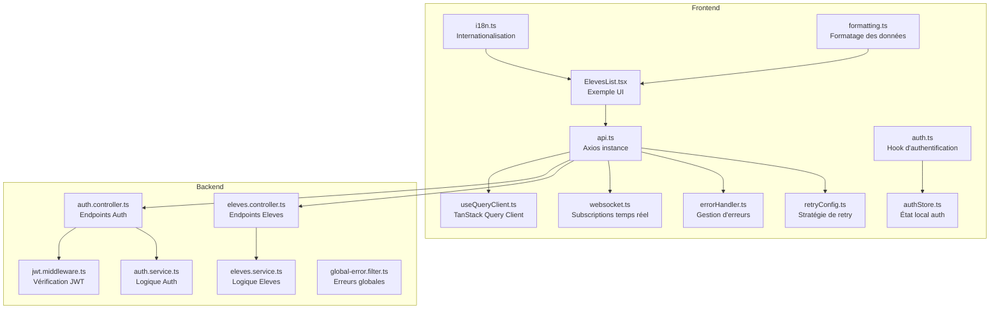
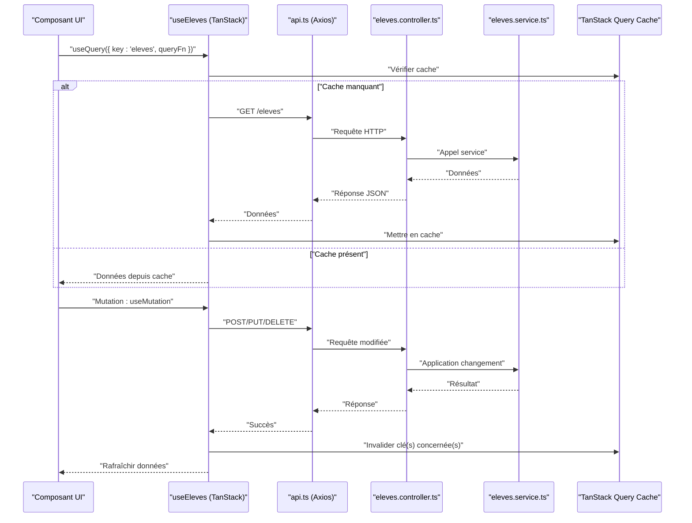
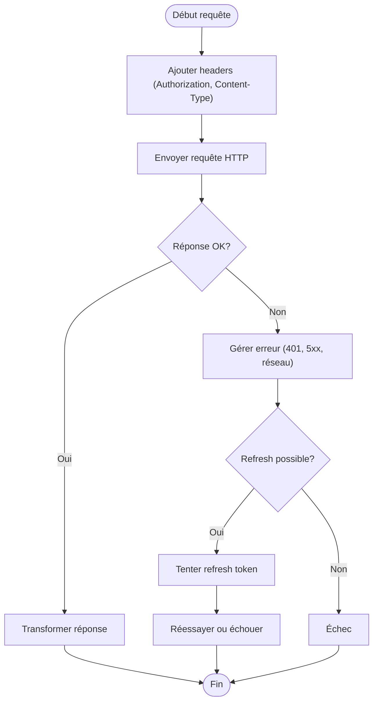
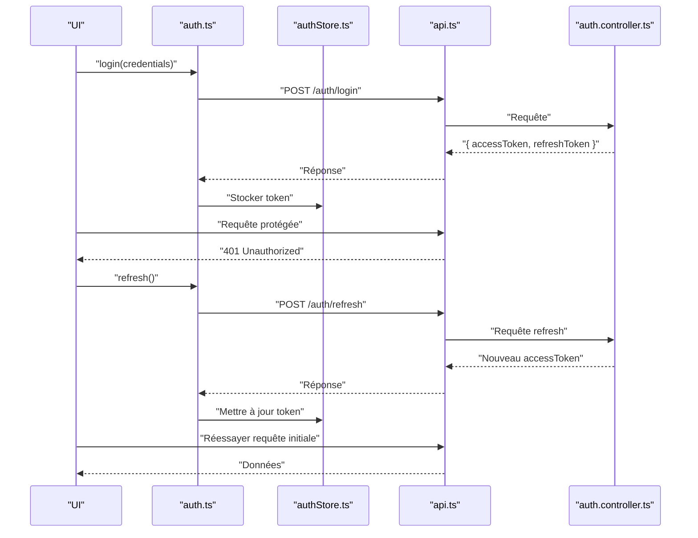
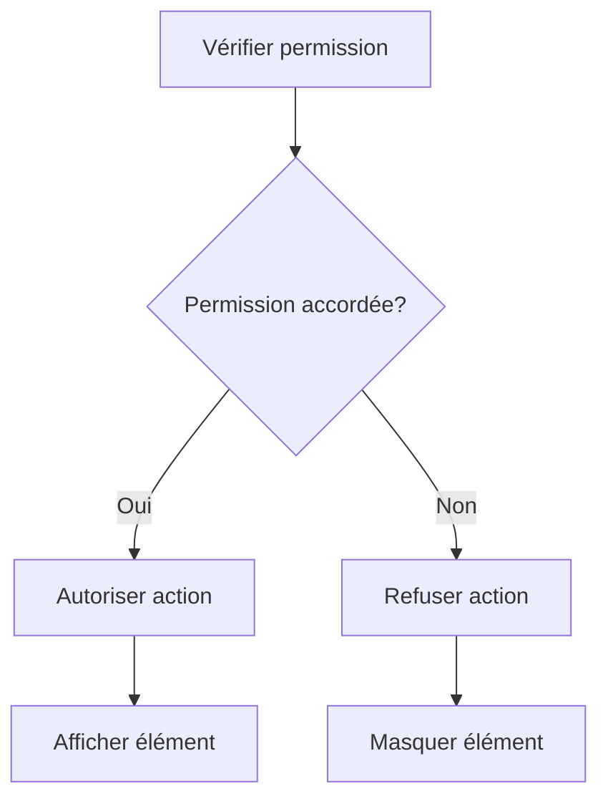
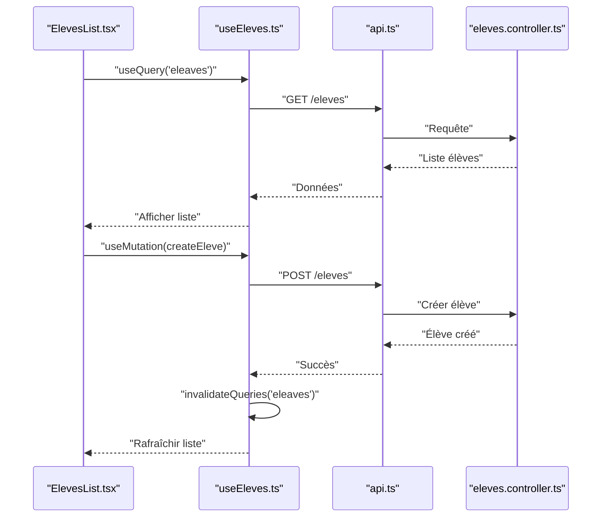
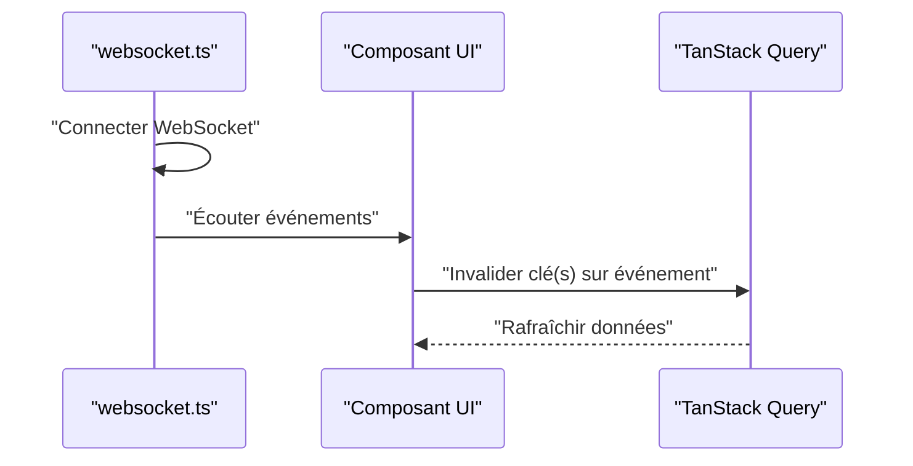
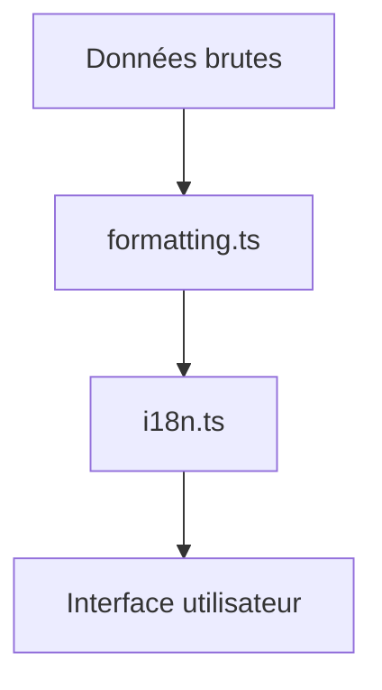
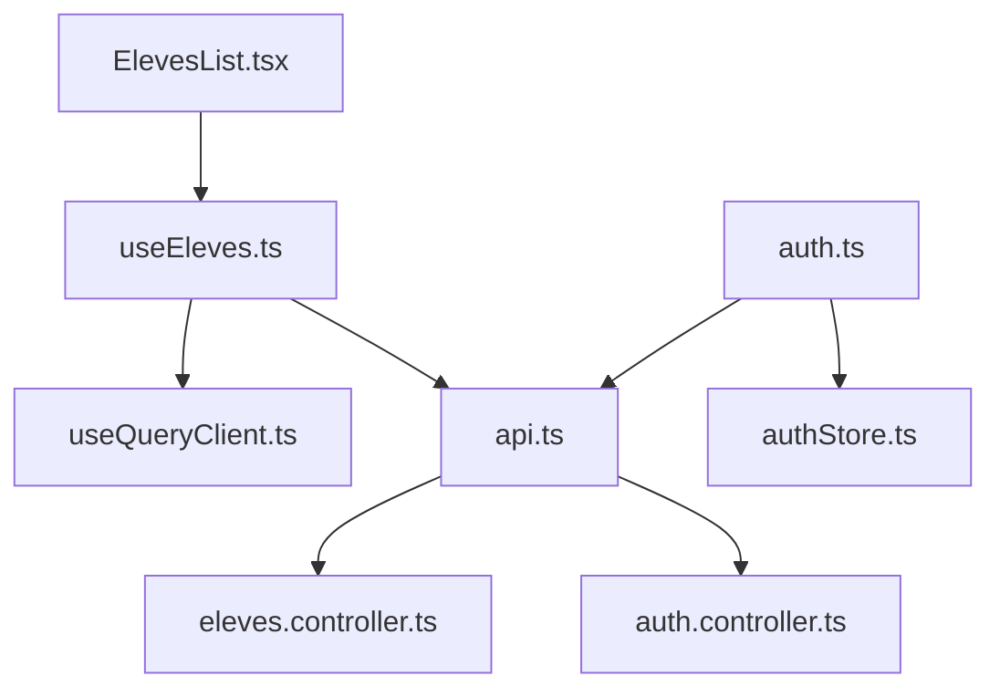

# Intégration API Backend

<cite>
**Fichiers référencés dans ce document**
- [frontend/src/lib/api.ts](file://frontend/src/lib/api.ts)
- [frontend/src/hooks/useQueryClient.ts](file://frontend/src/hooks/useQueryClient.ts)
- [frontend/src/hooks/auth.ts](file://frontend/src/hooks/auth.ts)
- [frontend/src/features/auth/services/authService.ts](file://frontend/src/features/auth/services/authService.ts)
- [frontend/src/features/eleves/services/eleveService.ts](file://frontend/src/features/eleves/services/eleveService.ts)
- [frontend/src/features/eleves/hooks/useEleves.ts](file://frontend/src/features/eleves/hooks/useEleves.ts)
- [frontend/src/features/eleves/components/ElevesList.tsx](file://frontend/src/features/eleves/components/ElevesList.tsx)
- [frontend/src/stores/authStore.ts](file://frontend/src/stores/authStore.ts)
- [frontend/src/lib/i18n.ts](file://frontend/src/lib/i18n.ts)
- [frontend/src/lib/formatting.ts](file://frontend/src/lib/formatting.ts)
- [frontend/src/lib/errorHandler.ts](file://frontend/src/lib/errorHandler.ts)
- [frontend/src/lib/retryConfig.ts](file://frontend/src/lib/retryConfig.ts)
- [frontend/src/lib/websocket.ts](file://frontend/src/lib/websocket.ts)
- [backend/src/modules/auth/controllers/auth.controller.ts](file://backend/src/modules/auth/controllers/auth.controller.ts)
- [backend/src/modules/auth/middlewares/jwt.middleware.ts](file://backend/src/modules/auth/middlewares/jwt.middleware.ts)
- [backend/src/modules/auth/services/auth.service.ts](file://backend/src/modules/auth/services/auth.service.ts)
- [backend/src/modules/eleves/controllers/eleves.controller.ts](file://backend/src/modules/eleves/controllers/eleves.controller.ts)
- [backend/src/modules/eleves/services/eleves.service.ts](file://backend/src/modules/eleves/services/eleves.service.ts)
- [backend/src/common/filters/global-error.filter.ts](file://backend/src/common/filters/global-error.filter.ts)
</cite>

## Table des matières
1. [Introduction](#introduction)
2. [Structure du projet](#structure-du-projet)
3. [Composants clés](#composants-clés)
4. [Vue d'ensemble de l'architecture](#vue-densemble-de-larchitecture)
5. [Analyse détaillée des composants](#analyse-detaillee-des-composants)
6. [Analyse des dépendances](#analyse-des-dependances)
7. [Considérations de performance](#considerations-de-performance)
8. [Guide de dépannage](#guide-de-depannage)
9. [Conclusion](#conclusion)
10. [Annexes](#annexes)

## Introduction
Ce document décrit l'intégration API backend dans le frontend eLISAschool. Il couvre la configuration du client Axios, la gestion des requêtes avec TanStack Query, les stratégies de caching et de retry, la gestion des erreurs, les hooks personnalisés pour les données et l'authentification JWT, le rafraîchissement automatique des tokens, ainsi que la gestion des permissions côté client. Des exemples concrets de requêtes CRUD, mutations, subscriptions temps réel et états de chargement sont fournis. L'internationalisation i18n et le formatage des données sont également abordés.

## Structure du projet
Le frontend est organisé en fonctionnalités (features), hooks, services, stores et bibliothèques utilitaires. Le backend expose des contrôleurs et services par module, avec un middleware JWT et un filtre global d'erreurs.



**Sources du diagramme**
- [frontend/src/lib/api.ts](file://frontend/src/lib/api.ts)
- [frontend/src/hooks/useQueryClient.ts](file://frontend/src/hooks/useQueryClient.ts)
- [frontend/src/hooks/auth.ts](file://frontend/src/hooks/auth.ts)
- [frontend/src/stores/authStore.ts](file://frontend/src/stores/authStore.ts)
- [frontend/src/lib/i18n.ts](file://frontend/src/lib/i18n.ts)
- [frontend/src/lib/formatting.ts](file://frontend/src/lib/formatting.ts)
- [frontend/src/lib/errorHandler.ts](file://frontend/src/lib/errorHandler.ts)
- [frontend/src/lib/retryConfig.ts](file://frontend/src/lib/retryConfig.ts)
- [frontend/src/lib/websocket.ts](file://frontend/src/lib/websocket.ts)
- [frontend/src/features/eleves/components/ElevesList.tsx](file://frontend/src/features/eleves/components/ElevesList.tsx)
- [backend/src/modules/auth/controllers/auth.controller.ts](file://backend/src/modules/auth/controllers/auth.controller.ts)
- [backend/src/modules/auth/middlewares/jwt.middleware.ts](file://backend/src/modules/auth/middlewares/jwt.middleware.ts)
- [backend/src/modules/auth/services/auth.service.ts](file://backend/src/modules/auth/services/auth.service.ts)
- [backend/src/modules/eleves/controllers/eleves.controller.ts](file://backend/src/modules/eleves/controllers/eleves.controller.ts)
- [backend/src/modules/eleves/services/eleves.service.ts](file://backend/src/modules/eleves/services/eleves.service.ts)
- [backend/src/common/filters/global-error.filter.ts](file://backend/src/common/filters/global-error.filter.ts)

**Sources de section**
- [frontend/src/lib/api.ts](file://frontend/src/lib/api.ts)
- [frontend/src/hooks/useQueryClient.ts](file://frontend/src/hooks/useQueryClient.ts)
- [frontend/src/hooks/auth.ts](file://frontend/src/hooks/auth.ts)
- [frontend/src/stores/authStore.ts](file://frontend/src/stores/authStore.ts)
- [frontend/src/lib/i18n.ts](file://frontend/src/lib/i18n.ts)
- [frontend/src/lib/formatting.ts](file://frontend/src/lib/formatting.ts)
- [frontend/src/lib/errorHandler.ts](file://frontend/src/lib/errorHandler.ts)
- [frontend/src/lib/retryConfig.ts](file://frontend/src/lib/retryConfig.ts)
- [frontend/src/lib/websocket.ts](file://frontend/src/lib/websocket.ts)
- [frontend/src/features/eleves/components/ElevesList.tsx](file://frontend/src/features/eleves/components/ElevesList.tsx)
- [backend/src/modules/auth/controllers/auth.controller.ts](file://backend/src/modules/auth/controllers/auth.controller.ts)
- [backend/src/modules/auth/middlewares/jwt.middleware.ts](file://backend/src/modules/auth/middlewares/jwt.middleware.ts)
- [backend/src/modules/auth/services/auth.service.ts](file://backend/src/modules/auth/services/auth.service.ts)
- [backend/src/modules/eleves/controllers/eleves.controller.ts](file://backend/src/modules/eleves/controllers/eleves.controller.ts)
- [backend/src/modules/eleves/services/eleves.service.ts](file://backend/src/modules/eleves/services/eleves.service.ts)
- [backend/src/common/filters/global-error.filter.ts](file://backend/src/common/filters/global-error.filter.ts)

## Composants clés
- Client API Axios : configuration centralisée, intercepteurs pour headers, tokens et réponses.
- TanStack Query : client global, stratégie de cache, revalidation, mutations et invalidations.
- Hooks d'authentification : login, logout, refresh token, vérification de session.
- Gestion des erreurs : intercepteur d'erreurs, messages traduits, notifications utilisateur.
- Retry et résilience : politique de retry configurable, backoff exponentiel.
- Subscriptions temps réel : WebSocket pour événements en direct.
- i18n et formatage : traduction et mise en forme des données.

**Sources de section**
- [frontend/src/lib/api.ts](file://frontend/src/lib/api.ts)
- [frontend/src/hooks/useQueryClient.ts](file://frontend/src/hooks/useQueryClient.ts)
- [frontend/src/hooks/auth.ts](file://frontend/src/hooks/auth.ts)
- [frontend/src/lib/errorHandler.ts](file://frontend/src/lib/errorHandler.ts)
- [frontend/src/lib/retryConfig.ts](file://frontend/src/lib/retryConfig.ts)
- [frontend/src/lib/websocket.ts](file://frontend/src/lib/websocket.ts)
- [frontend/src/lib/i18n.ts](file://frontend/src/lib/i18n.ts)
- [frontend/src/lib/formatting.ts](file://frontend/src/lib/formatting.ts)

## Vue d'ensemble de l'architecture
Le frontend utilise Axios pour communiquer avec le backend via REST. Les requêtes GET sont gérées par TanStack Query pour le caching et la revalidation. Les mutations POST/PUT/DELETE invalident les caches pertinents. Un hook d'authentification gère le cycle de vie du token JWT, incluant le rafraîchissement automatique. Les erreurs sont capturées et traduites via i18n. Les subscriptions temps réel utilisent WebSocket pour mettre à jour l'état en temps réel.



**Sources du diagramme**
- [frontend/src/features/eleves/hooks/useEleves.ts](file://frontend/src/features/eleves/hooks/useEleves.ts)
- [frontend/src/lib/api.ts](file://frontend/src/lib/api.ts)
- [backend/src/modules/eleves/controllers/eleves.controller.ts](file://backend/src/modules/eleves/controllers/eleves.controller.ts)
- [backend/src/modules/eleves/services/eleves.service.ts](file://backend/src/modules/eleves/services/eleves.service.ts)
- [frontend/src/hooks/useQueryClient.ts](file://frontend/src/hooks/useQueryClient.ts)

## Analyse détaillée des composants

### Configuration du client API Axios
- Base URL et timeouts configurés.
- Intercepteur de réponse pour gérer les codes d'erreur et transformer les réponses.
- Intercepteur de demande pour ajouter le header Authorization avec le token JWT.
- Gestion des erreurs réseau et authentification (401).



**Sources du diagramme**
- [frontend/src/lib/api.ts](file://frontend/src/lib/api.ts)
- [frontend/src/lib/errorHandler.ts](file://frontend/src/lib/errorHandler.ts)
- [frontend/src/lib/retryConfig.ts](file://frontend/src/lib/retryConfig.ts)

**Sources de section**
- [frontend/src/lib/api.ts](file://frontend/src/lib/api.ts)
- [frontend/src/lib/errorHandler.ts](file://frontend/src/lib/errorHandler.ts)
- [frontend/src/lib/retryConfig.ts](file://frontend/src/lib/retryConfig.ts)

### Gestion des requêtes avec TanStack Query
- Client Query global configuré avec stratégie de cache et revalidation.
- Clés de cache spécifiques par ressource (ex: eleves).
- Mutations pour POST/PUT/DELETE avec invalidation ciblée.
- États de chargement et erreurs exposés via le hook.

```mermaid
classDiagram
class QueryClient {
+configure(options)
+invalidateQueries(key)
+fetchQuery(key, fn)
+mutate(fn)
}
class UseEleves {
+queryKey : string
+queryFn()
+mutation()
+state : { data, isLoading, error }
}
class ElevesList {
+render()
+handleCreate()
+handleUpdate()
+handleDelete()
}
QueryClient <.. UseEleves : "utilisé par"
UseEleves <.. ElevesList : "consommé par"
```

**Sources du diagramme**
- [frontend/src/hooks/useQueryClient.ts](file://frontend/src/hooks/useQueryClient.ts)
- [frontend/src/features/eleves/hooks/useEleves.ts](file://frontend/src/features/eleves/hooks/useEleves.ts)
- [frontend/src/features/eleves/components/ElevesList.tsx](file://frontend/src/features/eleves/components/ElevesList.tsx)

**Sources de section**
- [frontend/src/hooks/useQueryClient.ts](file://frontend/src/hooks/useQueryClient.ts)
- [frontend/src/features/eleves/hooks/useEleves.ts](file://frontend/src/features/eleves/hooks/useEleves.ts)
- [frontend/src/features/eleves/components/ElevesList.tsx](file://frontend/src/features/eleves/components/ElevesList.tsx)

### Authentification JWT et rafraîchissement automatique
- Hook d'authentification gère login, logout et refresh token.
- Stockage sécurisé du token dans store local.
- Interception 401 pour déclencher le refresh et réessayer la requête.
- Permissions côté client basées sur rôles et permissions stockées.



**Sources du diagramme**
- [frontend/src/hooks/auth.ts](file://frontend/src/hooks/auth.ts)
- [frontend/src/stores/authStore.ts](file://frontend/src/stores/authStore.ts)
- [frontend/src/lib/api.ts](file://frontend/src/lib/api.ts)
- [backend/src/modules/auth/controllers/auth.controller.ts](file://backend/src/modules/auth/controllers/auth.controller.ts)

**Sources de section**
- [frontend/src/hooks/auth.ts](file://frontend/src/hooks/auth.ts)
- [frontend/src/stores/authStore.ts](file://frontend/src/stores/authStore.ts)
- [frontend/src/lib/api.ts](file://frontend/src/lib/api.ts)
- [backend/src/modules/auth/controllers/auth.controller.ts](file://backend/src/modules/auth/controllers/auth.controller.ts)
- [backend/src/modules/auth/middlewares/jwt.middleware.ts](file://backend/src/modules/auth/middlewares/jwt.middleware.ts)
- [backend/src/modules/auth/services/auth.service.ts](file://backend/src/modules/auth/services/auth.service.ts)

### Gestion des permissions côté client
- Permissions extraites du profil utilisateur après connexion.
- Guards conditionnels dans les composants pour afficher/masquer des éléments.
- Vérification des rôles avant exécution de mutations sensibles.



**Sources du diagramme**
- [frontend/src/hooks/auth.ts](file://frontend/src/hooks/auth.ts)
- [frontend/src/stores/authStore.ts](file://frontend/src/stores/authStore.ts)

**Sources de section**
- [frontend/src/hooks/auth.ts](file://frontend/src/hooks/auth.ts)
- [frontend/src/stores/authStore.ts](file://frontend/src/stores/authStore.ts)

### Exemples de requêtes CRUD et mutations
- Lecture : useQuery pour charger les élèves.
- Création : useMutation pour ajouter un élève.
- Mise à jour : useMutation pour modifier un élève.
- Suppression : useMutation pour supprimer un élève.
- Invalidation ciblée après mutation.



**Sources du diagramme**
- [frontend/src/features/eleves/components/ElevesList.tsx](file://frontend/src/features/eleves/components/ElevesList.tsx)
- [frontend/src/features/eleves/hooks/useEleves.ts](file://frontend/src/features/eleves/hooks/useEleves.ts)
- [frontend/src/lib/api.ts](file://frontend/src/lib/api.ts)
- [backend/src/modules/eleves/controllers/eleves.controller.ts](file://backend/src/modules/eleves/controllers/eleves.controller.ts)

**Sources de section**
- [frontend/src/features/eleves/components/ElevesList.tsx](file://frontend/src/features/eleves/components/ElevesList.tsx)
- [frontend/src/features/eleves/hooks/useEleves.ts](file://frontend/src/features/eleves/hooks/useEleves.ts)
- [frontend/src/features/eleves/services/eleveService.ts](file://frontend/src/features/eleves/services/eleveService.ts)
- [backend/src/modules/eleves/controllers/eleves.controller.ts](file://backend/src/modules/eleves/controllers/eleves.controller.ts)
- [backend/src/modules/eleves/services/eleves.service.ts](file://backend/src/modules/eleves/services/eleves.service.ts)

### Subscriptions temps réel
- Connexion WebSocket au serveur.
- Écoute d'événements (ex: nouvelles notes, annonces).
- Mise à jour du cache TanStack Query lors de réception d'événements.



**Sources du diagramme**
- [frontend/src/lib/websocket.ts](file://frontend/src/lib/websocket.ts)
- [frontend/src/hooks/useQueryClient.ts](file://frontend/src/hooks/useQueryClient.ts)

**Sources de section**
- [frontend/src/lib/websocket.ts](file://frontend/src/lib/websocket.ts)
- [frontend/src/hooks/useQueryClient.ts](file://frontend/src/hooks/useQueryClient.ts)

### Internationalisation i18n et formatage des données
- Traduction des messages d'erreur et interfaces.
- Formatage des dates, nombres et devises selon la locale.
- Utilisation dans les composants et hooks.



**Sources du diagramme**
- [frontend/src/lib/formatting.ts](file://frontend/src/lib/formatting.ts)
- [frontend/src/lib/i18n.ts](file://frontend/src/lib/i18n.ts)

**Sources de section**
- [frontend/src/lib/i18n.ts](file://frontend/src/lib/i18n.ts)
- [frontend/src/lib/formatting.ts](file://frontend/src/lib/formatting.ts)

## Analyse des dépendances
Les composants frontend dépendent des services et hooks qui interagissent avec le backend via Axios. TanStack Query gère le cache et la synchronisation. Les hooks d'authentification dépendent du store local et des endpoints backend.



**Sources du diagramme**
- [frontend/src/features/eleves/components/ElevesList.tsx](file://frontend/src/features/eleves/components/ElevesList.tsx)
- [frontend/src/features/eleves/hooks/useEleves.ts](file://frontend/src/features/eleves/hooks/useEleves.ts)
- [frontend/src/lib/api.ts](file://frontend/src/lib/api.ts)
- [frontend/src/hooks/useQueryClient.ts](file://frontend/src/hooks/useQueryClient.ts)
- [frontend/src/hooks/auth.ts](file://frontend/src/hooks/auth.ts)
- [frontend/src/stores/authStore.ts](file://frontend/src/stores/authStore.ts)
- [backend/src/modules/auth/controllers/auth.controller.ts](file://backend/src/modules/auth/controllers/auth.controller.ts)
- [backend/src/modules/eleves/controllers/eleves.controller.ts](file://backend/src/modules/eleves/controllers/eleves.controller.ts)

**Sources de section**
- [frontend/src/features/eleves/components/ElevesList.tsx](file://frontend/src/features/eleves/components/ElevesList.tsx)
- [frontend/src/features/eleves/hooks/useEleves.ts](file://frontend/src/features/eleves/hooks/useEleves.ts)
- [frontend/src/lib/api.ts](file://frontend/src/lib/api.ts)
- [frontend/src/hooks/useQueryClient.ts](file://frontend/src/hooks/useQueryClient.ts)
- [frontend/src/hooks/auth.ts](file://frontend/src/hooks/auth.ts)
- [frontend/src/stores/authStore.ts](file://frontend/src/stores/authStore.ts)
- [backend/src/modules/auth/controllers/auth.controller.ts](file://backend/src/modules/auth/controllers/auth.controller.ts)
- [backend/src/modules/eleves/controllers/eleves.controller.ts](file://backend/src/modules/eleves/controllers/eleves.controller.ts)

## Considérations de performance
- Caching agressif avec TanStack Query pour réduire les appels réseau.
- Revalidation intelligente basée sur la visibilité et les interactions utilisateur.
- Pagination et filtrage côté serveur pour les grandes listes.
- Optimisation des mutations avec invalidation ciblée.
- Backoff exponentiel pour les retries afin d'éviter la surcharge.

[No sources needed since this section provides general guidance]

## Guide de dépannage
- Erreurs 401 : vérifier le stockage du token et le processus de refresh.
- Erreurs 5xx : inspecter les logs backend et le filtre global d'erreurs.
- Problèmes de cache : invalider manuellement les clés de cache.
- WebSocket déconnecté : implémenter une reconexion automatique.
- Messages d'erreur non traduits : vérifier les fichiers i18n.

**Sources de section**
- [frontend/src/lib/errorHandler.ts](file://frontend/src/lib/errorHandler.ts)
- [backend/src/common/filters/global-error.filter.ts](file://backend/src/common/filters/global-error.filter.ts)
- [frontend/src/lib/websocket.ts](file://frontend/src/lib/websocket.ts)
- [frontend/src/lib/i18n.ts](file://frontend/src/lib/i18n.ts)

## Conclusion
L'intégration API backend dans eLISAschool repose sur une architecture robuste combinant Axios, TanStack Query et des hooks personnalisés. La gestion des erreurs, le caching, le retry et l'authentification JWT sont soigneusement implémentés pour offrir une expérience utilisateur fluide et fiable. L'i18n et le formatage des données assurent une interface accessible et adaptée aux utilisateurs francophones.

[No sources needed since this section summarizes without analyzing specific files]

## Annexes
- Exemples de code pour les hooks et services.
- Documentation des endpoints backend.
- Guides de déploiement et de configuration.

[No sources needed since this section provides general guidance]