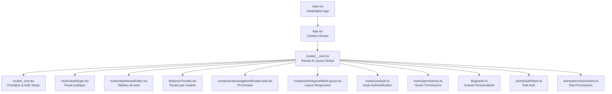
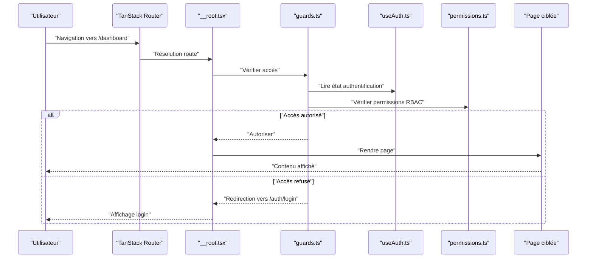
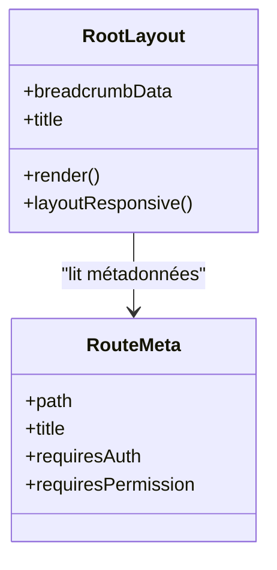
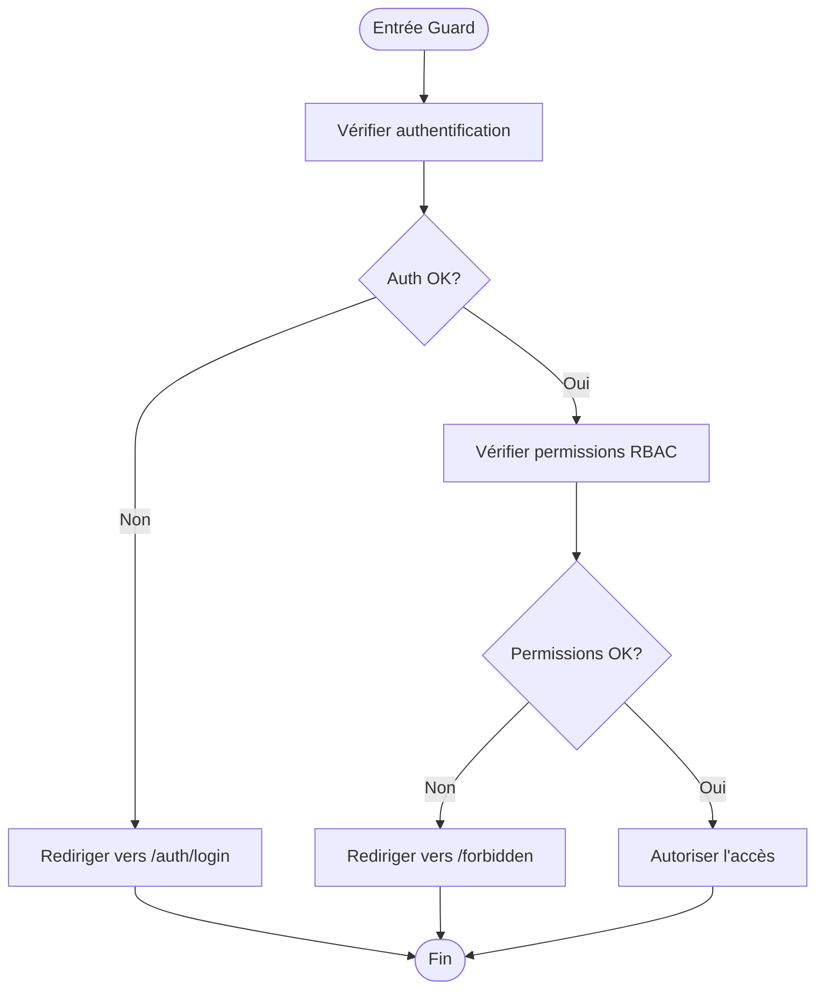
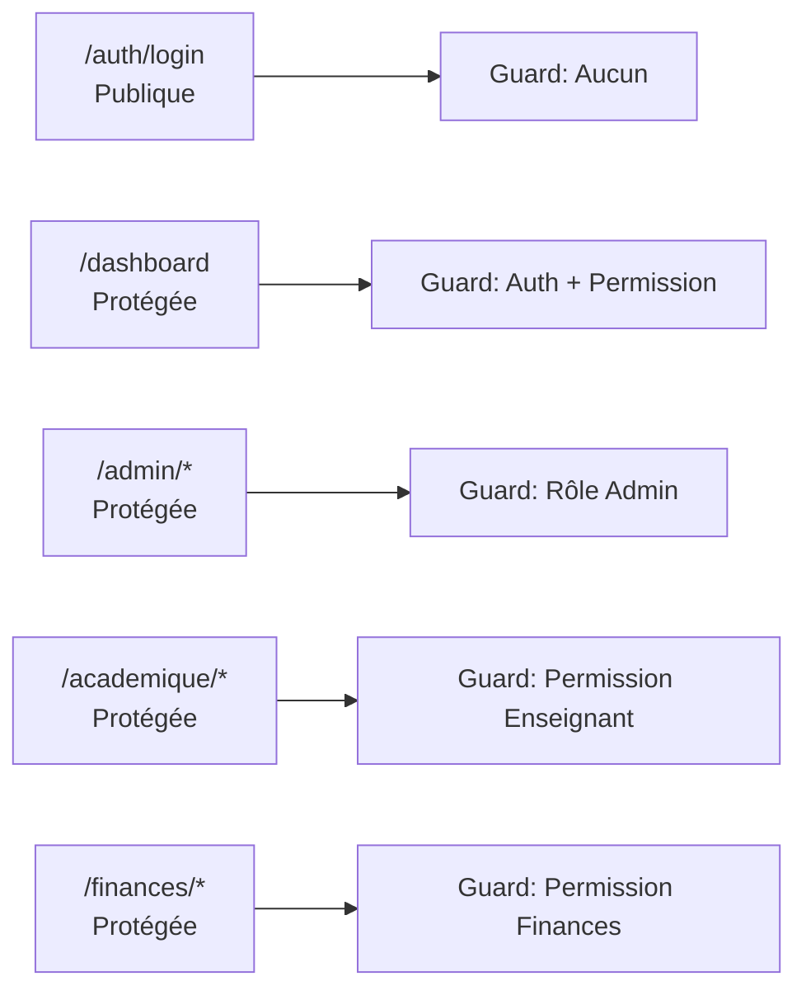
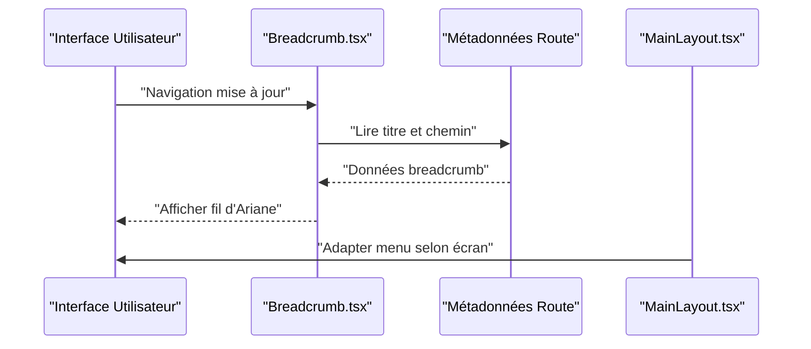
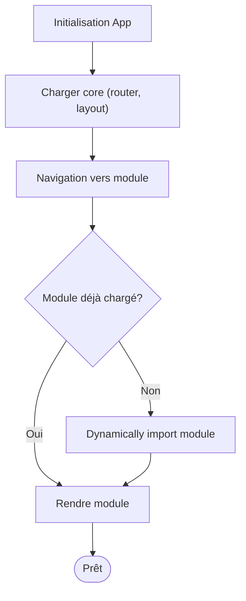
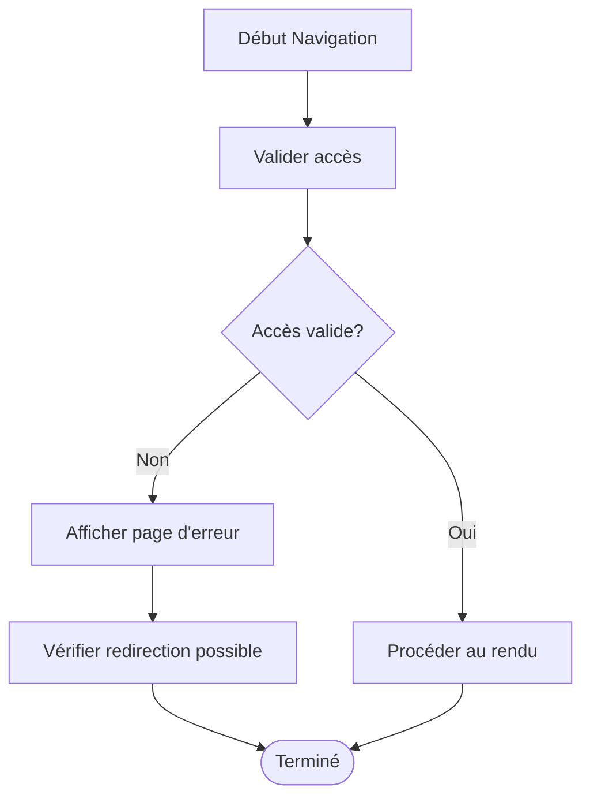
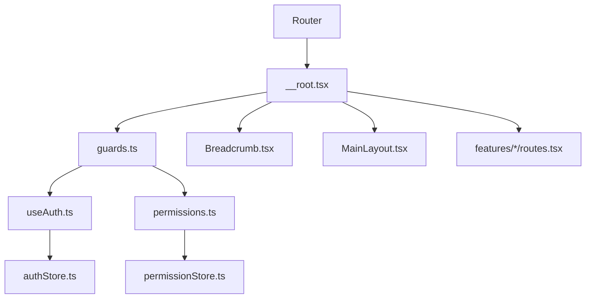

# Routing et Navigation

<cite>
**Fichiers référencés dans ce document**
- [App.tsx](file://frontend/src/App.tsx)
- [main.tsx](file://frontend/src/main.tsx)
- [routeTree.gen.ts](file://frontend/src/routeTree.gen.ts)
- [routes/_root.tsx](file://frontend/src/routes/_root.tsx)
- [routes/__root.tsx](file://frontend/src/routes/__root.tsx)
- [routes/auth/login.tsx](file://frontend/src/routes/auth/login.tsx)
- [routes/dashboard/index.tsx](file://frontend/src/routes/dashboard/index.tsx)
- [hooks/useAuth.ts](file://frontend/src/hooks/useAuth.ts)
- [hooks/permissions.ts](file://frontend/src/hooks/permissions.ts)
- [lib/guards.ts](file://frontend/src/lib/guards.ts)
- [components/layout/MainLayout.tsx](file://frontend/src/components/layout/MainLayout.tsx)
- [components/navigation/Breadcrumb.tsx](file://frontend/src/components/navigation/Breadcrumb.tsx)
- [components/ui/LoadingSpinner.tsx](file://frontend/src/components/ui/LoadingSpinner.tsx)
- [features/admin/routes.tsx](file://frontend/src/features/admin/routes.tsx)
- [features/academique/routes.tsx](file://frontend/src/features/academique/routes.tsx)
- [features/finances/routes.tsx](file://frontend/src/features/finances/routes.tsx)
- [stores/authStore.ts](file://frontend/src/stores/authStore.ts)
- [stores/permissionStore.ts](file://frontend/src/stores/permissionStore.ts)
</cite>

## Table des matières
1. [Introduction](#introduction)
2. [Structure du projet](#structure-du-projet)
3. [Composants clés](#composants-clés)
4. [Vue d'architecture](#vue-darchitecture)
5. [Analyse détaillée des composants](#analyse-detalliee-des-composants)
6. [Analyse des dépendances](#analyse-des-dependances)
7. [Considérations de performance](#considerations-de-performance)
8. [Guide de dépannage](#guide-de-depannage)
9. [Conclusion](#conclusion)
10. [Annexes](#annexes)

## Introduction
Ce document décrit le système de routage TanStack Router implémenté dans eLISAschool. Il couvre la configuration des routes, les guards d’authentification et de permissions (RBAC), la navigation conditionnelle basée sur les rôles, la gestion des états de chargement, les guards personnalisés, la protection des routes sensibles, le breadcrumb dynamique, la navigation responsive, le lazy loading des modules, la gestion des erreurs de navigation, ainsi que les meilleures pratiques de structuration des routes.

## Structure du projet
Le frontend utilise TanStack Router avec une arborescence de routes générée automatiquement. Les fichiers suivants sont centraux :
- Point d’entrée et initialisation du router
- Racine de l’application et layout global
- Routes publiques et protégées
- Guards et hooks RBAC
- Breadcrumb et navigation responsive
- Stores d’état pour l’authentification et les permissions

**Sources du diagramme**
- [main.tsx](file://frontend/src/main.tsx)
- [App.tsx](file://frontend/src/App.tsx)
- [routes/__root.tsx](file://frontend/src/routes/__root.tsx)
- [routes/_root.tsx](file://frontend/src/routes/_root.tsx)
- [routes/auth/login.tsx](file://frontend/src/routes/auth/login.tsx)
- [routes/dashboard/index.tsx](file://frontend/src/routes/dashboard/index.tsx)
- [features/admin/routes.tsx](file://frontend/src/features/admin/routes.tsx)
- [features/academique/routes.tsx](file://frontend/src/features/academique/routes.tsx)
- [features/finances/routes.tsx](file://frontend/src/features/finances/routes.tsx)
- [components/navigation/Breadcrumb.tsx](file://frontend/src/components/navigation/Breadcrumb.tsx)
- [components/layout/MainLayout.tsx](file://frontend/src/components/layout/MainLayout.tsx)
- [hooks/useAuth.ts](file://frontend/src/hooks/useAuth.ts)
- [hooks/permissions.ts](file://frontend/src/hooks/permissions.ts)
- [lib/guards.ts](file://frontend/src/lib/guards.ts)
- [stores/authStore.ts](file://frontend/src/stores/authStore.ts)
- [stores/permissionStore.ts](file://frontend/src/stores/permissionStore.ts)

**Sources de section**
- [routeTree.gen.ts](file://frontend/src/routeTree.gen.ts)
- [routes/__root.tsx](file://frontend/src/routes/__root.tsx)
- [routes/_root.tsx](file://frontend/src/routes/_root.tsx)

## Composants clés
- Initialisation du router et injection des providers
- Layout racine et gestion du fil d’Ariane
- Hooks d’authentification et de permissions
- Guards personnalisés pour protéger les routes
- Lazy loading des modules fonctionnels
- Gestion des états de chargement et des erreurs de navigation

**Sources de section**
- [App.tsx](file://frontend/src/App.tsx)
- [routes/__root.tsx](file://frontend/src/routes/__root.tsx)
- [routes/_root.tsx](file://frontend/src/routes/_root.tsx)
- [hooks/useAuth.ts](file://frontend/src/hooks/useAuth.ts)
- [hooks/permissions.ts](file://frontend/src/hooks/permissions.ts)
- [lib/guards.ts](file://frontend/src/lib/guards.ts)
- [components/navigation/Breadcrumb.tsx](file://frontend/src/components/navigation/Breadcrumb.tsx)
- [components/layout/MainLayout.tsx](file://frontend/src/components/layout/MainLayout.tsx)

## Vue d'architecture
TanStack Router est configuré au niveau de l’application, avec un layout racine qui enveloppe les routes. Les guards vérifient l’authentification et les permissions avant de rendre les pages. Le breadcrumb se construit dynamiquement à partir des métadonnées de route.

**Sources du diagramme**
- [routes/__root.tsx](file://frontend/src/routes/__root.tsx)
- [lib/guards.ts](file://frontend/src/lib/guards.ts)
- [hooks/useAuth.ts](file://frontend/src/hooks/useAuth.ts)
- [hooks/permissions.ts](file://frontend/src/hooks/permissions.ts)

## Analyse détaillée des composants

### Configuration du Router et Layout Racine
- Le point d’entrée initialise le router et injecte les providers nécessaires.
- La racine définit le layout global, le breadcrumb et les transitions de navigation.
- Les métadonnées de route alimentent le fil d’Ariane et les titres de page.

**Sources du diagramme**
- [routes/__root.tsx](file://frontend/src/routes/__root.tsx)
- [routes/_root.tsx](file://frontend/src/routes/_root.tsx)

**Sources de section**
- [routes/__root.tsx](file://frontend/src/routes/__root.tsx)
- [routes/_root.tsx](file://frontend/src/routes/_root.tsx)

### Guards d’Authentification et de Permissions
- Les guards centralisent les vérifications d’accès.
- Ils utilisent les hooks d’authentification et de permissions pour décider de l’autorisation.
- En cas d’échec, ils redirigent vers la page de connexion ou une page d’erreur.

**Sources du diagramme**
- [lib/guards.ts](file://frontend/src/lib/guards.ts)
- [hooks/useAuth.ts](file://frontend/src/hooks/useAuth.ts)
- [hooks/permissions.ts](file://frontend/src/hooks/permissions.ts)

**Sources de section**
- [lib/guards.ts](file://frontend/src/lib/guards.ts)
- [hooks/useAuth.ts](file://frontend/src/hooks/useAuth.ts)
- [hooks/permissions.ts](file://frontend/src/hooks/permissions.ts)

### Routes Publiques et Protégées
- Les routes publiques (par exemple, connexion) ne nécessitent pas d’authentification.
- Les routes protégées (par exemple, tableau de bord, modules administratifs) exigent des vérifications via les guards.
- Exemples de routes protégées : tableau de bord, administration, académique, finances.

**Sources du diagramme**
- [routes/auth/login.tsx](file://frontend/src/routes/auth/login.tsx)
- [routes/dashboard/index.tsx](file://frontend/src/routes/dashboard/index.tsx)
- [features/admin/routes.tsx](file://frontend/src/features/admin/routes.tsx)
- [features/academique/routes.tsx](file://frontend/src/features/academique/routes.tsx)
- [features/finances/routes.tsx](file://frontend/src/features/finances/routes.tsx)

**Sources de section**
- [routes/auth/login.tsx](file://frontend/src/routes/auth/login.tsx)
- [routes/dashboard/index.tsx](file://frontend/src/routes/dashboard/index.tsx)
- [features/admin/routes.tsx](file://frontend/src/features/admin/routes.tsx)
- [features/academique/routes.tsx](file://frontend/src/features/academique/routes.tsx)
- [features/finances/routes.tsx](file://frontend/src/features/finances/routes.tsx)

### Breadcrumb Dynamique et Navigation Responsive
- Le breadcrumb se construit à partir des métadonnées de route.
- Le layout principal gère la navigation responsive (menu mobile/desktop).
- Les liens de navigation incluent des indicateurs d’état (chargement, erreur).

**Sources du diagramme**
- [components/navigation/Breadcrumb.tsx](file://frontend/src/components/navigation/Breadcrumb.tsx)
- [components/layout/MainLayout.tsx](file://frontend/src/components/layout/MainLayout.tsx)

**Sources de section**
- [components/navigation/Breadcrumb.tsx](file://frontend/src/components/navigation/Breadcrumb.tsx)
- [components/layout/MainLayout.tsx](file://frontend/src/components/layout/MainLayout.tsx)

### Lazy Loading des Modules
- Les modules fonctionnels sont chargés à la demande pour optimiser les performances.
- Chaque module expose ses propres routes et guards.
- Le chargement différé réduit la taille initiale du bundle.

**Sources du diagramme**
- [features/admin/routes.tsx](file://frontend/src/features/admin/routes.tsx)
- [features/academique/routes.tsx](file://frontend/src/features/academique/routes.tsx)
- [features/finances/routes.tsx](file://frontend/src/features/finances/routes.tsx)

**Sources de section**
- [features/admin/routes.tsx](file://frontend/src/features/admin/routes.tsx)
- [features/academique/routes.tsx](file://frontend/src/features/academique/routes.tsx)
- [features/finances/routes.tsx](file://frontend/src/features/finances/routes.tsx)

### Gestion des Erreurs de Navigation
- Les erreurs de navigation sont capturées et affichées via des écrans dédiés.
- Les redirections conditionnelles évitent les boucles infinies.
- Les messages d’erreur sont contextualisés par rôle et permission.

**Sources du diagramme**
- [lib/guards.ts](file://frontend/src/lib/guards.ts)
- [routes/__root.tsx](file://frontend/src/routes/__root.tsx)

**Sources de section**
- [lib/guards.ts](file://frontend/src/lib/guards.ts)
- [routes/__root.tsx](file://frontend/src/routes/__root.tsx)

## Analyse des dépendances
Les dépendances entre les couches sont claires :
- Le router dépend du layout racine et des guards.
- Les guards dépendent des hooks d’authentification et de permissions.
- Les stores fournissent l’état global pour auth et permissions.
- Les modules fonctionnels dépendent des guards et du router.

**Sources du diagramme**
- [routes/__root.tsx](file://frontend/src/routes/__root.tsx)
- [lib/guards.ts](file://frontend/src/lib/guards.ts)
- [hooks/useAuth.ts](file://frontend/src/hooks/useAuth.ts)
- [hooks/permissions.ts](file://frontend/src/hooks/permissions.ts)
- [stores/authStore.ts](file://frontend/src/stores/authStore.ts)
- [stores/permissionStore.ts](file://frontend/src/stores/permissionStore.ts)
- [components/navigation/Breadcrumb.tsx](file://frontend/src/components/navigation/Breadcrumb.tsx)
- [components/layout/MainLayout.tsx](file://frontend/src/components/layout/MainLayout.tsx)
- [features/admin/routes.tsx](file://frontend/src/features/admin/routes.tsx)
- [features/academique/routes.tsx](file://frontend/src/features/academique/routes.tsx)
- [features/finances/routes.tsx](file://frontend/src/features/finances/routes.tsx)

**Sources de section**
- [routeTree.gen.ts](file://frontend/src/routeTree.gen.ts)
- [routes/__root.tsx](file://frontend/src/routes/__root.tsx)
- [lib/guards.ts](file://frontend/src/lib/guards.ts)

## Considérations de performance
- Privilégier le lazy loading des modules lourds.
- Éviter les re-rendus inutiles en mémorisant les résultats des hooks.
- Centraliser les vérifications d’accès pour limiter les appels répétés.
- Utiliser des skeletons de chargement pour améliorer l’expérience utilisateur.

[Pas de sources nécessaires car cette section fournit des conseils généraux]

## Guide de dépannage
- Vérifier l’état d’authentification et les permissions si une route protégée n’est pas accessible.
- Inspecter les logs de navigation pour détecter les boucles de redirection.
- Valider les métadonnées de route pour un breadcrumb correct.
- Tester les guards avec différents rôles et permissions.

**Sources de section**
- [lib/guards.ts](file://frontend/src/lib/guards.ts)
- [hooks/useAuth.ts](file://frontend/src/hooks/useAuth.ts)
- [hooks/permissions.ts](file://frontend/src/hooks/permissions.ts)
- [components/navigation/Breadcrumb.tsx](file://frontend/src/components/navigation/Breadcrumb.tsx)

## Conclusion
Le système de routing TanStack Router dans eLISAschool offre une architecture modulaire, sécurisée et performante. Grâce aux guards, aux hooks RBAC et au lazy loading, il permet une navigation fluide et adaptée aux besoins métier. Les bonnes pratiques décrites ici garantissent une maintenance aisée et une évolutivité optimale.

[Pas de sources nécessaires car cette section résume sans analyser de fichiers spécifiques]

## Annexes
- Exemple de route protégée : tableau de bord
- Exemple de redirection conditionnelle : vers connexion si non authentifié
- Intégration RBAC : vérification des permissions par module

[Pas de sources nécessaires car cette section propose des exemples conceptuels]