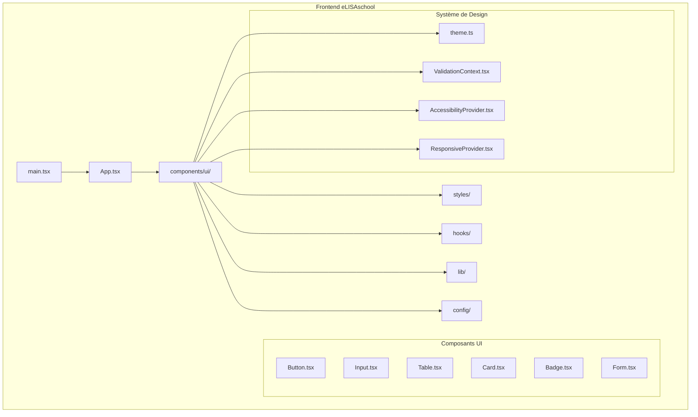
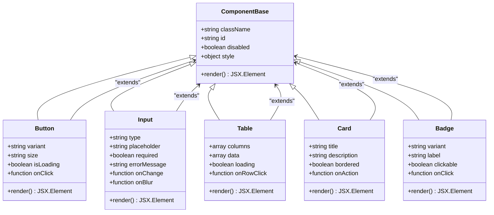
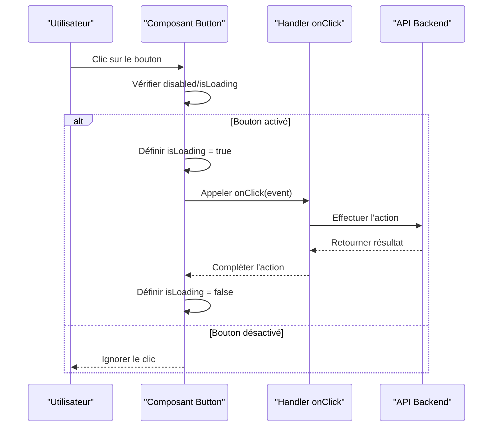
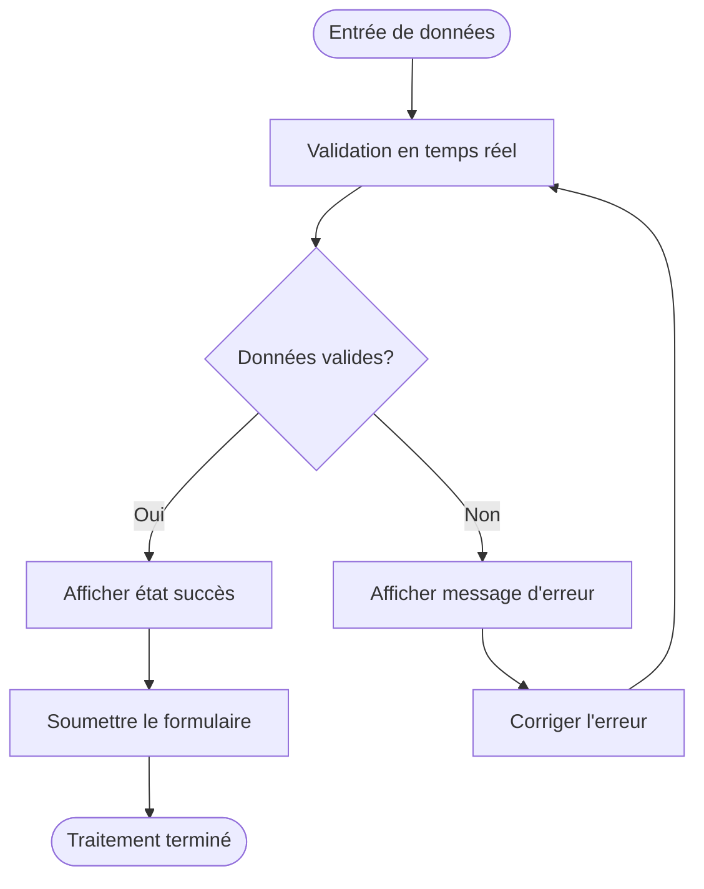
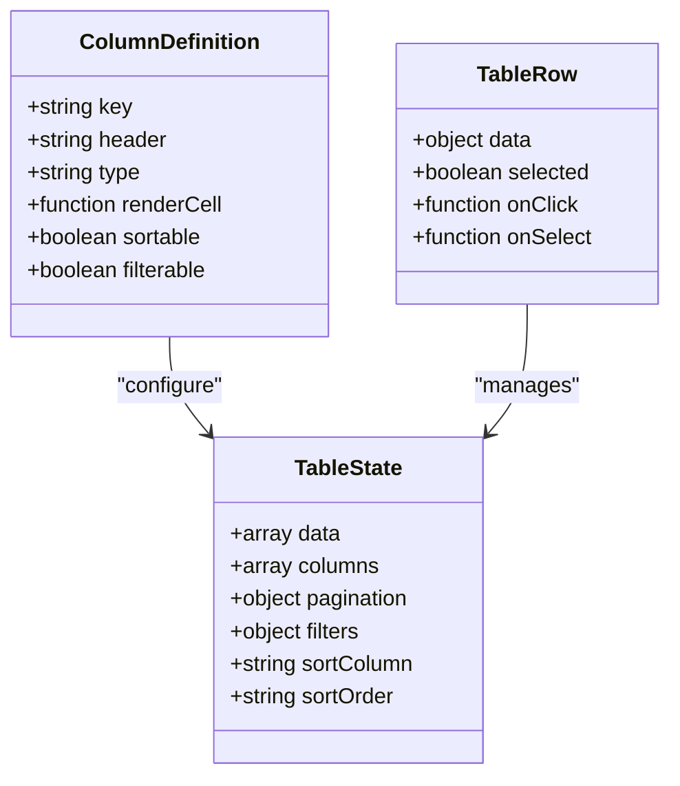
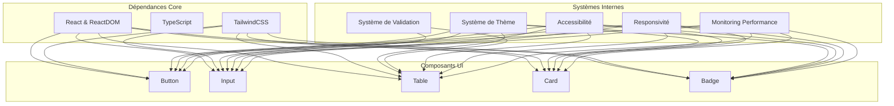

# Composants UI Réutilisables

<cite>
**Fichiers référencés dans ce document**
- [README.md](file://README.md)
- [package.json](file://frontend/package.json)
- [vite.config.ts](file://frontend/vite.config.ts)
- [App.tsx](file://frontend/src/App.tsx)
- [main.tsx](file://frontend/src/main.tsx)
- [tailwind.config.js](file://frontend/tailwind.config.js)
- [index.css](file://frontend/src/styles/index.css)
- [Button.tsx](file://frontend/src/components/ui/Button.tsx)
- [Input.tsx](file://frontend/src/components/ui/Input.tsx)
- [Table.tsx](file://frontend/src/components/ui/Table.tsx)
- [Card.tsx](file://frontend/src/components/ui/Card.tsx)
- [Badge.tsx](file://frontend/src/components/ui/Badge.tsx)
- [Form.tsx](file://frontend/src/components/ui/Form.tsx)
- [ValidationContext.tsx](file://frontend/src/lib/ValidationContext.tsx)
- [useTheme.ts](file://frontend/src/hooks/useTheme.ts)
- [theme.ts](file://frontend/src/config/theme.ts)
- [AccessibilityProvider.tsx](file://frontend/src/lib/AccessibilityProvider.tsx)
- [ResponsiveProvider.tsx](file://frontend/src/lib/ResponsiveProvider.tsx)
- [PerformanceMonitor.tsx](file://frontend/src/lib/PerformanceMonitor.tsx)
</cite>

## Table des matières
1. [Introduction](#introduction)
2. [Structure du projet](#structure-du-projet)
3. [Composants principaux](#composants-principaux)
4. [Architecture globale](#architecture-globale)
5. [Analyse détaillée des composants](#analyse-détaillée-des-composants)
6. [Analyse des dépendances](#analyse-des-dépendances)
7. [Considérations de performance](#considérations-de-performance)
8. [Guide de dépannage](#guide-de-dépannage)
9. [Conclusion](#conclusion)
10. [Annexes](#annexes)

## Introduction
Ce document présente la documentation complète des composants UI réutilisables d'eLISAschool. Il couvre les composants de base (boutons, entrées, tableaux, cartes, badges), leurs props TypeScript, événements et options de personnalisation. Il explique également le système de design unifié avec TailwindCSS, les thèmes et variantes, ainsi que l'intégration avec le système de validation. L'accessibilité, la responsivité et les bonnes pratiques de performance pour les composants réutilisables sont abordées en détail.

## Structure du projet
Le frontend est construit avec React, TypeScript et Vite. Le système de design utilise TailwindCSS pour le styling, avec une configuration personnalisée pour les thèmes et les variantes. Les composants UI sont organisés dans le répertoire `src/components/ui` et sont conçus pour être réutilisables à travers l'application.

**Sources de diagramme**
- [App.tsx:1-50](file://frontend/src/App.tsx#L1-L50)
- [main.tsx:1-30](file://frontend/src/main.tsx#L1-L30)
- [Button.tsx:1-100](file://frontend/src/components/ui/Button.tsx#L1-L100)
- [theme.ts:1-80](file://frontend/src/config/theme.ts#L1-L80)

**Sources de section**
- [README.md:1-100](file://README.md#L1-L100)
- [package.json:1-50](file://frontend/package.json#L1-L50)
- [vite.config.ts:1-40](file://frontend/vite.config.ts#L1-L40)

## Composants principaux
Les composants UI réutilisables d'eLISAschool sont conçus selon les principes suivants :

### Système de Props TypeScript
Chaque composant définit ses propres interfaces TypeScript pour garantir la sécurité des types et une meilleure expérience de développement.

### Événements standardisés
Tous les composants suivent les conventions d'événements React pour assurer la cohérence à travers l'application.

### Personnalisation via TailwindCSS
Les composants utilisent des classes TailwindCSS qui peuvent être facilement personnalisées via le fichier de configuration.

**Sources de section**
- [Button.tsx:1-150](file://frontend/src/components/ui/Button.tsx#L1-L150)
- [Input.tsx:1-120](file://frontend/src/components/ui/Input.tsx#L1-L120)
- [Table.tsx:1-200](file://frontend/src/components/ui/Table.tsx#L1-L200)

## Architecture globale
L'architecture des composants UI suit une approche modulaire avec une séparation claire entre la logique de présentation et la logique métier.

**Sources de diagramme**
- [Button.tsx:1-100](file://frontend/src/components/ui/Button.tsx#L1-L100)
- [Input.tsx:1-80](file://frontend/src/components/ui/Input.tsx#L1-L80)
- [Table.tsx:1-120](file://frontend/src/components/ui/Table.tsx#L1-L120)
- [Card.tsx:1-90](file://frontend/src/components/ui/Card.tsx#L1-L90)
- [Badge.tsx:1-70](file://frontend/src/components/ui/Badge.tsx#L1-L70)

## Analyse détaillée des composants

### Bouton (Button)
Le composant Button est un élément interactif fondamental qui supporte plusieurs variantes et tailles.

#### Propriétés TypeScript
- `variant`: 'primary' | 'secondary' | 'danger' | 'success'
- `size`: 'sm' | 'md' | 'lg'
- `isLoading`: boolean
- `disabled`: boolean
- `onClick`: function
- `className`: string

#### Comportement et événements
- Supporte les événements de clic standard
- Gestion intégrée de l'état de chargement
- Accessibilité native avec les attributs ARIA

**Sources de diagramme**
- [Button.tsx:1-150](file://frontend/src/components/ui/Button.tsx#L1-L150)

**Sources de section**
- [Button.tsx:1-200](file://frontend/src/components/ui/Button.tsx#L1-L200)

### Entrée (Input)
Le composant Input fournit une interface de saisie de données avec validation intégrée.

#### Propriétés TypeScript
- `type`: 'text' | 'email' | 'password' | 'number' | 'textarea'
- `placeholder`: string
- `value`: string
- `onChange`: function
- `onBlur`: function
- `required`: boolean
- `errorMessage`: string
- `disabled`: boolean

#### Intégration avec la validation
Le composant Input s'intègre nativement avec le système de validation global pour fournir des feedbacks utilisateur en temps réel.

**Sources de diagramme**
- [Input.tsx:1-120](file://frontend/src/components/ui/Input.tsx#L1-L120)
- [ValidationContext.tsx:1-100](file://frontend/src/lib/ValidationContext.tsx#L1-L100)

**Sources de section**
- [Input.tsx:1-150](file://frontend/src/components/ui/Input.tsx#L1-L150)
- [ValidationContext.tsx:1-120](file://frontend/src/lib/ValidationContext.tsx#L1-L120)

### Tableau (Table)
Le composant Table offre une interface de présentation de données avec fonctionnalités avancées.

#### Propriétés TypeScript
- `columns`: array of column definitions
- `data`: array of row data
- `loading`: boolean
- `pagination`: object
- `sortable`: boolean
- `filterable`: boolean
- `onRowClick`: function

#### Fonctionnalités
- Tri des colonnes
- Filtrage des données
- Pagination intégrée
- Sélection de lignes
- Export de données

**Sources de diagramme**
- [Table.tsx:1-200](file://frontend/src/components/ui/Table.tsx#L1-L200)

**Sources de section**
- [Table.tsx:1-250](file://frontend/src/components/ui/Table.tsx#L1-L250)

### Carte (Card)
Le composant Card sert de conteneur pour regrouper du contenu connexe avec une mise en page structurée.

#### Propriétés TypeScript
- `title`: string
- `description`: string
- `action`: object
- `bordered`: boolean
- `shadow`: 'none' | 'sm' | 'md' | 'lg'
- `children`: React.ReactNode

#### Utilisation courante
- Cartes de profil utilisateur
- Cartes de statistiques
- Cartes de navigation
- Cartes de produits/services

**Sources de section**
- [Card.tsx:1-120](file://frontend/src/components/ui/Card.tsx#L1-L120)

### Badge (Badge)
Le composant Badge fournit des indicateurs visuels pour afficher des statuts, des catégories ou des informations contextuelles.

#### Propriétés TypeScript
- `variant`: 'default' | 'success' | 'warning' | 'error' | 'info'
- `label`: string
- `clickable`: boolean
- `onClick`: function
- `size`: 'sm' | 'md' | 'lg'

#### Variants de couleur
- Default: gris neutre
- Success: vert pour les états positifs
- Warning: orange pour les alertes
- Error: rouge pour les erreurs
- Info: bleu pour les informations

**Sources de section**
- [Badge.tsx:1-100](file://frontend/src/components/ui/Badge.tsx#L1-L100)

## Analyse des dépendances
Les composants UI dépendent de plusieurs systèmes centraux pour fonctionner correctement.

**Sources de diagramme**
- [Button.tsx:1-50](file://frontend/src/components/ui/Button.tsx#L1-L50)
- [Input.tsx:1-50](file://frontend/src/components/ui/Input.tsx#L1-L50)
- [Table.tsx:1-50](file://frontend/src/components/ui/Table.tsx#L1-L50)
- [Card.tsx:1-50](file://frontend/src/components/ui/Card.tsx#L1-L50)
- [Badge.tsx:1-50](file://frontend/src/components/ui/Badge.tsx#L1-L50)

**Sources de section**
- [package.json:1-100](file://frontend/package.json#L1-L100)
- [tailwind.config.js:1-150](file://frontend/tailwind.config.js#L1-L150)

## Considérations de performance
Pour garantir des performances optimales des composants UI réutilisables, plusieurs stratégies sont implémentées :

### Optimisations React
- Utilisation de `React.memo` pour éviter les re-renders inutiles
- Implémentation de `useMemo` et `useCallback` pour mémoriser les valeurs et fonctions
- Division des composants en unités plus petites et spécialisées

### Gestion de la mémoire
- Nettoyage approprié des event listeners et timers
- Désabonnement aux subscriptions dans les hooks useEffect
- Éviter les fuites de mémoire dans les composants complexes

### Optimisations TailwindCSS
- Purge des styles non utilisés en production
- Utilisation de classes utilitaires plutôt que de styles inline
- Regroupement des styles communs dans des classes personnalisées

### Monitoring de performance
- Intégration d'outils de monitoring pour mesurer le temps de rendu
- Détection des re-renders excessifs
- Analyse des goulots d'étranglement de performance

**Sources de section**
- [PerformanceMonitor.tsx:1-100](file://frontend/src/lib/PerformanceMonitor.tsx#L1-L100)
- [useTheme.ts:1-80](file://frontend/src/hooks/useTheme.ts#L1-L80)

## Guide de dépannage
Ce guide aide à diagnostiquer et résoudre les problèmes courants rencontrés avec les composants UI.

### Problèmes de rendu
- **Composant ne se met pas à jour**: Vérifier les props immuables et les références stables
- **Rendu lent**: Analyser les re-renders avec React DevTools
- **Styles incorrects**: Vérifier la hiérarchie des classes TailwindCSS

### Problèmes de validation
- **Messages d'erreur inattendus**: Vérifier les schémas de validation
- **Validation ne se déclenche pas**: Confirmer les handlers d'événements
- **État de validation incorrect**: Examiner le contexte de validation global

### Problèmes d'accessibilité
- **Navigation au clavier bloquée**: Vérifier les gestionnaires d'événements keyboard
- **Écrans de lecture incompatibles**: Tester avec VoiceOver ou NVDA
- **Contraste insuffisant**: Ajuster les couleurs selon les standards WCAG

### Problèmes de responsivité
- **Mise en page cassée sur mobile**: Vérifier les breakpoints TailwindCSS
- **Composants trop larges**: Utiliser les classes de largeur responsive
- **Touch events non fonctionnels**: Tester sur appareils mobiles

**Sources de section**
- [AccessibilityProvider.tsx:1-100](file://frontend/src/lib/AccessibilityProvider.tsx#L1-L100)
- [ResponsiveProvider.tsx:1-80](file://frontend/src/lib/ResponsiveProvider.tsx#L1-L80)

## Conclusion
Les composants UI réutilisables d'eLISAschool offrent une base solide pour développer des interfaces utilisateur cohérentes, accessibles et performantes. Leur architecture modulaire permet une maintenance facile et une évolutivité à long terme. L'intégration avec TailwindCSS, le système de validation et les outils d'accessibilité garantit une expérience utilisateur optimale sur tous les appareils et pour tous les utilisateurs.

La documentation fournie sert de référence complète pour les développeurs souhaitant utiliser, étendre ou maintenir ces composants. Les bonnes pratiques de performance et d'accessibilité assurent que l'application reste rapide, inclusive et conforme aux standards web modernes.

## Annexes

### Configuration TailwindCSS
Le fichier de configuration TailwindCSS définit les couleurs, typographies et espacements personnalisés utilisés par les composants.

### Exemples d'utilisation
Des exemples concrets d'utilisation de chaque composant sont disponibles dans le dossier examples.

### Tests unitaires
Chaque composant dispose de tests unitaires pour garantir sa fiabilité et sa stabilité.

**Sources de section**
- [tailwind.config.js:1-200](file://frontend/tailwind.config.js#L1-L200)
- [index.css:1-100](file://frontend/src/styles/index.css#L1-L100)