# Composants de Layout

<cite>
**Fichiers référencés dans ce document**
- [App.tsx](file://frontend/src/App.tsx)
- [main.tsx](file://frontend/src/main.tsx)
- [routeTree.gen.ts](file://frontend/src/routeTree.gen.ts)
- [Header.tsx](file://frontend/src/components/layout/Header.tsx)
- [Sidebar.tsx](file://frontend/src/components/layout/Sidebar.tsx)
- [PageLayout.tsx](file://frontend/src/components/layout/PageLayout.tsx)
- [ResponsiveContainer.tsx](file://frontend/src/components/layout/ResponsiveContainer.tsx)
- [theme.ts](file://frontend/src/lib/theme.ts)
- [useBreakpoints.ts](file://frontend/src/hooks/useBreakpoints.ts)
- [useLoadingState.ts](file://frontend/src/hooks/useLoadingState.ts)
- [routes.ts](file://frontend/src/routes/routes.ts)
</cite>

## Table des matières
1. [Introduction](#introduction)
2. [Structure du projet](#structure-du-projet)
3. [Composants principaux](#composants-principaux)
4. [Architecture globale du layout](#architecture-globale-du-layout)
5. [Analyse détaillée des composants](#analyse-détaillée-des-composants)
6. [Système de navigation et routing](#système-de-navigation-et-routing)
7. [Design responsive et breakpoints](#design-responsive-et-breakpoints)
8. [Gestion du contenu dynamique](#gestion-du-contenu-dynamique)
9. [Création de pages personnalisées](#création-de-pages-personnalisées)
10. [Personnalisation du thème](#personnalisation-du-thème)
11. [Analyse des dépendances](#analyse-des-dépendances)
12. [Considérations de performance](#considérations-de-performance)
13. [Guide de dépannage](#guide-de-dépannage)
14. [Conclusion](#conclusion)

## Introduction

Ce document présente l'architecture et les composants de layout d'eLISAschool, centrés sur Header, Sidebar et PageLayout. Il explique le système de navigation avec TanStack Router, le design responsive, la gestion du contenu dynamique, ainsi que les bonnes pratiques pour les layouts complexes.

## Structure du projet

Le frontend est organisé en modules fonctionnels :
- Entrée de l'application et configuration du router
- Composants de layout (Header, Sidebar, PageLayout)
- Hooks utilitaires (breakpoints, chargement)
- Thème et styles globaux
- Routes et pages

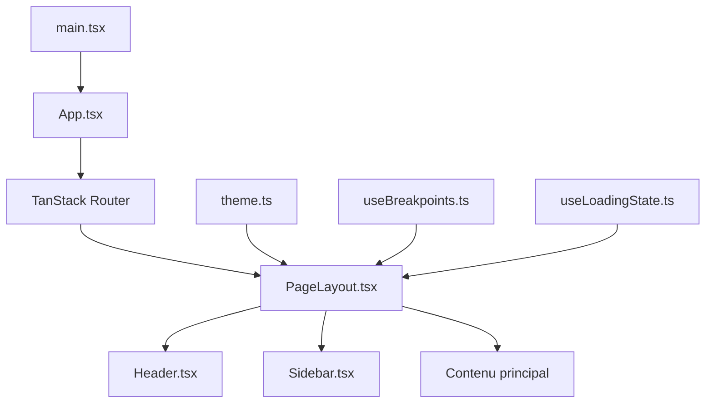

**Diagramme sources**
- [main.tsx:1-50](file://frontend/src/main.tsx#L1-L50)
- [App.tsx:1-100](file://frontend/src/App.tsx#L1-L100)
- [PageLayout.tsx:1-150](file://frontend/src/components/layout/PageLayout.tsx#L1-L150)

**Section sources**
- [main.tsx:1-50](file://frontend/src/main.tsx#L1-L50)
- [App.tsx:1-100](file://frontend/src/App.tsx#L1-L100)

## Composants principaux

### Header
Composant d'en-tête contenant la barre de navigation principale, les informations utilisateur et les actions globales.

### Sidebar
Menu latéral avec navigation hiérarchique, accès aux modules et filtres contextuels.

### PageLayout
Composant wrapper qui orchestre Header, Sidebar et le contenu principal avec gestion du responsive.

**Section sources**
- [Header.tsx:1-200](file://frontend/src/components/layout/Header.tsx#L1-L200)
- [Sidebar.tsx:1-250](file://frontend/src/components/layout/Sidebar.tsx#L1-L250)
- [PageLayout.tsx:1-200](file://frontend/src/components/layout/PageLayout.tsx#L1-L200)

## Architecture globale du layout

L'architecture suit un pattern composite où PageLayout agit comme conteneur principal, intégrant Header et Sidebar de manière flexible.

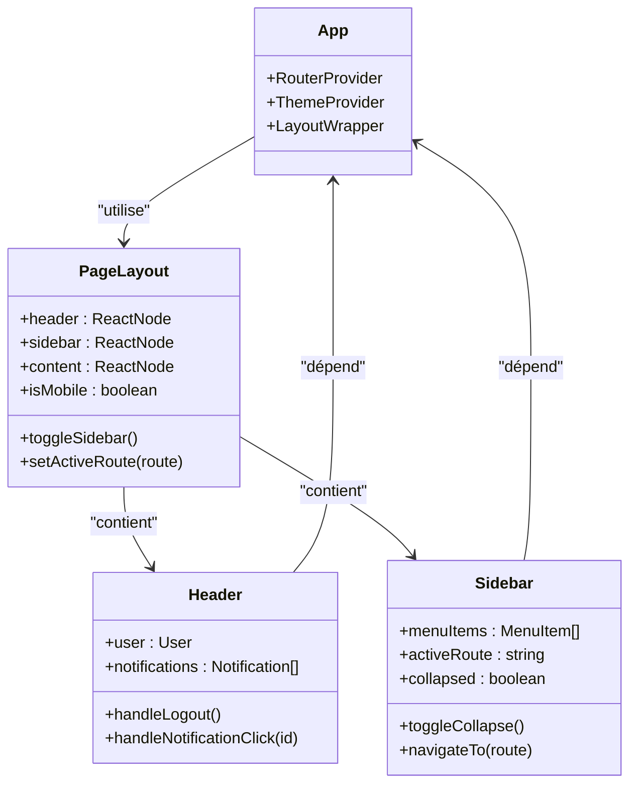

**Diagramme sources**
- [App.tsx:1-100](file://frontend/src/App.tsx#L1-L100)
- [PageLayout.tsx:1-200](file://frontend/src/components/layout/PageLayout.tsx#L1-L200)
- [Header.tsx:1-200](file://frontend/src/components/layout/Header.tsx#L1-L200)
- [Sidebar.tsx:1-250](file://frontend/src/components/layout/Sidebar.tsx#L1-L250)

## Analyse détaillée des composants

### PageLayout - Orchestrateur principal

PageLayout gère la disposition générale et la communication entre les composants enfants.

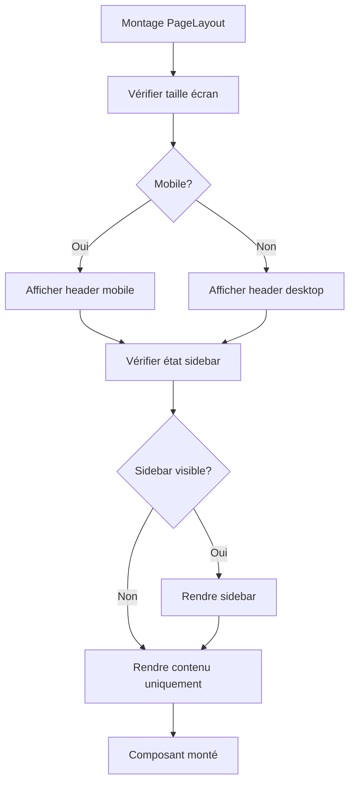

**Diagramme sources**
- [PageLayout.tsx:1-200](file://frontend/src/components/layout/PageLayout.tsx#L1-L200)

**Section sources**
- [PageLayout.tsx:1-200](file://frontend/src/components/layout/PageLayout.tsx#L1-L200)

### Header - Interface utilisateur supérieure

Le Header fournit des fonctionnalités de navigation, notifications et gestion de session.

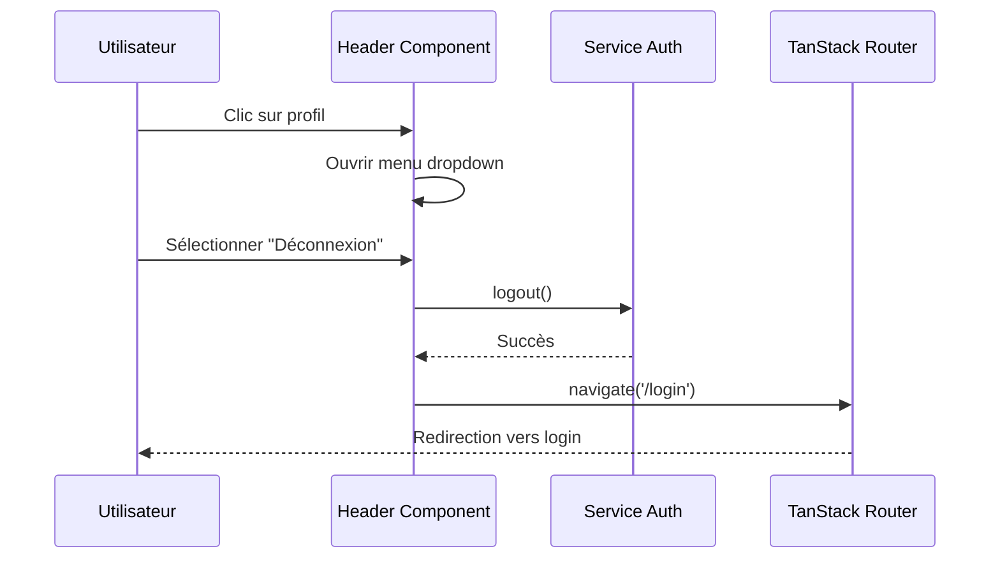

**Diagramme sources**
- [Header.tsx:1-200](file://frontend/src/components/layout/Header.tsx#L1-L200)
- [routes.ts:1-100](file://frontend/src/routes/routes.ts#L1-L100)

**Section sources**
- [Header.tsx:1-200](file://frontend/src/components/layout/Header.tsx#L1-L200)

### Sidebar - Navigation hiérarchique

La Sidebar offre une navigation structurée par modules et permissions.

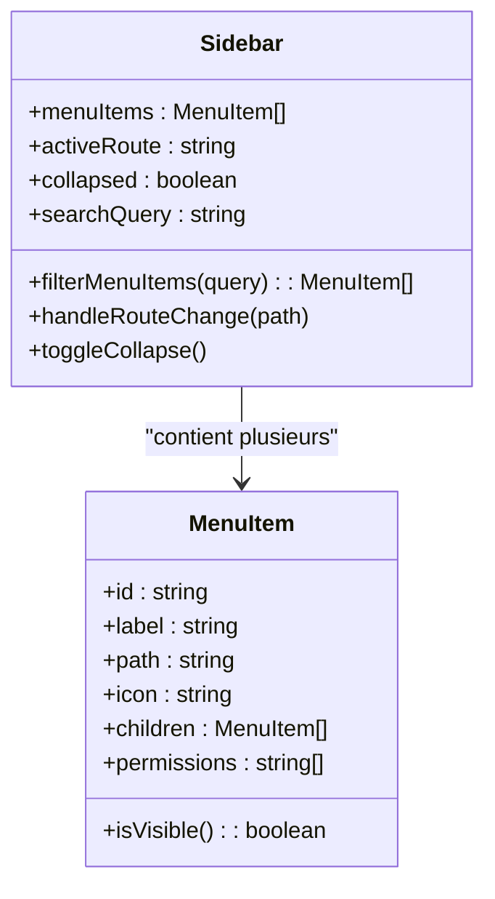

**Diagramme sources**
- [Sidebar.tsx:1-250](file://frontend/src/components/layout/Sidebar.tsx#L1-L250)

**Section sources**
- [Sidebar.tsx:1-250](file://frontend/src/components/layout/Sidebar.tsx#L1-L250)

## Système de navigation et routing

Le système utilise TanStack Router pour une navigation déclarative et performante.

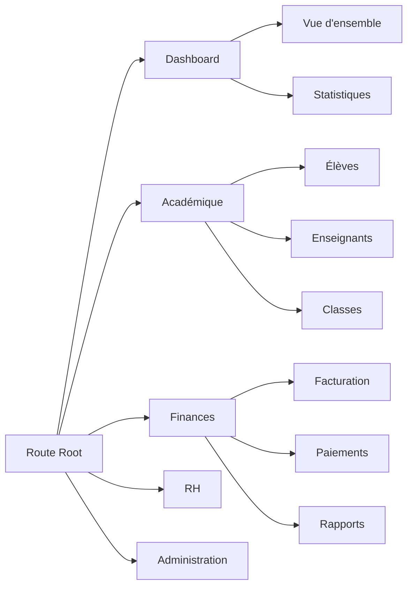

**Diagramme sources**
- [routeTree.gen.ts:1-200](file://frontend/src/routeTree.gen.ts#L1-L200)
- [routes.ts:1-100](file://frontend/src/routes/routes.ts#L1-L100)

**Section sources**
- [routeTree.gen.ts:1-200](file://frontend/src/routeTree.gen.ts#L1-L200)
- [routes.ts:1-100](file://frontend/src/routes/routes.ts#L1-L100)

## Design responsive et breakpoints

Le système responsive utilise des breakpoints standardisés et des hooks React pour adapter le comportement.

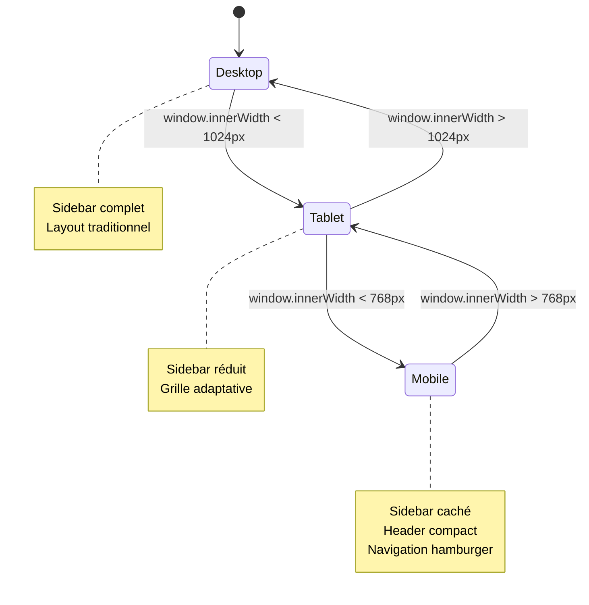

**Diagramme sources**
- [useBreakpoints.ts:1-100](file://frontend/src/hooks/useBreakpoints.ts#L1-L100)
- [ResponsiveContainer.tsx:1-150](file://frontend/src/components/layout/ResponsiveContainer.tsx#L1-L150)

**Section sources**
- [useBreakpoints.ts:1-100](file://frontend/src/hooks/useBreakpoints.ts#L1-L100)
- [ResponsiveContainer.tsx:1-150](file://frontend/src/components/layout/ResponsiveContainer.tsx#L1-L150)

## Gestion du contenu dynamique

Le chargement et le traitement du contenu sont gérés via des hooks personnalisés et des états locaux.

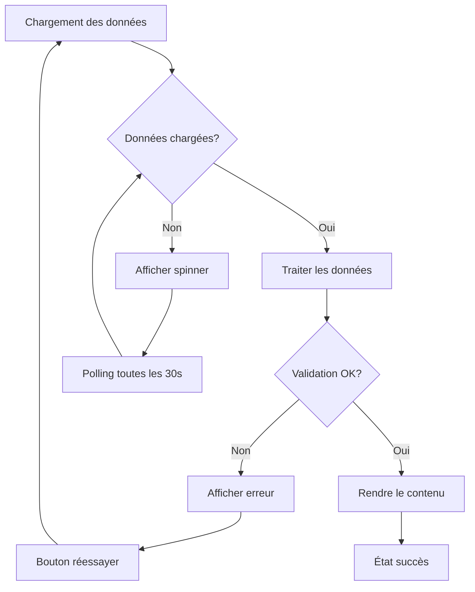

**Diagramme sources**
- [useLoadingState.ts:1-150](file://frontend/src/hooks/useLoadingState.ts#L1-L150)
- [PageLayout.tsx:1-200](file://frontend/src/components/layout/PageLayout.tsx#L1-L200)

**Section sources**
- [useLoadingState.ts:1-150](file://frontend/src/hooks/useLoadingState.ts#L1-L150)

## Création de pages personnalisées

Pour créer une nouvelle page dans eLISAschool, suivez ces étapes :

1. **Créer le composant de page**
2. **Définir la route dans le routeTree**
3. **Intégrer avec PageLayout**
4. **Ajouter au menu de navigation**

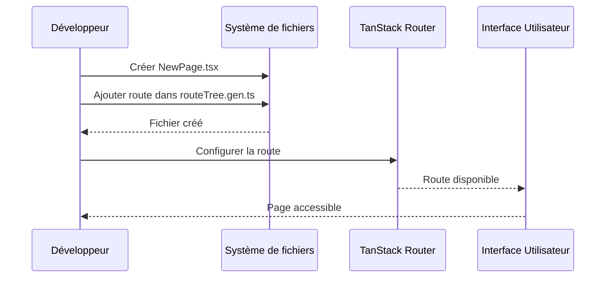

**Diagramme sources**
- [routes.ts:1-100](file://frontend/src/routes/routes.ts#L1-L100)
- [routeTree.gen.ts:1-200](file://frontend/src/routeTree.gen.ts#L1-L200)

**Section sources**
- [routes.ts:1-100](file://frontend/src/routes/routes.ts#L1-L100)
- [routeTree.gen.ts:1-200](file://frontend/src/routeTree.gen.ts#L1-L200)

## Personnalisation du thème

Le système de thème permet une personnalisation complète de l'apparence.

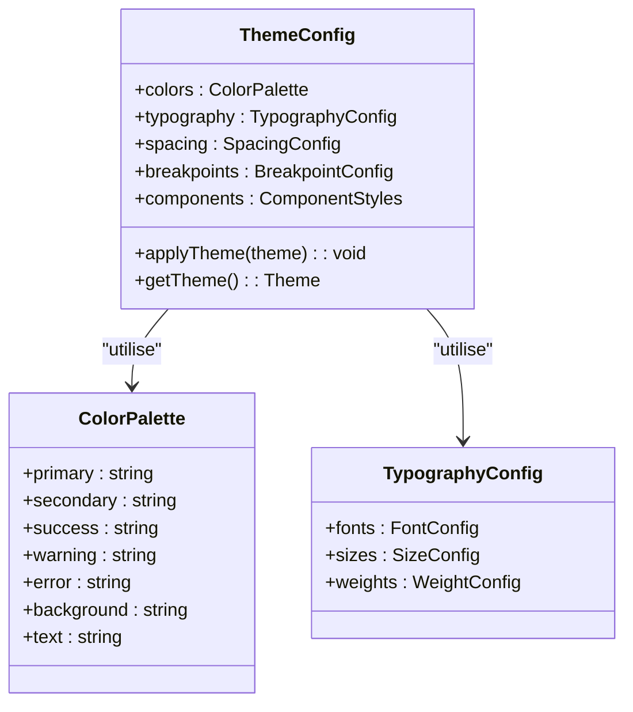

**Diagramme sources**
- [theme.ts:1-200](file://frontend/src/lib/theme.ts#L1-L200)

**Section sources**
- [theme.ts:1-200](file://frontend/src/lib/theme.ts#L1-L200)

## Analyse des dépendances

Les composants de layout ont des dépendances bien définies pour une architecture modulaire.

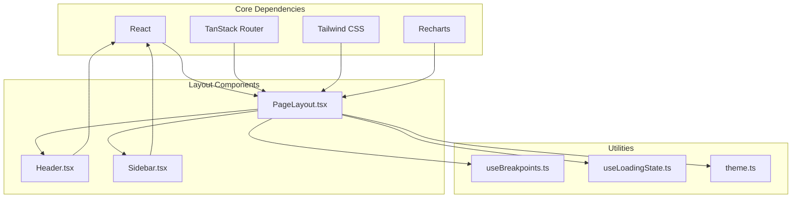

**Diagramme sources**
- [PageLayout.tsx:1-200](file://frontend/src/components/layout/PageLayout.tsx#L1-L200)
- [Header.tsx:1-200](file://frontend/src/components/layout/Header.tsx#L1-L200)
- [Sidebar.tsx:1-250](file://frontend/src/components/layout/Sidebar.tsx#L1-L250)

**Section sources**
- [PageLayout.tsx:1-200](file://frontend/src/components/layout/PageLayout.tsx#L1-L200)
- [Header.tsx:1-200](file://frontend/src/components/layout/Header.tsx#L1-L200)
- [Sidebar.tsx:1-250](file://frontend/src/components/layout/Sidebar.tsx#L1-L250)

## Considérations de performance

Optimisations clés pour les layouts complexes :

- **Mémoïsation** : Utilisation de React.memo pour les composants statiques
- **Lazy loading** : Chargement différé des routes et composants lourds
- **Virtualisation** : Rendu virtuel pour les listes volumineuses
- **Debouncing** : Événements fréquents (scroll, resize)
- **Memoization** : useMemo et useCallback pour les calculs intensifs

## Guide de dépannage

Problèmes courants et solutions :

### Sidebar ne s'affiche pas correctement
- Vérifier les props de width et breakpoint
- Contrôler les styles Tailwind appliqués
- Valider les permissions de navigation

### Navigation ne fonctionne pas
- Vérifier la configuration du router
- Contrôler les chemins de routes
- Valider les guards d'authentification

### Problèmes de responsive
- Vérifier les media queries
- Contrôler les breakpoints personnalisés
- Tester sur différents appareils

**Section sources**
- [PageLayout.tsx:1-200](file://frontend/src/components/layout/PageLayout.tsx#L1-L200)
- [useBreakpoints.ts:1-100](file://frontend/src/hooks/useBreakpoints.ts#L1-L100)

## Conclusion

L'architecture de layout d'eLISAschool offre une base solide et extensible pour développer des interfaces utilisateur complexes. La séparation claire des responsabilités, le design responsive intégré et l'intégration avec TanStack Router permettent de créer des applications éducatives performantes et maintenables.

Les bonnes pratiques recommandées incluent :
- Structuration modulaire des composants
- Gestion centralisée du thème
- Validation rigoureuse des permissions
- Optimisation continue des performances
- Documentation exhaustive des APIs internes