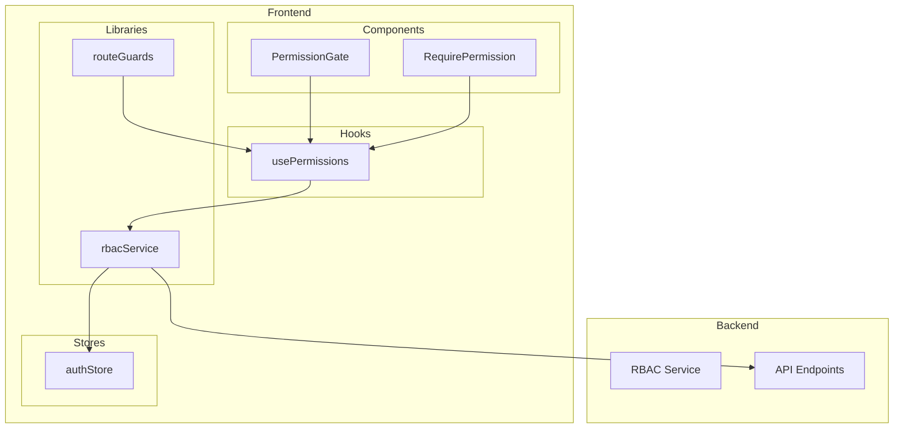
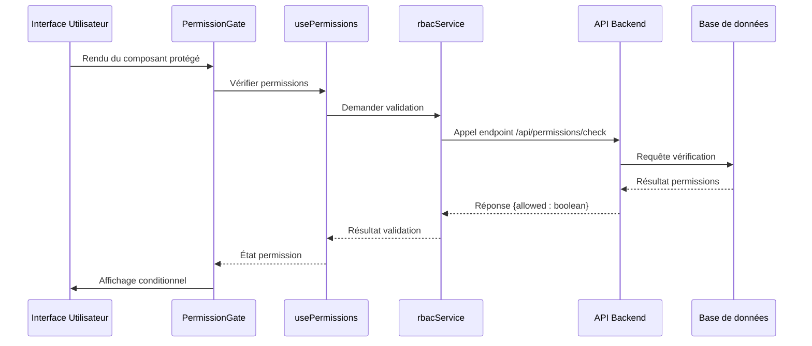
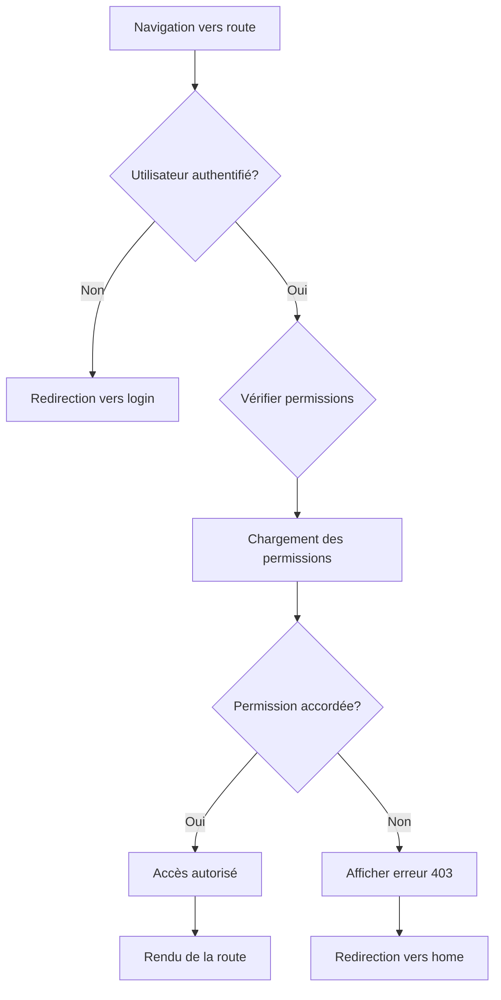
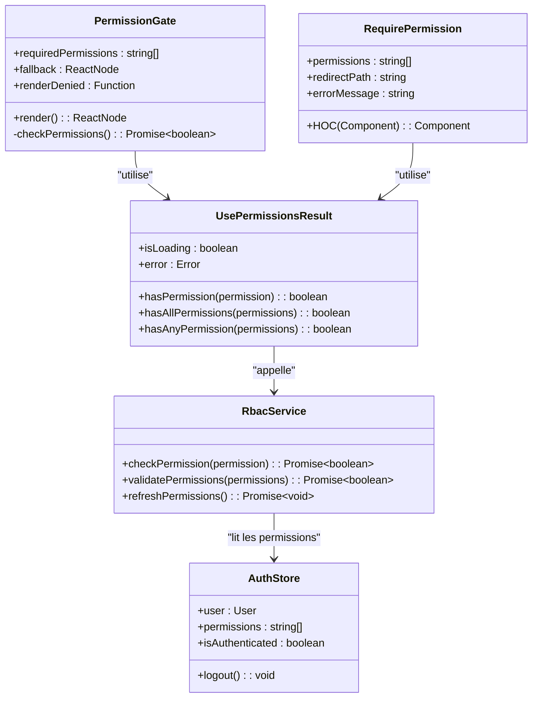
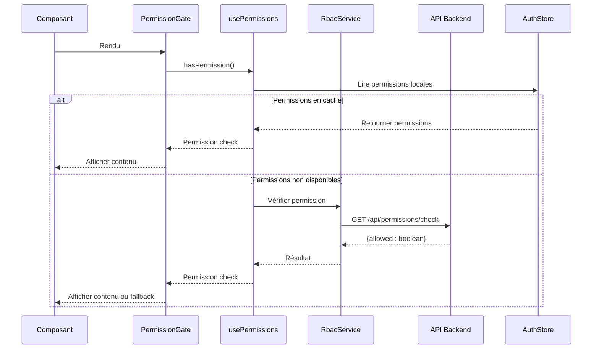

# Composants de Permissions

<cite>
**Fichiers référencés dans ce document**
- [PermissionGate.tsx](file://frontend/src/components/permissions/PermissionGate.tsx)
- [RequirePermission.tsx](file://frontend/src/components/permissions/RequirePermission.tsx)
- [usePermissions.ts](file://frontend/src/hooks/usePermissions.ts)
- [rbacService.ts](file://frontend/src/lib/rbacService.ts)
- [routeGuards.ts](file://frontend/src/lib/routeGuards.ts)
- [authStore.ts](file://frontend/src/stores/authStore.ts)
- [RBAC_FINAL_SESSION.md](file://docs/RBAC_FINAL_SESSION.md)
- [GUIDE-PERMISSIONS-FRONTEND.md](file://docs/GUIDE-PERMISSIONS-FRONTEND.md)
- [EXEMPLE-INTEGRATION-PERMISSIONS.md](file://docs/EXEMPLE-INTEGRATION-PERMISSIONS.md)
</cite>

## Table des matières
1. [Introduction](#introduction)
2. [Structure du projet](#structure-du-projet)
3. [Composants principaux](#composants-principaux)
4. [Architecture RBAC](#architecture-rbac)
5. [Analyse détaillée des composants](#analyse-détaillée-des-composants)
6. [Intégration avec les routes](#intégration-avec-les-routes)
7. [Hooks de permissions](#hooks-de-permissions)
8. [Exemples d'utilisation](#exemples-dutilisation)
9. [Gestion des erreurs et fallbacks](#gestion-des-erreurs-et-fallbacks)
10. [Meilleures pratiques de sécurité](#meilleures-pratiques-de-sécurité)
11. [Diagrammes d'architecture](#diagrammes-darchitecture)
12. [Conclusion](#conclusion)

## Introduction

Ce document technique présente l'implémentation des composants de contrôle d'accès dans eLISAschool, centrée sur `PermissionGate` et `RequirePermission`. Il explique comment ces composants s'intègrent au système RBAC backend, aux guards de routes et aux hooks de permissions pour offrir un contrôle granulaire des accès côté frontend.

Le système RBAC (Role-Based Access Control) permet de gérer finement les autorisations en fonction des rôles et des permissions attribuées aux utilisateurs. L'implémentation frontend assure une cohérence entre le backend et le frontend, garantissant que seuls les utilisateurs autorisés peuvent accéder aux fonctionnalités spécifiques.

## Structure du projet

L'architecture de contrôle d'accès est organisée selon une approche modulaire :



**Sources du diagramme**
- [PermissionGate.tsx:1-50](file://frontend/src/components/permissions/PermissionGate.tsx#L1-L50)
- [RequirePermission.tsx:1-50](file://frontend/src/components/permissions/RequirePermission.tsx#L1-L50)
- [usePermissions.ts:1-100](file://frontend/src/hooks/usePermissions.ts#L1-L100)
- [rbacService.ts:1-100](file://frontend/src/lib/rbacService.ts#L1-L100)

**Sources de section**
- [PermissionGate.tsx:1-100](file://frontend/src/components/permissions/PermissionGate.tsx#L1-L100)
- [RequirePermission.tsx:1-100](file://frontend/src/components/permissions/RequirePermission.tsx#L1-L100)

## Composants principaux

### PermissionGate

`PermissionGate` est un composant wrapper qui protège l'affichage de ses enfants en fonction des permissions requises. Il offre une interface déclarative pour contrôler l'accès conditionnel.

**Props principales :**
- `requiredPermissions`: Tableau de permissions requises
- `fallback`: Élément à afficher si la permission est refusée
- `renderDenied`: Fonction de rendu personnalisé pour le cas de refus
- `loadingComponent`: Composant de chargement pendant la vérification

### RequirePermission

`RequirePermission` est un hook HOC (Higher Order Component) qui gère la logique de permission et peut rediriger ou afficher des messages d'erreur.

**Configuration :**
- `permissions`: Permissions nécessaires
- `redirectPath`: Chemin de redirection en cas de refus
- `errorMessage`: Message d'erreur personnalisé

**Sources de section**
- [PermissionGate.tsx:15-80](file://frontend/src/components/permissions/PermissionGate.tsx#L15-L80)
- [RequirePermission.tsx:20-90](file://frontend/src/components/permissions/RequirePermission.tsx#L20-L90)

## Architecture RBAC

Le système RBAC suit une architecture en couches où le frontend communique avec le backend pour valider les permissions en temps réel.



**Sources du diagramme**
- [usePermissions.ts:25-75](file://frontend/src/hooks/usePermissions.ts#L25-L75)
- [rbacService.ts:30-80](file://frontend/src/lib/rbacService.ts#L30-L80)

**Sources de section**
- [RBAC_FINAL_SESSION.md:1-200](file://docs/RBAC_FINAL_SESSION.md#L1-L200)
- [GUIDE-PERMISSIONS-FRONTEND.md:1-150](file://docs/GUIDE-PERMISSIONS-FRONTEND.md#L1-L150)

## Analyse détaillée des composants

### PermissionGate - Implémentation

Le composant `PermissionGate` implémente une logique de vérification asynchrone des permissions avec gestion d'état et rendu conditionnel.

**Points clés de l'implémentation :**
- Utilisation du hook `usePermissions` pour la logique métier
- Gestion asynchrone des états de chargement
- Support de fallbacks personnalisables
- Intégration avec le store d'authentification

### RequirePermission - Pattern HOC

`RequirePermission` suit le pattern HOC pour encapsuler la logique de permission autour de n'importe quel composant React.

**Caractéristiques :**
- Injection automatique des props de permission
- Redirection conditionnelle basée sur les permissions
- Support de messages d'erreur localisés
- Optimisation des re-rendus via useMemo

**Sources de section**
- [PermissionGate.tsx:1-120](file://frontend/src/components/permissions/PermissionGate.tsx#L1-L120)
- [RequirePermission.tsx:1-150](file://frontend/src/components/permissions/RequirePermission.tsx#L1-L150)

## Intégration avec les routes

Les guards de routes permettent de protéger l'accès aux routes entières en fonction des permissions utilisateur.



**Sources du diagramme**
- [routeGuards.ts:1-100](file://frontend/src/lib/routeGuards.ts#L1-L100)

**Sources de section**
- [routeGuards.ts:1-150](file://frontend/src/lib/routeGuards.ts#L1-L150)

## Hooks de permissions

### usePermissions Hook

Le hook `usePermissions` est le cœur du système de permissions frontend, fournissant une interface simple pour vérifier les permissions.

**Fonctionnalités principales :**
- Cache des résultats de permissions
- Rafraîchissement automatique lors des changements d'utilisateur
- Support des permissions composites
- Intégration avec le store d'authentification

**Interface du hook :**
```typescript
interface UsePermissionsResult {
  hasPermission: (permission: string) => boolean;
  hasAllPermissions: (permissions: string[]) => boolean;
  hasAnyPermission: (permissions: string[]) => boolean;
  isLoading: boolean;
  error: Error | null;
}
```

**Sources de section**
- [usePermissions.ts:1-200](file://frontend/src/hooks/usePermissions.ts#L1-L200)

## Exemples d'utilisation

### Protection de composants simples

```tsx
// Exemple de base
<PermissionGate requiredPermissions={['user.read']}>
  <UserList />
</PermissionGate>

// Avec fallback personnalisé
<PermissionGate 
  requiredPermissions={['admin.write']}
  fallback={<AccessDenied />}
>
  <AdminPanel />
</PermissionGate>
```

### Protection de sections de page

```tsx
// Section administrative
{hasPermission('admin.dashboard') && (
  <AdminDashboard />
)}

// Navigation conditionnelle
<NavLink to="/settings" hidden={!hasPermission('settings.manage')}>
  Paramètres
</NavLink>
```

### Protection de fonctionnalités entières

```tsx
// Route protégée
<Route 
  path="/admin" 
  element={
    <RequirePermission 
      permissions={['admin.access']}
      redirectPath="/unauthorized"
    >
      <AdminLayout />
    </RequirePermission>
  } 
/>
```

**Sources de section**
- [EXEMPLE-INTEGRATION-PERMISSIONS.md:1-300](file://docs/EXEMPLE-INTEGRATION-PERMISSIONS.md#L1-L300)

## Gestion des erreurs et fallbacks

Le système implémente une stratégie robuste de gestion des erreurs pour garantir une expérience utilisateur fluide même en cas de problèmes de réseau ou de service.

### Stratégies de fallback

1. **Fallback par défaut**: Affichage d'un message générique d'accès refusé
2. **Fallback personnalisé**: Composant spécifique défini par le développeur
3. **Redirection automatique**: Redirection vers une page d'accueil ou de login
4. **Silent mode**: Masquage complet de l'élément non autorisé

### Messages d'erreur

Le système supporte des messages d'erreur localisés et contextuels :

- **Erreur de réseau**: "Impossible de vérifier les permissions"
- **Erreur d'authentification**: "Session expirée, veuillez vous reconnecter"
- **Erreur de permission**: "Vous n'avez pas les droits nécessaires"

**Sources de section**
- [PermissionGate.tsx:80-150](file://frontend/src/components/permissions/PermissionGate.tsx#L80-L150)
- [usePermissions.ts:150-250](file://frontend/src/hooks/usePermissions.ts#L150-L250)

## Meilleures pratiques de sécurité

### Principes fondamentaux

1. **Défense en profondeur**: Toujours valider les permissions côté backend
2. **Fail-safe**: Par défaut, refuser l'accès en cas d'erreur
3. **Cache sécurisé**: Ne jamais stocker les permissions sensibles localement
4. **Audit trail**: Logger toutes les tentatives d'accès non autorisées

### Patterns recommandés

- **Privilège minimum**: Accorder uniquement les permissions nécessaires
- **Validation systématique**: Vérifier les permissions à chaque action sensible
- **Feedback utilisateur**: Informer clairement des restrictions d'accès
- **Monitoring**: Surveiller les patterns d'accès anormaux

### Anti-patterns à éviter

- ❌ Stockage des permissions dans localStorage
- ❌ Validation uniquement côté frontend
- ❌ Messages d'erreur trop verbeux (fuites d'information)
- ❌ Ignorer les erreurs de réseau comme des permissions refusées

**Sources de section**
- [GUIDE-PERMISSIONS-FRONTEND.md:100-300](file://docs/GUIDE-PERMISSIONS-FRONTEND.md#L100-L300)

## Diagrammes d'architecture

### Architecture globale du système de permissions



**Sources du diagramme**
- [PermissionGate.tsx:1-100](file://frontend/src/components/permissions/PermissionGate.tsx#L1-L100)
- [RequirePermission.tsx:1-100](file://frontend/src/components/permissions/RequirePermission.tsx#L1-L100)
- [usePermissions.ts:1-150](file://frontend/src/hooks/usePermissions.ts#L1-L150)
- [rbacService.ts:1-100](file://frontend/src/lib/rbacService.ts#L1-L100)
- [authStore.ts:1-100](file://frontend/src/stores/authStore.ts#L1-L100)

### Flux de vérification des permissions



**Sources du diagramme**
- [usePermissions.ts:50-120](file://frontend/src/hooks/usePermissions.ts#L50-L120)
- [rbacService.ts:40-90](file://frontend/src/lib/rbacService.ts#L40-L90)

## Conclusion

Le système de contrôle d'accès d'eLISAschool offre une solution complète et sécurisée pour la gestion des permissions frontend. L'architecture modulaire permet une intégration facile et flexible, tandis que les mécanismes de fallback et de gestion d'erreurs garantissent une expérience utilisateur robuste.

Les composants `PermissionGate` et `RequirePermission` fournissent des interfaces déclaratives intuitives pour protéger les fonctionnalités, tandis que le hook `usePermissions` centralise la logique de vérification. L'intégration avec le système RBAC backend assure une cohérence totale entre les validations frontend et backend.

Pour une sécurité optimale, il est essentiel de suivre les meilleures pratiques documentées et de toujours valider les permissions côté backend, en considérant les vérifications frontend comme une couche supplémentaire d'expérience utilisateur plutôt que comme une mesure de sécurité principale.