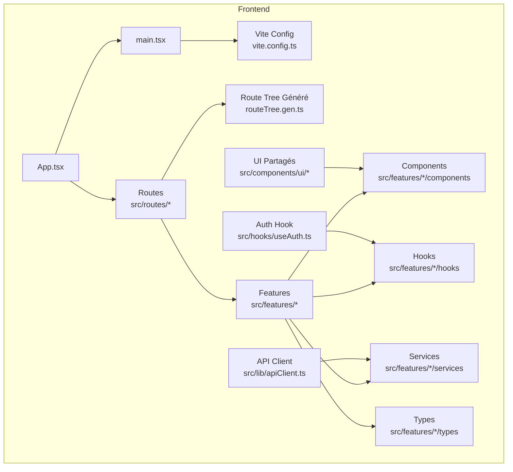
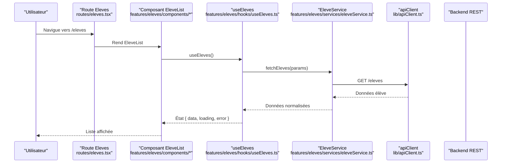
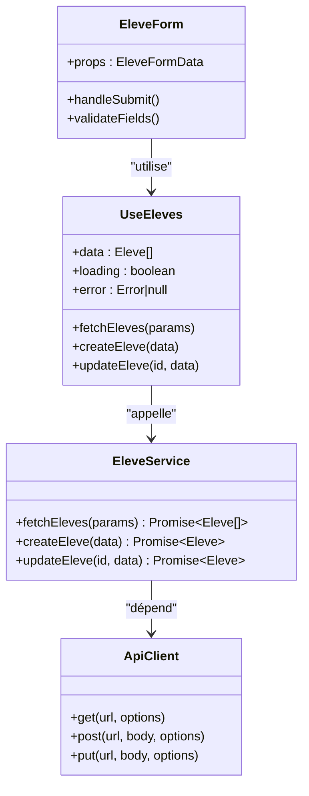
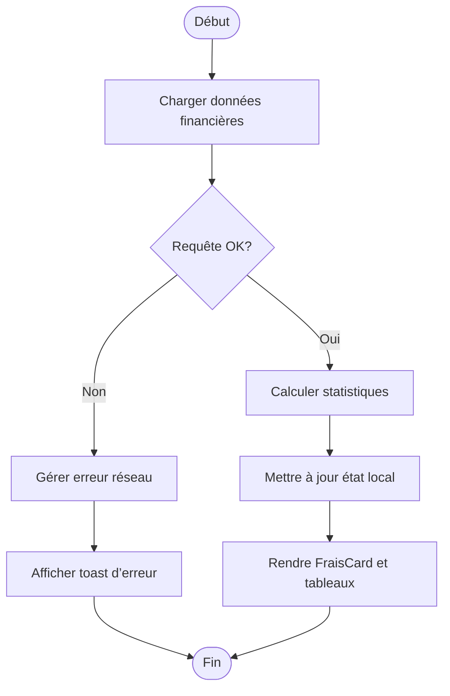
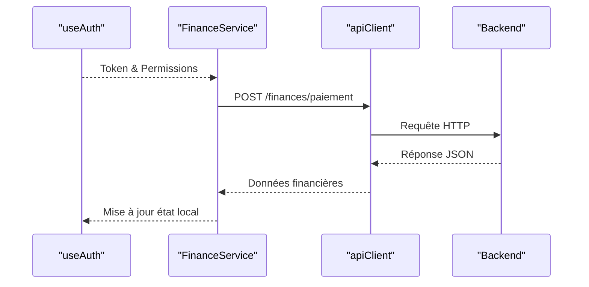
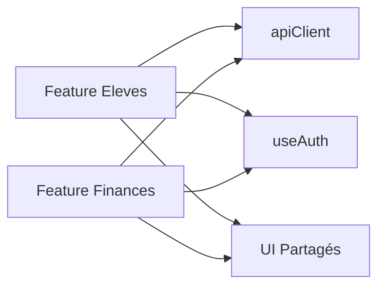

# Composants par Feature Métier

<cite>
**Fichiers référencés dans ce document**
- [README.md](file://README.md)
- [package.json](file://frontend/package.json)
- [App.tsx](file://frontend/src/App.tsx)
- [main.tsx](file://frontend/src/main.tsx)
- [routeTree.gen.ts](file://frontend/src/routeTree.gen.ts)
- [vite.config.ts](file://frontend/vite.config.ts)
- [features/eleves/index.ts](file://frontend/src/features/eleves/index.ts)
- [features/eleves/components/EleveForm.tsx](file://frontend/src/features/eleves/components/EleveForm.tsx)
- [features/eleves/hooks/useEleves.ts](file://frontend/src/features/eleves/hooks/useEleves.ts)
- [features/eleves/services/eleveService.ts](file://frontend/src/features/eleves/services/eleveService.ts)
- [features/eleves/types/eleve.types.ts](file://frontend/src/features/eleves/types/eleve.types.ts)
- [features/finances/index.ts](file://frontend/src/features/finances/index.ts)
- [features/finances/components/FraisCard.tsx](file://frontend/src/features/finances/components/FraisCard.tsx)
- [features/finances/hooks/useFinances.ts](file://frontend/src/features/finances/hooks/useFinances.ts)
- [features/finances/services/financeService.ts](file://frontend/src/features/finances/services/financeService.ts)
- [features/finances/types/finance.types.ts](file://frontend/src/features/finances/types/finance.types.ts)
- [components/ui/Button.tsx](file://frontend/src/components/ui/Button.tsx)
- [components/ui/Table.tsx](file://frontend/src/components/ui/Table.tsx)
- [hooks/useAuth.ts](file://frontend/src/hooks/useAuth.ts)
- [lib/apiClient.ts](file://frontend/src/lib/apiClient.ts)
- [routes/eleves.tsx](file://frontend/src/routes/eleves.tsx)
- [routes/finances.tsx](file://frontend/src/routes/finances.tsx)
</cite>

## Table des matières
1. [Introduction](#introduction)
2. [Structure du projet](#structure-du-projet)
3. [Composants clés](#composants-clés)
4. [Vue d'ensemble de l'architecture](#vue-densemble-de-larchitecture)
5. [Analyse détaillée des composants](#analyse-detaillee-des-composants)
6. [Analyse des dépendances](#analyse-des-dependances)
7. [Considérations de performance](#considerations-de-performance)
8. [Guide de dépannage](#guide-de-depannage)
9. [Conclusion](#conclusion)
10. [Annexes](#annexes)

## Introduction
Ce document décrit l’organisation modulaire par feature métier du frontend eLISAschool, en mettant l’accent sur la structure des dossiers features (composants, hooks, types, services), les patterns de composition UI/logique métier, l’intégration avec les API backend et la gestion d’état locale. Il fournit également des exemples concrets pour créer une nouvelle feature, réutiliser des composants partagés et tester unitairement les composants métier.

## Structure du projet
Le frontend est structuré autour de modules fonctionnels regroupés sous src/features, chacun contenant :
- components : composants UI spécifiques à la feature
- hooks : logique d’état et d’interactions (souvent liés aux données)
- services : appels API et orchestration des requêtes
- types : définitions TypeScript propres à la feature
- index.ts : point d’entrée qui exporte les éléments publics de la feature

Les routes sont définies dans src/routes et le routage généré est centralisé dans routeTree.gen.ts. L’application s’appuie sur React, Vite, TanStack Router et un client API partagé.

Sources de diagramme
- [App.tsx](file://frontend/src/App.tsx)
- [main.tsx](file://frontend/src/main.tsx)
- [vite.config.ts](file://frontend/vite.config.ts)
- [routeTree.gen.ts](file://frontend/src/routeTree.gen.ts)

Sources de section
- [README.md](file://README.md)
- [package.json](file://frontend/package.json)
- [vite.config.ts](file://frontend/vite.config.ts)
- [routeTree.gen.ts](file://frontend/src/routeTree.gen.ts)

## Composants clés
- Features Eleves
  - Compose des formulaires et listes d’élèves via des composants dédiés
  - Utilise des hooks pour charger/gérer les données et des services pour appeler les endpoints
  - Types stricts pour garantir la cohérence des données
- Features Finances
  - Affiche des cartes et tableaux financiers
  - Hooks encapsulent la logique de calcul et de persistance
  - Services gèrent les requêtes liées aux frais, paiements et soldes

Exemples de fichiers
- [features/eleves/index.ts](file://frontend/src/features/eleves/index.ts)
- [features/eleves/components/EleveForm.tsx](file://frontend/src/features/eleves/components/EleveForm.tsx)
- [features/eleves/hooks/useEleves.ts](file://frontend/src/features/eleves/hooks/useEleves.ts)
- [features/eleves/services/eleveService.ts](file://frontend/src/features/eleves/services/eleveService.ts)
- [features/eleves/types/eleve.types.ts](file://frontend/src/features/eleves/types/eleve.types.ts)
- [features/finances/index.ts](file://frontend/src/features/finances/index.ts)
- [features/finances/components/FraisCard.tsx](file://frontend/src/features/finances/components/FraisCard.tsx)
- [features/finances/hooks/useFinances.ts](file://frontend/src/features/finances/hooks/useFinances.ts)
- [features/finances/services/financeService.ts](file://frontend/src/features/finances/services/financeService.ts)
- [features/finances/types/finance.types.ts](file://frontend/src/features/finances/types/finance.types.ts)

Sources de section
- [features/eleves/index.ts](file://frontend/src/features/eleves/index.ts)
- [features/eleves/components/EleveForm.tsx](file://frontend/src/features/eleves/components/EleveForm.tsx)
- [features/eleves/hooks/useEleves.ts](file://frontend/src/features/eleves/hooks/useEleves.ts)
- [features/eleves/services/eleveService.ts](file://frontend/src/features/eleves/services/eleveService.ts)
- [features/eleves/types/eleve.types.ts](file://frontend/src/features/eleves/types/eleve.types.ts)
- [features/finances/index.ts](file://frontend/src/features/finances/index.ts)
- [features/finances/components/FraisCard.tsx](file://frontend/src/features/finances/components/FraisCard.tsx)
- [features/finances/hooks/useFinances.ts](file://frontend/src/features/finances/hooks/useFinances.ts)
- [features/finances/services/financeService.ts](file://frontend/src/features/finances/services/financeService.ts)
- [features/finances/types/finance.types.ts](file://frontend/src/features/finances/types/finance.types.ts)

## Vue d'ensemble de l'architecture
L’architecture suit un pattern feature-sliced : chaque feature encapsule ses propres UI, hooks, services et types. Les routes importent et composent ces features. Le client API centralisé assure la communication avec le backend. L’authentification est accessible via un hook global.

Sources de diagramme
- [routes/eleves.tsx](file://frontend/src/routes/eleves.tsx)
- [features/eleves/hooks/useEleves.ts](file://frontend/src/features/eleves/hooks/useEleves.ts)
- [features/eleves/services/eleveService.ts](file://frontend/src/features/eleves/services/eleveService.ts)
- [lib/apiClient.ts](file://frontend/src/lib/apiClient.ts)

## Analyse détaillée des composants

### Feature Eleves
- Objectif : gérer les élèves (lecture, création, mise à jour)
- Composition :
  - Un formulaire (EleveForm) utilise des champs validés et appelle le service
  - Une liste ou tableau affiche les élèves avec pagination/filtrage
  - Le hook useEleves centralise l’état local (chargement, erreurs, données)
  - Le service eleveService effectue les appels API via apiClient
  - Les types eleve.types.ts garantissent la conformité des payloads

Sources de diagramme
- [features/eleves/components/EleveForm.tsx](file://frontend/src/features/eleves/components/EleveForm.tsx)
- [features/eleves/hooks/useEleves.ts](file://frontend/src/features/eleves/hooks/useEleves.ts)
- [features/eleves/services/eleveService.ts](file://frontend/src/features/eleves/services/eleveService.ts)
- [lib/apiClient.ts](file://frontend/src/lib/apiClient.ts)

Sources de section
- [features/eleves/components/EleveForm.tsx](file://frontend/src/features/eleves/components/EleveForm.tsx)
- [features/eleves/hooks/useEleves.ts](file://frontend/src/features/eleves/hooks/useEleves.ts)
- [features/eleves/services/eleveService.ts](file://frontend/src/features/eleves/services/eleveService.ts)
- [features/eleves/types/eleve.types.ts](file://frontend/src/features/eleves/types/eleve.types.ts)

### Feature Finances
- Objectif : afficher et gérer les frais, paiements et soldes
- Composition :
  - FraisCard présente les indicateurs financiers
  - useFinances gère l’état local et les actions (calculs, persistance)
  - financeService orchestre les appels API pour les opérations financières
  - finance.types.ts définit les modèles financiers

Sources de diagramme
- [features/finances/components/FraisCard.tsx](file://frontend/src/features/finances/components/FraisCard.tsx)
- [features/finances/hooks/useFinances.ts](file://frontend/src/features/finances/hooks/useFinances.ts)
- [features/finances/services/financeService.ts](file://frontend/src/features/finances/services/financeService.ts)
- [features/finances/types/finance.types.ts](file://frontend/src/features/finances/types/finance.types.ts)

Sources de section
- [features/finances/components/FraisCard.tsx](file://frontend/src/features/finances/components/FraisCard.tsx)
- [features/finances/hooks/useFinances.ts](file://frontend/src/features/finances/hooks/useFinances.ts)
- [features/finances/services/financeService.ts](file://frontend/src/features/finances/services/financeService.ts)
- [features/finances/types/finance.types.ts](file://frontend/src/features/finances/types/finance.types.ts)

### Intégration API et Authentification
- apiClient centralise les appels HTTP (GET, POST, PUT, DELETE) et la configuration de base (URL, headers, intercepteurs)
- useAuth expose l’état d’authentification et les permissions pour sécuriser les accès
- Les services de features utilisent apiClient pour interagir avec le backend

Sources de diagramme
- [hooks/useAuth.ts](file://frontend/src/hooks/useAuth.ts)
- [lib/apiClient.ts](file://frontend/src/lib/apiClient.ts)
- [features/finances/services/financeService.ts](file://frontend/src/features/finances/services/financeService.ts)

Sources de section
- [hooks/useAuth.ts](file://frontend/src/hooks/useAuth.ts)
- [lib/apiClient.ts](file://frontend/src/lib/apiClient.ts)

## Analyse des dépendances
Les features dépendent de :
- lib/apiClient pour les appels réseau
- hooks/useAuth pour l’authentification et les permissions
- composants ui partagés (Button, Table) pour la présentation

Sources de diagramme
- [features/eleves/services/eleveService.ts](file://frontend/src/features/eleves/services/eleveService.ts)
- [features/finances/services/financeService.ts](file://frontend/src/features/finances/services/financeService.ts)
- [lib/apiClient.ts](file://frontend/src/lib/apiClient.ts)
- [hooks/useAuth.ts](file://frontend/src/hooks/useAuth.ts)
- [components/ui/Button.tsx](file://frontend/src/components/ui/Button.tsx)
- [components/ui/Table.tsx](file://frontend/src/components/ui/Table.tsx)

Sources de section
- [features/eleves/services/eleveService.ts](file://frontend/src/features/eleves/services/eleveService.ts)
- [features/finances/services/financeService.ts](file://frontend/src/features/finances/services/financeService.ts)
- [lib/apiClient.ts](file://frontend/src/lib/apiClient.ts)
- [hooks/useAuth.ts](file://frontend/src/hooks/useAuth.ts)
- [components/ui/Button.tsx](file://frontend/src/components/ui/Button.tsx)
- [components/ui/Table.tsx](file://frontend/src/components/ui/Table.tsx)

## Considérations de performance
- Éviter les re-rendus inutiles en mémorisant les valeurs avec useMemo/useCallback dans les hooks
- Limiter les appels API avec le debounce sur les recherches et la pagination
- Préférer les requêtes batch pour les chargements multiples
- Utiliser des loaders côté route pour précharger les données critiques
- Mettre en cache les réponses API au niveau du client si pertinent

[Pas de sources nécessaires car cette section fournit des conseils généraux]

## Guide de dépannage
- Erreurs réseau : vérifier les logs d’apiClient et les statuts HTTP retournés
- Problèmes d’authentification : s’assurer que le token est présent et valide via useAuth
- Validation de formulaires : vérifier les schémas de validation et les messages d’erreur
- Tests unitaires : utiliser des mocks pour les services et hooks afin d’isoler les tests

Sources de section
- [lib/apiClient.ts](file://frontend/src/lib/apiClient.ts)
- [hooks/useAuth.ts](file://frontend/src/hooks/useAuth.ts)

## Conclusion
La structure par feature permet une évolutivité claire et maintenable. En séparant UI, logique métier, services et types, on obtient une meilleure lisibilité et testabilité. L’intégration via un client API unique et un hook d’authentification garantit cohérence et sécurité. Suivre les bonnes pratiques de performance et de test renforce la robustesse de l’application.

[Pas de sources nécessaires car cette section résume sans analyser de fichiers spécifiques]

## Annexes

### Créer une nouvelle feature
- Créer le dossier src/features/<nom-feature> avec les sous-dossiers components, hooks, services, types
- Définir les types dans types/<nom>.ts
- Implémenter le service dans services/<nom>Service.ts utilisant apiClient
- Écrire le hook dans hooks/use<Nom>.ts pour l’état local et les interactions
- Ajouter les composants UI dans components/
- Exposer les exports depuis index.ts
- Ajouter une route dans src/routes/<nom>.tsx et importer la feature

Sources de section
- [features/eleves/index.ts](file://frontend/src/features/eleves/index.ts)
- [features/finances/index.ts](file://frontend/src/features/finances/index.ts)
- [routes/eleves.tsx](file://frontend/src/routes/eleves.tsx)
- [routes/finances.tsx](file://frontend/src/routes/finances.tsx)

### Réutilisation de composants partagés
- Importer Button et Table depuis components/ui
- Passer les props typées pour garantir la cohérence
- Customiser via slots ou enfants si nécessaire

Sources de section
- [components/ui/Button.tsx](file://frontend/src/components/ui/Button.tsx)
- [components/ui/Table.tsx](file://frontend/src/components/ui/Table.tsx)

### Stratégies de test unitaire
- Mockez les services et hooks pour isoler les tests
- Testez les validations de formulaires et les états de chargement/erreur
- Vérifiez les appels API avec des assertions sur les paramètres et réponses simulées

Sources de section
- [features/eleves/hooks/useEleves.ts](file://frontend/src/features/eleves/hooks/useEleves.ts)
- [features/finances/hooks/useFinances.ts](file://frontend/src/features/finances/hooks/useFinances.ts)
- [lib/apiClient.ts](file://frontend/src/lib/apiClient.ts)