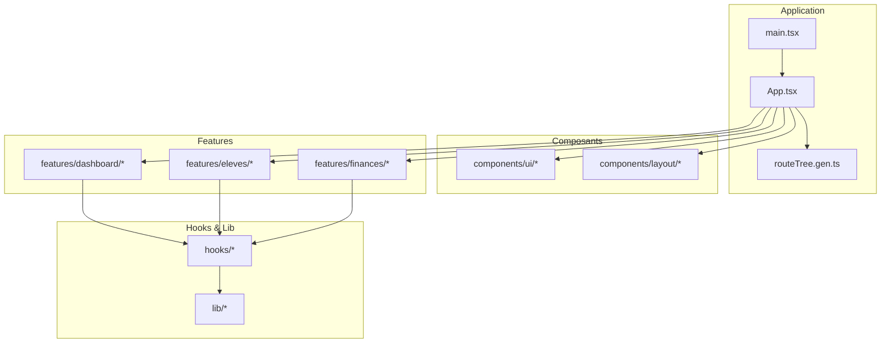
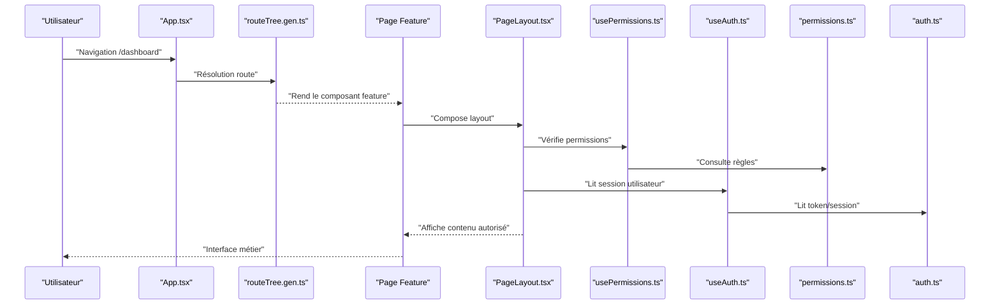
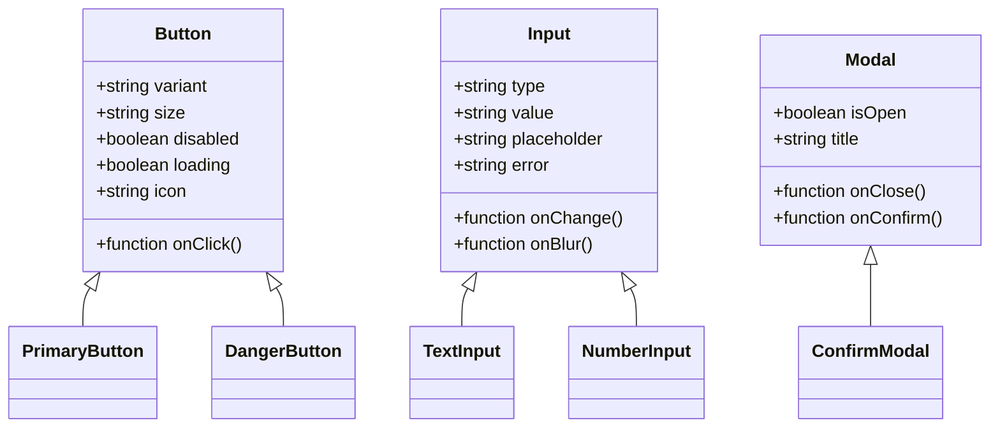
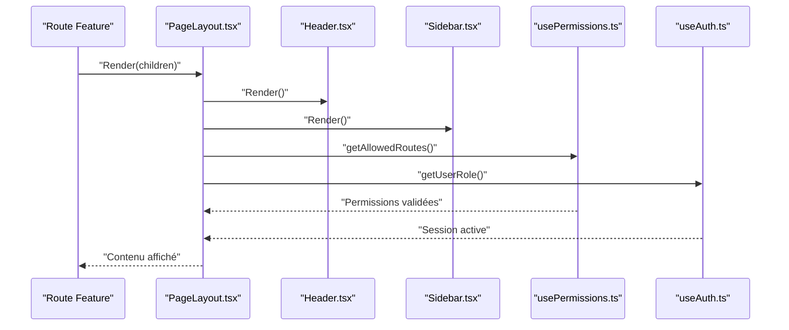
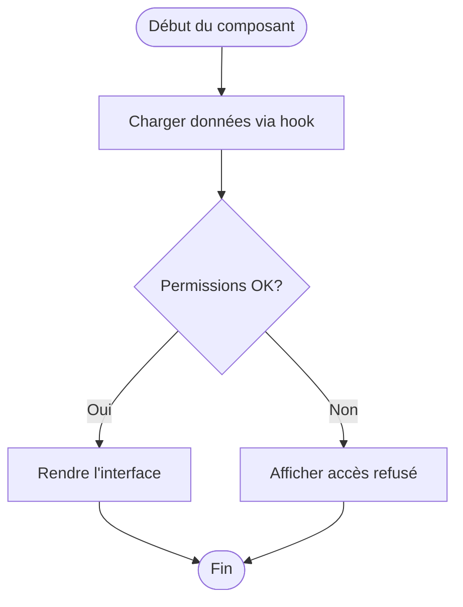
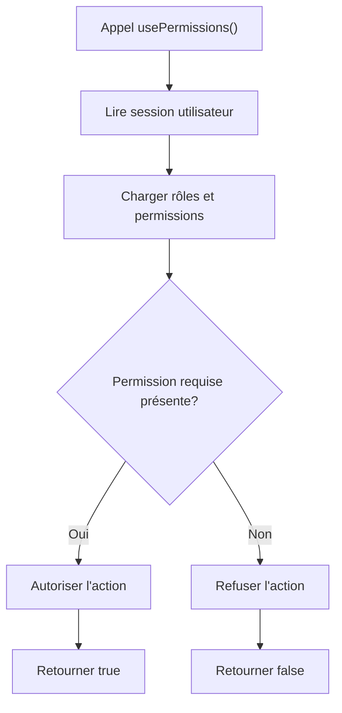
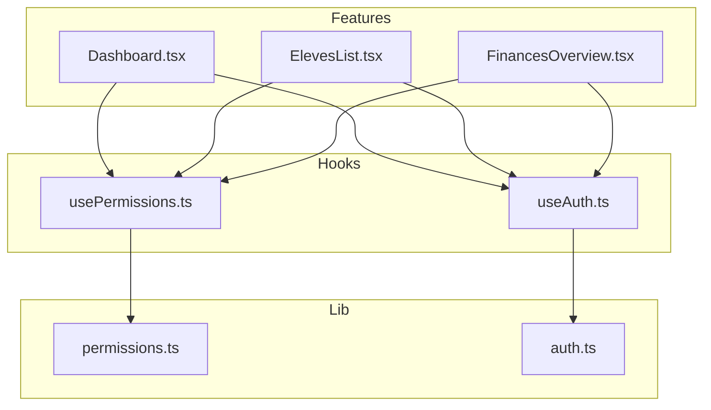

# Structure des Composants

<cite>
**Fichiers référencés dans ce document**
- [App.tsx](file://frontend/src/App.tsx)
- [main.tsx](file://frontend/src/main.tsx)
- [routeTree.gen.ts](file://frontend/src/routeTree.gen.ts)
- [Button.tsx](file://frontend/src/components/ui/Button.tsx)
- [Input.tsx](file://frontend/src/components/ui/Input.tsx)
- [Modal.tsx](file://frontend/src/components/ui/Modal.tsx)
- [Header.tsx](file://frontend/src/components/layout/Header.tsx)
- [Sidebar.tsx](file://frontend/src/components/layout/Sidebar.tsx)
- [PageLayout.tsx](file://frontend/src/components/layout/PageLayout.tsx)
- [usePermissions.ts](file://frontend/src/hooks/usePermissions.ts)
- [useAuth.ts](file://frontend/src/hooks/useAuth.ts)
- [Dashboard.tsx](file://frontend/src/features/dashboard/Dashboard.tsx)
- [ElevesList.tsx](file://frontend/src/features/eleves/ElevesList.tsx)
- [FinancesOverview.tsx](file://frontend/src/features/finances/FinancesOverview.tsx)
- [permissions.ts](file://frontend/src/lib/permissions.ts)
- [auth.ts](file://frontend/src/lib/auth.ts)
</cite>

## Table des matières
1. [Introduction](#introduction)
2. [Structure du projet](#structure-du-projet)
3. [Composants principaux](#composants-principaux)
4. [Vue d'ensemble de l'architecture](#vue-densemble-de-larchitecture)
5. [Analyse détaillée des composants](#analyse-detaillee-des-composants)
6. [Analyse des dépendances](#analyse-des-dependances)
7. [Considérations de performance](#considerations-de-performance)
8. [Guide de dépannage](#guide-de-depannage)
9. [Conclusion](#conclusion)
10. [Annexes](#annexes)

## Introduction
Ce document décrit la structure et les patterns des composants React d'eLISAschool, organisés en trois niveaux :
- Composants UI réutilisables (boutons, formulaires, modales)
- Composants de layout (header, sidebar, page layout)
- Composants features par module métier (dashboard, élèves, finances, etc.)

Il explique comment composer ces couches, définir les interfaces TypeScript des props, utiliser les hooks personnalisés (permissions, authentification), et intégrer le système de permissions. Il inclut également des bonnes pratiques de nommage, séparation des responsabilités et stratégies de tests unitaires.

## Structure du projet
Le frontend est organisé selon une architecture modulaire :
- src/app : configuration de l'application et point d'entrée
- src/components : composants UI et layouts
- src/features : fonctionnalités par module métier
- src/hooks : hooks personnalisés (permissions, auth, données)
- src/lib : utilitaires (permissions, auth, API)
- src/routes : routes TanStack Router générées ou manuelles
- src/stores : état global (si utilisé)
- src/types : types partagés

**Sources de diagramme**
- [App.tsx](file://frontend/src/App.tsx)
- [main.tsx](file://frontend/src/main.tsx)
- [routeTree.gen.ts](file://frontend/src/routeTree.gen.ts)

**Sources de section**
- [App.tsx](file://frontend/src/App.tsx)
- [main.tsx](file://frontend/src/main.tsx)
- [routeTree.gen.ts](file://frontend/src/routeTree.gen.ts)

## Composants principaux
- UI : Bouton, Input, Modal, Select, Table, Toast, etc.
- Layout : Header, Sidebar, PageLayout, Container
- Features : Dashboard, Eleves, Finances, Personnel, etc.
- Hooks : usePermissions, useAuth, useFetch, usePagination
- Lib : permissions.ts, auth.ts, api.ts

Bonnes pratiques :
- Un fichier par composant avec export nommé et default si nécessaire
- Props typées via interfaces TypeScript
- Hooks séparés de la logique UI
- Features isolées par module métier

**Sources de section**
- [Button.tsx](file://frontend/src/components/ui/Button.tsx)
- [Input.tsx](file://frontend/src/components/ui/Input.tsx)
- [Modal.tsx](file://frontend/src/components/ui/Modal.tsx)
- [Header.tsx](file://frontend/src/components/layout/Header.tsx)
- [Sidebar.tsx](file://frontend/src/components/layout/Sidebar.tsx)
- [PageLayout.tsx](file://frontend/src/components/layout/PageLayout.tsx)
- [usePermissions.ts](file://frontend/src/hooks/usePermissions.ts)
- [useAuth.ts](file://frontend/src/hooks/useAuth.ts)
- [Dashboard.tsx](file://frontend/src/features/dashboard/Dashboard.tsx)
- [ElevesList.tsx](file://frontend/src/features/eleves/ElevesList.tsx)
- [FinancesOverview.tsx](file://frontend/src/features/finances/FinancesOverview.tsx)
- [permissions.ts](file://frontend/src/lib/permissions.ts)
- [auth.ts](file://frontend/src/lib/auth.ts)

## Vue d'ensemble de l'architecture
Les routes TanStack Router chargent les pages qui combinent Layouts et Features. Les Features utilisent les Hooks pour l'état et les permissions. Les composants UI sont réutilisés à travers toutes les features.

**Sources de diagramme**
- [App.tsx](file://frontend/src/App.tsx)
- [routeTree.gen.ts](file://frontend/src/routeTree.gen.ts)
- [PageLayout.tsx](file://frontend/src/components/layout/PageLayout.tsx)
- [usePermissions.ts](file://frontend/src/hooks/usePermissions.ts)
- [useAuth.ts](file://frontend/src/hooks/useAuth.ts)
- [permissions.ts](file://frontend/src/lib/permissions.ts)
- [auth.ts](file://frontend/src/lib/auth.ts)

## Analyse détaillée des composants

### Composants UI réutilisables
Responsabilité : fournir des primitives visuelles cohérentes et accessibles.
- Button : variantes (primary, secondary, danger), tailles, icônes, disabled, loading
- Input : contrôlé/non contrôlé, validation, messages d'erreur, labels
- Modal : ouverture/fermeture, focus trap, backdrop, accessible

Patterns de composition :
- Props typées strictes
- Slots children pour flexibilité
- Gestion d'état interne minimale (ouverture/fermeture)

Exemple de création :
- Définir interface des props
- Implémenter rendu conditionnel selon variantes
- Exposer événements clairs (onClick, onClose)

Tests unitaires :
- Vérifier rendu des variantes
- Simuler interactions (clic, fermeture)
- Accessibilité (focus, rôles ARIA)

**Sources de section**
- [Button.tsx](file://frontend/src/components/ui/Button.tsx)
- [Input.tsx](file://frontend/src/components/ui/Input.tsx)
- [Modal.tsx](file://frontend/src/components/ui/Modal.tsx)

#### Diagramme de classes UI

**Sources de diagramme**
- [Button.tsx](file://frontend/src/components/ui/Button.tsx)
- [Input.tsx](file://frontend/src/components/ui/Input.tsx)
- [Modal.tsx](file://frontend/src/components/ui/Modal.tsx)

### Composants de layout
Responsabilité : structurer la mise en page globale et la navigation.
- Header : logo, menu utilisateur, notifications
- Sidebar : navigation par modules, accès protégés par permissions
- PageLayout : conteneur principal, gestion du header/sidebar, breadcrumbs

Stratégies de composition :
- Envelopper les pages avec PageLayout
- Injecter Header et Sidebar via props ou contexte
- Adapter le layout selon le rôle et les permissions

Intégration permissions :
- Masquer éléments non autorisés
- Redirection vers page d'accès refusé

**Sources de section**
- [Header.tsx](file://frontend/src/components/layout/Header.tsx)
- [Sidebar.tsx](file://frontend/src/components/layout/Sidebar.tsx)
- [PageLayout.tsx](file://frontend/src/components/layout/PageLayout.tsx)

#### Séquence d'intégration du layout

**Sources de diagramme**
- [PageLayout.tsx](file://frontend/src/components/layout/PageLayout.tsx)
- [Header.tsx](file://frontend/src/components/layout/Header.tsx)
- [Sidebar.tsx](file://frontend/src/components/layout/Sidebar.tsx)
- [usePermissions.ts](file://frontend/src/hooks/usePermissions.ts)
- [useAuth.ts](file://frontend/src/hooks/useAuth.ts)

### Composants features par module métier
Responsabilité : implémenter la logique métier spécifique à un module.
- Dashboard : statistiques, graphiques, accès rapides
- Eleves : liste, filtres, actions CRUD
- Finances : vue d'ensemble, rapports, paiements

Patterns de composition :
- Features = Hooks (useData, usePermissions) + UI Components
- État local vs global selon besoin
- Tests unitaires sur hooks et composants

Exemple de composition :
- Charger données via hook
- Filtrer selon permissions
- Afficher via composants UI

**Sources de section**
- [Dashboard.tsx](file://frontend/src/features/dashboard/Dashboard.tsx)
- [ElevesList.tsx](file://frontend/src/features/eleves/ElevesList.tsx)
- [FinancesOverview.tsx](file://frontend/src/features/finances/FinancesOverview.tsx)

#### Flowchart de chargement de données feature

**Sources de diagramme**
- [ElevesList.tsx](file://frontend/src/features/eleves/ElevesList.tsx)
- [usePermissions.ts](file://frontend/src/hooks/usePermissions.ts)

### Hooks personnalisés intégrés
- usePermissions : vérifie les permissions de l'utilisateur actuel
- useAuth : gère l'authentification, le token, le profil utilisateur
- useFetch : requêtes HTTP avec gestion d'erreurs et chargement
- usePagination : pagination des listes

Bonnes pratiques :
- Retourner un état stable et des fonctions pures
- Gérer les erreurs et les états de chargement
- Éviter les effets secondaires directs dans les hooks

**Sources de section**
- [usePermissions.ts](file://frontend/src/hooks/usePermissions.ts)
- [useAuth.ts](file://frontend/src/hooks/useAuth.ts)

#### Diagramme de flux de permissions

**Sources de diagramme**
- [usePermissions.ts](file://frontend/src/hooks/usePermissions.ts)
- [permissions.ts](file://frontend/src/lib/permissions.ts)

### Intégration avec le système de permissions
- Permissions définies dans lib/permissions.ts
- Hooks usePermissions utilise les règles pour autoriser/refuser
- Routes et boutons peuvent être conditionnels selon permissions
- Messages d'accès refusé centralisés

Bonnes pratiques :
- Centraliser les permissions
- Tester les cas d'accès refusé
- Documenter les permissions nécessaires par route

**Sources de section**
- [permissions.ts](file://frontend/src/lib/permissions.ts)
- [usePermissions.ts](file://frontend/src/hooks/usePermissions.ts)

### Authentification et session
- useAuth gère le token JWT, le profil utilisateur
- auth.ts contient les utilitaires d'authentification
- Protection des routes basée sur le rôle et les permissions

**Sources de section**
- [useAuth.ts](file://frontend/src/hooks/useAuth.ts)
- [auth.ts](file://frontend/src/lib/auth.ts)

## Analyse des dépendances
Les features dépendent des hooks, qui dépendent des librairies utilitaires. Les layouts dépendent des hooks pour la navigation et les permissions.

**Sources de diagramme**
- [Dashboard.tsx](file://frontend/src/features/dashboard/Dashboard.tsx)
- [ElevesList.tsx](file://frontend/src/features/eleves/ElevesList.tsx)
- [FinancesOverview.tsx](file://frontend/src/features/finances/FinancesOverview.tsx)
- [usePermissions.ts](file://frontend/src/hooks/usePermissions.ts)
- [useAuth.ts](file://frontend/src/hooks/useAuth.ts)
- [permissions.ts](file://frontend/src/lib/permissions.ts)
- [auth.ts](file://frontend/src/lib/auth.ts)

**Sources de section**
- [Dashboard.tsx](file://frontend/src/features/dashboard/Dashboard.tsx)
- [ElevesList.tsx](file://frontend/src/features/eleves/ElevesList.tsx)
- [FinancesOverview.tsx](file://frontend/src/features/finances/FinancesOverview.tsx)
- [usePermissions.ts](file://frontend/src/hooks/usePermissions.ts)
- [useAuth.ts](file://frontend/src/hooks/useAuth.ts)
- [permissions.ts](file://frontend/src/lib/permissions.ts)
- [auth.ts](file://frontend/src/lib/auth.ts)

## Considérations de performance
- Utiliser React.memo pour les composants UI réutilisables
- Mémoïser les hooks avec useMemo/useCallback
- Charger les données à la demande (lazy loading)
- Éviter les re-rendus inutiles via state local

[Pas de sources nécessaires car cette section fournit des conseils généraux]

## Guide de dépannage
Problèmes courants :
- Erreurs de permissions : vérifier usePermissions et permissions.ts
- Problèmes d'authentification : vérifier useAuth et auth.ts
- Rendu incorrect : inspecter les props et l'état local
- Navigation bloquée : vérifier les guards de routes

Outils de débogage :
- Console React DevTools
- Logs dans les hooks
- Tests unitaires pour valider le comportement

**Sources de section**
- [usePermissions.ts](file://frontend/src/hooks/usePermissions.ts)
- [useAuth.ts](file://frontend/src/hooks/useAuth.ts)
- [permissions.ts](file://frontend/src/lib/permissions.ts)
- [auth.ts](file://frontend/src/lib/auth.ts)

## Conclusion
La structure des composants eLISAschool suit une architecture claire en trois niveaux, facilitant la maintenance et l'évolutivité. Les hooks personnalisés et le système de permissions assurent une sécurité et une cohérence globales. Les bonnes pratiques de nommage, tests unitaires et séparation des responsabilités garantissent un code robuste et testable.

[Pas de sources nécessaires car cette section résume sans analyser de fichiers spécifiques]

## Annexes
- Bonnes pratiques de naming : PascalCase pour les composants, camelCase pour les hooks et fonctions
- Séparation des responsabilités : UI, logique métier, état global
- Tests unitaires : Jest + React Testing Library pour composants et hooks

[Pas de sources nécessaires car cette section fournit des conseils généraux]