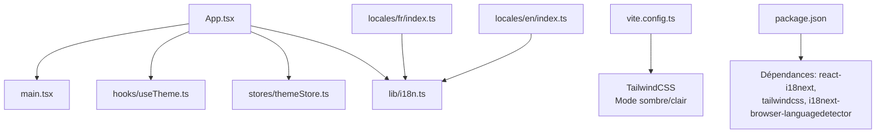
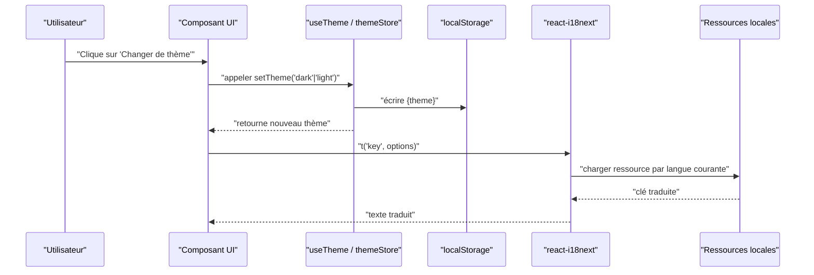
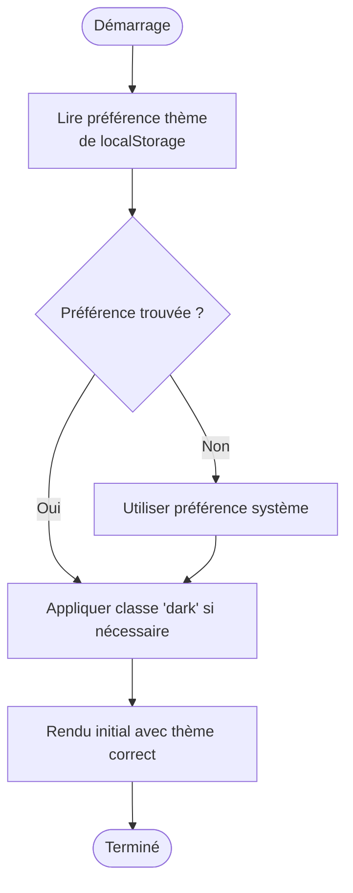
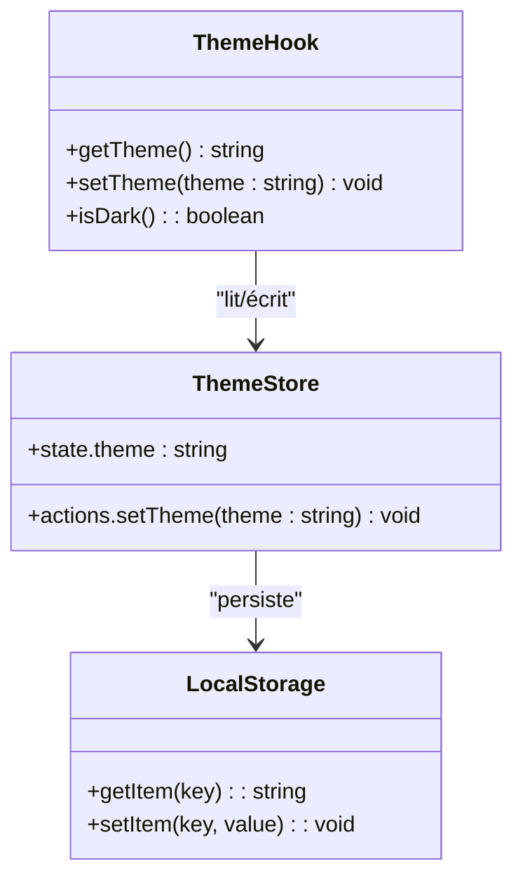
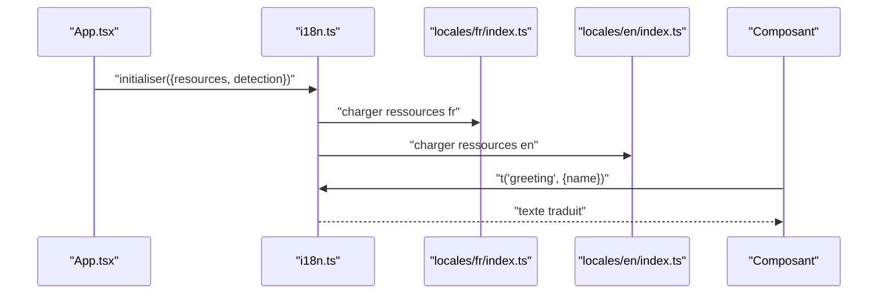
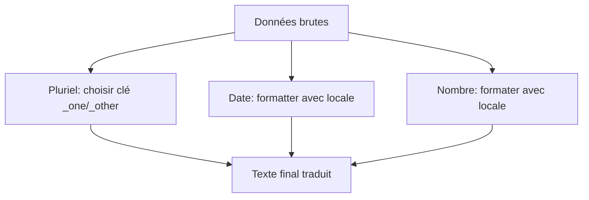
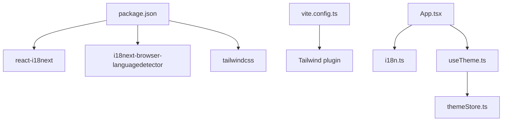

# Thème et Internationalisation

<cite>
**Fichiers référencés dans ce document**
- [frontend/src/App.tsx](file://frontend/src/App.tsx)
- [frontend/src/main.tsx](file://frontend/src/main.tsx)
- [frontend/vite.config.ts](file://frontend/vite.config.ts)
- [frontend/package.json](file://frontend/package.json)
- [frontend/src/locales/fr/index.ts](file://frontend/src/locales/fr/index.ts)
- [frontend/src/locales/en/index.ts](file://frontend/src/locales/en/index.ts)
- [frontend/src/hooks/useTheme.ts](file://frontend/src/hooks/useTheme.ts)
- [frontend/src/stores/themeStore.ts](file://frontend/src/stores/themeStore.ts)
- [frontend/src/lib/i18n.ts](file://frontend/src/lib/i18n.ts)
- [frontend/src/components/ui/Button.tsx](file://frontend/src/components/ui/Button.tsx)
- [frontend/src/features/auth/LoginPage.tsx](file://frontend/src/features/auth/LoginPage.tsx)
</cite>

## Table des matières
1. [Introduction](#introduction)
2. [Structure du projet](#structure-du-projet)
3. [Composants clés](#composants-clés)
4. [Vue d'ensemble de l'architecture](#vue-densemble-de-larchitecture)
5. [Analyse détaillée des composants](#analyse-detaillee-des-composants)
6. [Analyse des dépendances](#analyse-des-dependances)
7. [Considérations de performance](#considerations-de-performance)
8. [Guide de dépannage](#guide-de-depannage)
9. [Conclusion](#conclusion)
10. [Annexes](#annexes)

## Introduction
Ce document explique le système de thème (mode sombre/clair) et d'internationalisation (i18n) d'eLISAschool. Il couvre la configuration TailwindCSS pour le dark/light mode, la persistance des préférences utilisateur, la structure des fichiers de traduction, ainsi que l'utilisation de react-i18next pour les pluriels, dates localisées et formatage des nombres. Vous y trouverez également des exemples pratiques pour changer dynamiquement de thème, ajouter une nouvelle langue et personnaliser les styles, avec un focus sur l'accessibilité, le responsive design et les performances du rendu multilingue.

## Structure du projet
Le frontend utilise Vite comme outil de build, TailwindCSS pour le style, et react-i18next pour l'internationalisation. Les préférences de thème sont stockées localement pour persister le choix de l'utilisateur entre les sessions.

**Sources de diagramme**
- [frontend/src/App.tsx](file://frontend/src/App.tsx)
- [frontend/src/main.tsx](file://frontend/src/main.tsx)
- [frontend/src/hooks/useTheme.ts](file://frontend/src/hooks/useTheme.ts)
- [frontend/src/stores/themeStore.ts](file://frontend/src/stores/themeStore.ts)
- [frontend/src/lib/i18n.ts](file://frontend/src/lib/i18n.ts)
- [frontend/vite.config.ts](file://frontend/vite.config.ts)
- [frontend/package.json](file://frontend/package.json)
- [frontend/src/locales/fr/index.ts](file://frontend/src/locales/fr/index.ts)
- [frontend/src/locales/en/index.ts](file://frontend/src/locales/en/index.ts)

**Sources de section**
- [frontend/src/App.tsx](file://frontend/src/App.tsx)
- [frontend/src/main.tsx](file://frontend/src/main.tsx)
- [frontend/vite.config.ts](file://frontend/vite.config.ts)
- [frontend/package.json](file://frontend/package.json)

## Composants clés
- useTheme: hook React qui gère le basculement entre modes clair/sombre et la persistance via localStorage.
- themeStore: store (par exemple Zustand ou Context) centralisant l'état du thème et exposant des actions pour le modifier.
- i18n: configuration de react-i18next, chargement des ressources par langue, détection de la langue, et initialisation.
- App.tsx: point d'entrée où le provider i18n est appliqué et où le thème est injecté au niveau racine.
- vite.config.ts: configuration Vite incluant TailwindCSS et les plugins nécessaires.
- package.json: dépendances liées à i18n et TailwindCSS.

**Sources de section**
- [frontend/src/hooks/useTheme.ts](file://frontend/src/hooks/useTheme.ts)
- [frontend/src/stores/themeStore.ts](file://frontend/src/stores/themeStore.ts)
- [frontend/src/lib/i18n.ts](file://frontend/src/lib/i18n.ts)
- [frontend/src/App.tsx](file://frontend/src/App.tsx)
- [frontend/vite.config.ts](file://frontend/vite.config.ts)
- [frontend/package.json](file://frontend/package.json)

## Vue d'ensemble de l'architecture
Le système combine trois couches :
- Couche UI : composants React utilisant des classes Tailwind pour le thème et les traductions.
- Couche état : stores/hook pour le thème et gestion locale.
- Couche i18n : react-i18next avec ressources locales et détection de langue.

**Sources de diagramme**
- [frontend/src/hooks/useTheme.ts](file://frontend/src/hooks/useTheme.ts)
- [frontend/src/stores/themeStore.ts](file://frontend/src/stores/themeStore.ts)
- [frontend/src/lib/i18n.ts](file://frontend/src/lib/i18n.ts)
- [frontend/src/locales/fr/index.ts](file://frontend/src/locales/fr/index.ts)
- [frontend/src/locales/en/index.ts](file://frontend/src/locales/en/index.ts)

## Analyse détaillée des composants

### Configuration TailwindCSS pour le dark/light mode
- Le mode sombre s'active généralement via une classe sur l'élément racine (par exemple, application ou html).
- Tailwind permet d'utiliser des variantes dark: pour appliquer des styles conditionnels.
- La configuration Vite intègre Tailwind et ses plugins.

**Sources de diagramme**
- [frontend/src/hooks/useTheme.ts](file://frontend/src/hooks/useTheme.ts)
- [frontend/vite.config.ts](file://frontend/vite.config.ts)

**Sources de section**
- [frontend/vite.config.ts](file://frontend/vite.config.ts)
- [frontend/package.json](file://frontend/package.json)

### Persistance des préférences utilisateur
- Le hook useTheme lit et écrit le thème dans localStorage.
- Le store themeStore expose l'état courant et les actions pour le modifier.
- Au chargement de l'application, l'état est restauré avant le premier rendu pour éviter les flashs.

**Sources de diagramme**
- [frontend/src/hooks/useTheme.ts](file://frontend/src/hooks/useTheme.ts)
- [frontend/src/stores/themeStore.ts](file://frontend/src/stores/themeStore.ts)

**Sources de section**
- [frontend/src/hooks/useTheme.ts](file://frontend/src/hooks/useTheme.ts)
- [frontend/src/stores/themeStore.ts](file://frontend/src/stores/themeStore.ts)

### Système i18n avec react-i18next
- Initialisation de i18n avec ressources par langue (fr, en).
- Détection automatique de la langue depuis le navigateur ou localStorage.
- Utilisation de t('key') dans les composants pour afficher les textes traduits.
- Support des pluriels via les clés avec suffixes _one/_other.

**Sources de diagramme**
- [frontend/src/lib/i18n.ts](file://frontend/src/lib/i18n.ts)
- [frontend/src/locales/fr/index.ts](file://frontend/src/locales/fr/index.ts)
- [frontend/src/locales/en/index.ts](file://frontend/src/locales/en/index.ts)

**Sources de section**
- [frontend/src/lib/i18n.ts](file://frontend/src/lib/i18n.ts)
- [frontend/src/locales/fr/index.ts](file://frontend/src/locales/fr/index.ts)
- [frontend/src/locales/en/index.ts](file://frontend/src/locales/en/index.ts)

### Gestion des pluriels, dates localisées et formatage des nombres
- Pluriels : utiliser les clés avec _one/_other dans les ressources et passer count à t().
- Dates : utiliser Intl.DateTimeFormat ou une bibliothèque comme date-fns-tz avec i18n pour formater selon la locale.
- Nombres : utiliser Intl.NumberFormat pour formater monnaie, pourcentages, etc., selon la langue.

[Ce diagramme illustre un flux conceptuel sans mappage direct aux fichiers]

### Exemples pratiques

#### Changement de thème dynamique
- Dans un composant, appeler setTheme('dark') ou setTheme('light') via useTheme.
- Appliquer des classes Tailwind avec dark: pour adapter les couleurs.

**Sources de section**
- [frontend/src/hooks/useTheme.ts](file://frontend/src/hooks/useTheme.ts)
- [frontend/src/components/ui/Button.tsx](file://frontend/src/components/ui/Button.tsx)

#### Ajout d'une nouvelle langue
- Ajouter un fichier de ressources dans locales/<lang>/index.ts.
- Mettre à jour i18n.ts pour charger cette ressource.
- Proposer le changement de langue dans l'interface et mettre à jour la détection.

**Sources de section**
- [frontend/src/locales/fr/index.ts](file://frontend/src/locales/fr/index.ts)
- [frontend/src/locales/en/index.ts](file://frontend/src/locales/en/index.ts)
- [frontend/src/lib/i18n.ts](file://frontend/src/lib/i18n.ts)

#### Personnalisation des styles
- Utiliser les variables CSS ou les thèmes Tailwind pour définir des palettes.
- Créer des composants réutilisables qui appliquent les styles conditionnels selon le thème.

**Sources de section**
- [frontend/vite.config.ts](file://frontend/vite.config.ts)
- [frontend/src/components/ui/Button.tsx](file://frontend/src/components/ui/Button.tsx)

### Accessibilité
- Assurer un contraste suffisant en mode sombre et clair.
- Utiliser des attributs aria-label pour les icônes et boutons de contrôle.
- Permettre la navigation au clavier pour changer de thème et de langue.

[Section conceptuelle sans analyse de fichiers spécifiques]

### Responsive design
- Utiliser les breakpoints Tailwind pour adapter les layouts.
- Tester les rendus sur différentes tailles d'écran.

[Section conceptuelle sans analyse de fichiers spécifiques]

## Analyse des dépendances
Les dépendances principales incluent react-i18next, i18next-browser-languagedetector, tailwindcss et leurs plugins. Vite configure le bundling et le traitement des styles.

**Sources de diagramme**
- [frontend/package.json](file://frontend/package.json)
- [frontend/vite.config.ts](file://frontend/vite.config.ts)
- [frontend/src/App.tsx](file://frontend/src/App.tsx)
- [frontend/src/lib/i18n.ts](file://frontend/src/lib/i18n.ts)
- [frontend/src/hooks/useTheme.ts](file://frontend/src/hooks/useTheme.ts)
- [frontend/src/stores/themeStore.ts](file://frontend/src/stores/themeStore.ts)

**Sources de section**
- [frontend/package.json](file://frontend/package.json)
- [frontend/vite.config.ts](file://frontend/vite.config.ts)

## Considérations de performance
- Chargement paresseux des ressources i18n par langue pour réduire le bundle initial.
- Mémorisation des traductions et des formats (Intl) pour éviter les recalculs.
- Éviter les re-rendus inutiles en isolant les changements de thème et de langue.
- Utiliser des hooks stables et des stores légers pour minimiser les mises à jour.

[Section générale sans analyse de fichiers spécifiques]

## Guide de dépannage
- Problèmes de thème non persisté : vérifier localStorage et la logique de lecture au démarrage.
- Traductions manquantes : s'assurer que les clés existent dans toutes les ressources et que la détection de langue fonctionne.
- Erreurs de formatage : valider les locales supportées par Intl et les données passées.

**Sources de section**
- [frontend/src/hooks/useTheme.ts](file://frontend/src/hooks/useTheme.ts)
- [frontend/src/lib/i18n.ts](file://frontend/src/lib/i18n.ts)

## Conclusion
Le système de thème et d'internationalisation d'eLISAschool repose sur une architecture claire : un hook/store pour le thème avec persistance locale, et react-i18next pour gérer les traductions, pluriels et formats locaux. En suivant les bonnes pratiques d'accessibilité, de responsive design et de performance, l'application offre une expérience fluide et personnalisable pour les utilisateurs francophones et anglophones.

## Annexes
- Exemple de page de connexion intégrant le thème et les traductions.

**Sources de section**
- [frontend/src/features/auth/LoginPage.tsx](file://frontend/src/features/auth/LoginPage.tsx)