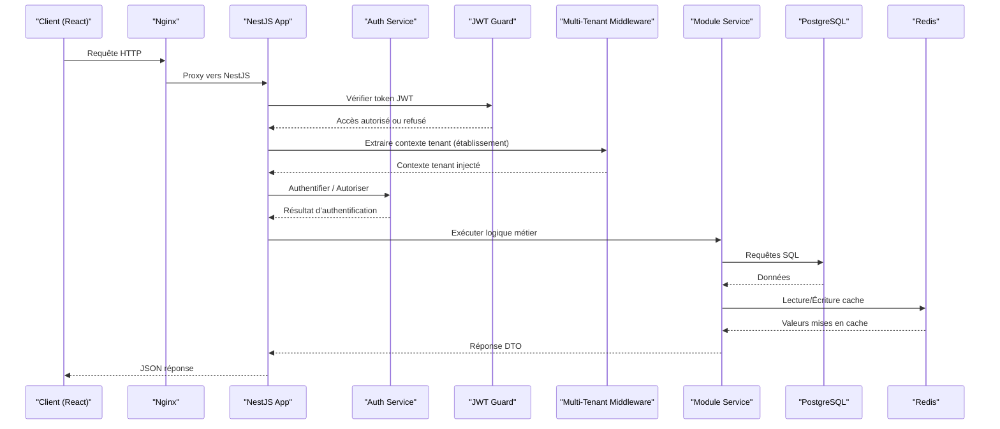
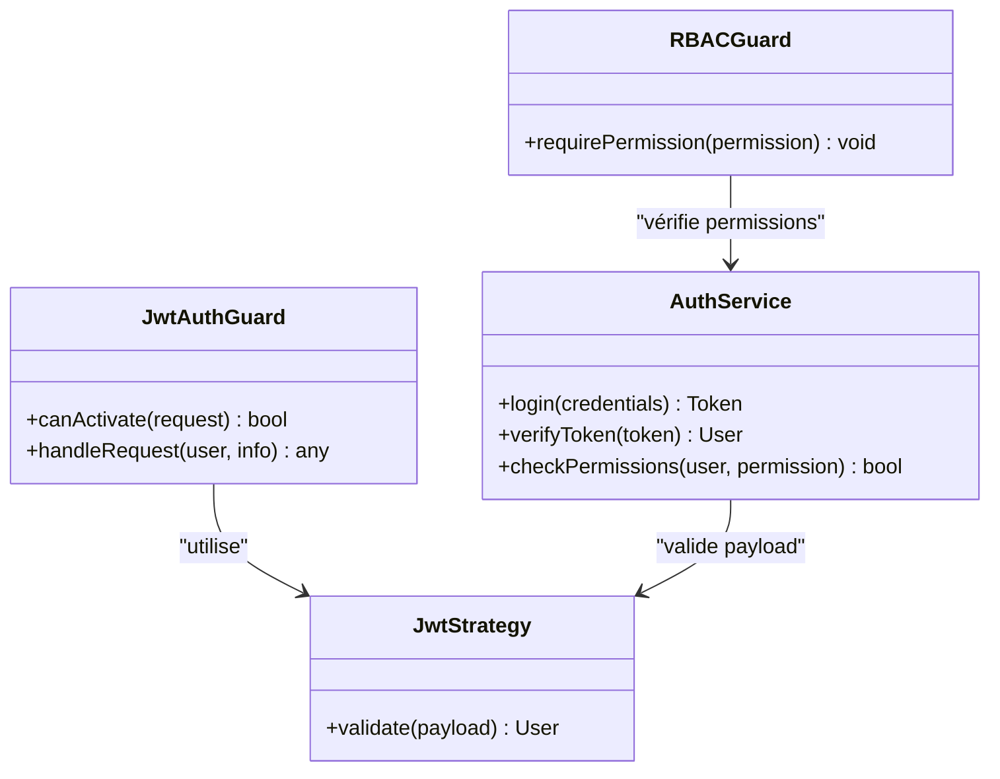
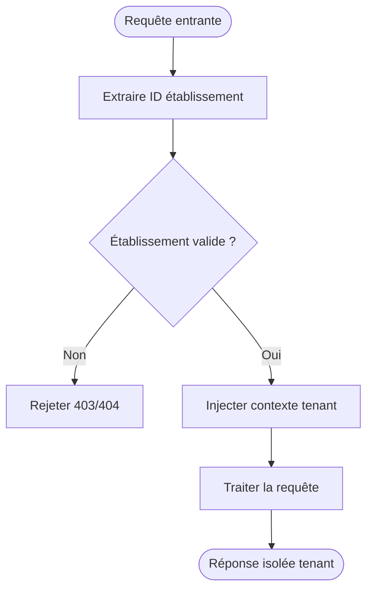
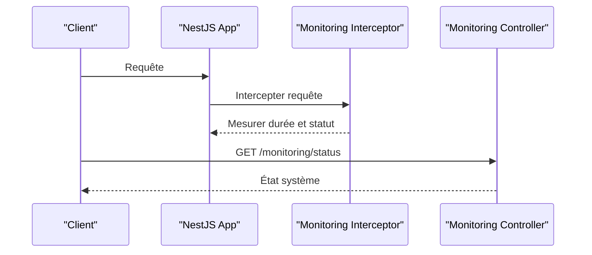
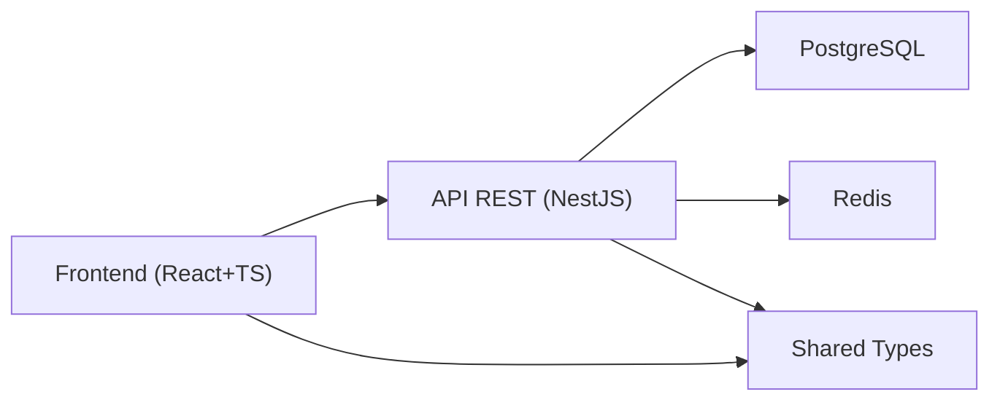
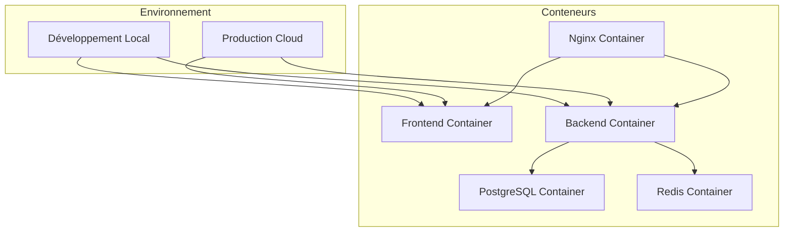

# Architecture Technique

<cite>
**Fichiers référencés dans ce document**
- [backend/src/app.ts](file://backend/src/app.ts)
- [backend/src/index.ts](file://backend/src/index.ts)
- [backend/src/config/database.config.ts](file://backend/src/config/database.config.ts)
- [backend/src/config/env.config.ts](file://backend/src/config/env.config.ts)
- [backend/src/config/swagger.config.ts](file://backend/src/config/swagger.config.ts)
- [backend/src/modules/auth/guards/jwt-auth.guard.ts](file://backend/src/modules/auth/guards/jwt-auth.guard.ts)
- [backend/src/modules/auth/strategies/jwt.strategy.ts](file://backend/src/modules/auth/strategies/jwt.strategy.ts)
- [backend/src/modules/auth/services/auth.service.ts](file://backend/src/modules/auth/services/auth.service.ts)
- [backend/src/modules/utilisateurs/services/utilisateur-etablissement.service.ts](file://backend/src/modules/utilisateurs/services/utilisateur-etablissement.service.ts)
- [backend/src/common/middlewares/multi-tenant.middleware.ts](file://backend/src/common/middlewares/multi-tenant.middleware.ts)
- [backend/src/common/interceptors/monitoring.interceptor.ts](file://backend/src/common/interceptors/monitoring.interceptor.ts)
- [backend/src/modules/monitoring/controllers/monitoring.controller.ts](file://backend/src/modules/monitoring/controllers/monitoring.controller.ts)
- [backend/src/routes/route-registry.ts](file://backend/src/routes/route-registry.ts)
- [backend/package.json](file://backend/package.json)
- [docker/Dockerfile.backend](file://docker/Dockerfile.backend)
- [docker/docker-compose.yml](file://docker/docker-compose.yml)
- [docker/nginx.conf](file://docker/nginx.conf)
- [frontend/src/App.tsx](file://frontend/src/App.tsx)
- [frontend/src/main.tsx](file://frontend/src/main.tsx)
- [frontend/vite.config.ts](file://frontend/vite.config.ts)
- [shared/src/types/index.ts](file://shared/src/types/index.ts)
- [backend/src/modules/dashboard/services/dashboard.service.ts](file://backend/src/modules/dashboard/services/dashboard.service.ts)
- [backend/src/modules/notifications/services/notification.service.ts](file://backend/src/modules/notifications/services/notification.service.ts)
- [backend/src/modules/finances/services/finances.service.ts](file://backend/src/modules/finances/services/finances.service.ts)
- [backend/src/modules/personnel/services/personnel.service.ts](file://backend/src/modules/personnel/services/personnel.service.ts)
- [backend/src/modules/eleves/services/eleves.service.ts](file://backend/src/modules/eleves/services/eleves.service.ts)
- [backend/src/modules/notes/services/notes.service.ts](file://backend/src/modules/notes/services/notes.service.ts)
- [backend/src/modules/bulletins/services/bulletins.service.ts](file://backend/src/modules/bulletins/services/bulletins.service.ts)
- [backend/src/modules/emploi-du-temps/services/emploi-du-temps.service.ts](file://backend/src/modules/emploi-du-temps/services/emploi-du-temps.service.ts)
- [backend/src/modules/sante/services/sante.service.ts](file://backend/src/modules/sante/services/sante.service.ts)
- [backend/src/modules/recrutement/services/recrutement.service.ts](file://backend/src/modules/recrutement/services/recrutement.service.ts)
- [backend/src/modules/sondages/services/sondages.service.ts](file://backend/src/modules/sondages/services/sondages.service.ts)
- [backend/src/modules/messagerie/services/messagerie.service.ts](file://backend/src/modules/messagerie/services/messagerie.service.ts)
- [backend/src/modules/gamification/services/gamification.service.ts](file://backend/src/modules/gamification/services/gamification.service.ts)
- [backend/src/modules/scoring/services/scoring.service.ts](file://backend/src/modules/scoring/services/scoring.service.ts)
- [backend/src/modules/organisation/services/organisation.service.ts](file://backend/src/modules/organisation/services/organisation.service.ts)
- [backend/src/modules/options/services/options.service.ts](file://backend/src/modules/options/services/options.service.ts)
- [backend/src/modules/types-enum/services/types-enum.service.ts](file://backend/src/modules/types-enum/services/types-enum.service.ts)
- [backend/src/modules/validation-workflow/services/validation-workflow.service.ts](file://backend/src/modules/validation-workflow/services/validation-workflow.service.ts)
- [backend/src/modules/audit/services/audit.service.ts](file://backend/src/modules/audit/services/audit.service.ts)
- [backend/src/modules/configuration/services/configuration.service.ts](file://backend/src/modules/configuration/services/configuration.service.ts)
- [backend/src/modules/apparence/services/apparence.service.ts](file://backend/src/modules/apparence/services/apparence.service.ts)
- [backend/src/modules/cantine/services/cantine.service.ts](file://backend/src/modules/cantine/services/cantine.service.ts)
- [backend/src/modules/cartes/services/cartes.service.ts](file://backend/src/modules/cartes/services/cartes.service.ts)
- [backend/src/modules/classes/services/classes.service.ts](file://backend/src/modules/classes/services/classes.service.ts)
- [backend/src/modules/clubs/services/clubs.service.ts](file://backend/src/modules/clubs/services/clubs.service.ts)
- [backend/src/modules/competences/services/competences.service.ts](file://backend/src/modules/competences/services/competences.service.ts)
- [backend/src/modules/cycles/services/cycles.service.ts](file://backend/src/modules/cycles/services/cycles.service.ts)
- [backend/src/modules/diplomes-eleves/services/diplomes-eleves.service.ts](file://backend/src/modules/diplomes-eleves/services/diplomes-eleves.service.ts)
- [backend/src/modules/examens-nationaux/services/examens-nationaux.service.ts](file://backend/src/modules/examens-nationaux/services/examens-nationaux.service.ts)
- [backend/src/modules/filieres/services/filieres.service.ts](file://backend/src/modules/filieres/services/filieres.service.ts)
- [backend/src/modules/impressions/services/impressions.service.ts](file://backend/src/modules/impressions/services/impressions.service.ts)
- [backend/src/modules/materiel/services/materiel.service.ts](file://backend/src/modules/materiel/services/materiel.service.ts)
- [backend/src/modules/matieres/services/matieres.service.ts](file://backend/src/modules/matieres/services/matieres.service.ts)
- [backend/src/modules/niveaux/services/niveaux.service.ts](file://backend/src/modules/niveaux/services/niveaux.service.ts)
- [backend/src/modules/options/services/options.service.ts](file://backend/src/modules/options/services/options.service.ts)
- [backend/src/modules/parking/services/parking.service.ts](file://backend/src/modules/parking/services/parking.service.ts)
- [backend/src/modules/periodes/services/periodes.service.ts](file://backend/src/modules/periodes/services/periodes.service.ts)
- [backend/src/modules/programmes/services/programmes.service.ts](file://backend/src/modules/programmes/services/programmes.service.ts)
- [backend/src/modules/requetes/services/requetes.service.ts](file://backend/src/modules/requetes/services/requetes.service.ts)
- [backend/src/modules/responsables-eleves/services/responsables-eleves.service.ts](file://backend/src/modules/responsables-eleves/services/responsables-eleves.service.ts)
- [backend/src/modules/salles/services/salles.service.ts](file://backend/src/modules/salles/services/salles.service.ts)
- [backend/src/modules/specialites/services/specialites.service.ts](file://backend/src/modules/specialites/services/specialites.service.ts)
- [backend/src/modules/suivi-eleves/services/suivi-eleves.service.ts](file://backend/src/modules/suivi-eleves/services/suivi-eleves.service.ts)
- [backend/src/modules/suivi-personnel/services/suivi-personnel.service.ts](file://backend/src/modules/suivi-personnel/services/suivi-personnel.service.ts)
- [backend/src/modules/transport/services/transport.service.ts](file://backend/src/modules/transport/services/transport.service.ts)
</cite>

## Table des matières
1. [Introduction](#introduction)
2. [Structure du projet](#structure-du-projet)
3. [Composants clés](#composants-clés)
4. [Vue d'ensemble de l'architecture](#vue-densemble-de-larchitecture)
5. [Analyse détaillée des composants](#analyse-detaillee-des-composants)
6. [Analyse des dépendances](#analyse-des-dependances)
7. [Considérations de performance](#considerations-de-performance)
8. [Guide de dépannage](#guide-de-depannage)
9. [Conclusion](#conclusion)
10. [Annexes](#annexes)

## Introduction
Ce document présente l’architecture technique d’eLISAschool, une application scolaire modulaire conçue pour le multi-établissement et le multi-locataire. Le backend est développé avec NestJS (Node.js/TypeScript), le frontend avec React et TypeScript, et l’infrastructure est conteneurisée via Docker. L’application suit les patterns MVC, Repository Pattern et Service Layer, avec une isolation tenant stricte par établissement, un caching Redis, et une communication inter-services orientée API REST. La documentation couvre la stack technologique, les flux de données, les décisions architecturales, la scalabilité, la sécurité, le monitoring et la reprise après sinistre.

## Structure du projet
Le projet est organisé en trois grands sous-réseaux :
- Backend NestJS : modules fonctionnels (auth, utilisateurs, finances, personnel, eleves, notes, bulletins, emploi-du-temps, sante, recrutement, sondages, messagerie, gamification, scoring, organisation, options, types-enum, validation-workflow, audit, configuration, apparence, cantine, cartes, classes, clubs, competences, cycles, diplomes-eleves, examens-nationaux, filieres, impressions, materiel, matieres, niveaux, parking, periodes, programmes, requetes, responsables-eleves, salles, specialites, suivi-eleves, suivi-personnel, transport).
- Frontend React + TypeScript : routes, features, hooks, stores, lib, components, config, locales.
- Infrastructure Docker : images, compose, Nginx, scripts de déploiement et maintenance.

```mermaid
graph TB
subgraph "Frontend"
FE_App["App.tsx"]
FE_Main["main.tsx"]
FE_Vite["vite.config.ts"]
end
subgraph "Backend NestJS"
BE_App["app.ts"]
BE_Index["index.ts"]
BE_Routes["route-registry.ts"]
BE_ConfigDB["config/database.config.ts"]
BE_ConfigEnv["config/env.config.ts"]
BE_Swagger["config/swagger.config.ts"]
subgraph "Modules"
M_Auth["modules/auth/*"]
M_Utilisateurs["modules/utilisateurs/*"]
M_Dashboard["modules/dashboard/*"]
M_Notifications["modules/notifications/*"]
M_Finances["modules/finances/*"]
M_Personnel["modules/personnel/*"]
M_Eleves["modules/eleves/*"]
M_Notes["modules/notes/*"]
M_Bulletins["modules/bulletins/*"]
M_EDT["modules/emploi-du-temps/*"]
M_Sante["modules/sante/*"]
M_Recrutement["modules/recrutement/*"]
M_Sondages["modules/sondages/*"]
M_Messagerie["modules/messagerie/*"]
M_Gamification["modules/gamification/*"]
M_Scoring["modules/scoring/*"]
M_Organisation["modules/organisation/*"]
M_Options["modules/options/*"]
M_TypesEnum["modules/types-enum/*"]
M_Workflow["modules/validation-workflow/*"]
M_Audit["modules/audit/*"]
M_Config["modules/configuration/*"]
M_Apparence["modules/apparence/*"]
M_Cantine["modules/cantine/*"]
M_Cartes["modules/cartes/*"]
M_Classes["modules/classes/*"]
M_Clubs["modules/clubs/*"]
M_Competences["modules/competences/*"]
M_Cycles["modules/cycles/*"]
M_Diplomes["modules/diplomes-eleves/*"]
M_Examens["modules/examens-nationaux/*"]
M_Filieres["modules/filieres/*"]
M_Impressions["modules/impressions/*"]
M_Materiel["modules/materiel/*"]
M_Matieres["modules/matieres/*"]
M_Niveaux["modules/niveaux/*"]
M_Parking["modules/parking/*"]
M_Periods["modules/periodes/*"]
M_Programmes["modules/programmes/*"]
M_Requetes["modules/requetes/*"]
M_Responsables["modules/responsables-eleves/*"]
M_Salles["modules/salles/*"]
M_Specialites["modules/specialites/*"]
M_SuiviEleves["modules/suivi-eleves/*"]
M_SuiviPersonnel["modules/suivi-personnel/*"]
M_Transport["modules/transport/*"]
end
Common["common/* (guards, interceptors, middlewares, utils)"]
end
subgraph "Infrastructure"
DB["PostgreSQL"]
Cache["Redis"]
Nginx["Nginx"]
Docker["Docker Compose"]
end
FE_App --> BE_App
FE_Main --> FE_App
FE_Vite --> FE_Main
BE_App --> BE_Index
BE_Index --> BE_Routes
BE_App --> Common
BE_App --> M_Auth
BE_App --> M_Utilisateurs
BE_App --> M_Dashboard
BE_App --> M_Notifications
BE_App --> M_Finances
BE_App --> M_Personnel
BE_App --> M_Eleves
BE_App --> M_Notes
BE_App --> M_Bulletins
BE_App --> M_EDT
BE_App --> M_Sante
BE_App --> M_Recrutement
BE_App --> M_Sondages
BE_App --> M_Messagerie
BE_App --> M_Gamification
BE_App --> M_Scoring
BE_App --> M_Organisation
BE_App --> M_Options
BE_App --> M_TypesEnum
BE_App --> M_Workflow
BE_App --> M_Audit
BE_App --> M_Config
BE_App --> M_Apparence
BE_App --> M_Cantine
BE_App --> M_Cartes
BE_App --> M_Classes
BE_App --> M_Clubs
BE_App --> M_Competences
BE_App --> M_Cycles
BE_App --> M_Diplomes
BE_App --> M_Examens
BE_App --> M_Filieres
BE_App --> M_Impressions
BE_App --> M_Materiel
BE_App --> M_Matieres
BE_App --> M_Niveaux
BE_App --> M_Parking
BE_App --> M_Periods
BE_App --> M_Programmes
BE_App --> M_Requetes
BE_App --> M_Responsables
BE_App --> M_Salles
BE_App --> M_Specialites
BE_App --> M_SuiviEleves
BE_App --> M_SuiviPersonnel
BE_App --> M_Transport
BE_ConfigDB --> DB
BE_ConfigEnv --> Cache
Nginx --> BE_App
Docker --> Nginx
```

**Diagramme sources**
- [backend/src/app.ts](file://backend/src/app.ts)
- [backend/src/index.ts](file://backend/src/index.ts)
- [backend/src/routes/route-registry.ts](file://backend/src/routes/route-registry.ts)
- [backend/src/config/database.config.ts](file://backend/src/config/database.config.ts)
- [backend/src/config/env.config.ts](file://backend/src/config/env.config.ts)
- [docker/docker-compose.yml](file://docker/docker-compose.yml)
- [docker/nginx.conf](file://docker/nginx.conf)
- [frontend/src/App.tsx](file://frontend/src/App.tsx)
- [frontend/src/main.tsx](file://frontend/src/main.tsx)
- [frontend/vite.config.ts](file://frontend/vite.config.ts)

**Section sources**
- [backend/src/app.ts](file://backend/src/app.ts)
- [backend/src/index.ts](file://backend/src/index.ts)
- [backend/src/routes/route-registry.ts](file://backend/src/routes/route-registry.ts)
- [backend/src/config/database.config.ts](file://backend/src/config/database.config.ts)
- [backend/src/config/env.config.ts](file://backend/src/config/env.config.ts)
- [docker/docker-compose.yml](file://docker/docker-compose.yml)
- [docker/nginx.conf](file://docker/nginx.conf)
- [frontend/src/App.tsx](file://frontend/src/App.tsx)
- [frontend/src/main.tsx](file://frontend/src/main.tsx)
- [frontend/vite.config.ts](file://frontend/vite.config.ts)

## Composants clés
- Authentification et autorisation : JWT Guard et Strategy, service d’authentification, RBAC.
- Multi-tenant : middleware d’isolation par établissement, services utilisateur-établissement.
- Monitoring : interceptor de monitoring, contrôleur de métriques.
- Configuration : Swagger, base de données, variables d’environnement.
- Modules métier : tous les modules fonctionnels listés ci-dessus.

**Section sources**
- [backend/src/modules/auth/guards/jwt-auth.guard.ts](file://backend/src/modules/auth/guards/jwt-auth.guard.ts)
- [backend/src/modules/auth/strategies/jwt.strategy.ts](file://backend/src/modules/auth/strategies/jwt.strategy.ts)
- [backend/src/modules/auth/services/auth.service.ts](file://backend/src/modules/auth/services/auth.service.ts)
- [backend/src/common/middlewares/multi-tenant.middleware.ts](file://backend/src/common/middlewares/multi-tenant.middleware.ts)
- [backend/src/modules/utilisateurs/services/utilisateur-etablissement.service.ts](file://backend/src/modules/utilisateurs/services/utilisateur-etablissement.service.ts)
- [backend/src/common/interceptors/monitoring.interceptor.ts](file://backend/src/common/interceptors/monitoring.interceptor.ts)
- [backend/src/modules/monitoring/controllers/monitoring.controller.ts](file://backend/src/modules/monitoring/controllers/monitoring.controller.ts)
- [backend/src/config/swagger.config.ts](file://backend/src/config/swagger.config.ts)

## Vue d'ensemble de l'architecture
L’architecture suit un modèle microservices modulaire au sein d’un monorepo NestJS :
- Couche présentation : React/TypeScript (Vite) qui appelle l’API REST.
- Couche API : NestJS Controllers → Guards/Interceptors → Services → Repositories → Base de données.
- Couche infrastructure : PostgreSQL pour la persistance, Redis pour le cache, Nginx comme reverse proxy, Docker pour l’orchestration.

**Diagramme sources**
- [backend/src/modules/auth/guards/jwt-auth.guard.ts](file://backend/src/modules/auth/guards/jwt-auth.guard.ts)
- [backend/src/modules/auth/strategies/jwt.strategy.ts](file://backend/src/modules/auth/strategies/jwt.strategy.ts)
- [backend/src/modules/auth/services/auth.service.ts](file://backend/src/modules/auth/services/auth.service.ts)
- [backend/src/common/middlewares/multi-tenant.middleware.ts](file://backend/src/common/middlewares/multi-tenant.middleware.ts)
- [backend/src/config/database.config.ts](file://backend/src/config/database.config.ts)
- [backend/src/config/env.config.ts](file://backend/src/config/env.config.ts)
- [docker/nginx.conf](file://docker/nginx.conf)

**Section sources**
- [backend/src/modules/auth/guards/jwt-auth.guard.ts](file://backend/src/modules/auth/guards/jwt-auth.guard.ts)
- [backend/src/modules/auth/strategies/jwt.strategy.ts](file://backend/src/modules/auth/strategies/jwt.strategy.ts)
- [backend/src/modules/auth/services/auth.service.ts](file://backend/src/modules/auth/services/auth.service.ts)
- [backend/src/common/middlewares/multi-tenant.middleware.ts](file://backend/src/common/middlewares/multi-tenant.middleware.ts)
- [backend/src/config/database.config.ts](file://backend/src/config/database.config.ts)
- [backend/src/config/env.config.ts](file://backend/src/config/env.config.ts)
- [docker/nginx.conf](file://docker/nginx.conf)

## Analyse détaillée des composants

### Authentification et autorisation (JWT + RBAC)
- JWT Guard valide les tokens à chaque requête protégée.
- JWT Strategy extrait les informations utilisateur depuis le token.
- Auth Service gère la connexion, génération de tokens et vérification des rôles/permissions.
- RBAC est intégré via guards et decorators pour restreindre l’accès aux ressources.

**Diagramme sources**
- [backend/src/modules/auth/guards/jwt-auth.guard.ts](file://backend/src/modules/auth/guards/jwt-auth.guard.ts)
- [backend/src/modules/auth/strategies/jwt.strategy.ts](file://backend/src/modules/auth/strategies/jwt.strategy.ts)
- [backend/src/modules/auth/services/auth.service.ts](file://backend/src/modules/auth/services/auth.service.ts)

**Section sources**
- [backend/src/modules/auth/guards/jwt-auth.guard.ts](file://backend/src/modules/auth/guards/jwt-auth.guard.ts)
- [backend/src/modules/auth/strategies/jwt.strategy.ts](file://backend/src/modules/auth/strategies/jwt.strategy.ts)
- [backend/src/modules/auth/services/auth.service.ts](file://backend/src/modules/auth/services/auth.service.ts)

### Isolation multi-tenant (par établissement)
- Middleware multi-tenant extrait l’ID d’établissement depuis la requête ou le contexte utilisateur.
- Service Utilisateur-Etablissement lie utilisateurs et établissements, assurant l’isolation des données.
- Tous les modules doivent respecter le scope tenant via des filtres et requêtes conditionnelles.

**Diagramme sources**
- [backend/src/common/middlewares/multi-tenant.middleware.ts](file://backend/src/common/middlewares/multi-tenant.middleware.ts)
- [backend/src/modules/utilisateurs/services/utilisateur-etablissement.service.ts](file://backend/src/modules/utilisateurs/services/utilisateur-etablissement.service.ts)

**Section sources**
- [backend/src/common/middlewares/multi-tenant.middleware.ts](file://backend/src/common/middlewares/multi-tenant.middleware.ts)
- [backend/src/modules/utilisateurs/services/utilisateur-etablissement.service.ts](file://backend/src/modules/utilisateurs/services/utilisateur-etablissement.service.ts)

### Monitoring et observabilité
- Interceptor de monitoring capture les temps de réponse, erreurs et métriques.
- Contrôleur de monitoring expose des endpoints pour inspecter l’état du système.
- Intégration possible avec outils externes via logs structurés.

**Diagramme sources**
- [backend/src/common/interceptors/monitoring.interceptor.ts](file://backend/src/common/interceptors/monitoring.interceptor.ts)
- [backend/src/modules/monitoring/controllers/monitoring.controller.ts](file://backend/src/modules/monitoring/controllers/monitoring.controller.ts)

**Section sources**
- [backend/src/common/interceptors/monitoring.interceptor.ts](file://backend/src/common/interceptors/monitoring.interceptor.ts)
- [backend/src/modules/monitoring/controllers/monitoring.controller.ts](file://backend/src/modules/monitoring/controllers/monitoring.controller.ts)

### Configuration et documentation API
- Swagger configuré pour exposer automatiquement les endpoints.
- Configuration de base de données centralisée.
- Variables d’environnement pour adapter l’exécution.

**Section sources**
- [backend/src/config/swagger.config.ts](file://backend/src/config/swagger.config.ts)
- [backend/src/config/database.config.ts](file://backend/src/config/database.config.ts)
- [backend/src/config/env.config.ts](file://backend/src/config/env.config.ts)

### Modules métier principaux
Chaque module suit le pattern MVC + Service Layer + Repository Pattern :
- Controllers exposent les endpoints REST.
- Services implémentent la logique métier.
- Repositories effectuent les accès aux données.
- DTOs définissent les structures de données.

Exemples de modules :
- Dashboard : agrégation de statistiques.
- Notifications : gestion des alertes et messages.
- Finances : frais, paiements, factures.
- Personnel : gestion RH, contrats, paie.
- Eleves : inscriptions, suivis, dossiers.
- Notes/Bulletins : évaluations et relevés.
- Emploi du temps : planification des cours.
- Santé : dossiers médicaux, consultations.
- Recrutement : processus d’admission.
- Sondages : enquêtes et résultats.
- Messagerie : communications internes.
- Gamification : points, badges, classements.
- Scoring : calculs de scores et indicateurs.
- Organisation : structure hiérarchique.
- Options/Types-Enum : configurations globales.
- Validation Workflow : workflows de validation.
- Audit : traçabilité des actions.
- Configuration : paramètres applicatifs.
- Apparence : thèmes et personnalisations.
- Cantine : gestion des repas.
- Cartes : cartes scolaires.
- Classes/Cycles/Niveaux : structure académique.
- Clubs/Compétences/Specialités : activités extrascolaires.
- Diplômes/Examens Nationaux : certifications.
- Filieres/Programmes : parcours pédagogiques.
- Impressions/Materiel : gestion documentaire et inventaire.
- Parking/Periodes/Programmes : logistique et temporalité.
- Requetes/Responsables Eleves : requêtes avancées et relations familiales.
- Salles/Transport : infrastructures et mobilité.
- Suivi Eleves/Personnel : suivi continu.

**Section sources**
- [backend/src/modules/dashboard/services/dashboard.service.ts](file://backend/src/modules/dashboard/services/dashboard.service.ts)
- [backend/src/modules/notifications/services/notification.service.ts](file://backend/src/modules/notifications/services/notification.service.ts)
- [backend/src/modules/finances/services/finances.service.ts](file://backend/src/modules/finances/services/finances.service.ts)
- [backend/src/modules/personnel/services/personnel.service.ts](file://backend/src/modules/personnel/services/personnel.service.ts)
- [backend/src/modules/eleves/services/eleves.service.ts](file://backend/src/modules/eleves/services/eleves.service.ts)
- [backend/src/modules/notes/services/notes.service.ts](file://backend/src/modules/notes/services/notes.service.ts)
- [backend/src/modules/bulletins/services/bulletins.service.ts](file://backend/src/modules/bulletins/services/bulletins.service.ts)
- [backend/src/modules/emploi-du-temps/services/emploi-du-temps.service.ts](file://backend/src/modules/emploi-du-temps/services/emploi-du-temps.service.ts)
- [backend/src/modules/sante/services/sante.service.ts](file://backend/src/modules/sante/services/sante.service.ts)
- [backend/src/modules/recrutement/services/recrutement.service.ts](file://backend/src/modules/recrutement/services/recrutement.service.ts)
- [backend/src/modules/sondages/services/sondages.service.ts](file://backend/src/modules/sondages/services/sondages.service.ts)
- [backend/src/modules/messagerie/services/messagerie.service.ts](file://backend/src/modules/messagerie/services/messagerie.service.ts)
- [backend/src/modules/gamification/services/gamification.service.ts](file://backend/src/modules/gamification/services/gamification.service.ts)
- [backend/src/modules/scoring/services/scoring.service.ts](file://backend/src/modules/scoring/services/scoring.service.ts)
- [backend/src/modules/organisation/services/organisation.service.ts](file://backend/src/modules/organisation/services/organisation.service.ts)
- [backend/src/modules/options/services/options.service.ts](file://backend/src/modules/options/services/options.service.ts)
- [backend/src/modules/types-enum/services/types-enum.service.ts](file://backend/src/modules/types-enum/services/types-enum.service.ts)
- [backend/src/modules/validation-workflow/services/validation-workflow.service.ts](file://backend/src/modules/validation-workflow/services/validation-workflow.service.ts)
- [backend/src/modules/audit/services/audit.service.ts](file://backend/src/modules/audit/services/audit.service.ts)
- [backend/src/modules/configuration/services/configuration.service.ts](file://backend/src/modules/configuration/services/configuration.service.ts)
- [backend/src/modules/apparence/services/apparence.service.ts](file://backend/src/modules/apparence/services/apparence.service.ts)
- [backend/src/modules/cantine/services/cantine.service.ts](file://backend/src/modules/cantine/services/cantine.service.ts)
- [backend/src/modules/cartes/services/cartes.service.ts](file://backend/src/modules/cartes/services/cartes.service.ts)
- [backend/src/modules/classes/services/classes.service.ts](file://backend/src/modules/classes/services/classes.service.ts)
- [backend/src/modules/clubs/services/clubs.service.ts](file://backend/src/modules/clubs/services/clubs.service.ts)
- [backend/src/modules/competences/services/competences.service.ts](file://backend/src/modules/competences/services/competences.service.ts)
- [backend/src/modules/cycles/services/cycles.service.ts](file://backend/src/modules/cycles/services/cycles.service.ts)
- [backend/src/modules/diplomes-eleves/services/diplomes-eleves.service.ts](file://backend/src/modules/diplomes-eleves/services/diplomes-eleves.service.ts)
- [backend/src/modules/examens-nationaux/services/examens-nationaux.service.ts](file://backend/src/modules/examens-nationaux/services/examens-nationaux.service.ts)
- [backend/src/modules/filieres/services/filieres.service.ts](file://backend/src/modules/filieres/services/filieres.service.ts)
- [backend/src/modules/impressions/services/impressions.service.ts](file://backend/src/modules/impressions/services/impressions.service.ts)
- [backend/src/modules/materiel/services/materiel.service.ts](file://backend/src/modules/materiel/services/materiel.service.ts)
- [backend/src/modules/matieres/services/matieres.service.ts](file://backend/src/modules/matieres/services/matieres.service.ts)
- [backend/src/modules/niveaux/services/niveaux.service.ts](file://backend/src/modules/niveaux/services/niveaux.service.ts)
- [backend/src/modules/parking/services/parking.service.ts](file://backend/src/modules/parking/services/parking.service.ts)
- [backend/src/modules/periodes/services/periodes.service.ts](file://backend/src/modules/periodes/services/periodes.service.ts)
- [backend/src/modules/programmes/services/programmes.service.ts](file://backend/src/modules/programmes/services/programmes.service.ts)
- [backend/src/modules/requetes/services/requetes.service.ts](file://backend/src/modules/requetes/services/requetes.service.ts)
- [backend/src/modules/responsables-eleves/services/responsables-eleves.service.ts](file://backend/src/modules/responsables-eleves/services/responsables-eleves.service.ts)
- [backend/src/modules/salles/services/salles.service.ts](file://backend/src/modules/salles/services/salles.service.ts)
- [backend/src/modules/specialites/services/specialites.service.ts](file://backend/src/modules/specialites/services/specialites.service.ts)
- [backend/src/modules/suivi-eleves/services/suivi-eleves.service.ts](file://backend/src/modules/suivi-eleves/services/suivi-eleves.service.ts)
- [backend/src/modules/suivi-personnel/services/suivi-personnel.service.ts](file://backend/src/modules/suivi-personnel/services/suivi-personnel.service.ts)
- [backend/src/modules/transport/services/transport.service.ts](file://backend/src/modules/transport/services/transport.service.ts)

## Analyse des dépendances
- Dépendances runtime : Node.js, NestJS, TypeORM/Prisma (selon configuration), PostgreSQL, Redis, Nginx.
- Dépendances dev : TypeScript, Vite, Jest, ESLint.
- Partage de types entre frontend/backend via package shared.

**Diagramme sources**
- [backend/package.json](file://backend/package.json)
- [shared/src/types/index.ts](file://shared/src/types/index.ts)

**Section sources**
- [backend/package.json](file://backend/package.json)
- [shared/src/types/index.ts](file://shared/src/types/index.ts)

## Considérations de performance
- Mise en cache Redis pour les données fréquemment consultées (paramètres, listes de référence).
- Indexation PostgreSQL optimisée via migrations dédiées.
- Pagination côté serveur pour les grandes listes.
- Connexion poolée à la base de données.
- Observabilité via monitoring interceptor et logs structurés.

[No sources needed since this section provides general guidance]

## Guide de dépannage
- Erreurs d’authentification : vérifier JWT secret, expiration, stratégie.
- Problèmes multi-tenant : valider l’injection du contexte établissement.
- Performances : analyser les requêtes lentes, activer les index, vérifier le cache Redis.
- Monitoring : utiliser les endpoints de monitoring pour diagnostiquer l’état du système.

**Section sources**
- [backend/src/modules/auth/guards/jwt-auth.guard.ts](file://backend/src/modules/auth/guards/jwt-auth.guard.ts)
- [backend/src/modules/auth/strategies/jwt.strategy.ts](file://backend/src/modules/auth/strategies/jwt.strategy.ts)
- [backend/src/common/middlewares/multi-tenant.middleware.ts](file://backend/src/common/middlewares/multi-tenant.middleware.ts)
- [backend/src/common/interceptors/monitoring.interceptor.ts](file://backend/src/common/interceptors/monitoring.interceptor.ts)

## Conclusion
eLISAschool adopte une architecture modulaire robuste, sécurisée et évolutive, adaptée au contexte éducatif africain et multi-établissement. Les patterns MVC, Repository et Service Layer assurent une séparation claire des responsabilités. L’isolation tenant, le caching Redis et le monitoring permettent une expérience performante et fiable. La stack Docker/Nginx facilite le déploiement et la scalabilité horizontale.

[No sources needed since this section summarizes without analyzing specific files]

## Annexes

### Stack technologique et versions
- Backend : NestJS, TypeScript, TypeORM/Prisma, PostgreSQL, Redis.
- Frontend : React, TypeScript, Vite.
- Infrastructure : Docker, Nginx.
- Outils : Swagger, Jest, ESLint.

**Section sources**
- [backend/package.json](file://backend/package.json)
- [frontend/package.json](file://frontend/package.json)
- [docker/Dockerfile.backend](file://docker/Dockerfile.backend)
- [docker/docker-compose.yml](file://docker/docker-compose.yml)

### Schéma de déploiement

**Diagramme sources**
- [docker/docker-compose.yml](file://docker/docker-compose.yml)
- [docker/nginx.conf](file://docker/nginx.conf)
- [docker/Dockerfile.backend](file://docker/Dockerfile.backend)