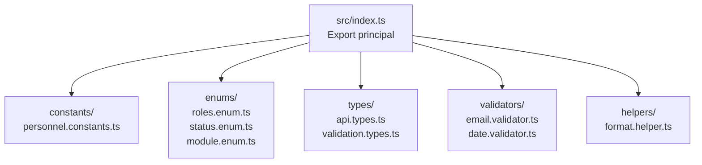
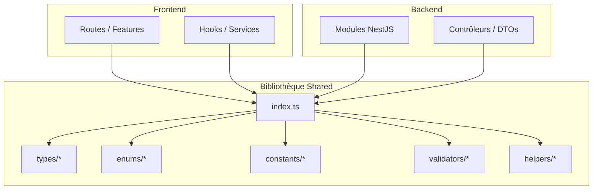
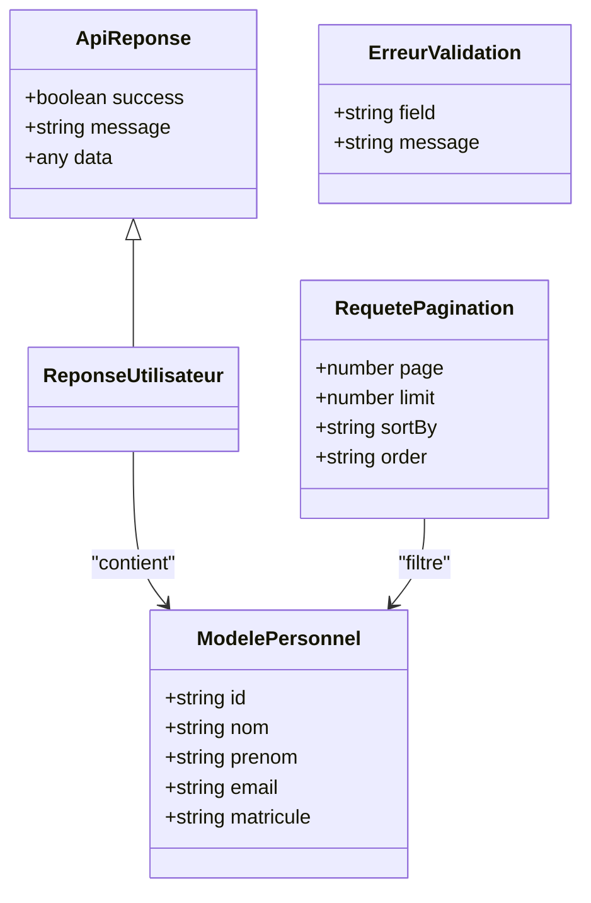
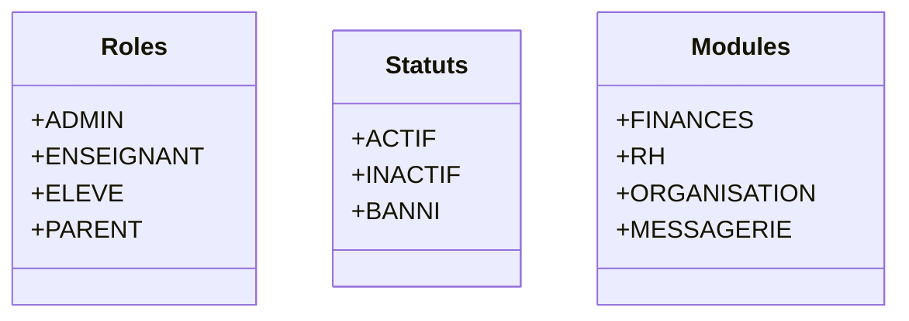
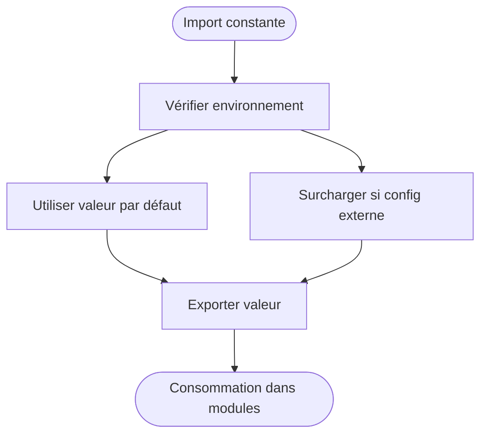
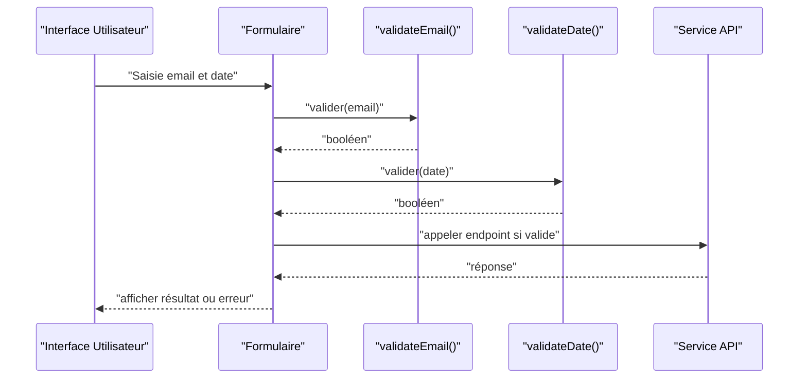
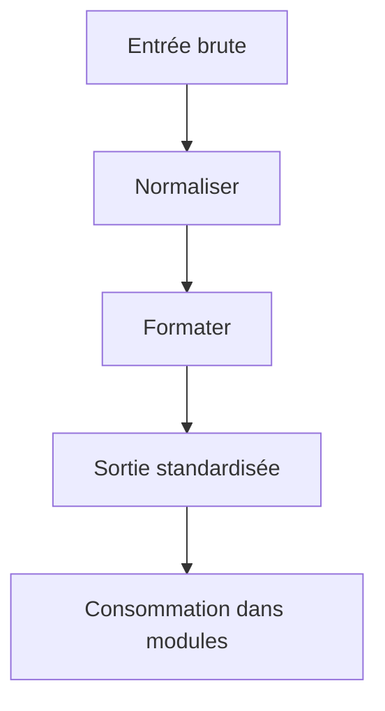
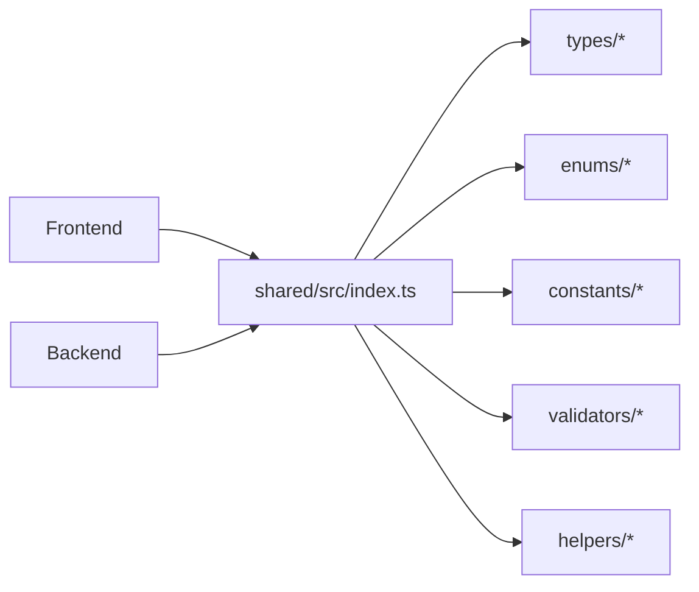

# Bibliothèque Partagée Shared

<cite>
**Fichiers référencés dans ce document**
- [shared/src/index.ts](file://shared/src/index.ts)
- [shared/package.json](file://shared/package.json)
- [shared/tsconfig.json](file://shared/tsconfig.json)
- [shared/src/constants/personnel.constants.ts](file://shared/src/constants/personnel.constants.ts)
- [shared/src/enums/roles.enum.ts](file://shared/src/enums/roles.enum.ts)
- [shared/src/enums/status.enum.ts](file://shared/src/enums/status.enum.ts)
- [shared/src/enums/module.enum.ts](file://shared/src/enums/module.enum.ts)
- [shared/src/types/api.types.ts](file://shared/src/types/api.types.ts)
- [shared/src/types/validation.types.ts](file://shared/src/types/validation.types.ts)
- [shared/src/validators/email.validator.ts](file://shared/src/validators/email.validator.ts)
- [shared/src/validators/date.validator.ts](file://shared/src/validators/date.validator.ts)
- [shared/src/helpers/format.helper.ts](file://shared/src/helpers/format.helper.ts)
</cite>

## Table des matières
1. [Introduction](#introduction)
2. [Structure du projet](#structure-du-projet)
3. [Composants clés](#composants-clés)
4. [Vue d’ensemble de l’architecture](#vue-densemble-de-larchitecture)
5. [Analyse détaillée des composants](#analyse-detaillee-des-composants)
6. [Analyse des dépendances](#analyse-des-dependances)
7. [Considérations de performance](#considerations-de-performance)
8. [Guide de dépannage](#guide-de-depannage)
9. [Conclusion](#conclusion)
10. [Annexes](#annexes)

## Introduction
Ce document présente la bibliothèque partagée shared, utilisée à la fois par le backend et le frontend pour garantir la cohérence des types, des constantes, des énumérations et des utilitaires. Elle centralise les contrats de données (interfaces), les validateurs communs, les helpers formatage et les enums métier, afin d’éviter la duplication et les incohérences entre les deux applications.

Les objectifs principaux sont :
- Unifier les modèles de données et les validations côté client et serveur.
- Fournir des constantes configurables et des enums réutilisables.
- Offrir des utilitaires fonctionnels stables et testés.
- Simplifier l’intégration dans de nouveaux modules avec des conventions claires.

## Structure du projet
La bibliothèque est organisée en dossiers thématiques pour une maintenance claire et une évolution maîtrisée :
- src/constants : constantes globales et configurations partagées.
- src/enums : énumérations métier communes.
- src/types : interfaces et types TypeScript partagés.
- src/validators : fonctions de validation réutilisables.
- src/helpers : utilitaires fonctionnels (formatage, conversion, etc.).
- src/index.ts : point d’export principal pour consommer la bibliothèque.

**Diagramme sources**
- [shared/src/index.ts](file://shared/src/index.ts)
- [shared/src/constants/personnel.constants.ts](file://shared/src/constants/personnel.constants.ts)
- [shared/src/enums/roles.enum.ts](file://shared/src/enums/roles.enum.ts)
- [shared/src/enums/status.enum.ts](file://shared/src/enums/status.enum.ts)
- [shared/src/enums/module.enum.ts](file://shared/src/enums/module.enum.ts)
- [shared/src/types/api.types.ts](file://shared/src/types/api.types.ts)
- [shared/src/types/validation.types.ts](file://shared/src/types/validation.types.ts)
- [shared/src/validators/email.validator.ts](file://shared/src/validators/email.validator.ts)
- [shared/src/validators/date.validator.ts](file://shared/src/validators/date.validator.ts)
- [shared/src/helpers/format.helper.ts](file://shared/src/helpers/format.helper.ts)

**Section sources**
- [shared/src/index.ts](file://shared/src/index.ts)
- [shared/package.json](file://shared/package.json)
- [shared/tsconfig.json](file://shared/tsconfig.json)

## Composants clés
- Types partagés : définitions d’interfaces pour les payloads API, réponses paginées, erreurs et structures de validation.
- Enums communs : rôles, statuts, modules, permettant un vocabulaire unique entre frontend et backend.
- Constantes globales : valeurs configurables (limites, formats, messages) accessibles depuis les deux applications.
- Validateurs partagés : fonctions pures pour valider emails, dates, chaînes, nombres, etc.
- Helpers système : fonctions utilitaires pour formater dates, nombres, monnaies, et normaliser des données.

Ces composants sont exportés via le point d’entrée principal pour une consommation simple et cohérente.

**Section sources**
- [shared/src/types/api.types.ts](file://shared/src/types/api.types.ts)
- [shared/src/types/validation.types.ts](file://shared/src/types/validation.types.ts)
- [shared/src/enums/roles.enum.ts](file://shared/src/enums/roles.enum.ts)
- [shared/src/enums/status.enum.ts](file://shared/src/enums/status.enum.ts)
- [shared/src/enums/module.enum.ts](file://shared/src/enums/module.enum.ts)
- [shared/src/constants/personnel.constants.ts](file://shared/src/constants/personnel.constants.ts)
- [shared/src/validators/email.validator.ts](file://shared/src/validators/email.validator.ts)
- [shared/src/validators/date.validator.ts](file://shared/src/validators/date.validator.ts)
- [shared/src/helpers/format.helper.ts](file://shared/src/helpers/format.helper.ts)

## Vue d’ensemble de l’architecture
La bibliothèque shared agit comme un contrat commun entre frontend et backend. Les modules consomment les types, enums, validateurs et helpers pour assurer la cohérence des données et des comportements.

**Diagramme sources**
- [shared/src/index.ts](file://shared/src/index.ts)
- [shared/src/types/api.types.ts](file://shared/src/types/api.types.ts)
- [shared/src/enums/roles.enum.ts](file://shared/src/enums/roles.enum.ts)
- [shared/src/constants/personnel.constants.ts](file://shared/src/constants/personnel.constants.ts)
- [shared/src/validators/email.validator.ts](file://shared/src/validators/email.validator.ts)
- [shared/src/helpers/format.helper.ts](file://shared/src/helpers/format.helper.ts)

## Analyse détaillée des composants

### Types partagés
- Interfaces API : modèles de requêtes/réponses, pagination, gestion d’erreurs.
- Types de validation : schémas de validation, règles de type pour formulaires et DTOs.
- Bonnes pratiques : préférer des types stricts, utiliser des unions pour les états, éviter any.

**Diagramme sources**
- [shared/src/types/api.types.ts](file://shared/src/types/api.types.ts)
- [shared/src/types/validation.types.ts](file://shared/src/types/validation.types.ts)

**Section sources**
- [shared/src/types/api.types.ts](file://shared/src/types/api.types.ts)
- [shared/src/types/validation.types.ts](file://shared/src/types/validation.types.ts)

### Enums communs
- Rôles : définition centralisée des rôles utilisateurs.
- Statuts : états génériques (actif, inactif, banni, etc.).
- Modules : identification des modules activables/configurables.

**Diagramme sources**
- [shared/src/enums/roles.enum.ts](file://shared/src/enums/roles.enum.ts)
- [shared/src/enums/status.enum.ts](file://shared/src/enums/status.enum.ts)
- [shared/src/enums/module.enum.ts](file://shared/src/enums/module.enum.ts)

**Section sources**
- [shared/src/enums/roles.enum.ts](file://shared/src/enums/roles.enum.ts)
- [shared/src/enums/status.enum.ts](file://shared/src/enums/status.enum.ts)
- [shared/src/enums/module.enum.ts](file://shared/src/enums/module.enum.ts)

### Constantes globales
- Exemple : limites de pagination, formats de date, messages d’erreur standardisés.
- Utilisation : import direct depuis constants pour uniformiser les comportements.

**Diagramme sources**
- [shared/src/constants/personnel.constants.ts](file://shared/src/constants/personnel.constants.ts)

**Section sources**
- [shared/src/constants/personnel.constants.ts](file://shared/src/constants/personnel.constants.ts)

### Validateurs partagés
- Email : validation stricte du format email.
- Date : vérification de format ISO, plage valide, nullabilité.
- Intégration : utilisation dans les formulaires frontend et les DTOs backend.

**Diagramme sources**
- [shared/src/validators/email.validator.ts](file://shared/src/validators/email.validator.ts)
- [shared/src/validators/date.validator.ts](file://shared/src/validators/date.validator.ts)

**Section sources**
- [shared/src/validators/email.validator.ts](file://shared/src/validators/email.validator.ts)
- [shared/src/validators/date.validator.ts](file://shared/src/validators/date.validator.ts)

### Helpers système
- Formatage : dates, nombres, devises, unités.
- Normalisation : nettoyage de chaînes, conversion de types.
- Réutilisabilité : fonctions pures, sans effets de bord.

**Diagramme sources**
- [shared/src/helpers/format.helper.ts](file://shared/src/helpers/format.helper.ts)

**Section sources**
- [shared/src/helpers/format.helper.ts](file://shared/src/helpers/format.helper.ts)

## Analyse des dépendances
La bibliothèque shared expose un point d’entrée unique qui regroupe les exports. Les modules frontend et backend dépendent uniquement de cet index, réduisant le couplage et facilitant les mises à jour.

**Diagramme sources**
- [shared/src/index.ts](file://shared/src/index.ts)
- [shared/package.json](file://shared/package.json)

**Section sources**
- [shared/src/index.ts](file://shared/src/index.ts)
- [shared/package.json](file://shared/package.json)

## Considérations de performance
- Import sélectif : importer uniquement les symboles nécessaires pour réduire la taille du bundle.
- Fonctions pures : privilégier des utilitaires sans état global ni effets de bord.
- Validation locale : effectuer les validations au plus près de la saisie pour limiter les allers-retours API.
- Cache de configuration : mémoriser les constantes chargées dynamiquement si nécessaire.

[Pas de sources nécessaires car cette section fournit des conseils généraux]

## Guide de dépannage
- Erreurs de typage : vérifier que les imports correspondent aux exports de shared/src/index.ts.
- Échec de validation : s’assurer que les données respectent les formats attendus par les validateurs.
- Incohérences d’enum : mettre à jour les enums partagés et synchroniser les deux applications.
- Dépendances cassées : vérifier la version de shared package et les compatibilités tsconfig.

**Section sources**
- [shared/src/index.ts](file://shared/src/index.ts)
- [shared/package.json](file://shared/package.json)
- [shared/tsconfig.json](file://shared/tsconfig.json)

## Conclusion
La bibliothèque shared centralise les contrats et utilitaires essentiels pour garantir la cohérence et la maintenabilité entre le frontend et le backend. En suivant les conventions de nommage, en utilisant les types et validateurs partagés, et en adoptant une stratégie de versioning rigoureuse, les équipes peuvent évoluer rapidement tout en minimisant les risques d’incompatibilité.

[Pas de sources nécessaires car cette section résume sans analyser de fichiers spécifiques]

## Annexes

### Intégration dans de nouveaux modules
- Ajouter shared comme dépendance dans le module concerné.
- Importer les types, enums, constantes et validateurs depuis l’index principal.
- Appliquer les validators avant d’appeler les services API.
- Utiliser les helpers pour formater les données affichées.

**Section sources**
- [shared/src/index.ts](file://shared/src/index.ts)
- [shared/package.json](file://shared/package.json)

### Conventions de nommage
- Types : PascalCase, suffixe explicite (ex. ReponseXxx, RequeteXxx).
- Enums : PascalCase, membres MAJUSCULES.
- Constantes : UPPER_SNAKE_CASE.
- Validators/helpers : camelCase, noms verbaux clairs.

[Pas de sources nécessaires car cette section décrit des conventions générales]

### Stratégie de versioning et mise à jour
- Versionner la bibliothèque selon Semantic Versioning (MAJEUR.MINEUR.PATCH).
- Publier des notes de version détaillant les changements breaking et non-breaking.
- Mettre à jour les versions dans les packages frontend/backend après tests.
- Maintenir une compatibilité ascendante autant que possible.

**Section sources**
- [shared/package.json](file://shared/package.json)

### Exemples d’utilisation
- Types partagés : définir des modèles de réponse et de requête pour les endpoints.
- Constantes configurables : limiter la pagination, fixer des formats de date.
- Utilitaires fonctionnels : formater les montants en devise, normaliser les chaînes.

**Section sources**
- [shared/src/types/api.types.ts](file://shared/src/types/api.types.ts)
- [shared/src/constants/personnel.constants.ts](file://shared/src/constants/personnel.constants.ts)
- [shared/src/helpers/format.helper.ts](file://shared/src/helpers/format.helper.ts)