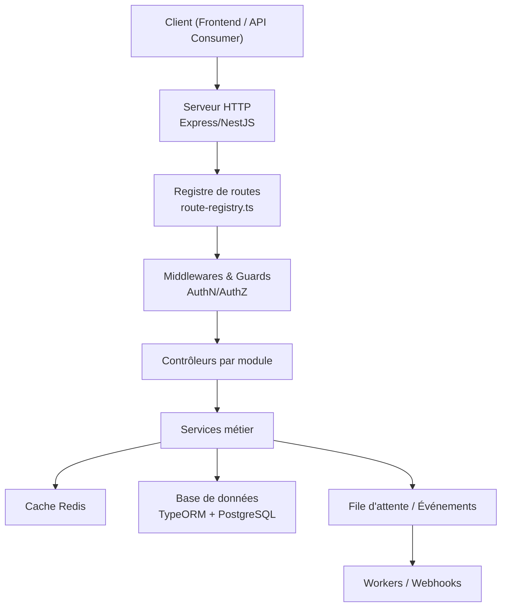
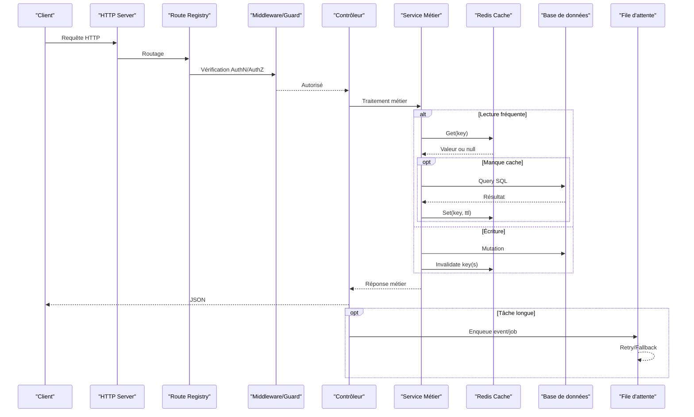
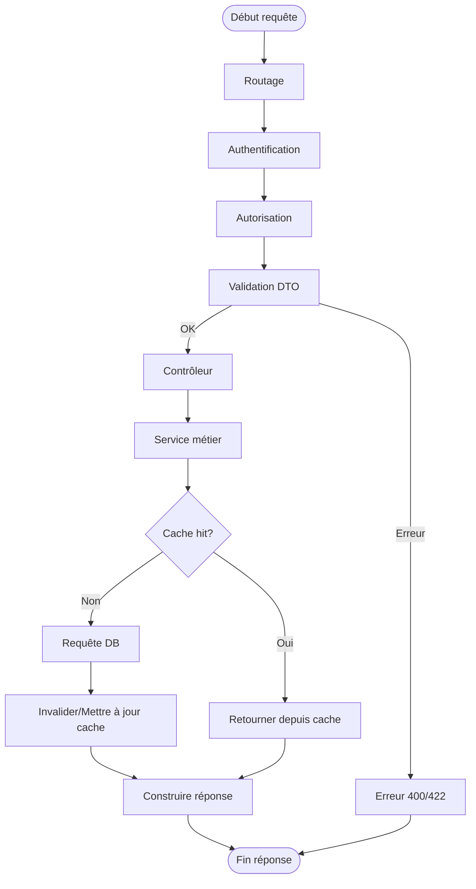
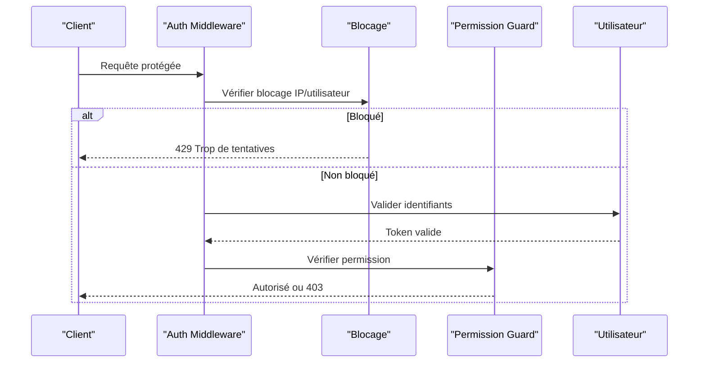
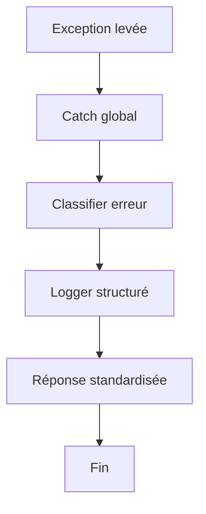
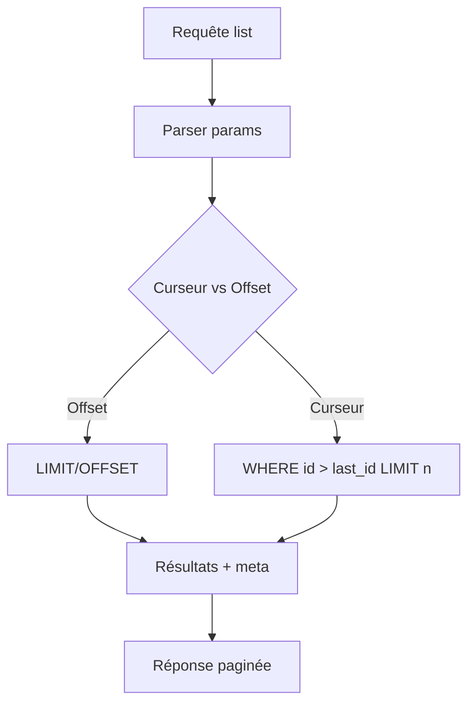
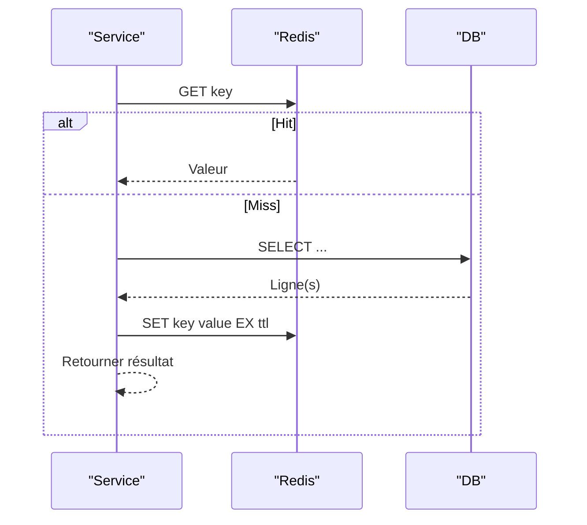
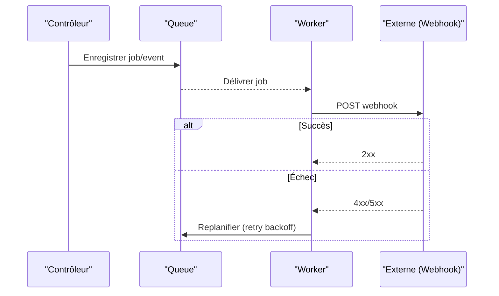
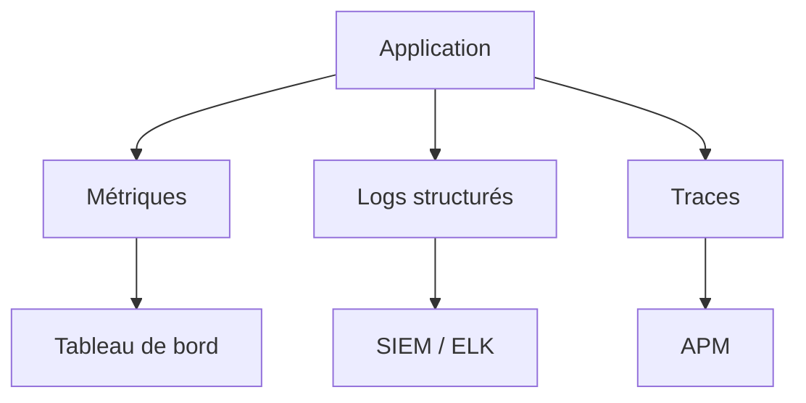
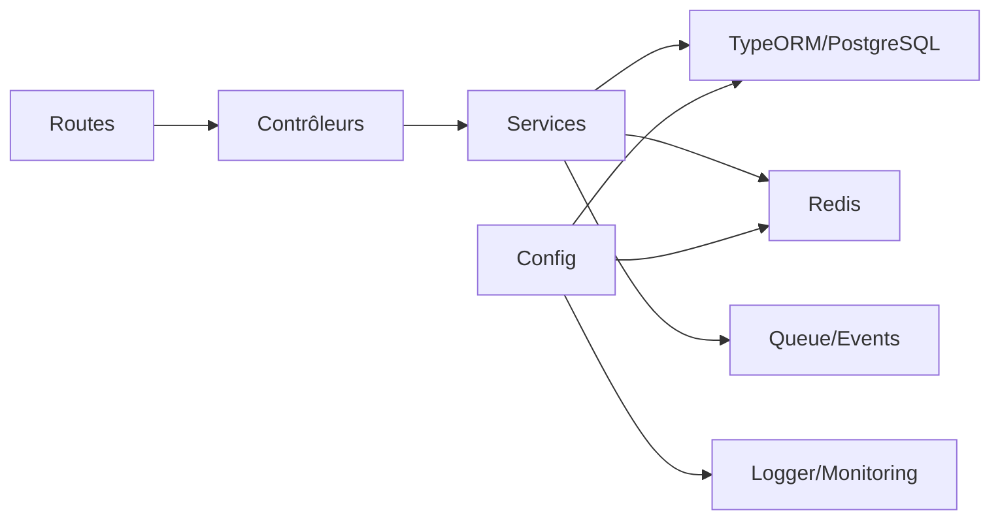

# Flux de Données et Patterns

<cite>
**Fichiers référencés dans ce document**
- [app.ts](file://backend/src/app.ts)
- [index.ts](file://backend/src/index.ts)
- [route-registry.ts](file://backend/src/routes/route-registry.ts)
- [database.config.ts](file://backend/src/config/database.config.ts)
- [env.config.ts](file://backend/src/config/env.config.ts)
- [swagger.config.ts](file://backend/src/config/swagger.config.ts)
- [data-source.ts](file://backend/src/database/data-source.ts)
- [pagination-guide.md](file://backend/docs/pagination-guide.md)
- [REDIS-CONFIGURATION.md](file://docs/autres/REDIS-CONFIGURATION.md)
- [GUIDE-MONITORING-PERFORMANCE-RBAC.md](file://docs/guides/GUIDE-MONITORING-PERFORMANCE-RBAC.md)
- [AUDIT-INSTRUMENTATION-GUIDE.md](file://docs/audits/AUDIT-INSTRUMENTATION-GUIDE.md)
- [systeme-blocage-auth-deux-niveaux.md](file://docs/SYSTEME-BLOCAGE-AUTH-DEUX-NIVEAUX.md)
- [NOTIFICATION-SYSTEM-GUIDE.md](file://docs/guides/NOTIFICATION-SYSTEM-GUIDE.md)
- [RAPPORT-FINAL-PAGINATION.md](file://docs/rapports/RAPPORT-FINAL-PAGINATION.md)
- [OPTIMISATIONS-PERFORMANCE-V3.1.md](file://docs/OPTIMISATIONS-PERFORMANCE-V3.1.md)
- [IMPLEMENTATION-COMPLETE-FINANCES.md](file://docs/implementations/IMPLEMENTATION-COMPLETE-FINANCES.md)
- [GUIDE-API-UTILISATEURS-ETABLISSEMENTS.md](file://docs/GUIDE-API-UTILISATEURS-ETABLISSEMENTS.md)
</cite>

## Table des matières
1. [Introduction](#introduction)
2. [Structure du projet](#structure-du-projet)
3. [Composants clés](#composants-clés)
4. [Vue d'ensemble architecturale](#vue-densemble-architecturale)
5. [Analyse détaillée des composants](#analyse-detailee-des-composants)
6. [Analyse des dépendances](#analyse-des-dependances)
7. [Considérations de performance](#considerations-de-performance)
8. [Guide de dépannage](#guide-de-depannage)
9. [Conclusion](#conclusion)
10. [Annexes](#annexes)

## Introduction
Ce document décrit les flux de données et les patterns architecturaux d'eLISAschool, en se concentrant sur le parcours complet d’une requête HTTP jusqu’à la réponse : authentification, autorisation, validation des données, traitement métier, pagination, mise en cache Redis, gestion des erreurs, logging structuré, communication asynchrone, webhooks et événements internes. Il inclut également des considérations de performance, de scalabilité horizontale et de monitoring des flux.

## Structure du projet
Le backend est organisé en modules par domaine (utilisateurs, finances, personnel, etc.) avec une séparation claire entre contrôleurs, services, DTOs, middlewares et intercepteurs. La configuration centralisée gère la base de données, l’environnement et Swagger. Les routes sont enregistrées via un registre pour une composition modulaire.

**Sources de diagramme**
- [index.ts](file://backend/src/index.ts)
- [route-registry.ts](file://backend/src/routes/route-registry.ts)
- [database.config.ts](file://backend/src/config/database.config.ts)
- [data-source.ts](file://backend/src/database/data-source.ts)

**Sources de section**
- [index.ts](file://backend/src/index.ts)
- [route-registry.ts](file://backend/src/routes/route-registry.ts)
- [database.config.ts](file://backend/src/config/database.config.ts)
- [env.config.ts](file://backend/src/config/env.config.ts)
- [swagger.config.ts](file://backend/src/config/swagger.config.ts)
- [data-source.ts](file://backend/src/database/data-source.ts)

## Composants clés
- Serveur et point d’entrée : initialisation du serveur HTTP et chargement des modules.
- Registre de routes : composition des routes par module.
- Configuration : paramètres d’environnement, connexion à la base de données, documentation API.
- Accès aux données : TypeORM DataSource et migrations.
- Sécurité : middlewares/guards d’authentification et d’autorisation.
- Validation : DTOs et schémas de validation.
- Mise en cache : client Redis pour lecture rapide et cohérence.
- Logging et monitoring : logs structurés, métriques et audit.
- Asynchronisme : files d’attente, événements et webhooks.

**Sources de section**
- [app.ts](file://backend/src/app.ts)
- [index.ts](file://backend/src/index.ts)
- [route-registry.ts](file://backend/src/routes/route-registry.ts)
- [database.config.ts](file://backend/src/config/database.config.ts)
- [env.config.ts](file://backend/src/config/env.config.ts)
- [swagger.config.ts](file://backend/src/config/swagger.config.ts)
- [data-source.ts](file://backend/src/database/data-source.ts)

## Vue d'ensemble architecturale
Le système suit une architecture modulaire avec une couche API exposée via des routes, protégée par des middlewares/guards, et orchestrée par des contrôleurs qui délèguent au service métier. Les données sont persistées via TypeORM/PostgreSQL, avec un cache Redis optionnel pour les lectures fréquentes. Le logging structuré et le monitoring permettent l’observabilité. Les tâches longues et les notifications passent par des files d’attente ou des événements internes.

**Sources de diagramme**
- [index.ts](file://backend/src/index.ts)
- [route-registry.ts](file://backend/src/routes/route-registry.ts)
- [database.config.ts](file://backend/src/config/database.config.ts)
- [data-source.ts](file://backend/src/database/data-source.ts)

## Analyse détaillée des composants

### Flux HTTP complet : de la requête à la réponse
- Entrée : le serveur écoute les requêtes et les achemine vers le registre de routes.
- Authentification et autorisation : les middlewares/guards vérifient les identifiants et permissions avant d’atteindre le contrôleur.
- Validation : les DTOs/schémas valident les payloads entrants.
- Service métier : orchestre les règles, appels cache/DB et transformations.
- Réponse : le contrôleur formate la réponse HTTP.

**Sources de section**
- [index.ts](file://backend/src/index.ts)
- [route-registry.ts](file://backend/src/routes/route-registry.ts)
- [database.config.ts](file://backend/src/config/database.config.ts)
- [data-source.ts](file://backend/src/database/data-source.ts)

### Authentification et autorisation
- Authentification multi-mode : support de plusieurs mécanismes (JWT, session, etc.).
- Blocage sécurisé : protection contre les tentatives répétées avec persistance et seuils configurables.
- Autorisation RBAC : vérification des rôles/permissions au niveau des routes ou méthodes.

**Sources de section**
- [systeme-blocage-auth-deux-niveaux.md](file://docs/SYSTEME-BLOCAGE-AUTH-DEUX-NIVEAUX.md)
- [GUIDE-API-UTILISATEURS-ETABLISSEMENTS.md](file://docs/GUIDE-API-UTILISATEURS-ETABLISSEMENTS.md)

### Validation des données
- DTOs et schémas définissent les contraintes de type et de format.
- Erreurs de validation retournées de manière structurée pour le frontend.
- Exemples de validation courante : emails, IDs, enums, plages de valeurs.

**Sources de section**
- [route-registry.ts](file://backend/src/routes/route-registry.ts)
- [swagger.config.ts](file://backend/src/config/swagger.config.ts)

### Gestion des erreurs et logging structuré
- Filtres d’exceptions globales pour normaliser les réponses d’erreur.
- Logs structurés avec contexte (utilisateur, établissement, trace ID).
- Audit trail pour actions sensibles.

**Sources de section**
- [AUDIT-INSTRUMENTATION-GUIDE.md](file://docs/audits/AUDIT-INSTRUMENTATION-GUIDE.md)

### Pagination
- Stratégie basée sur curseur ou offset selon le cas d’usage.
- Paramètres communs : page, limit, order, filter.
- Optimisations : index composites, vues matérialisées, requêtes paginées côté DB.

**Sources de section**
- [pagination-guide.md](file://backend/docs/pagination-guide.md)
- [RAPPORT-FINAL-PAGINATION.md](file://docs/rapports/RAPPORT-FINAL-PAGINATION.md)

### Mise en cache avec Redis
- Clés hiérarchiques par module/entité/ID.
- TTL configurables selon la fraîcheur des données.
- Invalidation ciblée après écritures.
- Fallback si Redis indisponible.

**Sources de section**
- [REDIS-CONFIGURATION.md](file://docs/autres/REDIS-CONFIGURATION.md)

### Communication asynchrone, webhooks et événements internes
- Files d’attente pour tâches longues (notifications, rapports).
- Événements internes pour découpler les modules.
- Webhooks sortants avec retry exponentiel et fallback.

**Sources de section**
- [NOTIFICATION-SYSTEM-GUIDE.md](file://docs/guides/NOTIFICATION-SYSTEM-GUIDE.md)

### Monitoring et observabilité
- Métriques de latence, taux d’erreur, utilisation cache et DB.
- Traces distribuées pour suivre les requêtes.
- Alerting sur anomalies (erreurs 5xx, timeouts, saturation cache).

**Sources de section**
- [GUIDE-MONITORING-PERFORMANCE-RBAC.md](file://docs/guides/GUIDE-MONITORING-PERFORMANCE-RBAC.md)

## Analyse des dépendances
Les modules dépendent faiblement grâce à des interfaces claires et des registres de routes. La configuration centralisée permet de changer les implémentations (DB, cache, logger) sans impacter les contrôleurs.

**Sources de diagramme**
- [route-registry.ts](file://backend/src/routes/route-registry.ts)
- [database.config.ts](file://backend/src/config/database.config.ts)
- [env.config.ts](file://backend/src/config/env.config.ts)
- [data-source.ts](file://backend/src/database/data-source.ts)

**Sources de section**
- [route-registry.ts](file://backend/src/routes/route-registry.ts)
- [database.config.ts](file://backend/src/config/database.config.ts)
- [env.config.ts](file://backend/src/config/env.config.ts)
- [data-source.ts](file://backend/src/database/data-source.ts)

## Considérations de performance
- Indexation DB : index composites pour filtres fréquents, jointures optimisées.
- Cache Redis : lecture rapide, invalidation ciblée, TTL adaptés.
- Pagination : curseur pour grands jeux de données, éviter OFFSET profond.
- Scalabilité horizontale : stateless, partage de cache Redis, partitionnement DB.
- Monitoring : alertes sur latence, erreurs, saturation cache/DB.

**Sources de section**
- [OPTIMISATIONS-PERFORMANCE-V3.1.md](file://docs/OPTIMISATIONS-PERFORMANCE-V3.1.md)
- [RAPPORT-FINAL-PAGINATION.md](file://docs/rapports/RAPPORT-FINAL-PAGINATION.md)
- [REDIS-CONFIGURATION.md](file://docs/autres/REDIS-CONFIGURATION.md)

## Guide de dépannage
- Problèmes d’authentification : vérifier secrets JWT, configuration de blocage, logs d’échecs.
- Erreurs 403 : permissions manquantes, scope établissement non aligné.
- Latence élevée : vérifier cache miss rate, requêtes DB lentes, index manquants.
- Redis down : s’assurer du fallback direct vers DB, alertes de disponibilité.
- Webhooks échoués : inspecter retries, payload, statut externe, logs worker.

**Sources de section**
- [systeme-blocage-auth-deux-niveaux.md](file://docs/SYSTEME-BLOCAGE-AUTH-DEUX-NIVEAUX.md)
- [AUDIT-INSTRUMENTATION-GUIDE.md](file://docs/audits/AUDIT-INSTRUMENTATION-GUIDE.md)
- [NOTIFICATION-SYSTEM-GUIDE.md](file://docs/guides/NOTIFICATION-SYSTEM-GUIDE.md)

## Conclusion
eLISAschool adopte une architecture modulaire et observable, avec un flux HTTP clair, une sécurité robuste, une validation stricte, un cache Redis efficace et une communication asynchrone fiable. Les bonnes pratiques de pagination, monitoring et scalabilité assurent performance et résilience.

## Annexes
- Exemple de flux financier : intégration complète et points de contrôle.
- Guides API utilisateurs/établissements : scopes et permissions.

**Sources de section**
- [IMPLEMENTATION-COMPLETE-FINANCES.md](file://docs/implementations/IMPLEMENTATION-COMPLETE-FINANCES.md)
- [GUIDE-API-UTILISATEURS-ETABLISSEMENTS.md](file://docs/GUIDE-API-UTILISATEURS-ETABLISSEMENTS.md)