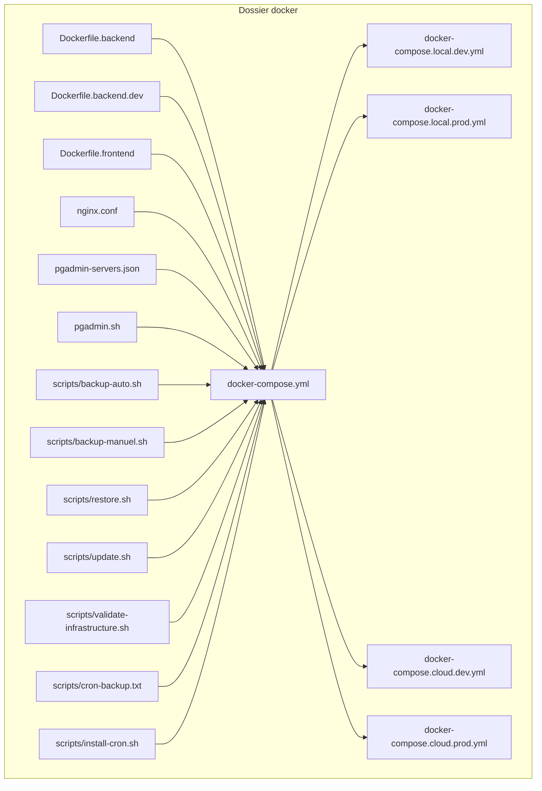
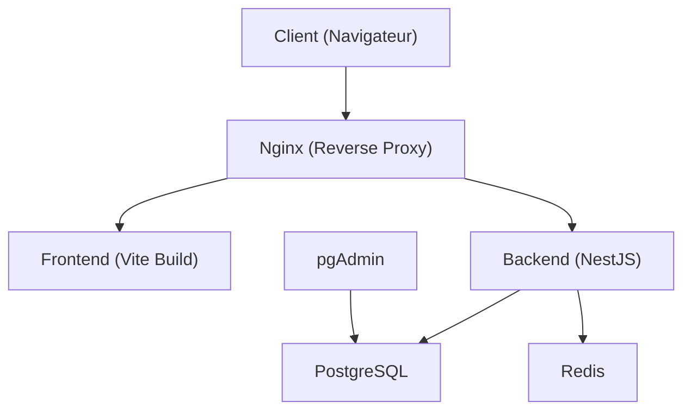
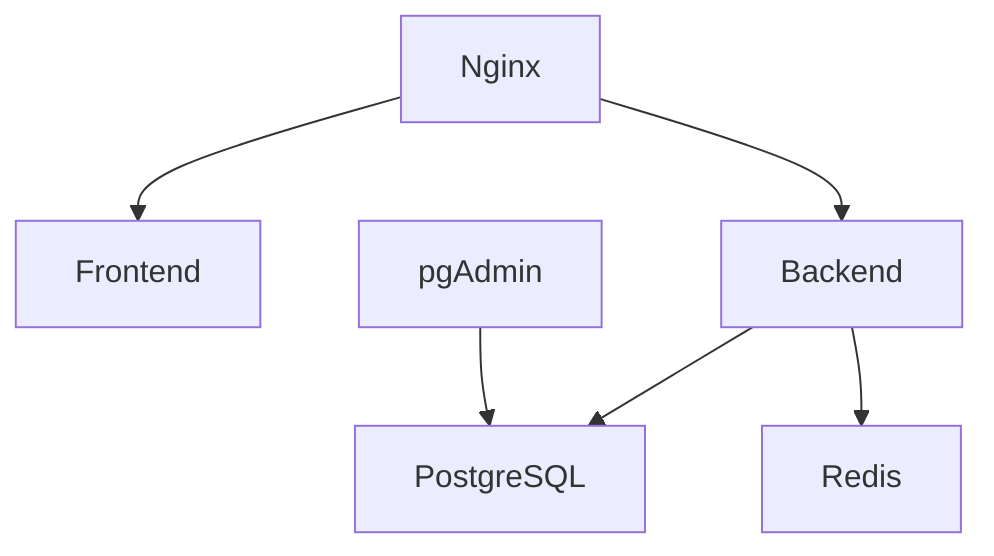

# Infrastructure Docker et Déploiement

<cite>
**Fichiers référencés dans ce document**
- [docker-compose.yml](file://docker/docker-compose.yml)
- [docker-compose.local.dev.yml](file://docker/docker-compose.local.dev.yml)
- [docker-compose.local.prod.yml](file://docker/docker-compose.local.prod.yml)
- [docker-compose.cloud.dev.yml](file://docker/docker-compose.cloud.dev.yml)
- [docker-compose.cloud.prod.yml](file://docker/docker-compose.cloud.prod.yml)
- [Dockerfile.backend](file://docker/Dockerfile.backend)
- [Dockerfile.backend.dev](file://docker/Dockerfile.backend.dev)
- [Dockerfile.frontend](file://docker/Dockerfile.frontend)
- [nginx.conf](file://docker/nginx.conf)
- [deploy.sh](file://docker/deploy.sh)
- [scripts/backup-auto.sh](file://docker/scripts/backup-auto.sh)
- [scripts/backup-manuel.sh](file://docker/scripts/backup-manuel.sh)
- [scripts/restore.sh](file://docker/scripts/restore.sh)
- [scripts/update.sh](file://docker/scripts/update.sh)
- [scripts/validate-infrastructure.sh](file://docker/scripts/validate-infrastructure.sh)
- [scripts/cron-backup.txt](file://docker/scripts/cron-backup.txt)
- [scripts/install-cron.sh](file://docker/scripts/install-cron.sh)
- [pgadmin-servers.json](file://docker/pgadmin-servers.json)
- [pgadmin.sh](file://docker/pgadmin.sh)
- [README.md](file://docker/README.md)
- [QUICK-START.md](file://docker/QUICK-START.md)
- [PGADMIN-GUIDE.md](file://docker/PGADMIN-GUIDE.md)
</cite>

## Table des matières
1. [Introduction](#introduction)
2. [Structure du projet](#structure-du-projet)
3. [Composants clés](#composants-clés)
4. [Vue d’ensemble de l’architecture](#vue-densemble-de-larchitecture)
5. [Analyse détaillée des composants](#analyse-detaillee-des-composants)
6. [Analyse des dépendances](#analyse-des-dependances)
7. [Considérations de performance](#considerations-de-performance)
8. [Guide de dépannage](#guide-de-pannage)
9. [Conclusion](#conclusion)
10. [Annexes](#annexes)

## Introduction
Ce document présente l’infrastructure Docker d’eLISAschool, centrée sur l’orchestration multi-conteneurs via docker-compose, les configurations de build optimisées pour le développement et la production, ainsi que le reverse proxy Nginx. Il couvre la configuration des services (PostgreSQL, Redis, Backend, Frontend), les volumes persistants, les réseaux Docker, les variables d’environnement, les scripts de déploiement automatisé, les stratégies de sauvegarde, les procédures de maintenance, les exemples de personnalisation, le débogage des conteneurs et les bonnes pratiques de sécurité Docker. Il aborde également le scaling horizontal, le monitoring des conteneurs et les stratégies de rollback.

## Structure du projet
Le répertoire docker contient les définitions d’images, les fichiers de composition, le reverse proxy Nginx, les outils pgAdmin et les scripts de maintenance. Les environnements sont séparés en local et cloud, avec des variantes dev/prod.

**Diagramme sources**
- [docker-compose.yml](file://docker/docker-compose.yml)
- [docker-compose.local.dev.yml](file://docker/docker-compose.local.dev.yml)
- [docker-compose.local.prod.yml](file://docker/docker-compose.local.prod.yml)
- [docker-compose.cloud.dev.yml](file://docker/docker-compose.cloud.dev.yml)
- [docker-compose.cloud.prod.yml](file://docker/docker-compose.cloud.prod.yml)
- [Dockerfile.backend](file://docker/Dockerfile.backend)
- [Dockerfile.backend.dev](file://docker/Dockerfile.backend.dev)
- [Dockerfile.frontend](file://docker/Dockerfile.frontend)
- [nginx.conf](file://docker/nginx.conf)
- [pgadmin-servers.json](file://docker/pgadmin-servers.json)
- [pgadmin.sh](file://docker/pgadmin.sh)
- [scripts/backup-auto.sh](file://docker/scripts/backup-auto.sh)
- [scripts/backup-manuel.sh](file://docker/scripts/backup-manuel.sh)
- [scripts/restore.sh](file://docker/scripts/restore.sh)
- [scripts/update.sh](file://docker/scripts/update.sh)
- [scripts/validate-infrastructure.sh](file://docker/scripts/validate-infrastructure.sh)
- [scripts/cron-backup.txt](file://docker/scripts/cron-backup.txt)
- [scripts/install-cron.sh](file://docker/scripts/install-cron.sh)

**Sources de section**
- [README.md](file://docker/README.md)
- [QUICK-START.md](file://docker/QUICK-START.md)

## Composants clés
- Orchestrateur: docker-compose avec fichiers spécifiques par environnement (local/cloud, dev/prod).
- Reverse proxy: Nginx configuré pour acheminer les requêtes vers le frontend et le backend, gestion TLS, compression et cache.
- Base de données: PostgreSQL avec volumes persistants et scripts init si nécessaire.
- Cache: Redis pour sessions, caches et files d’attente.
- Backend: Image Node/NestJS avec deux modes de build (dev/prod).
- Frontend: Image statique construite avec Vite, servie via Nginx.
- Administration: pgAdmin pour l’administration visuelle de PostgreSQL.
- Scripts: Sauvegarde automatique/manuelle, restauration, mise à jour, validation infrastructure.

**Sources de section**
- [docker-compose.yml](file://docker/docker-compose.yml)
- [nginx.conf](file://docker/nginx.conf)
- [Dockerfile.backend](file://docker/Dockerfile.backend)
- [Dockerfile.backend.dev](file://docker/Dockerfile.backend.dev)
- [Dockerfile.frontend](file://docker/Dockerfile.frontend)
- [pgadmin-servers.json](file://docker/pgadmin-servers.json)
- [pgadmin.sh](file://docker/pgadmin.sh)

## Vue d’ensemble de l’architecture
Le flux de trafic passe par Nginx qui redirige les requêtes API vers le backend et les ressources statiques vers le frontend. Le backend communique avec PostgreSQL et Redis. Les données persistent via des volumes Docker. pgAdmin est accessible pour l’administration.

**Diagramme sources**
- [nginx.conf](file://docker/nginx.conf)
- [docker-compose.yml](file://docker/docker-compose.yml)

## Analyse détaillée des composants

### Orchestration avec docker-compose
- docker-compose.yml définit les services principaux et leurs dépendances.
- Fichiers d’environnement:
  - local.dev.yml: activation du hot reload, volumes de code source, ports locaux.
  - local.prod.yml: images optimisées, pas de volumes de code, ports exposés.
  - cloud.dev.yml/cloud.prod.yml: adaptation pour déploiement cloud (réseau, secrets, limites).
- Variables d’environnement:
  - POSTGRES_* pour la base de données.
  - REDIS_* pour le cache.
  - BACKEND_* pour le serveur API (JWT secret, CORS, URLs).
  - FRONTEND_* pour les URL de l’API et les paramètres de build.
- Réseaux: un réseau interne pour la communication entre services, exposition sélective des ports.
- Volumes:
  - postgres_data: persistance de la base.
  - redis_data: persistance du cache.
  - shared_node_modules: partage des modules node pour accélérer les builds.
  - logs_backend: centralisation des logs.

**Sources de section**
- [docker-compose.yml](file://docker/docker-compose.yml)
- [docker-compose.local.dev.yml](file://docker/docker-compose.local.dev.yml)
- [docker-compose.local.prod.yml](file://docker/docker-compose.local.prod.yml)
- [docker-compose.cloud.dev.yml](file://docker/docker-compose.cloud.dev.yml)
- [docker-compose.cloud.prod.yml](file://docker/docker-compose.cloud.prod.yml)

### Images et builds optimisés
- Dockerfile.backend:
  - Multi-stage pour réduire la taille finale.
  - Installation des dépendances, compilation TypeScript, copie des artefacts.
  - Exécution avec node en mode non-root pour la sécurité.
- Dockerfile.backend.dev:
  - Activation du watch/hot reload.
  - Exposition de ports de debug.
  - Montage des volumes de code source.
- Dockerfile.frontend:
  - Build Vite en stage intermédiaire.
  - Servir les fichiers statiques via Nginx ou serveur léger.
  - Optimisations de cache et compression.

**Sources de section**
- [Dockerfile.backend](file://docker/Dockerfile.backend)
- [Dockerfile.backend.dev](file://docker/Dockerfile.backend.dev)
- [Dockerfile.frontend](file://docker/Dockerfile.frontend)

### Reverse proxy Nginx
- Configuration nginx.conf:
  - Routes vers /api pour le backend, / pour le frontend.
  - Gestion des headers CORS et de sécurité.
  - Compression gzip/brotli, cache des assets statiques.
  - Support TLS (certificats montés ou générés).
  - Limitation de taux et protection contre les attaques courantes.
- Health checks: endpoints dédiés pour vérifier l’état des services.

**Sources de section**
- [nginx.conf](file://docker/nginx.conf)

### Services de données et cache
- PostgreSQL:
  - Variables POSTGRES_USER, POSTGRES_PASSWORD, POSTGRES_DB.
  - Volume postgres_data pour la persistance.
  - Scripts d’initialisation optionnels.
- Redis:
  - Variables REDIS_HOST, REDIS_PORT, REDIS_PASSWORD.
  - Volume redis_data pour la persistance.
  - Configuration de sécurité (requirepass, bind).

**Sources de section**
- [docker-compose.yml](file://docker/docker-compose.yml)

### Administration pgAdmin
- pgadmin-servers.json: configuration des serveurs PostgreSQL connectables.
- pgadmin.sh: script de lancement et initialisation de pgAdmin.
- Accès via port dédié, authentification admin.

**Sources de section**
- [pgadmin-servers.json](file://docker/pgadmin-servers.json)
- [pgadmin.sh](file://docker/pgadmin.sh)
- [PGADMIN-GUIDE.md](file://docker/PGADMIN-GUIDE.md)

### Scripts de déploiement et maintenance
- deploy.sh: orchestre le build, le déploiement et le démarrage des services selon l’environnement.
- update.sh: met à jour les images, applique les migrations et redémarre les services.
- validate-infrastructure.sh: vérifie la disponibilité des services, la connectivité et les configurations.
- backup-auto.sh: sauvegarde planifiée de PostgreSQL et des fichiers critiques.
- backup-manuel.sh: déclenche une sauvegarde manuelle avec horodatage.
- restore.sh: restaure la base de données depuis un fichier SQL.
- cron-backup.txt: définition des tâches cron pour les sauvegardes automatiques.
- install-cron.sh: installe et active les tâches cron sur le système hôte.

**Sources de section**
- [deploy.sh](file://docker/deploy.sh)
- [scripts/update.sh](file://docker/scripts/update.sh)
- [scripts/validate-infrastructure.sh](file://docker/scripts/validate-infrastructure.sh)
- [scripts/backup-auto.sh](file://docker/scripts/backup-auto.sh)
- [scripts/backup-manuel.sh](file://docker/scripts/backup-manuel.sh)
- [scripts/restore.sh](file://docker/scripts/restore.sh)
- [scripts/cron-backup.txt](file://docker/scripts/cron-backup.txt)
- [scripts/install-cron.sh](file://docker/scripts/install-cron.sh)

## Analyse des dépendances
Les services interagissent comme suit :
- Nginx dépend du Frontend et du Backend.
- Le Backend dépend de PostgreSQL et Redis.
- pgAdmin dépend de PostgreSQL.
- Les scripts de maintenance dépendent des volumes et des accès réseau internes.

**Diagramme sources**
- [docker-compose.yml](file://docker/docker-compose.yml)
- [nginx.conf](file://docker/nginx.conf)

**Sources de section**
- [docker-compose.yml](file://docker/docker-compose.yml)

## Considérations de performance
- Builds multi-étages pour réduire la taille des images.
- Partage de node_modules pour accélérer les builds en développement.
- Cache Nginx pour les assets statiques.
- Connexion poolée au backend pour PostgreSQL et Redis.
- Limitation des ressources (CPU/mémoire) dans les fichiers compose pour éviter la saturation.
- Monitoring des métriques et logs centralisés.

[Pas de sources nécessaires car cette section fournit des conseils généraux]

## Guide de dépannage
- Vérifier les logs des conteneurs :
  - docker logs <nom_du_service>
  - Consulter les volumes de logs partagés.
- Validation de l’infrastructure :
  - Exécuter validate-infrastructure.sh pour tester la connectivité et les dépendances.
- Problèmes de réseau :
  - Vérifier les ports exposés et les règles de pare-feu.
  - Confirmer que les noms de service sont résolus correctement.
- Problèmes de base de données :
  - Tester la connexion avec psql depuis le conteneur backend.
  - Vérifier les permissions et les schémas.
- Restauration :
  - Utiliser restore.sh avec un fichier SQL valide.
- Sauvegardes :
  - Lancer backup-manuel.sh avant toute opération critique.
  - Vérifier les fichiers dans le dossier backups.

**Sources de section**
- [scripts/validate-infrastructure.sh](file://docker/scripts/validate-infrastructure.sh)
- [scripts/restore.sh](file://docker/scripts/restore.sh)
- [scripts/backup-manuel.sh](file://docker/scripts/backup-manuel.sh)

## Conclusion
L’infrastructure Docker d’eLISAschool est conçue pour être modulaire, sécurisée et performante. Elle utilise docker-compose pour orchestrer les services, Nginx comme reverse proxy, et des scripts robustes pour le déploiement et la maintenance. Les bonnes pratiques de sécurité, le monitoring et les stratégies de rollback permettent une exploitation fiable en développement et en production.

[Pas de sources nécessaires car cette section résume sans analyser de fichiers spécifiques]

## Annexes

### Scaling horizontal
- Duplication du service Backend via docker-compose scale ou replicas dans un orchestrateur (Swarm/Kubernetes).
- Utilisation d’un load balancer externe ou intégré (Nginx upstream).
- Partitionnement de la base de données si nécessaire (sharding).

[Pas de sources nécessaires car cette section fournit des conseils généraux]

### Monitoring des conteneurs
- Centralisation des logs avec des outils externes (ELK, Loki).
- Collecte de métriques avec Prometheus et Grafana.
- Alerting basé sur les seuils de CPU, mémoire et erreurs.

[Pas de sources nécessaires car cette section fournit des conseils généraux]

### Stratégies de rollback
- Maintien des versions précédentes des images et des bases de données.
- Scripts de rollback utilisant les sauvegardes et les images taggées.
- Déploiement progressif (blue/green) pour minimiser les risques.

[Pas de sources nécessaires car cette section fournit des conseils généraux]

### Personnalisation des configurations
- Modification des variables d’environnement dans les fichiers .env ou les overlays compose.
- Ajout de certificats TLS et de routes personnalisées dans nginx.conf.
- Extension des scripts de maintenance pour intégrer des tâches spécifiques.

[Pas de sources nécessaires car cette section fournit des conseils généraux]