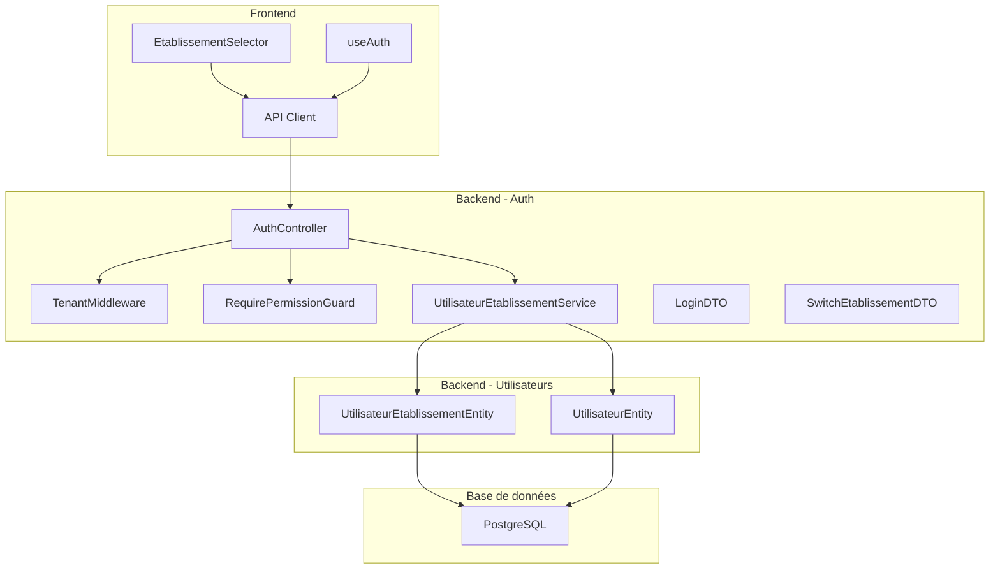
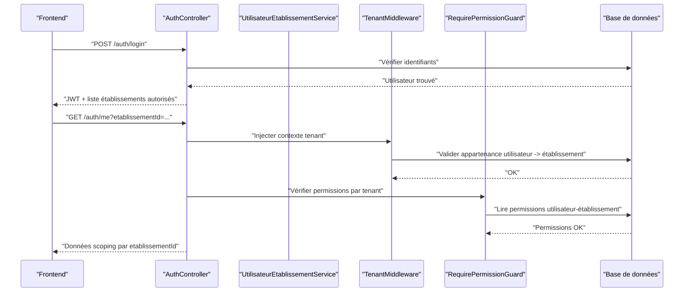
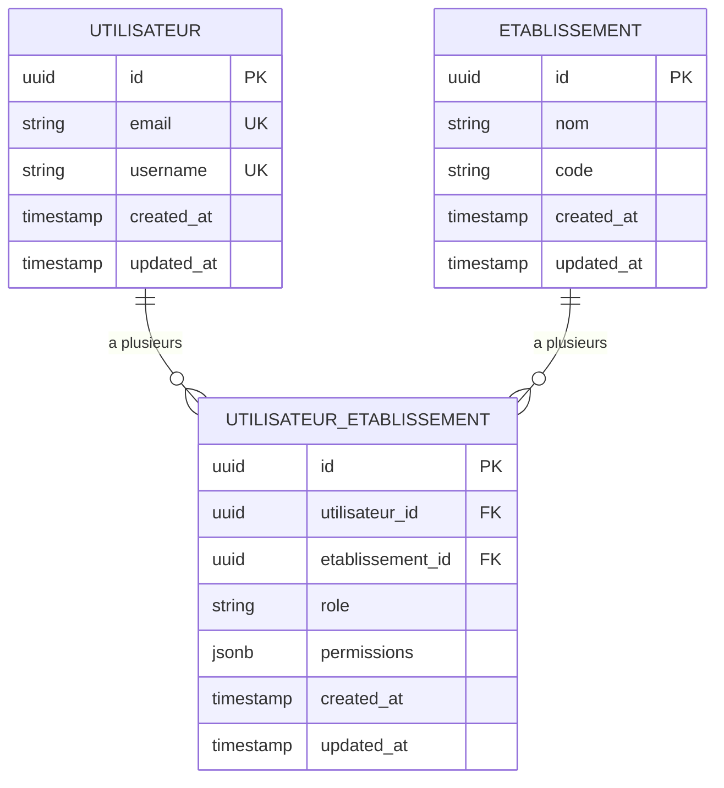
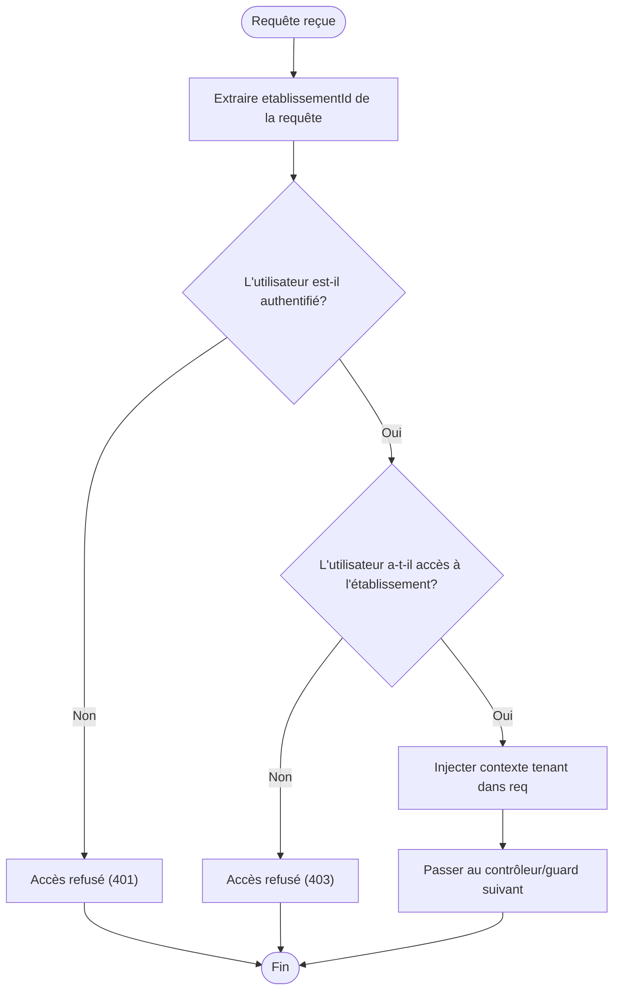
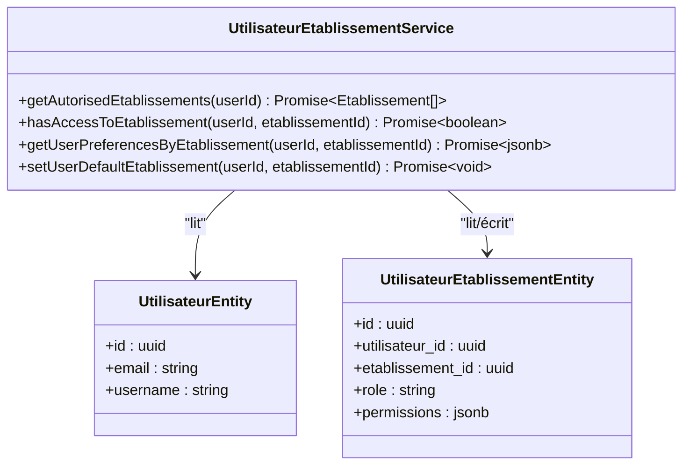
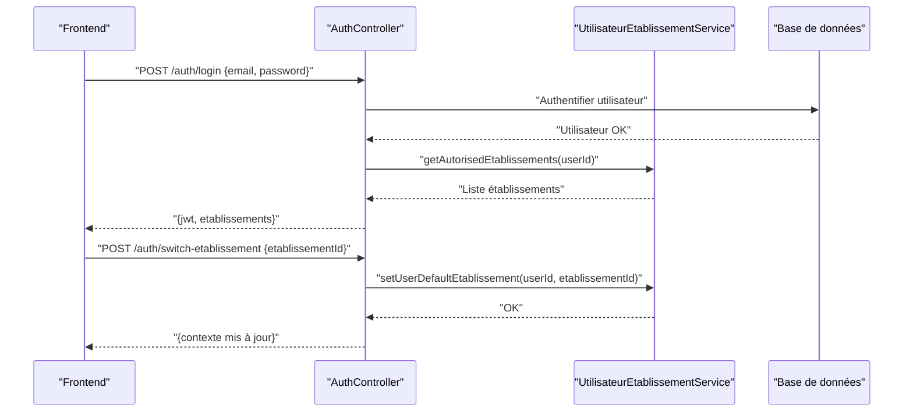
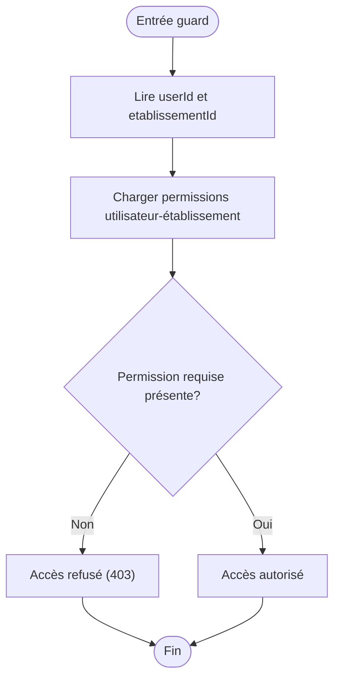
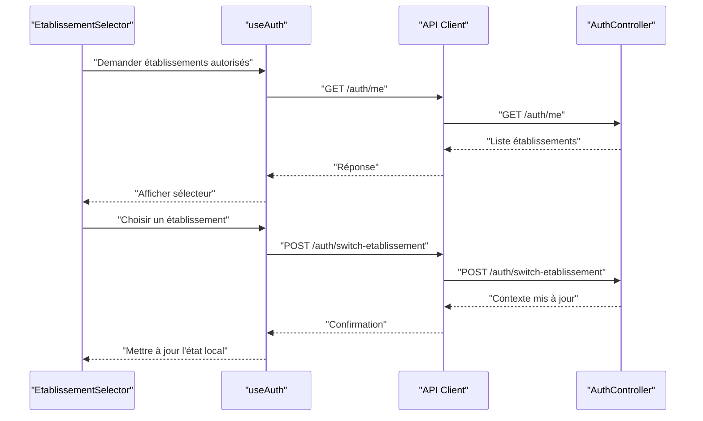
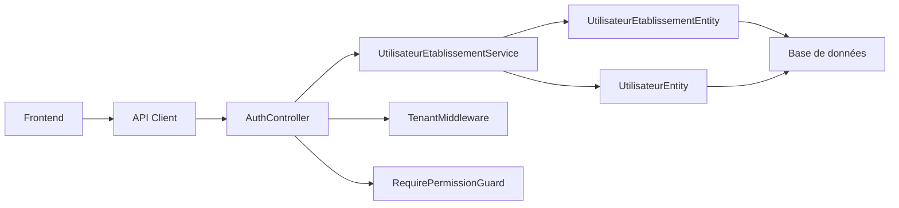

# Authentification Multi-Tenant

<cite>
**Fichiers référencés dans ce document**
- [backend/src/modules/auth/middlewares/tenant.middleware.ts](file://backend/src/modules/auth/middlewares/tenant.middleware.ts)
- [backend/src/modules/auth/services/utilisateur-etablissement.service.ts](file://backend/src/modules/auth/services/utilisateur-etablissement.service.ts)
- [backend/src/modules/auth/controllers/auth.controller.ts](file://backend/src/modules/auth/controllers/auth.controller.ts)
- [backend/src/modules/auth/guards/require-permission.guard.ts](file://backend/src/modules/auth/guards/require-permission.guard.ts)
- [backend/src/modules/auth/dto/login.dto.ts](file://backend/src/modules/auth/dto/login.dto.ts)
- [backend/src/modules/auth/dto/switch-etablissement.dto.ts](file://backend/src/modules/auth/dto/switch-etablissement.dto.ts)
- [backend/src/modules/utilisateurs/entities/utilisateur.entity.ts](file://backend/src/modules/utilisateurs/entities/utilisateur.entity.ts)
- [backend/src/modules/utilisateurs/entities/utilisateur-etablissement.entity.ts](file://backend/src/modules/utilisateurs/entities/utilisateur-etablissement.entity.ts)
- [backend/database/migrations/050-multi-tenant-v3-max-etablissements.sql](file://backend/database/migrations/050-multi-tenant-v3-max-etablissements.sql)
- [backend/database/migrations/080-preferences-utilisateur-multi-tenant.sql](file://backend/database/migrations/080-preferences-utilisateur-multi-tenant.sql)
- [backend/test/integration/auth-multi-etablissement.spec.ts](file://backend/test/integration/auth-multi-etablissement.spec.ts)
- [backend/test/multi-tenant-isolation.test.ts](file://backend/test/multi-tenant-isolation.test.ts)
- [frontend/src/features/auth/components/EtablissementSelector.tsx](file://frontend/src/features/auth/components/EtablissementSelector.tsx)
- [frontend/src/hooks/useAuth.ts](file://frontend/src/hooks/useAuth.ts)
- [frontend/src/lib/api.ts](file://frontend/src/lib/api.ts)
</cite>

## Table des matières
1. [Introduction](#introduction)
2. [Structure du projet](#structure-du-projet)
3. [Composants clés](#composants-clés)
4. [Vue d'ensemble de l'architecture](#vue-densemble-de-larchitecture)
5. [Analyse détaillée des composants](#analyse-detaillee-des-composants)
6. [Analyse des dépendances](#analyse-des-dependances)
7. [Considérations de performance](#considerations-de-performance)
8. [Guide de dépannage](#guide-de-depannage)
9. [Conclusion](#conclusion)
10. [Annexes](#annexes)

## Introduction
Ce document décrit en détail le système d’authentification multi-tenant d’eLISAschool, avec un accent sur :
- L’isolation des données entre établissements (tenants).
- Le mécanisme de sélection d’établissement et de basculement de contexte.
- La gestion des utilisateurs avec accès multi-établissements via la relation UtilisateurEtablissement.
- Les middlewares tenant, les services associés, et les règles d’accès par établissement.
- L’intégration avec le sélecteur d’établissement frontend.
- Les contraintes de sécurité, les bonnes pratiques de performance, et les cas d’usage courants.

## Structure du projet
Le module d’authentification est organisé par fonctionnalités (controllers, services, guards, middlewares, DTOs) et s’appuie sur des entités partagées pour les utilisateurs et leurs relations avec les établissements. Les migrations définissent le schéma multi-tenant et les préférences utilisateur par tenant.

**Sources du diagramme**
- [backend/src/modules/auth/controllers/auth.controller.ts](file://backend/src/modules/auth/controllers/auth.controller.ts)
- [backend/src/modules/auth/middlewares/tenant.middleware.ts](file://backend/src/modules/auth/middlewares/tenant.middleware.ts)
- [backend/src/modules/auth/guards/require-permission.guard.ts](file://backend/src/modules/auth/guards/require-permission.guard.ts)
- [backend/src/modules/auth/services/utilisateur-etablissement.service.ts](file://backend/src/modules/auth/services/utilisateur-etablissement.service.ts)
- [backend/src/modules/utilisateurs/entities/utilisateur.entity.ts](file://backend/src/modules/utilisateurs/entities/utilisateur.entity.ts)
- [backend/src/modules/utilisateurs/entities/utilisateur-etablissement.entity.ts](file://backend/src/modules/utilisateurs/entities/utilisateur-etablissement.entity.ts)
- [frontend/src/features/auth/components/EtablissementSelector.tsx](file://frontend/src/features/auth/components/EtablissementSelector.tsx)
- [frontend/src/hooks/useAuth.ts](file://frontend/src/hooks/useAuth.ts)
- [frontend/src/lib/api.ts](file://frontend/src/lib/api.ts)

**Sources de section**
- [backend/src/modules/auth/controllers/auth.controller.ts](file://backend/src/modules/auth/controllers/auth.controller.ts)
- [backend/src/modules/auth/middlewares/tenant.middleware.ts](file://backend/src/modules/auth/middlewares/tenant.middleware.ts)
- [backend/src/modules/auth/guards/require-permission.guard.ts](file://backend/src/modules/auth/guards/require-permission.guard.ts)
- [backend/src/modules/auth/services/utilisateur-etablissement.service.ts](file://backend/src/modules/auth/services/utilisateur-etablissement.service.ts)
- [backend/src/modules/utilisateurs/entities/utilisateur.entity.ts](file://backend/src/modules/utilisateurs/entities/utilisateur.entity.ts)
- [backend/src/modules/utilisateurs/entities/utilisateur-etablissement.entity.ts](file://backend/src/modules/utilisateurs/entities/utilisateur-etablissement.entity.ts)
- [frontend/src/features/auth/components/EtablissementSelector.tsx](file://frontend/src/features/auth/components/EtablissementSelector.tsx)
- [frontend/src/hooks/useAuth.ts](file://frontend/src/hooks/useAuth.ts)
- [frontend/src/lib/api.ts](file://frontend/src/lib/api.ts)

## Composants clés
- UtilisateurEtablissement : relation many-to-many entre utilisateurs et établissements, permettant l’accès multi-établissement et l’attribution de rôles par établissement.
- TenantMiddleware : injecte et valide le contexte tenant (établissementId) dans la requête, applique les filtres d’isolation.
- UtilisateurEtablissementService : gère les relations utilisateur-établissement, vérifie les permissions par tenant, retourne les établissements autorisés.
- AuthController : endpoints d’authentification, connexion, et basculement d’établissement.
- RequirePermissionGuard : vérifie les permissions au niveau de l’utilisateur pour l’établissement courant.
- DTOs : LoginDTO et SwitchEtablissementDTO pour valider les entrées.
- Entités Utilisateur et UtilisateurEtablissement : modèles de base de données.
- Frontend : EtablissementSelector, useAuth, API client pour sélectionner et persister le contexte tenant.

**Sources de section**
- [backend/src/modules/utilisateurs/entities/utilisateur-etablissement.entity.ts](file://backend/src/modules/utilisateurs/entities/utilisateur-etablissement.entity.ts)
- [backend/src/modules/auth/middlewares/tenant.middleware.ts](file://backend/src/modules/auth/middlewares/tenant.middleware.ts)
- [backend/src/modules/auth/services/utilisateur-etablissement.service.ts](file://backend/src/modules/auth/services/utilisateur-etablissement.service.ts)
- [backend/src/modules/auth/controllers/auth.controller.ts](file://backend/src/modules/auth/controllers/auth.controller.ts)
- [backend/src/modules/auth/guards/require-permission.guard.ts](file://backend/src/modules/auth/guards/require-permission.guard.ts)
- [backend/src/modules/auth/dto/login.dto.ts](file://backend/src/modules/auth/dto/login.dto.ts)
- [backend/src/modules/auth/dto/switch-etablissement.dto.ts](file://backend/src/modules/auth/dto/switch-etablissement.dto.ts)
- [backend/src/modules/utilisateurs/entities/utilisateur.entity.ts](file://backend/src/modules/utilisateurs/entities/utilisateur.entity.ts)
- [frontend/src/features/auth/components/EtablissementSelector.tsx](file://frontend/src/features/auth/components/EtablissementSelector.tsx)
- [frontend/src/hooks/useAuth.ts](file://frontend/src/hooks/useAuth.ts)
- [frontend/src/lib/api.ts](file://frontend/src/lib/api.ts)

## Vue d'ensemble de l'architecture
Le flux d’authentification multi-tenant suit ces étapes :
- Connexion utilisateur via AuthController.
- Validation des identifiants et génération du token JWT incluant l’identité utilisateur.
- Sélection ou définition de l’établissement courant via le middleware tenant.
- Vérification des permissions par établissement via RequirePermissionGuard.
- Filtrage des données par établissement à chaque requête.

**Sources du diagramme**
- [backend/src/modules/auth/controllers/auth.controller.ts](file://backend/src/modules/auth/controllers/auth.controller.ts)
- [backend/src/modules/auth/middlewares/tenant.middleware.ts](file://backend/src/modules/auth/middlewares/tenant.middleware.ts)
- [backend/src/modules/auth/guards/require-permission.guard.ts](file://backend/src/modules/auth/guards/require-permission.guard.ts)
- [backend/src/modules/auth/services/utilisateur-etablissement.service.ts](file://backend/src/modules/auth/services/utilisateur-etablissement.service.ts)

## Analyse détaillée des composants

### Entités et schéma multi-tenant
- Utilisateur : identité globale de l’utilisateur.
- UtilisateurEtablissement : relation liant un utilisateur à un établissement, avec rôle et permissions spécifiques au tenant.
- Migrations : ajout de champs et index pour supporter le multi-tenant, préférences utilisateur par établissement, et limites maximales d’établissements.

**Sources du diagramme**
- [backend/src/modules/utilisateurs/entities/utilisateur.entity.ts](file://backend/src/modules/utilisateurs/entities/utilisateur.entity.ts)
- [backend/src/modules/utilisateurs/entities/utilisateur-etablissement.entity.ts](file://backend/src/modules/utilisateurs/entities/utilisateur-etablissement.entity.ts)
- [backend/database/migrations/050-multi-tenant-v3-max-etablissements.sql](file://backend/database/migrations/050-multi-tenant-v3-max-etablissements.sql)
- [backend/database/migrations/080-preferences-utilisateur-multi-tenant.sql](file://backend/database/migrations/080-preferences-utilisateur-multi-tenant.sql)

**Sources de section**
- [backend/src/modules/utilisateurs/entities/utilisateur.entity.ts](file://backend/src/modules/utilisateurs/entities/utilisateur.entity.ts)
- [backend/src/modules/utilisateurs/entities/utilisateur-etablissement.entity.ts](file://backend/src/modules/utilisateurs/entities/utilisateur-etablissement.entity.ts)
- [backend/database/migrations/050-multi-tenant-v3-max-etablissements.sql](file://backend/database/migrations/050-multi-tenant-v3-max-etablissements.sql)
- [backend/database/migrations/080-preferences-utilisateur-multi-tenant.sql](file://backend/database/migrations/080-preferences-utilisateur-multi-tenant.sql)

### Middleware tenant
- Injecte l’ID d’établissement dans la requête.
- Valide que l’utilisateur authentifié a bien accès à cet établissement.
- Applique automatiquement le filtre d’isolation sur les requêtes suivantes.

**Sources du diagramme**
- [backend/src/modules/auth/middlewares/tenant.middleware.ts](file://backend/src/modules/auth/middlewares/tenant.middleware.ts)

**Sources de section**
- [backend/src/modules/auth/middlewares/tenant.middleware.ts](file://backend/src/modules/auth/middlewares/tenant.middleware.ts)

### Service UtilisateurEtablissement
- Gère la relation utilisateur-établissement.
- Retourne la liste des établissements autorisés pour un utilisateur.
- Vérifie les permissions par établissement.
- Supporte les préférences utilisateur par tenant.

**Sources du diagramme**
- [backend/src/modules/auth/services/utilisateur-etablissement.service.ts](file://backend/src/modules/auth/services/utilisateur-etablissement.service.ts)
- [backend/src/modules/utilisateurs/entities/utilisateur.entity.ts](file://backend/src/modules/utilisateurs/entities/utilisateur.entity.ts)
- [backend/src/modules/utilisateurs/entities/utilisateur-etablissement.entity.ts](file://backend/src/modules/utilisateurs/entities/utilisateur-etablissement.entity.ts)

**Sources de section**
- [backend/src/modules/auth/services/utilisateur-etablissement.service.ts](file://backend/src/modules/auth/services/utilisateur-etablissement.service.ts)
- [backend/src/modules/utilisateurs/entities/utilisateur.entity.ts](file://backend/src/modules/utilisateurs/entities/utilisateur.entity.ts)
- [backend/src/modules/utilisateurs/entities/utilisateur-etablissement.entity.ts](file://backend/src/modules/utilisateurs/entities/utilisateur-etablissement.entity.ts)

### Contrôleur d’authentification et DTOs
- Endpoint de connexion : valide les identifiants, retourne le JWT et la liste des établissements autorisés.
- Endpoint de changement d’établissement : met à jour le contexte tenant et persiste les préférences.
- DTOs : LoginDTO et SwitchEtablissementDTO pour valider les entrées.

**Sources du diagramme**
- [backend/src/modules/auth/controllers/auth.controller.ts](file://backend/src/modules/auth/controllers/auth.controller.ts)
- [backend/src/modules/auth/dto/login.dto.ts](file://backend/src/modules/auth/dto/login.dto.ts)
- [backend/src/modules/auth/dto/switch-etablissement.dto.ts](file://backend/src/modules/auth/dto/switch-etablissement.dto.ts)
- [backend/src/modules/auth/services/utilisateur-etablissement.service.ts](file://backend/src/modules/auth/services/utilisateur-etablissement.service.ts)

**Sources de section**
- [backend/src/modules/auth/controllers/auth.controller.ts](file://backend/src/modules/auth/controllers/auth.controller.ts)
- [backend/src/modules/auth/dto/login.dto.ts](file://backend/src/modules/auth/dto/login.dto.ts)
- [backend/src/modules/auth/dto/switch-etablissement.dto.ts](file://backend/src/modules/auth/dto/switch-etablissement.dto.ts)
- [backend/src/modules/auth/services/utilisateur-etablissement.service.ts](file://backend/src/modules/auth/services/utilisateur-etablissement.service.ts)

### Garde RequirePermission
- Vérifie que l’utilisateur possède les permissions nécessaires pour l’établissement courant.
- Bloque l’accès si les permissions sont insuffisantes.

**Sources du diagramme**
- [backend/src/modules/auth/guards/require-permission.guard.ts](file://backend/src/modules/auth/guards/require-permission.guard.ts)

**Sources de section**
- [backend/src/modules/auth/guards/require-permission.guard.ts](file://backend/src/modules/auth/guards/require-permission.guard.ts)

### Intégration Frontend (Sélecteur d’établissement)
- EtablissementSelector : UI permettant à l’utilisateur de choisir son établissement.
- useAuth : hook qui expose l’état d’authentification et le contexte tenant.
- API client : appels pour login, switch d’établissement, et récupération des établissements autorisés.

**Sources du diagramme**
- [frontend/src/features/auth/components/EtablissementSelector.tsx](file://frontend/src/features/auth/components/EtablissementSelector.tsx)
- [frontend/src/hooks/useAuth.ts](file://frontend/src/hooks/useAuth.ts)
- [frontend/src/lib/api.ts](file://frontend/src/lib/api.ts)
- [backend/src/modules/auth/controllers/auth.controller.ts](file://backend/src/modules/auth/controllers/auth.controller.ts)

**Sources de section**
- [frontend/src/features/auth/components/EtablissementSelector.tsx](file://frontend/src/features/auth/components/EtablissementSelector.tsx)
- [frontend/src/hooks/useAuth.ts](file://frontend/src/hooks/useAuth.ts)
- [frontend/src/lib/api.ts](file://frontend/src/lib/api.ts)
- [backend/src/modules/auth/controllers/auth.controller.ts](file://backend/src/modules/auth/controllers/auth.controller.ts)

## Analyse des dépendances
Les composants interagissent selon les dépendances suivantes :
- AuthController dépend de UtilisateurEtablissementService et des DTOs.
- TenantMiddleware dépend de la validation de l’utilisateur et de la relation UtilisateurEtablissement.
- RequirePermissionGuard dépend de UtilisateurEtablissement pour vérifier les permissions.
- Frontend dépend de API client et du hook useAuth pour interagir avec le backend.

**Sources du diagramme**
- [frontend/src/lib/api.ts](file://frontend/src/lib/api.ts)
- [backend/src/modules/auth/controllers/auth.controller.ts](file://backend/src/modules/auth/controllers/auth.controller.ts)
- [backend/src/modules/auth/services/utilisateur-etablissement.service.ts](file://backend/src/modules/auth/services/utilisateur-etablissement.service.ts)
- [backend/src/modules/auth/middlewares/tenant.middleware.ts](file://backend/src/modules/auth/middlewares/tenant.middleware.ts)
- [backend/src/modules/auth/guards/require-permission.guard.ts](file://backend/src/modules/auth/guards/require-permission.guard.ts)
- [backend/src/modules/utilisateurs/entities/utilisateur.entity.ts](file://backend/src/modules/utilisateurs/entities/utilisateur.entity.ts)
- [backend/src/modules/utilisateurs/entities/utilisateur-etablissement.entity.ts](file://backend/src/modules/utilisateurs/entities/utilisateur-etablissement.entity.ts)

**Sources de section**
- [backend/src/modules/auth/controllers/auth.controller.ts](file://backend/src/modules/auth/controllers/auth.controller.ts)
- [backend/src/modules/auth/services/utilisateur-etablissement.service.ts](file://backend/src/modules/auth/services/utilisateur-etablissement.service.ts)
- [backend/src/modules/auth/middlewares/tenant.middleware.ts](file://backend/src/modules/auth/middlewares/tenant.middleware.ts)
- [backend/src/modules/auth/guards/require-permission.guard.ts](file://backend/src/modules/auth/guards/require-permission.guard.ts)
- [backend/src/modules/utilisateurs/entities/utilisateur.entity.ts](file://backend/src/modules/utilisateurs/entities/utilisateur.entity.ts)
- [backend/src/modules/utilisateurs/entities/utilisateur-etablissement.entity.ts](file://backend/src/modules/utilisateurs/entities/utilisateur-etablissement.entity.ts)
- [frontend/src/lib/api.ts](file://frontend/src/lib/api.ts)

## Considérations de performance
- Indexation : s’assurer que les jointures UtilisateurEtablissement sont optimisées (clé étrangère et index composite si nécessaire).
- Préférences par tenant : stocker les préférences utilisateur par établissement pour éviter des calculs répétés.
- Cache : envisager un cache léger pour la liste des établissements autorisés par utilisateur.
- Limites : utiliser les migrations de limite maximale d’établissements pour contrôler la charge.

[Pas de sources nécessaires car cette section fournit des conseils généraux]

## Guide de dépannage
- Erreur 401 lors de la connexion : vérifier les identifiants et la configuration JWT.
- Erreur 403 lors de l’accès à un établissement : vérifier la relation UtilisateurEtablissement et les permissions.
- Problèmes de filtrage des données : s’assurer que le middleware tenant injecte correctement l’ID d’établissement.
- Tests d’intégration : utiliser les tests existants pour valider le comportement multi-tenant.

**Sources de section**
- [backend/test/integration/auth-multi-etablissement.spec.ts](file://backend/test/integration/auth-multi-etablissement.spec.ts)
- [backend/test/multi-tenant-isolation.test.ts](file://backend/test/multi-tenant-isolation.test.ts)

## Conclusion
Le système d’authentification multi-tenant d’eLISAschool repose sur une relation claire entre utilisateurs et établissements, un middleware tenant robuste, et des garde de permissions stricts. Cette architecture permet une isolation forte des données, une expérience utilisateur fluide pour le changement d’établissement, et une scalabilité adaptée aux environnements multi-établissements.

[Pas de sources nécessaires car cette section résume sans analyser de fichiers spécifiques]

## Annexes
- Exemples de configuration multi-tenant : définir les préférences utilisateur par établissement et les limites d’établissements.
- Règles d’accès par établissement : permissions granulaires par rôle et par tenant.
- Cas d’usage courants : administration centrale, enseignants accédant à plusieurs établissements, parents avec accès limité.

[Pas de sources nécessaires car cette section propose des exemples conceptuels]