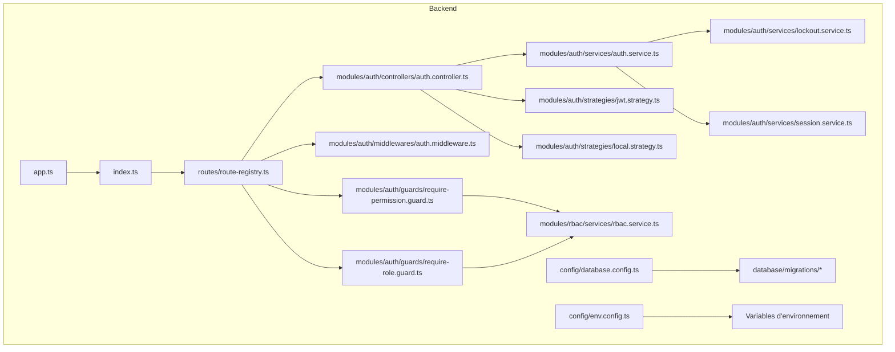
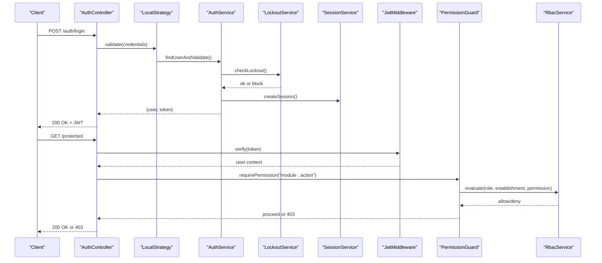
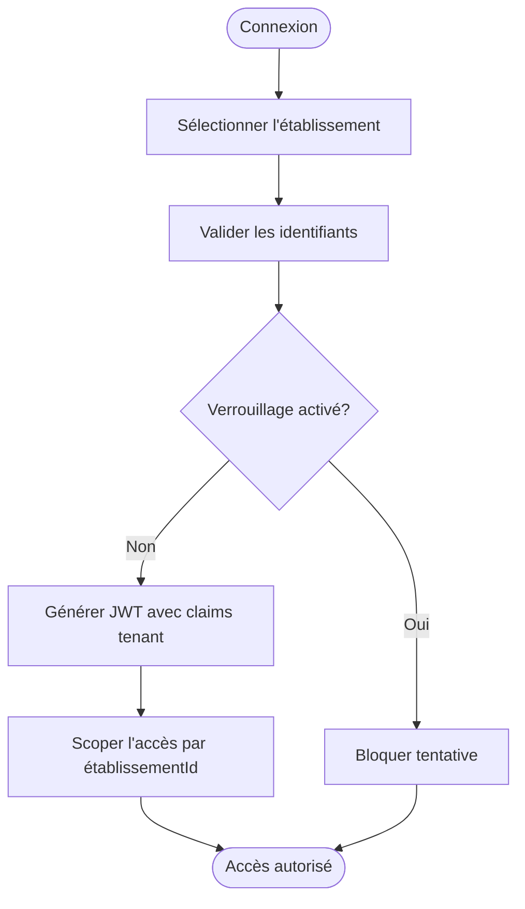
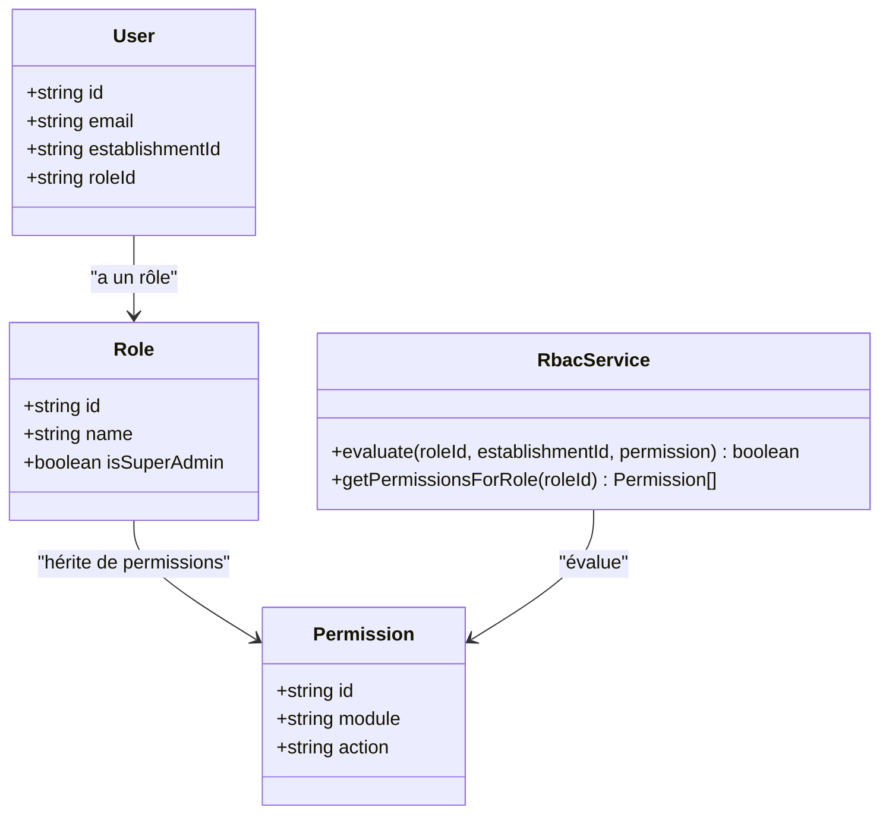
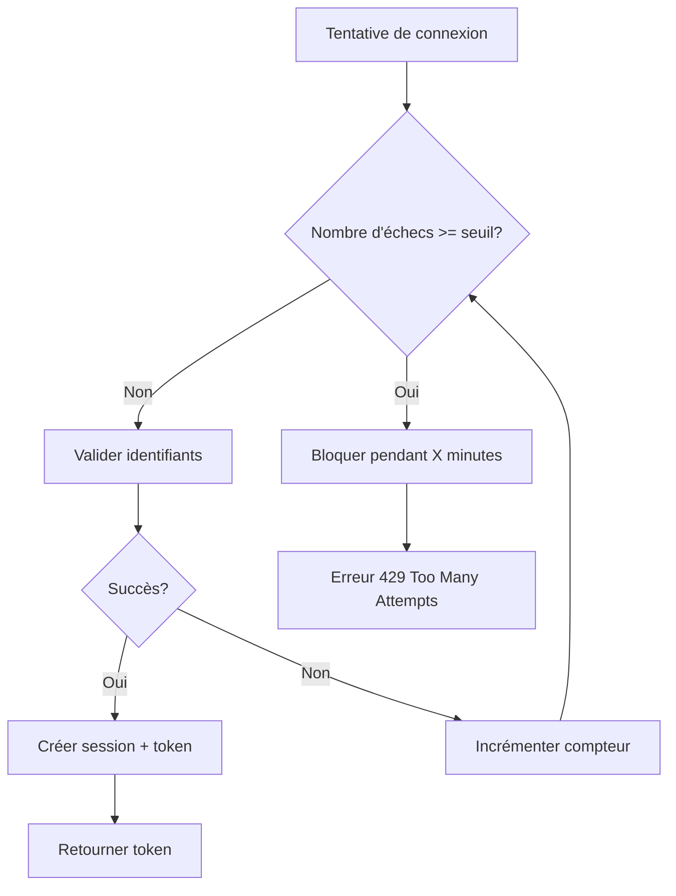
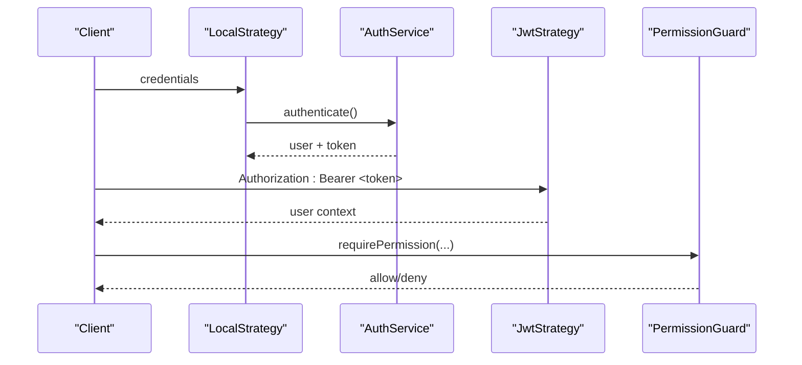
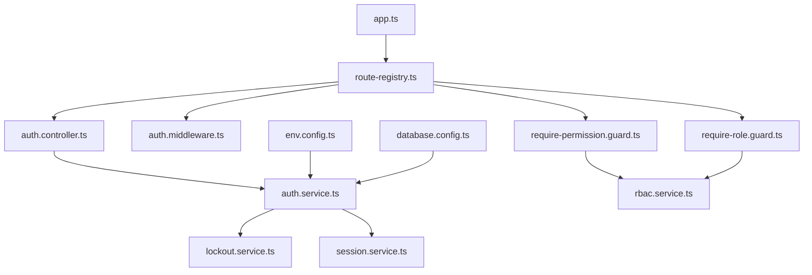

# Authentification et Sécurité

<cite>
**Fichiers référencés dans ce document**
- [app.ts](file://backend/src/app.ts)
- [index.ts](file://backend/src/index.ts)
- [route-registry.ts](file://backend/src/routes/route-registry.ts)
- [auth.controller.ts](file://backend/src/modules/auth/controllers/auth.controller.ts)
- [auth.service.ts](file://backend/src/modules/auth/services/auth.service.ts)
- [jwt.strategy.ts](file://backend/src/modules/auth/strategies/jwt.strategy.ts)
- [local.strategy.ts](file://backend/src/modules/auth/strategies/local.strategy.ts)
- [auth.middleware.ts](file://backend/src/modules/auth/middlewares/auth.middleware.ts)
- [require-permission.guard.ts](file://backend/src/modules/auth/guards/require-permission.guard.ts)
- [require-role.guard.ts](file://backend/src/modules/auth/guards/require-role.guard.ts)
- [lockout.service.ts](file://backend/src/modules/auth/services/lockout.service.ts)
- [session.service.ts](file://backend/src/modules/auth/services/session.service.ts)
- [rbac.service.ts](file://backend/src/modules/rbac/services/rbac.service.ts)
- [database.config.ts](file://backend/src/config/database.config.ts)
- [env.config.ts](file://backend/src/config/env.config.ts)
- [027-auth-multi-mode.sql](file://backend/database/migrations/027-auth-multi-mode.sql)
- [050-multi-tenant-v3-max-etablissements.sql](file://backend/database/migrations/050-multi-tenant-v3-max-etablissements.sql)
- [079-add-roleId-utilisateur-etablissements.sql](file://backend/database/migrations/079-add-roleId-utilisateur-etablissements.sql)
- [080-preferences-utilisateur-multi-tenant.sql](file://backend/database/migrations/080-preferences-utilisateur-multi-tenant.sql)
- [migrate-rbac-v3.sql](file://backend/database/migrations/migrate-rbac-v3.sql)
- [AMÉLIORATIONS-SECURITE-AUTHENTIFICATION.md](file://docs/ameliorations/AMÉLIORATIONS-SECURITE-AUTHENTIFICATION.md)
- [GUIDE-TEST-SECURITÉ.md](file://docs/guides/GUIDE-TEST-SECURITÉ.md)
- [IMPLEMENTATION-BLOCAGE-AUTH-TERMINEE.md](file://docs/implementations/IMPLEMENTATION-BLOCAGE-AUTH-TERMINEE.md)
- [CORRECTION-PERMISSIONS-SUPER-ADMIN.md](file://docs/corrections/CORRECTION-PERMISSIONS-SUPER-ADMIN.md)
- [ANALYSE-ARCHITECTURE-MULTI-TENANT.md](file://docs/analyses/ANALYSE-ARCHITECTURE-MULTI-TENANT.md)
</cite>

## Table des matières
1. [Introduction](#introduction)
2. [Structure du projet](#structure-du-projet)
3. [Composants clés](#composants-clés)
4. [Vue d'ensemble de l'architecture](#vue-densemble-de-larchitecture)
5. [Analyse détaillée des composants](#analyse-détaillée-des-composants)
6. [Analyse des dépendances](#analyse-des-dépendances)
7. [Considérations de performance](#considérations-de-performance)
8. [Guide de dépannage](#guide-de-dépannage)
9. [Conclusion](#conclusion)
10. [Annexes](#annexes)

## Introduction
Ce document décrit en profondeur le système d’authentification et de sécurité d’eLISAschool, incluant l’authentification multi-tenant, le RBAC avancé avec permissions granulaires, la gestion des rôles et autorisations, les mécanismes JWT, la gestion des sessions, le blocage d’authentification, ainsi que les bonnes pratiques de sécurité. Il s’appuie sur les fichiers sources réels du backend pour fournir une vision technique précise tout en restant accessible aux débutants.

## Structure du projet
Le module d’authentification et de sécurité est principalement implémenté dans le backend :
- Contrôleurs et services d’authentification (connexion, génération de tokens, vérification)
- Stratégies Passport (JWT et Local)
- Middlewares et guards pour la protection des routes
- Services de verrouillage (lockout) et de session
- Intégration RBAC via un service dédié
- Configuration de base de données et variables d’environnement
- Migrations liées à l’authentification multi-mode, multi-tenant et RBAC v3

**Sources de diagramme**
- [app.ts](file://backend/src/app.ts)
- [index.ts](file://backend/src/index.ts)
- [route-registry.ts](file://backend/src/routes/route-registry.ts)
- [auth.controller.ts](file://backend/src/modules/auth/controllers/auth.controller.ts)
- [auth.service.ts](file://backend/src/modules/auth/services/auth.service.ts)
- [jwt.strategy.ts](file://backend/src/modules/auth/strategies/jwt.strategy.ts)
- [local.strategy.ts](file://backend/src/modules/auth/strategies/local.strategy.ts)
- [auth.middleware.ts](file://backend/src/modules/auth/middlewares/auth.middleware.ts)
- [require-permission.guard.ts](file://backend/src/modules/auth/guards/require-permission.guard.ts)
- [require-role.guard.ts](file://backend/src/modules/auth/guards/require-role.guard.ts)
- [rbac.service.ts](file://backend/src/modules/rbac/services/rbac.service.ts)
- [database.config.ts](file://backend/src/config/database.config.ts)
- [env.config.ts](file://backend/src/config/env.config.ts)

**Sources de section**
- [app.ts](file://backend/src/app.ts)
- [index.ts](file://backend/src/index.ts)
- [route-registry.ts](file://backend/src/routes/route-registry.ts)

## Composants clés
- Contrôleurs d’authentification : endpoints de connexion, déconnexion, renouvellement de token, gestion du contexte tenant.
- Services d’authentification : validation des identifiants, génération/validation JWT, intégration lockout et session.
- Stratégies Passport : local (email/mot de passe ou matricule), jwt (validation de token).
- Middlewares et guards : authentification globale, vérification de rôle, vérification de permission fine.
- Service RBAC : évaluation des permissions basées sur rôles, attributions par établissement, hiérarchie des permissions.
- Services lockout et session : verrouillage après échecs répétés, persistance de session, rotation de token.
- Configuration : paramètres JWT, expiration, secret dynamique, options de verrouillage, configuration DB.

**Sources de section**
- [auth.controller.ts](file://backend/src/modules/auth/controllers/auth.controller.ts)
- [auth.service.ts](file://backend/src/modules/auth/services/auth.service.ts)
- [jwt.strategy.ts](file://backend/src/modules/auth/strategies/jwt.strategy.ts)
- [local.strategy.ts](file://backend/src/modules/auth/strategies/local.strategy.ts)
- [auth.middleware.ts](file://backend/src/modules/auth/middlewares/auth.middleware.ts)
- [require-permission.guard.ts](file://backend/src/modules/auth/guards/require-permission.guard.ts)
- [require-role.guard.ts](file://backend/src/modules/auth/guards/require-role.guard.ts)
- [rbac.service.ts](file://backend/src/modules/rbac/services/rbac.service.ts)
- [lockout.service.ts](file://backend/src/modules/auth/services/lockout.service.ts)
- [session.service.ts](file://backend/src/modules/auth/services/session.service.ts)
- [env.config.ts](file://backend/src/config/env.config.ts)
- [database.config.ts](file://backend/src/config/database.config.ts)

## Vue d'ensemble de l'architecture
L’authentification suit un flux standardisé :
- Le client appelle l’endpoint de connexion.
- La stratégie locale valide les identifiants et applique les règles de verrouillage.
- Un JWT est généré et renvoyé au client.
- Les requêtes suivantes sont protégées par le middleware JWT qui extrait et valide le token.
- Les guards vérifient les rôles et permissions avant d’exécuter les contrôleurs.
- Le service RBAC évalue les permissions en fonction du rôle, de l’établissement et des attributions.

**Sources de diagramme**
- [auth.controller.ts](file://backend/src/modules/auth/controllers/auth.controller.ts)
- [local.strategy.ts](file://backend/src/modules/auth/strategies/local.strategy.ts)
- [auth.service.ts](file://backend/src/modules/auth/services/auth.service.ts)
- [lockout.service.ts](file://backend/src/modules/auth/services/lockout.service.ts)
- [session.service.ts](file://backend/src/modules/auth/services/session.service.ts)
- [auth.middleware.ts](file://backend/src/modules/auth/middlewares/auth.middleware.ts)
- [require-permission.guard.ts](file://backend/src/modules/auth/guards/require-permission.guard.ts)
- [rbac.service.ts](file://backend/src/modules/rbac/services/rbac.service.ts)

## Analyse détaillée des composants

### Authentification multi-tenant
- Multi-tenant basé sur l’établissement : chaque utilisateur appartient à un établissement ; les accès sont scellés par cet ID.
- Migration 027 introduit le mode multi-mode d’authentification ; migrations 050 et 079 étendent les capacités et ajoutent roleId par établissement.
- Préférences utilisateur multi-tenant permettent de configurer les comportements par établissement.

**Sources de diagramme**
- [027-auth-multi-mode.sql](file://backend/database/migrations/027-auth-multi-mode.sql)
- [050-multi-tenant-v3-max-etablissements.sql](file://backend/database/migrations/050-multi-tenant-v3-max-etablissements.sql)
- [079-add-roleId-utilisateur-etablissements.sql](file://backend/database/migrations/079-add-roleId-utilisateur-etablissements.sql)
- [080-preferences-utilisateur-multi-tenant.sql](file://backend/database/migrations/080-preferences-utilisateur-multi-tenant.sql)

**Sources de section**
- [027-auth-multi-mode.sql](file://backend/database/migrations/027-auth-multi-mode.sql)
- [050-multi-tenant-v3-max-etablissements.sql](file://backend/database/migrations/050-multi-tenant-v3-max-etablissements.sql)
- [079-add-roleId-utilisateur-etablissements.sql](file://backend/database/migrations/079-add-roleId-utilisateur-etablissements.sql)
- [080-preferences-utilisateur-multi-tenant.sql](file://backend/database/migrations/080-preferences-utilisateur-multi-tenant.sql)
- [ANALYSE-ARCHITECTURE-MULTI-TENANT.md](file://docs/analyses/ANALYSE-ARCHITECTURE-MULTI-TENANT.md)

### RBAC avancé et permissions granulaires
- Rôles attribués par établissement ; permissions définies au niveau module/action.
- Service RBAC évalue les permissions en combinant rôle, établissement et attributions.
- Migration migrate-rbac-v3.sql met à jour la structure de permissions pour supporter la granularité.

**Sources de diagramme**
- [rbac.service.ts](file://backend/src/modules/rbac/services/rbac.service.ts)
- [migrate-rbac-v3.sql](file://backend/database/migrations/migrate-rbac-v3.sql)

**Sources de section**
- [rbac.service.ts](file://backend/src/modules/rbac/services/rbac.service.ts)
- [migrate-rbac-v3.sql](file://backend/database/migrations/migrate-rbac-v3.sql)
- [CORRECTION-PERMISSIONS-SUPER-ADMIN.md](file://docs/corrections/CORRECTION-PERMISSIONS-SUPER-ADMIN.md)

### Gestion des sessions et verrouillage d’authentification
- Verrouillage : compteur d’échecs par identifiant, seuil configurable, durée de blocage.
- Sessions : création, rotation de token, invalidation lors de la déconnexion.
- Implémentation documentée dans les guides et scripts de déploiement.

**Sources de diagramme**
- [lockout.service.ts](file://backend/src/modules/auth/services/lockout.service.ts)
- [session.service.ts](file://backend/src/modules/auth/services/session.service.ts)

**Sources de section**
- [lockout.service.ts](file://backend/src/modules/auth/services/lockout.service.ts)
- [session.service.ts](file://backend/src/modules/auth/services/session.service.ts)
- [IMPLEMENTATION-BLOCAGE-AUTH-TERMINEE.md](file://docs/implementations/IMPLEMENTATION-BLOCAGE-AUTH-TERMINEE.md)

### Mécanismes JWT et stratégies
- Stratégie locale : validation des identifiants (email/matricule + mot de passe).
- Stratégie JWT : extraction du token depuis les en-têtes, vérification de signature et expiration.
- Génération de token avec claims utilisateur, rôle et établissement.

**Sources de diagramme**
- [local.strategy.ts](file://backend/src/modules/auth/strategies/local.strategy.ts)
- [jwt.strategy.ts](file://backend/src/modules/auth/strategies/jwt.strategy.ts)
- [auth.service.ts](file://backend/src/modules/auth/services/auth.service.ts)
- [require-permission.guard.ts](file://backend/src/modules/auth/guards/require-permission.guard.ts)

**Sources de section**
- [local.strategy.ts](file://backend/src/modules/auth/strategies/local.strategy.ts)
- [jwt.strategy.ts](file://backend/src/modules/auth/strategies/jwt.strategy.ts)
- [auth.service.ts](file://backend/src/modules/auth/services/auth.service.ts)

### Middlewares et guards de protection
- Middleware d’authentification : vérifie JWT, attache l’utilisateur à la requête.
- Guards : require-role pour vérifier le rôle, require-permission pour vérifier la permission fine.
- Ordonnancement critique : l’ordre d’application des middlewares impacte la sécurité.

**Sources de section**
- [auth.middleware.ts](file://backend/src/modules/auth/middlewares/auth.middleware.ts)
- [require-role.guard.ts](file://backend/src/modules/auth/guards/require-role.guard.ts)
- [require-permission.guard.ts](file://backend/src/modules/auth/guards/require-permission.guard.ts)

### Configuration et paramètres de sécurité
- Variables d’environnement : secrets JWT, expirations, options de verrouillage, URL de base, CORS.
- Configuration de la base de données : connexions, pools, timeouts.
- Bonnes pratiques : rotation de secret, expiration courte, HTTPS, validation stricte des entrées.

**Sources de section**
- [env.config.ts](file://backend/src/config/env.config.ts)
- [database.config.ts](file://backend/src/config/database.config.ts)
- [AMÉLIORATIONS-SECURITE-AUTHENTIFICATION.md](file://docs/ameliorations/AMÉLIORATIONS-SECURITE-AUTHENTIFICATION.md)

## Analyse des dépendances
Les composants d’authentification dépendent fortement du service RBAC et des configurations globales. L’ordre d’initialisation dans app.ts et index.ts est crucial pour garantir que les middlewares et guards soient correctement enregistrés avant les routes.

**Sources de diagramme**
- [app.ts](file://backend/src/app.ts)
- [index.ts](file://backend/src/index.ts)
- [route-registry.ts](file://backend/src/routes/route-registry.ts)
- [auth.controller.ts](file://backend/src/modules/auth/controllers/auth.controller.ts)
- [auth.service.ts](file://backend/src/modules/auth/services/auth.service.ts)
- [lockout.service.ts](file://backend/src/modules/auth/services/lockout.service.ts)
- [session.service.ts](file://backend/src/modules/auth/services/session.service.ts)
- [auth.middleware.ts](file://backend/src/modules/auth/middlewares/auth.middleware.ts)
- [require-permission.guard.ts](file://backend/src/modules/auth/guards/require-permission.guard.ts)
- [require-role.guard.ts](file://backend/src/modules/auth/guards/require-role.guard.ts)
- [rbac.service.ts](file://backend/src/modules/rbac/services/rbac.service.ts)
- [env.config.ts](file://backend/src/config/env.config.ts)
- [database.config.ts](file://backend/src/config/database.config.ts)

**Sources de section**
- [app.ts](file://backend/src/app.ts)
- [index.ts](file://backend/src/index.ts)
- [route-registry.ts](file://backend/src/routes/route-registry.ts)

## Considérations de performance
- Validation rapide des identifiants et cache des permissions si possible.
- Limitation du nombre de tentatives de connexion pour éviter les attaques par force brute.
- Expiration courte des tokens et rafraîchissement sécurisé.
- Indexation appropriée des tables utilisateurs, rôles et permissions pour réduire les temps de requête.

[Pas de sources nécessaires car cette section fournit des conseils généraux]

## Guide de dépannage
- Erreurs 401/403 : vérifier l’ordre des middlewares, la validité du JWT, et les permissions RBAC.
- Blocage d’authentification : ajuster le seuil et la durée de verrouillage ; vérifier le compteur d’échecs.
- Problèmes de session : invalider la session côté serveur lors de la déconnexion ; vérifier la rotation de token.
- Tests de sécurité : utiliser les guides de test pour valider les flux critiques.

**Sources de section**
- [GUIDE-TEST-SECURITÉ.md](file://docs/guides/GUIDE-TEST-SECURITÉ.md)
- [IMPLEMENTATION-BLOCAGE-AUTH-TERMINEE.md](file://docs/implementations/IMPLEMENTATION-BLOCAGE-AUTH-TERMINEE.md)
- [CORRECTION-PERMISSIONS-SUPER-ADMIN.md](file://docs/corrections/CORRECTION-PERMISSIONS-SUPER-ADMIN.md)

## Conclusion
Le système d’authentification et de sécurité d’eLISAschool combine une architecture multi-tenant robuste, un RBAC granulaire, des mécanismes JWT sécurisés, une gestion de session fiable et un verrouillage d’authentification efficace. En suivant les bonnes pratiques et en utilisant les outils de test fournis, les équipes peuvent garantir une sécurité solide et évolutive.

[Pas de sources nécessaires car cette section résume sans analyser de fichiers spécifiques]

## Annexes
- Références aux migrations critiques pour l’authentification et le RBAC.
- Guides de déploiement et de configuration pour activer les protections.
- Exemples d’intégration frontend pour l’envoi et la gestion des tokens.

[Pas de sources nécessaires car cette section est informative]