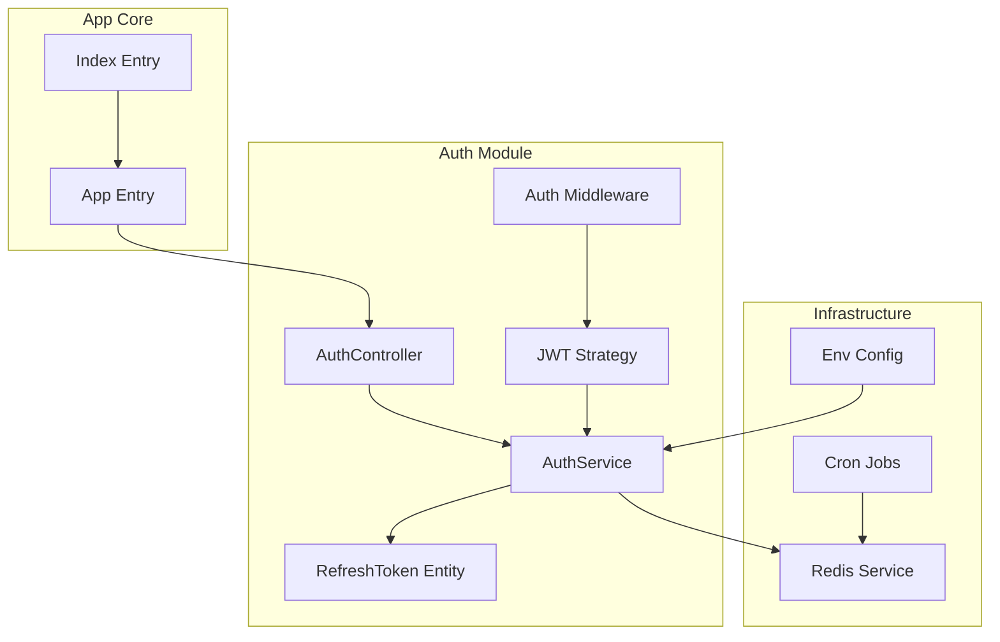
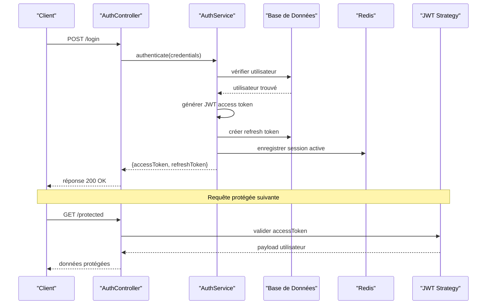
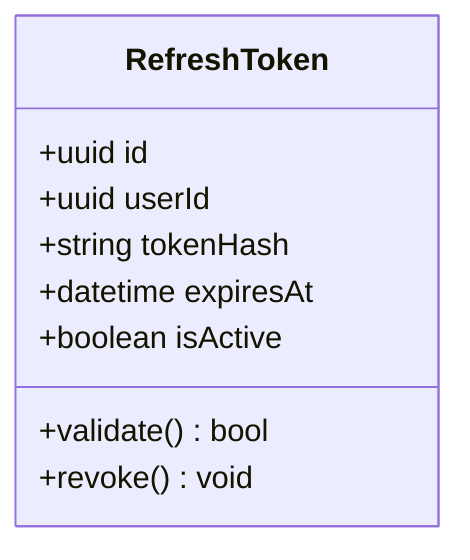
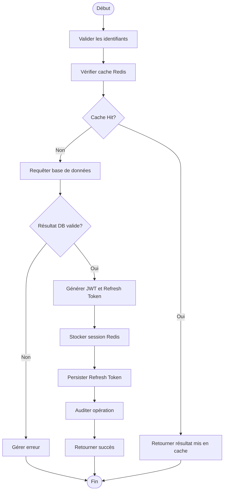
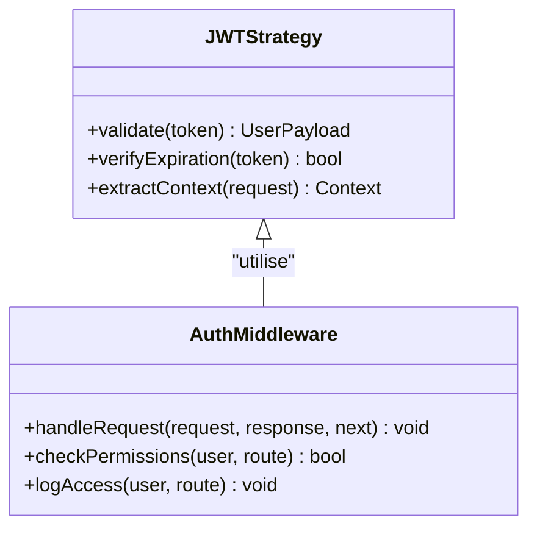
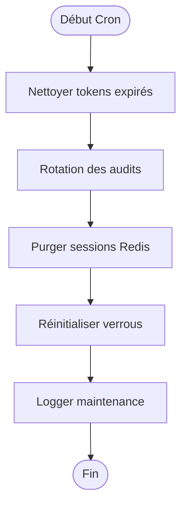
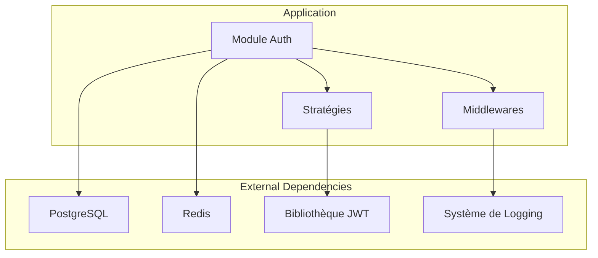

# Gestion des Sessions et Tokens

<cite>
**Fichiers référencés dans ce document**
- [auth.controller.ts](file://backend/src/modules/auth/controllers/auth.controller.ts)
- [auth.service.ts](file://backend/src/modules/auth/services/auth.service.ts)
- [refresh-token.entity.ts](file://backend/src/modules/auth/entities/refresh-token.entity.ts)
- [jwt.strategy.ts](file://backend/src/modules/auth/strategies/jwt.strategy.ts)
- [auth.middleware.ts](file://backend/src/common/middlewares/auth.middleware.ts)
- [redis.service.ts](file://backend/src/common/services/redis.service.ts)
- [cron-jobs.ts](file://backend/src/modules/auth/cron-jobs.ts)
- [env.config.ts](file://backend/src/config/env.config.ts)
- [app.ts](file://backend/src/app.ts)
- [index.ts](file://backend/src/index.ts)
- [SECURE-LOGOUT-IMPLEMENTATION.md](file://docs/autres/SECURE-LOGOUT-IMPLEMENTATION.md)
- [SYSTEME-BLOCAGE-AUTH-DEUX-NIVEAUX.md](file://docs/SYSTEME-BLOCAGE-AUTH-DEUX-NIVEAUX.md)
- [REDIS-CONFIGURATION.md](file://docs/autres/REDIS-CONFIGURATION.md)
</cite>

## Table des matières
1. [Introduction](#introduction)
2. [Structure du Projet](#structure-du-projet)
3. [Composants Clés](#composants-clés)
4. [Architecture Globale](#architecture-globale)
5. [Analyse Détaillée des Composants](#analyse-detailee-des-composants)
6. [Analyse des Dépendances](#analyse-des-dependances)
7. [Considérations de Performance](#considerations-de-performance)
8. [Guide de Dépannage](#guide-de-depannage)
9. [Conclusion](#conclusion)
10. [Annexes](#annexes)

## Introduction

Ce document présente une vue complète de la gestion des sessions et des tokens JWT dans eLISAschool. Il couvre l’implémentation des tokens d’accès, le mécanisme de refresh tokens, la rotation automatique des audits, le système de blocage d’authentification à deux niveaux, ainsi que l’intégration avec Redis pour le stockage des sessions et les performances associées. Des exemples de configuration de durée de vie des tokens, la déconnexion sécurisée et les stratégies anti-force brute sont également détaillés.

## Structure du Projet

Le module d’authentification est organisé autour de contrôleurs, services, entités, stratégies et middlewares, avec un support explicite pour Redis et des tâches planifiées (cron). Les fichiers clés incluent:
- Contrôleur et service d’authentification
- Entité RefreshToken
- Stratégie JWT et middleware d’authentification
- Service Redis et jobs cron pour la maintenance
- Configuration environnementale et points d’entrée de l’application

**Sources de diagramme**
- [auth.controller.ts](file://backend/src/modules/auth/controllers/auth.controller.ts)
- [auth.service.ts](file://backend/src/modules/auth/services/auth.service.ts)
- [refresh-token.entity.ts](file://backend/src/modules/auth/entities/refresh-token.entity.ts)
- [jwt.strategy.ts](file://backend/src/modules/auth/strategies/jwt.strategy.ts)
- [auth.middleware.ts](file://backend/src/common/middlewares/auth.middleware.ts)
- [redis.service.ts](file://backend/src/common/services/redis.service.ts)
- [cron-jobs.ts](file://backend/src/modules/auth/cron-jobs.ts)
- [env.config.ts](file://backend/src/config/env.config.ts)
- [app.ts](file://backend/src/app.ts)
- [index.ts](file://backend/src/index.ts)

**Sources de section**
- [auth.controller.ts](file://backend/src/modules/auth/controllers/auth.controller.ts)
- [auth.service.ts](file://backend/src/modules/auth/services/auth.service.ts)
- [refresh-token.entity.ts](file://backend/src/modules/auth/entities/refresh-token.entity.ts)
- [jwt.strategy.ts](file://backend/src/modules/auth/strategies/jwt.strategy.ts)
- [auth.middleware.ts](file://backend/src/common/middlewares/auth.middleware.ts)
- [redis.service.ts](file://backend/src/common/services/redis.service.ts)
- [cron-jobs.ts](file://backend/src/modules/auth/cron-jobs.ts)
- [env.config.ts](file://backend/src/config/env.config.ts)
- [app.ts](file://backend/src/app.ts)
- [index.ts](file://backend/src/index.ts)

## Composants Clés

- Contrôleurs et Services d’Authentification: orchestrent login, logout, refresh, validation de tokens et intégration Redis.
- Entité RefreshToken: modèle persistant pour les refresh tokens avec expiration et révocation.
- Stratégie JWT: validation des tokens d’accès et extraction du contexte utilisateur.
- Middleware d’Authentification: protection des routes, vérification de permissions et audit.
- Service Redis: stockage en mémoire haute performance pour sessions, compteurs et verrous.
- Cron Jobs: maintenance automatique (nettoyage des tokens expirés, rotation d’audits, purge de données temporaires).
- Configuration Environnementale: paramètres de durée de vie des tokens, secrets, et options Redis.

**Sources de section**
- [auth.controller.ts](file://backend/src/modules/auth/controllers/auth.controller.ts)
- [auth.service.ts](file://backend/src/modules/auth/services/auth.service.ts)
- [refresh-token.entity.ts](file://backend/src/modules/auth/entities/refresh-token.entity.ts)
- [jwt.strategy.ts](file://backend/src/modules/auth/strategies/jwt.strategy.ts)
- [auth.middleware.ts](file://backend/src/common/middlewares/auth.middleware.ts)
- [redis.service.ts](file://backend/src/common/services/redis.service.ts)
- [cron-jobs.ts](file://backend/src/modules/auth/cron-jobs.ts)
- [env.config.ts](file://backend/src/config/env.config.ts)

## Architecture Globale

Le flux d’authentification suit un schéma classique:
- L’utilisateur se connecte via le contrôleur d’authentification.
- Le service génère un token d’accès JWT et un refresh token persisté.
- La stratégie JWT valide les requêtes protégées.
- Redis stocke les sessions actives et les compteurs de tentatives.
- Les cron jobs maintiennent la propreté des données sensibles.

**Sources de diagramme**
- [auth.controller.ts](file://backend/src/modules/auth/controllers/auth.controller.ts)
- [auth.service.ts](file://backend/src/modules/auth/services/auth.service.ts)
- [jwt.strategy.ts](file://backend/src/modules/auth/strategies/jwt.strategy.ts)
- [redis.service.ts](file://backend/src/common/services/redis.service.ts)

**Sources de section**
- [auth.controller.ts](file://backend/src/modules/auth/controllers/auth.controller.ts)
- [auth.service.ts](file://backend/src/modules/auth/services/auth.service.ts)
- [jwt.strategy.ts](file://backend/src/modules/auth/strategies/jwt.strategy.ts)
- [redis.service.ts](file://backend/src/common/services/redis.service.ts)

## Analyse Détaillée des Composants

### Entité RefreshToken

L’entité RefreshToken définit les champs essentiels pour la persistance et la gestion des refresh tokens:
- Identifiant unique
- Référence utilisateur
- Hash du token (stockage sécurisé)
- Date d’expiration
- Statut actif/inactif

**Sources de diagramme**
- [refresh-token.entity.ts](file://backend/src/modules/auth/entities/refresh-token.entity.ts)

**Sources de section**
- [refresh-token.entity.ts](file://backend/src/modules/auth/entities/refresh-token.entity.ts)

### Services de Gestion de Tokens

Le service d’authentification gère:
- Génération de JWT access tokens avec durées configurables
- Création et validation de refresh tokens
- Rotation automatique des refresh tokens
- Intégration Redis pour sessions et verrous
- Audit et traçabilité des opérations

**Sources de diagramme**
- [auth.service.ts](file://backend/src/modules/auth/services/auth.service.ts)
- [redis.service.ts](file://backend/src/common/services/redis.service.ts)

**Sources de section**
- [auth.service.ts](file://backend/src/modules/auth/services/auth.service.ts)
- [redis.service.ts](file://backend/src/common/services/redis.service.ts)

### Stratégie JWT et Middleware d’Authentification

La stratégie JWT assure:
- Validation des tokens d’accès
- Extraction du contexte utilisateur
- Vérification des permissions
- Protection contre les attaques par rejeu

Le middleware d’authentification:
- Intercepte les requêtes protégées
- Applique les règles d’autorisation
- Enregistre les logs d’audit

**Sources de diagramme**
- [jwt.strategy.ts](file://backend/src/modules/auth/strategies/jwt.strategy.ts)
- [auth.middleware.ts](file://backend/src/common/middlewares/auth.middleware.ts)

**Sources de section**
- [jwt.strategy.ts](file://backend/src/modules/auth/strategies/jwt.strategy.ts)
- [auth.middleware.ts](file://backend/src/common/middlewares/auth.middleware.ts)

### Cron Jobs pour la Maintenance

Les tâches planifiées gèrent:
- Nettoyage automatique des refresh tokens expirés
- Rotation des logs d’audit
- Purge des sessions Redis inactives
- Maintenance des verrous de sécurité

**Sources de diagramme**
- [cron-jobs.ts](file://backend/src/modules/auth/cron-jobs.ts)

**Sources de section**
- [cron-jobs.ts](file://backend/src/modules/auth/cron-jobs.ts)

### Configuration Environnementale

Les paramètres critiques incluent:
- Durée de vie des tokens d’accès
- Secret JWT dynamique
- Configuration Redis (hôte, port, timeout)
- Paramètres de blocage d’authentification
- Options de logging et audit

**Sources de section**
- [env.config.ts](file://backend/src/config/env.config.ts)

## Analyse des Dépendances

Le système d’authentification dépend de plusieurs composants externes:
- Base de données PostgreSQL pour la persistance
- Redis pour le stockage en mémoire haute performance
- Bibliothèques JWT pour la signature et validation des tokens
- Système de logging pour l’audit et le monitoring

**Sources de diagramme**
- [auth.service.ts](file://backend/src/modules/auth/services/auth.service.ts)
- [redis.service.ts](file://backend/src/common/services/redis.service.ts)
- [jwt.strategy.ts](file://backend/src/modules/auth/strategies/jwt.strategy.ts)
- [auth.middleware.ts](file://backend/src/common/middlewares/auth.middleware.ts)

**Sources de section**
- [auth.service.ts](file://backend/src/modules/auth/services/auth.service.ts)
- [redis.service.ts](file://backend/src/common/services/redis.service.ts)
- [jwt.strategy.ts](file://backend/src/modules/auth/strategies/jwt.strategy.ts)
- [auth.middleware.ts](file://backend/src/common/middlewares/auth.middleware.ts)

## Considérations de Performance

- **Stockage Redis**: Utilisation de structures en mémoire pour les sessions et compteurs, offrant une latence très faible.
- **Validation JWT**: Validation côté serveur sans appels base de données systématiques.
- **Pagination et Filtrage**: Optimisation des requêtes pour les opérations d’audit et de gestion de tokens.
- **Connexion Pooling**: Gestion efficace des connexions Redis et PostgreSQL.
- **Mise en Cache**: Stratégies de cache pour réduire la charge sur la base de données.

[Section sans sources spécifiques - conseils généraux de performance]

## Guide de Dépannage

### Problèmes Courants et Solutions

- **Échec de validation JWT**: Vérifier la configuration du secret et la validité de l’horodatage.
- **Timeout Redis**: Augmenter les timeouts ou vérifier la disponibilité du serveur Redis.
- **Tokens non expirés**: Vérifier les configurations de durée de vie et les jobs cron.
- **Blocage excessif**: Ajuster les seuils de tentatives échouées et les durées de blocage.

### Logs et Monitoring

- Activer le logging détaillé pour les opérations d’authentification
- Surveiller les métriques Redis (hit rate, memory usage)
- Auditer les tentatives de connexion suspectes
- Monitorer la santé des connexions base de données

**Sources de section**
- [SECURE-LOGOUT-IMPLEMENTATION.md](file://docs/autres/SECURE-LOGOUT-IMPLEMENTATION.md)
- [SYSTEME-BLOCAGE-AUTH-DEUX-NIVEAUX.md](file://docs/SYSTEME-BLOCAGE-AUTH-DEUX-NIVEAUX.md)
- [REDIS-CONFIGURATION.md](file://docs/autres/REDIS-CONFIGURATION.md)

## Conclusion

Le système de gestion des sessions et tokens d’eLISAschool offre une architecture robuste et sécurisée combinant JWT, refresh tokens, Redis et des mécanismes avancés de sécurité. L’intégration de cron jobs assure la maintenance automatique tandis que la configuration flexible permet d’adapter les politiques de sécurité aux besoins spécifiques.

[Section sans sources spécifiques - résumé général]

## Annexes

### Exemples de Configuration

- **Durée de vie des tokens**: Configurer ACCESS_TOKEN_EXPIRY et REFRESH_TOKEN_EXPIRY selon les exigences de sécurité.
- **Secret JWT**: Utiliser un secret fort et régulièrement renouvelé.
- **Redis**: Configurer les paramètres de connexion et les politiques de persistance.
- **Blocage authentification**: Définir les seuils de tentatives échouées et les durées de blocage.

### Sécurité Avancée

- **Rotation automatique**: Implémenter la rotation régulière des secrets et tokens.
- **Protection force brute**: Combiner Redis pour le comptage et le blocage temporaire.
- **Audit complet**: Tracer toutes les opérations d’authentification et d’autorisation.
- **Monitoring**: Mettre en place des alertes pour les activités suspectes.

**Sources de section**
- [env.config.ts](file://backend/src/config/env.config.ts)
- [SECURE-LOGOUT-IMPLEMENTATION.md](file://docs/autres/SECURE-LOGOUT-IMPLEMENTATION.md)
- [SYSTEME-BLOCAGE-AUTH-DEUX-NIVEAUX.md](file://docs/SYSTEME-BLOCAGE-AUTH-DEUX-NIVEAUX.md)
- [REDIS-CONFIGURATION.md](file://docs/autres/REDIS-CONFIGURATION.md)