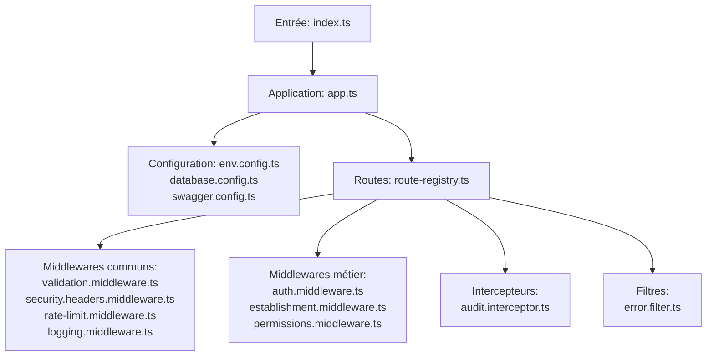
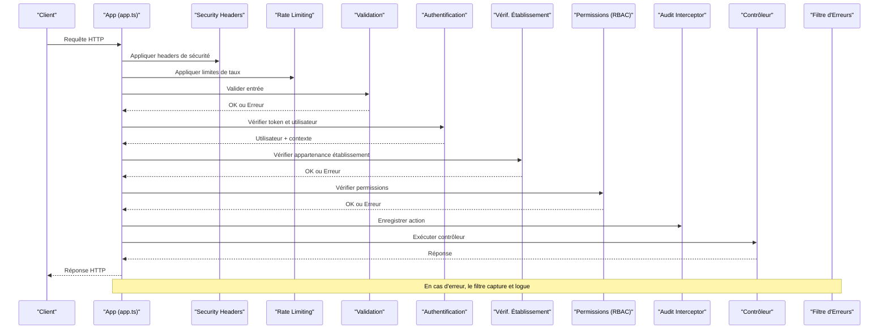
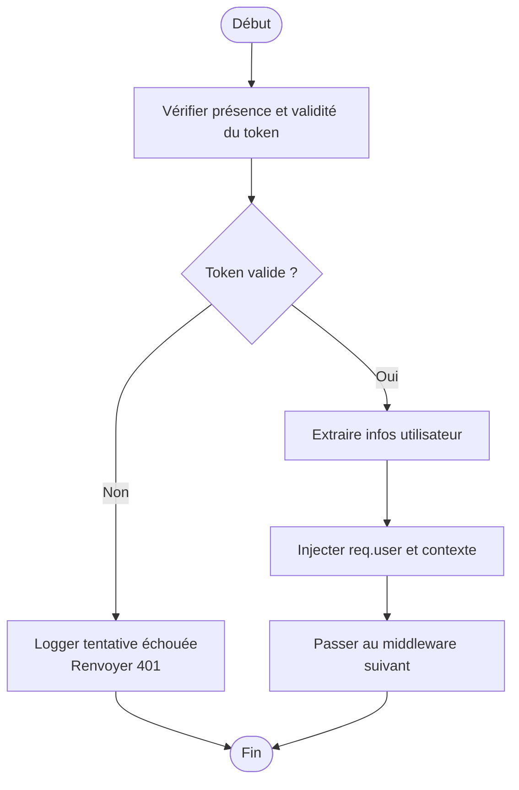
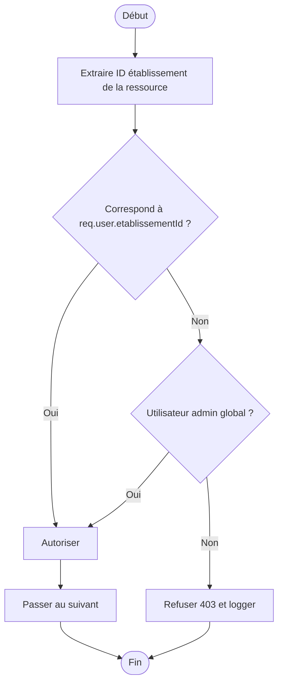
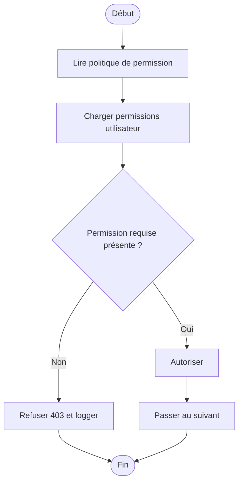
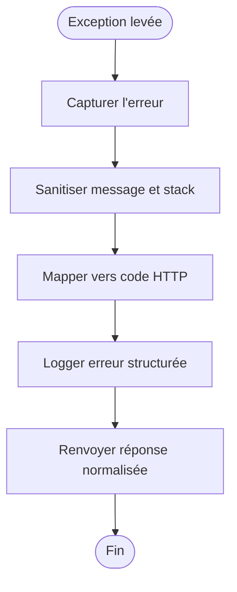
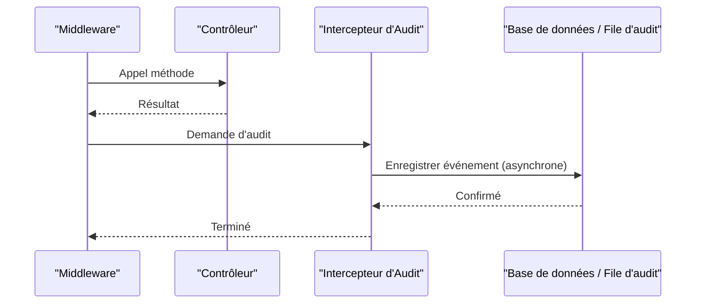
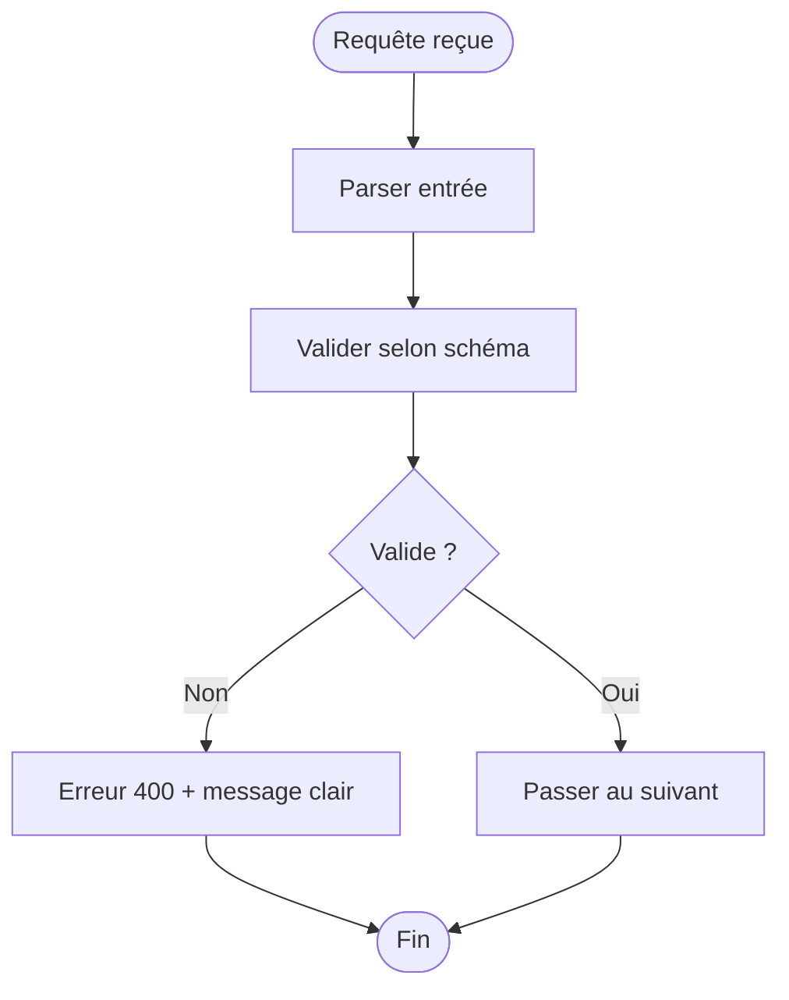
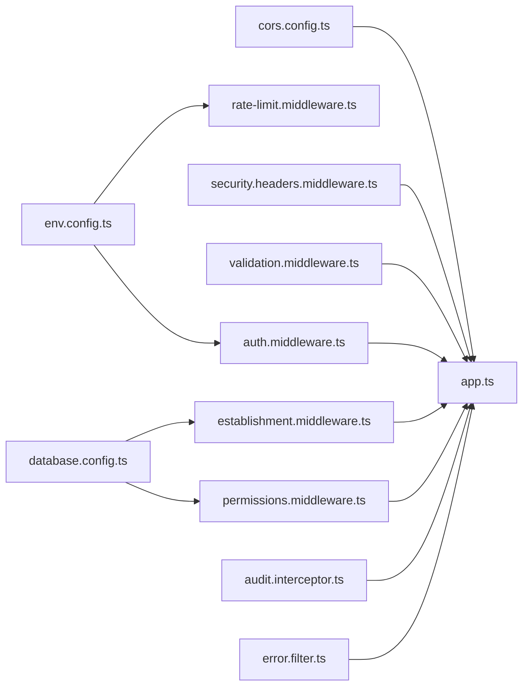

# Middleware de Sécurité

<cite>
**Fichiers référencés dans ce document**
- [app.ts](file://backend/src/app.ts)
- [index.ts](file://backend/src/index.ts)
- [route-registry.ts](file://backend/src/routes/route-registry.ts)
- [auth.middleware.ts](file://backend/src/modules/auth/middlewares/auth.middleware.ts)
- [establishment.middleware.ts](file://backend/src/modules/etablissement/middlewares/establishment.middleware.ts)
- [permissions.middleware.ts](file://backend/src/modules/rbac/middlewares/permissions.middleware.ts)
- [error.filter.ts](file://backend/src/common/filters/error.filter.ts)
- [audit.interceptor.ts](file://backend/src/modules/audit/interceptors/audit.interceptor.ts)
- [validation.middleware.ts](file://backend/src/common/middlewares/validation.middleware.ts)
- [cors.config.ts](file://backend/src/config/cors.config.ts)
- [rate-limit.middleware.ts](file://backend/src/common/middlewares/rate-limit.middleware.ts)
- [security.headers.middleware.ts](file://backend/src/common/middlewares/security.headers.middleware.ts)
- [logging.middleware.ts](file://backend/src/common/middlewares/logging.middleware.ts)
- [env.config.ts](file://backend/src/config/env.config.ts)
- [database.config.ts](file://backend/src/config/database.config.ts)
- [swagger.config.ts](file://backend/src/config/swagger.config.ts)
</cite>

## Table des matières
1. [Introduction](#introduction)
2. [Structure du projet](#structure-du-projet)
3. [Composants clés](#composants-clés)
4. [Vue d'ensemble de l'architecture](#vue-densemble-de-larchitecture)
5. [Analyse détaillée des composants](#analyse-detallee-des-composants)
6. [Analyse des dépendances](#analyse-des-dependances)
7. [Considérations de performance](#considerations-de-performance)
8. [Guide de dépannage](#guide-de-depannage)
9. [Conclusion](#conclusion)
10. [Annexes](#annexes)

## Introduction
Ce document présente en détail les middlewares de sécurité d'eLISAschool : authentification, vérification d'établissement, permissions (RBAC), filtres d'erreurs, intercepteur d'audit, middlewares de validation et stratégies anti-intrusions. Il explique le flux de traitement des requêtes, la configuration CORS, le logging de sécurité, la journalisation des tentatives d'accès non autorisées et les mécanismes de blocage d'authentification. Des exemples de création de middlewares personnalisés et des bonnes pratiques pour sécuriser les endpoints API sont également fournis.

## Structure du projet
Le backend est structuré par modules avec une couche commune (common) regroupant middlewares, filtres, intercepteurs et utilitaires. La configuration globale (base de données, environnement, Swagger) est centralisée. Les routes sont enregistrées via un registre qui applique les middlewares globaux puis spécifiques.

**Sources de section**
- [index.ts](file://backend/src/index.ts)
- [app.ts](file://backend/src/app.ts)
- [route-registry.ts](file://backend/src/routes/route-registry.ts)
- [env.config.ts](file://backend/src/config/env.config.ts)
- [database.config.ts](file://backend/src/config/database.config.ts)
- [swagger.config.ts](file://backend/src/config/swagger.config.ts)

## Composants clés
- Middleware d'authentification : valide les jetons, extrait l'utilisateur et son contexte multi-tenant.
- Middleware de vérification d'établissement : s'assure que la ressource appartient à l'établissement de l'utilisateur ou que l'utilisateur a les droits nécessaires.
- Middleware de permissions (RBAC) : vérifie les permissions ou rôles requis sur l'action demandée.
- Filtre d'erreurs : capture et normalise les erreurs, retourne des réponses cohérentes et logue les détails de sécurité.
- Intercepteur d'audit : enregistre les actions sensibles (qui, quoi, quand, où, résultat).
- Middlewares de validation : valident les payloads et paramètres d'entrée.
- Protection contre attaques courantes : headers de sécurité, rate limiting, CORS strict, gestion des erreurs sensibles.

**Sources de section**
- [auth.middleware.ts](file://backend/src/modules/auth/middlewares/auth.middleware.ts)
- [establishment.middleware.ts](file://backend/src/modules/etablissement/middlewares/establishment.middleware.ts)
- [permissions.middleware.ts](file://backend/src/modules/rbac/middlewares/permissions.middleware.ts)
- [error.filter.ts](file://backend/src/common/filters/error.filter.ts)
- [audit.interceptor.ts](file://backend/src/modules/audit/interceptors/audit.interceptor.ts)
- [validation.middleware.ts](file://backend/src/common/middlewares/validation.middleware.ts)
- [security.headers.middleware.ts](file://backend/src/common/middlewares/security.headers.middleware.ts)
- [rate-limit.middleware.ts](file://backend/src/common/middlewares/rate-limit.middleware.ts)

## Vue d'ensemble de l'architecture
Le pipeline de sécurité suit un ordre précis :
1. Headers de sécurité et rate limiting
2. Validation des entrées
3. Authentification
4. Vérification d'établissement
5. Permissions RBAC
6. Intercepteur d'audit
7. Filtre d'erreurs global

**Sources de diagramme**
- [app.ts](file://backend/src/app.ts)
- [security.headers.middleware.ts](file://backend/src/common/middlewares/security.headers.middleware.ts)
- [rate-limit.middleware.ts](file://backend/src/common/middlewares/rate-limit.middleware.ts)
- [validation.middleware.ts](file://backend/src/common/middlewares/validation.middleware.ts)
- [auth.middleware.ts](file://backend/src/modules/auth/middlewares/auth.middleware.ts)
- [establishment.middleware.ts](file://backend/src/modules/etablissement/middlewares/establishment.middleware.ts)
- [permissions.middleware.ts](file://backend/src/modules/rbac/middlewares/permissions.middleware.ts)
- [audit.interceptor.ts](file://backend/src/modules/audit/interceptors/audit.interceptor.ts)
- [error.filter.ts](file://backend/src/common/filters/error.filter.ts)

## Analyse détaillée des composants

### Middleware d'authentification
- Rôle : vérifier le jeton (JWT ou autre), extraire l'utilisateur, enrichir la requête avec le contexte (userId, etablissementId, roles/permissions).
- Comportements clés :
  - Validation du format et signature du jeton.
  - Gestion des tokens expirés et renouvellement si applicable.
  - Injection du contexte utilisateur dans req.user.
  - Journalisation des échecs d'authentification (IP, user-agent, timestamp).
- Intégration : appliqué avant les middlewares métier; peut être omis pour les routes publiques.

**Sources de diagramme**
- [auth.middleware.ts](file://backend/src/modules/auth/middlewares/auth.middleware.ts)

**Sources de section**
- [auth.middleware.ts](file://backend/src/modules/auth/middlewares/auth.middleware.ts)
- [logging.middleware.ts](file://backend/src/common/middlewares/logging.middleware.ts)

### Middleware de vérification d'établissement
- Rôle : garantir que l'utilisateur accède uniquement aux ressources de son établissement autorisé ou qu'il possède des privilèges étendus.
- Comportements clés :
  - Extraction de l'ID d'établissement depuis la ressource ou l'en-tête.
  - Comparaison avec req.user.etablissementId ou vérification de rôle admin.
  - Levée d'erreur 403 si violation.
  - Journalisation des tentatives d'accès inter-établissement.

**Sources de diagramme**
- [establishment.middleware.ts](file://backend/src/modules/etablissement/middlewares/establishment.middleware.ts)

**Sources de section**
- [establishment.middleware.ts](file://backend/src/modules/etablissement/middlewares/establishment.middleware.ts)

### Middleware de permissions (RBAC)
- Rôle : vérifier que l'utilisateur dispose des permissions ou rôles requis pour l'action.
- Comportements clés :
  - Lecture des exigences de permission depuis décorateurs ou configuration de route.
  - Consultation des permissions de l'utilisateur (en mémoire ou base de données).
  - Autorisation conditionnelle selon le type de permission (exacte, groupe, hiérarchique).
  - Logging des refus d'autorisation.

**Sources de diagramme**
- [permissions.middleware.ts](file://backend/src/modules/rbac/middlewares/permissions.middleware.ts)

**Sources de section**
- [permissions.middleware.ts](file://backend/src/modules/rbac/middlewares/permissions.middleware.ts)

### Filtre d'erreurs
- Rôle : capturer toutes les exceptions, normaliser les réponses, éviter les fuites d'informations sensibles.
- Comportements clés :
  - Masquage des stack traces en production.
  - Retour de codes HTTP appropriés (400, 401, 403, 404, 500).
  - Journalisation structurée des erreurs (sans secrets).
  - Support de messages d'erreur localisés.

**Sources de diagramme**
- [error.filter.ts](file://backend/src/common/filters/error.filter.ts)

**Sources de section**
- [error.filter.ts](file://backend/src/common/filters/error.filter.ts)

### Intercepteur d'audit
- Rôle : tracer les actions sensibles pour la conformité et l'investigation.
- Comportements clés :
  - Enregistrement de l'opérateur, action, cible, résultat, IP, user-agent, horodatage.
  - Persistance dans la table d'audit ou file d'événements.
  - Filtrage des données sensibles (masquage de mots de passe, tokens).
  - Performance : écritures asynchrones et batch si possible.

**Sources de diagramme**
- [audit.interceptor.ts](file://backend/src/modules/audit/interceptors/audit.interceptor.ts)

**Sources de section**
- [audit.interceptor.ts](file://backend/src/modules/audit/interceptors/audit.interceptor.ts)

### Middlewares de validation
- Rôle : valider les entrées (body, query, params) avant traitement.
- Comportements clés :
  - Schémas de validation (Zod/Joi/Class-validator).
  - Messages d'erreur clairs et localisés.
  - Arrêt immédiat en cas d'erreur de validation.
  - Logging des tentatives d'injection (XSS, SQLi) détectées.

**Sources de diagramme**
- [validation.middleware.ts](file://backend/src/common/middlewares/validation.middleware.ts)

**Sources de section**
- [validation.middleware.ts](file://backend/src/common/middlewares/validation.middleware.ts)

### Stratégies de protection contre les attaques courantes
- Headers de sécurité : HSTS, CSP, X-Frame-Options, Referrer-Policy, etc.
- Rate limiting : limiter les tentatives de connexion et accès critiques.
- CORS : whitelist stricte des origines, méthodes et en-têtes.
- Validation stricte : désactiver parsing automatique dangereux, utiliser des schémas.
- Gestion des erreurs : ne jamais exposer stack traces ni détails internes.

**Sources de section**
- [security.headers.middleware.ts](file://backend/src/common/middlewares/security.headers.middleware.ts)
- [rate-limit.middleware.ts](file://backend/src/common/middlewares/rate-limit.middleware.ts)
- [cors.config.ts](file://backend/src/config/cors.config.ts)
- [validation.middleware.ts](file://backend/src/common/middlewares/validation.middleware.ts)
- [error.filter.ts](file://backend/src/common/filters/error.filter.ts)

### Configuration de la sécurité CORS
- Origines autorisées : liste blanche basée sur l'environnement.
- Méthodes et en-têtes : restreindre aux besoins réels.
- Credentials : activés uniquement si nécessaire et sécurisé.
- Préflight : optimisé pour réduire les appels OPTIONS.

**Sources de section**
- [cors.config.ts](file://backend/src/config/cors.config.ts)
- [env.config.ts](file://backend/src/config/env.config.ts)

### Logging de sécurité et journalisation des tentatives non autorisées
- Événements à logger :
  - Tentatives de connexion échouées (IP, user-agent, compte visé).
  - Violations d'établissement et refus de permissions.
  - Erreurs de validation suspectes (signatures XSS/SQLi).
- Format : JSON structuré, niveaux de sévérité, corrélation de trace.
- Stockage : fichiers locaux, syslog, ou service centralisé.

**Sources de section**
- [logging.middleware.ts](file://backend/src/common/middlewares/logging.middleware.ts)
- [error.filter.ts](file://backend/src/common/filters/error.filter.ts)
- [auth.middleware.ts](file://backend/src/modules/auth/middlewares/auth.middleware.ts)
- [establishment.middleware.ts](file://backend/src/modules/etablissement/middlewares/establishment.middleware.ts)
- [permissions.middleware.ts](file://backend/src/modules/rbac/middlewares/permissions.middleware.ts)

### Mécanismes de blocage d'authentification
- Compteur de tentatives : par IP et/ou compte.
- Seuil et durée de blocage : configurables.
- Détection de brute-force : patterns anormaux.
- Actions : 429 temporaire, 403 persistant jusqu'à expiration.
- Notification : alertes administrateur si seuil critique atteint.

**Sources de section**
- [rate-limit.middleware.ts](file://backend/src/common/middlewares/rate-limit.middleware.ts)
- [auth.middleware.ts](file://backend/src/modules/auth/middlewares/auth.middleware.ts)
- [env.config.ts](file://backend/src/config/env.config.ts)

### Création de middlewares personnalisés
- Étapes recommandées :
  - Définir la logique de contrôle (validation, autorisation, transformation).
  - Injecter des informations dans req/res sans fuite de données sensibles.
  - Lever des erreurs standardisées.
  - Logger les événements importants.
  - Tester unitairement et en intégration.
- Bonnes pratiques :
  - Garder les middlewares atomiques et réutilisables.
  - Respecter l'ordre d'exécution dans le pipeline.
  - Documenter les préconditions et postconditions.

[Pas de sources directes car il s'agit de conseils génériques]

## Analyse des dépendances
Les middlewares dépendent de la configuration (environnements, base de données, cache) et des services partagés (logger, validateur, RBAC). L'ordre d'application est crucial pour garantir la sécurité et la cohérence des données.

**Sources de diagramme**
- [env.config.ts](file://backend/src/config/env.config.ts)
- [database.config.ts](file://backend/src/config/database.config.ts)
- [cors.config.ts](file://backend/src/config/cors.config.ts)
- [security.headers.middleware.ts](file://backend/src/common/middlewares/security.headers.middleware.ts)
- [validation.middleware.ts](file://backend/src/common/middlewares/validation.middleware.ts)
- [auth.middleware.ts](file://backend/src/modules/auth/middlewares/auth.middleware.ts)
- [establishment.middleware.ts](file://backend/src/modules/etablissement/middlewares/establishment.middleware.ts)
- [permissions.middleware.ts](file://backend/src/modules/rbac/middlewares/permissions.middleware.ts)
- [audit.interceptor.ts](file://backend/src/modules/audit/interceptors/audit.interceptor.ts)
- [error.filter.ts](file://backend/src/common/filters/error.filter.ts)
- [app.ts](file://backend/src/app.ts)

**Sources de section**
- [app.ts](file://backend/src/app.ts)
- [route-registry.ts](file://backend/src/routes/route-registry.ts)

## Considérations de performance
- Middlewares légers : éviter les I/O synchrones; utiliser des files d'attente pour l'audit.
- Cache de permissions : réduire les lectures RBAC répétitives.
- Rate limiting distribué : Redis pour partage entre instances.
- Validation rapide : schémas optimisés, parsing paresseux.
- Monitoring : métriques de latence par middleware.

[Pas de sources directes car il s'agit de recommandations générales]

## Guide de dépannage
- Symptômes fréquents :
  - 401 non attendu : vérifier l'ordre des middlewares et la présence du token.
  - 403 systématique : vérifier les politiques RBAC et l'appartenance établissement.
  - 429 fréquent : ajuster les seuils de rate limiting.
  - Fuites d'erreurs : activer le filtre d'erreurs et masquer les stacks.
- Outils :
  - Logs structurés et corrélation de trace.
  - Tests d'intégration pour chaque middleware.
  - Audits réguliers des configurations CORS et headers.

**Sources de section**
- [error.filter.ts](file://backend/src/common/filters/error.filter.ts)
- [logging.middleware.ts](file://backend/src/common/middlewares/logging.middleware.ts)
- [auth.middleware.ts](file://backend/src/modules/auth/middlewares/auth.middleware.ts)
- [permissions.middleware.ts](file://backend/src/modules/rbac/middlewares/permissions.middleware.ts)
- [establishment.middleware.ts](file://backend/src/modules/etablissement/middlewares/establishment.middleware.ts)
- [rate-limit.middleware.ts](file://backend/src/common/middlewares/rate-limit.middleware.ts)

## Conclusion
La sécurité d'eLISAschool repose sur un pipeline de middlewares rigoureux : headers de sécurité, validation, authentification, vérification d'établissement, permissions RBAC, audit et filtrage d'erreurs. Une configuration CORS stricte, un rate limiting adapté et un logging structuré permettent de protéger les endpoints tout en maintenant la traçabilité et la performance. Le respect des bonnes pratiques et des tests garantit la robustesse face aux attaques courantes.

[Pas de sources directes car il s'agit d'une synthèse]

## Annexes
- Exemples de création de middlewares personnalisés : suivre les étapes recommandées et tester unitairement.
- Configuration CORS : définir des origines précises et limiter les méthodes/en-têtes.
- Sécurisation des endpoints : appliquer toujours auth → establishment → permissions, et valider les entrées.
- Logging de sécurité : centraliser les logs, éviter les données sensibles, utiliser des niveaux de sévérité.

[Pas de sources directes car il s'agit de recommandations générales]