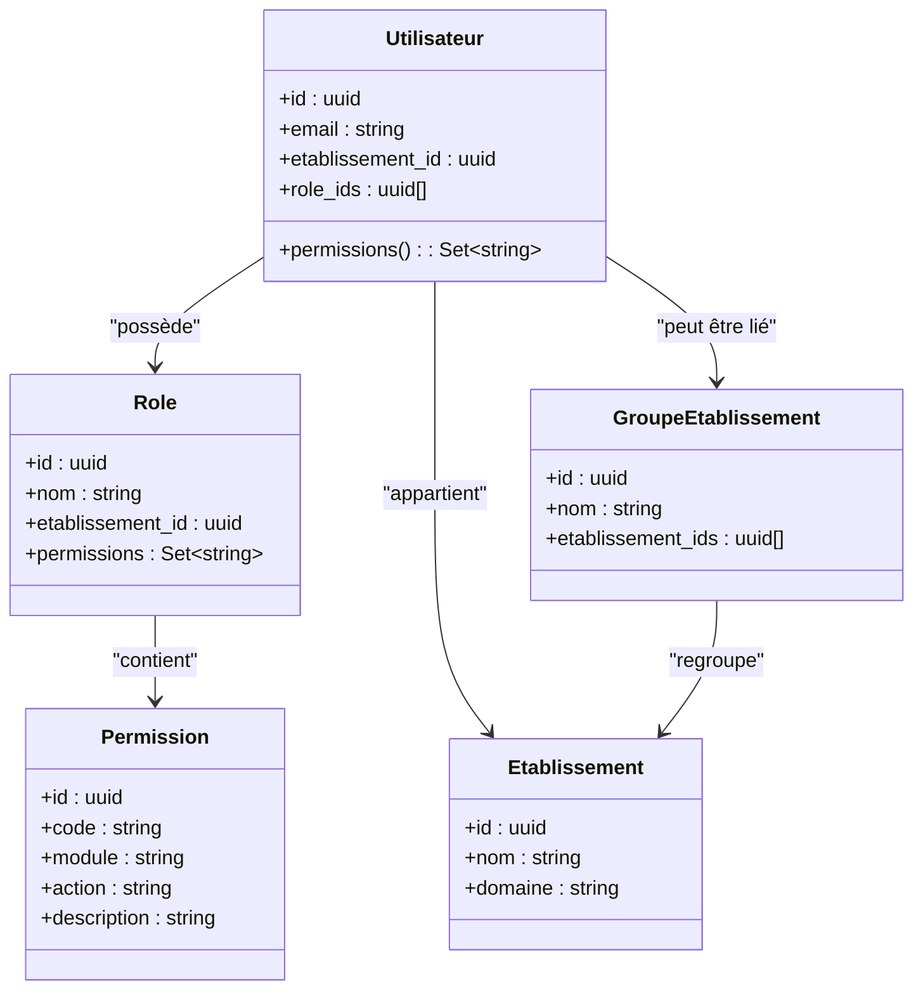
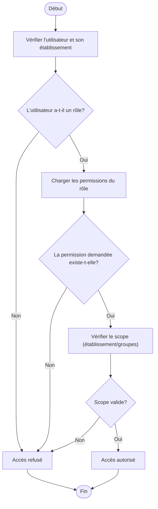
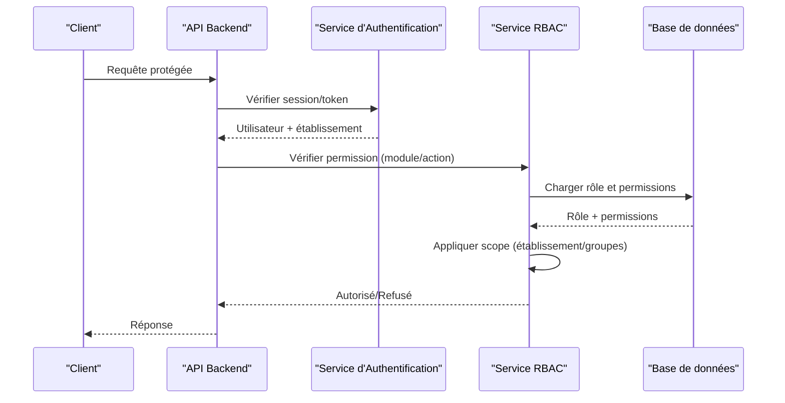
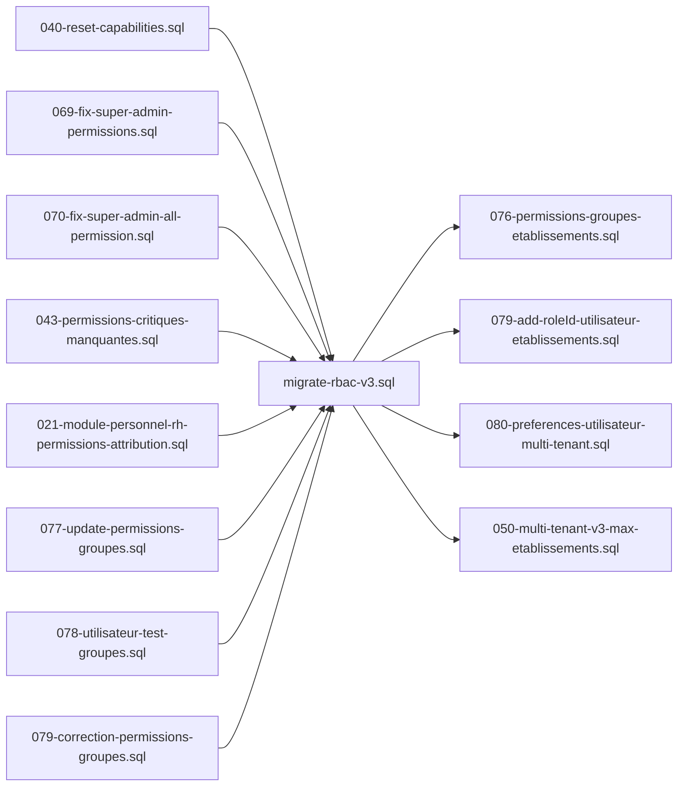

# Architecture RBAC et Concepts Fondamentaux

<cite>
**Fichiers référencés dans ce document**
- [rbac-system.md](file://docs/rbac-system.md)
- [RBAC_COMPLETION.md](file://docs/RBAC_COMPLETION.md)
- [RBAC_FINAL_SESSION.md](file://docs/RBAC_FINAL_SESSION.md)
- [RAPPORT-FINAL-RBAC-v3.md](file://docs/rapports/RAPPORT-FINAL-RBAC-v3.md)
- [RAPPORT-EXECUTION-MIGRATION-RBAC-v3.md](file://docs/rapports/RAPPORT-EXECUTION-MIGRATION-RBAC-v3.md)
- [MIGRATION-RBAC-v3-MULTI-TENANT-STRICT.md](file://docs/migrations/MIGRATION-RBAC-v3-MULTI-TENANT-STRICT.md)
- [CONVENTIONS-PERMISSIONS.md](file://docs/CONVENTIONS-PERMISSIONS.md)
- [GUIDE-API-UTILISATEURS-ETABLISSEMENTS.md](file://docs/GUIDE-API-UTILISATEURS-ETABLISSEMENTS.md)
- [PERMISSIONS-BASE-DONNEES.md](file://docs/PERMISSIONS-BASE-DONNEES.md)
- [EXEMPLE-INTEGRATION-PERMISSIONS.ts](file://docs/guide-implémentation-permissions.ts)
- [migrate-rbac-v3.sql](file://backend/database/migrations/migrate-rbac-v3.sql)
- [076-permissions-groupes-etablissements.sql](file://backend/database/migrations/076-permissions-groupes-etablissements.sql)
- [079-add-roleId-utilisateur-etablissements.sql](file://backend/database/migrations/079-add-roleId-utilisateur-etablissements.sql)
- [080-preferences-utilisateur-multi-tenant.sql](file://backend/database/migrations/080-preferences-utilisateur-multi-tenant.sql)
- [050-multi-tenant-v3-max-etablissements.sql](file://backend/database/migrations/050-multi-tenant-v3-max-etablissements.sql)
- [040-reset-capabilities.sql](file://backend/database/migrations/040-reset-capabilities.sql)
- [069-fix-super-admin-permissions.sql](file://backend/database/migrations/069-fix-super-admin-permissions.sql)
- [070-fix-super-admin-all-permission.sql](file://backend/database/migrations/070-fix-super-admin-all-permission.sql)
- [043-permissions-critiques-manquantes.sql](file://backend/database/migrations/043-permissions-critiques-manquantes.sql)
- [021-module-personnel-rh-permissions-attribution.sql](file://backend/database/migrations/021-module-personnel-rh-permissions-attribution.sql)
- [077-update-permissions-groupes.sql](file://backend/database/migrations/077-update-permissions-groupes.sql)
- [078-utilisateur-test-groupes.sql](file://backend/database/migrations/078-utilisateur-test-groupes.sql)
- [079-correction-permissions-groupes.sql](file://backend/database/migrations/079-correction-permissions-groupes.sql)
- [085-periode-etablissement-id.sql](file://backend/database/migrations/085-periode-etablissement-id.sql)
- [086-affectation-matiere-etablissement-id.sql](file://backend/database/migrations/086-affectation-matiere-etablissement-id.sql)
- [087-affectation-matiere-verifications.sql](file://backend/database/migrations/087-affectation-matiere-verifications.sql)
- [088-refactorisation-architecture-academique.sql](file://backend/database/migrations/088-refactorisation-architecture-academique.sql)
- [089-finalisation-architecture-academique-v2.sql](file://backend/database/migrations/089-finalisation-architecture-academique-v2.sql)
- [090-correction-migration-088-camelcase.sql](file://backend/database/migrations/090-correction-migration-088-camelcase.sql)
- [091-peuplement-architecture-academique.sql](file://backend/database/migrations/091-peuplement-architecture-academique.sql)
- [092-refactorisation-classeAnneeId.sql](file://backend/database/migrations/092-refactorisation-classeAnneeId.sql)
- [099-add-monitoring-params.sql](file://backend/database/migrations/099-add-monitoring-params.sql)
- [100-classes-salle-principale.sql](file://backend/database/migrations/100-classes-salle-principale.sql)
- [101-normalisation-annee-scolaire-cloture.sql](file://backend/database/migrations/101-normalisation-annee-scolaire-cloture.sql)
- [102-periodes-hierarchie.sql](file://backend/database/migrations/102-periodes-hierarchie.sql)
- [103-templates-periode-personnalisables.sql](file://backend/database/migrations/103-templates-periode-personnalisables.sql)
- [104-refonte-periodes-niveaux-configurables.sql](file://backend/database/migrations/104-refonte-periodes-niveaux-configurables.sql)
- [105-migration-templates-v5.sql](file://backend/database/migrations/105-migration-templates-v5.sql)
- [106-rename-sequence-to-evaluation.sql](file://backend/database/migrations/106-rename-sequence-to-evaluation.sql)
- [107-cleanup-configuration-modules-actif.sql](file://backend/database/migrations/107-cleanup-configuration-modules-actif.sql)
- [108-refactor-salle-principale.sql](file://backend/database/migrations/108-refactor-salle-principale.sql)
- [109-refonte-organisation.sql](file://backend/database/migrations/109-refonte-organisation.sql)
- [110-consolidation-organisation.sql](file://backend/database/migrations/110-consolidation-organisation.sql)
- [111-cleanup-trigger-occupantid.sql](file://backend/database/migrations/111-cleanup-trigger-occupantid.sql)
- [112-refonte-organisation-v4.sql](file://backend/database/migrations/112-refonte-organisation-v4.sql)
- [113-fix-unique-constraints-nomenclatures.sql](file://backend/database/migrations/113-fix-unique-constraints-nomenclatures.sql)
- [114-fusion-creneaux-horaires.sql](file://backend/database/migrations/114-fusion-creneaux-horaires.sql)
- [115-supprimer-config-matiere-classe.sql](file://backend/database/migrations/115-supprimer-config-matiere-classe.sql)
- [116-programme-intemporel.sql](file://backend/database/migrations/116-programme-intemporel.sql)
- [117-heure-cours-classe-annee.sql](file://backend/database/migrations/117-heure-cours-classe-annee.sql)
- [118-preferences-edt-enrichi.sql](file://backend/database/migrations/118-preferences-edt-enrichi.sql)
- [119-normalisation-echelons-structuraux.sql](file://backend/database/migrations/119-normalisation-echelons-structuraux.sql)
- [120-correction-vues-materialisees-organisation.sql](file://backend/database/migrations/120-correction-vues-materialisees-organisation.sql)
- [121-fonction-categorie-drop-type-personnel.sql](file://backend/database/migrations/121-fonction-categorie-drop-type-personnel.sql)
- [122-hierarchie-superieur-poste.sql](file://backend/database/migrations/122-hierarchie-superieur-poste.sql)
- [123-refonte-notes-bulletins.sql](file://backend/database/migrations/123-refonte-notes-bulletins.sql)
- [124-fix-hierarchie-orphelins.sql](file://backend/database/migrations/124-fix-hierarchie-orphelins.sql)
- [125-organigramme-read-tous-roles.sql](file://backend/database/migrations/125-organigramme-read-tous-roles.sql)
- [126-fix-vues-materialisees-statuts.sql](file://backend/database/migrations/126-fix-vues-materialisees-statuts.sql)
- [127-templates-organisation-categorisation.sql](file://backend/database/migrations/127-templates-organisation-categorisation.sql)
</cite>

## Table des matières
1. [Introduction](#introduction)
2. [Structure du projet](#structure-du-projet)
3. [Composants clés](#composants-clés)
4. [Vue d’ensemble de l’architecture](#vue-densemble-de-larchitecture)
5. [Analyse détaillée des composants](#analyse-detaillee-des-composants)
6. [Analyse des dépendances](#analyse-des-dependances)
7. [Considérations de performance](#considerations-de-performance)
8. [Guide de dépannage](#guide-de-depannage)
9. [Conclusion](#conclusion)
10. [Annexes](#annexes)

## Introduction
Ce document présente l’architecture RBAC (Role-Based Access Control) d’eLISAschool, en se concentrant sur les concepts fondamentaux du contrôle d’accès basé sur les rôles, la hiérarchie des entités Role et Permission, leurs relations avec les utilisateurs et les établissements, ainsi que le modèle multi-tenant assurant l’isolement des permissions par établissement. Il décrit également le schéma de base de données, les contraintes d’intégrité, les index de performance, et fournit des exemples concrets pour créer des rôles personnalisés et attribuer des permissions granulaires.

## Structure du projet
Le système RBAC est implémenté au sein du backend TypeScript/NestJS, avec une forte intégration via des migrations SQL qui définissent et évoluent le schéma de la base de données. Les fichiers de documentation et de rapports situés dans docs/ éclairent l’évolution et les décisions architecturales, tandis que les scripts de migration dans backend/database/migrations/ formalisent le schéma et les règles métier.

```mermaid
graph TB
subgraph "Documentation"
D1["docs/rbac-system.md"]
D2["docs/RBAC_COMPLETION.md"]
D3["docs/RBAC_FINAL_SESSION.md"]
D4["docs/rapports/RAPPORT-FINAL-RBAC-v3.md"]
D5["docs/migrations/MIGRATION-RBAC-v3-MULTI-TENANT-STRICT.md"]
D6["docs/CONVENTIONS-PERMISSIONS.md"]
D7["docs/PERMISSIONS-BASE-DONNEES.md"]
D8["docs/guide-implémentation-permissions.ts"]
end
subgraph "Backend Migrations"
M1["migrate-rbac-v3.sql"]
M2["076-permissions-groupes-etablissements.sql"]
M3["079-add-roleId-utilisateur-etablissements.sql"]
M4["080-preferences-utilisateur-multi-tenant.sql"]
M5["050-multi-tenant-v3-max-etablissements.sql"]
M6["040-reset-capabilities.sql"]
M7["069-fix-super-admin-permissions.sql"]
M8["070-fix-super-admin-all-permission.sql"]
M9["043-permissions-critiques-manquantes.sql"]
M10["021-module-personnel-rh-permissions-attribution.sql"]
M11["077-update-permissions-groupes.sql"]
M12["078-utilisateur-test-groupes.sql"]
M13["079-correction-permissions-groupes.sql"]
end
D1 --> M1
D2 --> M1
D3 --> M1
D4 --> M1
D5 --> M1
D6 --> M1
D7 --> M1
D8 --> M1
M2 --> M1
M3 --> M1
M4 --> M1
M5 --> M1
M6 --> M1
M7 --> M1
M8 --> M1
M9 --> M1
M10 --> M1
M11 --> M1
M12 --> M1
M13 --> M1
```

**Sources de diagramme**
- [rbac-system.md](file://docs/rbac-system.md)
- [RBAC_COMPLETION.md](file://docs/RBAC_COMPLETION.md)
- [RBAC_FINAL_SESSION.md](file://docs/RBAC_FINAL_SESSION.md)
- [RAPPORT-FINAL-RBAC-v3.md](file://docs/rapports/RAPPORT-FINAL-RBAC-v3.md)
- [MIGRATION-RBAC-v3-MULTI-TENANT-STRICT.md](file://docs/migrations/MIGRATION-RBAC-v3-MULTI-TENANT-STRICT.md)
- [CONVENTIONS-PERMISSIONS.md](file://docs/CONVENTIONS-PERMISSIONS.md)
- [PERMISSIONS-BASE-DONNEES.md](file://docs/PERMISSIONS-BASE-DONNEES.md)
- [EXEMPLE-INTEGRATION-PERMISSIONS.ts](file://docs/guide-implémentation-permissions.ts)
- [migrate-rbac-v3.sql](file://backend/database/migrations/migrate-rbac-v3.sql)
- [076-permissions-groupes-etablissements.sql](file://backend/database/migrations/076-permissions-groupes-etablissements.sql)
- [079-add-roleId-utilisateur-etablissements.sql](file://backend/database/migrations/079-add-roleId-utilisateur-etablissements.sql)
- [080-preferences-utilisateur-multi-tenant.sql](file://backend/database/migrations/080-preferences-utilisateur-multi-tenant.sql)
- [050-multi-tenant-v3-max-etablissements.sql](file://backend/database/migrations/050-multi-tenant-v3-max-etablissements.sql)
- [040-reset-capabilities.sql](file://backend/database/migrations/040-reset-capabilities.sql)
- [069-fix-super-admin-permissions.sql](file://backend/database/migrations/069-fix-super-admin-permissions.sql)
- [070-fix-super-admin-all-permission.sql](file://backend/database/migrations/070-fix-super-admin-all-permission.sql)
- [043-permissions-critiques-manquantes.sql](file://backend/database/migrations/043-permissions-critiques-manquantes.sql)
- [021-module-personnel-rh-permissions-attribution.sql](file://backend/database/migrations/021-module-personnel-rh-permissions-attribution.sql)
- [077-update-permissions-groupes.sql](file://backend/database/migrations/077-update-permissions-groupes.sql)
- [078-utilisateur-test-groupes.sql](file://backend/database/migrations/078-utilisateur-test-groupes.sql)
- [079-correction-permissions-groupes.sql](file://backend/database/migrations/079-correction-permissions-groupes.sql)

**Sources de section**
- [rbac-system.md](file://docs/rbac-system.md)
- [RBAC_COMPLETION.md](file://docs/RBAC_COMPLETION.md)
- [RBAC_FINAL_SESSION.md](file://docs/RBAC_FINAL_SESSION.md)
- [RAPPORT-FINAL-RBAC-v3.md](file://docs/rapports/RAPPORT-FINAL-RBAC-v3.md)
- [MIGRATION-RBAC-v3-MULTI-TENANT-STRICT.md](file://docs/migrations/MIGRATION-RBAC-v3-MULTI-TENANT-STRICT.md)
- [CONVENTIONS-PERMISSIONS.md](file://docs/CONVENTIONS-PERMISSIONS.md)
- [PERMISSIONS-BASE-DONNEES.md](file://docs/PERMISSIONS-BASE-DONNEES.md)
- [EXEMPLE-INTEGRATION-PERMISSIONS.ts](file://docs/guide-implémentation-permissions.ts)

## Composants clés
- Rôles (Role): regroupements de permissions attribués aux utilisateurs au sein d’un établissement.
- Permissions: actions ou ressources autorisées (par exemple lecture, écriture, suppression) sur des modules ou entités.
- Utilisateurs: comptes liés à un ou plusieurs établissements et pouvant posséder plusieurs rôles.
- Établissements (Etablissement): contexte tenant isolant les données et permissions.
- Groupes d’établissements: agrégats permettant de gérer des permissions à l’échelle de groupes d’établissements.

Ces composants sont orchestrés par des migrations SQL qui garantissent l’intégrité référentielle et la cohérence des permissions selon le contexte tenant.

**Sources de section**
- [PERMISSIONS-BASE-DONNEES.md](file://docs/PERMISSIONS-BASE-DONNEES.md)
- [CONVENTIONS-PERMISSIONS.md](file://docs/CONVENTIONS-PERMISSIONS.md)
- [migrate-rbac-v3.sql](file://backend/database/migrations/migrate-rbac-v3.sql)

## Vue d’ensemble de l’architecture
Le RBAC d’eLISAschool repose sur une architecture où les permissions sont évaluées en fonction du rôle de l’utilisateur, de son appartenance à un établissement, et éventuellement d’un groupe d’établissements. L’isolement multi-tenant est assuré par des colonnes et contraintes spécifiques (établissement_id), et les vérifications d’autorisation s’appuient sur des services et middlewares qui croisent ces informations.

**Sources de diagramme**
- [migrate-rbac-v3.sql](file://backend/database/migrations/migrate-rbac-v3.sql)
- [076-permissions-groupes-etablissements.sql](file://backend/database/migrations/076-permissions-groupes-etablissements.sql)
- [079-add-roleId-utilisateur-etablissements.sql](file://backend/database/migrations/079-add-roleId-utilisateur-etablissements.sql)
- [080-preferences-utilisateur-multi-tenant.sql](file://backend/database/migrations/080-preferences-utilisateur-multi-tenant.sql)
- [050-multi-tenant-v3-max-etablissements.sql](file://backend/database/migrations/050-multi-tenant-v3-max-etablissements.sql)

**Sources de section**
- [RAPPORT-FINAL-RBAC-v3.md](file://docs/rapports/RAPPORT-FINAL-RBAC-v3.md)
- [MIGRATION-RBAC-v3-MULTI-TENANT-STRICT.md](file://docs/migrations/MIGRATION-RBAC-v3-MULTI-TENANT-STRICT.md)

## Analyse détaillée des composants

### Schéma de base de données et contraintes d’intégrité
Les migrations RBAC v3 introduisent les tables principales pour les rôles, permissions, utilisateurs et leur relation avec les établissements. Des contraintes d’intégrité assurent que:
- Chaque rôle appartient à un établissement.
- Les permissions sont codifiées de manière unique par module et action.
- Les utilisateurs sont liés à un établissement et peuvent avoir plusieurs rôles.
- Les préférences utilisateur sont scoping par établissement.

Exemples de migrations critiques:
- Définition du schéma RBAC v3 et relations entre entités.
- Attribution de permissions aux groupes d’établissements.
- Ajout de role_id dans les relations utilisateur-établissement.
- Préférences utilisateur multi-tenant.
- Limitation du nombre d’établissements par instance.
- Corrections et mises à jour des permissions critiques et super-admin.

**Sources de section**
- [migrate-rbac-v3.sql](file://backend/database/migrations/migrate-rbac-v3.sql)
- [076-permissions-groupes-etablissements.sql](file://backend/database/migrations/076-permissions-groupes-etablissements.sql)
- [079-add-roleId-utilisateur-etablissements.sql](file://backend/database/migrations/079-add-roleId-utilisateur-etablissements.sql)
- [080-preferences-utilisateur-multi-tenant.sql](file://backend/database/migrations/080-preferences-utilisateur-multi-tenant.sql)
- [050-multi-tenant-v3-max-etablissements.sql](file://backend/database/migrations/050-multi-tenant-v3-max-etablissements.sql)
- [040-reset-capabilities.sql](file://backend/database/migrations/040-reset-capabilities.sql)
- [069-fix-super-admin-permissions.sql](file://backend/database/migrations/069-fix-super-admin-permissions.sql)
- [070-fix-super-admin-all-permission.sql](file://backend/database/migrations/070-fix-super-admin-all-permission.sql)
- [043-permissions-critiques-manquantes.sql](file://backend/database/migrations/043-permissions-critiques-manquantes.sql)
- [021-module-personnel-rh-permissions-attribution.sql](file://backend/database/migrations/021-module-personnel-rh-permissions-attribution.sql)
- [077-update-permissions-groupes.sql](file://backend/database/migrations/077-update-permissions-groupes.sql)
- [078-utilisateur-test-groupes.sql](file://backend/database/migrations/078-utilisateur-test-groupes.sql)
- [079-correction-permissions-groupes.sql](file://backend/database/migrations/079-correction-permissions-groupes.sql)

### Hiérarchie des entités et relations
La hiérarchie RBAC suit un modèle classique:
- Un utilisateur possède un ou plusieurs rôles dans un établissement.
- Un rôle contient un ensemble de permissions.
- Les permissions sont structurées par module et action.
- Les établissements isolent les données et permissions.
- Les groupes d’établissements permettent de gérer des permissions à plus grande échelle.

**Sources de diagramme**
- [migrate-rbac-v3.sql](file://backend/database/migrations/migrate-rbac-v3.sql)
- [076-permissions-groupes-etablissements.sql](file://backend/database/migrations/076-permissions-groupes-etablissements.sql)
- [079-add-roleId-utilisateur-etablissements.sql](file://backend/database/migrations/079-add-roleId-utilisateur-etablissements.sql)
- [080-preferences-utilisateur-multi-tenant.sql](file://backend/database/migrations/080-preferences-utilisateur-multi-tenant.sql)

**Sources de section**
- [PERMISSIONS-BASE-DONNEES.md](file://docs/PERMISSIONS-BASE-DONNEES.md)
- [CONVENTIONS-PERMISSIONS.md](file://docs/CONVENTIONS-PERMISSIONS.md)

### Modèle multi-tenant et isolement des permissions
Le modèle multi-tenant est renforcé par:
- La colonne etablissement_id dans les tables principales (utilisateurs, rôles).
- Des préférences utilisateur scoping par établissement.
- Des limites configurables du nombre d’établissements.
- Des corrections et mises à jour assurant la cohérence des permissions par établissement.

**Sources de diagramme**
- [migrate-rbac-v3.sql](file://backend/database/migrations/migrate-rbac-v3.sql)
- [080-preferences-utilisateur-multi-tenant.sql](file://backend/database/migrations/080-preferences-utilisateur-multi-tenant.sql)
- [050-multi-tenant-v3-max-etablissements.sql](file://backend/database/migrations/050-multi-tenant-v3-max-etablissements.sql)

**Sources de section**
- [MIGRATION-RBAC-v3-MULTI-TENANT-STRICT.md](file://docs/migrations/MIGRATION-RBAC-v3-MULTI-TENANT-STRICT.md)
- [RAPPORT-FINAL-RBAC-v3.md](file://docs/rapports/RAPPORT-FINAL-RBAC-v3.md)

### Index de performance
Les performances du RBAC sont optimisées par des index sur les clés étrangères et les champs de recherche fréquents (établissement_id, role_id, code de permission). Ces index accélèrent les jointures et les vérifications d’autorisation.

**Sources de section**
- [migrate-rbac-v3.sql](file://backend/database/migrations/migrate-rbac-v3.sql)
- [076-permissions-groupes-etablissements.sql](file://backend/database/migrations/076-permissions-groupes-etablissements.sql)
- [079-add-roleId-utilisateur-etablissements.sql](file://backend/database/migrations/079-add-roleId-utilisateur-etablissements.sql)

### Exemples concrets: création de rôles et attribution de permissions
Pour créer un rôle personnalisé et lui attribuer des permissions granulaires:
1. Créer un rôle dans l’établissement cible.
2. Attribuer des permissions spécifiques (lecture, écriture, suppression) par module.
3. Assigner le rôle à un utilisateur.
4. Vérifier que le scope (établissement/groupes) est correct.

Ces étapes sont illustrées dans les guides et exemples fournis.

**Sources de section**
- [EXEMPLE-INTEGRATION-PERMISSIONS.ts](file://docs/guide-implémentation-permissions.ts)
- [GUIDE-API-UTILISATEURS-ETABLISSEMENTS.md](file://docs/GUIDE-API-UTILISATEURS-ETABLISSEMENTS.md)
- [CONVENTIONS-PERMISSIONS.md](file://docs/CONVENTIONS-PERMISSIONS.md)

## Analyse des dépendances
Le RBAC dépend fortement des migrations SQL qui définissent le schéma et les relations. Les documents de référence éclairent les choix architecturaux et les évolutions successives.

**Sources de diagramme**
- [migrate-rbac-v3.sql](file://backend/database/migrations/migrate-rbac-v3.sql)
- [076-permissions-groupes-etablissements.sql](file://backend/database/migrations/076-permissions-groupes-etablissements.sql)
- [079-add-roleId-utilisateur-etablissements.sql](file://backend/database/migrations/079-add-roleId-utilisateur-etablissements.sql)
- [080-preferences-utilisateur-multi-tenant.sql](file://backend/database/migrations/080-preferences-utilisateur-multi-tenant.sql)
- [050-multi-tenant-v3-max-etablissements.sql](file://backend/database/migrations/050-multi-tenant-v3-max-etablissements.sql)
- [040-reset-capabilities.sql](file://backend/database/migrations/040-reset-capabilities.sql)
- [069-fix-super-admin-permissions.sql](file://backend/database/migrations/069-fix-super-admin-permissions.sql)
- [070-fix-super-admin-all-permission.sql](file://backend/database/migrations/070-fix-super-admin-all-permission.sql)
- [043-permissions-critiques-manquantes.sql](file://backend/database/migrations/043-permissions-critiques-manquantes.sql)
- [021-module-personnel-rh-permissions-attribution.sql](file://backend/database/migrations/021-module-personnel-rh-permissions-attribution.sql)
- [077-update-permissions-groupes.sql](file://backend/database/migrations/077-update-permissions-groupes.sql)
- [078-utilisateur-test-groupes.sql](file://backend/database/migrations/078-utilisateur-test-groupes.sql)
- [079-correction-permissions-groupes.sql](file://backend/database/migrations/079-correction-permissions-groupes.sql)

**Sources de section**
- [RAPPORT-FINAL-RBAC-v3.md](file://docs/rapports/RAPPORT-FINAL-RBAC-v3.md)
- [RBAC_FINAL_SESSION.md](file://docs/RBAC_FINAL_SESSION.md)

## Considérations de performance
- Indexation des clés étrangères (établissement_id, role_id) pour accélérer les jointures.
- Optimisation des requêtes de vérification de permissions par cache applicatif si nécessaire.
- Limitation du nombre d’établissements pour éviter la dispersion des données.
- Nettoyage régulier des permissions obsolètes et des rôles orphelins.

[Section sans sources car il s’agit de recommandations générales]

## Guide de dépannage
Problèmes courants et solutions:
- Accès refusé malgré un rôle attribué: vérifier le scope (établissement/groupes) et les permissions associées.
- Erreurs de migration RBAC: exécuter les migrations de correction (069, 070, 077, 079).
- Permissions manquantes: utiliser les scripts de reset et de mise à jour des permissions critiques.

**Sources de section**
- [069-fix-super-admin-permissions.sql](file://backend/database/migrations/069-fix-super-admin-permissions.sql)
- [070-fix-super-admin-all-permission.sql](file://backend/database/migrations/070-fix-super-admin-all-permission.sql)
- [077-update-permissions-groupes.sql](file://backend/database/migrations/077-update-permissions-groupes.sql)
- [079-correction-permissions-groupes.sql](file://backend/database/migrations/079-correction-permissions-groupes.sql)
- [040-reset-capabilities.sql](file://backend/database/migrations/040-reset-capabilities.sql)

## Conclusion
L’architecture RBAC d’eLISAschool offre un contrôle d’accès robuste, scalable et isolé par établissement grâce à un schéma bien structuré, des migrations évolutives et des conventions claires. Elle permet une gestion fine des permissions, adaptée aux besoins éducatifs et organisationnels, tout en garantissant performance et maintenabilité.

[Section sans sources car il s’agit d’un résumé]

## Annexes
- Documentation technique RBAC: [rbac-system.md](file://docs/rbac-system.md)
- Rapport final RBAC v3: [RAPPORT-FINAL-RBAC-v3.md](file://docs/rapports/RAPPORT-FINAL-RBAC-v3.md)
- Migration RBAC v3 multi-tenant strict: [MIGRATION-RBAC-v3-MULTI-TENANT-STRICT.md](file://docs/migrations/MIGRATION-RBAC-v3-MULTI-TENANT-STRICT.md)
- Conventions de permissions: [CONVENTIONS-PERMISSIONS.md](file://docs/CONVENTIONS-PERMISSIONS.md)
- Base de données des permissions: [PERMISSIONS-BASE-DONNEES.md](file://docs/PERMISSIONS-BASE-DONNEES.md)
- Exemple d’intégration: [EXEMPLE-INTEGRATION-PERMISSIONS.ts](file://docs/guide-implémentation-permissions.ts)

[Section sans sources car il s’agit d’une liste de références]