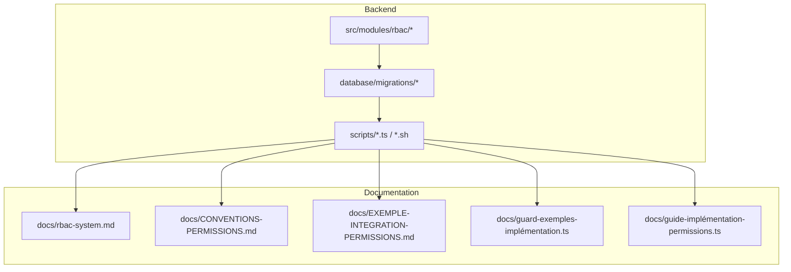
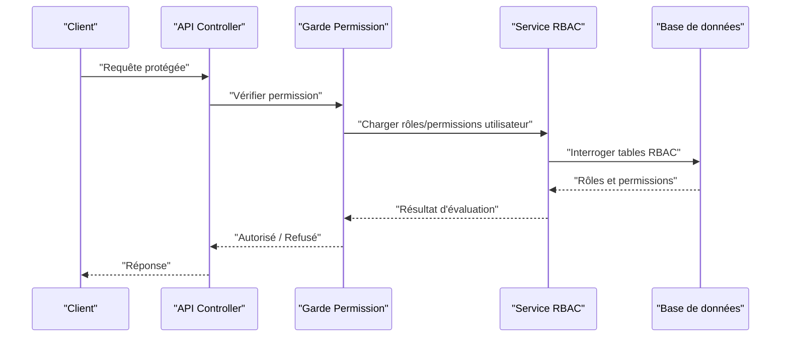
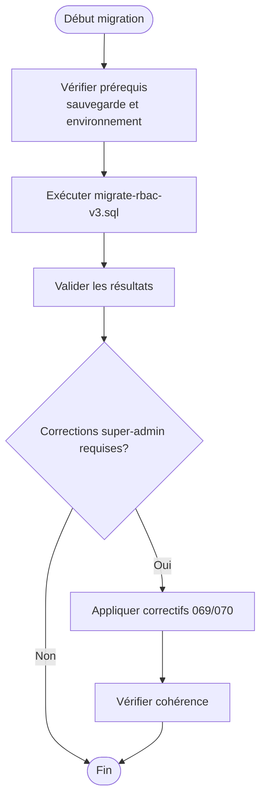
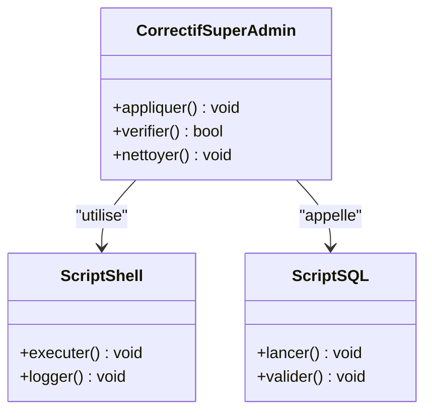
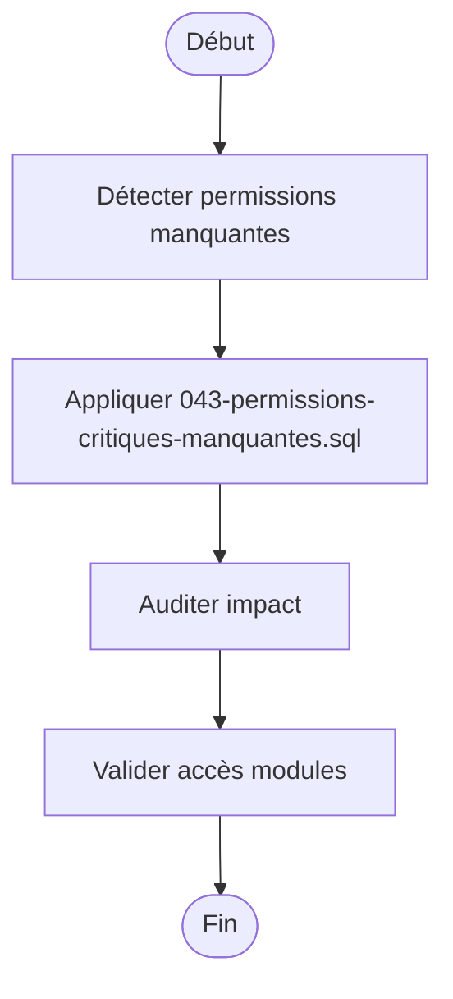
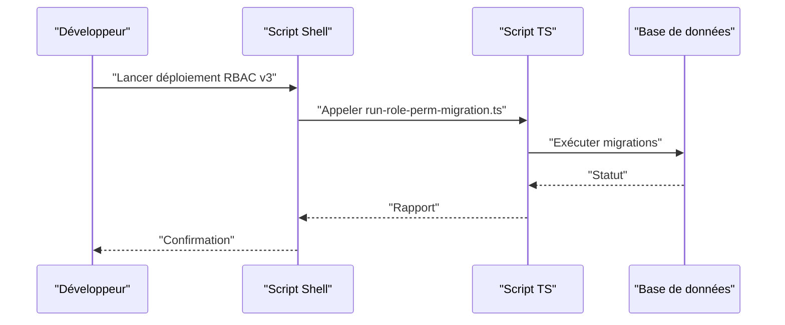
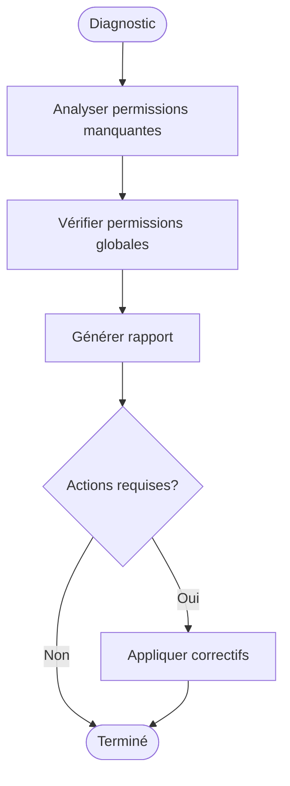
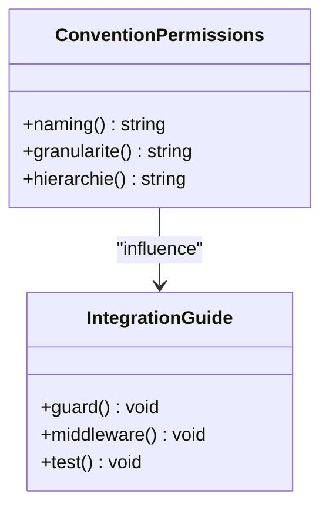
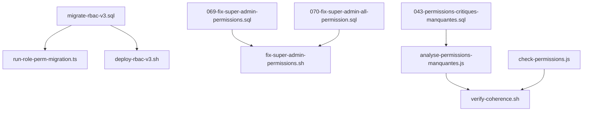

# Bonnes Pratiques et Migration

<cite>
**Fichiers référencés dans ce document**
- [migrate-rbac-v3.sql](file://backend/database/migrations/migrate-rbac-v3.sql)
- [069-fix-super-admin-permissions.sql](file://backend/database/migrations/069-fix-super-admin-permissions.sql)
- [070-fix-super-admin-all-permission.sql](file://backend/database/migrations/070-fix-super-admin-all-permission.sql)
- [043-permissions-critiques-manquantes.sql](file://backend/database/migrations/043-permissions-critiques-manquantes.sql)
- [run-role-perm-migration.ts](file://backend/scripts/run-role-perm-migration.ts)
- [fix-super-admin-permissions.sh](file://scripts/fix-super-admin-permissions.sh)
- [fix-super-admin-permissions-v2.sh](file://scripts/fix-super-admin-permissions-v2.sh)
- [fix-super-admin-permissions.sql](file://scripts/fix-super-admin-permissions.sql)
- [fix-super-admin-quick.sql](file://scripts/fix-super-admin-quick.sql)
- [analyse-permissions-manquantes.js](file://scripts/analyse-permissions-manquantes.js)
- [check-permissions.js](file://scripts/check-permissions.js)
- [GUIDE-DEPANNAGE-ACCES-RESEAU-LOCAL.md](file://docs/guides/GUIDE-DEPANNAGE-ACCES-RESEAU-LOCAL.md)
- [RAPPORT-FINAL-MIGRATION-V2.md](file://docs/rapports/RAPPORT-FINAL-MIGRATION-V2.md)
- [MIGRATION-RBAC-v3-MULTI-TENANT-STRICT.md](file://docs/migrations/MIGRATION-RBAC-v3-MULTI-TENANT-STRICT.md)
- [RBAC_COMPLETION.md](file://docs/RBAC_COMPLETION.md)
- [rbac-system.md](file://docs/rbac-system.md)
- [CONVENTIONS-PERMISSIONS.md](file://docs/CONVENTIONS-PERMISSIONS.md)
- [EXEMPLE-INTEGRATION-PERMISSIONS.md](file://docs/EXEMPLE-INTEGRATION-PERMISSIONS.md)
- [GUARD-EXEMPLES-IMPLÉMENTATION.ts](file://docs/guards-exemples-implémentation.ts)
- [guide-implémentation-permissions.ts](file://docs/guide-implémentation-permissions.ts)
- [PERMISSIONS-BASE-DONNEES.md](file://docs/PERMISSIONS-BASE-DONNEES.md)
- [ANALYSE-PERMISSIONS-SYNTHESE.md](file://docs/analyses/ANALYSE-PERMISSIONS-SYNTHESE.md)
- [RAPPORT-AUDIT-COHÉRENCE-NOUVELLES-FONCTIONNALITES.md](file://docs/rapports/RAPPORT-AUDIT-COHÉRENCE-NOUVELLES-FONCTIONNALITES.md)
- [verify-coherence.sh](file://scripts/verify-coherence.sh)
- [deploy-rbac-v3.sh](file://scripts/deploy-rbac-v3.sh)
</cite>

## Table des matières
1. [Introduction](#introduction)
2. [Structure du projet](#structure-du-projet)
3. [Composants clés](#composants-clés)
4. [Vue d'ensemble de l'architecture](#vue-densemble-de-larchitecture)
5. [Analyse détaillée des composants](#analyse-détaillée-des-composants)
6. [Analyse des dépendances](#analyse-des-dépendances)
7. [Considérations de performance](#considérations-de-performance)
8. [Guide de dépannage](#guide-de-dépannage)
9. [Conclusion](#conclusion)
10. [Annexes](#annexes)

## Introduction
Ce document présente les bonnes pratiques et le guide de migration vers RBAC v3 pour eLISAschool. Il couvre la conception des permissions, la hiérarchie des rôles, la maintenance du système, les procédures de migration, les scripts de correction automatique, les outils de diagnostic, ainsi que des scénarios complexes, des modèles réutilisables et des stratégies de test. L’objectif est de fournir une référence complète et accessible aux équipes techniques et fonctionnelles.

## Structure du projet
Le système RBAC est implémenté au sein du backend (TypeScript/NestJS), avec des migrations SQL et des scripts d’automatisation. Les fichiers suivants sont centraux :
- Migrations RBAC et corrections critiques
- Scripts de migration et de vérification
- Documentation de référence sur les conventions et l’intégration

[No sources needed since this diagram shows conceptual workflow, not actual code structure]

## Composants clés
- Migrations RBAC v3 et correctifs super-admin
- Scripts de migration et d’exécution
- Outils de diagnostic et de vérification
- Documentation de référence et guides d’intégration

Points essentiels :
- La migration principale RBAC v3 se trouve dans un fichier dédié.
- Des correctifs spécifiques existent pour le rôle super-admin et les permissions critiques manquantes.
- Des scripts TypeScript et shell automatisent les opérations et la vérification.
- La documentation fournit des conventions, des exemples d’intégration et des garde-fous.

**Section sources**
- [migrate-rbac-v3.sql](file://backend/database/migrations/migrate-rbac-v3.sql)
- [069-fix-super-admin-permissions.sql](file://backend/database/migrations/069-fix-super-admin-permissions.sql)
- [070-fix-super-admin-all-permission.sql](file://backend/database/migrations/070-fix-super-admin-all-permission.sql)
- [043-permissions-critiques-manquantes.sql](file://backend/database/migrations/043-permissions-critiques-manquantes.sql)
- [run-role-perm-migration.ts](file://backend/scripts/run-role-perm-migration.ts)
- [fix-super-admin-permissions.sh](file://scripts/fix-super-admin-permissions.sh)
- [fix-super-admin-permissions-v2.sh](file://scripts/fix-super-admin-permissions-v2.sh)
- [fix-super-admin-permissions.sql](file://scripts/fix-super-admin-permissions.sql)
- [fix-super-admin-quick.sql](file://scripts/fix-super-admin-quick.sql)
- [analyse-permissions-manquantes.js](file://scripts/analyse-permissions-manquantes.js)
- [check-permissions.js](file://scripts/check-permissions.js)
- [rbac-system.md](file://docs/rbac-system.md)
- [CONVENTIONS-PERMISSIONS.md](file://docs/CONVENTIONS-PERMISSIONS.md)
- [EXEMPLE-INTEGRATION-PERMISSIONS.md](file://docs/EXEMPLE-INTEGRATION-PERMISSIONS.md)
- [guards-exemples-implémentation.ts](file://docs/guards-exemples-implémentation.ts)
- [guide-implémentation-permissions.ts](file://docs/guide-implémentation-permissions.ts)

## Vue d'ensemble de l'architecture
Le flux typique de permission implique :
- L’authentification de l’utilisateur
- Le chargement des rôles et permissions associés
- L’évaluation de la permission via un garde ou middleware
- La réponse autorisée ou refusée

[No sources needed since this diagram shows conceptual workflow, not actual code structure]

## Analyse détaillée des composants

### Migration RBAC v3
La migration RBAC v3 introduit les changements structurels nécessaires à la nouvelle version du système de permissions. Elle doit être exécutée avant toute opération de mise à jour des permissions.

**Section sources**
- [migrate-rbac-v3.sql](file://backend/database/migrations/migrate-rbac-v3.sql)
- [069-fix-super-admin-permissions.sql](file://backend/database/migrations/069-fix-super-admin-permissions.sql)
- [070-fix-super-admin-all-permission.sql](file://backend/database/migrations/070-fix-super-admin-all-permission.sql)

### Correctifs Super Admin
Des correctifs spécifiques corrigent les permissions du rôle super-admin et s’assurent qu’il dispose de toutes les permissions requises.

**Section sources**
- [fix-super-admin-permissions.sh](file://scripts/fix-super-admin-permissions.sh)
- [fix-super-admin-permissions-v2.sh](file://scripts/fix-super-admin-permissions-v2.sh)
- [fix-super-admin-permissions.sql](file://scripts/fix-super-admin-permissions.sql)
- [fix-super-admin-quick.sql](file://scripts/fix-super-admin-quick.sql)
- [069-fix-super-admin-permissions.sql](file://backend/database/migrations/069-fix-super-admin-permissions.sql)
- [070-fix-super-admin-all-permission.sql](file://backend/database/migrations/070-fix-super-admin-all-permission.sql)

### Permissions critiques manquantes
Un jeu de migrations ajoute les permissions critiques qui manquent pour assurer la sécurité et la conformité des modules.

**Section sources**
- [043-permissions-critiques-manquantes.sql](file://backend/database/migrations/043-permissions-critiques-manquantes.sql)

### Scripts de migration et d’exécution
Les scripts TypeScript et shell permettent d’automatiser les migrations et les vérifications.

**Section sources**
- [run-role-perm-migration.ts](file://backend/scripts/run-role-perm-migration.ts)
- [deploy-rbac-v3.sh](file://scripts/deploy-rbac-v3.sh)

### Outils de diagnostic et de vérification
Des outils permettent de détecter les permissions manquantes et de vérifier la cohérence globale.

**Section sources**
- [analyse-permissions-manquantes.js](file://scripts/analyse-permissions-manquantes.js)
- [check-permissions.js](file://scripts/check-permissions.js)
- [verify-coherence.sh](file://scripts/verify-coherence.sh)

### Conventions et intégration
Les conventions de permissions et les exemples d’intégration guident la conception et l’implémentation cohérente des droits d’accès.

**Section sources**
- [CONVENTIONS-PERMISSIONS.md](file://docs/CONVENTIONS-PERMISSIONS.md)
- [EXEMPLE-INTEGRATION-PERMISSIONS.md](file://docs/EXEMPLE-INTEGRATION-PERMISSIONS.md)
- [guards-exemples-implémentation.ts](file://docs/guards-exemples-implémentation.ts)
- [guide-implémentation-permissions.ts](file://docs/guide-implémentation-permissions.ts)

## Analyse des dépendances
Les composants RBAC dépendent des migrations, des scripts et de la documentation. La figure suivante illustre ces relations.

**Section sources**
- [migrate-rbac-v3.sql](file://backend/database/migrations/migrate-rbac-v3.sql)
- [run-role-perm-migration.ts](file://backend/scripts/run-role-perm-migration.ts)
- [deploy-rbac-v3.sh](file://scripts/deploy-rbac-v3.sh)
- [069-fix-super-admin-permissions.sql](file://backend/database/migrations/069-fix-super-admin-permissions.sql)
- [070-fix-super-admin-all-permission.sql](file://backend/database/migrations/070-fix-super-admin-all-permission.sql)
- [fix-super-admin-permissions.sh](file://scripts/fix-super-admin-permissions.sh)
- [043-permissions-critiques-manquantes.sql](file://backend/database/migrations/043-permissions-critiques-manquantes.sql)
- [analyse-permissions-manquantes.js](file://scripts/analyse-permissions-manquantes.js)
- [check-permissions.js](file://scripts/check-permissions.js)
- [verify-coherence.sh](file://scripts/verify-coherence.sh)

## Considérations de performance
- Exécuter les migrations RBAC en dehors des heures de pointe.
- Utiliser les scripts de vérification pour éviter les rejeux inutiles.
- Indexer les colonnes fréquemment interrogées par les gardes de permission.
- Limiter les appels répétés à la base de données en mettant en cache les permissions quand c’est approprié.

[No sources needed since this section provides general guidance]

## Guide de dépannage
Problèmes courants et solutions :
- Erreurs d’accès réseau local pendant les tests : consulter le guide dédié.
- Permissions manquantes après migration : utiliser les outils d’analyse et appliquer les correctifs.
- Incohérences de permissions : exécuter verify-coherence.sh et corriger les écarts.

**Section sources**
- [GUIDE-DEPANNAGE-ACCES-RESEAU-LOCAL.md](file://docs/guides/GUIDE-DEPANNAGE-ACCES-RESEAU-LOCAL.md)
- [analyse-permissions-manquantes.js](file://scripts/analyse-permissions-manquantes.js)
- [verify-coherence.sh](file://scripts/verify-coherence.sh)

## Conclusion
La migration vers RBAC v3 nécessite une planification rigoureuse, l’exécution ordonnée des migrations et correctifs, et l’utilisation systématique des outils de diagnostic. Respecter les conventions de permissions et intégrer les gardes correctement garantit la cohérence et la sécurité du système.

[No sources needed since this section summarizes without analyzing specific files]

## Annexes
- Rapports et guides complémentaires :
  - [RAPPORT-FINAL-MIGRATION-V2.md](file://docs/rapports/RAPPORT-FINAL-MIGRATION-V2.md)
  - [MIGRATION-RBAC-v3-MULTI-TENANT-STRICT.md](file://docs/migrations/MIGRATION-RBAC-v3-MULTI-TENANT-STRICT.md)
  - [RBAC_COMPLETION.md](file://docs/RBAC_COMPLETION.md)
  - [rbac-system.md](file://docs/rbac-system.md)
  - [PERMISSIONS-BASE-DONNEES.md](file://docs/PERMISSIONS-BASE-DONNEES.md)
  - [ANALYSE-PERMISSIONS-SYNTHESE.md](file://docs/analyses/ANALYSE-PERMISSIONS-SYNTHESE.md)
  - [RAPPORT-AUDIT-COHÉRENCE-NOUVELLES-FONCTIONNALITES.md](file://docs/rapports/RAPPORT-AUDIT-COHÉRENCE-NOUVELLES-FONCTIONNALITES.md)

[No sources needed since this section lists references without analyzing specific files]