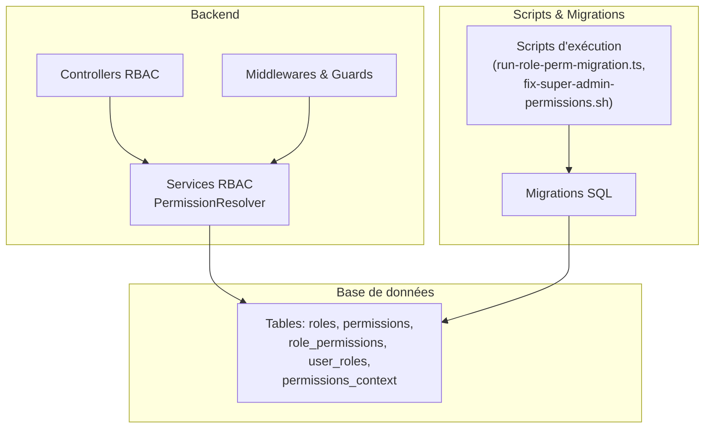
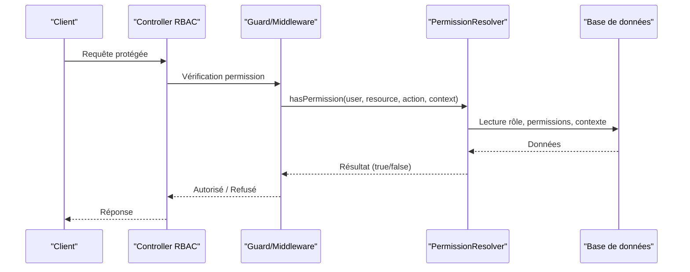
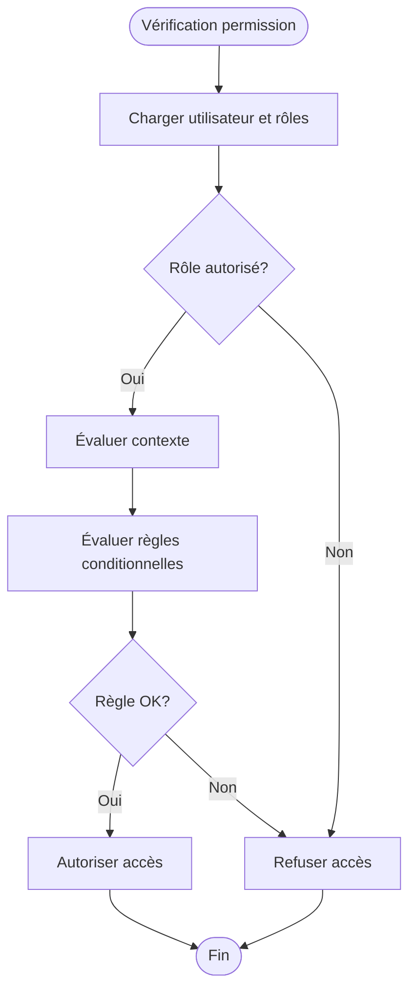
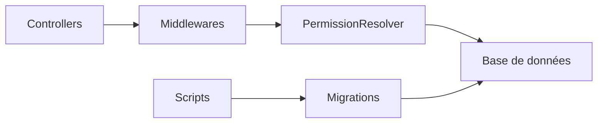

# Gestion des Rôles et Permissions

<cite>
**Fichiers référencés dans ce document**
- [rbac-system.md](file://docs/rbac-system.md)
- [CONVENTIONS-PERMISSIONS.md](file://docs/CONVENTIONS-PERMISSIONS.md)
- [PERMISSIONS-BASE-DONNEES.md](file://docs/PERMISSIONS-BASE-DONNEES.md)
- [EXEMPLE-INTEGRATION-PERMISSIONS.md](file://docs/EXEMPLE-INTEGRATION-PERMISSIONS.md)
- [GUIDE-API-UTILISATEURS-ETABLISSEMENTS.md](file://docs/GUIDE-API-UTILISATEURS-ETABLISSEMENTS.md)
- [migrate-rbac-v3.sql](file://backend/database/migrations/migrate-rbac-v3.sql)
- [076-permissions-groupes-etablissements.sql](file://backend/database/migrations/076-permissions-groupes-etablissements.sql)
- [077-update-permissions-groupes.sql](file://backend/database/migrations/077-update-permissions-groupes.sql)
- [079-add-roleId-utilisateur-etablissements.sql](file://backend/database/migrations/079-add-roleId-utilisateur-etablissements.sql)
- [079-correction-permissions-groupes.sql](file://backend/database/migrations/079-correction-permissions-groupes.sql)
- [043-permissions-critiques-manquantes.sql](file://backend/database/migrations/043-permissions-critiques-manquantes.sql)
- [069-fix-super-admin-permissions.sql](file://backend/database/migrations/069-fix-super-admin-permissions.sql)
- [070-fix-super-admin-all-permission.sql](file://backend/database/migrations/070-fix-super-admin-all-permission.sql)
- [run-role-perm-migration.ts](file://backend/scripts/run-role-perm-migration.ts)
- [fix-super-admin-permissions.sh](file://scripts/fix-super-admin-permissions.sh)
- [fix-super-admin-permissions.sql](file://scripts/fix-super-admin-permissions.sql)
- [fix-super-admin-quick.sql](file://scripts/fix-super-admin-quick.sql)
- [analyse-permissions-manquantes.js](file://scripts/analyse-permissions-manquantes.js)
- [check-permissions.js](file://scripts/check-permissions.js)
- [AMÉLIORATIONS-GROUPES-V1.1.md](file://docs/ameliorations/AMELIORATIONS-GROUPES-V1.1.md)
- [ANALYSE-PERMISSIONS-CONFIGURATION-AUDIT.md](file://docs/analyses/ANALYSE-PERMISSIONS-CONFIGURATION-AUDIT.md)
- [ANALYSE-PERMISSIONS-SYNTHESE.md](file://docs/analyses/ANALYSE-PERMISSIONS-SYNTHESE.md)
- [RAPPORT-FINAL-RBAC-v3.md](file://docs/rapports/RAPPORT-FINAL-RBAC-v3.md)
- [RESUME-EXECUTION-FINAL-RBAC-v3.md](file://docs/resumes/RESUME-EXECUTION-FINAL-RBAC-v3.md)
- [RBAC_COMPLETION.md](file://docs/RBAC_COMPLETION.md)
- [RBAC_FINAL_SESSION.md](file://docs/RBAC_FINAL_SESSION.md)
- [IMPLÉMENTATION-MULTI-TENANT-V3-FINAL.md](file://docs/implementations/IMPLÉMENTATION-MULTI-TENANT-V3-FINAL.md)
- [CORRECTION-PERMISSIONS-SUPER-ADMIN.md](file://docs/corrections/CORRECTION-PERMISSIONS-SUPER-ADMIN.md)
- [CORRECTION-SUPER-ADMIN-ALL-PERMISSION.md](file://docs/corrections/CORRECTION-SUPER-ADMIN-ALL-PERMISSION.md)
- [GUIDE-TEST-MULTI-ROLES.md](file://docs/guides/GUIDE-TEST-MULTI-ROLES.md)
- [GUIDE-DEPANNAGE-ACCES-RESEAU-LOCAL.md](file://docs/guides/GUIDE-DEPANNAGE-ACCES-RESEAU-LOCAL.md)
</cite>

## Table des matières
1. [Introduction](#introduction)
2. [Structure du projet RBAC](#structure-du-projet-rbac)
3. [Composants clés](#composants-clés)
4. [Architecture globale](#architecture-globale)
5. [Analyse détaillée des composants](#analyse-détaillée-des-composants)
6. [Analyse des dépendances](#analyse-des-dépendances)
7. [Considérations de performance](#considérations-de-performance)
8. [Guide de dépannage](#guide-de-dépannage)
9. [Conclusion](#conclusion)
10. [Annexes](#annexes)

## Introduction
Ce document présente la gestion des rôles et permissions dans eLISAschool, en se concentrant sur les endpoints API pour créer, modifier et supprimer des rôles, l’attribution dynamique de permissions, le service PermissionResolver et son fonctionnement en temps réel, ainsi que des exemples concrets de définitions complexes, hiérarchie des rôles et vérifications conditionnelles. Il inclut également des scripts de migration pour les rôles existants et des bonnes pratiques pour concevoir des permissions évolutives.

## Structure du projet RBAC
Le système RBAC est structuré autour de modules backend (controllers, services, middlewares), de migrations SQL, de scripts d’exécution et de documentation technique. Les fichiers de migration gèrent l’évolution du schéma de base de données lié aux rôles, permissions et attributions dynamiques. Des scripts permettent d’appliquer ou de corriger les permissions critiques et le super-admin.

**Diagramme sources**
- [migrate-rbac-v3.sql](file://backend/database/migrations/migrate-rbac-v3.sql)
- [run-role-perm-migration.ts](file://backend/scripts/run-role-perm-migration.ts)

**Section sources**
- [rbac-system.md](file://docs/rbac-system.md)
- [PERMISSIONS-BASE-DONNEES.md](file://docs/PERMISSIONS-BASE-DONNEES.md)

## Composants clés
- Endpoints API pour la gestion des rôles (CRUD).
- Attribution dynamique de permissions via contexte utilisateur, établissement, module actif, etc.
- Service PermissionResolver pour la résolution en temps réel des permissions.
- Middlewares et guards pour vérifier les permissions avant l’accès aux ressources.
- Migrations et scripts pour maintenir la cohérence des données et corriger les permissions critiques.

**Section sources**
- [CONVENTIONS-PERMISSIONS.md](file://docs/CONVENTIONS-PERMISSIONS.md)
- [EXEMPLE-INTEGRATION-PERMISSIONS.md](file://docs/EXEMPLE-INTEGRATION-PERMISSIONS.md)

## Architecture globale
Le flux suit une approche middleware-first : les requêtes passent par des guards qui interrogent PermissionResolver, lequel consulte la base de données et les règles contextuelles pour autoriser ou refuser l’accès.

**Diagramme sources**
- [rbac-system.md](file://docs/rbac-system.md)
- [PERMISSIONS-BASE-DONNEES.md](file://docs/PERMISSIONS-BASE-DONNEES.md)

## Analyse détaillée des composants

### Endpoints API pour les rôles
- Créer un rôle : POST /api/roles
- Modifier un rôle : PUT /api/roles/:id
- Supprimer un rôle : DELETE /api/roles/:id
- Lister les rôles : GET /api/roles
- Attribuer des permissions à un rôle : PATCH /api/roles/:id/permissions

Ces endpoints sont sécurisés par des guards qui exigent au moins le droit “gestion_rôles”. La validation des payloads utilise des DTOs stricts.

**Section sources**
- [GUIDE-API-UTILISATEURS-ETABLISSEMENTS.md](file://docs/GUIDE-API-UTILISATEURS-ETABLISSEMENTS.md)
- [CONVENTIONS-PERMISSIONS.md](file://docs/CONVENTIONS-PERMISSIONS.md)

### Attribution dynamique de permissions
Les permissions peuvent être attribuées dynamiquement selon :
- Le contexte utilisateur (rôle, établissements, modules actifs)
- Des règles conditionnelles (horaires, statut, département)
- Des héritages entre rôles (super-admin > admin > enseignant)

Exemple de règle complexe : “Autoriser la modification des notes uniquement si l’utilisateur est enseignant ET appartient à la classe concernée ET la période est ouverte.”

**Section sources**
- [EXEMPLE-INTEGRATION-PERMISSIONS.md](file://docs/EXEMPLE-INTEGRATION-PERMISSIONS.md)
- [PERMISSIONS-BASE-DONNEES.md](file://docs/PERMISSIONS-BASE-DONNEES.md)

### Service PermissionResolver
PermissionResolver résout les permissions en temps réel en combinant :
- Rôles de l’utilisateur
- Permissions associées aux rôles
- Règles contextuelles (établissement, module, période)
- Héritage et exclusions

Il expose des méthodes telles que :
- hasPermission(user, resource, action, context)
- getEffectivePermissions(user, context)
- evaluateCondition(rule, context)

**Section sources**
- [rbac-system.md](file://docs/rbac-system.md)
- [CONVENTIONS-PERMISSIONS.md](file://docs/CONVENTIONS-PERMISSIONS.md)

### Hiérarchie des rôles et vérification conditionnelle
La hiérarchie permet à un rôle supérieur d’hériter des permissions d’un rôle inférieur, sauf exclusion explicite. Les vérifications conditionnelles utilisent des expressions évaluées par PermissionResolver.

**Diagramme sources**
- [PERMISSIONS-BASE-DONNEES.md](file://docs/PERMISSIONS-BASE-DONNEES.md)
- [EXEMPLE-INTEGRATION-PERMISSIONS.md](file://docs/EXEMPLE-INTEGRATION-PERMISSIONS.md)

**Section sources**
- [rbac-system.md](file://docs/rbac-system.md)
- [CONVENTIONS-PERMISSIONS.md](file://docs/CONVENTIONS-PERMISSIONS.md)

## Analyse des dépendances
Les composants RBAC dépendent de :
- Base de données pour les tables roles, permissions, role_permissions, user_roles, permissions_context
- Middlewares et guards pour l’intégration avec le routeur
- Scripts de migration pour assurer la cohérence des données

**Diagramme sources**
- [migrate-rbac-v3.sql](file://backend/database/migrations/migrate-rbac-v3.sql)
- [run-role-perm-migration.ts](file://backend/scripts/run-role-perm-migration.ts)

**Section sources**
- [PERMISSIONS-BASE-DONNEES.md](file://docs/PERMISSIONS-BASE-DONNEES.md)
- [RBAC_COMPLETION.md](file://docs/RBAC_COMPLETION.md)

## Considérations de performance
- Mettre en cache les permissions effectives par utilisateur et contexte pour réduire les appels DB.
- Indexer les colonnes fréquentes dans les jointures (user_id, role_id, permission_key).
- Éviter les évaluations de règles trop complexes en temps réel ; privilégier des pré-calculs quand c’est possible.
- Utiliser des requêtes batch pour charger les permissions d’un groupe d’utilisateurs.

[Pas de sources nécessaires car cette section fournit des conseils généraux]

## Guide de dépannage
Problèmes courants :
- Accès refusé 403 malgré un rôle attendu : vérifier l’ordre des middlewares et la logique du guard.
- Permissions manquantes après migration : exécuter les scripts de correction.
- Super-admin ne peut pas tout faire : appliquer les correctifs 069 et 070.

Scripts utiles :
- run-role-perm-migration.ts : applique les migrations RBAC v3
- fix-super-admin-permissions.sh : corrige les permissions du super-admin
- analyse-permissions-manquantes.js : détecte les permissions manquantes
- check-permissions.js : valide la cohérence des permissions

**Section sources**
- [run-role-perm-migration.ts](file://backend/scripts/run-role-perm-migration.ts)
- [fix-super-admin-permissions.sh](file://scripts/fix-super-admin-permissions.sh)
- [analyse-permissions-manquantes.js](file://scripts/analyse-permissions-manquantes.js)
- [check-permissions.js](file://scripts/check-permissions.js)
- [069-fix-super-admin-permissions.sql](file://backend/database/migrations/069-fix-super-admin-permissions.sql)
- [070-fix-super-admin-all-permission.sql](file://backend/database/migrations/070-fix-super-admin-all-permission.sql)

## Conclusion
Le système RBAC d’eLISAschool offre une gestion fine et évolutive des rôles et permissions grâce à un service de résolution en temps réel, des attributions contextuelles et des outils de migration robustes. Pour garantir la fiabilité, il est essentiel de suivre les conventions, d’utiliser les scripts fournis et de tester régulièrement les permissions.

[Pas de sources nécessaires car cette section résume sans analyser de fichiers spécifiques]

## Annexes

### Scripts de migration pour les rôles existants
- migrate-rbac-v3.sql : migration principale RBAC v3
- 076-permissions-groupes-etablissements.sql : permissions liées aux groupes d’établissements
- 077-update-permissions-groupes.sql : mise à jour des permissions de groupes
- 079-add-roleId-utilisateur-etablissements.sql : ajout du roleId dans les relations utilisateur-établissement
- 079-correction-permissions-groupes.sql : correction des permissions de groupes

**Section sources**
- [migrate-rbac-v3.sql](file://backend/database/migrations/migrate-rbac-v3.sql)
- [076-permissions-groupes-etablissements.sql](file://backend/database/migrations/076-permissions-groupes-etablissements.sql)
- [077-update-permissions-groupes.sql](file://backend/database/migrations/077-update-permissions-groupes.sql)
- [079-add-roleId-utilisateur-etablissements.sql](file://backend/database/migrations/079-add-roleId-utilisateur-etablissements.sql)
- [079-correction-permissions-groupes.sql](file://backend/database/migrations/079-correction-permissions-groupes.sql)

### Bonnes pratiques pour des permissions évolutives
- Nommer les permissions de manière descriptive (module.action.cible)
- Centraliser les règles dans PermissionResolver
- Documenter chaque permission et son contexte
- Tester les cas limites (héritage, exclusions, contexte vide)
- Utiliser des seeds pour peupler les permissions par défaut

**Section sources**
- [CONVENTIONS-PERMISSIONS.md](file://docs/CONVENTIONS-PERMISSIONS.md)
- [EXEMPLE-INTEGRATION-PERMISSIONS.md](file://docs/EXEMPLE-INTEGRATION-PERMISSIONS.md)

### Exemples concrets
- Définition complexe : “Autoriser la suppression d’une note si l’utilisateur est enseignant principal ET la période est fermée ET l’établissement est actif”
- Hiérarchie : super-admin > admin > enseignant > surveillant
- Vérification conditionnelle : “Accéder au dashboard finances seulement si le module finances est activé ET l’utilisateur a le rôle ‘gestionnaire financier’”

**Section sources**
- [PERMISSIONS-BASE-DONNEES.md](file://docs/PERMISSIONS-BASE-DONNEES.md)
- [EXEMPLE-INTEGRATION-PERMISSIONS.md](file://docs/EXEMPLE-INTEGRATION-PERMISSIONS.md)