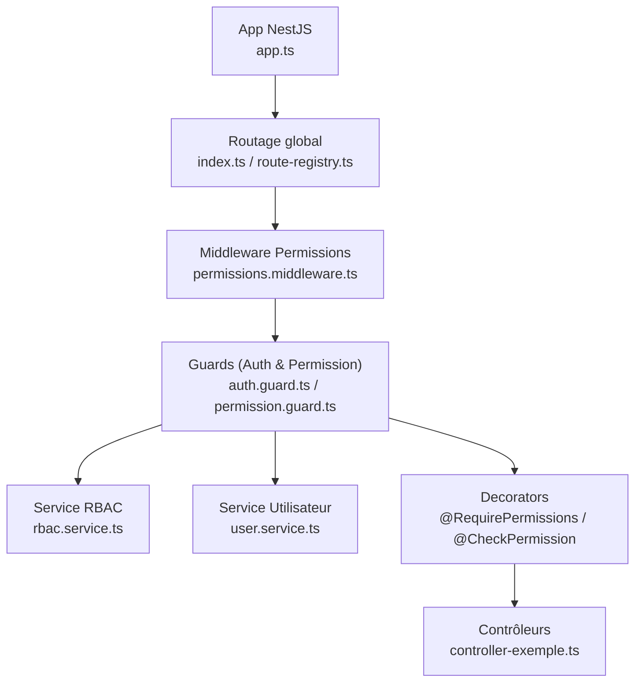
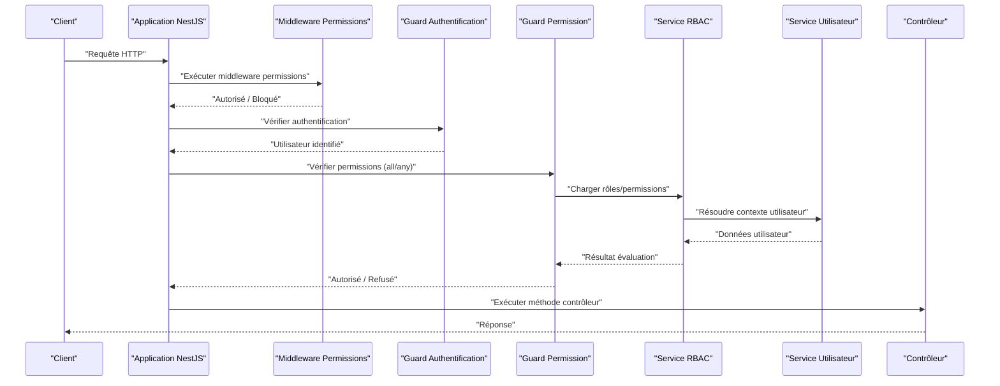
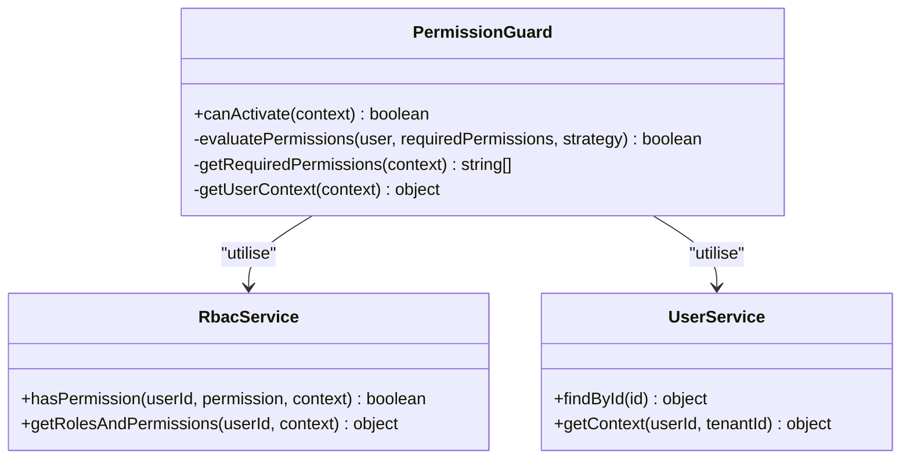
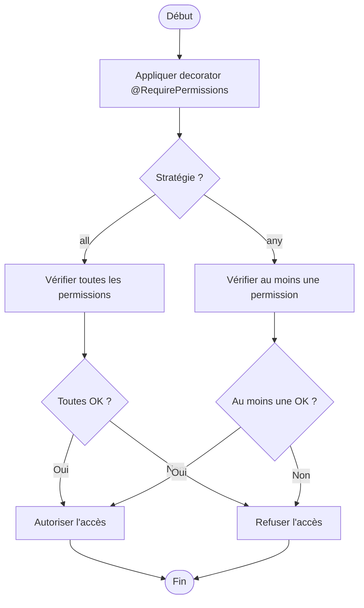
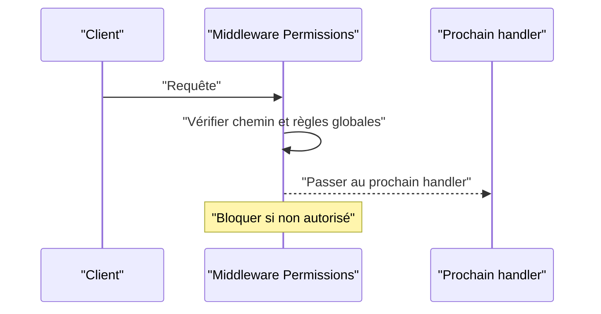
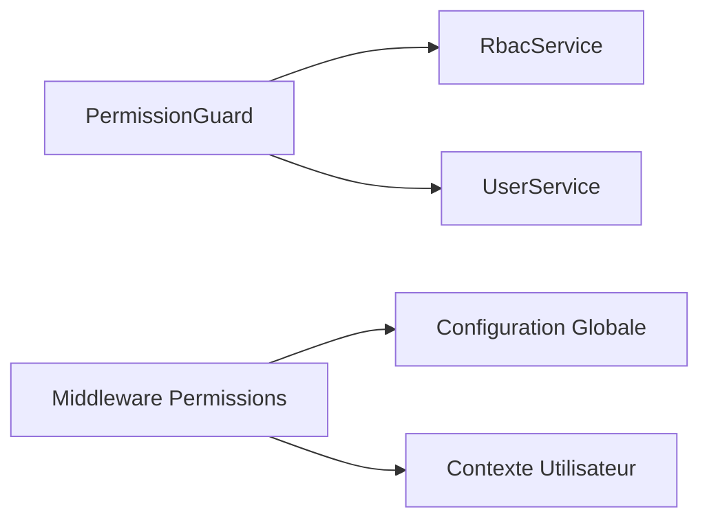

# Guards et Middleware de Vérification

<cite>
**Fichiers référencés dans ce document**
- [app.ts](file://backend/src/app.ts)
- [route-registry.ts](file://backend/src/routes/route-registry.ts)
- [index.ts](file://backend/src/index.ts)
- [auth.guard.ts](file://backend/src/modules/auth/guards/auth.guard.ts)
- [permission.guard.ts](file://backend/src/modules/auth/guards/permission.guard.ts)
- [require-permissions.decorator.ts](file://backend/src/modules/auth/decorators/require-permissions.decorator.ts)
- [check-permission.decorator.ts](file://backend/src/modules/auth/decorators/check-permission.decorator.ts)
- [permissions.middleware.ts](file://backend/src/common/middlewares/permissions.middleware.ts)
- [rbac.service.ts](file://backend/src/modules/rbac/services/rbac.service.ts)
- [user.service.ts](file://backend/src/modules/utilisateurs/services/user.service.ts)
- [controller-exemple.ts](file://backend/src/modules/exemples/controllers/controller-exemple.ts)
</cite>

## Table des matières
1. [Introduction](#introduction)
2. [Structure du projet](#structure-du-projet)
3. [Composants clés](#composants-clés)
4. [Vue d’ensemble de l’architecture](#vue-densemble-de-larchitecture)
5. [Analyse détaillée des composants](#analyse-detallee-des-composants)
6. [Analyse des dépendances](#analyse-des-dependances)
7. [Considérations de performance](#considerations-de-performance)
8. [Guide de dépannage](#guide-de-depannage)
9. [Conclusion](#conclusion)
10. [Annexes](#annexes)

## Introduction
Ce document explique en détail le système de guards et middleware de vérification des permissions dans eLISAschool, basé sur NestJS. Il couvre le PermissionGuard, son intégration au niveau des routes, les decorators @RequirePermissions et @CheckPermission, ainsi que le middleware de permission exécuté avant la résolution des contrôleurs. Vous y trouverez également des exemples concrets d’utilisation, des stratégies de configuration des chemins protégés, des comportements all vs any pour l’évaluation des permissions, et un guide de débogage pour les problèmes courants d’autorisation.

## Structure du projet
Le système d’autorisation est principalement implémenté dans les modules suivants :
- Guards : guards/auth.guard.ts, guards/permission.guard.ts
- Decorators : decorators/require-permissions.decorator.ts, decorators/check-permission.decorator.ts
- Middleware : common/middlewares/permissions.middleware.ts
- Services RBAC et Utilisateurs : rbac.service.ts, user.service.ts
- Configuration globale et routage : app.ts, index.ts, routes/route-registry.ts
- Exemples de contrôleurs : controller-exemple.ts

**Sources du diagramme**
- [app.ts](file://backend/src/app.ts)
- [index.ts](file://backend/src/index.ts)
- [route-registry.ts](file://backend/src/routes/route-registry.ts)
- [permissions.middleware.ts](file://backend/src/common/middlewares/permissions.middleware.ts)
- [auth.guard.ts](file://backend/src/modules/auth/guards/auth.guard.ts)
- [permission.guard.ts](file://backend/src/modules/auth/guards/permission.guard.ts)
- [rbac.service.ts](file://backend/src/modules/rbac/services/rbac.service.ts)
- [user.service.ts](file://backend/src/modules/utilisateurs/services/user.service.ts)
- [require-permissions.decorator.ts](file://backend/src/modules/auth/decorators/require-permissions.decorator.ts)
- [check-permission.decorator.ts](file://backend/src/modules/auth/decorators/check-permission.decorator.ts)
- [controller-exemple.ts](file://backend/src/modules/exemples/controllers/controller-exemple.ts)

**Sources de la section**
- [app.ts](file://backend/src/app.ts)
- [index.ts](file://backend/src/index.ts)
- [route-registry.ts](file://backend/src/routes/route-registry.ts)

## Composants clés
- PermissionGuard : Guard NestJS qui valide les permissions requises par une route ou un contrôleur. Il supporte deux stratégies :
  - all : toutes les permissions spécifiées doivent être accordées.
  - any : au moins une des permissions spécifiées doit être accordée.
- Decorators :
  - @RequirePermissions : applique le guard avec stratégie all ou any selon les paramètres.
  - @CheckPermission : permet une vérification conditionnelle dans le corps de la méthode (retourne un booléen ou lance une exception).
- Middleware de permissions : s’exécute au niveau des routes, avant les guards, pour vérifier rapidement l’accès à certains chemins sensibles et appliquer des règles globales.
- Services RBAC et Utilisateurs : fournissent les données nécessaires pour évaluer les permissions (rôles, groupes, permissions attribuées, contexte multi-tenant).

**Sources de la section**
- [permission.guard.ts](file://backend/src/modules/auth/guards/permission.guard.ts)
- [require-permissions.decorator.ts](file://backend/src/modules/auth/decorators/require-permissions.decorator.ts)
- [check-permission.decorator.ts](file://backend/src/modules/auth/decorators/check-permission.decorator.ts)
- [permissions.middleware.ts](file://backend/src/common/middlewares/permissions.middleware.ts)
- [rbac.service.ts](file://backend/src/modules/rbac/services/rbac.service.ts)
- [user.service.ts](file://backend/src/modules/utilisateurs/services/user.service.ts)

## Vue d’ensemble de l’architecture
Le flux d’autorisation suit l’ordre suivant :
1. Requête HTTP entrante.
2. Middleware de permissions (vérifications rapides, règles globales).
3. Guards (Authentification puis Permission).
4. Résolution du contrôleur et exécution de la méthode.
5. Retour de réponse ou erreur d’autorisation.

**Sources du diagramme**
- [permissions.middleware.ts](file://backend/src/common/middlewares/permissions.middleware.ts)
- [auth.guard.ts](file://backend/src/modules/auth/guards/auth.guard.ts)
- [permission.guard.ts](file://backend/src/modules/auth/guards/permission.guard.ts)
- [rbac.service.ts](file://backend/src/modules/rbac/services/rbac.service.ts)
- [user.service.ts](file://backend/src/modules/utilisateurs/services/user.service.ts)
- [controller-exemple.ts](file://backend/src/modules/exemples/controllers/controller-exemple.ts)

## Analyse détaillée des composants

### PermissionGuard
Le PermissionGuard implémente la logique de vérification des permissions. Il lit les métadonnées définies par les decorators et évalue si l’utilisateur dispose des droits requis selon la stratégie choisie.

- Stratégies :
  - all : toutes les permissions doivent être présentes.
  - any : au moins une permission suffit.
- Intégration NestJS :
  - Implémente l’interface CanActivate.
  - Injecte les services RBAC et Utilisateur.
  - Interagit avec le contexte de requête pour extraire l’identité et le contexte multi-tenant.

**Sources du diagramme**
- [permission.guard.ts](file://backend/src/modules/auth/guards/permission.guard.ts)
- [rbac.service.ts](file://backend/src/modules/rbac/services/rbac.service.ts)
- [user.service.ts](file://backend/src/modules/utilisateurs/services/user.service.ts)

**Sources de la section**
- [permission.guard.ts](file://backend/src/modules/auth/guards/permission.guard.ts)

### Decorators @RequirePermissions et @CheckPermission
- @RequirePermissions :
  - Applique le PermissionGuard avec stratégie all ou any.
  - Peut être utilisé au niveau de la classe ou de la méthode.
- @CheckPermission :
  - Permet une vérification conditionnelle dans le corps de la méthode.
  - Retourne un booléen ou lance une exception si la permission est manquante.

**Sources du diagramme**
- [require-permissions.decorator.ts](file://backend/src/modules/auth/decorators/require-permissions.decorator.ts)
- [check-permission.decorator.ts](file://backend/src/modules/auth/decorators/check-permission.decorator.ts)
- [permission.guard.ts](file://backend/src/modules/auth/guards/permission.guard.ts)

**Sources de la section**
- [require-permissions.decorator.ts](file://backend/src/modules/auth/decorators/require-permissions.decorator.ts)
- [check-permission.decorator.ts](file://backend/src/modules/auth/decorators/check-permission.decorator.ts)

### Middleware de permissions
Le middleware s’exécute au niveau des routes, avant les guards. Il peut :
- Bloquer rapidement certains chemins sensibles.
- Appliquer des règles globales (par exemple, désactiver l’accès à certaines fonctionnalités selon la configuration).
- Ajouter des informations de contexte à la requête.

**Sources du diagramme**
- [permissions.middleware.ts](file://backend/src/common/middlewares/permissions.middleware.ts)

**Sources de la section**
- [permissions.middleware.ts](file://backend/src/common/middlewares/permissions.middleware.ts)

### Utilisation dans les contrôleurs
Les decorators peuvent être appliqués aux méthodes ou classes pour protéger les endpoints. Voici un exemple conceptuel :

- Protection d’une méthode GET nécessitant la permission "gestion.eleves.lire" avec stratégie any :
  - @RequirePermissions(['gestion.eleves.lire'], 'any')
- Protection d’une méthode POST nécessitant plusieurs permissions avec stratégie all :
  - @RequirePermissions(['gestion.eleves.ecrire', 'gestion.eleves.valider'], 'all')
- Vérification conditionnelle dans le corps de la méthode :
  - const allowed = @CheckPermission('gestion.eleves.supprimer'); if (!allowed) throw new ForbiddenException();

**Sources de la section**
- [controller-exemple.ts](file://backend/src/modules/exemples/controllers/controller-exemple.ts)
- [require-permissions.decorator.ts](file://backend/src/modules/auth/decorators/require-permissions.decorator.ts)
- [check-permission.decorator.ts](file://backend/src/modules/auth/decorators/check-permission.decorator.ts)

### Configuration des chemins protégés
La configuration des chemins protégés se fait généralement via :
- Le routage global (index.ts, route-registry.ts) pour appliquer le middleware à des préfixes de routes.
- Les decorators au niveau des contrôleurs ou méthodes pour une granularité fine.
- Des fichiers de configuration centralisés pour lister les chemins sensibles et leurs règles.

**Sources de la section**
- [index.ts](file://backend/src/index.ts)
- [route-registry.ts](file://backend/src/routes/route-registry.ts)
- [permissions.middleware.ts](file://backend/src/common/middlewares/permissions.middleware.ts)

### Stratégies de fallback
En cas d’échec de l’évaluation des permissions :
- Retourner une erreur 403 Forbidden.
- Rediriger vers une page d’erreur ou de connexion.
- Logger l’échec pour le débogage.
- Proposer une action alternative (par exemple, afficher un message d’aide).

**Sources de la section**
- [permission.guard.ts](file://backend/src/modules/auth/guards/permission.guard.ts)
- [permissions.middleware.ts](file://backend/src/common/middlewares/permissions.middleware.ts)

## Analyse des dépendances
Le PermissionGuard dépend des services RBAC et Utilisateur pour évaluer les permissions. Le middleware de permissions peut dépendre de la configuration globale et des services de contexte.

**Sources du diagramme**
- [permission.guard.ts](file://backend/src/modules/auth/guards/permission.guard.ts)
- [rbac.service.ts](file://backend/src/modules/rbac/services/rbac.service.ts)
- [user.service.ts](file://backend/src/modules/utilisateurs/services/user.service.ts)
- [permissions.middleware.ts](file://backend/src/common/middlewares/permissions.middleware.ts)

**Sources de la section**
- [permission.guard.ts](file://backend/src/modules/auth/guards/permission.guard.ts)
- [rbac.service.ts](file://backend/src/modules/rbac/services/rbac.service.ts)
- [user.service.ts](file://backend/src/modules/utilisateurs/services/user.service.ts)
- [permissions.middleware.ts](file://backend/src/common/middlewares/permissions.middleware.ts)

## Considérations de performance
- Minimiser les appels à la base de données dans le guard en utilisant des caches (par exemple, Redis) pour les permissions fréquentes.
- Regrouper les vérifications de permissions pour éviter les requêtes multiples.
- Utiliser le middleware pour bloquer rapidement les requêtes non autorisées sans charger les guards complets.
- Éviter les calculs complexes dans le guard ; privilégier des fonctions simples et rapides.

[Pas de sources nécessaires car cette section fournit des conseils généraux]

## Guide de dépannage
Problèmes courants et solutions :
- Erreur 403 Forbidden :
  - Vérifier que l’utilisateur a bien les permissions requises.
  - Confirmer que la stratégie (all/any) est correctement configurée.
  - Examiner les logs du service RBAC pour comprendre l’échec.
- Permission non reconnue :
  - S’assurer que la permission existe dans la base de données.
  - Vérifier que le rôle de l’utilisateur inclut la permission.
- Middleware bloque l’accès :
  - Examiner les règles globales dans le middleware.
  - Vérifier la configuration des chemins protégés.
- Contexte multi-tenant incorrect :
  - Confirmer que le tenantId est correctement extrait de la requête.
  - Vérifier que l’utilisateur appartient au bon établissement.

**Sources de la section**
- [permission.guard.ts](file://backend/src/modules/auth/guards/permission.guard.ts)
- [rbac.service.ts](file://backend/src/modules/rbac/services/rbac.service.ts)
- [permissions.middleware.ts](file://backend/src/common/middlewares/permissions.middleware.ts)

## Conclusion
Le système de guards et middleware de eLISAschool offre une approche robuste et flexible pour la gestion des permissions. En combinant le PermissionGuard, les decorators @RequirePermissions et @CheckPermission, et le middleware de permissions, il est possible de protéger finement les ressources tout en maintenant de bonnes performances. La configuration des chemins protégés et les stratégies de fallback permettent d’adapter le comportement aux besoins spécifiques de chaque application.

[Pas de sources nécessaires car cette section résume sans analyser de fichiers spécifiques]

## Annexes
- Exemples d’utilisation des decorators dans les contrôleurs.
- Liste des permissions critiques et leur signification.
- Scripts de test pour valider les permissions.

[Pas de sources nécessaires car cette section est informative et ne contient pas d’analyse de code spécifique]