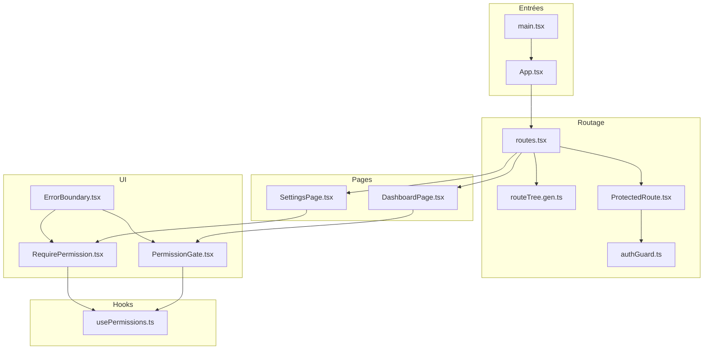
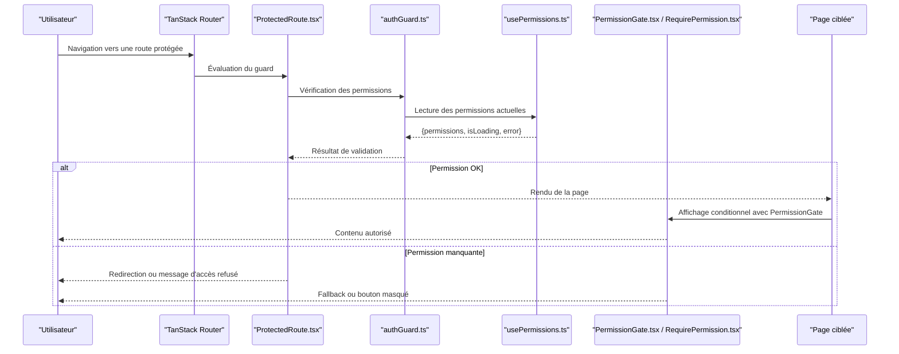
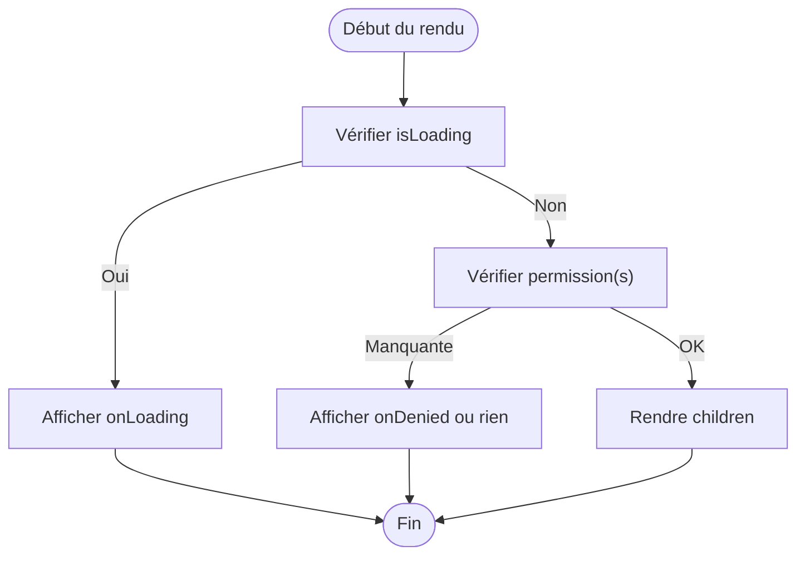
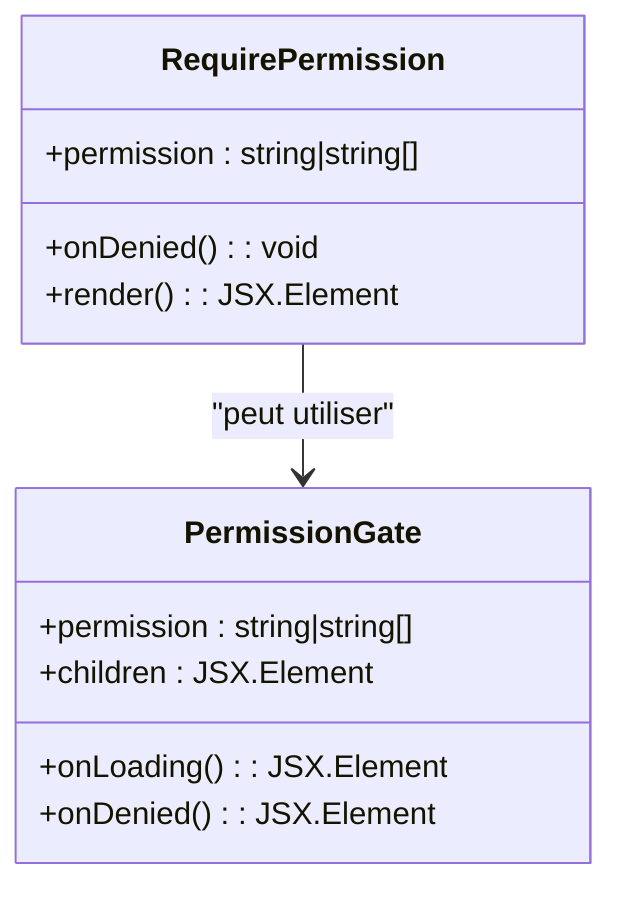
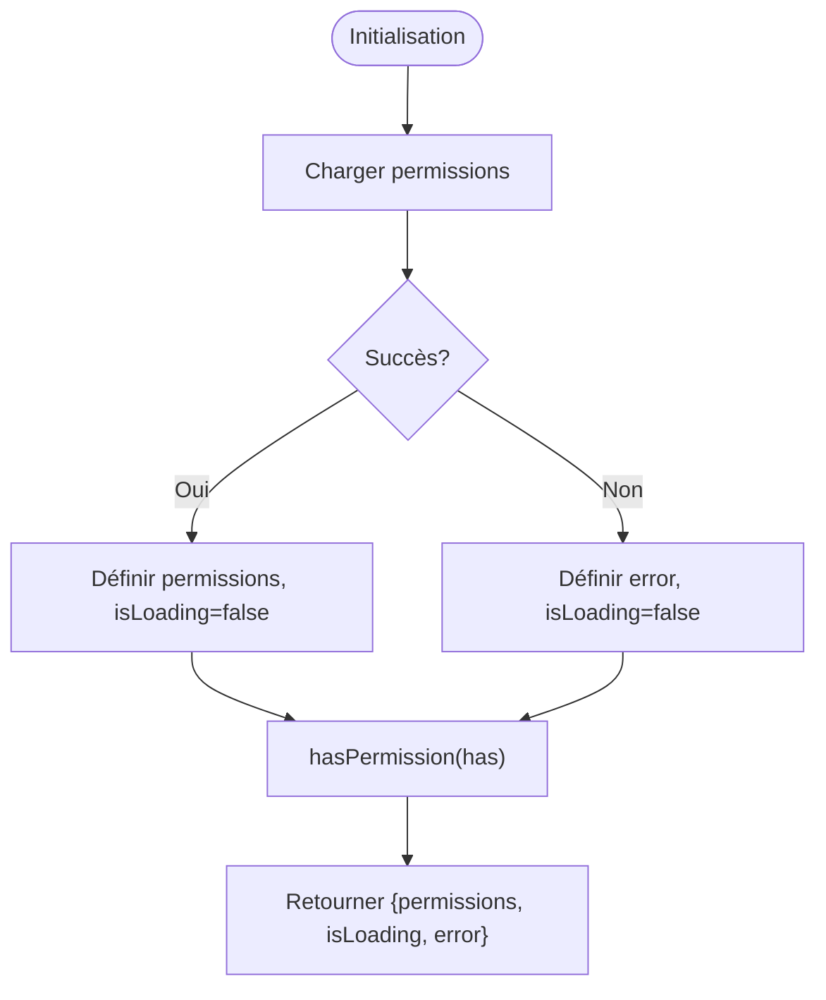
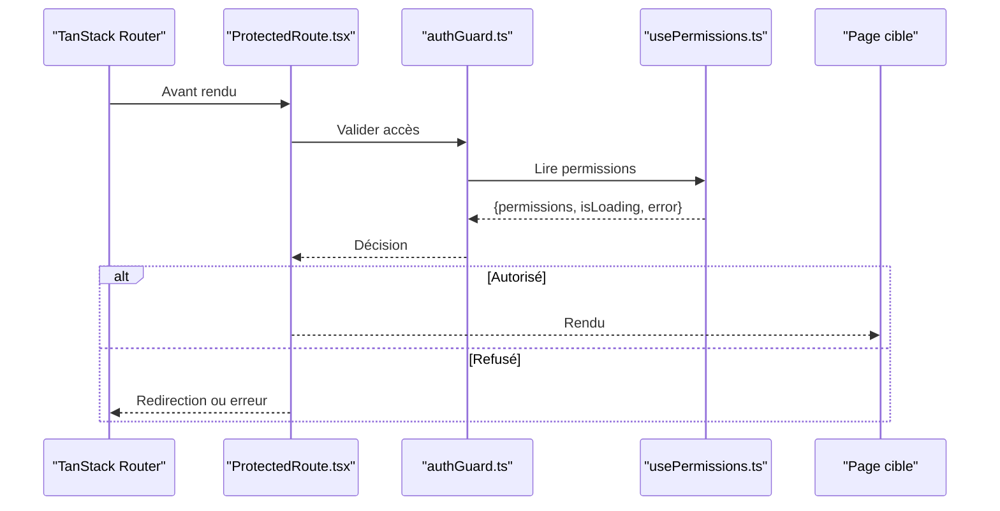
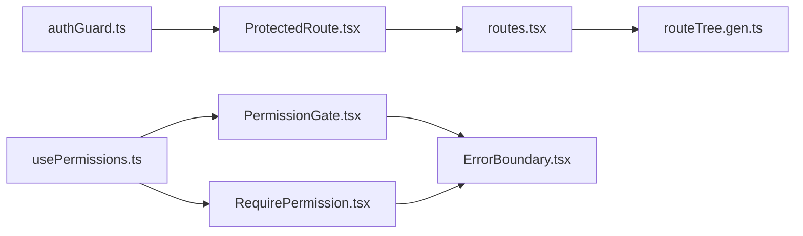

# Intégration Frontend et Composants UI

<cite>
**Fichiers référencés dans ce document**
- [App.tsx](file://frontend/src/App.tsx)
- [main.tsx](file://frontend/src/main.tsx)
- [routeTree.gen.ts](file://frontend/src/routeTree.gen.ts)
- [PermissionGate.tsx](file://frontend/src/components/ui/PermissionGate.tsx)
- [RequirePermission.tsx](file://frontend/src/components/ui/RequirePermission.tsx)
- [usePermissions.ts](file://frontend/src/hooks/usePermissions.ts)
- [authGuard.ts](file://frontend/src/lib/authGuard.ts)
- [routes.tsx](file://frontend/src/routes/routes.tsx)
- [DashboardPage.tsx](file://frontend/src/features/dashboard/pages/DashboardPage.tsx)
- [SettingsPage.tsx](file://frontend/src/features/settings/pages/SettingsPage.tsx)
- [ProtectedRoute.tsx](file://frontend/src/components/guards/ProtectedRoute.tsx)
- [ErrorBoundary.tsx](file://frontend/src/components/ui/ErrorBoundary.tsx)
</cite>

## Table des matières
1. [Introduction](#introduction)
2. [Structure du projet](#structure-du-projet)
3. [Composants principaux](#composants-principaux)
4. [Architecture globale](#architecture-globale)
5. [Analyse détaillée des composants](#analyse-détaillée-des-composants)
6. [Analyse des dépendances](#analyse-des-dépendances)
7. [Considérations de performance](#considérations-de-performance)
8. [Guide de dépannage](#guide-de-dépannage)
9. [Conclusion](#conclusion)
10. [Annexes](#annexes)

## Introduction
Ce document décrit l'intégration RBAC (Role-Based Access Control) dans le frontend React d'eLISAschool. Il se concentre sur les composants PermissionGate et RequirePermission, le hook usePermissions pour la logique métier côté client, les guards TanStack Router, et l'affichage conditionnel des éléments d'interface. Vous y trouverez des exemples concrets de protection de routes, masquage de boutons, gestion des erreurs d'autorisation, ainsi que des meilleures pratiques UX pour les vérifications de permissions.

## Structure du projet
Le frontend est organisé en modules fonctionnels (features), des hooks réutilisables, des composants UI, et une configuration de routage TanStack. Les fichiers clés liés à RBAC sont :
- Hooks: usePermissions.ts
- Composants UI: PermissionGate.tsx, RequirePermission.tsx
- Guards: ProtectedRoute.tsx, authGuard.ts
- Routes: routes.tsx, routeTree.gen.ts
- Pages: DashboardPage.tsx, SettingsPage.tsx
- Gestion d'erreurs: ErrorBoundary.tsx
- Entrées: App.tsx, main.tsx

**Sources du diagramme**
- [App.tsx](file://frontend/src/App.tsx)
- [main.tsx](file://frontend/src/main.tsx)
- [routes.tsx](file://frontend/src/routes/routes.tsx)
- [routeTree.gen.ts](file://frontend/src/routeTree.gen.ts)
- [ProtectedRoute.tsx](file://frontend/src/components/guards/ProtectedRoute.tsx)
- [authGuard.ts](file://frontend/src/lib/authGuard.ts)
- [usePermissions.ts](file://frontend/src/hooks/usePermissions.ts)
- [PermissionGate.tsx](file://frontend/src/components/ui/PermissionGate.tsx)
- [RequirePermission.tsx](file://frontend/src/components/ui/RequirePermission.tsx)
- [ErrorBoundary.tsx](file://frontend/src/components/ui/ErrorBoundary.tsx)
- [DashboardPage.tsx](file://frontend/src/features/dashboard/pages/DashboardPage.tsx)
- [SettingsPage.tsx](file://frontend/src/features/settings/pages/SettingsPage.tsx)

**Sources de section**
- [App.tsx](file://frontend/src/App.tsx)
- [main.tsx](file://frontend/src/main.tsx)
- [routes.tsx](file://frontend/src/routes/routes.tsx)
- [routeTree.gen.ts](file://frontend/src/routeTree.gen.ts)

## Composants principaux
- PermissionGate: Composant qui rend ses enfants uniquement si l'utilisateur possède la permission requise. Il gère les états de chargement et d'erreur, et propose un fallback optionnel.
- RequirePermission: Hook ou composant qui force une redirection ou un rendu alternatif quand la permission est manquante. Souvent utilisé pour protéger des pages entières.
- usePermissions: Hook qui expose les permissions actuelles, permet de vérifier des permissions simples ou multiples, et retourne un état de chargement et d'erreur.
- ProtectedRoute: Guard TanStack Router qui applique des règles d'accès avant de rendre la page.
- authGuard: Utilitaire centralisé pour valider les permissions et gérer les réponses d'erreur.

**Sources de section**
- [PermissionGate.tsx](file://frontend/src/components/ui/PermissionGate.tsx)
- [RequirePermission.tsx](file://frontend/src/components/ui/RequirePermission.tsx)
- [usePermissions.ts](file://frontend/src/hooks/usePermissions.ts)
- [ProtectedRoute.tsx](file://frontend/src/components/guards/ProtectedRoute.tsx)
- [authGuard.ts](file://frontend/src/lib/authGuard.ts)

## Architecture globale
Le flux RBAC combine hooks, composants et guards pour garantir que seuls les utilisateurs autorisés accèdent aux ressources. Le hook usePermissions interroge l'état utilisateur et les permissions, tandis que PermissionGate et RequirePermission appliquent ces règles au niveau UI. ProtectedRoute et authGuard protègent les routes au niveau router.

**Sources du diagramme**
- [ProtectedRoute.tsx](file://frontend/src/components/guards/ProtectedRoute.tsx)
- [authGuard.ts](file://frontend/src/lib/authGuard.ts)
- [usePermissions.ts](file://frontend/src/hooks/usePermissions.ts)
- [PermissionGate.tsx](file://frontend/src/components/ui/PermissionGate.tsx)
- [RequirePermission.tsx](file://frontend/src/components/ui/RequirePermission.tsx)

## Analyse détaillée des composants

### PermissionGate
- Responsabilité: Rendre les enfants seulement si la permission est valide.
- Propriétés typiques: permission(s), onLoading, onDenied, children.
- Comportement:
  - Si isLoading: affiche un indicateur de chargement via onLoading.
  - Si denied: affiche un fallback via onDenied ou ne rend rien.
  - Sinon: rend children.
- Bonnes pratiques:
  - Toujours fournir un onLoading clair pour éviter les sauts d'interface.
  - Utiliser onDenied pour afficher un message explicite ou rediriger discrètement.
  - Éviter de charger des données sensibles dans children si la permission n'est pas encore résolue.

**Sources du diagramme**
- [PermissionGate.tsx](file://frontend/src/components/ui/PermissionGate.tsx)

**Sources de section**
- [PermissionGate.tsx](file://frontend/src/components/ui/PermissionGate.tsx)

### RequirePermission
- Responsabilité: Forcer une action (redirection, erreur, ou rendu alternatif) quand la permission est absente.
- Usage:
  - Au niveau page: si la permission est manquante, redirger vers une page par défaut ou afficher un écran d'accès refusé.
  - Au niveau bouton: masquer l'action interdite.
- Implémentation courante:
  - Hook qui retourne un booléen et un état d'erreur; ou
  - Composant qui prend permission(s) et un fallback.

**Sources du diagramme**
- [RequirePermission.tsx](file://frontend/src/components/ui/RequirePermission.tsx)
- [PermissionGate.tsx](file://frontend/src/components/ui/PermissionGate.tsx)

**Sources de section**
- [RequirePermission.tsx](file://frontend/src/components/ui/RequirePermission.tsx)

### usePermissions
- Responsabilité: Exposer les permissions actuelles, permettre des vérifications simples ou multiples, retourner isLoading et error.
- Méthodes typiques:
  - hasPermission(permission): boolean
  - hasAnyPermission(permissions[]): boolean
  - hasAllPermissions(permissions[]): boolean
- État retourné:
  - permissions: ensemble de permissions
  - isLoading: booléen indiquant si les permissions sont en cours de résolution
  - error: objet d'erreur ou null
- Bonnes pratiques:
  - Centraliser les vérifications pour éviter la duplication.
  - Utiliser isLoading pour afficher des skeletons ou loaders.
  - Capturer et exposer error pour remonter à ErrorBoundary.

**Sources du diagramme**
- [usePermissions.ts](file://frontend/src/hooks/usePermissions.ts)

**Sources de section**
- [usePermissions.ts](file://frontend/src/hooks/usePermissions.ts)

### ProtectedRoute et authGuard
- ProtectedRoute: Guard TanStack Router qui intercepte la navigation et applique des règles d'accès.
- authGuard: Utilitaire qui lit les permissions (via usePermissions ou store), valide l'accès, et retourne une décision (autoriser/refuser).
- Flux:
  - Navigation -> ProtectedRoute -> authGuard -> usePermissions -> décision -> rendu ou redirection.

**Sources du diagramme**
- [ProtectedRoute.tsx](file://frontend/src/components/guards/ProtectedRoute.tsx)
- [authGuard.ts](file://frontend/src/lib/authGuard.ts)
- [usePermissions.ts](file://frontend/src/hooks/usePermissions.ts)

**Sources de section**
- [ProtectedRoute.tsx](file://frontend/src/components/guards/ProtectedRoute.tsx)
- [authGuard.ts](file://frontend/src/lib/authGuard.ts)

### Pages et utilisation concrète
- DashboardPage: Peut utiliser PermissionGate pour afficher des widgets selon les permissions.
- SettingsPage: Peut utiliser RequirePermission pour restreindre l'accès complet à la page.

Exemples d'utilisation:
- Protection de route:
  - Définir une route avec ProtectedRoute et authGuard pour limiter l'accès.
- Masquage de boutons:
  - Envelopper un bouton avec PermissionGate pour le rendre invisible si non autorisé.
- Gestion d'erreurs:
  - Remonter les erreurs via ErrorBoundary pour afficher un message cohérent.

**Sources de section**
- [DashboardPage.tsx](file://frontend/src/features/dashboard/pages/DashboardPage.tsx)
- [SettingsPage.tsx](file://frontend/src/features/settings/pages/SettingsPage.tsx)
- [ErrorBoundary.tsx](file://frontend/src/components/ui/ErrorBoundary.tsx)

## Analyse des dépendances
Les composants RBAC dépendent de:
- usePermissions pour l'état des permissions.
- authGuard pour la validation centralisée.
- TanStack Router pour le contrôle de navigation.
- ErrorBoundary pour la remontée d'erreurs.

**Sources du diagramme**
- [usePermissions.ts](file://frontend/src/hooks/usePermissions.ts)
- [PermissionGate.tsx](file://frontend/src/components/ui/PermissionGate.tsx)
- [RequirePermission.tsx](file://frontend/src/components/ui/RequirePermission.tsx)
- [authGuard.ts](file://frontend/src/lib/authGuard.ts)
- [ProtectedRoute.tsx](file://frontend/src/components/guards/ProtectedRoute.tsx)
- [routes.tsx](file://frontend/src/routes/routes.tsx)
- [routeTree.gen.ts](file://frontend/src/routeTree.gen.ts)
- [ErrorBoundary.tsx](file://frontend/src/components/ui/ErrorBoundary.tsx)

**Sources de section**
- [routes.tsx](file://frontend/src/routes/routes.tsx)
- [routeTree.gen.ts](file://frontend/src/routeTree.gen.ts)

## Considérations de performance
- Éviter les re-rendus inutiles: mémoriser les résultats de hasPermission avec useMemo.
- Charger les permissions tôt: initialiser usePermissions au plus haut niveau possible.
- Limiter les appels API: mettre en cache les permissions localement si possible.
- Skeletons et loaders: utiliser onLoading pour améliorer l'UX pendant le chargement.
- Déclencher les gardes au bon moment: éviter de bloquer le rendu initial si non nécessaire.

[Pas de sources nécessaires car cette section fournit des conseils généraux]

## Guide de dépannage
Problèmes courants:
- Permissions non résolues: vérifier isLoading et s'assurer que onLoading est défini.
- Erreurs d'autorisation: examiner error retourné par usePermissions et authGuard.
- Redirections intempestives: vérifier les conditions dans ProtectedRoute et authGuard.
- Boutons toujours visibles: s'assurer que PermissionGate est bien enveloppé autour des éléments sensibles.

Actions recommandées:
- Ajouter des logs temporaires dans authGuard pour tracer les décisions.
- Utiliser ErrorBoundary pour capturer les erreurs non gérées.
- Tester avec différents rôles/utilisateurs pour couvrir les cas limites.

**Sources de section**
- [ErrorBoundary.tsx](file://frontend/src/components/ui/ErrorBoundary.tsx)
- [authGuard.ts](file://frontend/src/lib/authGuard.ts)
- [ProtectedRoute.tsx](file://frontend/src/components/guards/ProtectedRoute.tsx)

## Conclusion
L'intégration RBAC dans le frontend eLISAschool repose sur une architecture claire combinant hooks, composants UI et guards de route. PermissionGate et RequirePermission offrent une flexibilité pour contrôler l'affichage et l'accès, tandis que usePermissions centralise la logique métier. ProtectedRoute et authGuard assurent la sécurité au niveau navigation. En suivant les bonnes pratiques décrites, vous garantissez une expérience utilisateur fluide et sécurisée.

[Pas de sources nécessaires car cette section résume sans analyser de fichiers spécifiques]

## Annexes
- Exemple de protection de route: définir ProtectedRoute avec authGuard pour une route sensible.
- Exemple de masquage de bouton: envelopper le bouton avec PermissionGate.
- Exemple de gestion d'erreur: configurer ErrorBoundary pour remonter les erreurs d'autorisation.

[Pas de sources nécessaires car cette section propose des exemples conceptuels]