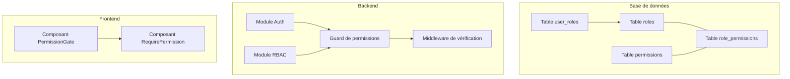
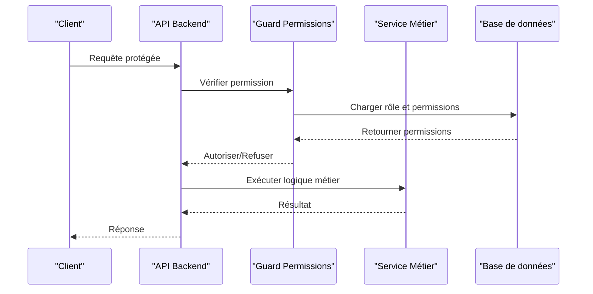
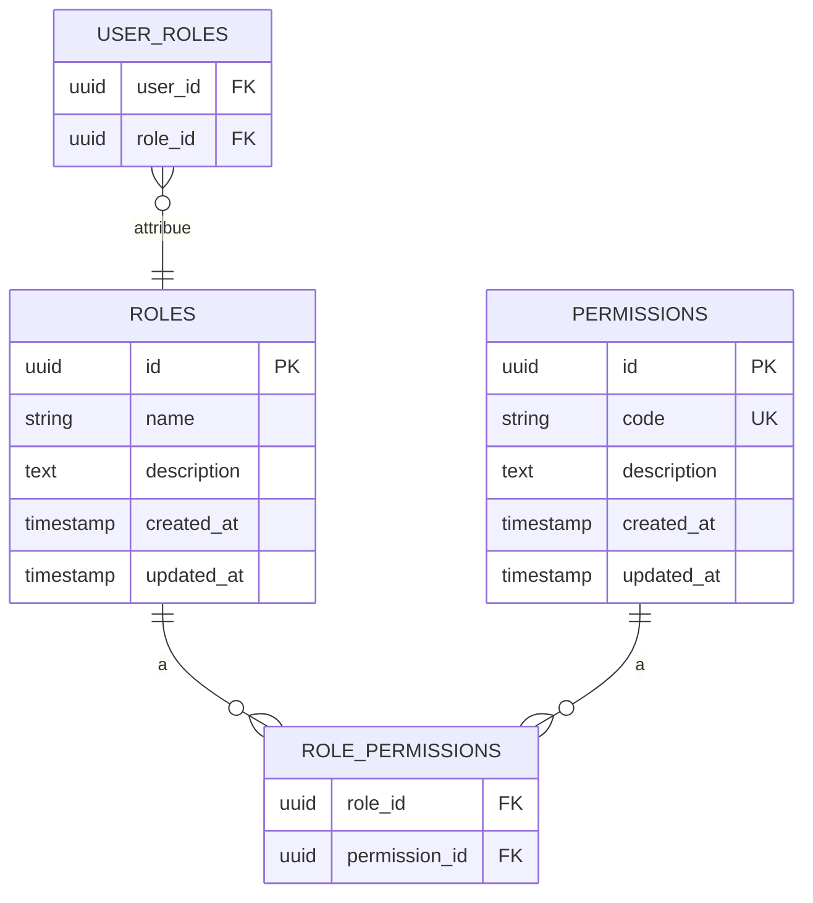
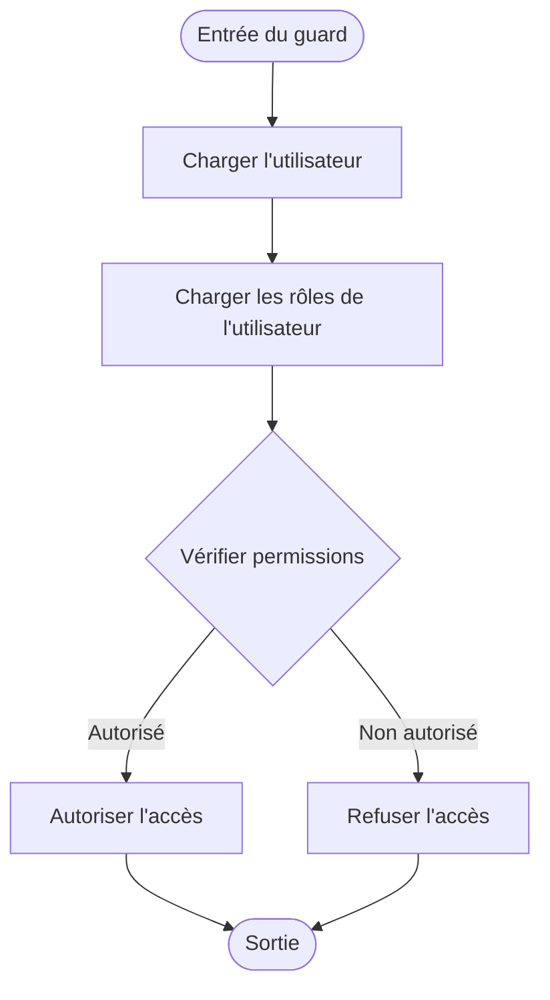
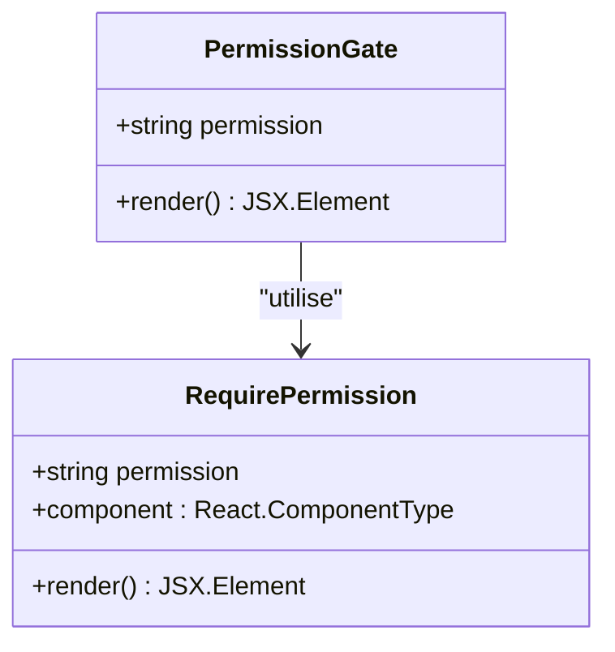
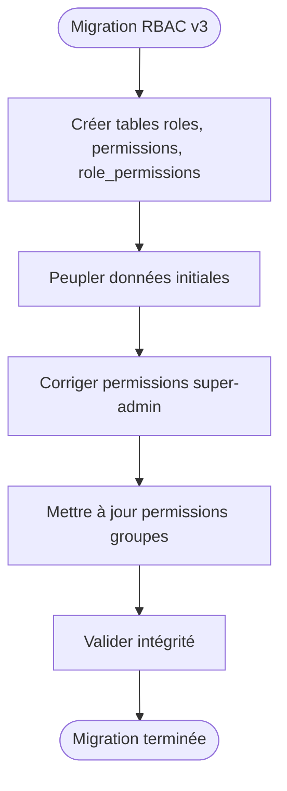
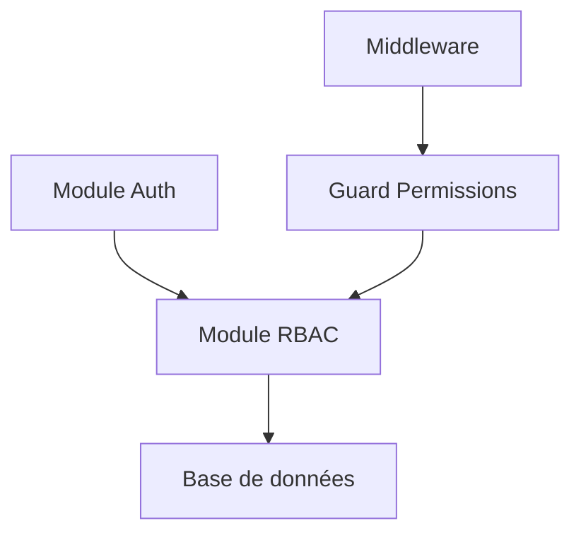

# Système RBAC et Permissions

<cite>
**Fichiers référencés dans ce document**
- [migrate-rbac-v3.sql](file://backend/database/migrations/migrate-rbac-v3.sql)
- [043-permissions-critiques-manquantes.sql](file://backend/database/migrations/043-permissions-critiques-manquantes.sql)
- [069-fix-super-admin-permissions.sql](file://backend/database/migrations/069-fix-super-admin-permissions.sql)
- [070-fix-super-admin-all-permission.sql](file://backend/database/migrations/070-fix-super-admin-all-permission.sql)
- [076-permissions-groupes-etablissements.sql](file://backend/database/migrations/076-permissions-groupes-etablissements.sql)
- [077-update-permissions-groupes.sql](file://backend/database/migrations/077-update-permissions-groupes.sql)
- [078-utilisateur-test-groupes.sql](file://backend/database/migrations/078-utilisateur-test-groupes.sql)
- [079-add-roleId-utilisateur-etablissements.sql](file://backend/database/migrations/079-add-roleId-utilisateur-etablissements.sql)
- [079-correction-permissions-groupes.sql](file://backend/database/migrations/079-correction-permissions-groupes.sql)
- [rbac-system.md](file://docs/rbac-system.md)
- [RBAC_COMPLETION.md](file://docs/RBAC_COMPLETION.md)
- [RBAC_FINAL_SESSION.md](file://docs/RBAC_FINAL_SESSION.md)
- [RAPPORT-FINAL-RBAC-v3.md](file://docs/rapports/RAPPORT-FINAL-RBAC-v3.md)
- [RESUME-EXECUTION-RBAC-v3.md](file://docs/resumes/RESUME-EXECUTION-RBAC-v3.md)
- [GUIDE-TEST-MULTI-ROLES.md](file://docs/guides/GUIDE-TEST-MULTI-ROLES.md)
- [CORRECTION-PERMISSIONS-SUPER-ADMIN.md](file://docs/corrections/CORRECTION-PERMISSIONS-SUPER-ADMIN.md)
- [CORRECTION-SUPER-ADMIN-ALL-PERMISSION.md](file://docs/corrections/CORRECTION-SUPER-ADMIN-ALL-PERMISSION.md)
- [AMÉLIORATIONS-CONTRASTE-MODE-SOMBRE.md](file://docs/ameliorations/AMELIORATIONS-CONTRASTE-MODE-SOMBRE.md)
- [ANALYSE-PERMISSIONS-CONFIGURATION-AUDIT.md](file://docs/analyses/ANALYSE-PERMISSIONS-CONFIGURATION-AUDIT.md)
- [ANALYSE-PERMISSIONS-SYNTHESE.md](file://docs/analyses/ANALYSE-PERMISSIONS-SYNTHESE.md)
- [guide-implémentation-permissions.ts](file://docs/guide-implémentation-permissions.ts)
- [guards-exemples-implémentation.ts](file://docs/guards-exemples-implémentation.ts)
- [EXEMPLE-INTEGRATION-PERMISSIONS.md](file://docs/EXEMPLE-INTEGRATION-PERMISSIONS.md)
- [PERMISSIONS-BASE-DONNEES.md](file://docs/PERMISSIONS-BASE-DONNEES.md)
- [CONVENTIONS-PERMISSIONS.md](file://docs/CONVENTIONS-PERMISSIONS.md)
- [RAPPORT-OPTIMISATION-PERFORMANCE-RBAC.md](file://docs/guides/GUIDE-MONITORING-PERFORMANCE-RBAC.md)
- [RAPPORT-EXECUTION-MIGRATION-RBAC-v3.md](file://docs/rapports/RAPPORT-EXECUTION-MIGRATION-RBAC-v3.md)
- [MIGRATION-RBAC-v3-MULTI-TENANT-STRICT.md](file://docs/migrations/MIGRATION-RBAC-v3-MULTI-TENANT-STRICT.md)
- [MIGRATION-REQUIEROLES-VERS-REQUIREPERMISSION.md](file://docs/migrations/MIGRATION-REQUIEROLES-VERS-REQUIREPERMISSION.md)
</cite>

## Table des matières
1. [Introduction](#introduction)
2. [Structure du projet](#structure-du-projet)
3. [Composants clés](#composants-clés)
4. [Vue d'ensemble de l'architecture](#vue-densemble-de-larchitecture)
5. [Analyse détaillée des composants](#analyse-detallee-des-composants)
6. [Analyse des dépendances](#analyse-des-dependances)
7. [Considérations de performance](#considerations-de-performance)
8. [Guide de dépannage](#guide-de-depannage)
9. [Conclusion](#conclusion)
10. [Annexes](#annexes)

## Introduction
Ce document présente le système RBAC (Role-Based Access Control) d'eLISAschool, avec un focus sur l’architecture des rôles, les permissions granulaires, et le contrôle d’accès côté backend et frontend. Il explique les entités Role et Permission, leurs relations, le guard de permissions backend, ainsi que les composants frontend PermissionGate et RequirePermission. Des exemples concrets de définition de rôles personnalisés, d’attribution dynamique de permissions, et d’intégration avec le middleware de vérification sont fournis. Enfin, il détaille les meilleures pratiques pour concevoir des permissions, structurer la hiérarchie des rôles, et migrer vers le nouveau système RBAC v3.

## Structure du projet
Le système RBAC est implémenté à travers plusieurs couches :
- Base de données : schéma et migrations définissant les tables roles, permissions, role_permissions, user_roles, et les relations associées.
- Backend : modules rbac, auth, middlewares, services et guards assurant la vérification des permissions.
- Frontend : composants PermissionGate et RequirePermission pour contrôler l’affichage et l’accès aux fonctionnalités.

[Ce diagramme illustre une vue conceptuelle du système RBAC sans mappage direct vers des fichiers spécifiques]

## Composants clés
- Entité Role : définit un ensemble de permissions attribuées à un utilisateur ou un groupe.
- Entité Permission : représente une action ou un accès spécifique (par exemple, lecture/écriture sur une ressource).
- Relation Role-Permission : table intermédiaire permettant d’associer dynamiquement des permissions à des rôles.
- Attribution utilisateur-rôle : permet d’attribuer un ou plusieurs rôles à un utilisateur.
- Guard backend : vérifie les permissions avant d’exécuter une logique métier.
- Middleware de vérification : intercepte les requêtes pour appliquer des règles d’accès globales.
- Composants frontend :
  - PermissionGate : affiche ou masque des éléments UI selon les permissions.
  - RequirePermission : force l’accès à une route ou un composant si la permission est valide.

**Sources de section**
- [rbac-system.md](file://docs/rbac-system.md)
- [RBAC_COMPLETION.md](file://docs/RBAC_COMPLETION.md)
- [RBAC_FINAL_SESSION.md](file://docs/RBAC_FINAL_SESSION.md)

## Vue d'ensemble de l'architecture
Le système RBAC suit un modèle classique où les permissions sont attachées aux rôles, et les rôles sont attribués aux utilisateurs. Le backend utilise un guard pour valider les permissions au niveau des contrôleurs ou services, tandis que le frontend utilise des composants pour adapter l’interface utilisateur en fonction des permissions de l’utilisateur connecté.

[Ce diagramme montre un flux conceptuel de vérification de permission sans mappage direct vers des fichiers spécifiques]

## Analyse détaillée des composants

### Entités Role et Permission
Les tables roles et permissions sont définies dans les migrations SQL. La relation entre elles est gérée par la table role_permissions, qui permet une attribution flexible et évolutive.

**Sources de diagramme**
- [migrate-rbac-v3.sql](file://backend/database/migrations/migrate-rbac-v3.sql)
- [043-permissions-critiques-manquantes.sql](file://backend/database/migrations/043-permissions-critiques-manquantes.sql)
- [076-permissions-groupes-etablissements.sql](file://backend/database/migrations/076-permissions-groupes-etablissements.sql)

**Sources de section**
- [migrate-rbac-v3.sql](file://backend/database/migrations/migrate-rbac-v3.sql)
- [043-permissions-critiques-manquantes.sql](file://backend/database/migrations/043-permissions-critiques-manquantes.sql)
- [076-permissions-groupes-etablissements.sql](file://backend/database/migrations/076-permissions-groupes-etablissements.sql)

### Guard de permissions backend
Le guard de permissions est utilisé pour vérifier si un utilisateur possède la permission nécessaire avant d’exécuter une action. Il s’appuie sur les rôles et permissions stockés en base de données.

**Sources de diagramme**
- [guards-exemples-implémentation.ts](file://docs/guards-exemples-implémentation.ts)
- [guide-implémentation-permissions.ts](file://docs/guide-implémentation-permissions.ts)

**Sources de section**
- [guards-exemples-implémentation.ts](file://docs/guards-exemples-implémentation.ts)
- [guide-implémentation-permissions.ts](file://docs/guide-implémentation-permissions.ts)

### Composants frontend PermissionGate et RequirePermission
Ces composants permettent de contrôler l’affichage et l’accès aux fonctionnalités en fonction des permissions de l’utilisateur connecté.

**Sources de diagramme**
- [EXEMPLE-INTEGRATION-PERMISSIONS.md](file://docs/EXEMPLE-INTEGRATION-PERMISSIONS.md)
- [CONVENTIONS-PERMISSIONS.md](file://docs/CONVENTIONS-PERMISSIONS.md)

**Sources de section**
- [EXEMPLE-INTEGRATION-PERMISSIONS.md](file://docs/EXEMPLE-INTEGRATION-PERMISSIONS.md)
- [CONVENTIONS-PERMISSIONS.md](file://docs/CONVENTIONS-PERMISSIONS.md)

### Migration vers RBAC v3
La migration RBAC v3 introduit des améliorations significatives, notamment le support multi-tenant strict, une meilleure gestion des permissions critiques, et des corrections pour le super-administrateur.

**Sources de diagramme**
- [migrate-rbac-v3.sql](file://backend/database/migrations/migrate-rbac-v3.sql)
- [069-fix-super-admin-permissions.sql](file://backend/database/migrations/069-fix-super-admin-permissions.sql)
- [070-fix-super-admin-all-permission.sql](file://backend/database/migrations/070-fix-super-admin-all-permission.sql)
- [077-update-permissions-groupes.sql](file://backend/database/migrations/077-update-permissions-groupes.sql)

**Sources de section**
- [migrate-rbac-v3.sql](file://backend/database/migrations/migrate-rbac-v3.sql)
- [069-fix-super-admin-permissions.sql](file://backend/database/migrations/069-fix-super-admin-permissions.sql)
- [070-fix-super-admin-all-permission.sql](file://backend/database/migrations/070-fix-super-admin-all-permission.sql)
- [077-update-permissions-groupes.sql](file://backend/database/migrations/077-update-permissions-groupes.sql)

## Analyse des dépendances
Le système RBAC dépend de plusieurs modules backend et de la base de données. Les dépendances principales incluent :
- Module Auth : gestion de l’authentification et du contexte utilisateur.
- Module RBAC : gestion des rôles et permissions.
- Base de données : stockage des entités et relations.

[Ce diagramme illustre une vue conceptuelle des dépendances sans mappage direct vers des fichiers spécifiques]

## Considérations de performance
Pour optimiser les performances du système RBAC :
- Indexer les colonnes utilisées dans les jointures (role_id, permission_id, user_id).
- Utiliser des vues matérialisées pour les requêtes fréquentes.
- Mettre en cache les permissions des utilisateurs actifs.

**Sources de section**
- [RAPPORT-OPTIMISATION-PERFORMANCE-RBAC.md](file://docs/guides/GUIDE-MONITORING-PERFORMANCE-RBAC.md)

## Guide de dépannage
Problèmes courants et solutions :
- Erreur 403 : Vérifier les permissions attribuées à l’utilisateur.
- Super-admin sans accès : Appliquer les correctifs de permissions.
- Permissions manquantes : Exécuter les migrations de correction.

**Sources de section**
- [CORRECTION-PERMISSIONS-SUPER-ADMIN.md](file://docs/corrections/CORRECTION-PERMISSIONS-SUPER-ADMIN.md)
- [CORRECTION-SUPER-ADMIN-ALL-PERMISSION.md](file://docs/corrections/CORRECTION-SUPER-ADMIN-ALL-PERMISSION.md)
- [043-permissions-critiques-manquantes.sql](file://backend/database/migrations/043-permissions-critiques-manquantes.sql)

## Conclusion
Le système RBAC d’eLISAschool offre une architecture robuste et évolutive pour la gestion des accès. En suivant les bonnes pratiques de conception des permissions et en utilisant les outils fournis (guard, middleware, composants frontend), il est possible de mettre en place un contrôle d’accès fin et sécurisé. La migration vers RBAC v3 améliore encore davantage la flexibilité et la performance du système.

## Annexes
- Exemples de définition de rôles personnalisés : voir [guide-implémentation-permissions.ts](file://docs/guide-implémentation-permissions.ts).
- Attribution dynamique de permissions : utiliser les scripts de migration et les seeds.
- Intégration avec le middleware : consulter [guards-exemples-implémentation.ts](file://docs/guards-exemples-implémentation.ts).

**Sources de section**
- [guide-implémentation-permissions.ts](file://docs/guide-implémentation-permissions.ts)
- [guards-exemples-implémentation.ts](file://docs/guards-exemples-implémentation.ts)