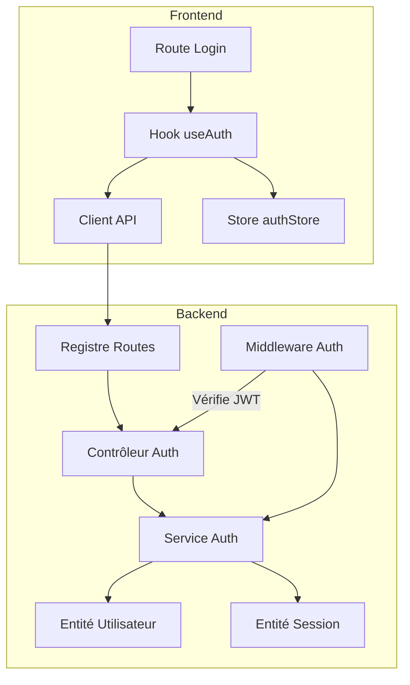
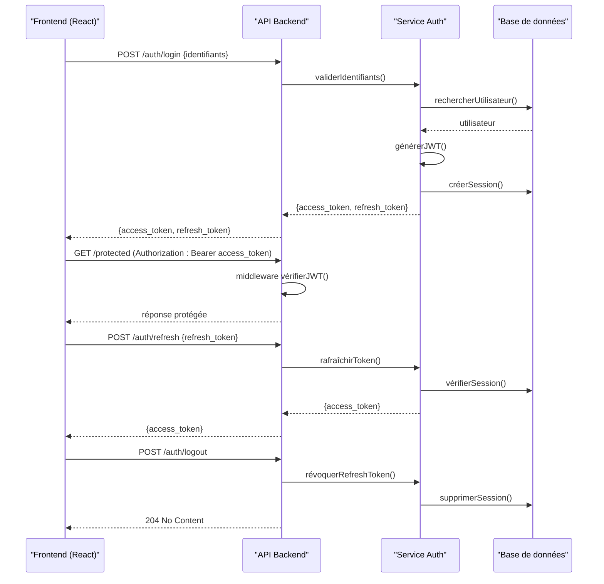
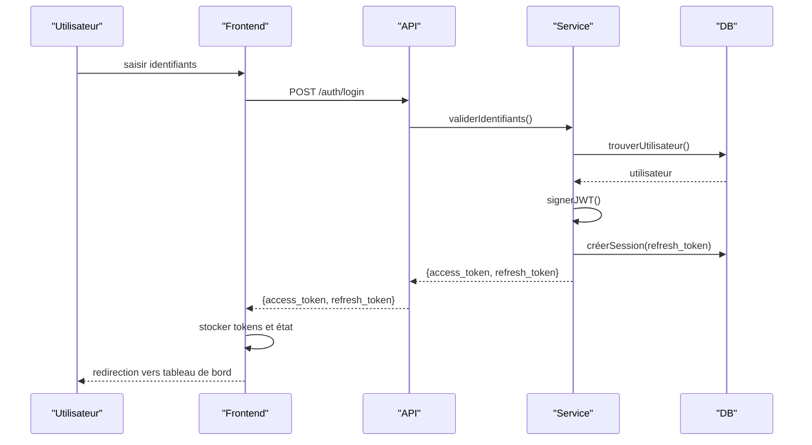
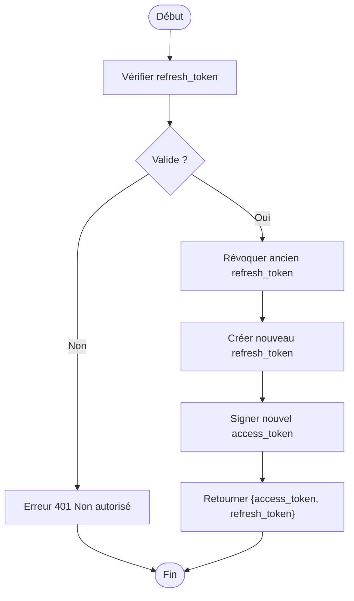
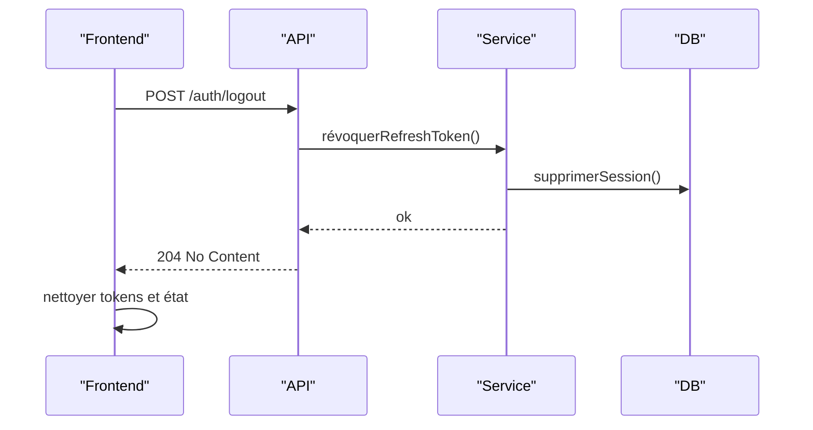
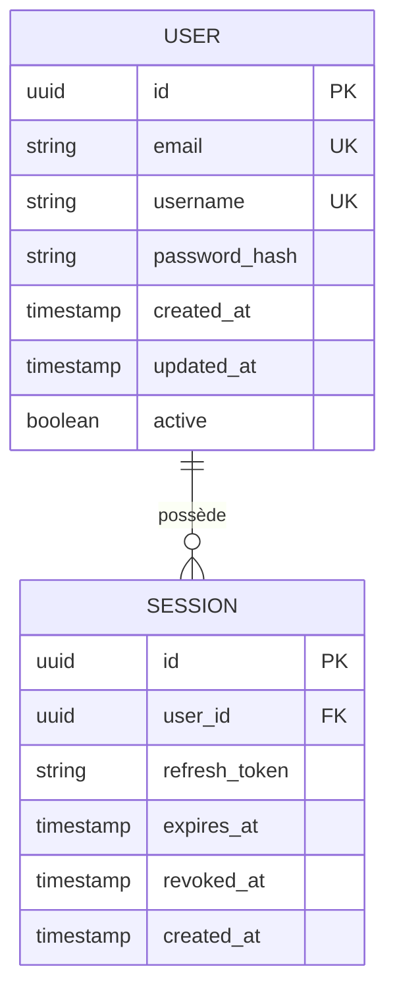
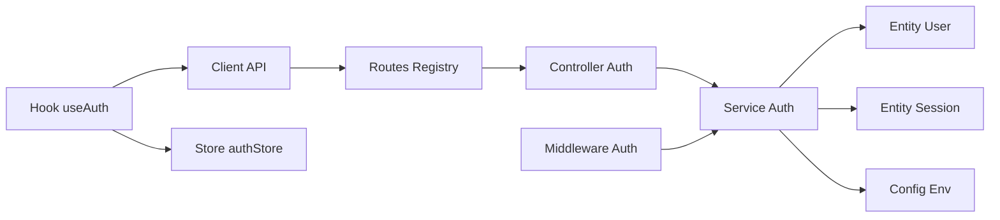

# Système d'Authentification

<cite>
**Fichiers référencés dans ce document**
- [backend/src/modules/auth/controllers/auth.controller.ts](file://backend/src/modules/auth/controllers/auth.controller.ts)
- [backend/src/modules/auth/services/auth.service.ts](file://backend/src/modules/auth/services/auth.service.ts)
- [backend/src/modules/auth/middlewares/auth.middleware.ts](file://backend/src/modules/auth/middlewares/auth.middleware.ts)
- [backend/src/modules/auth/dto/login.dto.ts](file://backend/src/modules/auth/dto/login.dto.ts)
- [backend/src/modules/auth/dto/refresh-token.dto.ts](file://backend/src/modules/auth/dto/refresh-token.dto.ts)
- [backend/src/modules/auth/entities/user.entity.ts](file://backend/src/modules/auth/entities/user.entity.ts)
- [backend/src/modules/auth/entities/session.entity.ts](file://backend/src/modules/auth/entities/session.entity.ts)
- [backend/src/config/env.config.ts](file://backend/src/config/env.config.ts)
- [backend/src/routes/route-registry.ts](file://backend/src/routes/route-registry.ts)
- [frontend/src/hooks/useAuth.ts](file://frontend/src/hooks/useAuth.ts)
- [frontend/src/lib/apiClient.ts](file://frontend/src/lib/apiClient.ts)
- [frontend/src/stores/authStore.ts](file://frontend/src/stores/authStore.ts)
- [frontend/src/routes/login.route.tsx](file://frontend/src/routes/login.route.tsx)
</cite>

## Table des matières
1. [Introduction](#introduction)
2. [Structure du projet](#structure-du-projet)
3. [Composants clés](#composants-clés)
4. [Vue d’ensemble de l’architecture](#vue-densemble-de-larchitecture)
5. [Analyse détaillée des composants](#analyse-détaillée-des-composants)
6. [Analyse des dépendances](#analyse-des-dépendances)
7. [Considérations de performance](#considérations-de-performance)
8. [Guide de dépannage](#guide-de-dépannage)
9. [Conclusion](#conclusion)
10. [Annexes](#annexes)

## Introduction
Ce document décrit en détail le système d’authentification d’eLISAschool, centré sur JWT (tokens d’accès et refresh tokens), le flux de connexion utilisateur, la gestion de session côté serveur, les middlewares de vérification, ainsi que l’intégration avec le frontend React. Il couvre les endpoints API, les schémas de données utilisateur, les stratégies de sécurité, les bonnes pratiques d’intégration client, la déconnexion sécurisée, la persistance de session et le traitement des erreurs.

## Structure du projet
Le module d’authentification est organisé par fonctionnalités dans le backend (controllers, services, middlewares, DTOs, entités) et exposé via un registre de routes. Le frontend expose des hooks, un client HTTP et un store pour gérer l’état d’authentification et les appels API.

**Sources des diagrammes**
- [backend/src/routes/route-registry.ts](file://backend/src/routes/route-registry.ts)
- [backend/src/modules/auth/controllers/auth.controller.ts](file://backend/src/modules/auth/controllers/auth.controller.ts)
- [backend/src/modules/auth/services/auth.service.ts](file://backend/src/modules/auth/services/auth.service.ts)
- [backend/src/modules/auth/middlewares/auth.middleware.ts](file://backend/src/modules/auth/middlewares/auth.middleware.ts)
- [frontend/src/hooks/useAuth.ts](file://frontend/src/hooks/useAuth.ts)
- [frontend/src/lib/apiClient.ts](file://frontend/src/lib/apiClient.ts)
- [frontend/src/stores/authStore.ts](file://frontend/src/stores/authStore.ts)
- [frontend/src/routes/login.route.tsx](file://frontend/src/routes/login.route.tsx)

**Sources de section**
- [backend/src/routes/route-registry.ts](file://backend/src/routes/route-registry.ts)
- [backend/src/modules/auth/controllers/auth.controller.ts](file://backend/src/modules/auth/controllers/auth.controller.ts)
- [backend/src/modules/auth/services/auth.service.ts](file://backend/src/modules/auth/services/auth.service.ts)
- [backend/src/modules/auth/middlewares/auth.middleware.ts](file://backend/src/modules/auth/middlewares/auth.middleware.ts)
- [frontend/src/hooks/useAuth.ts](file://frontend/src/hooks/useAuth.ts)
- [frontend/src/lib/apiClient.ts](file://frontend/src/lib/apiClient.ts)
- [frontend/src/stores/authStore.ts](file://frontend/src/stores/authStore.ts)
- [frontend/src/routes/login.route.tsx](file://frontend/src/routes/login.route.tsx)

## Composants clés
- Contrôleur d’authentification : définit les endpoints login, logout, refresh token et protection de routes.
- Service d’authentification : gère la validation des identifiants, la génération/validation de JWT, la gestion des refresh tokens et la révocation de sessions.
- Middleware d’authentification : extrait et valide le JWT, injecte l’utilisateur dans la requête.
- DTOs : validation des payloads (login, refresh).
- Entités : modèle utilisateur et session.
- Frontend : hook useAuth, client API avec intercepteurs, store persistant, route de connexion.

**Sources de section**
- [backend/src/modules/auth/controllers/auth.controller.ts](file://backend/src/modules/auth/controllers/auth.controller.ts)
- [backend/src/modules/auth/services/auth.service.ts](file://backend/src/modules/auth/services/auth.service.ts)
- [backend/src/modules/auth/middlewares/auth.middleware.ts](file://backend/src/modules/auth/middlewares/auth.middleware.ts)
- [backend/src/modules/auth/dto/login.dto.ts](file://backend/src/modules/auth/dto/login.dto.ts)
- [backend/src/modules/auth/dto/refresh-token.dto.ts](file://backend/src/modules/auth/dto/refresh-token.dto.ts)
- [backend/src/modules/auth/entities/user.entity.ts](file://backend/src/modules/auth/entities/user.entity.ts)
- [backend/src/modules/auth/entities/session.entity.ts](file://backend/src/modules/auth/entities/session.entity.ts)
- [frontend/src/hooks/useAuth.ts](file://frontend/src/hooks/useAuth.ts)
- [frontend/src/lib/apiClient.ts](file://frontend/src/lib/apiClient.ts)
- [frontend/src/stores/authStore.ts](file://frontend/src/stores/authStore.ts)
- [frontend/src/routes/login.route.tsx](file://frontend/src/routes/login.route.tsx)

## Vue d’ensemble de l’architecture
Le flux suit un schéma classique JWT :
- Connexion : le client envoie les identifiants; le serveur retourne access_token et refresh_token.
- Accès protégé : le client joint l’access_token dans l’en-tête Authorization.
- Renouvellement : le client utilise refresh_token pour obtenir un nouvel access_token.
- Déconnexion : le serveur révoque le refresh_token et supprime la session.

**Sources des diagrammes**
- [backend/src/modules/auth/controllers/auth.controller.ts](file://backend/src/modules/auth/controllers/auth.controller.ts)
- [backend/src/modules/auth/services/auth.service.ts](file://backend/src/modules/auth/services/auth.service.ts)
- [backend/src/modules/auth/middlewares/auth.middleware.ts](file://backend/src/modules/auth/middlewares/auth.middleware.ts)
- [frontend/src/hooks/useAuth.ts](file://frontend/src/hooks/useAuth.ts)
- [frontend/src/lib/apiClient.ts](file://frontend/src/lib/apiClient.ts)

## Analyse détaillée des composants

### Contrôleur d’authentification
- Endpoints principaux :
  - POST /auth/login : accepte les identifiants, renvoie access_token et refresh_token.
  - POST /auth/refresh : accepte refresh_token, renouvelle l’access_token.
  - POST /auth/logout : révoque le refresh_token et termine la session.
  - Routes protégées : nécessitent un JWT valide.
- Validation des entrées via DTOs.
- Retourne des réponses standardisées et gère les erreurs métier.

**Sources de section**
- [backend/src/modules/auth/controllers/auth.controller.ts](file://backend/src/modules/auth/controllers/auth.controller.ts)
- [backend/src/modules/auth/dto/login.dto.ts](file://backend/src/modules/auth/dto/login.dto.ts)
- [backend/src/modules/auth/dto/refresh-token.dto.ts](file://backend/src/modules/auth/dto/refresh-token.dto.ts)

### Service d’authentification
- Validation des identifiants et récupération de l’utilisateur.
- Génération de JWT (payload minimal, expiration courte).
- Gestion des refresh tokens : stockage sécurisé, rotation à chaque renouvellement.
- Révocation de session lors du logout ou invalidation forcée.
- Vérification de l’existence et validité de la session avant renouvellement.

**Sources de section**
- [backend/src/modules/auth/services/auth.service.ts](file://backend/src/modules/auth/services/auth.service.ts)
- [backend/src/modules/auth/entities/user.entity.ts](file://backend/src/modules/auth/entities/user.entity.ts)
- [backend/src/modules/auth/entities/session.entity.ts](file://backend/src/modules/auth/entities/session.entity.ts)

### Middleware d’authentification
- Extrait le token depuis l’en-tête Authorization.
- Valide le JWT (signature, expiration, revocation si nécessaire).
- Injecte l’utilisateur authentifié dans req.user.
- Bloque l’accès aux routes protégées en cas d’échec.

**Sources de section**
- [backend/src/src/modules/auth/middlewares/auth.middleware.ts](file://backend/src/modules/auth/middlewares/auth.middleware.ts)

### DTOs de validation
- login.dto : définit les champs requis pour la connexion (ex. identifiant, mot de passe).
- refresh-token.dto : définit le champ refresh_token obligatoire.

**Sources de section**
- [backend/src/modules/auth/dto/login.dto.ts](file://backend/src/modules/auth/dto/login.dto.ts)
- [backend/src/modules/auth/dto/refresh-token.dto.ts](file://backend/src/modules/auth/dto/refresh-token.dto.ts)

### Entités de données
- user.entity : modèle utilisateur (identifiants, rôles, métadonnées).
- session.entity : modèle de session lié au refresh token et à l’utilisateur.

**Sources de section**
- [backend/src/modules/auth/entities/user.entity.ts](file://backend/src/modules/auth/entities/user.entity.ts)
- [backend/src/modules/auth/entities/session.entity.ts](file://backend/src/modules/auth/entities/session.entity.ts)

### Configuration et sécurité
- env.config : lecture des variables d’environnement (JWT secret, expirations, options CORS).
- Stratégies de sécurité :
  - Tokens courts pour l’accès.
  - Refresh tokens rotatifs et stockés côté serveur.
  - Révocation immédiate lors du logout.
  - Validation stricte des entrées via DTOs.
  - Protection contre la fixation de session (renouvellement du refresh token).

**Sources de section**
- [backend/src/config/env.config.ts](file://backend/src/config/env.config.ts)

### Intégration Frontend React
- Hook useAuth : centralise les appels API, la persistance locale et l’état d’authentification.
- Client API (apiClient) : intercepteurs pour attacher l’access_token et gérer les réponses 401/403.
- Store authStore : état global (token, utilisateur, statut de connexion) avec persistance.
- Route login.route : formulaire de connexion et redirection après succès.

**Sources de section**
- [frontend/src/hooks/useAuth.ts](file://frontend/src/hooks/useAuth.ts)
- [frontend/src/lib/apiClient.ts](file://frontend/src/lib/apiClient.ts)
- [frontend/src/stores/authStore.ts](file://frontend/src/stores/authStore.ts)
- [frontend/src/routes/login.route.tsx](file://frontend/src/routes/login.route.tsx)

### Flux de connexion utilisateur (séquence)

**Sources des diagrammes**
- [backend/src/modules/auth/controllers/auth.controller.ts](file://backend/src/modules/auth/controllers/auth.controller.ts)
- [backend/src/modules/auth/services/auth.service.ts](file://backend/src/modules/auth/services/auth.service.ts)
- [frontend/src/hooks/useAuth.ts](file://frontend/src/hooks/useAuth.ts)
- [frontend/src/lib/apiClient.ts](file://frontend/src/lib/apiClient.ts)

### Flux de renouvellement de token (refresh)

**Sources des diagrammes**
- [backend/src/modules/auth/services/auth.service.ts](file://backend/src/modules/auth/services/auth.service.ts)
- [backend/src/modules/auth/dto/refresh-token.dto.ts](file://backend/src/modules/auth/dto/refresh-token.dto.ts)

### Flux de déconnexion sécurisée

**Sources des diagrammes**
- [backend/src/modules/auth/controllers/auth.controller.ts](file://backend/src/modules/auth/controllers/auth.controller.ts)
- [backend/src/modules/auth/services/auth.service.ts](file://backend/src/modules/auth/services/auth.service.ts)
- [frontend/src/hooks/useAuth.ts](file://frontend/src/hooks/useAuth.ts)

### Schéma de données utilisateur et session

**Sources des diagrammes**
- [backend/src/modules/auth/entities/user.entity.ts](file://backend/src/modules/auth/entities/user.entity.ts)
- [backend/src/modules/auth/entities/session.entity.ts](file://backend/src/modules/auth/entities/session.entity.ts)

## Analyse des dépendances
- Controllers dépendent de Services pour la logique métier.
- Services dépendent des entités ORM et de la configuration d’environnement.
- Middlewares dépendent de la configuration JWT et des utilitaires de signature.
- Frontend dépend du client API et du store pour la persistance et l’état.

**Sources des diagrammes**
- [backend/src/modules/auth/controllers/auth.controller.ts](file://backend/src/modules/auth/controllers/auth.controller.ts)
- [backend/src/modules/auth/services/auth.service.ts](file://backend/src/modules/auth/services/auth.service.ts)
- [backend/src/modules/auth/middlewares/auth.middleware.ts](file://backend/src/modules/auth/middlewares/auth.middleware.ts)
- [backend/src/config/env.config.ts](file://backend/src/config/env.config.ts)
- [backend/src/routes/route-registry.ts](file://backend/src/routes/route-registry.ts)
- [frontend/src/hooks/useAuth.ts](file://frontend/src/hooks/useAuth.ts)
- [frontend/src/lib/apiClient.ts](file://frontend/src/lib/apiClient.ts)
- [frontend/src/stores/authStore.ts](file://frontend/src/stores/authStore.ts)

**Sources de section**
- [backend/src/modules/auth/controllers/auth.controller.ts](file://backend/src/modules/auth/controllers/auth.controller.ts)
- [backend/src/modules/auth/services/auth.service.ts](file://backend/src/modules/auth/services/auth.service.ts)
- [backend/src/modules/auth/middlewares/auth.middleware.ts](file://backend/src/modules/auth/middlewares/auth.middleware.ts)
- [backend/src/config/env.config.ts](file://backend/src/config/env.config.ts)
- [backend/src/routes/route-registry.ts](file://backend/src/routes/route-registry.ts)
- [frontend/src/hooks/useAuth.ts](file://frontend/src/hooks/useAuth.ts)
- [frontend/src/lib/apiClient.ts](file://frontend/src/lib/apiClient.ts)
- [frontend/src/stores/authStore.ts](file://frontend/src/stores/authStore.ts)

## Considérations de performance
- Tokens courts pour limiter la fenêtre d’exposition.
- Rotation des refresh tokens pour réduire les risques de vol.
- Stockage de session côté serveur pour éviter la surcharge du client.
- Intercepteurs frontend pour recharger automatiquement les tokens sans bloquer l’UX.
- Indexation des tables session/utilisateur pour accélérer les vérifications.

[Pas de sources nécessaires car cette section fournit des conseils généraux]

## Guide de dépannage
- Erreurs courantes :
  - 401 Unauthorized : token manquant, expiré ou invalide.
  - 403 Forbidden : permissions insuffisantes.
  - 400 Bad Request : payload mal formé (validation DTO échoue).
- Actions recommandées :
  - Vérifier l’en-tête Authorization et le format Bearer.
  - S’assurer que le refresh_token n’a pas été révoqué.
  - Consulter les logs backend pour les erreurs de signature JWT.
  - Tester les endpoints avec un client HTTP (cURL/Postman) pour isoler le problème.

**Sources de section**
- [backend/src/modules/auth/controllers/auth.controller.ts](file://backend/src/modules/auth/controllers/auth.controller.ts)
- [backend/src/modules/auth/services/auth.service.ts](file://backend/src/modules/auth/services/auth.service.ts)
- [backend/src/modules/auth/middlewares/auth.middleware.ts](file://backend/src/modules/auth/middlewares/auth.middleware.ts)

## Conclusion
Le système d’authentification d’eLISAschool repose sur JWT avec refresh tokens rotatifs et une gestion rigoureuse des sessions. L’intégration frontend utilise un hook centralisé, un client API robuste et un store persistant pour offrir une expérience fluide et sécurisée. Les bonnes pratiques de sécurité (tokens courts, révocation immédiate, validation stricte) garantissent la robustesse du flux de connexion et de renouvellement.

[Pas de sources nécessaires car cette section résume sans analyser de fichiers spécifiques]

## Annexes

### Endpoints API d’authentification
- POST /auth/login
  - Corps : identifiant, mot de passe
  - Réponse : { access_token, refresh_token }
- POST /auth/refresh
  - Corps : refresh_token
  - Réponse : { access_token, refresh_token }
- POST /auth/logout
  - Corps : refresh_token (ou header Authorization selon implémentation)
  - Réponse : 204 No Content
- Routes protégées
  - En-tête : Authorization: Bearer <access_token>

**Sources de section**
- [backend/src/modules/auth/controllers/auth.controller.ts](file://backend/src/modules/auth/controllers/auth.controller.ts)
- [backend/src/modules/auth/dto/login.dto.ts](file://backend/src/modules/auth/dto/login.dto.ts)
- [backend/src/modules/auth/dto/refresh-token.dto.ts](file://backend/src/modules/auth/dto/refresh-token.dto.ts)

### Bonnes pratiques d’intégration client
- Stocker uniquement l’access_token en mémoire et le refresh_token de manière sécurisée.
- Gérer les 401 en déclenchant le renouvellement automatique du token.
- Nettoyer l’état local et les tokens lors du logout.
- Limiter les informations sensibles dans le payload JWT.
- Implémenter un fallback de reconnexion en cas d’erreur réseau.

**Sources de section**
- [frontend/src/hooks/useAuth.ts](file://frontend/src/hooks/useAuth.ts)
- [frontend/src/lib/apiClient.ts](file://frontend/src/lib/apiClient.ts)
- [frontend/src/stores/authStore.ts](file://frontend/src/stores/authStore.ts)