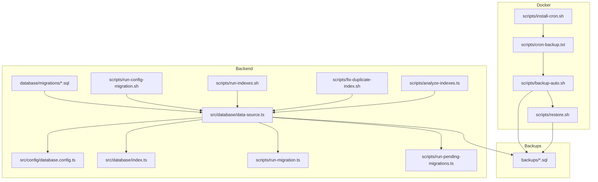
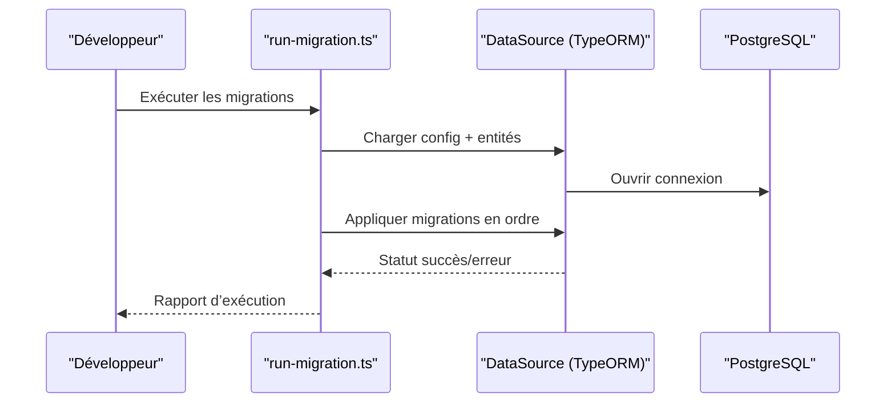
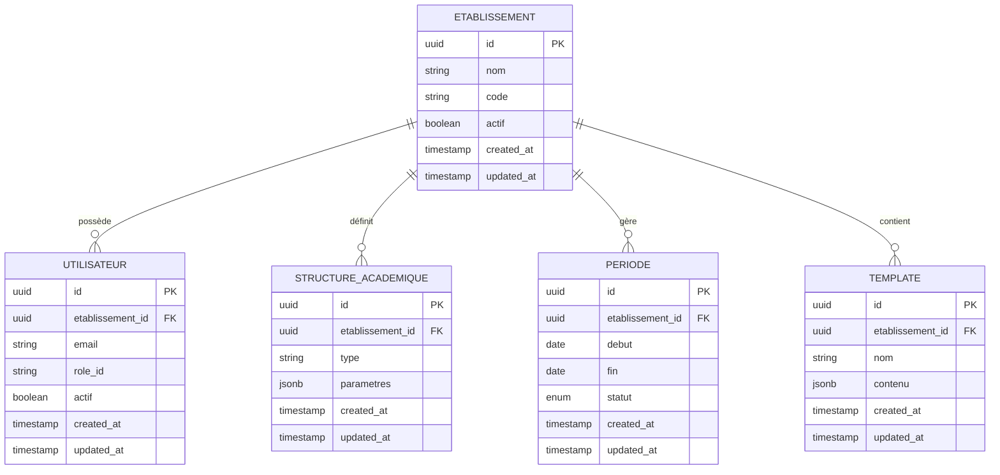
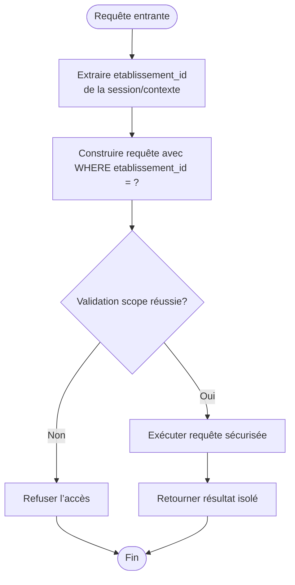
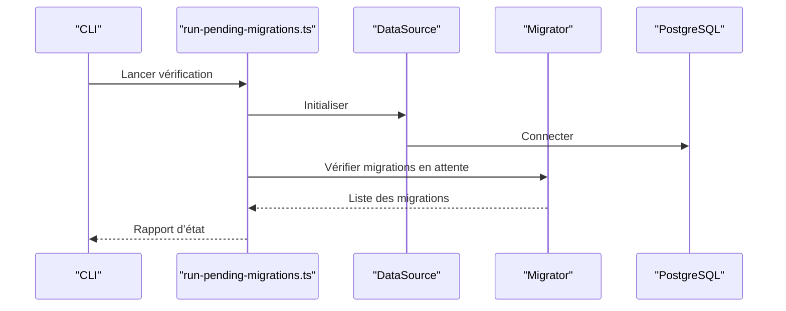
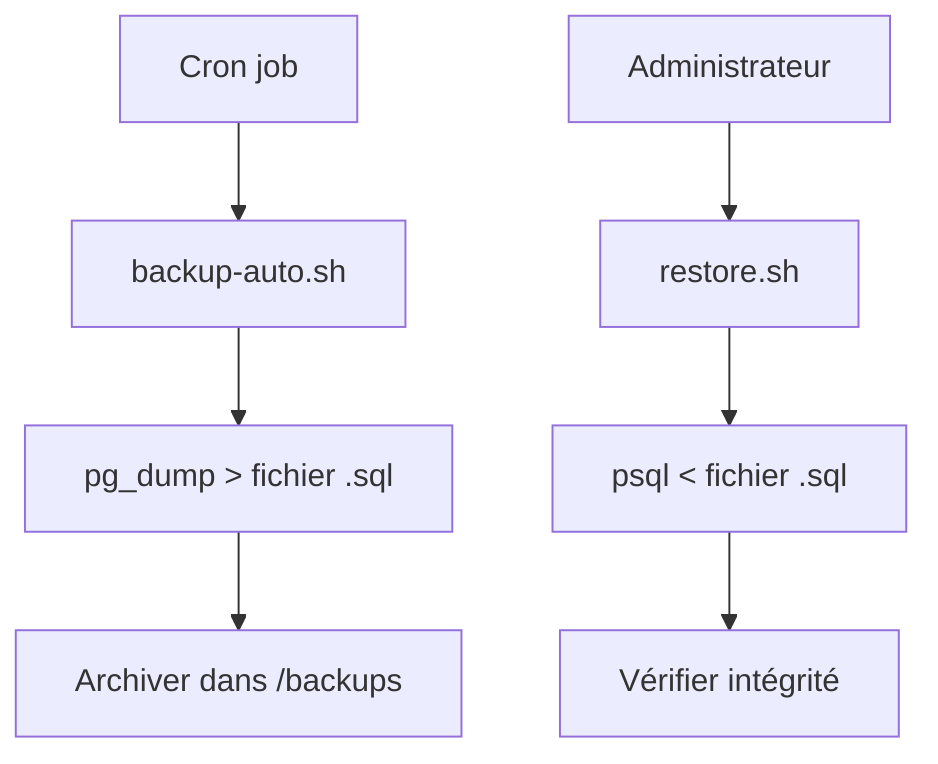
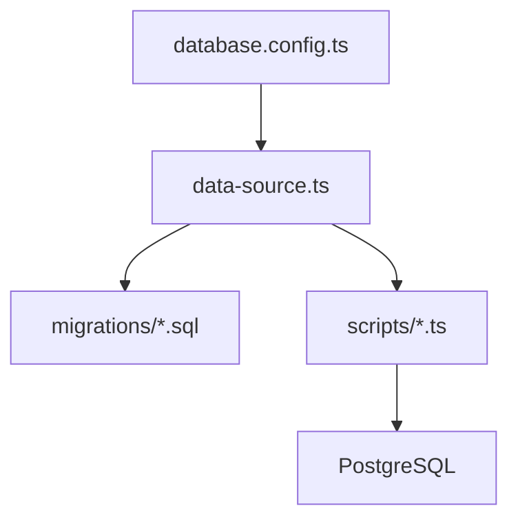
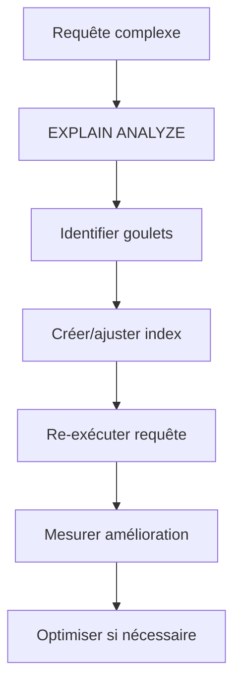

# Base de Données et Migrations

<cite>
**Fichiers référencés dans ce document**
- [data-source.ts](file://backend/src/database/data-source.ts)
- [database.config.ts](file://backend/src/config/database.config.ts)
- [index.ts](file://backend/src/database/index.ts)
- [pre-sync-cleanup.ts](file://backend/src/database/pre-sync-cleanup.ts)
- [run-migration.ts](file://backend/scripts/run-migration.ts)
- [run-pending-migrations.ts](file://backend/scripts/run-pending-migrations.ts)
- [run-config-migration.sh](file://backend/scripts/run-config-migration.sh)
- [run-indexes.sh](file://backend/scripts/run-indexes.sh)
- [fix-duplicate-index.sh](file://backend/scripts/fix-duplicate-index.sh)
- [analyze-indexes.ts](file://backend/scripts/analyze-indexes.ts)
- [050-multi-tenant-v3-max-etablissements.sql](file://backend/database/migrations/050-multi-tenant-v3-max-etablissements.sql)
- [080-preferences-utilisateur-multi-tenant.sql](file://backend/database/migrations/080-preferences-utilisateur-multi-tenant.sql)
- [089-finalisation-architecture-academique-v2.sql](file://backend/database/migrations/089-finalisation-architecture-academique-v2.sql)
- [104-refonte-periodes-niveaux-configurables.sql](file://backend/database/migrations/104-refonte-periodes-niveaux-configurables.sql)
- [105-migration-templates-v5.sql](file://backend/database/migrations/105-migration-templates-v5.sql)
- [009-performance-indexes.sql](file://backend/database/migrations/009-performance-indexes.sql)
- [047-optimisations-performance-v3.1.sql](file://backend/database/migrations/047-optimisations-performance-v3.1.sql)
- [048-notifications-performance-optimizations.sql](file://backend/database/migrations/048-notifications-performance-optimizations.sql)
- [backup-auto.sh](file://docker/scripts/backup-auto.sh)
- [backup-manuel.sh](file://docker/scripts/backup-manuel.sh)
- [restore.sh](file://docker/scripts/restore.sh)
- [cron-backup.txt](file://docker/scripts/cron-backup.txt)
- [install-cron.sh](file://docker/scripts/install-cron.sh)
- [elisaschool_backup_20260621_143000.sql](file://backups/elisaschool_backup_20260621_143000.sql)
- [schema-pre-migrations-084-087.sql](file://backups/schema-pre-migrations-084-087.sql)
</cite>

## Table des matières
1. [Introduction](#introduction)
2. [Structure du projet](#structure-du-projet)
3. [Composants clés](#composants-clés)
4. [Vue d’ensemble de l’architecture](#vue-densemble-de-larchitecture)
5. [Analyse détaillée des composants](#analyse-detailee-des-composants)
6. [Analyse des dépendances](#analyse-des-dependances)
7. [Considérations de performance](#considerations-de-performance)
8. [Guide de dépannage](#guide-de-depannage)
9. [Conclusion](#conclusion)
10. [Annexes](#annexes)

## Introduction
Ce document décrit le modèle de données et le système de migrations d’eLISAschool, en se concentrant sur les entités de base de données, les relations entre tables, les contraintes et index, ainsi que les stratégies multi-tenant. Il explique également le système de migrations avec TypeORM, les scripts de seeding, les procédures de backup/restore, les politiques de rétention, les règles de validation métier, les stratégies de cache, les migrations de données, les rollbacks et la gestion des versions de schéma. Des schémas ERD, des exemples de requêtes complexes et des recommandations d’optimisation sont fournis pour aider les développeurs à maintenir et faire évoluer le système de manière fiable et performante.

## Structure du projet
Le sous-répertoire backend contient la configuration de la base de données, les migrations SQL et TypeScript, ainsi que les scripts d’exécution et d’analyse. Les fichiers de migration sont numérotés et organisés par fonctionnalité ou phase. Le répertoire docker inclut les scripts de sauvegarde et restauration automatisés, tandis que le dossier backups conserve les dumps de schéma et de données.

**Sources de diagramme**
- [data-source.ts](file://backend/src/database/data-source.ts)
- [database.config.ts](file://backend/src/config/database.config.ts)
- [index.ts](file://backend/src/database/index.ts)
- [run-migration.ts](file://backend/scripts/run-migration.ts)
- [run-pending-migrations.ts](file://backend/scripts/run-pending-migrations.ts)
- [run-config-migration.sh](file://backend/scripts/run-config-migration.sh)
- [run-indexes.sh](file://backend/scripts/run-indexes.sh)
- [fix-duplicate-index.sh](file://backend/scripts/fix-duplicate-index.sh)
- [analyze-indexes.ts](file://backend/scripts/analyze-indexes.ts)
- [backup-auto.sh](file://docker/scripts/backup-auto.sh)
- [restore.sh](file://docker/scripts/restore.sh)
- [cron-backup.txt](file://docker/scripts/cron-backup.txt)
- [install-cron.sh](file://docker/scripts/install-cron.sh)
- [elisaschool_backup_20260621_143000.sql](file://backups/elisaschool_backup_20260621_143000.sql)
- [schema-pre-migrations-084-087.sql](file://backups/schema-pre-migrations-084-087.sql)

**Sources de section**
- [data-source.ts](file://backend/src/database/data-source.ts)
- [database.config.ts](file://backend/src/config/database/config.ts)
- [index.ts](file://backend/src/database/index.ts)

## Composants clés
- Source de données TypeORM : centralise la connexion, les options de pool, les chemins de migrations et les entités.
- Configuration de la base de données : paramètres de connexion, mode développement/production, options de sécurité.
- Scripts de migration : exécution séquentielle des migrations, vérification des migrations en attente, nettoyage pré-synchronisation.
- Scripts d’indexation : analyse, correction et optimisation des index pour améliorer les performances.
- Sauvegarde et restauration : scripts automatisés et manuels, planification via cron, conservation des archives.

**Sources de section**
- [data-source.ts](file://backend/src/database/data-source.ts)
- [database.config.ts](file://backend/src/config/database.config.ts)
- [index.ts](file://backend/src/database/index.ts)
- [pre-sync-cleanup.ts](file://backend/src/database/pre-sync-cleanup.ts)
- [run-migration.ts](file://backend/scripts/run-migration.ts)
- [run-pending-migrations.ts](file://backend/scripts/run-pending-migrations.ts)
- [run-config-migration.sh](file://backend/scripts/run-config-migration.sh)
- [run-indexes.sh](file://backend/scripts/run-indexes.sh)
- [fix-duplicate-index.sh](file://backend/scripts/fix-duplicate-index.sh)
- [analyze-indexes.ts](file://backend/scripts/analyze-indexes.ts)

## Vue d’ensemble de l’architecture
Le système utilise TypeORM comme ORM principal, avec des migrations SQL et TypeScript. La source de données est configurée dynamiquement selon l’environnement. Les migrations s’exécutent via des scripts Node.js qui orchestrent l’ordre et la cohérence. Les opérations de maintenance (index, nettoyage, seed) sont externalisées dans des scripts shell et TypeScript.

**Sources de diagramme**
- [run-migration.ts](file://backend/scripts/run-migration.ts)
- [data-source.ts](file://backend/src/database/data-source.ts)
- [database.config.ts](file://backend/src/config/database.config.ts)

## Analyse détaillée des composants

### Modèle de données et relations
Les migrations SQL définissent les tables, contraintes et index. Les entités principales incluent les modules académiques, financiers, RH, messagerie, notifications, organisation, et plus encore. Les relations sont gérées via des clés étrangères et des index composites pour garantir l’intégrité référentielle et la performance.

Exemples de migrations structurantes :
- Architecture académique finalisée et améliorée
- Refonte des périodes et niveaux configurables
- Templates v5 pour les modèles réutilisables
- Multi-tenant v3 pour isolation par établissement

**Sources de diagramme**
- [089-finalisation-architecture-academique-v2.sql](file://backend/database/migrations/089-finalisation-architecture-academique-v2.sql)
- [104-refonte-periodes-niveaux-configurables.sql](file://backend/database/migrations/104-refonte-periodes-niveaux-configurables.sql)
- [105-migration-templates-v5.sql](file://backend/database/migrations/105-migration-templates-v5.sql)
- [050-multi-tenant-v3-max-etablissements.sql](file://backend/database/migrations/050-multi-tenant-v3-max-etablissements.sql)
- [080-preferences-utilisateur-multi-tenant.sql](file://backend/database/migrations/080-preferences-utilisateur-multi-tenant.sql)

**Sources de section**
- [089-finalisation-architecture-academique-v2.sql](file://backend/database/migrations/089-finalisation-architecture-academique-v2.sql)
- [104-refonte-periodes-niveaux-configurables.sql](file://backend/database/migrations/104-refonte-periodes-niveaux-configurables.sql)
- [105-migration-templates-v5.sql](file://backend/database/migrations/105-migration-templates-v5.sql)
- [050-multi-tenant-v3-max-etablissements.sql](file://backend/database/migrations/050-multi-tenant-v3-max-etablissements.sql)
- [080-preferences-utilisateur-multi-tenant.sql](file://backend/database/migrations/080-preferences-utilisateur-multi-tenant.sql)

### Stratégies de partitionnement multi-tenant
Le multi-tenant est implémenté via un champ etablissement_id présent dans les tables principales, permettant l’isolation logique des données par établissement. Les migrations ajoutent des contraintes uniques et des index composites pour garantir l’intégrité et la performance des requêtes scoping.

**Sources de diagramme**
- [050-multi-tenant-v3-max-etablissements.sql](file://backend/database/migrations/050-multi-tenant-v3-max-etablissements.sql)
- [080-preferences-utilisateur-multi-tenant.sql](file://backend/database/migrations/080-preferences-utilisateur-multi-tenant.sql)

**Sources de section**
- [050-multi-tenant-v3-max-etablissements.sql](file://backend/database/migrations/050-multi-tenant-v3-max-etablissements.sql)
- [080-preferences-utilisateur-multi-tenant.sql](file://backend/database/migrations/080-preferences-utilisateur-multi-tenant.sql)

### Système de migrations TypeORM
Les migrations sont exécutées via des scripts Node.js qui chargent la DataSource TypeORM et appliquent les changements dans l’ordre. Les migrations peuvent être SQL ou TypeScript. Le processus inclut la vérification des migrations en attente et le rapport d’exécution.

**Sources de diagramme**
- [run-pending-migrations.ts](file://backend/scripts/run-pending-migrations.ts)
- [data-source.ts](file://backend/src/database/data-source.ts)

**Sources de section**
- [run-migration.ts](file://backend/scripts/run-migration.ts)
- [run-pending-migrations.ts](file://backend/scripts/run-pending-migrations.ts)
- [pre-sync-cleanup.ts](file://backend/src/database/pre-sync-cleanup.ts)

### Scripts de seeding et données initiales
Les scripts de seeding peuplent la base de données avec des données de référence et des configurations initiales. Ils sont souvent couplés aux migrations pour assurer la cohérence entre structure et données.

**Sources de section**
- [run-config-migration.sh](file://backend/scripts/run-config-migration.sh)

### Procédures de backup/restore
Les scripts de sauvegarde automatisés utilisent pg_dump pour exporter le schéma et les données. La restauration utilise psql pour importer les fichiers SQL. La planification via cron permet des sauvegardes régulières.

**Sources de diagramme**
- [backup-auto.sh](file://docker/scripts/backup-auto.sh)
- [restore.sh](file://docker/scripts/restore.sh)
- [cron-backup.txt](file://docker/scripts/cron-backup.txt)
- [install-cron.sh](file://docker/scripts/install-cron.sh)
- [elisaschool_backup_20260621_143000.sql](file://backups/elisaschool_backup_20260621_143000.sql)
- [schema-pre-migrations-084-087.sql](file://backups/schema-pre-migrations-084-087.sql)

**Sources de section**
- [backup-auto.sh](file://docker/scripts/backup-auto.sh)
- [backup-manuel.sh](file://docker/scripts/backup-manuel.sh)
- [restore.sh](file://docker/scripts/restore.sh)
- [cron-backup.txt](file://docker/scripts/cron-backup.txt)
- [install-cron.sh](file://docker/scripts/install-cron.sh)

### Politiques de rétention des données
La rétention est gérée via des politiques de conservation des fichiers de sauvegarde et des logs. Les scripts de nettoyage suppriment les anciens fichiers selon des critères définis (âge, taille). Les données sensibles doivent être anonymisées avant archivage.

**Sources de section**
- [backup-auto.sh](file://docker/scripts/backup-auto.sh)
- [restore.sh](file://docker/scripts/restore.sh)

### Règles de validation métier
Les validations métier sont implémentées via des contraintes SQL (CHECK, UNIQUE), des triggers et des validations côté application. Les migrations ajoutent des colonnes et des règles pour garantir la cohérence des données.

**Sources de section**
- [089-finalisation-architecture-academique-v2.sql](file://backend/database/migrations/089-finalisation-architecture-academique-v2.sql)
- [104-refonte-periodes-niveaux-configurables.sql](file://backend/database/migrations/104-refonte-periodes-niveaux-configurables.sql)

### Stratégies de cache
Le cache est utilisé pour réduire la charge sur la base de données et améliorer les temps de réponse. Les stratégies incluent le caching de résultats de requêtes fréquentes, la mise en cache de configurations et la invalidation ciblée lors des mises à jour.

[Section sans sources spécifiques]

### Migrations de données, rollbacks et gestion des versions
Les migrations de données sont réalisées via des scripts SQL et TypeScript. Les rollbacks sont possibles en créant des migrations inverses. La gestion des versions suit une approche séquentielle avec numérotation croissante.

**Sources de section**
- [run-migration.ts](file://backend/scripts/run-migration.ts)
- [run-pending-migrations.ts](file://backend/scripts/run-pending-migrations.ts)

### Guide pour créer de nouvelles migrations
Pour créer une nouvelle migration :
1. Identifier la table et les changements nécessaires.
2. Créer un fichier de migration SQL ou TypeScript avec un numéro unique.
3. Ajouter les contraintes, index et données de référence.
4. Tester la migration en local.
5. Déployer en production via les scripts d’exécution.

**Sources de section**
- [run-migration.ts](file://backend/scripts/run-migration.ts)
- [run-pending-migrations.ts](file://backend/scripts/run-pending-migrations.ts)

### Meilleures pratiques de développement
- Utiliser des transactions pour les migrations critiques.
- Valider les données avant d’appliquer des changements majeurs.
- Documenter chaque migration avec son objectif et son impact.
- Tester les migrations dans un environnement de staging.
- Automatiser les tests de non-régression après migration.

[Section sans sources spécifiques]

## Analyse des dépendances
Les composants de la base de données dépendent de la configuration TypeORM et des scripts d’exécution. Les migrations SQL sont indépendantes mais doivent respecter l’ordre imposé par la numérotation.

**Sources de diagramme**
- [database.config.ts](file://backend/src/config/database.config.ts)
- [data-source.ts](file://backend/src/database/data-source.ts)
- [run-migration.ts](file://backend/scripts/run-migration.ts)

**Sources de section**
- [database.config.ts](file://backend/src/config/database.config.ts)
- [data-source.ts](file://backend/src/database/data-source.ts)
- [run-migration.ts](file://backend/scripts/run-migration.ts)

## Considérations de performance
Les performances sont optimisées via des index stratégiques, des requêtes efficaces et des vues matérialisées. Les scripts d’analyse d’index aident à identifier les opportunités d’optimisation.

**Sources de diagramme**
- [analyze-indexes.ts](file://backend/scripts/analyze-indexes.ts)
- [run-indexes.sh](file://backend/scripts/run-indexes.sh)
- [009-performance-indexes.sql](file://backend/database/migrations/009-performance-indexes.sql)
- [047-optimisations-performance-v3.1.sql](file://backend/database/migrations/047-optimisations-performance-v3.1.sql)
- [048-notifications-performance-optimizations.sql](file://backend/database/migrations/048-notifications-performance-optimizations.sql)

**Sources de section**
- [analyze-indexes.ts](file://backend/scripts/analyze-indexes.ts)
- [run-indexes.sh](file://backend/scripts/run-indexes.sh)
- [009-performance-indexes.sql](file://backend/database/migrations/009-performance-indexes.sql)
- [047-optimisations-performance-v3.1.sql](file://backend/database/migrations/047-optimisations-performance-v3.1.sql)
- [048-notifications-performance-optimizations.sql](file://backend/database/migrations/048-notifications-performance-optimizations.sql)

## Guide de dépannage
En cas d’échec de migration :
- Vérifier les logs d’erreur dans les scripts d’exécution.
- Examiner les contraintes violées et les index dupliqués.
- Utiliser les scripts de diagnostic pour analyser l’état de la base.
- Restaurer depuis un backup récent si nécessaire.

**Sources de section**
- [fix-duplicate-index.sh](file://backend/scripts/fix-duplicate-index.sh)
- [run-migration.ts](file://backend/scripts/run-migration.ts)
- [restore.sh](file://docker/scripts/restore.sh)

## Conclusion
Le système de base de données d’eLISAschool est conçu pour être évolutif, sécurisé et performant. Les migrations TypeORM, les scripts de maintenance et les procédures de backup/restore assurent une gestion robuste du cycle de vie des données. En suivant les meilleures pratiques et en utilisant les outils fournis, les équipes peuvent développer et déployer de nouvelles fonctionnalités en toute confiance.

## Annexes
- Exemples de requêtes complexes : utiliser EXPLAIN ANALYZE pour optimiser les jointures et les filtres multi-tenant.
- Checklist de déploiement : valider les migrations, tester les endpoints, vérifier les permissions.
- Références : documentation TypeORM, guides PostgreSQL, scripts Docker.

[Section sans sources spécifiques]