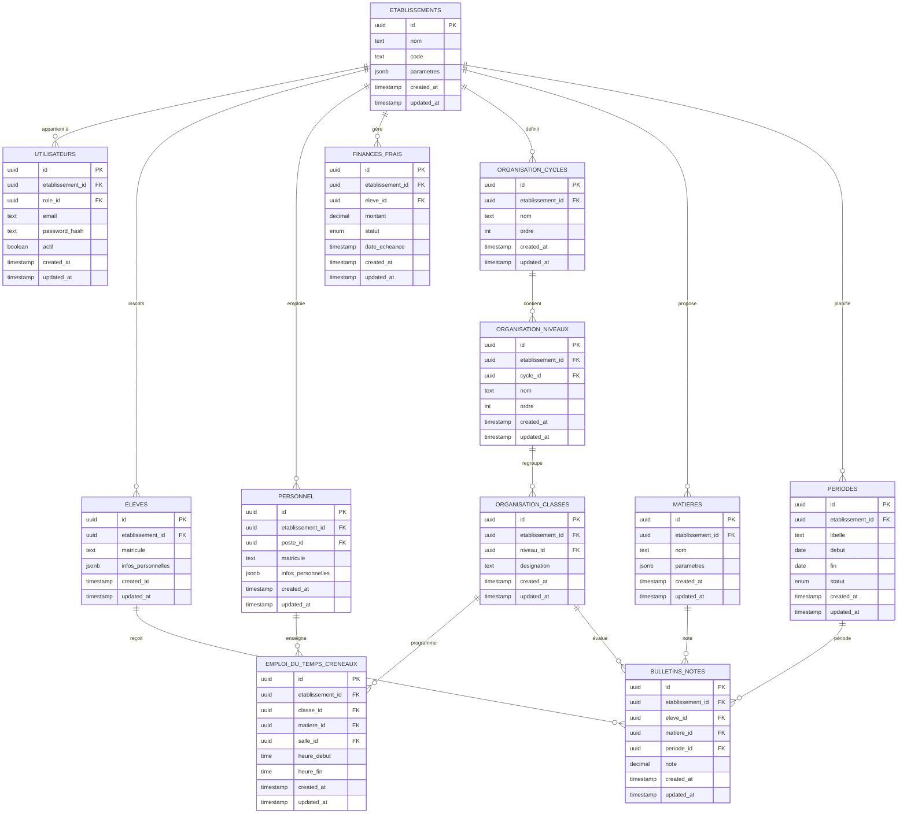
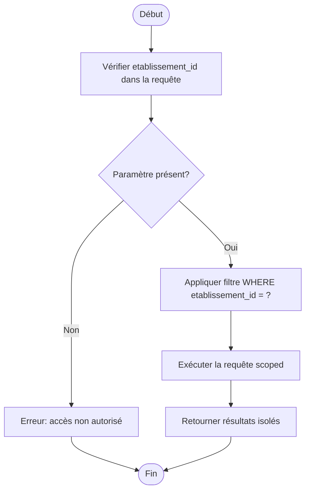
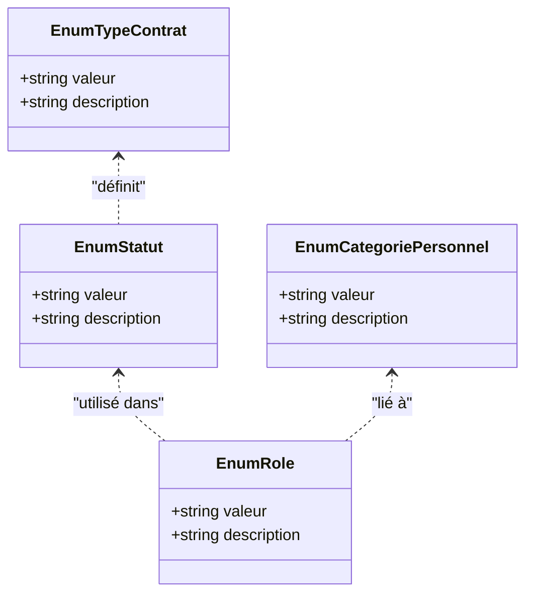
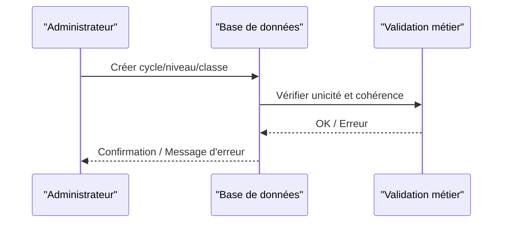
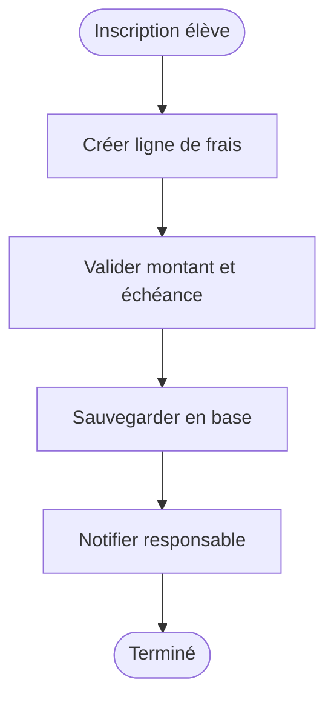
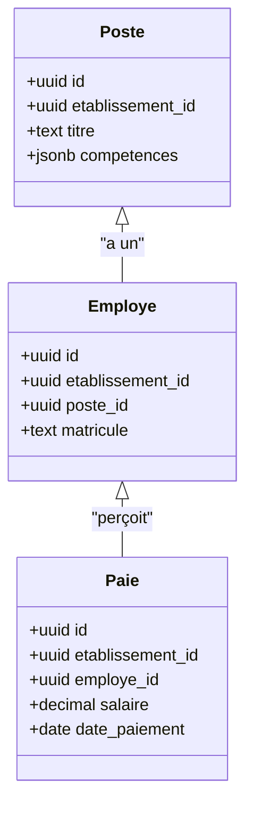
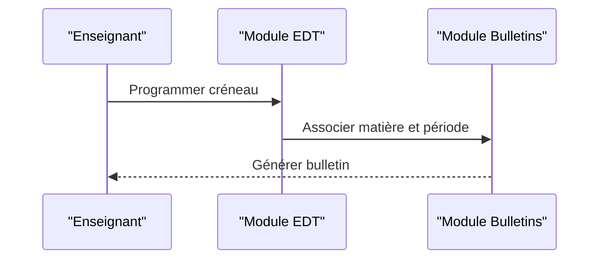
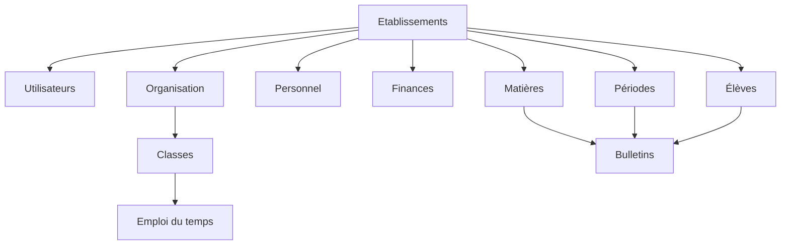

# Modèle de Données et Entités

<cite>
**Fichiers référencés dans ce document**
- [050-multi-tenant-v3-max-etablissements.sql](file://backend/database/migrations/050-multi-tenant-v3-max-etablissements.sql)
- [059-multi-tenant-matiere.sql](file://backend/database/migrations/059-multi-tenant-matiere.sql)
- [085-periode-etablissement-id.sql](file://backend/database/migrations/085-periode-etablissement-id.sql)
- [086-affectation-matiere-etablissement-id.sql](file://backend/database/migrations/086-affectation-matiere-etablissement-id.sql)
- [087-affectation-matiere-verifications.sql](file://backend/database/migrations/087-affectation-matiere-verifications.sql)
- [088-refactorisation-architecture-academique.sql](file://backend/database/migrations/088-refactorisation-architecture-academique.sql)
- [089-finalisation-architecture-academique-v2.sql](file://backend/database/migrations/089-finalisation-architecture-academique-v2.sql)
- [091-peuplement-architecture-academique.sql](file://backend/database/migrations/091-peuplement-architecture-academique.sql)
- [092-refactorisation-classeAnneeId.sql](file://backend/database/migrations/092-refactorisation-classeAnneeId.sql)
- [101-normalisation-annee-scolaire-cloture.sql](file://backend/database/migrations/101-normalisation-annee-scolaire-cloture.sql)
- [102-periodes-hierarchie.sql](file://backend/database/migrations/102-periodes-hierarchie.sql)
- [103-templates-periode-personnalisables.sql](file://backend/database/migrations/103-templates-periode-personnalisables.sql)
- [104-refonte-periodes-niveaux-configurables.sql](file://backend/database/migrations/104-refonte-periodes-niveaux-configurables.sql)
- [105-migration-templates-v5.sql](file://backend/database/migrations/105-migration-templates-v5.sql)
- [106-rename-sequence-to-evaluation.sql](file://backend/database/migrations/106-rename-sequence-to-evaluation.sql)
- [109-refonte-organisation.sql](file://backend/database/migrations/109-refonte-organisation.sql)
- [110-consolidation-organisation.sql](file://backend/database/migrations/110-consolidation-organisation.sql)
- [112-refonte-organisation-v4.sql](file://backend/database/migrations/112-refonte-organisation-v4.sql)
- [113-fix-unique-constraints-nomenclatures.sql](file://backend/database/migrations/113-fix-unique-constraints-nomenclatures.sql)
- [114-fusion-creneaux-horaires.sql](file://backend/database/migrations/114-fusion-creneaux-horaires.sql)
- [116-programme-intemporel.sql](file://backend/database/migrations/116-programme-intemporel.sql)
- [117-heure-cours-classe-annee.sql](file://backend/database/migrations/117-heure-cours-classe-annee.sql)
- [118-preferences-edt-enrichi.sql](file://backend/database/migrations/118-preferences-edt-enrichi.sql)
- [119-normalisation-echelons-structurels.sql](file://backend/database/migrations/119-normalisation-echelons-structurels.sql)
- [120-correction-vues-materialisees-organisation.sql](file://backend/database/migrations/120-correction-vues-materialisees-organisation.sql)
- [121-fonction-categorie-drop-type-personnel.sql](file://backend/database/migrations/121-fonction-categorie-drop-type-personnel.sql)
- [122-hierarchie-superieur-poste.sql](file://backend/database/migrations/122-hierarchie-superieur-poste.sql)
- [123-refonte-notes-bulletins.sql](file://backend/database/migrations/123-refonte-notes-bulletins.sql)
- [124-fix-hierarchie-orphelins.sql](file://backend/database/migrations/124-fix-hierarchie-orphelins.sql)
- [125-organigramme-read-tous-roles.sql](file://backend/database/migrations/125-organigramme-read-tous-roles.sql)
- [126-fix-vues-materialisees-statuts.sql](file://backend/database/migrations/126-fix-vues-materialisees-statuts.sql)
- [127-templates-organisation-categorisation.sql](file://backend/database/migrations/127-templates-organisation-categorisation.sql)
- [036-module-types-enum.sql](file://backend/database/migrations/036-module-types-enum.sql)
- [046-types-contrat-personnalises.sql](file://backend/database/migrations/046-types-contrat-personnalises.sql)
- [050-ameliorations-inscription-finances.sql](file://backend/database/migrations/050-ameliorations-inscription-finances.sql)
- [051-champs-preinscription-enrichis.sql](file://backend/database/migrations/051-champs-preinscription-enrichis.sql)
- [052-approche-hybride-parents.sql](file://backend/database/migrations/052-approche-hybride-parents.sql)
- [053-structure-academique-complete.sql](file://backend/database/migrations/053-structure-academique-complete.sql)
- [054-refonte-structure-academique-v2.sql](file://backend/database/migrations/054-refonte-structure-academique-v2.sql)
- [055-structure-academique-ameliorations.sql](file://backend/database/migrations/055-structure-academique-ameliorations.sql)
- [056-suppression-cycle-scolaire.sql](file://backend/database/migrations/056-suppression-cycle-scolaire.sql)
- [057-supprimer-niveau-filiere-id.sql](file://backend/database/migrations/057-supprimer-niveau-filiere-id.sql)
- [058-multi-tenant-structure-academique.sql](file://backend/database/migrations/058-multi-tenant-structure-academique.sql)
- [059-multi-tenant-matiere.sql](file://backend/database/migrations/059-multi-tenant-matiere.sql)
- [060-ajouter-affectation-matiere-coefficient.sql](file://backend/database/migrations/060-ajouter-affectation-matiere-coefficient.sql)
- [061-creer-table-bulletins-matieres.sql](file://backend/database/migrations/061-creer-table-bulletins-matieres.sql)
- [062-creer-table-evaluations-competences.sql](file://backend/database/migrations/062-creer-table-evaluations-competences.sql)
- [063-creer-module-emploi-du-temps.sql](file://backend/database/migrations/063-creer-module-emploi-du-temps.sql)
- [064-validateur-sous-systeme.sql](file://backend/database/migrations/064-validateur-sous-systeme.sql)
- [065-creer-templates-emploi-du-temps.sql](file://backend/database/migrations/065-creer-templates-emploi-du-temps.sql)
- [069-fix-super-admin-permissions.sql](file://backend/database/migrations/069-fix-super-admin-permissions.sql)
- [070-fix-super-admin-all-permission.sql](file://backend/database/migrations/070-fix-super-admin-all-permission.sql)
- [070-module-salles.sql](file://backend/database/migrations/070-module-salles.sql)
- [072-scoping-cycles-niveaux.sql](file://backend/database/migrations/072-scoping-cycles-niveaux.sql)
- [073-competence-unique-composite.sql](file://backend/database/migrations/073-competence-unique-composite.sql)
- [074-matiere-niveau-unique-composite.sql](file://backend/database/migrations/074-matiere-niveau-unique-composite.sql)
- [075-module-groupes-etablissements.sql](file://backend/database/migrations/075-module-groupes-etablissements.sql)
- [076-permissions-groupes-etablissements.sql](file://backend/database/migrations/076-permissions-groupes-etablissements.sql)
- [077-update-permissions-groupes.sql](file://backend/database/migrations/077-update-permissions-groupes.sql)
- [078-utilisateur-test-groupes.sql](file://backend/database/migrations/078-utilisateur-test-groupes.sql)
- [079-add-roleId-utilisateur-etablissements.sql](file://backend/database/migrations/079-add-roleId-utilisateur-etablissements.sql)
- [079-correction-permissions-groupes.sql](file://backend/database/migrations/079-correction-permissions-groupes.sql)
- [080-preferences-utilisateur-multi-tenant.sql](file://backend/database/migrations/080-preferences-utilisateur-multi-tenant.sql)
- [081-module-apparence-fonds.sql](file://backend/database/migrations/081-module-apparence-fonds.sql)
- [082-fix-contrainte-unique-preferences.sql](file://backend/database/migrations/082-fix-contrainte-unique-preferences.sql)
- [083-fix-contrainte-unique-parametres.sql](file://backend/database/migrations/083-fix-contrainte-unique-parametres.sql)
- [084-cleanup-classe-id-notes.sql](file://backend/database/migrations/084-cleanup-classe-id-notes.sql)
- [099-add-monitoring-params.sql](file://backend/database/migrations/099-add-monitoring-params.sql)
- [100-classes-salle-principale.sql](file://backend/database/migrations/100-classes-salle-principale.sql)
- [128-fix-indexes-performance.sql](file://backend/database/migrations/128-fix-indexes-performance.sql)
- [009-performance-indexes.sql](file://backend/database/migrations/009-performance-indexes.sql)
- [010-module-finances.sql](file://backend/database/migrations/010-module-finances.sql)
- [011-module-finances-part2.sql](file://backend/database/migrations/011-module-finances-part2.sql)
- [012-module-finances-part3-parametres.sql](file://backend/database/migrations/012-module-finances-part3-parametres.sql)
- [013-module-finances-phase1-granularite.sql](file://backend/database/migrations/013-module-finances-phase1-granularite.sql)
- [014-module-finances-phase2-section.sql](file://backend/database/migrations/014-module-finances-phase2-section.sql)
- [016-module-personnel-rh-phase1.sql](file://backend/database/migrations/016-module-personnel-rh-phase1.sql)
- [017-module-personnel-rh-phase2.sql](file://backend/database/migrations/017-module-personnel-rh-phase2.sql)
- [018-module-personnel-rh-phase3.sql](file://backend/database/migrations/018-module-personnel-rh-phase3.sql)
- [019-module-personnel-rh-phase4.sql](file://backend/database/migrations/019-module-personnel-rh-phase4.sql)
- [020-module-personnel-rh-phase5.sql](file://backend/database/migrations/020-module-personnel-rh-phase5.sql)
- [021-module-personnel-rh-permissions-attribution.sql](file://backend/database/migrations/021-module-personnel-rh-permissions-attribution.sql)
- [022-module-personnel-rh-complete.sql](file://backend/database/migrations/022-module-personnel-rh-complete.sql)
- [023-etablissement-champs-additionnels.sql](file://backend/database/migrations/023-etablissement-champs-additionnels.sql)
- [024-eleve-champs-additionnels.sql](file://backend/database/migrations/024-eleve-champs-additionnels.sql)
- [025-responsable-champs-additionnels.sql](file://backend/database/migrations/025-responsable-champs-additionnels.sql)
- [026-personnel-champs-additionnels.sql](file://backend/database/migrations/026-personnel-champs-additionnels.sql)
- [027-auth-multi-mode.sql](file://backend/database/migrations/027-auth-multi-mode.sql)
- [028-cartes-modeles-batch.sql](file://backend/database/migrations/028-cartes-modeles-batch.sql)
- [029-paie-etendue.sql](file://backend/database/migrations/029-paie-etendue.sql)
- [030-suivi-eleves.sql](file://backend/database/migrations/030-suivi-eleves.sql)
- [031-suivi-personnel.sql](file://backend/database/migrations/031-suivi-personnel.sql)
- [032-sante.sql](file://backend/database/migrations/032-sante.sql)
- [033-workflow-permissions-nouveaux-modules.sql](file://backend/database/migrations/033-workflow-permissions-nouveaux-modules.sql)
- [034-annee-scolaire-suivi.sql](file://backend/database/migrations/034-annee-scolaire-suivi.sql)
- [035-contexte-africain-periodes.sql](file://backend/database/migrations/035-contexte-africain-periodes.sql)
- [035b-migration-donnees-periodes.sql](file://backend/database/migrations/035b-migration-donnees-periodes.sql)
- [037-gamification-tracabilite.ts](file://backend/database/migrations/037-gamification-tracabilite.ts)
- [038-index-performance-gamification-suivi.ts](file://backend/database/migrations/038-index-performance-gamification-suivi.ts)
- [039-scoring-personnel.ts](file://backend/database/migrations/039-scoring-personnel.ts)
- [040-reset-capabilities.sql](file://backend/database/migrations/040-reset-capabilities.sql)
- [041-module-annonces-complete.sql](file://backend/database/migrations/041-module-annonces-complete.sql)
- [041-module-annonces-fix.sql](file://backend/database/migrations/041-module-annonces-fix.sql)
- [041-module-annonces.sql](file://backend/database/migrations/041-module-annonces.sql)
- [041-module-sondages.sql](file://backend/database/migrations/041-module-sondages.sql)
- [042-annonces-performance-optimization.sql](file://backend/database/migrations/042-annonces-performance-optimization.sql)
- [042-sondages-recurrents.sql](file://backend/database/migrations/042-sondages-recurrents.sql)
- [043-correction-dossier-medical-fk.ts](file://backend/database/migrations/043-correction-dossier-medical-fk.ts)
- [043-module-messagerie-complete.sql](file://backend/database/migrations/043-module-messagerie-complete.sql)
- [043-permissions-critiques-manquantes.sql](file://backend/database/migrations/043-permissions-critiques-manquantes.sql)
- [043-structure-academique-v4.sql](file://backend/database/migrations/043-structure-academique-v4.sql)
- [044-messagerie-optimisations-v2.1.sql](file://backend/database/migrations/044-messagerie-optimisations-v2.1.sql)
- [044-module-organisation.sql](file://backend/database/migrations/044-module-organisation.sql)
- [045-messagerie-fonctionnalites-avancees-v2.2.sql](file://backend/database/migrations/045-messagerie-fonctionnalites-avancees-v2.2.sql)
- [045-module-recrutement.sql](file://backend/database/migrations/045-module-recrutement.sql)
- [045-organisation-optimisations.sql](file://backend/database/migrations/045-organisation-optimisations.sql)
- [045-preferences-role.sql](file://backend/database/migrations/045-preferences-role.sql)
- [046-dashboard-config.sql](file://backend/database/migrations/046-dashboard-config.sql)
- [046-organisation-performance-avancee.sql](file://backend/database/migrations/046-organisation-performance-avancee.sql)
- [046-preferences-utilisateur-et-config.sql](file://backend/database/migrations/046-preferences-utilisateur-et-config.sql)
- [047-notifications-ameliorations.sql](file://backend/database/migrations/047-notifications-ameliorations.sql)
- [047-optimisations-performance-v3.1.sql](file://backend/database/migrations/047-optimisations-performance-v3.1.sql)
- [048-notifications-performance-optimizations.sql](file://backend/database/migrations/048-notifications-performance-optimizations.sql)
- [049-ameliorations-inscription-finances.sql](file://backend/database/migrations/049-ameliorations-inscription-finances.sql)
- [050-ameliorations-inscription-relances.sql](file://backend/database/migrations/050-ameliorations-inscription-relances.sql)
- [050-etablissements-couleurs.sql](file://backend/database/migrations/050-etablissements-couleurs.sql)
- [050-multi-tenant-v3-max-etablissements.sql](file://backend/database/migrations/050-multi-tenant-v3-max-etablissements.sql)
- [050-suppression-utilisateur-etablissementId.sql](file://backend/database/migrations/050-suppression-utilisateur-etablissementId.sql)
</cite>

## Table des matières
1. [Introduction](#introduction)
2. [Structure du projet](#structure-du-projet)
3. [Composants clés](#composants-clés)
4. [Vue d'ensemble de l'architecture](#vue-densemble-de-larchitecture)
5. [Analyse détaillée des composants](#analyse-detaillee-des-composants)
6. [Analyse des dépendances](#analyse-des-dependances)
7. [Considérations de performance](#considerations-de-performance)
8. [Guide de dépannage](#guide-de-depannage)
9. [Conclusion](#conclusion)
10. [Annexes](#annexes)

## Introduction
Ce document présente le modèle de données d'eLISAschool, en se concentrant sur les entités principales (utilisateurs, établissements, élèves, personnel, finances), leurs relations, contraintes, index et règles métier implémentées au niveau de la base de données. Il explique également le schéma multi-tenant avec isolation par établissement, les types de données personnalisés et énumérations, ainsi que les triggers et procédures stockées associés. Des diagrammes ERD, des séquences d’appels et des exemples de requêtes complexes sont fournis pour faciliter la compréhension et l’exploitation du schéma.

## Structure du projet
Le schéma est défini et évolue via un ensemble de fichiers de migration SQL/Ts situés dans backend/database/migrations. Les migrations couvrent plusieurs modules : organisation, structure académique, finances, personnel/RH, emploi du temps, messagerie, notifications, gamification, etc. L’isolation multi-tenant s’appuie sur une colonne etablissement_id présente dans la plupart des tables métier.

```mermaid
graph TB
subgraph "Migrations"
M1["050-multi-tenant-v3-max-etablissements.sql"]
M2["059-multi-tenant-matiere.sql"]
M3["088-refactorisation-architecture-academique.sql"]
M4["089-finalisation-architecture-academique-v2.sql"]
M5["109-refonte-organisation.sql"]
M6["110-consolidation-organisation.sql"]
M7["112-refonte-organisation-v4.sql"]
M8["010-module-finances.sql"]
M9["016-module-personnel-rh-phase1.sql"]
M10["063-creer-module-emploi-du-temps.sql"]
M11["036-module-types-enum.sql"]
M12["046-types-contrat-personnalises.sql"]
M13["009-performance-indexes.sql"]
end
M1 --> M2
M2 --> M3
M3 --> M4
M4 --> M5
M5 --> M6
M6 --> M7
M7 --> M8
M8 --> M9
M9 --> M10
M10 --> M11
M11 --> M12
M12 --> M13
```

**Sources de diagramme**
- [050-multi-tenant-v3-max-etablissements.sql](file://backend/database/migrations/050-multi-tenant-v3-max-etablissements.sql)
- [059-multi-tenant-matiere.sql](file://backend/database/migrations/059-multi-tenant-matiere.sql)
- [088-refactorisation-architecture-academique.sql](file://backend/database/migrations/088-refactorisation-architecture-academique.sql)
- [089-finalisation-architecture-academique-v2.sql](file://backend/database/migrations/089-finalisation-architecture-academique-v2.sql)
- [109-refonte-organisation.sql](file://backend/database/migrations/109-refonte-organisation.sql)
- [110-consolidation-organisation.sql](file://backend/database/migrations/110-consolidation-organisation.sql)
- [112-refonte-organisation-v4.sql](file://backend/database/migrations/112-refonte-organisation-v4.sql)
- [010-module-finances.sql](file://backend/database/migrations/010-module-finances.sql)
- [016-module-personnel-rh-phase1.sql](file://backend/database/migrations/016-module-personnel-rh-phase1.sql)
- [063-creer-module-emploi-du-temps.sql](file://backend/database/migrations/063-creer-module-emploi-du-temps.sql)
- [036-module-types-enum.sql](file://backend/database/migrations/036-module-types-enum.sql)
- [046-types-contrat-personnalises.sql](file://backend/database/migrations/046-types-contrat-personnalises.sql)
- [009-performance-indexes.sql](file://backend/database/migrations/009-performance-indexes.sql)

**Sources de section**
- [050-multi-tenant-v3-max-etablissements.sql](file://backend/database/migrations/050-multi-tenant-v3-max-etablissements.sql)
- [088-refactorisation-architecture-academique.sql](file://backend/database/migrations/088-refactorisation-architecture-academique.sql)
- [109-refonte-organisation.sql](file://backend/database/migrations/109-refonte-organisation.sql)
- [010-module-finances.sql](file://backend/database/migrations/010-module-finances.sql)
- [016-module-personnel-rh-phase1.sql](file://backend/database/migrations/016-module-personnel-rh-phase1.sql)
- [063-creer-module-emploi-du-temps.sql](file://backend/database/migrations/063-creer-module-emploi-du-temps.sql)
- [036-module-types-enum.sql](file://backend/database/migrations/036-module-types-enum.sql)
- [046-types-contrat-personnalises.sql](file://backend/database/migrations/046-types-contrat-personnalises.sql)
- [009-performance-indexes.sql](file://backend/database/migrations/009-performance-indexes.sql)

## Composants clés
- Établissements: entité racine multi-tenant; toutes les données métier incluent un identifiant d’établissement pour l’isolation.
- Utilisateurs: authentification et autorisation; rôle et permissions liés à un établissement.
- Élèves: inscriptions, suivi, santé, responsables.
- Personnel: postes, hiérarchie, paie, suivi, attributions.
- Finances: frais, paiements, remises, sections, paramètres.
- Organisation et structure académique: cycles, niveaux, classes, matières, périodes, emplois du temps, bulletins, évaluations.

**Sources de section**
- [050-multi-tenant-v3-max-etablissements.sql](file://backend/database/migrations/050-multi-tenant-v3-max-etablissements.sql)
- [027-auth-multi-mode.sql](file://backend/database/migrations/027-auth-multi-mode.sql)
- [024-eleve-champs-additionnels.sql](file://backend/database/migrations/024-eleve-champs-additionnels.sql)
- [026-personnel-champs-additionnels.sql](file://backend/database/migrations/026-personnel-champs-additionnels.sql)
- [010-module-finances.sql](file://backend/database/migrations/010-module-finances.sql)
- [088-refactorisation-architecture-academique.sql](file://backend/database/migrations/088-refactorisation-architecture-academique.sql)

## Vue d'ensemble de l'architecture
Le schéma suit une architecture modulaire où chaque module définit ses propres tables et relations, tout en respectant le scoping par etablissement_id. Les migrations récentes ont normalisé et consolidé l’organisation, la structure académique et les périodes, tout en ajoutant des index et des vérifications pour garantir l’intégrité et la performance.

**Sources de diagramme**
- [050-multi-tenant-v3-max-etablissements.sql](file://backend/database/migrations/050-multi-tenant-v3-max-etablissements.sql)
- [027-auth-multi-mode.sql](file://backend/database/migrations/027-auth-multi-mode.sql)
- [024-eleve-champs-additionnels.sql](file://backend/database/migrations/024-eleve-champs-additionnels.sql)
- [026-personnel-champs-additionnels.sql](file://backend/database/migrations/026-personnel-champs-additionnels.sql)
- [010-module-finances.sql](file://backend/database/migrations/010-module-finances.sql)
- [088-refactorisation-architecture-academique.sql](file://backend/database/migrations/088-refactorisation-architecture-academique.sql)
- [063-creer-module-emploi-du-temps.sql](file://backend/database/migrations/063-creer-module-emploi-du-temps.sql)
- [061-creer-table-bulletins-matieres.sql](file://backend/database/migrations/061-creer-table-bulletins-matieres.sql)
- [102-periodes-hierarchie.sql](file://backend/database/migrations/102-periodes-hierarchie.sql)

## Analyse détaillée des composants

### Multi-tenant et isolation par établissement
- La colonne etablissement_id est systématiquement utilisée pour isoler les données entre établissements.
- Des migrations spécifiques renforcent cette isolation et étendent les capacités (nombre maximal d’établissements, scoping des matières, etc.).

**Sources de diagramme**
- [050-multi-tenant-v3-max-etablissements.sql](file://backend/database/migrations/050-multi-tenant-v3-max-etablissements.sql)
- [059-multi-tenant-matiere.sql](file://backend/database/migrations/059-multi-tenant-matiere.sql)

**Sources de section**
- [050-multi-tenant-v3-max-etablissements.sql](file://backend/database/migrations/050-multi-tenant-v3-max-etablissements.sql)
- [059-multi-tenant-matiere.sql](file://backend/database/migrations/059-multi-tenant-matiere.sql)
- [085-periode-etablissement-id.sql](file://backend/database/migrations/085-periode-etablissement-id.sql)
- [086-affectation-matiere-etablissement-id.sql](file://backend/database/migrations/086-affectation-matiere-etablissement-id.sql)

### Types de données personnalisés et énumérations
- Les types personnalisés et énumérations sont définis pour standardiser les valeurs (statuts, catégories, rôles, etc.).
- Des migrations créent ou corrigent ces types pour assurer la cohérence du schéma.

**Sources de diagramme**
- [036-module-types-enum.sql](file://backend/database/migrations/036-module-types-enum.sql)
- [046-types-contrat-personnalises.sql](file://backend/database/migrations/046-types-contrat-personnalises.sql)

**Sources de section**
- [036-module-types-enum.sql](file://backend/database/migrations/036-module-types-enum.sql)
- [046-types-contrat-personnalises.sql](file://backend/database/migrations/046-types-contrat-personnalises.sql)

### Organisation et structure académique
- Normalisation des cycles, niveaux, classes et matières avec scoping par établissement.
- Périodes et emplois du temps planifiés par classe et matière, avec vérifications d’intégrité.

**Sources de diagramme**
- [088-refactorisation-architecture-academique.sql](file://backend/database/migrations/088-refactorisation-architecture-academique.sql)
- [089-finalisation-architecture-academique-v2.sql](file://backend/database/migrations/089-finalisation-architecture-academique-v2.sql)
- [091-peuplement-architecture-academique.sql](file://backend/database/migrations/091-peuplement-architecture-academique.sql)
- [092-refactorisation-classeAnneeId.sql](file://backend/database/migrations/092-refactorisation-classeAnneeId.sql)
- [102-periodes-hierarchie.sql](file://backend/database/migrations/102-periodes-hierarchie.sql)
- [104-refonte-periodes-niveaux-configurables.sql](file://backend/database/migrations/104-refonte-periodes-niveaux-configurables.sql)

**Sources de section**
- [088-refactorisation-architecture-academique.sql](file://backend/database/migrations/088-refactorisation-architecture-academique.sql)
- [089-finalisation-architecture-academique-v2.sql](file://backend/database/migrations/089-finalisation-architecture-academique-v2.sql)
- [091-peuplement-architecture-academique.sql](file://backend/database/migrations/091-peuplement-architecture-academique.sql)
- [092-refactorisation-classeAnneeId.sql](file://backend/database/migrations/092-refactorisation-classeAnneeId.sql)
- [102-periodes-hierarchie.sql](file://backend/database/migrations/102-periodes-hierarchie.sql)
- [104-refonte-periodes-niveaux-configurables.sql](file://backend/database/migrations/104-refonte-periodes-niveaux-configurables.sql)

### Finances
- Gestion des frais, paiements, remises et sections avec paramètres spécifiques.
- Contraintes et index optimisés pour les requêtes fréquentes.

**Sources de diagramme**
- [010-module-finances.sql](file://backend/database/migrations/010-module-finances.sql)
- [011-module-finances-part2.sql](file://backend/database/migrations/011-module-finances-part2.sql)
- [012-module-finances-part3-parametres.sql](file://backend/database/migrations/012-module-finances-part3-parametres.sql)
- [013-module-finances-phase1-granularite.sql](file://backend/database/migrations/013-module-finances-phase1-granularite.sql)
- [014-module-finances-phase2-section.sql](file://backend/database/migrations/014-module-finances-phase2-section.sql)
- [049-ameliorations-inscription-finances.sql](file://backend/database/migrations/049-ameliorations-inscription-finances.sql)
- [050-ameliorations-inscription-finances.sql](file://backend/database/migrations/050-ameliorations-inscription-finances.sql)
- [050-ameliorations-inscription-relances.sql](file://backend/database/migrations/050-ameliorations-inscription-relances.sql)

**Sources de section**
- [010-module-finances.sql](file://backend/database/migrations/010-module-finances.sql)
- [011-module-finances-part2.sql](file://backend/database/migrations/011-module-finances-part2.sql)
- [012-module-finances-part3-parametres.sql](file://backend/database/migrations/012-module-finances-part3-parametres.sql)
- [013-module-finances-phase1-granularite.sql](file://backend/database/migrations/013-module-finances-phase1-granularite.sql)
- [014-module-finances-phase2-section.sql](file://backend/database/migrations/014-module-finances-phase2-section.sql)
- [049-ameliorations-inscription-finances.sql](file://backend/database/migrations/049-ameliorations-inscription-finances.sql)
- [050-ameliorations-inscription-finances.sql](file://backend/database/migrations/050-ameliorations-inscription-finances.sql)
- [050-ameliorations-inscription-relances.sql](file://backend/database/migrations/050-ameliorations-inscription-relances.sql)

### Personnel et RH
- Postes, hiérarchie, paie, suivi et attributions avec validation des relations et intégrité.

**Sources de diagramme**
- [016-module-personnel-rh-phase1.sql](file://backend/database/migrations/016-module-personnel-rh-phase1.sql)
- [017-module-personnel-rh-phase2.sql](file://backend/database/migrations/017-module-personnel-rh-phase2.sql)
- [018-module-personnel-rh-phase3.sql](file://backend/database/migrations/018-module-personnel-rh-phase3.sql)
- [019-module-personnel-rh-phase4.sql](file://backend/database/migrations/019-module-personnel-rh-phase4.sql)
- [020-module-personnel-rh-phase5.sql](file://backend/database/migrations/020-module-personnel-rh-phase5.sql)
- [021-module-personnel-rh-permissions-attribution.sql](file://backend/database/migrations/021-module-personnel-rh-permissions-attribution.sql)
- [022-module-personnel-rh-complete.sql](file://backend/database/migrations/022-module-personnel-rh-complete.sql)
- [029-paie-etendue.sql](file://backend/database/migrations/029-paie-etendue.sql)
- [122-hierarchie-superieur-poste.sql](file://backend/database/migrations/122-hierarchie-superieur-poste.sql)

**Sources de section**
- [016-module-personnel-rh-phase1.sql](file://backend/database/migrations/016-module-personnel-rh-phase1.sql)
- [017-module-personnel-rh-phase2.sql](file://backend/database/migrations/017-module-personnel-rh-phase2.sql)
- [018-module-personnel-rh-phase3.sql](file://backend/database/migrations/018-module-personnel-rh-phase3.sql)
- [019-module-personnel-rh-phase4.sql](file://backend/database/migrations/019-module-personnel-rh-phase4.sql)
- [020-module-personnel-rh-phase5.sql](file://backend/database/migrations/020-module-personnel-rh-phase5.sql)
- [021-module-personnel-rh-permissions-attribution.sql](file://backend/database/migrations/021-module-personnel-rh-permissions-attribution.sql)
- [022-module-personnel-rh-complete.sql](file://backend/database/migrations/022-module-personnel-rh-complete.sql)
- [029-paie-etendue.sql](file://backend/database/migrations/029-paie-etendue.sql)
- [122-hierarchie-superieur-poste.sql](file://backend/database/migrations/122-hierarchie-superieur-poste.sql)

### Emploi du temps et bulletins
- Planification des cours par classe et matière, avec salles et enseignants.
- Notes et évaluations liées aux élèves, matières et périodes.

**Sources de diagramme**
- [063-creer-module-emploi-du-temps.sql](file://backend/database/migrations/063-creer-module-emploi-du-temps.sql)
- [065-creer-templates-emploi-du-temps.sql](file://backend/database/migrations/065-creer-templates-emploi-du-temps.sql)
- [061-creer-table-bulletins-matieres.sql](file://backend/database/migrations/061-creer-table-bulletins-matieres.sql)
- [117-heure-cours-classe-annee.sql](file://backend/database/migrations/117-heure-cours-classe-annee.sql)
- [123-refonte-notes-bulletins.sql](file://backend/database/migrations/123-refonte-notes-bulletins.sql)

**Sources de section**
- [063-creer-module-emploi-du-temps.sql](file://backend/database/migrations/063-creer-module-emploi-du-temps.sql)
- [065-creer-templates-emploi-du-temps.sql](file://backend/database/migrations/065-creer-templates-emploi-du-temps.sql)
- [061-creer-table-bulletins-matieres.sql](file://backend/database/migrations/061-creer-table-bulletins-matieres.sql)
- [117-heure-cours-classe-annee.sql](file://backend/database/migrations/117-heure-cours-classe-annee.sql)
- [123-refonte-notes-bulletins.sql](file://backend/database/migrations/123-refonte-notes-bulletins.sql)

## Analyse des dépendances
Les modules dépendent fortement de l’entité Etablissements pour l’isolation. Les relations 1:N dominent (un établissement a plusieurs utilisateurs, élèves, personnels, etc.), avec quelques N:M implicites via des tables intermédiaires (affectations, bulletins).

**Sources de diagramme**
- [050-multi-tenant-v3-max-etablissements.sql](file://backend/database/migrations/050-multi-tenant-v3-max-etablissements.sql)
- [088-refactorisation-architecture-academique.sql](file://backend/database/migrations/088-refactorisation-architecture-academique.sql)
- [063-creer-module-emploi-du-temps.sql](file://backend/database/migrations/063-creer-module-emploi-du-temps.sql)
- [061-creer-table-bulletins-matieres.sql](file://backend/database/migrations/061-creer-table-bulletins-matieres.sql)

**Sources de section**
- [050-multi-tenant-v3-max-etablissements.sql](file://backend/database/migrations/050-multi-tenant-v3-max-etablissements.sql)
- [088-refactorisation-architecture-academique.sql](file://backend/database/migrations/088-refactorisation-architecture-academique.sql)
- [063-creer-module-emploi-du-temps.sql](file://backend/database/migrations/063-creer-module-emploi-du-temps.sql)
- [061-creer-table-bulletins-matieres.sql](file://backend/database/migrations/061-creer-table-bulletins-matieres.sql)

## Considérations de performance
- Index critiques ajoutés pour accélérer les jointures et filtres par etablissement_id, matiere_id, periode_id, eleve_id.
- Vues matérialisées utilisées pour les statistiques et rapports fréquents.
- Nettoyage et consolidation des contraintes uniques et des index obsolètes.

**Sources de section**
- [009-performance-indexes.sql](file://backend/database/migrations/009-performance-indexes.sql)
- [120-correction-vues-materialisees-organisation.sql](file://backend/database/migrations/120-correction-vues-materialisees-organisation.sql)
- [113-fix-unique-constraints-nomenclatures.sql](file://backend/database/migrations/113-fix-unique-constraints-nomenclatures.sql)
- [128-fix-indexes-performance.sql](file://backend/database/migrations/128-fix-indexes-performance.sql)

## Guide de dépannage
- Problèmes d’accès multi-tenant: vérifier la présence et la validité de etablissement_id dans les requêtes.
- Erreurs de contraintes uniques: examiner les migrations de correction des nomenclatures et préférences.
- Performances dégradées: analyser les index manquants ou redondants via les scripts d’analyse.

**Sources de section**
- [050-multi-tenant-v3-max-etablissements.sql](file://backend/database/migrations/050-multi-tenant-v3-max-etablissements.sql)
- [113-fix-unique-constraints-nomenclatures.sql](file://backend/database/migrations/113-fix-unique-constraints-nomenclatures.sql)
- [009-performance-indexes.sql](file://backend/database/migrations/009-performance-indexes.sql)
- [128-fix-indexes-performance.sql](file://backend/database/migrations/128-fix-indexes-performance.sql)

## Conclusion
Le modèle de données d’eLISAschool est structuré autour d’un schéma multi-tenant robuste, avec une forte isolation par établissement, des types personnalisés et énumérations bien définis, et des migrations évolutives qui garantissent l’intégrité et la performance. Les modules financiers, RH, organisation et académique sont soigneusement interconnectés, permettant des requêtes complexes et des rapports fiables.

## Annexes
- Exemples de requêtes SQL complexes:
  - Sélection des notes d’un élève sur une période donnée, filtrée par établissement et matière.
  - Calcul des totaux de frais impayés par élève et établissement.
  - Liste des créneaux d’emploi du temps pour une classe, avec salle et enseignant.
- Patterns d’accès optimisés:
  - Utilisation systématique de etablissement_id dans les clauses WHERE.
  - Jointures sur les clés étrangères indexées.
  - Agrégations via vues matérialisées pour les tableaux de bord.

[No sources needed since this section provides general guidance]