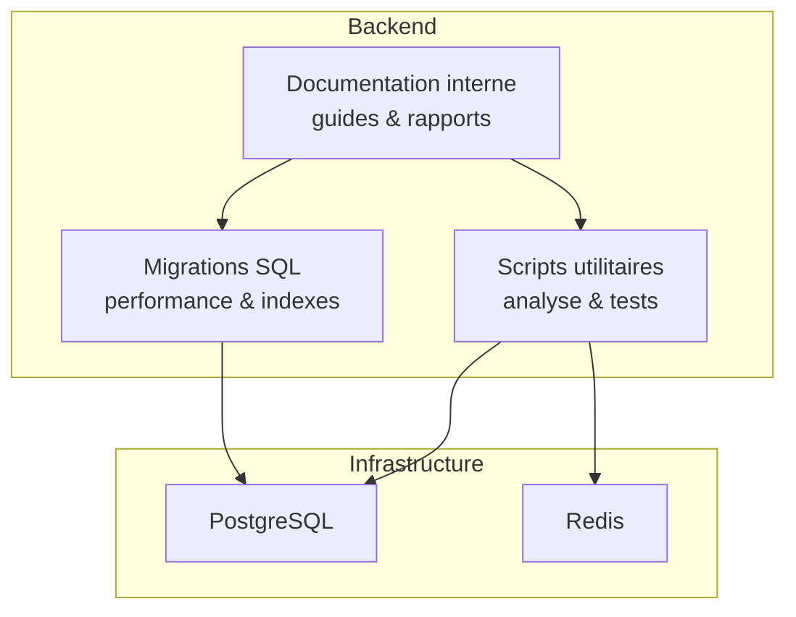
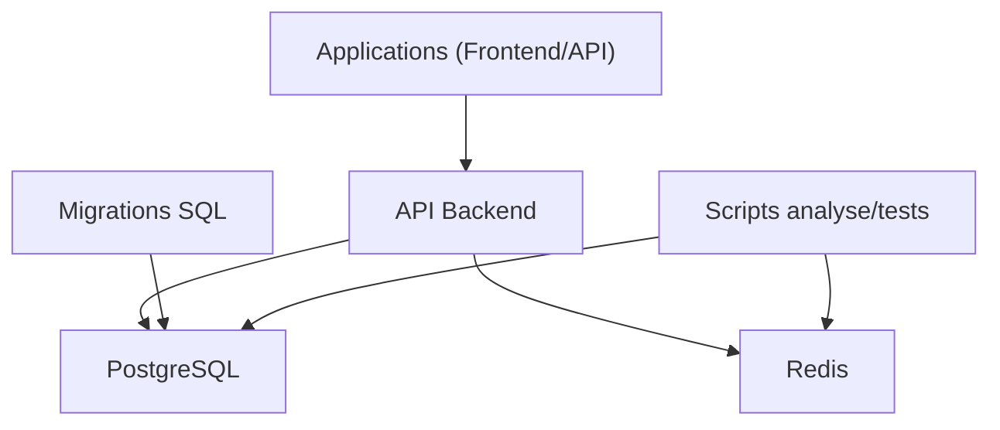
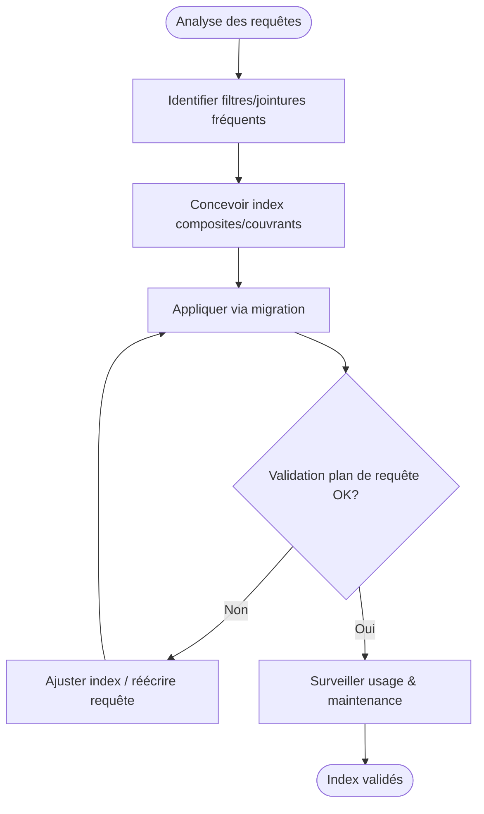
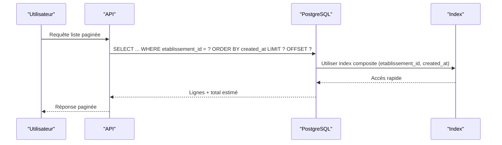
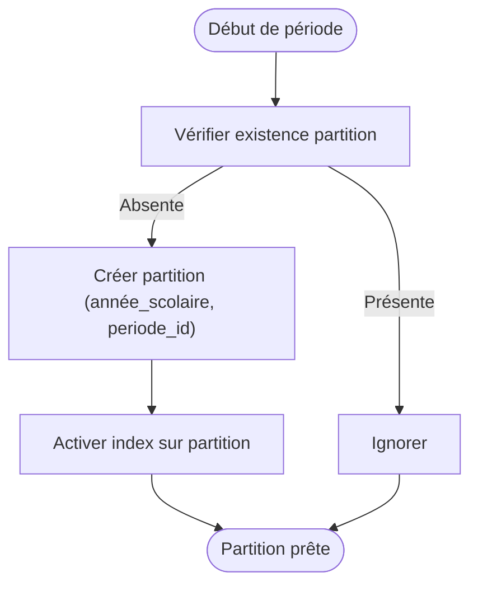
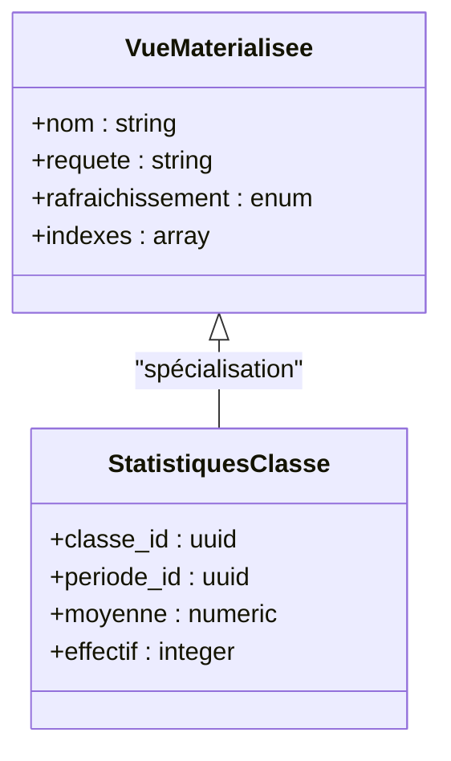
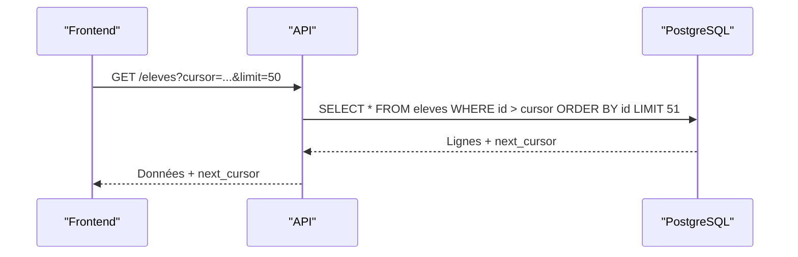
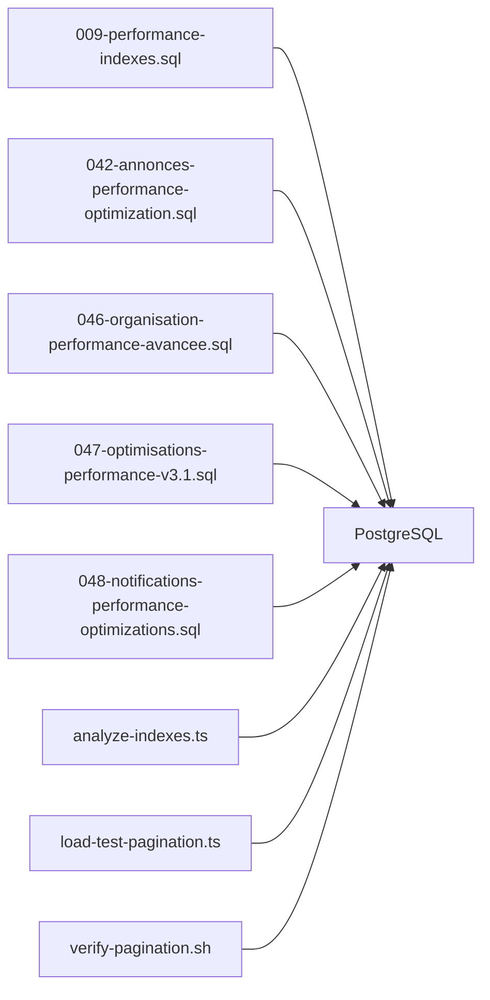

# Optimisations et Indexation

<cite>
**Fichiers référencés dans ce document**
- [009-performance-indexes.sql](file://backend/database/migrations/009-performance-indexes.sql)
- [042-annonces-performance-optimization.sql](file://backend/database/migrations/042-annonces-performance-optimization.sql)
- [046-organisation-performance-avancee.sql](file://backend/database/migrations/046-organisation-performance-avancee.sql)
- [047-optimisations-performance-v3.1.sql](file://backend/database/migrations/047-optimisations-performance-v3.1.sql)
- [048-notifications-performance-optimizations.sql](file://backend/database/migrations/048-notifications-performance-optimizations.sql)
- [050-multi-tenant-v3-max-etablissements.sql](file://backend/database/migrations/050-multi-tenant-v3-max-etablissements.sql)
- [099-add-monitoring-params.sql](file://backend/database/migrations/099-add-monitoring-params.sql)
- [120-cleanup-vues-materialisees-organisation.sql](file://backend/database/migrations/120-cleanup-vues-materialisees-organisation.sql)
- [126-fix-vues-materialisees-statuts.sql](file://backend/database/migrations/126-fix-vues-materialisees-statuts.sql)
- [pagination-guide.md](file://backend/docs/pagination-guide.md)
- [pagination-migration-status.ts](file://backend/docs/pagination-migration-status.ts)
- [analyze-indexes.ts](file://backend/scripts/analyze-indexes.ts)
- [run-indexes.sh](file://backend/scripts/run-indexes.sh)
- [load-test-pagination.ts](file://backend/scripts/load-test-pagination.ts)
- [verify-pagination.sh](file://backend/scripts/verify-pagination.sh)
- [REDIS-CONFIGURATION.md](file://docs/autres/REDIS-CONFIGURATION.md)
- [OPTIMISATIONS-PERFORMANCE-V3.1.md](file://docs/OPTIMISATIONS-PERFORMANCE-V3.1.md)
- [RAPPORT-FINAL-PAGINATION.md](file://docs/rapports/RAPPORT-FINAL-PAGINATION.md)
- [GUIDE-MONITORING-PERFORMANCE-RBAC.md](file://docs/guides/GUIDE-MONITORING-PERFORMANCE-RBAC.md)
</cite>

## Table des matières
1. [Introduction](#introduction)
2. [Structure du projet](#structure-du-projet)
3. [Composants clés](#composants-clés)
4. [Vue d'ensemble de l'architecture](#vue-densemble-de-larchitecture)
5. [Analyse détaillée des composants](#analyse-detallee-des-composants)
6. [Analyse des dépendances](#analyse-des-dependances)
7. [Considérations de performance](#considerations-de-performance)
8. [Guide de dépannage](#guide-de-depannage)
9. [Conclusion](#conclusion)
10. [Annexes](#annexes)

## Introduction
Ce document synthétise les stratégies d’optimisation de la base de données eLISAschool : indexation, requêtes optimisées, partitionnement, cache Redis, vues matérialisées, procédures stockées, pagination avancée, pré-calcul de statistiques et mises à jour par lots. Il inclut des analyses de performance, des outils de monitoring des requêtes lentes et des recommandations spécifiques au contexte scolaire (multi-établissement, emplois du temps, notes, finances, RH).

## Structure du projet
Les optimisations sont principalement définies dans les migrations SQL, les scripts d’analyse et de test, ainsi que dans la documentation interne. Les fichiers clés se trouvent sous backend/database/migrations, backend/scripts, backend/docs et docs.

[Ce diagramme est conceptuel et ne mape pas de fichiers spécifiques]

## Composants clés
- Indexation et performances : migrations dédiées aux index et optimisations ciblées par module.
- Monitoring et diagnostic : paramètres PostgreSQL ajoutés pour le suivi des requêtes lentes et scripts d’analyse d’index.
- Pagination avancée : guides et scripts de vérification/test pour garantir des performances stables sur grandes tables.
- Cache Redis : configuration et bonnes pratiques pour réduire la charge DB.
- Vues matérialisées : nettoyage et corrections pour accélérer les agrégations fréquentes.
- Procédures stockées et fonctions : pré-calculs et batch updates via SQL.

**Section sources**
- [009-performance-indexes.sql](file://backend/database/migrations/009-performance-indexes.sql)
- [047-optimisations-performance-v3.1.sql](file://backend/database/migrations/047-optimisations-performance-v3.1.sql)
- [099-add-monitoring-params.sql](file://backend/database/migrations/099-add-monitoring-params.sql)
- [pagination-guide.md](file://backend/docs/pagination-guide.md)
- [REDIS-CONFIGURATION.md](file://docs/autres/REDIS-CONFIGURATION.md)

## Vue d'ensemble de l'architecture
Le système repose sur PostgreSQL comme source de vérité, avec Redis en cache pour les lectures fréquentes. Les migrations appliquent les index, vues matérialisées et fonctions/procédures. Les scripts assurent l’analyse et la validation des performances.

[Ce diagramme est conceptuel et ne mape pas de fichiers spécifiques]

## Analyse détaillée des composants

### Stratégies d'indexation
- Index composites sur colonnes de filtrage fréquentes (etablissement_id, periode_id, statut, created_at).
- Index couvrants pour éviter des scans complets sur les jointures courantes.
- Index partials pour les lignes actives ou récentes.
- Nettoyage des index dupliqués ou obsolètes.

**Section sources**
- [009-performance-indexes.sql](file://backend/database/migrations/009-performance-indexes.sql)
- [042-annonces-performance-optimization.sql](file://backend/database/migrations/042-annonces-performance-optimization.sql)
- [046-organisation-performance-avancee.sql](file://backend/database/migrations/046-organisation-performance-avancee.sql)
- [047-optimisations-performance-v3.1.sql](file://backend/database/migrations/047-optimisations-performance-v3.1.sql)
- [048-notifications-performance-optimizations.sql](file://backend/database/migrations/048-notifications-performance-optimizations.sql)

### Requêtes optimisées
- Utilisation de CTE et sous-requêtes limitées pour limiter les jeux de résultats intermédiaires.
- Regroupement des conditions de filtrage par tenant (etablissement_id) pour profiter des index multi-tenant.
- Éviter les fonctions non-sargables dans WHERE; préférer des colonnes brutes ou des index fonctionnels si nécessaire.
- Préférer EXISTS à COUNT(*) pour vérifier l’existence.

**Section sources**
- [047-optimisations-performance-v3.1.sql](file://backend/database/migrations/047-optimisations-performance-v3.1.sql)
- [046-organisation-performance-avancee.sql](file://backend/database/migrations/046-organisation-performance-avancee.sql)

### Techniques de partitionnement
- Partitionnement par année scolaire ou période pour les tables volumineuses (notes, présences, transactions financières).
- Stratégie de partitionnement basée sur une clé tenant + date pour isoler les données par établissement et par période.
- Maintenance automatisée : création de nouvelles partitions avant début de période.

[Ce diagramme est conceptuel et ne mape pas de fichiers spécifiques]

### Politiques de cache Redis
- Clés par contexte tenant (etablissement_id) et par ressource (eleves, classes, bulletins).
- TTL courts pour données dynamiques (emploi du temps), plus longs pour configurations.
- Invalidation cohérente lors de mises à jour critiques (notes, paiements).
- Mise en place de caches en lecture seule pour listes paginées très sollicitées.

**Section sources**
- [REDIS-CONFIGURATION.md](file://docs/autres/REDIS-CONFIGURATION.md)

### Vues matérialisées
- Agrégations fréquentes (statistiques par classe, par matière, par période) pré-calculées.
- Rafraîchissement incrémental ou complet selon criticité et volume.
- Nettoyage et correction des vues pour garantir la consistance.

**Section sources**
- [120-cleanup-vues-materialisees-organisation.sql](file://backend/database/migrations/120-cleanup-vues-materialisees-organisation.sql)
- [126-fix-vues-materialisees-statuts.sql](file://backend/database/migrations/126-fix-vues-materialisees-statuts.sql)

### Procédures stockées et fonctions
- Batch updates pour synchronisations (RH, notes, finances).
- Fonctions de scoring et calculs pédagogiques pré-calculés.
- Procédures de clôture de période et génération de bulletins.

**Section sources**
- [047-optimisations-performance-v3.1.sql](file://backend/database/migrations/047-optimisations-performance-v3.1.sql)

### Pagination avancée
- Pagination par curseur (keyset) pour éviter OFFSET coûteux.
- Limites strictes et ordonnancement stable (created_at, id).
- Tests de charge et vérifications de performance.

**Section sources**
- [pagination-guide.md](file://backend/docs/pagination-guide.md)
- [pagination-migration-status.ts](file://backend/docs/pagination-migration-status.ts)
- [load-test-pagination.ts](file://backend/scripts/load-test-pagination.ts)
- [verify-pagination.sh](file://backend/scripts/verify-pagination.sh)

### Pré-calcul des statistiques
- Tables/vues de synthèse pour tableaux de bord (taux de réussite, absences, revenus).
- Rafraîchissement planifié hors heures de pointe.
- Agrégations par tenant pour isolation multi-établissement.

**Section sources**
- [047-optimisations-performance-v3.1.sql](file://backend/database/migrations/047-optimisations-performance-v3.1.sql)

### Mises à jour par lots
- Opérations batch pour importations (élèves, personnel, finances).
- Transactions groupées pour garantir l’intégrité.
- Journalisation et rollback en cas d’erreur.

**Section sources**
- [047-optimisations-performance-v3.1.sql](file://backend/database/migrations/047-optimisations-performance-v3.1.sql)

## Analyse des dépendances
Les migrations de performance dépendent de la structure existante et s’appuient sur des index, vues et fonctions. Les scripts d’analyse et de test valident leur efficacité et leur stabilité.

**Diagram sources**
- [009-performance-indexes.sql](file://backend/database/migrations/009-performance-indexes.sql)
- [042-annonces-performance-optimization.sql](file://backend/database/migrations/042-annonces-performance-optimization.sql)
- [046-organisation-performance-avancee.sql](file://backend/database/migrations/046-organisation-performance-avancee.sql)
- [047-optimisations-performance-v3.1.sql](file://backend/database/migrations/047-optimisations-performance-v3.1.sql)
- [048-notifications-performance-optimizations.sql](file://backend/database/migrations/048-notifications-performance-optimizations.sql)
- [analyze-indexes.ts](file://backend/scripts/analyze-indexes.ts)
- [load-test-pagination.ts](file://backend/scripts/load-test-pagination.ts)
- [verify-pagination.sh](file://backend/scripts/verify-pagination.sh)

**Section sources**
- [009-performance-indexes.sql](file://backend/database/migrations/009-performance-indexes.sql)
- [047-optimisations-performance-v3.1.sql](file://backend/database/migrations/047-optimisations-performance-v3.1.sql)
- [analyze-indexes.ts](file://backend/scripts/analyze-indexes.ts)
- [load-test-pagination.ts](file://backend/scripts/load-test-pagination.ts)
- [verify-pagination.sh](file://backend/scripts/verify-pagination.sh)

## Considérations de performance
- Prioriser les index composites sur les filtres tenant + date/statut.
- Utiliser la pagination keyset pour les grandes listes.
- Mettre en cache les données statiques et semi-dynamiques avec Redis.
- Planifier les rafraîchissements de vues matérialisées hors pics.
- Surveiller les plans d’exécution et les temps de réponse.

[No sources needed since this section provides general guidance]

## Guide de dépannage
- Activer le monitoring PostgreSQL pour les requêtes lentes (log_min_duration_statement, pg_stat_statements).
- Analyser les index inutilisés ou redondants.
- Vérifier les verrous et les transactions longues.
- Tester les requêtes critiques avec EXPLAIN ANALYZE.

**Section sources**
- [099-add-monitoring-params.sql](file://backend/database/migrations/099-add-monitoring-params.sql)
- [analyze-indexes.ts](file://backend/scripts/analyze-indexes.ts)
- [run-indexes.sh](file://backend/scripts/run-indexes.sh)
- [GUIDE-MONITORING-PERFORMANCE-RBAC.md](file://docs/guides/GUIDE-MONITORING-PERFORMANCE-RBAC.md)

## Conclusion
Les optimisations de eLISAschool combinent indexation ciblée, vues matérialisées, cache Redis, pagination avancée et procédures stockées pour garantir des performances stables dans un environnement scolaire multi-tenant. Le monitoring continu et les scripts d’analyse permettent de maintenir l’efficacité des requêtes et d’anticiper les goulots d’étranglement.

[No sources needed since this section summarizes without analyzing specific files]

## Annexes
- Documentation de référence sur les optimisations v3.1 et la pagination finale.

**Section sources**
- [OPTIMISATIONS-PERFORMANCE-V3.1.md](file://docs/OPTIMISATIONS-PERFORMANCE-V3.1.md)
- [RAPPORT-FINAL-PAGINATION.md](file://docs/rapports/RAPPORT-FINAL-PAGINATION.md)