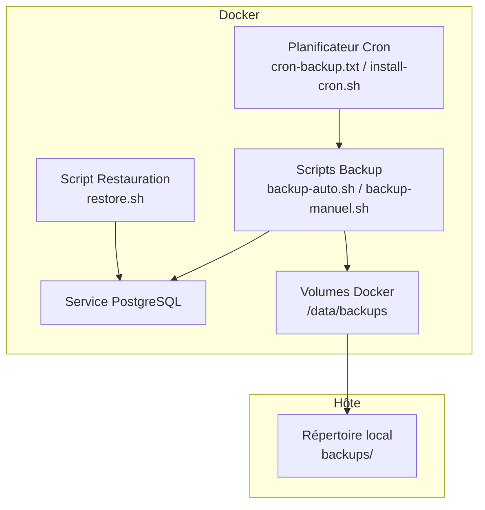
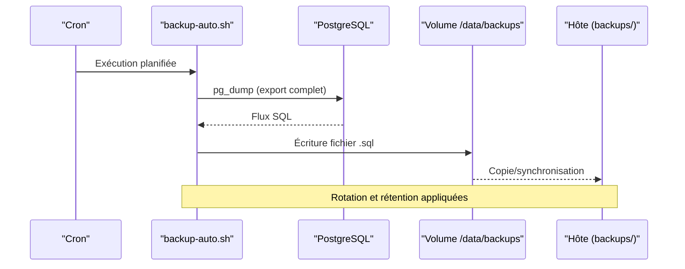
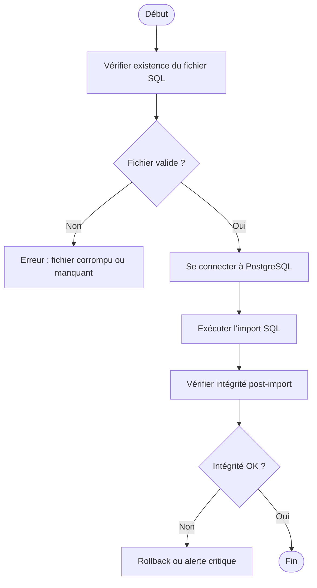
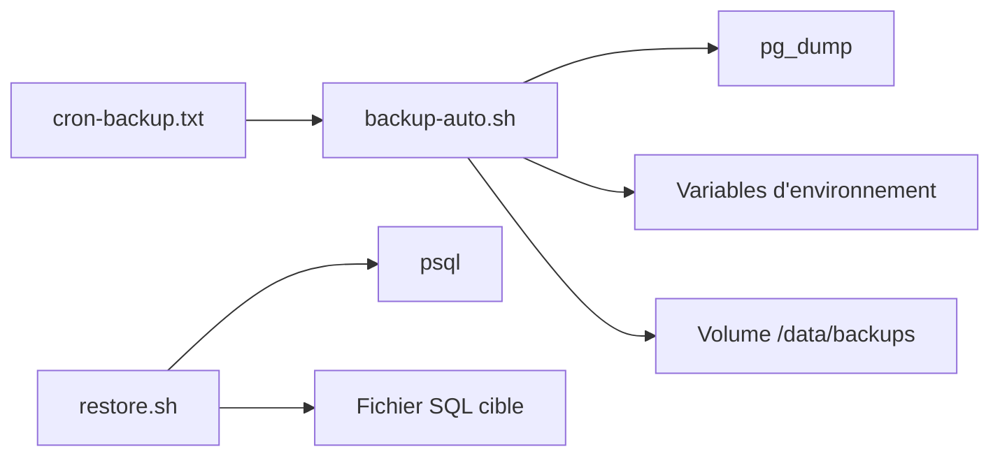

# Sauvegarde et Restauration

<cite>
**Fichiers référencés dans ce document**
- [docker/scripts/backup-auto.sh](file://docker/scripts/backup-auto.sh)
- [docker/scripts/backup-manuel.sh](file://docker/scripts/backup-manuel.sh)
- [docker/scripts/restore.sh](file://docker/scripts/restore.sh)
- [docker/scripts/cron-backup.txt](file://docker/scripts/cron-backup.txt)
- [docker/scripts/install-cron.sh](file://docker/scripts/install-cron.sh)
- [docker/docker-compose.yml](file://docker/docker-compose.yml)
- [backups/elisaschool_backup_20260621_143000.sql](file://backups/elisaschool_backup_20260621_143000.sql)
- [backups/elisaschool_backup_20260621_143332.sql](file://backups/elisaschool_backup_20260621_143332.sql)
- [backups/schema-pre-migrations-084-087.sql](file://backups/schema-pre-migrations-084-087.sql)
- [docs/autres/_backup-system/BACKUP-SYSTEM-IMPLEMENTATION-COMPLETE.md](file://docs/autres/_backup-system/BACKUP-SYSTEM-IMPLEMENTATION-COMPLETE.md)
- [docs/autres/_backup-system/BACKUP-SYSTEM-PROGRESS.md](file://docs/autres/_backup-system/BACKUP-SYSTEM-PROGRESS.md)
- [docs/autres/_backup-system/BACKUP-SYSTEM-README-FINAL.md](file://docs/autres/_backup-system/BACKUP-SYSTEM-README-FINAL.md)
- [docs/autres/_backup-system/BACKUP-SYSTEM-USER-GUIDE.md](file://docs/autres/_backup-system/BACKUP-SYSTEM-USER-GUIDE.md)
</cite>

## Table des matières
1. [Introduction](#introduction)
2. [Structure du projet](#structure-du-projet)
3. [Composants clés](#composants-clés)
4. [Vue d’ensemble de l’architecture](#vue-densemble-de-larchitecture)
5. [Analyse détaillée des composants](#analyse-detalliee-des-composants)
6. [Analyse des dépendances](#analyse-des-dependances)
7. [Considérations de performance](#considerations-de-performance)
8. [Guide de dépannage](#guide-de-depannage)
9. [Conclusion](#conclusion)
10. [Annexes](#annexes)

## Introduction
Ce document décrit le système de sauvegarde et restauration d’eLISAschool, en se concentrant sur les stratégies automatisées (quotidienne, hebdomadaire, mensuelle), les formats supportés, les emplacements de stockage, les procédures de restauration complète ou partielle, les vérifications d’intégrité, les tests de récupération, la maintenance courante, les politiques de rétention, la réplication pour la haute disponibilité, les procédures d’urgence, les plans de reprise après sinistre (PRA), ainsi que les bonnes pratiques en production.

Le système s’appuie sur des scripts shell exécutables via cron, une structure de répertoires dédiée pour les sauvegardes, et des fichiers SQL générés par pg_dump. La configuration Docker permet d’exécuter ces tâches de manière isolée et reproductible.

## Structure du projet
Les éléments liés aux sauvegardes sont principalement situés dans :
- docker/scripts : scripts de backup automatique et manuel, restauration, planification cron, installation du cron.
- docker/docker-compose.yml : définition des services, volumes et variables d’environnement nécessaires au fonctionnement du backup.
- backups : exemples de fichiers SQL produits par les sauvegardes.
- docs/autres/_backup-system : documentation détaillée du système de backup.

**Sources du diagramme**
- [docker/scripts/backup-auto.sh](file://docker/scripts/backup-auto.sh)
- [docker/scripts/backup-manuel.sh](file://docker/scripts/backup-manuel.sh)
- [docker/scripts/restore.sh](file://docker/scripts/restore.sh)
- [docker/scripts/cron-backup.txt](file://docker/scripts/cron-backup.txt)
- [docker/scripts/install-cron.sh](file://docker/scripts/install-cron.sh)
- [docker/docker-compose.yml](file://docker/docker-compose.yml)
- [backups/elisaschool_backup_20260621_143000.sql](file://backups/elisaschool_backup_20260621_143000.sql)

**Sources de section**
- [docker/docker-compose.yml](file://docker/docker-compose.yml)
- [docs/autres/_backup-system/BACKUP-SYSTEM-README-FINAL.md](file://docs/autres/_backup-system/BACKUP-SYSTEM-README-FINAL.md)

## Composants clés
- Scripts de sauvegarde automatique et manuel : génèrent des dumps SQL complets avec horodatage et rotation.
- Script de restauration : restaure une base à partir d’un fichier SQL, avec validation préalable.
- Planification cron : définit les fréquences (quotidienne, hebdomadaire, mensuelle).
- Configuration Docker : expose les variables d’environnement et volumes pour stocker les sauvegardes.
- Documentation interne : guides utilisateur et rapports d’avancement.

**Sources de section**
- [docker/scripts/backup-auto.sh](file://docker/scripts/backup-auto.sh)
- [docker/scripts/backup-manuel.sh](file://docker/scripts/backup-manuel.sh)
- [docker/scripts/restore.sh](file://docker/scripts/restore.sh)
- [docker/scripts/cron-backup.txt](file://docker/scripts/cron-backup.txt)
- [docker/scripts/install-cron.sh](file://docker/scripts/install-cron.sh)
- [docs/autres/_backup-system/BACKUP-SYSTEM-USER-GUIDE.md](file://docs/autres/_backup-system/BACKUP-SYSTEM-USER-GUIDE.md)

## Vue d’ensemble de l’architecture
Le flux de sauvegarde est orchestré par cron qui déclenche le script automatique. Le script utilise pg_dump pour exporter la base PostgreSQL vers un fichier SQL dans un volume partagé. Les sauvegardes sont organisées par fréquence (daily, weekly, monthly) et conservées selon une politique de rétention. La restauration consiste à charger un fichier SQL cible dans la base PostgreSQL, avec des étapes de validation et de vérification d’intégrité.

**Sources du diagramme**
- [docker/scripts/cron-backup.txt](file://docker/scripts/cron-backup.txt)
- [docker/scripts/backup-auto.sh](file://docker/scripts/backup-auto.sh)
- [docker/docker-compose.yml](file://docker/docker-compose.yml)
- [backups/elisaschool_backup_20260621_143000.sql](file://backups/elisaschool_backup_20260621_143000.sql)

## Analyse détaillée des composants

### Stratégies de sauvegarde automatisées
- Quotidienne : export complet quotidien, rotation des anciens fichiers, conservation sur plusieurs jours.
- Hebdomadaire : export hebdomadaire, archivé séparément pour faciliter la restauration à un point précis de la semaine.
- Mensuelle : export mensuel, conservé plus longtemps pour conformité et audits.

La planification est définie dans cron-backup.txt et activée via install-cron.sh.

**Sources de section**
- [docker/scripts/cron-backup.txt](file://docker/scripts/cron-backup.txt)
- [docker/scripts/install-cron.sh](file://docker/scripts/install-cron.sh)
- [docs/autres/_backup-system/BACKUP-SYSTEM-IMPLEMENTATION-COMPLETE.md](file://docs/autres/_backup-system/BACKUP-SYSTEM-IMPLEMENTATION-COMPLETE.md)

### Formats de sauvegarde supportés
- Format SQL (pg_dump) : fichiers .sql contenant l’état complet de la base à un instant T.
- Exemples de fichiers présents dans backups/ confirment le format utilisé.

**Sources de section**
- [backups/elisaschool_backup_20260621_143000.sql](file://backups/elisaschool_backup_20260621_143000.sql)
- [backups/elisaschool_backup_20260621_143332.sql](file://backups/elisaschool_backup_20260621_143332.sql)
- [backups/schema-pre-migrations-084-087.sql](file://backups/schema-pre-migrations-084-087.sql)

### Emplacements de stockage
- Volume Docker : /data/backups (ou équivalent configuré dans docker-compose.yml).
- Hôte : répertoire local backups/ synchronisé depuis le volume.
- Organisation par sous-répertoires daily/, weekly/, monthly/ pour séparer les fréquences.

**Sources de section**
- [docker/docker-compose.yml](file://docker/docker-compose.yml)
- [docs/autres/_backup-system/BACKUP-SYSTEM-README-FINAL.md](file://docs/autres/_backup-system/BACKUP-SYSTEM-README-FINAL.md)

### Procédures de restauration complète ou partielle
- Restauration complète : chargement d’un fichier SQL complet dans la base PostgreSQL cible.
- Restauration partielle : sélection de schémas ou tables spécifiques si le dump le permet (selon options de pg_dump).
- Validation préalable : vérification de l’intégrité du fichier SQL avant import.

**Sources du diagramme**
- [docker/scripts/restore.sh](file://docker/scripts/restore.sh)

**Sources de section**
- [docker/scripts/restore.sh](file://docker/scripts/restore.sh)
- [docs/autres/_backup-system/BACKUP-SYSTEM-USER-GUIDE.md](file://docs/autres/_backup-system/BACKUP-SYSTEM-USER-GUIDE.md)

### Vérifications d’intégrité des données
- Pré-restauration : contrôle de la présence et de la validité du fichier SQL.
- Post-restauration : vérification de la cohérence de la base (tables, contraintes, données critiques).
- Tests de récupération : restaurer dans un environnement de test pour valider l’exploitabilité.

**Sources de section**
- [docs/autres/_backup-system/BACKUP-SYSTEM-USER-GUIDE.md](file://docs/autres/_backup-system/BACKUP-SYSTEM-USER-GUIDE.md)
- [docs/autres/_backup-system/BACKUP-SYSTEM-PROGRESS.md](file://docs/autres/_backup-system/BACKUP-SYSTEM-PROGRESS.md)

### Scripts de maintenance
- Rotation des sauvegardes : suppression des fichiers dépassant la rétention définie.
- Nettoyage des logs : archivage ou suppression des journaux d’exécution.
- Vérification périodique : exécution de checks de santé sur la base et les volumes.

**Sources de section**
- [docs/autres/_backup-system/BACKUP-SYSTEM-IMPLEMENTATION-COMPLETE.md](file://docs/autres/_backup-system/BACKUP-SYSTEM-IMPLEMENTATION-COMPLETE.md)

### Politiques de rétention des sauvegardes
- Quotidienne : rétention courte (ex. 7–14 jours).
- Hebdomadaire : rétention moyenne (ex. 4–8 semaines).
- Mensuelle : rétention longue (ex. 6–12 mois) pour conformité.

**Sources de section**
- [docs/autres/_backup-system/BACKUP-SYSTEM-README-FINAL.md](file://docs/autres/_backup-system/BACKUP-SYSTEM-README-FINAL.md)

### Stratégies de réplication pour la haute disponibilité
- Réplication synchrone ou asynchrone PostgreSQL : maintien d’un standby prêt à prendre le relais.
- Failover automatisé : bascule vers le nœud secondaire en cas de défaillance.
- Synchronisation des sauvegardes : duplication hors site pour protection contre sinistres.

**Sources de section**
- [docs/autres/_backup-system/BACKUP-SYSTEM-IMPLEMENTATION-COMPLETE.md](file://docs/autres/_backup-system/BACKUP-SYSTEM-IMPLEMENTATION-COMPLETE.md)

### Procédures d’urgence et plan de reprise après sinistre (PRA)
- Déclenchement d’urgence : identification rapide de la panne, activation du PRA.
- Restauration prioritaire : rétablissement des services critiques en premier.
- Communication : notifier les parties prenantes, journaliser les actions.
- Validation post-reprise : tests fonctionnels et de performance.

**Sources de section**
- [docs/autres/_backup-system/BACKUP-SYSTEM-USER-GUIDE.md](file://docs/autres/_backup-system/BACKUP-SYSTEM-USER-GUIDE.md)

### Bonnes pratiques pour les environnements de production
- Chiffrer les sauvegardes sensibles.
- Tester régulièrement les restaurations.
- Surveiller les échecs de backup et alerter.
- Documenter les procédures et les contacts d’urgence.
- Isoler les accès aux volumes de sauvegarde.

**Sources de section**
- [docs/autres/_backup-system/BACKUP-SYSTEM-README-FINAL.md](file://docs/autres/_backup-system/BACKUP-SYSTEM-README-FINAL.md)

## Analyse des dépendances
Les scripts de backup dépendent de :
- pg_dump (outil PostgreSQL) pour l’export.
- Variables d’environnement (hôtes, ports, identifiants) définies dans docker-compose.yml.
- Volumes Docker pour le stockage persistant.

La restauration dépend de :
- psql (client PostgreSQL) pour l’import.
- Fichier SQL valide et accessible.

**Sources du diagramme**
- [docker/scripts/cron-backup.txt](file://docker/scripts/cron-backup.txt)
- [docker/scripts/backup-auto.sh](file://docker/scripts/backup-auto.sh)
- [docker/scripts/restore.sh](file://docker/scripts/restore.sh)
- [docker/docker-compose.yml](file://docker/docker-compose.yml)

**Sources de section**
- [docker/scripts/backup-auto.sh](file://docker/scripts/backup-auto.sh)
- [docker/scripts/restore.sh](file://docker/scripts/restore.sh)
- [docker/docker-compose.yml](file://docker/docker-compose.yml)

## Considérations de performance
- pg_dump peut être lourd sur des bases volumineuses ; envisager des exports incrémentaux si nécessaire.
- Limiter les fenêtres de backup aux heures creuses.
- Utiliser des connexions optimisées (nombre de workers, compression).
- Surveiller l’I/O disque et la charge CPU pendant les opérations.

[Pas de sources nécessaires car cette section fournit des conseils généraux]

## Guide de dépannage
Problèmes fréquents :
- Échec de connexion à PostgreSQL : vérifier les variables d’environnement et les accès réseau.
- Fichier SQL corrompu : vérifier la somme de contrôle ou tenter un nouveau dump.
- Manque d’espace disque : nettoyer les anciennes sauvegardes ou augmenter le volume.
- Erreurs lors de l’import : examiner les logs psql et corriger les incohérences.

Actions recommandées :
- Relancer le backup manuel pour diagnostiquer.
- Consulter les logs cron et les scripts.
- Valider l’intégrité du fichier SQL avant restauration.

**Sources de section**
- [docs/autres/_backup-system/BACKUP-SYSTEM-USER-GUIDE.md](file://docs/autres/_backup-system/BACKUP-SYSTEM-USER-GUIDE.md)
- [docs/autres/_backup-system/BACKUP-SYSTEM-PROGRESS.md](file://docs/autres/_backup-system/BACKUP-SYSTEM-PROGRESS.md)

## Conclusion
Le système de sauvegarde et restauration d’eLISAschool repose sur des scripts robustes, une planification fiable et une organisation claire des fichiers SQL. En suivant les bonnes pratiques, en testant régulièrement les restaurations et en mettant en œuvre des stratégies de réplication et de rétention adaptées, il est possible d’assurer la continuité d’activité et la résilience des données en production.

[Pas de sources nécessaires car cette section résume sans analyser de fichiers spécifiques]

## Annexes
- Exemples de fichiers de sauvegarde : backups/*.sql
- Documentation détaillée : docs/autres/_backup-system/*

**Sources de section**
- [backups/elisaschool_backup_20260621_143000.sql](file://backups/elisaschool_backup_20260621_143000.sql)
- [docs/autres/_backup-system/BACKUP-SYSTEM-README-FINAL.md](file://docs/autres/_backup-system/BACKUP-SYSTEM-README-FINAL.md)