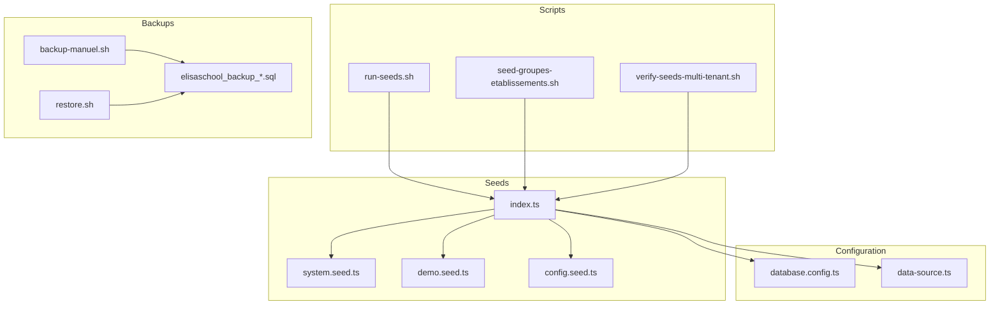
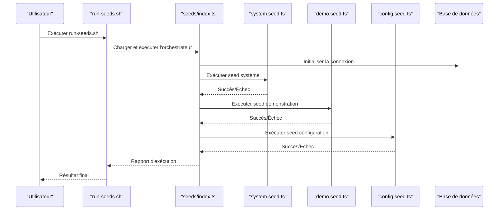
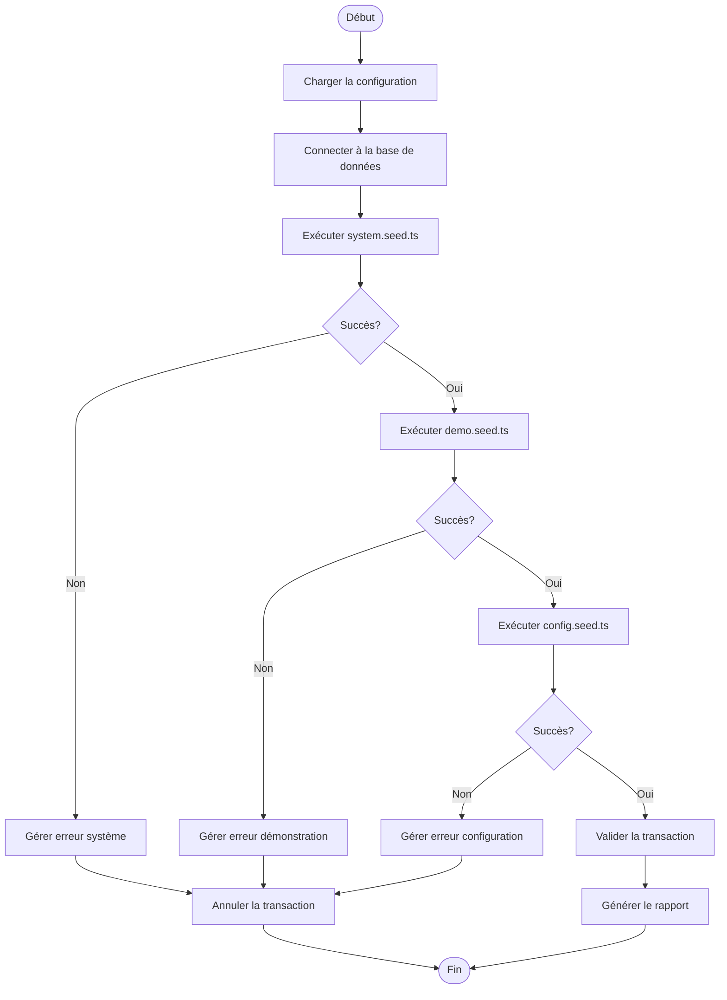
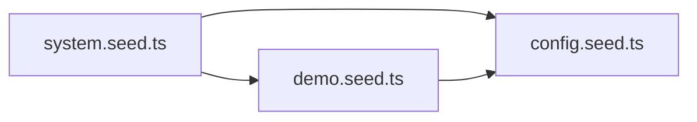

# Seeds et Données de Test

<cite>
**Fichiers référencés dans ce document**
- [backend/src/database/seeds/system.seed.ts](file://backend/src/database/seeds/system.seed.ts)
- [backend/src/database/seeds/demo.seed.ts](file://backend/src/database/seeds/demo.seed.ts)
- [backend/src/database/seeds/config.seed.ts](file://backend/src/database/seeds/config.seed.ts)
- [backend/src/database/seeds/index.ts](file://backend/src/database/seeds/index.ts)
- [scripts/run-seeds.sh](file://scripts/run-seeds.sh)
- [scripts/seed-groupes-etablissements.sh](file://scripts/seed-groupes-etablissements.sh)
- [scripts/verify-seeds-multi-tenant.sh](file://scripts/verify-seeds-multi-tenant.sh)
- [backend/src/database/data-source.ts](file://backend/src/database/data-source.ts)
- [backend/src/config/database.config.ts](file://backend/src/config/database.config.ts)
- [docker/scripts/backup-manuel.sh](file://docker/scripts/backup-manuel.sh)
- [docker/scripts/restore.sh](file://docker/scripts/restore.sh)
- [backups/elisaschool_backup_20260621_143000.sql](file://backups/elisaschool_backup_20260621_143000.sql)
- [docs/_seeds/ANALYSE-CONTEXTE-AFRICAIN-CAMEROUN.md](file://docs/_seeds/ANALYSE-CONTEXTE-AFRICAIN-CAMEROUN.md)
- [docs/_seeds/README-SEEDS.md](file://docs/_seeds/README-SEEDS.md)
</cite>

## Table des matières
1. [Introduction](#introduction)
2. [Structure du projet](#structure-du-projet)
3. [Composants clés](#composants-clés)
4. [Vue d'ensemble de l'architecture](#vue-densemble-de-larchitecture)
5. [Analyse détaillée des composants](#analyse-detallee-des-composants)
6. [Analyse des dépendances](#analyse-des-dependances)
7. [Considérations de performance](#considerations-de-performance)
8. [Guide de dépannage](#guide-de-depannage)
9. [Conclusion](#conclusion)
10. [Annexes](#annexes)

## Introduction
Ce document décrit le système de seeds et de données de test d'eLISAschool. Il explique les types de seeds (système, démonstration, configuration), leur rôle dans le cycle de développement, la structure des fichiers, les dépendances entre données, et les stratégies de peuplement de la base de données. Il inclut également des exemples pour créer des seeds personnalisés, la gestion des données de test isolées, les bonnes pratiques pour maintenir la cohérence des données, ainsi que les scripts d'exécution, les options de nettoyage et les stratégies de backup avant application des seeds. Enfin, il propose des guides pour créer des environnements de test reproductibles et des jeux de données réalistes.

## Structure du projet
Le système de seeds est organisé sous backend/src/database/seeds avec un point d'entrée central qui orchestre l'exécution. Les scripts shell dans scripts/ facilitent l'exécution, le nettoyage et la vérification. La configuration de la base de données est centralisée dans backend/src/config et data-source.ts. Les backups sont stockés dans backups/ et gérés via docker/scripts/.

**Sources du diagramme**
- [backend/src/database/seeds/index.ts](file://backend/src/database/seeds/index.ts)
- [backend/src/config/database.config.ts](file://backend/src/config/database.config.ts)
- [backend/src/database/data-source.ts](file://backend/src/database/data-source.ts)
- [scripts/run-seeds.sh](file://scripts/run-seeds.sh)
- [scripts/seed-groupes-etablissements.sh](file://scripts/seed-groupes-etablissements.sh)
- [scripts/verify-seeds-multi-tenant.sh](file://scripts/verify-seeds-multi-tenant.sh)
- [docker/scripts/backup-manuel.sh](file://docker/scripts/backup-manuel.sh)
- [docker/scripts/restore.sh](file://docker/scripts/restore.sh)
- [backups/elisaschool_backup_20260621_143000.sql](file://backups/elisaschool_backup_20260621_143000.sql)

**Sources de section**
- [backend/src/database/seeds/index.ts](file://backend/src/database/seeds/index.ts)
- [backend/src/config/database.config.ts](file://backend/src/config/database.config.ts)
- [backend/src/database/data-source.ts](file://backend/src/database/data-source.ts)
- [scripts/run-seeds.sh](file://scripts/run-seeds.sh)
- [scripts/seed-groupes-etablissements.sh](file://scripts/seed-groupes-etablissements.sh)
- [scripts/verify-seeds-multi-tenant.sh](file://scripts/verify-seeds-multi-tenant.sh)
- [docker/scripts/backup-manuel.sh](file://docker/scripts/backup-manuel.sh)
- [docker/scripts/restore.sh](file://docker/scripts/restore.sh)
- [backups/elisaschool_backup_20260621_143000.sql](file://backups/elisaschool_backup_20260621_143000.sql)

## Composants clés
- system.seed.ts: Peuple les données fondamentales du système (rôles, permissions, paramètres globaux).
- demo.seed.ts: Génère des données de démonstration réalistes (établissements, utilisateurs, classes, évaluations).
- config.seed.ts: Applique ou met à jour les configurations spécifiques aux modules et préférences.
- index.ts: Orchestre l'exécution ordonnée des seeds, gère les dépendances et les transactions.

Ces composants assurent une séparation claire entre données critiques, données de démonstration et configuration dynamique.

**Sources de section**
- [backend/src/database/seeds/system.seed.ts](file://backend/src/database/seeds/system.seed.ts)
- [backend/src/database/seeds/demo.seed.ts](file://backend/src/database/seeds/demo.seed.ts)
- [backend/src/database/seeds/config.seed.ts](file://backend/src/database/seeds/config.seed.ts)
- [backend/src/database/seeds/index.ts](file://backend/src/database/seeds/index.ts)

## Vue d'ensemble de l'architecture
L'architecture des seeds suit un modèle orchestré par un point d'entrée unique qui charge la configuration de la base de données, initialise la connexion, puis exécute les seeds dans un ordre déterminé. Chaque seed peut encapsuler sa propre logique de création, mise à jour et validation des données.

**Sources du diagramme**
- [scripts/run-seeds.sh](file://scripts/run-seeds.sh)
- [backend/src/database/seeds/index.ts](file://backend/src/database/seeds/index.ts)
- [backend/src/database/seeds/system.seed.ts](file://backend/src/database/seeds/system.seed.ts)
- [backend/src/database/seeds/demo.seed.ts](file://backend/src/database/seeds/demo.seed.ts)
- [backend/src/database/seeds/config.seed.ts](file://backend/src/database/seeds/config.seed.ts)
- [backend/src/config/database.config.ts](file://backend/src/config/database.config.ts)
- [backend/src/database/data-source.ts](file://backend/src/database/data-source.ts)

## Analyse détaillée des composants

### Système de seeds (index.ts)
Le fichier index.ts agit comme orchestrateur principal. Il charge la configuration, établit la connexion à la base de données, et exécute les seeds dans un ordre précis. Il gère également les transactions et les rapports d'exécution.

**Sources du diagramme**
- [backend/src/database/seeds/index.ts](file://backend/src/database/seeds/index.ts)
- [backend/src/config/database.config.ts](file://backend/src/config/database.config.ts)
- [backend/src/database/data-source.ts](file://backend/src/database/data-source.ts)

**Sources de section**
- [backend/src/database/seeds/index.ts](file://backend/src/database/seeds/index.ts)

### Seed système (system.seed.ts)
Ce seed crée les données fondamentales nécessaires au fonctionnement du système : rôles, permissions, paramètres globaux, et entités de base. Il doit s'exécuter en premier car les autres seeds dépendent de ces données.

**Sources de section**
- [backend/src/database/seeds/system.seed.ts](file://backend/src/database/seeds/system.seed.ts)

### Seed démonstration (demo.seed.ts)
Ce seed génère des données de démonstration réalistes pour tester les fonctionnalités de l'application. Il crée typiquement des établissements, des utilisateurs avec différents rôles, des classes, des évaluations, et des relations entre ces entités.

**Sources de section**
- [backend/src/database/seeds/demo.seed.ts](file://backend/src/database/seeds/demo.seed.ts)

### Seed configuration (config.seed.ts)
Ce seed applique ou met à jour les configurations spécifiques aux modules, les préférences utilisateur, et les paramètres dynamiques. Il permet de personnaliser le comportement de l'application sans modifier le code.

**Sources de section**
- [backend/src/database/seeds/config.seed.ts](file://backend/src/database/seeds/config.seed.ts)

### Scripts d'exécution et de vérification
- run-seeds.sh: Script principal pour exécuter tous les seeds.
- seed-groupes-etablissements.sh: Script spécifique pour les groupes d'établissements.
- verify-seeds-multi-tenant.sh: Script de vérification pour valider le multi-tenant après les seeds.

**Sources de section**
- [scripts/run-seeds.sh](file://scripts/run-seeds.sh)
- [scripts/seed-groupes-etablissements.sh](file://scripts/seed-groupes-etablissements.sh)
- [scripts/verify-seeds-multi-tenant.sh](file://scripts/verify-seeds-multi-tenant.sh)

## Analyse des dépendances
Les seeds ont des dépendances hiérarchiques claires :
- system.seed.ts ne dépend d'aucun autre seed
- demo.seed.ts dépend de system.seed.ts (rôles, permissions, établissements)
- config.seed.ts peut dépendre de system.seed.ts et demo.seed.ts

**Sources du diagramme**
- [backend/src/database/seeds/system.seed.ts](file://backend/src/database/seeds/system.seed.ts)
- [backend/src/database/seeds/demo.seed.ts](file://backend/src/database/seeds/demo.seed.ts)
- [backend/src/database/seeds/config.seed.ts](file://backend/src/database/seeds/config.seed.ts)

**Sources de section**
- [backend/src/database/seeds/index.ts](file://backend/src/database/seeds/index.ts)

## Considérations de performance
- **Transactions**: Utiliser des transactions pour garantir l'intégrité des données lors de l'insertion massive.
- **Batching**: Insérer les données par lots pour réduire le nombre de requêtes SQL.
- **Indexation**: Créer les index nécessaires après l'insertion des données massives.
- **Validation**: Valider les données avant insertion pour éviter les erreurs coûteuses.
- **Connexion**: Réutiliser les connexions à la base de données quand c'est possible.

## Guide de dépannage
Problèmes courants et solutions :
- **Erreur de connexion**: Vérifier la configuration database.config.ts et les variables d'environnement.
- **Violation de contrainte**: S'assurer que les données de référence existent avant l'insertion.
- **Performance lente**: Optimiser les requêtes SQL et utiliser le batching.
- **Données corrompues**: Utiliser les backups pour restaurer un état connu.

**Sources de section**
- [backend/src/config/database.config.ts](file://backend/src/config/database.config.ts)
- [docker/scripts/backup-manuel.sh](file://docker/scripts/backup-manuel.sh)
- [docker/scripts/restore.sh](file://docker/scripts/restore.sh)

## Conclusion
Le système de seeds d'eLISAschool est bien structuré et modulaire, permettant une gestion efficace des données de développement et de test. La séparation claire entre seeds système, démonstration et configuration facilite la maintenance et l'évolution du système. Les scripts d'exécution et de vérification assurent une intégration fluide dans le cycle de développement.

## Annexes

### Bonnes pratiques pour créer des seeds personnalisés
1. **Respecter l'ordre d'exécution**: Placer votre seed dans le bon ordre selon les dépendances.
2. **Utiliser des transactions**: Garantir l'intégrité des données.
3. **Gérer les doublons**: Utiliser des upserts ou vérifier l'existence des données.
4. **Documenter les dépendances**: Clarifier les relations entre les données créées.
5. **Tester individuellement**: Pouvoir exécuter chaque seed séparément.

### Gestion des données de test isolées
- Utiliser des bases de données temporaires pour les tests.
- Isoler les données de test avec des namespaces ou des schémas dédiés.
- Nettoyer automatiquement les données après les tests.
- Utiliser des fixtures standardisées pour la reproductibilité.

### Stratégies de backup avant application des seeds
- Toujours faire un backup complet avant d'appliquer des seeds en production.
- Versionner les backups avec des timestamps significatifs.
- Tester les procédures de restauration régulièrement.
- Automatiser les backups dans le pipeline CI/CD.

**Sources de section**
- [docs/_seeds/README-SEEDS.md](file://docs/_seeds/README-SEEDS.md)
- [docs/_seeds/ANALYSE-CONTEXTE-AFRICAIN-CAMEROUN.md](file://docs/_seeds/ANALYSE-CONTEXTE-AFRICAIN-CAMEROUN.md)
- [backups/elisaschool_backup_20260621_143000.sql](file://backups/elisaschool_backup_20260621_143000.sql)