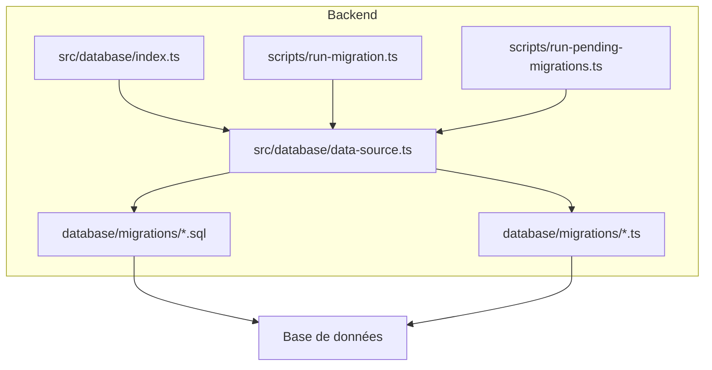
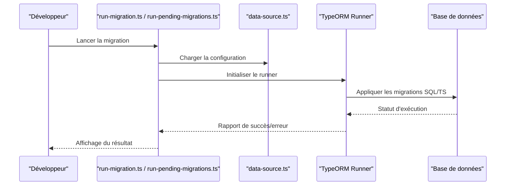
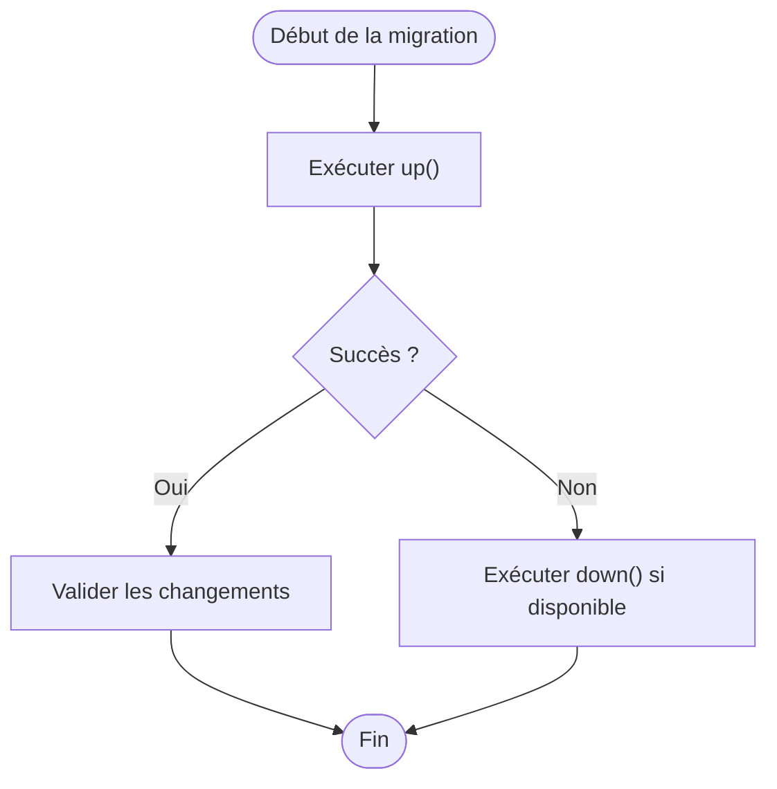
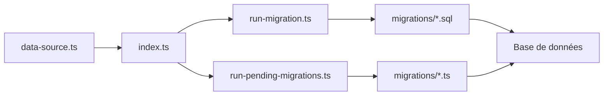

# Système de Migrations TypeORM

<cite>
**Fichiers référencés dans ce document**
- [data-source.ts](file://backend/src/database/data-source.ts)
- [index.ts](file://backend/src/database/index.ts)
- [037-gamification-tracabilite.ts](file://backend/database/migrations/037-gamification-tracabilite.ts)
- [038-index-performance-gamification-suivi.ts](file://backend/database/migrations/038-index-performance-gamification-suivi.ts)
- [039-scoring-personnel.ts](file://backend/database/migrations/039-scoring-personnel.ts)
- [043-correction-dossier-medical-fk.ts](file://backend/database/migrations/043-correction-dossier-medical-fk.ts)
- [009-performance-indexes.sql](file://backend/database/migrations/009-performance-indexes.sql)
- [010-module-finances.sql](file://backend/database/migrations/010-module-finances.sql)
- [027-auth-multi-mode.sql](file://backend/database/migrations/027-auth-multi-mode.sql)
- [054-refonte-structure-academique-v2.sql](file://backend/database/migrations/054-refonte-structure-academique-v2.sql)
- [063-creer-module-emploi-du-temps.sql](file://backend/database/migrations/063-creer-module-emploi-du-temps.sql)
- [run-migration.ts](file://backend/scripts/run-migration.ts)
- [run-pending-migrations.ts](file://backend/scripts/run-pending-migrations.ts)
- [deploy-all-migrations.sh](file://backend/deploy-all-migrations.sh)
- [MIGRATIONS-GUIDE.md](file://docs/guides/MIGRATIONS-GUIDE.md)
</cite>

## Table des matières
1. [Introduction](#introduction)
2. [Structure du projet](#structure-du-projet)
3. [Composants clés](#composants-clés)
4. [Vue d'ensemble de l'architecture](#vue-densemble-de-larchitecture)
5. [Analyse détaillée des composants](#analyse-detallee-des-composants)
6. [Analyse des dépendances](#analyse-des-dependances)
7. [Considérations de performance](#considerations-de-performance)
8. [Guide de dépannage](#guide-de-depannage)
9. [Conclusion](#conclusion)
10. [Annexes](#annexes)

## Introduction
Ce document décrit le système de migrations TypeORM d'eLISAschool : conventions de nommage, structure des fichiers, ordre d'exécution, méthodes disponibles pour créer/modifier/supprimer tables, colonnes, index et contraintes, exemples courants, rollback, gestion d'erreurs, versionnement, bonnes pratiques en production et synchronisation développement. Le projet utilise à la fois des migrations SQL brutes et des migrations TypeScript (TypeORM), exécutées via des scripts dédiés.

## Structure du projet
Les migrations sont stockées sous backend/database/migrations. On y trouve :
- Fichiers SQL (.sql) pour les changements directs sur le schéma.
- Fichiers TypeScript (.ts) pour les migrations TypeORM structurées.
- Scripts utilitaires dans backend/scripts pour exécuter les migrations et vérifier l'état.
- Configuration TypeORM dans backend/src/database/data-source.ts et backend/src/database/index.ts.

**Sources de diagramme**
- [data-source.ts](file://backend/src/database/data-source.ts)
- [index.ts](file://backend/src/database/index.ts)
- [run-migration.ts](file://backend/scripts/run-migration.ts)
- [run-pending-migrations.ts](file://backend/scripts/run-pending-migrations.ts)

**Sources de section**
- [data-source.ts](file://backend/src/database/data-source.ts)
- [index.ts](file://backend/src/database/index.ts)
- [run-migration.ts](file://backend/scripts/run-migration.ts)
- [run-pending-migrations.ts](file://backend/scripts/run-pending-migrations.ts)

## Composants clés
- data-source.ts : configuration de la source de données TypeORM (connexion, répertoire des migrations, options).
- index.ts : point d'entrée qui expose la connexion et les outils de migration.
- Migrations SQL : fichiers .sql dans database/migrations, exécutés séquentiellement par ordre alphabétique.
- Migrations TS : fichiers .ts dans database/migrations, implémentant une classe avec méthodes up() et down().
- Scripts d'exécution : run-migration.ts et run-pending-migrations.ts orchestrent l'application des migrations.

**Sources de section**
- [data-source.ts](file://backend/src/database/data-source.ts)
- [index.ts](file://backend/src/database/index.ts)
- [run-migration.ts](file://backend/scripts/run-migration.ts)
- [run-pending-migrations.ts](file://backend/scripts/run-pending-migrations.ts)

## Vue d'ensemble de l'architecture
Le processus de migration suit un flux clair :
- Chargement de la configuration TypeORM depuis data-source.ts.
- Résolution des migrations SQL et TS dans le répertoire dédié.
- Exécution séquentielle selon l'ordre de nommage (préfixe numérique croissant).
- Journalisation des erreurs et rollback automatique si possible (pour les migrations TS).

**Sources de diagramme**
- [run-migration.ts](file://backend/scripts/run-migration.ts)
- [run-pending-migrations.ts](file://backend/scripts/run-pending-migrations.ts)
- [data-source.ts](file://backend/src/database/data-source.ts)

## Analyse détaillée des composants

### Configuration TypeORM et exécution des migrations
- data-source.ts définit le chemin vers les migrations et les options de connexion.
- index.ts expose les fonctions pour lancer les migrations et interagir avec la base.
- Les scripts run-migration.ts et run-pending-migrations.ts utilisent ces modules pour appliquer les changements.

Bonnes pratiques :
- Centraliser la configuration dans data-source.ts.
- Utiliser des variables d'environnement pour les paramètres de connexion.
- Vérifier l'état des migrations avant déploiement.

**Sources de section**
- [data-source.ts](file://backend/src/database/data-source.ts)
- [index.ts](file://backend/src/database/index.ts)
- [run-migration.ts](file://backend/scripts/run-migration.ts)
- [run-pending-migrations.ts](file://backend/scripts/run-pending-migrations.ts)

### Migrations SQL : structure et conventions
- Fichiers .sql dans database/migrations.
- Nommez-les avec un préfixe numérique croissant pour garantir l'ordre d'exécution.
- Utilisez des transactions pour assurer l'atomicité quand c'est pertinent.
- Documentez chaque changement dans le fichier ou via un commentaire en haut du script.

Exemples courants :
- Création de table : CREATE TABLE ...;
- Ajout de colonne : ALTER TABLE ... ADD COLUMN ...;
- Suppression de colonne : ALTER TABLE ... DROP COLUMN ...;
- Index : CREATE INDEX ...;
- Contrainte : ALTER TABLE ... ADD CONSTRAINT ...;

**Sources de section**
- [009-performance-indexes.sql](file://backend/database/migrations/009-performance-indexes.sql)
- [010-module-finances.sql](file://backend/database/migrations/010-module-finances.sql)
- [027-auth-multi-mode.sql](file://backend/database/migrations/027-auth-multi-mode.sql)
- [054-refonte-structure-academique-v2.sql](file://backend/database/migrations/054-refonte-structure-academique-v2.sql)
- [063-creer-module-emploi-du-temps.sql](file://backend/database/migrations/063-creer-module-emploi-du-temps.sql)

### Migrations TypeScript : structure et méthodes
- Fichiers .ts dans database/migrations.
- Implémentent une classe avec deux méthodes principales :
  - up() : applique les changements.
  - down() : annule les changements (rollback).
- Méthodes TypeORM courantes :
  - createTable(), dropTable()
  - addColumn(), dropColumn()
  - createIndex(), dropIndex()
  - addForeignKeyConstraint(), dropForeignKeyConstraint()

Exemple de workflow :

**Sources de section**
- [037-gamification-tracabilite.ts](file://backend/database/migrations/037-gamification-tracabilite.ts)
- [038-index-performance-gamification-suivi.ts](file://backend/database/migrations/038-index-performance-gamification-suivi.ts)
- [039-scoring-personnel.ts](file://backend/database/migrations/039-scoring-personnel.ts)
- [043-correction-dossier-medical-fk.ts](file://backend/database/migrations/043-correction-dossier-medical-fk.ts)

### Ordre d'exécution et versionnement
- L'ordre est déterminé par le préfixe numérique des noms de fichiers.
- Gardez une progression constante et évitez les sauts.
- En cas de correction, créez une nouvelle migration avec un numéro supérieur.

Conseils :
- Numérotez vos migrations de manière séquentielle.
- Évitez les conflits en coordonnant les branches Git.
- Testez toujours en environnement de staging avant production.

**Sources de section**
- [MIGRATIONS-GUIDE.md](file://docs/guides/MIGRATIONS-GUIDE.md)

### Gestion des erreurs et rollback
- Pour les migrations TS, implementez down() pour permettre le rollback.
- Pour les migrations SQL, utilisez des transactions pour limiter l'impact des erreurs.
- Loguez les erreurs et vérifiez l'état après exécution.

Stratégies :
- Validez les changements dans un environnement isolé.
- Utilisez des scripts de vérification pour détecter les incohérences.
- Préparez des scripts de restauration rapide en cas de problème critique.

**Sources de section**
- [run-migration.ts](file://backend/scripts/run-migration.ts)
- [run-pending-migrations.ts](file://backend/scripts/run-pending-migrations.ts)

### Bonnes pratiques pour la production
- Toujours tester les migrations en staging.
- Effectuer des backups complets avant déploiement.
- Utiliser des scripts automatisés pour appliquer les migrations.
- Surveiller les logs et les métriques pendant l'exécution.

Synchronisation développement :
- Gardez les migrations alignées entre les environnements.
- Utilisez des tags Git pour marquer les versions stables.
- Documentez les changements majeurs dans le journal de version.

**Sources de section**
- [deploy-all-migrations.sh](file://backend/deploy-all-migrations.sh)
- [MIGRATIONS-GUIDE.md](file://docs/guides/MIGRATIONS-GUIDE.md)

## Analyse des dépendances
Les composants interagissent comme suit :
- data-source.ts fournit la configuration à index.ts.
- Les scripts d'exécution utilisent index.ts pour initialiser TypeORM.
- Les migrations SQL et TS sont appliquées par le runner TypeORM.

**Sources de diagramme**
- [data-source.ts](file://backend/src/database/data-source.ts)
- [index.ts](file://backend/src/database/index.ts)
- [run-migration.ts](file://backend/scripts/run-migration.ts)
- [run-pending-migrations.ts](file://backend/scripts/run-pending-migrations.ts)

**Sources de section**
- [data-source.ts](file://backend/src/database/data-source.ts)
- [index.ts](file://backend/src/database/index.ts)
- [run-migration.ts](file://backend/scripts/run-migration.ts)
- [run-pending-migrations.ts](file://backend/scripts/run-pending-migrations.ts)

## Considérations de performance
- Créez des index stratégiques pour les requêtes fréquentes.
- Évitez les opérations lourdes pendant les heures de pointe.
- Utilisez des transactions pour regrouper les changements atomiques.
- Analysez les plans d'exécution pour optimiser les requêtes complexes.

[Pas de sources nécessaires car cette section fournit des conseils généraux]

## Guide de dépannage
Problèmes courants :
- Erreur de syntaxe SQL : vérifiez la syntaxe et testez en local.
- Conflit de nommage : assurez-vous que les numéros de migration sont uniques.
- Échec de rollback : implémentez correctement down() dans les migrations TS.
- Incohérence de schéma : comparez le schéma attendu avec celui de la base.

Actions recommandées :
- Consultez les logs d'exécution des scripts.
- Restaurez une sauvegarde récente en cas d'urgence.
- Utilisez des outils de diagnostic pour analyser l'état de la base.

**Sources de section**
- [run-migration.ts](file://backend/scripts/run-migration.ts)
- [run-pending-migrations.ts](file://backend/scripts/run-pending-migrations.ts)

## Conclusion
Le système de migrations d'eLISAschool combine SQL brut et TypeScript pour offrir flexibilité et robustesse. Suivez les conventions de nommage, implémentez des rollbacks complets, et testez rigoureusement avant déploiement. La documentation fournie vous guide vers des pratiques sûres et efficaces pour gérer l'évolution du schéma de votre application.

[Pas de sources nécessaires car cette section résume sans analyser de fichiers spécifiques]

## Annexes
- Référence des commandes utiles :
  - Exécuter toutes les migrations : utiliser deploy-all-migrations.sh
  - Vérifier l'état des migrations : utiliser run-pending-migrations.ts
  - Tester une migration spécifique : utiliser run-migration.ts

- Liens vers la documentation complète :
  - GUIDE DES MIGRATIONS : docs/guides/MIGRATIONS-GUIDE.md

**Sources de section**
- [deploy-all-migrations.sh](file://backend/deploy-all-migrations.sh)
- [run-pending-migrations.ts](file://backend/scripts/run-pending-migrations.ts)
- [run-migration.ts](file://backend/scripts/run-migration.ts)
- [MIGRATIONS-GUIDE.md](file://docs/guides/MIGRATIONS-GUIDE.md)