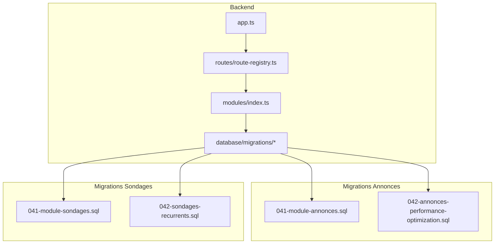
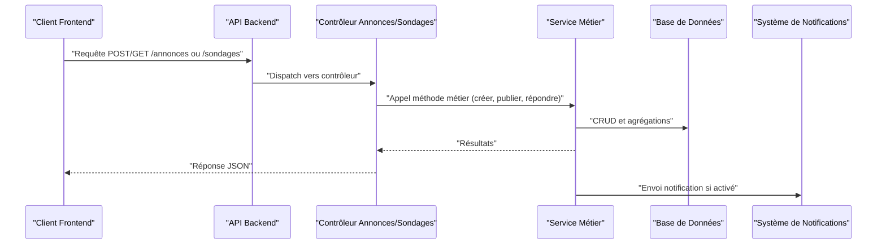
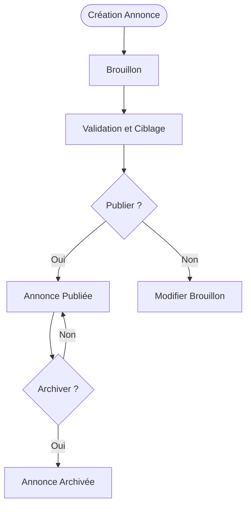
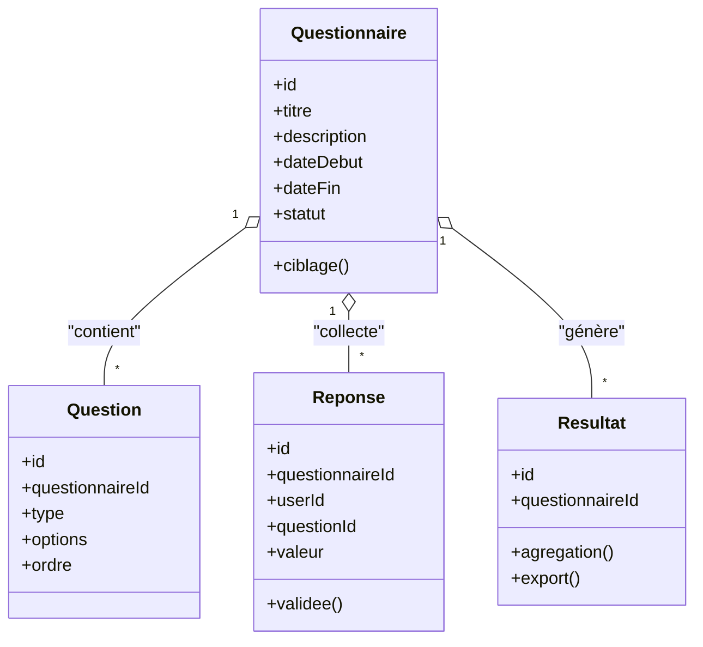
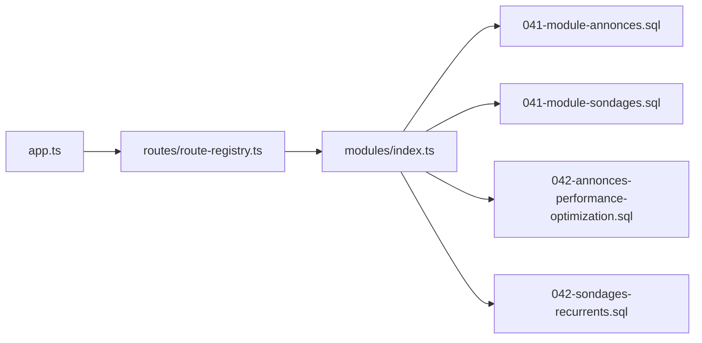

# Annonces et Sondages

<cite>
**Fichiers référencés dans ce document**
- [041-module-annonces.sql](file://backend/database/migrations/041-module-annonces.sql)
- [041-module-sondages.sql](file://backend/database/migrations/041-module-sondages.sql)
- [042-annonces-performance-optimization.sql](file://backend/database/migrations/042-annonces-performance-optimization.sql)
- [042-sondages-recurrents.sql](file://backend/database/migrations/042-sondages-recurrents.sql)
- [index.ts](file://backend/src/modules/index.ts)
- [route-registry.ts](file://backend/src/routes/route-registry.ts)
- [app.ts](file://backend/src/app.ts)
- [IMPLEMENTATION-MODULE-SONDAGES.md](file://docs/implementations/IMPLEMENTATION-MODULE-SONDAGES.md)
- [RAPPORT-FINAL-DEPLOIEMENT-ANNONCES.md](file://docs/rapports/RAPPORT-FINAL-DEPLOIEMENT-ANNONCES.md)
- [MODULE-ANNONCES.md](file://docs/MODULE-ANNONCES.md)
- [RESUME-FINAL-SONDAGES.md](file://docs/resumes/RESUME-FINAL-SONDAGES.md)
</cite>

## Table des matières
1. [Introduction](#introduction)
2. [Structure du projet](#structure-du-projet)
3. [Composants clés](#composants-clés)
4. [Vue d'architecture](#vue-darchitecture)
5. [Analyse détaillée des composants](#analyse-detailee-des-composants)
6. [Analyse des dépendances](#analyse-des-dependances)
7. [Considérations de performance](#considerations-de-performance)
8. [Guide de dépannage](#guide-de-depannage)
9. [Conclusion](#conclusion)
10. [Annexes](#annexes)

## Introduction
Ce document présente une documentation complète des modules d’Annonces et de Sondages d’eLISAschool. Il couvre les entités Annonce et Sondage, les workflows de création et publication, le ciblage par rôle ou département, les mécanismes de réponse aux sondages, les types de sondages (QCM, texte libre, notation), les résultats en temps réel, les exports de données, ainsi que les fonctionnalités avancées telles que les sondages récurrents, les analyses statistiques et les intégrations avec le système de notifications. Le contenu s’appuie sur les migrations de base de données, la configuration des routes et l’implémentation documentée dans les fichiers officiels du projet.

## Structure du projet
Les modules d’Annonces et de Sondages sont définis principalement via des migrations SQL qui créent les tables, index et contraintes nécessaires, puis exposés à travers les routes du backend. L’orchestration globale est assurée par les fichiers d’initialisation de l’application et le registre de routes.

**Sources du diagramme**
- [app.ts](file://backend/src/app.ts)
- [route-registry.ts](file://backend/src/routes/route-registry.ts)
- [index.ts](file://backend/src/modules/index.ts)
- [041-module-annonces.sql](file://backend/database/migrations/041-module-annonces.sql)
- [042-annonces-performance-optimization.sql](file://backend/database/migrations/042-annonces-performance-optimization.sql)
- [041-module-sondages.sql](file://backend/database/migrations/041-module-sondages.sql)
- [042-sondages-recurrents.sql](file://backend/database/migrations/042-sondages-recurrents.sql)

**Sources de section**
- [index.ts](file://backend/src/modules/index.ts)
- [route-registry.ts](file://backend/src/routes/route-registry.ts)
- [app.ts](file://backend/src/app.ts)

## Composants clés
- Entité Annonce : permet de créer, publier et archiver des annonces ciblées par rôles et départements.
- Entité Sondage : définit des questions de type QCM, texte libre et notation, avec gestion des réponses et résultats en temps réel.
- Ciblage : diffusion sélective selon rôles utilisateurs et départements de l’établissement.
- Réponses aux sondages : collecte, validation et agrégation des réponses.
- Sondages récurrents : planification automatique de sondages périodiques.
- Notifications : intégration pour informer les destinataires lors de nouvelles annonces ou de sondages actifs.
- Export de données : génération de rapports et export des résultats de sondages.

**Sources de section**
- [041-module-annonces.sql](file://backend/database/migrations/041-module-annonces.sql)
- [041-module-sondages.sql](file://backend/database/migrations/041-module-sondages.sql)
- [042-sondages-recurrents.sql](file://backend/database/migrations/042-sondages-recurrents.sql)
- [MODULE-ANNONCES.md](file://docs/MODULE-ANNONCES.md)
- [IMPLEMENTATION-MODULE-SONDAGES.md](file://docs/implementations/IMPLEMENTATION-MODULE-SONDAGES.md)
- [RESUME-FINAL-SONDAGES.md](file://docs/resumes/RESUME-FINAL-SONDAGES.md)

## Vue d'architecture
Le flux typique commence par la définition des schémas via les migrations, puis l’exposition des endpoints via le registre de routes. Les contrôleurs et services (dans les modules correspondants) implémentent la logique métier : création, validation, ciblage, stockage des réponses, calcul des résultats et envoi de notifications.

**Sources du diagramme**
- [route-registry.ts](file://backend/src/routes/route-registry.ts)
- [app.ts](file://backend/src/app.ts)

## Analyse détaillée des composants

### Entité Annonce
- Champs principaux : titre, contenu, statut (brouillon, publié, archivé), date de publication, visibilité (rôles, départements).
- Workflow :
  - Création d’une annonce en brouillon.
  - Validation et ciblage (rôles, départements).
  - Publication et diffusion aux destinataires.
  - Archivage après expiration ou fin de campagne.
- Index et performances : optimisations via index composites pour filtrage rapide par statut, date et cible.

**Sources du diagramme**
- [041-module-annonces.sql](file://backend/database/migrations/041-module-annonces.sql)
- [042-annonces-performance-optimization.sql](file://backend/database/migrations/042-annonces-performance-optimization.sql)

**Sources de section**
- [041-module-annonces.sql](file://backend/database/migrations/041-module-annonces.sql)
- [042-annonces-performance-optimization.sql](file://backend/database/migrations/042-annonces-performance-optimization.sql)
- [MODULE-ANNONCES.md](file://docs/MODULE-ANNONCES.md)

### Entité Sondage
- Types de questions :
  - QCM : choix multiples ou unique.
  - Texte libre : champ de saisie libre.
  - Notation : échelle numérique ou étoiles.
- Structure :
  - Questionnaire (titre, description, période active).
  - Questions (type, options, ordre).
  - Réponses (utilisateur, question, valeur).
  - Résultats (agrégats, temps réel).
- Workflow :
  - Création du questionnaire et des questions.
  - Diffusion ciblée (rôles, départements).
  - Collecte des réponses et validation.
  - Calcul des résultats et affichage en temps réel.
  - Export des données (CSV/JSON).

**Sources du diagramme**
- [041-module-sondages.sql](file://backend/database/migrations/041-module-sondages.sql)

**Sources de section**
- [041-module-sondages.sql](file://backend/database/migrations/041-module-sondages.sql)
- [042-sondages-recurrents.sql](file://backend/database/migrations/042-sondages-recurrents.sql)
- [IMPLEMENTATION-MODULE-SONDAGES.md](file://docs/implementations/IMPLEMENTATION-MODULE-SONDAGES.md)
- [RESUME-FINAL-SONDAGES.md](file://docs/resumes/RESUME-FINAL-SONDAGES.md)

### Ciblage par rôle et département
- Ciblage basé sur les rôles utilisateurs (administrateur, enseignant, élève, responsable, etc.) et les départements de l’établissement.
- Filtrage au moment de la diffusion pour garantir que seuls les destinataires pertinents reçoivent l’annonce ou participent au sondage.

**Sources de section**
- [041-module-annonces.sql](file://backend/database/migrations/041-module-annonces.sql)
- [041-module-sondages.sql](file://backend/database/migrations/041-module-sondages.sql)

### Mécanismes de réponse aux sondages
- Validation des réponses selon le type de question.
- Stockage sécurisé et traçabilité (horodatage, utilisateur).
- Agrégation en temps réel pour affichage dynamique.

**Sources de section**
- [041-module-sondages.sql](file://backend/database/migrations/041-module-sondages.sql)

### Sondages récurrents
- Planification de sondages automatiques (quotidien, hebdomadaire, mensuel).
- Activation/désactivation et suivi des exécutions.

**Sources de section**
- [042-sondages-recurrents.sql](file://backend/database/migrations/042-sondages-recurrents.sql)

### Intégration avec les notifications
- Envoi de notifications lors de la publication d’annonces ou de l’ouverture de sondages.
- Cible personnalisable selon les préférences utilisateur.

**Sources de section**
- [IMPLEMENTATION-MODULE-SONDAGES.md](file://docs/implementations/IMPLEMENTATION-MODULE-SONDAGES.md)
- [MODULE-ANNONCES.md](file://docs/MODULE-ANNONCES.md)

### Exports de données
- Génération de rapports pour les résultats de sondages (CSV, JSON).
- Agrégations statistiques (moyennes, distributions, tendances).

**Sources de section**
- [RESUME-FINAL-SONDAGES.md](file://docs/resumes/RESUME-FINAL-SONDAGES.md)

## Analyse des dépendances
Les modules d’Annonces et de Sondages dépendent des migrations de base de données et sont exposés via le registre de routes. L’application initialise ces modules et configure les points d’entrée API.

**Sources du diagramme**
- [app.ts](file://backend/src/app.ts)
- [route-registry.ts](file://backend/src/routes/route-registry.ts)
- [index.ts](file://backend/src/modules/index.ts)
- [041-module-annonces.sql](file://backend/database/migrations/041-module-annonces.sql)
- [041-module-sondages.sql](file://backend/database/migrations/041-module-sondages.sql)
- [042-annonces-performance-optimization.sql](file://backend/database/migrations/042-annonces-performance-optimization.sql)
- [042-sondages-recurrents.sql](file://backend/database/migrations/042-sondages-recurrents.sql)

**Sources de section**
- [app.ts](file://backend/src/app.ts)
- [route-registry.ts](file://backend/src/routes/route-registry.ts)
- [index.ts](file://backend/src/modules/index.ts)

## Considérations de performance
- Index composites sur les champs de filtrage (statut, date, cible) pour accélérer les requêtes.
- Agrégations optimisées pour les résultats de sondages.
- Mise en cache des données fréquentes (liste des annonces actives, questions de sondages).

**Sources de section**
- [042-annonces-performance-optimization.sql](file://backend/database/migrations/042-annonces-performance-optimization.sql)

## Guide de dépannage
- Vérifier l’état des migrations appliquées.
- Consulter les logs des erreurs de validation des réponses.
- Tester les endpoints avec des payloads valides/invalides.
- Examiner les permissions RBAC pour l’accès aux ressources.

**Sources de section**
- [RAPPORT-FINAL-DEPLOIEMENT-ANNONCES.md](file://docs/rapports/RAPPORT-FINAL-DEPLOIEMENT-ANNONCES.md)

## Conclusion
Les modules d’Annonces et de Sondages offrent une plateforme robuste pour la communication interne et la collecte d’opinions au sein de l’établissement. Grâce à un ciblage précis, des types de questions variés, des résultats en temps réel et des exports puissants, ils répondent aux besoins opérationnels et analytiques. Les fonctionnalités avancées comme les sondages récurrents et l’intégration avec les notifications renforcent leur utilité et leur flexibilité.

## Annexes
- Documentation détaillée de l’implémentation des sondages.
- Rapport de déploiement des annonces.
- Résumé final des fonctionnalités des sondages.

**Sources de section**
- [IMPLEMENTATION-MODULE-SONDAGES.md](file://docs/implementations/IMPLEMENTATION-MODULE-SONDAGES.md)
- [RAPPORT-FINAL-DEPLOIEMENT-ANNONCES.md](file://docs/rapports/RAPPORT-FINAL-DEPLOIEMENT-ANNONCES.md)
- [RESUME-FINAL-SONDAGES.md](file://docs/resumes/RESUME-FINAL-SONDAGES.md)