# Communication et Collaboration

<cite>
**Fichiers référencés dans ce document**
- [043-module-messagerie-complete.sql](file://backend/database/migrations/043-module-messagerie-complete.sql)
- [044-messagerie-optimisations-v2.1.sql](file://backend/database/migrations/044-messagerie-optimisations-v2.1.sql)
- [045-messagerie-fonctionnalites-avancees-v2.2.sql](file://backend/database/migrations/045-messagerie-fonctionnalites-avancees-v2.2.sql)
- [041-module-annonces.sql](file://backend/database/migrations/041-module-annonces.sql)
- [041-module-annonces-fix.sql](file://backend/database/migrations/041-module-annonces-fix.sql)
- [041-module-sondages.sql](file://backend/database/migrations/041-module-sondages.sql)
- [042-annonces-performance-optimization.sql](file://backend/database/migrations/042-annonces-performance-optimization.sql)
- [042-sondages-recurrents.sql](file://backend/database/migrations/042-sondages-recurrents.sql)
- [046-dashboard-config.sql](file://backend/database/migrations/046-dashboard-config.sql)
- [047-notifications-ameliorations.sql](file://backend/database/migrations/047-notifications-ameliorations.sql)
- [048-notifications-performance-optimizations.sql](file://backend/database/migrations/048-notifications-performance-optimizations.sql)
- [052-approche-hybride-parents.sql](file://backend/database/migrations/052-approche-hybride-parents.sql)
- [messagerie.service.ts](file://backend/src/modules/messagerie/services/messagerie.service.ts)
- [messagerie.controller.ts](file://backend/src/modules/messagerie/controllers/messagerie.controller.ts)
- [notification.service.ts](file://backend/src/modules/notifications/services/notification.service.ts)
- [notification.controller.ts](file://backend/src/modules/notifications/controllers/notification.controller.ts)
- [annonce.service.ts](file://backend/src/modules/annonces/services/annonce.service.ts)
- [sondage.service.ts](file://backend/src/modules/sondages/services/sondage.service.ts)
- [dashboard.service.ts](file://backend/src/modules/dashboard/services/dashboard.service.ts)
- [portail-parent.controller.ts](file://backend/src/modules/responsables-eleves/controllers/portail-parent.controller.ts)
- [portail-enseignant.controller.ts](file://backend/src/modules/personnel/controllers/portail-enseignant.controller.ts)
- [preferences.service.ts](file://backend/src/modules/utilisateurs/services/preferences.service.ts)
- [webhook.service.ts](file://backend/src/common/services/webhook.service.ts)
- [template.service.ts](file://backend/src/common/services/template.service.ts)
- [engagement.service.ts](file://backend/src/common/services/engagement.service.ts)
</cite>

## Table des matières
1. [Introduction](#introduction)
2. [Structure du projet](#structure-du-projet)
3. [Composants clés](#composants-clés)
4. [Vue d'ensemble de l'architecture](#vue-densemble-de-larchitecture)
5. [Analyse détaillée des composants](#analyse-detallee-des-composants)
6. [Analyse des dépendances](#analyse-des-dependances)
7. [Considérations de performance](#considerations-de-performance)
8. [Guide de dépannage](#guide-de-depannage)
9. [Conclusion](#conclusion)
10. [Annexes](#annexes)

## Introduction
Ce document présente le module de communication et collaboration d'eLISAschool, couvrant la messagerie interne, les notifications multi-canaux, les annonces et sondages, les tableaux de bord personnalisables, ainsi que les portails parents et enseignants. Il détaille les entités, workflows, templates, préférences utilisateurs, intégrations (email, SMS), fonctionnalités temps réel, permissions, rapports d’activité, et avancées telles que webhooks, templates personnalisés et analyse d’engagement.

## Structure du projet
Le backend est organisé en modules NestJS par domaine. Les migrations SQL définissent le schéma de base de données pour chaque fonctionnalité. Les services implémentent la logique métier, tandis que les contrôleurs exposent les API.

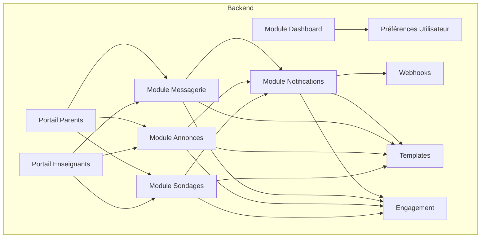

[No sources needed since this diagram shows conceptual workflow, not actual code structure]

## Composants clés
- Messagerie interne: conversations, messages, pièces jointes, filtres, recherche, optimisations.
- Notifications multi-canaux: email, SMS, push, in-app; orchestration, retry, templates.
- Annonces: création, ciblage, diffusion, performances.
- Sondages: création, réponses, récurrence, statistiques.
- Tableau de bord: widgets configurables, agrégations, accès par rôle.
- Portails: parents et enseignants avec vues dédiées et flux spécifiques.
- Préférences: canaux, fréquence, langue, thème, visibilité.
- Webhooks: événements sortants, signatures, retries.
- Templates: gestion centralisée, variables, localisation.
- Engagement: suivi d’ouverture, clic, lecture, interactions.

**Section sources**
- [043-module-messagerie-complete.sql](file://backend/database/migrations/043-module-messagerie-complete.sql)
- [044-messagerie-optimisations-v2.1.sql](file://backend/database/migrations/044-messagerie-optimisations-v2.1.sql)
- [045-messagerie-fonctionnalites-avancees-v2.2.sql](file://backend/database/migrations/045-messagerie-fonctionnalites-avancees-v2.2.sql)
- [041-module-annonces.sql](file://backend/database/migrations/041-module-annonces.sql)
- [041-module-sondages.sql](file://backend/database/migrations/041-module-sondages.sql)
- [046-dashboard-config.sql](file://backend/database/migrations/046-dashboard-config.sql)
- [047-notifications-ameliorations.sql](file://backend/database/migrations/047-notifications-ameliorations.sql)
- [048-notifications-performance-optimizations.sql](file://backend/database/migrations/048-notifications-performance-optimizations.sql)
- [052-approche-hybride-parents.sql](file://backend/database/migrations/052-approche-hybride-parents.sql)

## Vue d'ensemble de l'architecture
Le système repose sur un modèle événementiel où les actions (envoi de message, publication d’annonce, réponse à un sondage) déclenchent des notifications via un service orchestrateur. Les templates sont appliqués avant livraison. Les webhooks permettent l’intégration externe. L’engagement est mesuré et agrégé pour les rapports.

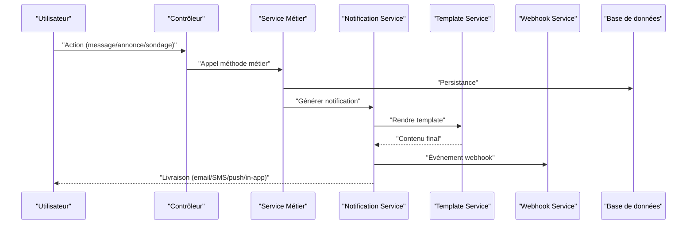

**Diagram sources**
- [notification.service.ts](file://backend/src/modules/notifications/services/notification.service.ts)
- [template.service.ts](file://backend/src/common/services/template.service.ts)
- [webhook.service.ts](file://backend/src/common/services/webhook.service.ts)

**Section sources**
- [notification.service.ts](file://backend/src/modules/notifications/services/notification.service.ts)
- [template.service.ts](file://backend/src/common/services/template.service.ts)
- [webhook.service.ts](file://backend/src/common/services/webhook.service.ts)

## Analyse détaillée des composants

### Messagerie interne
- Entités principales: conversations, messages, participants, pièces jointes, statuts, horodatages.
- Fonctionnalités: envoi, réception, recherche, filtres, archivage, optimisations de requêtes.
- Intégrations: templates de messages, notifications in-app, webhooks d’événements.

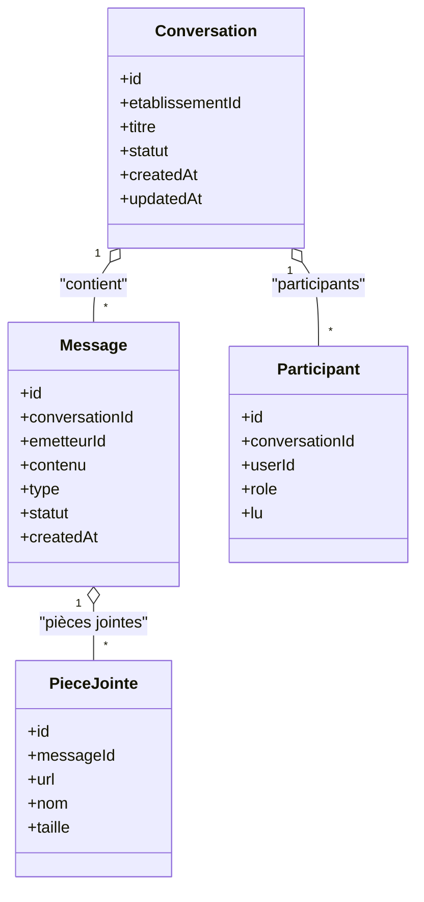

**Diagram sources**
- [043-module-messagerie-complete.sql](file://backend/database/migrations/043-module-messagerie-complete.sql)
- [044-messagerie-optimisations-v2.1.sql](file://backend/database/migrations/044-messagerie-optimisations-v2.1.sql)
- [045-messagerie-fonctionnalites-avancees-v2.2.sql](file://backend/database/migrations/045-messagerie-fonctionnalites-avancees-v2.2.sql)

**Section sources**
- [messagerie.service.ts](file://backend/src/modules/messagerie/services/messagerie.service.ts)
- [messagerie.controller.ts](file://backend/src/modules/messagerie/controllers/messagerie.controller.ts)
- [043-module-messagerie-complete.sql](file://backend/database/migrations/043-module-messagerie-complete.sql)
- [044-messagerie-optimisations-v2.1.sql](file://backend/database/migrations/044-messagerie-optimisations-v2.1.sql)
- [045-messagerie-fonctionnalites-avancees-v2.2.sql](file://backend/database/migrations/045-messagerie-fonctionnalites-avancees-v2.2.sql)

### Système de notifications multi-canaux
- Orchestration: sélection du canal selon préférences et disponibilité.
- Templates: rendu dynamique, variables contextuelles, localisation.
- Délivrance: email, SMS, push, in-app; retry, backoff, journalisation.
- Performance: index, batch, files d’attente.

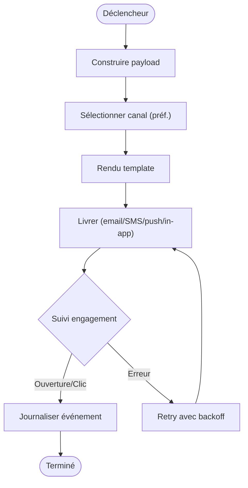

**Diagram sources**
- [notification.service.ts](file://backend/src/modules/notifications/services/notification.service.ts)
- [template.service.ts](file://backend/src/common/services/template.service.ts)
- [047-notifications-ameliorations.sql](file://backend/database/migrations/047-notifications-ameliorations.sql)
- [048-notifications-performance-optimizations.sql](file://backend/database/migrations/048-notifications-performance-optimizations.sql)

**Section sources**
- [notification.service.ts](file://backend/src/modules/notifications/services/notification.service.ts)
- [notification.controller.ts](file://backend/src/modules/notifications/controllers/notification.controller.ts)
- [047-notifications-ameliorations.sql](file://backend/database/migrations/047-notifications-ameliorations.sql)
- [048-notifications-performance-optimizations.sql](file://backend/database/migrations/048-notifications-performance-optimizations.sql)

### Annonces
- Création, ciblage (rôle, classe, établissement), diffusion, archivage.
- Optimisations de performance: index, vues matérialisées.
- Intégration: templates, notifications, engagement.

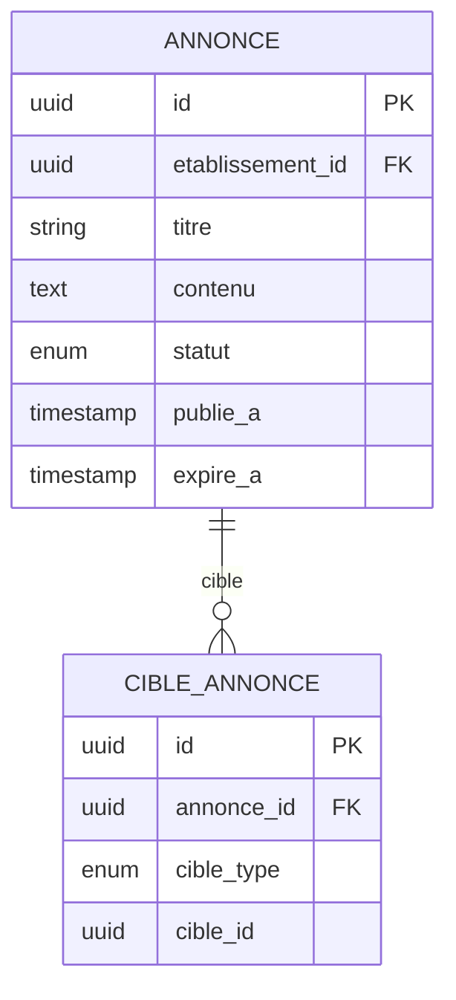

**Diagram sources**
- [041-module-annonces.sql](file://backend/database/migrations/041-module-annonces.sql)
- [041-module-annonces-fix.sql](file://backend/database/migrations/041-module-annonces-fix.sql)
- [042-annonces-performance-optimization.sql](file://backend/database/migrations/042-annonces-performance-optimization.sql)

**Section sources**
- [annonce.service.ts](file://backend/src/modules/annonces/services/annonce.service.ts)
- [041-module-annonces.sql](file://backend/database/migrations/041-module-annonces.sql)
- [041-module-annonces-fix.sql](file://backend/database/migrations/041-module-annonces-fix.sql)
- [042-annonces-performance-optimization.sql](file://backend/database/migrations/042-annonces-performance-optimization.sql)

### Sondages
- Création, questions, options, réponses, clôture, statistiques.
- Récurrence: planification, relance automatique.
- Intégration: templates, notifications, engagement.

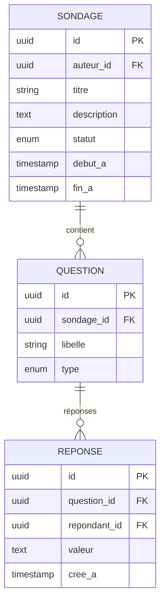

**Diagram sources**
- [041-module-sondages.sql](file://backend/database/migrations/041-module-sondages.sql)
- [042-sondages-recurrents.sql](file://backend/database/migrations/042-sondages-recurrents.sql)

**Section sources**
- [sondage.service.ts](file://backend/src/modules/sondages/services/sondage.service.ts)
- [041-module-sondages.sql](file://backend/database/migrations/041-module-sondages.sql)
- [042-sondages-recurrents.sql](file://backend/database/migrations/042-sondages-recurrents.sql)

### Tableaux de bord personnalisables
- Widgets configurables, agrégations, accès par rôle.
- Configuration persistée, versioning, partage.

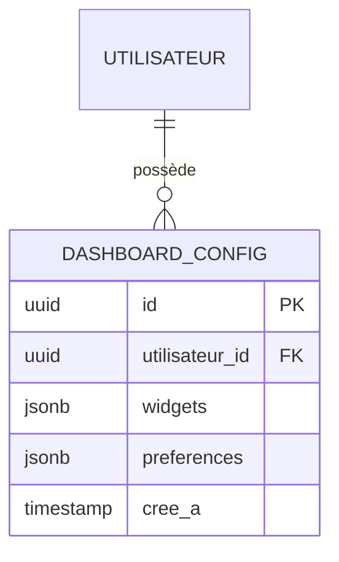

**Diagram sources**
- [046-dashboard-config.sql](file://backend/database/migrations/046-dashboard-config.sql)

**Section sources**
- [dashboard.service.ts](file://backend/src/modules/dashboard/services/dashboard.service.ts)
- [046-dashboard-config.sql](file://backend/database/migrations/046-dashboard-config.sql)

### Portails parents et enseignants
- Vues dédiées, flux spécifiques, permissions granulaires.
- Approche hybride parents: modes d’accès, rôles, ciblages.

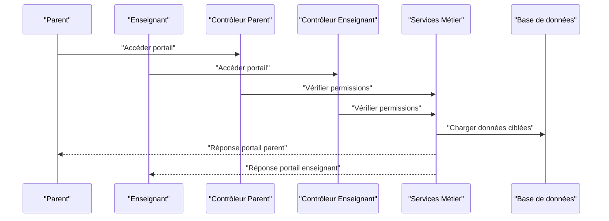

**Diagram sources**
- [portail-parent.controller.ts](file://backend/src/modules/responsables-eleves/controllers/portail-parent.controller.ts)
- [portail-enseignant.controller.ts](file://backend/src/modules/personnel/controllers/portail-enseignant.controller.ts)
- [052-approche-hybride-parents.sql](file://backend/database/migrations/052-approche-hybride-parents.sql)

**Section sources**
- [portail-parent.controller.ts](file://backend/src/modules/responsables-eleves/controllers/portail-parent.controller.ts)
- [portail-enseignant.controller.ts](file://backend/src/modules/personnel/controllers/portail-enseignant.controller.ts)
- [052-approche-hybride-parents.sql](file://backend/database/migrations/052-approche-hybride-parents.sql)

### Préférences utilisateurs
- Canaux de notification, fréquence, langue, thème, visibilité.
- Héritage par rôle, overrides par utilisateur.

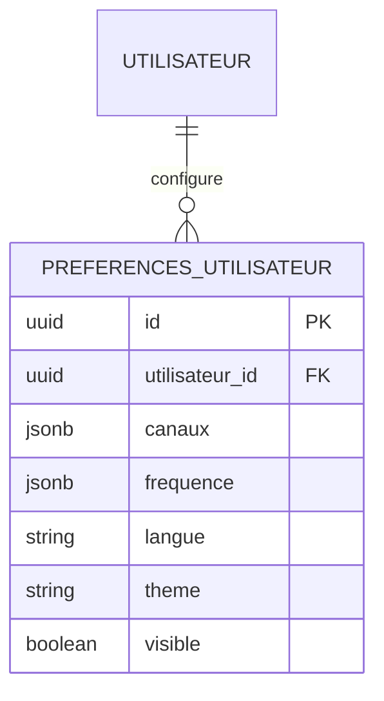

**Diagram sources**
- [preferences.service.ts](file://backend/src/modules/utilisateurs/services/preferences.service.ts)

**Section sources**
- [preferences.service.ts](file://backend/src/modules/utilisateurs/services/preferences.service.ts)

### Webhooks
- Événements sortants, signatures, retries, logs.
- Intégration avec services externes.

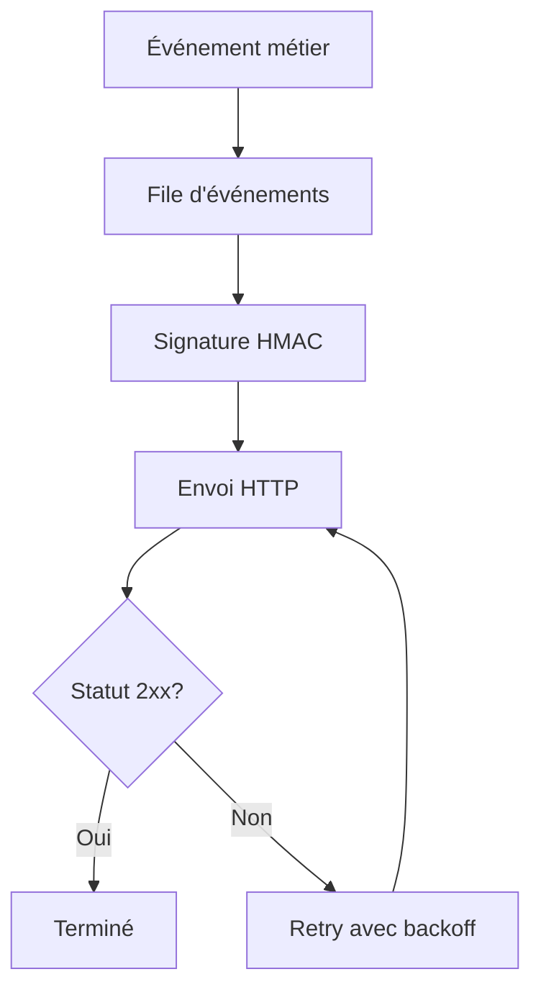

**Diagram sources**
- [webhook.service.ts](file://backend/src/common/services/webhook.service.ts)

**Section sources**
- [webhook.service.ts](file://backend/src/common/services/webhook.service.ts)

### Templates de messages
- Gestion centralisée, variables, localisation, versioning.
- Rendu contextuel pour notifications et messages.

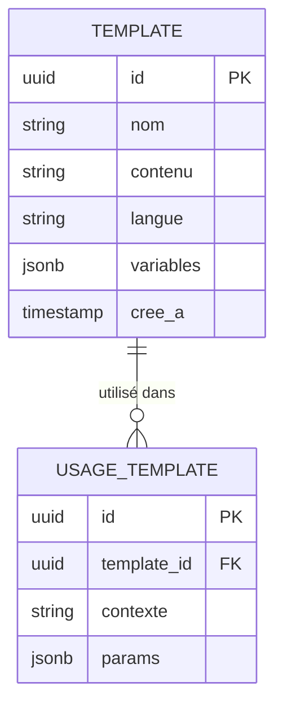

**Diagram sources**
- [template.service.ts](file://backend/src/common/services/template.service.ts)

**Section sources**
- [template.service.ts](file://backend/src/common/services/template.service.ts)

### Analyse d’engagement
- Suivi ouverture, clic, lecture, interactions.
- Agrégations, rapports, KPIs.

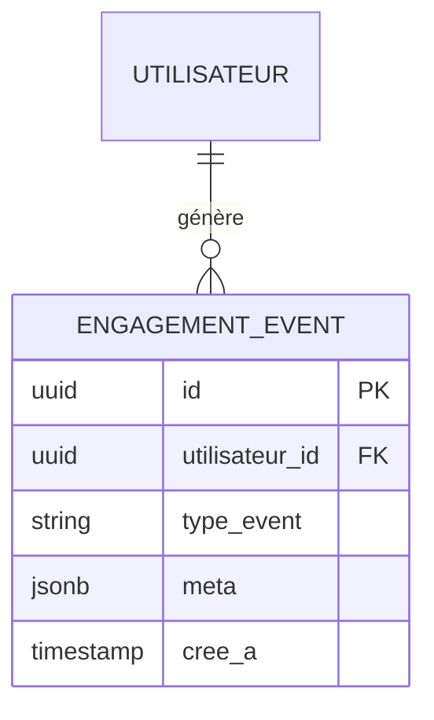

**Diagram sources**
- [engagement.service.ts](file://backend/src/common/services/engagement.service.ts)

**Section sources**
- [engagement.service.ts](file://backend/src/common/services/engagement.service.ts)

## Analyse des dépendances
Les modules communiquent via des services partagés (templates, webhooks, engagement). Les contrôleurs délèguent aux services métier qui interagissent avec la base de données et les services externes.

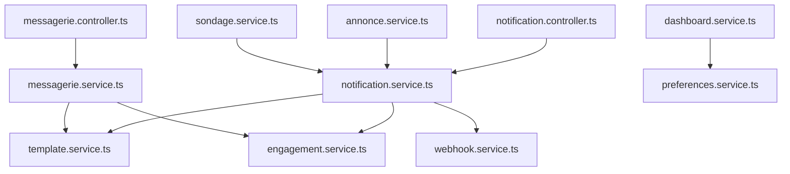

**Diagram sources**
- [messagerie.controller.ts](file://backend/src/modules/messagerie/controllers/messagerie.controller.ts)
- [messagerie.service.ts](file://backend/src/modules/messagerie/services/messagerie.service.ts)
- [notification.controller.ts](file://backend/src/modules/notifications/controllers/notification.controller.ts)
- [notification.service.ts](file://backend/src/modules/notifications/services/notification.service.ts)
- [template.service.ts](file://backend/src/common/services/template.service.ts)
- [webhook.service.ts](file://backend/src/common/services/webhook.service.ts)
- [engagement.service.ts](file://backend/src/common/services/engagement.service.ts)
- [annonce.service.ts](file://backend/src/modules/annonces/services/annonce.service.ts)
- [sondage.service.ts](file://backend/src/modules/sondages/services/sondage.service.ts)
- [dashboard.service.ts](file://backend/src/modules/dashboard/services/dashboard.service.ts)
- [preferences.service.ts](file://backend/src/modules/utilisateurs/services/preferences.service.ts)

**Section sources**
- [messagerie.controller.ts](file://backend/src/modules/messagerie/controllers/messagerie.controller.ts)
- [messagerie.service.ts](file://backend/src/modules/messagerie/services/messagerie.service.ts)
- [notification.controller.ts](file://backend/src/modules/notifications/controllers/notification.controller.ts)
- [notification.service.ts](file://backend/src/modules/notifications/services/notification.service.ts)
- [template.service.ts](file://backend/src/common/services/template.service.ts)
- [webhook.service.ts](file://backend/src/common/services/webhook.service.ts)
- [engagement.service.ts](file://backend/src/common/services/engagement.service.ts)
- [annonce.service.ts](file://backend/src/modules/annonces/services/annonce.service.ts)
- [sondage.service.ts](file://backend/src/modules/sondages/services/sondage.service.ts)
- [dashboard.service.ts](file://backend/src/modules/dashboard/services/dashboard.service.ts)
- [preferences.service.ts](file://backend/src/modules/utilisateurs/services/preferences.service.ts)

## Considérations de performance
- Indexation et vues matérialisées pour annonces et messagerie.
- Files d’attente et batch pour notifications.
- Backoff exponentiel pour retries.
- Agrégations légères pour dashboards.

[No sources needed since this section provides general guidance]

## Guide de dépannage
- Vérifier les logs de delivery et retries des notifications.
- Valider les templates rendus et les variables.
- Examiner les webhooks (signatures, statuts HTTP).
- Contrôler les permissions et ciblages (parents/enseignants).
- Analyser les événements d’engagement pour diagnostics.

**Section sources**
- [notification.service.ts](file://backend/src/modules/notifications/services/notification.service.ts)
- [template.service.ts](file://backend/src/common/services/template.service.ts)
- [webhook.service.ts](file://backend/src/common/services/webhook.service.ts)
- [engagement.service.ts](file://backend/src/common/services/engagement.service.ts)

## Conclusion
Le module de communication et collaboration d’eLISAschool offre une plateforme robuste et extensible, intégrant messagerie, notifications multi-canaux, annonces, sondages, dashboards et portails dédiés. La modularité, les templates centralisés, les webhooks et l’analyse d’engagement permettent une expérience riche et mesurable, tout en garantissant performance et sécurité.

[No sources needed since this section summarizes without analyzing specific files]

## Annexes
- Exemples d’implémentation: suivre les chemins de fichiers mentionnés dans les sections précédentes.
- Schémas de base de données: consulter les migrations SQL associées à chaque module.
- Intégrations externes: configurer providers email/SMS via les services de notification et webhooks.

[No sources needed since this section provides general guidance]