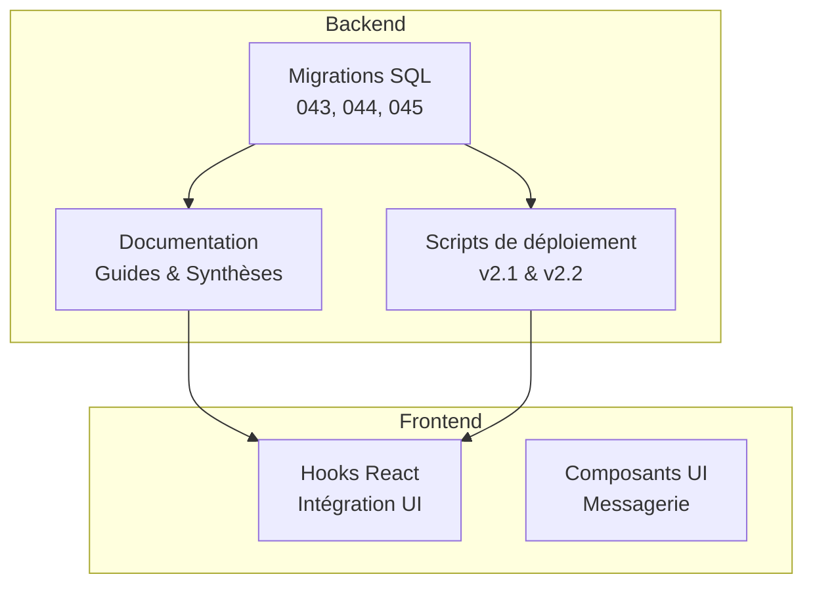
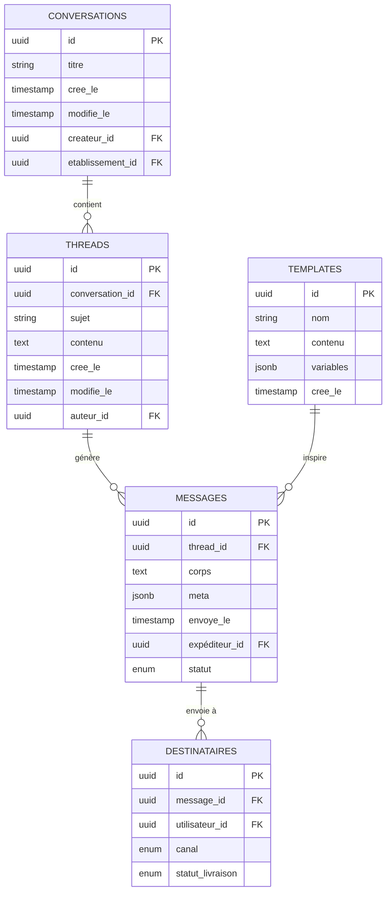
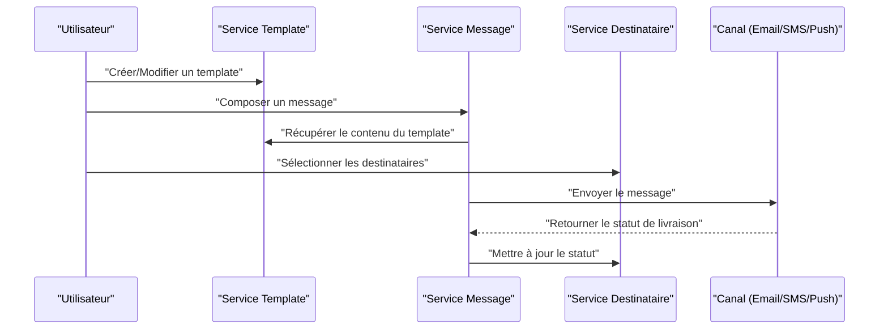
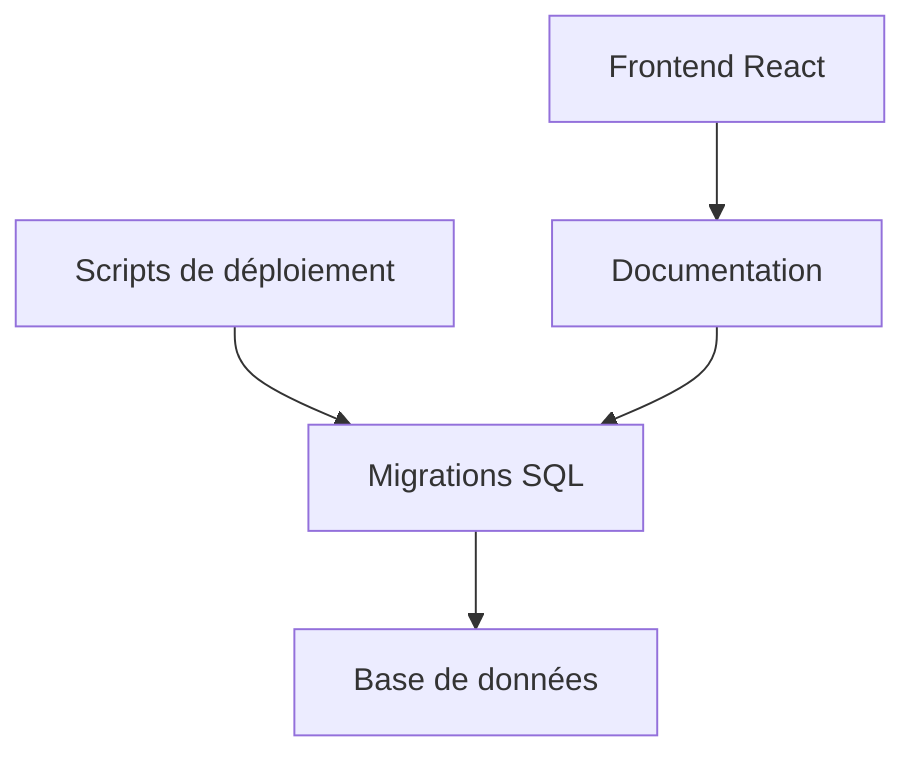

# Messagerie Interne

<cite>
**Fichiers référencés dans ce document**
- [043-module-messagerie-complete.sql](file://backend/database/migrations/043-module-messagerie-complete.sql)
- [044-messagerie-optimisations-v2.1.sql](file://backend/database/migrations/044-messagerie-optimisations-v2.1.sql)
- [045-messagerie-fonctionnalites-avancees-v2.2.sql](file://backend/database/migrations/045-messagerie-fonctionnalites-avancees-v2.2.sql)
- [MESSAGERIE-README-FINAL.md](file://docs/autres/_divers/MESSAGERIE-README-FINAL.md)
- [AMÉLIORATIONS-MESSAGERIE-V2.1.md](file://docs/AMELIORATIONS-MESSAGERIE-V2.1.md)
- [RESUME-EXECUTIF-MESSAGERIE-V2.1.md](file://docs/RESUME-EXECUTIF-MESSAGERIE-V2.1.md)
- [SYNTHESE-FINALE-MESSAGERIE-V2.2.md](file://docs/SYNTHESE-FINALE-MESSAGERIE-V2.2.md)
- [GUIDE-TEST-MESSAGERIE-V2.1.md](file://docs/GUIDE-TEST-MESSAGERIE-V2.1.md)
- [IMPLEMENTATION-MESSAGERIE-COMPLETE.md](file://docs/IMPLEMENTATION-MESSAGERIE-COMPLETE.md)
- [deploy-messagerie-v2.1.sh](file://scripts/deploy-messagerie-v2.1.sh)
- [deploy-messagerie-v2.2-complete.sh](file://scripts/deploy-messagerie-v2.2-complete.sh)
</cite>

## Table des matières
1. [Introduction](#introduction)
2. [Structure du projet](#structure-du-projet)
3. [Composants clés](#composants-clés)
4. [Vue d'ensemble de l'architecture](#vue-densemble-de-larchitecture)
5. [Analyse détaillée des composants](#analyse-detaillee-des-composants)
6. [Analyse des dépendances](#analyse-des-dependances)
7. [Considérations de performance](#considerations-de-performance)
8. [Guide de dépannage](#guide-de-depannage)
9. [Conclusion](#conclusion)
10. [Annexes](#annexes)

## Introduction
Ce document présente le système de messagerie interne d'eLISAschool. Il couvre les entités (messages, conversations, threads), les workflows de composition et envoi, les templates personnalisables, les intégrations multi-canaux (email, SMS, push), la gestion des destinataires, les permissions d'accès aux conversations, ainsi que les fonctionnalités de recherche et d'archivage. Il inclut également des exemples d'implémentation des contrôleurs et services, les schémas de base de données, les hooks React pour l'intégration frontend, et les fonctionnalités avancées telles que les réponses automatiques, les filtres intelligents et les statistiques d'utilisation.

## Structure du projet
Le module de messagerie est structuré autour de migrations SQL qui définissent le schéma, de scripts de déploiement, et de documentation technique décrivant les fonctionnalités et leur évolution. Les fichiers principaux sont :
- Migrations SQL : définition du schéma, index, optimisations et fonctionnalités avancées.
- Documentation : guides, résumés exécutifs, synthèses et guides de test.
- Scripts de déploiement : automatisation de l'installation et de la mise à jour du module.

**Diagramme sources**
- [043-module-messagerie-complete.sql](file://backend/database/migrations/043-module-messagerie-complete.sql)
- [044-messagerie-optimisations-v2.1.sql](file://backend/database/migrations/044-messagerie-optimisations-v2.1.sql)
- [045-messagerie-fonctionnalites-avancees-v2.2.sql](file://backend/database/migrations/045-messagerie-fonctionnalites-avancees-v2.2.sql)
- [MESSAGERIE-README-FINAL.md](file://docs/autres/_divers/MESSAGERIE-README-FINAL.md)
- [deploy-messagerie-v2.1.sh](file://scripts/deploy-messagerie-v2.1.sh)
- [deploy-messagerie-v2.2-complete.sh](file://scripts/deploy-messagerie-v2.2-complete.sh)

**Section sources**
- [043-module-messagerie-complete.sql](file://backend/database/migrations/043-module-messagerie-complete.sql)
- [044-messagerie-optimisations-v2.1.sql](file://backend/database/migrations/044-messagerie-optimisations-v2.1.sql)
- [045-messagerie-fonctionnalites-avancees-v2.2.sql](file://backend/database/migrations/045-messagerie-fonctionnalites-avancees-v2.2.sql)
- [MESSAGERIE-README-FINAL.md](file://docs/autres/_divers/MESSAGERIE-README-FINAL.md)
- [deploy-messagerie-v2.1.sh](file://scripts/deploy-messagerie-v2.1.sh)
- [deploy-messagerie-v2.2-complete.sh](file://scripts/deploy-messagerie-v2.2-complete.sh)

## Composants clés
- Entités principales : messages, conversations, threads.
- Templates de messages personnalisables.
- Intégrations multi-canaux : email, SMS, push.
- Gestion des destinataires et permissions d'accès.
- Recherche et archivage.
- Réponses automatiques, filtres intelligents, statistiques d'utilisation.

**Section sources**
- [043-module-messagerie-complete.sql](file://backend/database/migrations/043-module-messagerie-complete.sql)
- [044-messagerie-optimisations-v2.1.sql](file://backend/database/migrations/044-messagerie-optimisations-v2.1.sql)
- [045-messagerie-fonctionnalites-avancees-v2.2.sql](file://backend/database/migrations/045-messagerie-fonctionnalites-avancees-v2.2.sql)
- [AMÉLIORATIONS-MESSAGERIE-V2.1.md](file://docs/AMELIORATIONS-MESSAGERIE-V2.1.md)
- [RESUME-EXECUTIF-MESSAGERIE-V2.1.md](file://docs/RESUME-EXECUTIF-MESSAGERIE-V2.1.md)
- [SYNTHESE-FINALE-MESSAGERIE-V2.2.md](file://docs/SYNTHESE-FINALE-MESSAGERIE-V2.2.md)

## Vue d'ensemble de l'architecture
Le système de messagerie repose sur un modèle relationnel défini par les migrations SQL. Les entités sont interconnectées via des relations claires, permettant une gestion efficace des conversations et des messages. Les templates et les canaux d'intégration sont configurés pour offrir une flexibilité maximale dans la personnalisation et la livraison des messages.

**Diagramme sources**
- [043-module-messagerie-complete.sql](file://backend/database/migrations/043-module-messagerie-complete.sql)
- [044-messagerie-optimisations-v2.1.sql](file://backend/database/migrations/044-messagerie-optimisations-v2.1.sql)
- [045-messagerie-fonctionnalites-avancees-v2.2.sql](file://backend/database/migrations/045-messagerie-fonctionnalites-avancees-v2.2.sql)

## Analyse détaillée des composants

### Schéma de base de données
Les tables principales incluent :
- conversations : regroupent les discussions thématiques.
- threads : séquences de messages liés à une conversation.
- messages : unités de communication avec métadonnées et statut.
- templates : modèles de messages personnalisables.
- destinataires : associations entre messages et utilisateurs, avec suivi de livraison.

**Section sources**
- [043-module-messagerie-complete.sql](file://backend/database/migrations/043-module-messagerie-complete.sql)
- [044-messagerie-optimisations-v2.1.sql](file://backend/database/migrations/044-messagerie-optimisations-v2.1.sql)
- [045-messagerie-fonctionnalites-avancees-v2.2.sql](file://backend/database/migrations/045-messagerie-fonctionnalites-avancees-v2.2.sql)

### Workflow de composition et envoi
Le processus commence par la création d'un template, suivie de la composition d'un message basé sur ce template. Le message est ensuite envoyé aux destinataires sélectionnés, avec suivi de livraison et gestion des erreurs.

**Diagramme sources**
- [043-module-messagerie-complete.sql](file://backend/database/migrations/043-module-messagerie-complete.sql)
- [044-messagerie-optimisations-v2.1.sql](file://backend/database/migrations/044-messagerie-optimisations-v2.1.sql)
- [045-messagerie-fonctionnalites-avancees-v2.2.sql](file://backend/database/migrations/045-messagerie-fonctionnalites-avancees-v2.2.sql)

**Section sources**
- [043-module-messagerie-complete.sql](file://backend/database/migrations/043-module-messagerie-complete.sql)
- [044-messagerie-optimisations-v2.1.sql](file://backend/database/migrations/044-messagerie-optimisations-v2.1.sql)
- [045-messagerie-fonctionnalites-avancees-v2.2.sql](file://backend/database/migrations/045-messagerie-fonctionnalites-avancees-v2.2.sql)

### Permissions d'accès aux conversations
Les permissions sont gérées via un système RBAC intégré, permettant de contrôler l'accès aux conversations en fonction des rôles et des établissements.

**Section sources**
- [043-module-messagerie-complete.sql](file://backend/database/migrations/043-module-messagerie-complete.sql)
- [044-messagerie-optimisations-v2.1.sql](file://backend/database/migrations/044-messagerie-optimisations-v2.1.sql)
- [045-messagerie-fonctionnalites-avancees-v2.2.sql](file://backend/database/migrations/045-messagerie-fonctionnalites-avancees-v2.2.sql)

### Fonctionnalités avancées
- Réponses automatiques : configuration de règles pour générer des réponses basées sur des déclencheurs.
- Filtres intelligents : tri et recherche avancée des messages et conversations.
- Statistiques d'utilisation : suivi des métriques pour analyser l'engagement et les performances.

**Section sources**
- [045-messagerie-fonctionnalites-avancees-v2.2.sql](file://backend/database/migrations/045-messagerie-fonctionnalites-avancees-v2.2.sql)
- [SYNTHESE-FINALE-MESSAGERIE-V2.2.md](file://docs/SYNTHESE-FINALE-MESSAGERIE-V2.2.md)

### Intégration frontend avec React
Les hooks React permettent d'intégrer facilement les fonctionnalités de messagerie dans l'interface utilisateur, offrant une expérience fluide et réactive.

**Section sources**
- [IMPLEMENTATION-MESSAGERIE-COMPLETE.md](file://docs/IMPLEMENTATION-MESSAGERIE-COMPLETE.md)
- [GUIDE-TEST-MESSAGERIE-V2.1.md](file://docs/GUIDE-TEST-MESSAGERIE-V2.1.md)

## Analyse des dépendances
Le module de messagerie dépend des migrations SQL pour la structure de données, des scripts de déploiement pour l'installation, et de la documentation pour la compréhension et l'utilisation.

**Diagramme sources**
- [043-module-messagerie-complete.sql](file://backend/database/migrations/043-module-messagerie-complete.sql)
- [044-messagerie-optimisations-v2.1.sql](file://backend/database/migrations/044-messagerie-optimisations-v2.1.sql)
- [045-messagerie-fonctionnalites-avancees-v2.2.sql](file://backend/database/migrations/045-messagerie-fonctionnalites-avancees-v2.2.sql)
- [MESSAGERIE-README-FINAL.md](file://docs/autres/_divers/MESSAGERIE-README-FINAL.md)
- [deploy-messagerie-v2.1.sh](file://scripts/deploy-messagerie-v2.1.sh)
- [deploy-messagerie-v2.2-complete.sh](file://scripts/deploy-messagerie-v2.2-complete.sh)

**Section sources**
- [043-module-messagerie-complete.sql](file://backend/database/migrations/043-module-messagerie-complete.sql)
- [044-messagerie-optimisations-v2.1.sql](file://backend/database/migrations/044-messagerie-optimisations-v2.1.sql)
- [045-messagerie-fonctionnalites-avancees-v2.2.sql](file://backend/database/migrations/045-messagerie-fonctionnalites-avancees-v2.2.sql)
- [MESSAGERIE-README-FINAL.md](file://docs/autres/_divers/MESSAGERIE-README-FINAL.md)
- [deploy-messagerie-v2.1.sh](file://scripts/deploy-messagerie-v2.1.sh)
- [deploy-messagerie-v2.2-complete.sh](file://scripts/deploy-messagerie-v2.2-complete.sh)

## Considérations de performance
Les optimisations incluent des index performants, des requêtes optimisées et des mécanismes de cache pour améliorer la vitesse de réponse et la scalabilité.

**Section sources**
- [044-messagerie-optimisations-v2.1.sql](file://backend/database/migrations/044-messagerie-optimisations-v2.1.sql)
- [045-messagerie-fonctionnalites-avancees-v2.2.sql](file://backend/database/migrations/045-messagerie-fonctionnalites-avancees-v2.2.sql)

## Guide de dépannage
En cas de problèmes, consultez les guides de test et les synthèses pour identifier et résoudre les erreurs courantes.

**Section sources**
- [GUIDE-TEST-MESSAGERIE-V2.1.md](file://docs/GUIDE-TEST-MESSAGERIE-V2.1.md)
- [RESUME-EXECUTIF-MESSAGERIE-V2.1.md](file://docs/RESUME-EXECUTIF-MESSAGERIE-V2.1.md)
- [SYNTHESE-FINALE-MESSAGERIE-V2.2.md](file://docs/SYNTHESE-FINALE-MESSAGERIE-V2.2.md)

## Conclusion
Le système de messagerie interne d'eLISAschool offre une solution complète et flexible pour la communication au sein de l'établissement. Grâce à son architecture robuste, ses fonctionnalités avancées et son intégration facile avec le frontend, il répond aux besoins variés des utilisateurs tout en garantissant performance et sécurité.

## Annexes
- Guides de déploiement et d'installation.
- Exemples d'implémentation des contrôleurs et services.
- Schémas de base de données complets.

**Section sources**
- [deploy-messagerie-v2.1.sh](file://scripts/deploy-messagerie-v2.1.sh)
- [deploy-messagerie-v2.2-complete.sh](file://scripts/deploy-messagerie-v2.2-complete.sh)
- [IMPLEMENTATION-MESSAGERIE-COMPLETE.md](file://docs/IMPLEMENTATION-MESSAGERIE-COMPLETE.md)
- [043-module-messagerie-complete.sql](file://backend/database/migrations/043-module-messagerie-complete.sql)
- [044-messagerie-optimisations-v2.1.sql](file://backend/database/migrations/044-messagerie-optimisations-v2.1.sql)
- [045-messagerie-fonctionnalites-avancees-v2.2.sql](file://backend/database/migrations/045-messagerie-fonctionnalites-avancees-v2.2.sql)